# 操作系统课：Agentic AI 时代的绪论

> **课程**：2026 春季学期《操作系统原理》，第 1 讲  
> **讲师**：蒋炎岩（jyy）  
> **官方课程主页**：<https://jyywiki.cn/OS/2026/>  
> **官方讲义**：<https://jyywiki.cn/OS/2026/lect1.md>  
> **视频来源**：<https://www.bilibili.com/video/BV1opAfzpEf9/>  
> **版权说明**：课程讲义与幻灯片归蒋炎岩所有，采用 [Creative Commons BY-NC 4.0](http://creativecommons.org/licenses/by-nc/4.0/) 许可；本电子书是对课堂讲授的书面化重构，保留出处与许可说明。

## 导读：为什么第一节课先讨论时代

*(参考时间: 00:00:00)*

这不是一门从“内核第一行代码”开始讲起的操作系统课。课程明确砍掉了传统操作系统课程中的大量内核实现内容，把重心放在一个更贴近应用开发者的问题上：

> **操作系统给应用程序提供了什么？为什么这些接口能够支撑今天如此庞大的软件生态？**

课程希望每位同学在每一讲结束时都真正获得一点新能力：理解一个操作系统对象、一个 API、一种抽象，并知道如何把它用于实现自己的软件。

第一讲不急于进入系统调用，而先回答一个看似基础却越来越重要的问题：在 AI 已经能够写代码、调用工具、生成界面的时代，为什么还要学习操作系统？

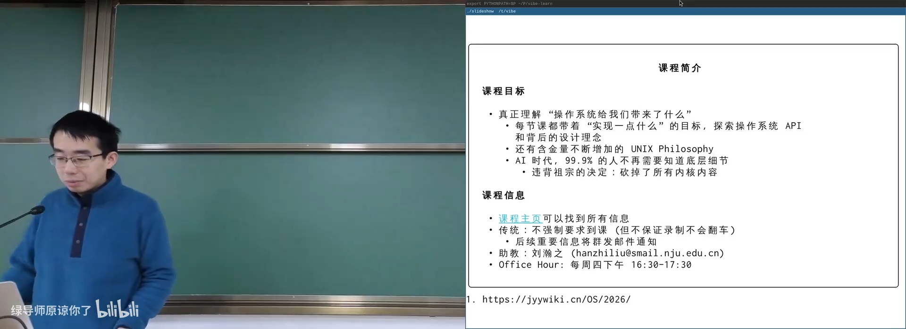

---

## 1. 课程信息与学习约定

### 1.1 课程目标的改变

*(参考时间: 00:03:12)*

蒋老师把课程设计为 3 学分主线，并额外安排与操作系统相关的扩展内容。课程希望聚焦于操作系统与应用程序之间的接口，而不是要求每个人都从零实现一个内核。

原因很直接：在 AI 时代，大部分人不一定需要知道最底层的实现细节，但理解操作系统提供的抽象，仍然是控制复杂软件系统的基础。

课程会反复强调 UNIX Philosophy：

- 每个程序只做好一件事；
- 每个程序的输出可以作为另一个程序的输入；
- 使用文本接口促进组合；
- 通过小而清晰的工具构建大型系统。

这些原则在今天的 Coding Agent、Shell、Skill 和工具调用设计中重新变得重要。

### 1.2 成绩与学习方式

课程成绩由以下部分组成：

- 期末考试：50%；
- 随堂期中测验：10%；
- 编程实验：40%。

实验以 MiniLab 为主，目标不是机械地堆功能，而是理解和掌控操作系统的 API。课程明确要求遵守 Academic Integrity 与 AIGC Policy：

- 日常学习、概念解释、调试方法和局部 API 示例可以积极使用 AI；
- 禁止把自然语言需求直接翻译成完整实验代码后提交；
- 需要自己理解代码在整体系统中的位置、交互方式与设计原因。

一个合法示例是：

> “请解释如何调用 `pipe()`，并把读端和写端分别赋值给 `read_fd`、`write_fd`。”

一个不被允许的示例是：

> “帮我完成整个实验，测试通过后直接提交。”

课程真正希望培养的不是“不使用 AI”，而是在 AI 帮助下建立正确的概念体系，并保留人类对复杂系统的顶层设计能力。

### 1.3 反馈与交流

课程信息集中在官方主页。讲师承诺邮件会 100% 回复；B 站评论和线上反馈会阅读，但不能保证逐条回复。对于批评，讲师更关注批评背后的原因：如果某个问题可以通过修改设计来解决，就值得认真考虑。

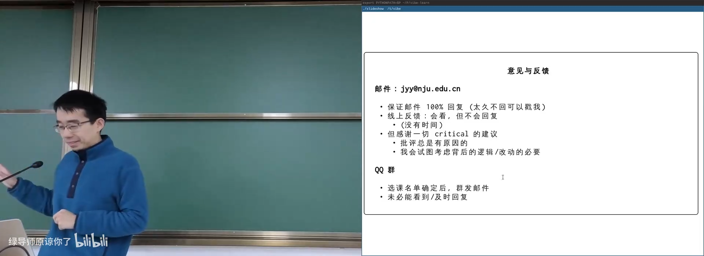

---

## 2. 从算法时代到 AI 时代

### 2.1 AC 05 年：一个新的计时方式

*(参考时间: 00:13:00)*

讲师用 **AC（Anno ChatGPT）** 标记 ChatGPT 出现后的年份：2026 年是 GPT 诞生后的第 5 年，也就是 AC 05。

五年前，语言模型有时甚至无法稳定地从 50 连续数到 100。随后，强化学习与推理模型显著提升了逻辑推理能力。课堂提到的变化包括：

- 模型在竞赛类任务中的表现快速提高；
- 指令遵循和幻觉抑制能力显著增强；
- 上下文窗口从 128K 扩展到 1M；
- Agent 从“勉强能用”发展为“非常能用”；
- 开源模型与专用推理硬件的速度不断提高。

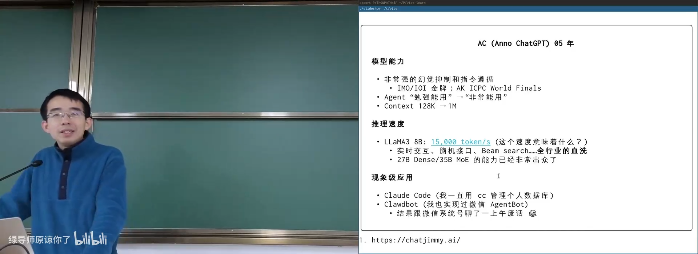

### 2.2 速度改变交互方式

课堂提到一种极高的推理吞吐：每秒生成约 15,000 个 token。对于人来说，这意味着刚按下回车，几页代码或翻译结果就已经生成完毕。

速度并不只是“等待时间变短”。当推理足够快，就可能出现新的交互形态：

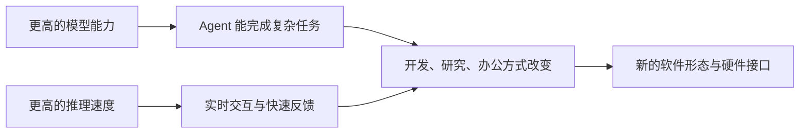
```mermaid
flowchart LR
    A["更高的模型能力"] --> C["Agent 能完成复杂任务"]
    B["更高的推理速度"] --> D["实时交互与快速反馈"]
    C --> E["开发、研究、办公方式改变"]
    D --> E
    E --> F["新的软件形态与硬件接口"]
```

### 2.3 Coding Agent 有了“手和脚”

普通聊天机器人只能在对话窗口中输出文本。Coding Agent 则能够读取文件、修改项目、运行命令、访问网络、调用工具，并与环境发生真实交互。

这意味着：

- Agent 能帮助管理个人数据与重复事务；
- Agent 能读写整个代码仓库；
- Agent 能调用服务、生成界面、执行调试；
- Agent 也可能执行危险操作，例如误删文件或修改错误配置。

安全、权限、隔离、进程和文件系统因此不是旧知识，而是 Agent 能够可靠工作的底座。

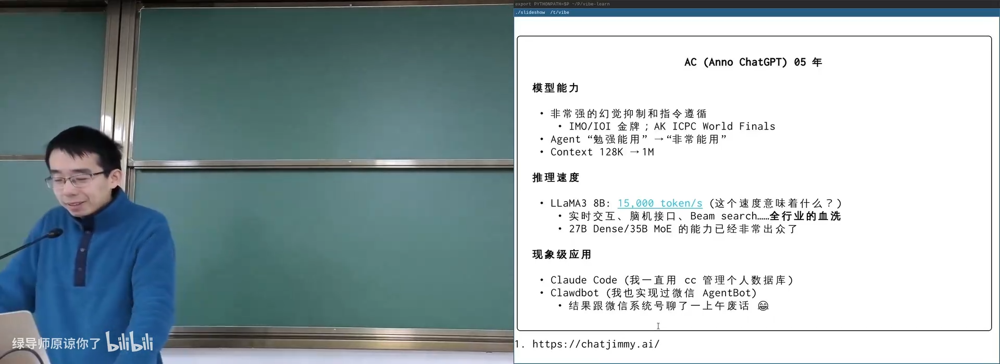

---

## 3. 软件工程师的工作正在发生什么变化

### 3.1 算法时代：解决 well-formed 问题

传统计算模型擅长解决数学上定义清晰的问题。例如最短路可以严格定义为图上的一个优化问题：

```text
给定带权图 G = (V, E)
寻找一条从 s 到 t 的路径 P
使得路径边权之和最小
```

计算机并不直接理解“用户想少走一点路”或者“我希望路线风景好一点”。软件工程师的工作，是把现实世界模糊、杂乱的需求翻译成计算机能够求解的数学问题，再通过 App、GUI 或 API 提供给用户。

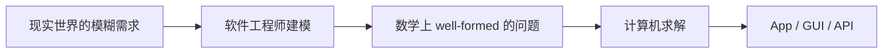
```mermaid
flowchart LR
    R["现实世界的模糊需求"] --> S["软件工程师建模"]
    S --> M["数学上 well-formed 的问题"]
    M --> C["计算机求解"]
    C --> U["App / GUI / API"]
```

### 3.2 AI 时代：直接处理 ill-formed 问题

语言模型擅长处理自然语言这种不规整输入。即使需求没有完全说清楚，它也可能推断出合理目标，再把任务拆分成可执行步骤。

新一代 Agent 还可以：

- 从 ill-formed 需求中提取 well-formed 子问题；
- 调用数学工具、搜索工具或代码执行器；
- 动态生成文本、图像、声音和界面；
- 根据用户特征生成个性化交互。

未来应用可能不再需要为每个人提供完全相同的界面。手机系统可以在用户提出“帮我点一杯奶茶”后，把请求转交给服务提供商，再由 AI 动态生成一份适合当前用户的网页。

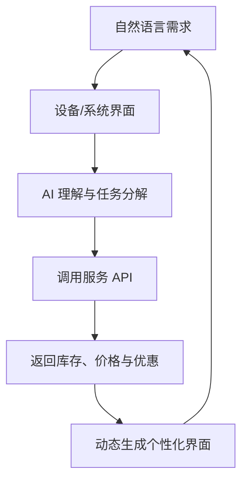
```mermaid
flowchart TD
    U["自然语言需求"] --> OS["设备/系统界面"]
    OS --> A["AI 理解与任务分解"]
    A --> S["调用服务 API"]
    S --> D["返回库存、价格与优惠"]
    D --> G["动态生成个性化界面"]
    G --> U
```

对老年用户可以自动放大字体；对色觉异常用户可以采用更合适的配色。界面不再由软件工程师为所有用户一次性设计，而可能由 AI 根据上下文实时生成。

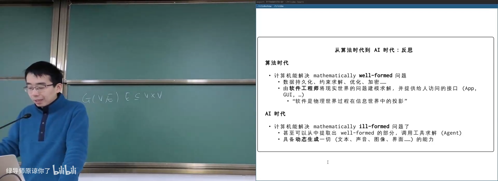

---

## 4. AI 时代仍然需要抽象

### 4.1 AI 的边界：复杂系统的顶层设计

AI 已经能够完成大量编码执行工作，但在讲师看来，它仍然不擅长真正复杂的系统抽象。复杂系统不是“写一个内核函数”这么简单，而是要支撑整个应用生态：

- 百万、千万级应用如何共享系统资源；
- 成千上万种硬件如何被统一管理；
- 不同安全等级的程序如何隔离；
- 一个接口如何在很多年内保持稳定；
- 系统如何高效、可靠、可扩展。

这类问题的核心是：**设计什么样的抽象层，向下依赖硬件，向上服务应用。**

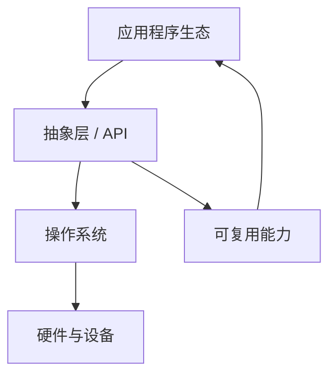
```mermaid
flowchart TD
    A["应用程序生态"] --> B["抽象层 / API"]
    B --> C["操作系统"]
    C --> D["硬件与设备"]
    B --> E["可复用能力"]
    E --> A
```

操作系统课最有价值的 takeaway，不是背住某一个系统调用，而是学习如何设计抽象：

- 接口要对上层友好；
- 实现要对下层可行；
- 能逐步组合出更大的生态；
- 能在复杂性与性能之间取得平衡。

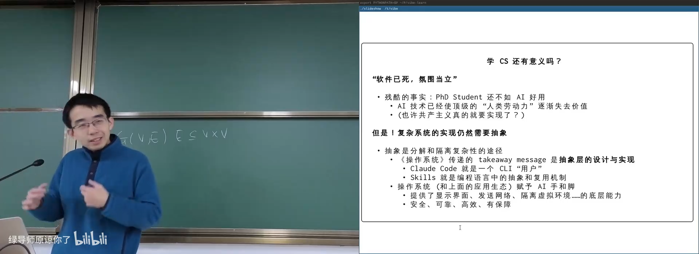

### 4.2 操作系统是 AI 的“手和脚”

Agent 能够执行任务，最终仍然依赖操作系统提供的能力：

- 创建进程和隔离虚拟环境；
- 读写文件与目录；
- 通过网络通信；
- 访问显示器、键盘和 GPU；
- 管理权限与安全边界；
- 调度 CPU 和内存。

如果没有操作系统，Agent 只能产生文本，无法可靠地改变真实世界。操作系统支撑了 AI 的“手和脚”。

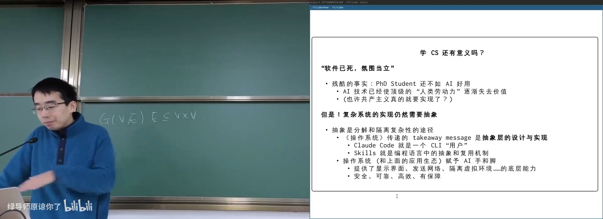

### 4.3 最后一门编程课

课程把操作系统视为“最后一门编程课”。学完之后，应当能够回答许多日常现象背后的原因：

- 为什么程序能创建窗口？
- 为什么网页能够显示内容？
- 为什么有时 `Ctrl-C` 不能退出程序？
- 为什么一个死循环不会把整台计算机彻底卡死？
- 为什么服务器 CPU 利用率只有 10%，如何把所有核心用满？
- 浏览器、编译器、游戏、外挂、杀毒软件和病毒分别依赖哪些系统能力？

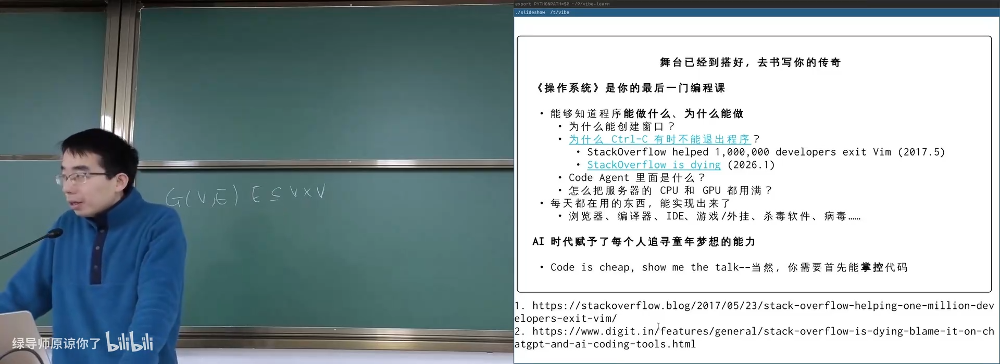

例如，Vim 中 `Ctrl-C` 不能退出曾帮助一百万开发者困扰。程序如何接收信号、信号默认行为是什么、程序是否捕获或屏蔽信号，都属于操作系统提供的进程控制机制。

过去常说：

> Talk is cheap, show me the code.

在 AI 时代，这句话可以变成：

> Code is cheap, show me the talk.

只要能把问题、目标和约束表达清楚，AI 就可以帮助生成大量代码。但前提仍然是：**人必须能够掌控代码和复杂系统。**

---

## 5. 什么是操作系统

### 5.1 定义不是重点，发展过程才是重点

*(参考时间: 00:39:18)*

OSTEP 给出的经典定义是：

> Operating System: A body of software that is responsible for making it easy to run programs, allowing programs to share memory, enabling programs to interact with devices, and other fun stuff like that.

这个定义高度概括，但会压缩掉大量历史背景与设计权衡。课程不要求背诵定义，而要求理解：

- 操作系统为什么会出现？
- 它如何从简单管理程序发展为现代系统？
- 它给应用提供了哪些对象和 API？
- 这些接口如何支撑今天的生态？

可以把三个角色画成一条纵向结构：

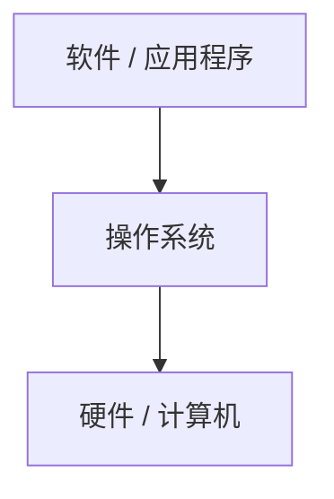
```mermaid
flowchart TD
    S["软件 / 应用程序"]
    O["操作系统"]
    H["硬件 / 计算机"]
    S --> O --> H
```

理解操作系统，就是同时理解硬件如何工作、软件如何运行，以及夹在两者之间的管理层如何设计。

### 5.2 硬件：一个状态机

数字电路课程中的基本组件可以归纳为：

- 导线；
- 时钟；
- 逻辑门；
- 触发器。

这些组件足以构建非常复杂的数字系统。计算机在每个时钟周期读取当前寄存器状态，经过组合逻辑计算，再在时钟边沿更新下一状态。

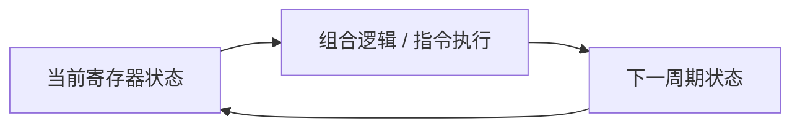
```mermaid
flowchart LR
    S["当前寄存器状态"] --> L["组合逻辑 / 指令执行"]
    L --> N["下一周期状态"]
    N --> S
```

因此，硬件可以被理解为一个状态机。所谓取指令、译码、执行，只是状态转移的一种实现方式。

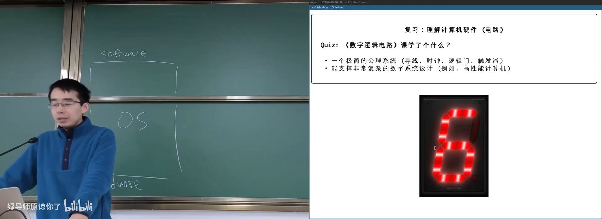

课堂展示了数字逻辑电路模拟器，以及能够在 C 语言模拟器中运行的 RISC-V32IMA 系统。只要有合适的状态机模型，我们甚至可以模拟“几乎任意复杂”的计算机系统。

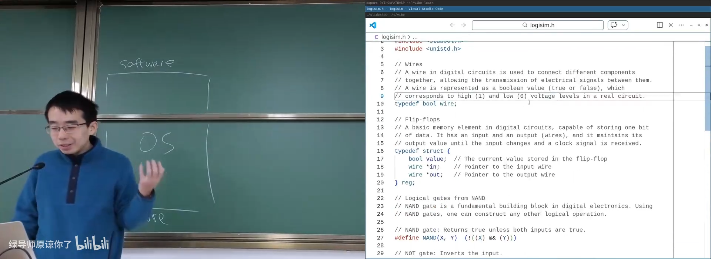

### 5.3 软件：另一个状态机

高级语言程序经过编译、链接后变成二进制文件，最终由处理器执行。程序的状态包括：

- 寄存器值；
- 内存内容；
- Program Counter；
- 调用栈；
- 文件描述符与打开对象；
- 等待中的信号与 I/O。

程序模型必须与硬件模型兼容，否则程序无法在硬件上执行。

一个递归算法之所以难以理解，是因为 C/C++ 具有顺序执行语义，函数调用还会产生全局副作用。汉诺塔必须按特定顺序调用 `f(n-1)`、`f(n-2)` 和打印操作，交换顺序就会改变输出。

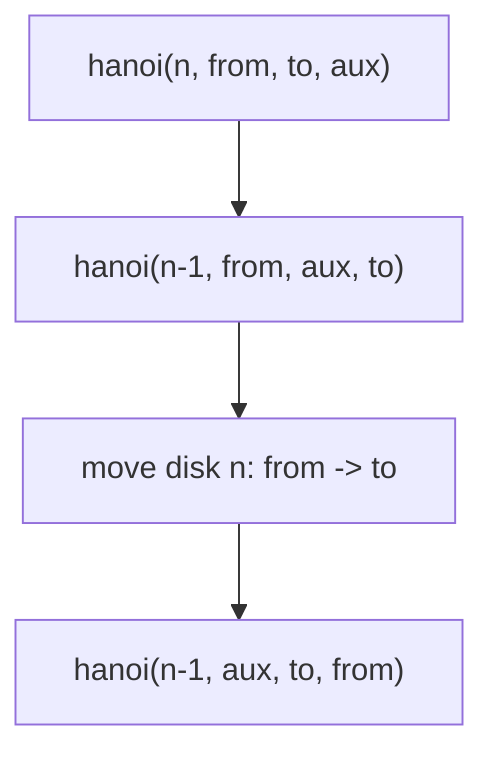
```mermaid
flowchart TD
    A["hanoi(n, from, to, aux)"] --> B["hanoi(n-1, from, aux, to)"]
    B --> C["move disk n: from -> to"]
    C --> D["hanoi(n-1, aux, to, from)"]
```

调试器可以把程序状态可视化：查看当前栈、PC 和变量，再一步步执行状态转移。

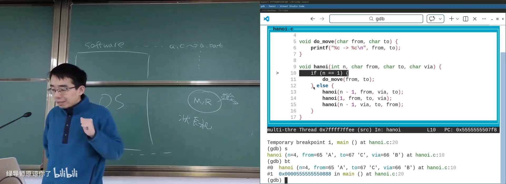

课堂使用 AI 生成了一个汉诺塔可视化调试器，让抽象的递归栈变成可观察、可操作的状态。

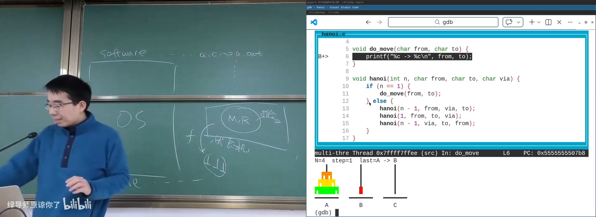

### 5.4 操作系统：管理程序状态的软件

操作系统夹在硬件和应用程序之间。从应用视角看，操作系统是一组 API；从系统视角看，操作系统管理一组对象：

- 进程与线程；
- 地址空间；
- 文件与目录；
- 设备与驱动；
- 网络连接；
- 权限、信号与资源限制。

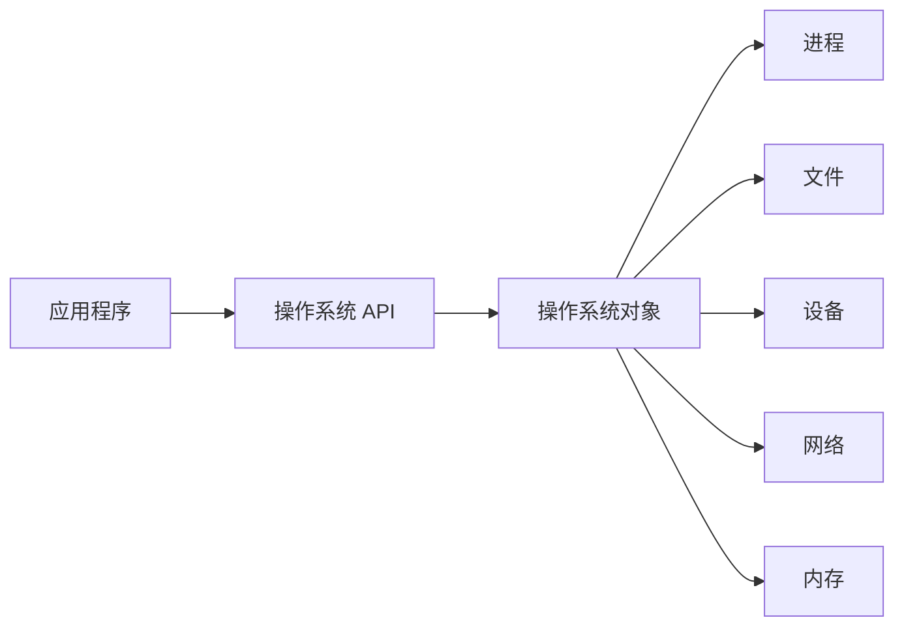
```mermaid
flowchart LR
    A["应用程序"] --> API["操作系统 API"]
    API --> O["操作系统对象"]
    O --> P["进程"]
    O --> F["文件"]
    O --> D["设备"]
    O --> N["网络"]
    O --> M["内存"]
```

应用程序通过系统调用访问这些对象，也可以控制其他程序。例如发送信号、终止进程、创建子进程、建立连接、读写设备。

这个抽象模型可以推广到其他系统：

- 对多台机器抽象，得到分布式系统；
- 对存储设备抽象，得到存储系统；
- 对 GPU 大量核心抽象，得到 CUDA 等并行编程模型。

理解操作系统的方法，是重新走一遍硬件与应用的发展历史。

---

## 6. Content as Code：用代码组织整个课程

*(参考时间: 00:48:42)*

本课程本身也是一次 Content as Code 实验。幻灯片、演示、日志、讲义和课堂辅助工具都尽量用代码描述。

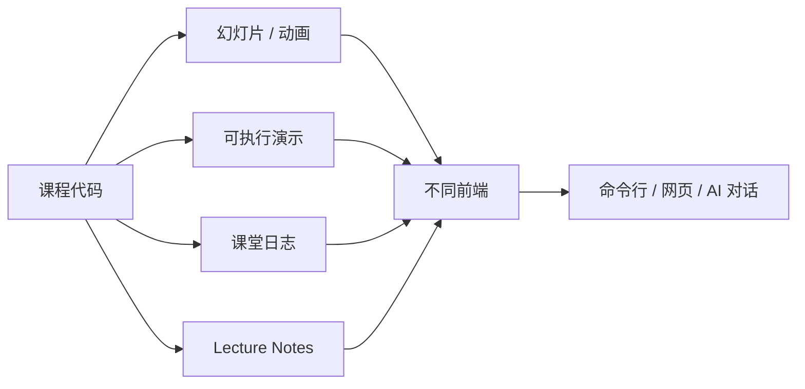
```mermaid
flowchart LR
    C["课程代码"] --> S["幻灯片 / 动画"]
    C --> D["可执行演示"]
    C --> L["课堂日志"]
    C --> N["Lecture Notes"]
    S --> O["不同前端"]
    D --> O
    L --> O
    N --> O
    O --> A["命令行 / 网页 / AI 对话"]
```

以代码表示内容的好处是：

- 人类可以阅读和修改；
- AI 可以理解、重构和扩展；
- 机器可以直接执行；
- 日志可以自动生成讲义和课程版本；
- 同一份内容可以适配不同听众和不同交互界面。

课堂甚至设想为不同学生生成定制化课程：使用不同例子、不同视觉形象与不同讲解方式，但保持相同的核心知识结构。

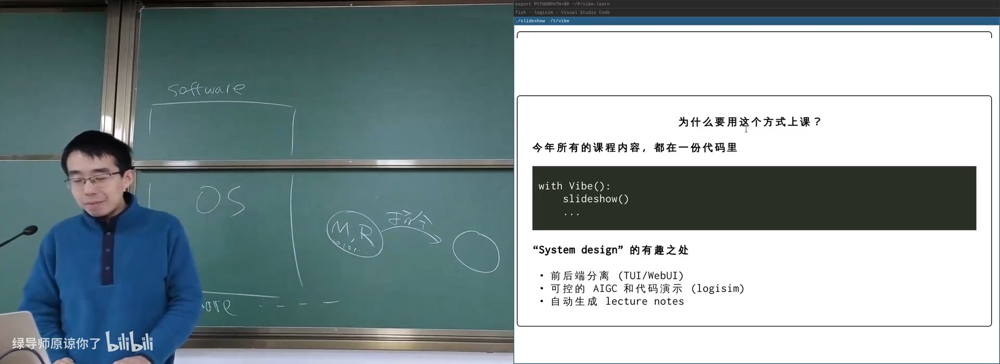

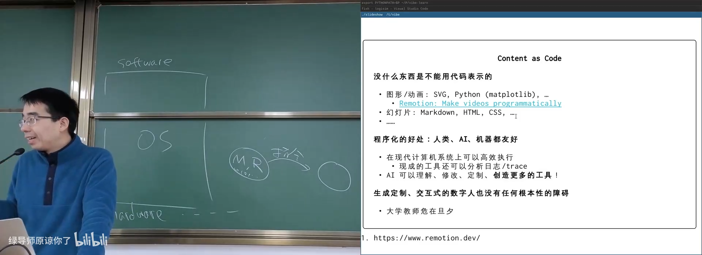

### 6.1 UNIX 管道：小工具的组合力量

课程展示的第一个彩蛋是一个输出文本状态的数字电路模拟器。程序只打印类似：

```text
A=0; B=1; C=1; D=0;
```

另一个小程序读取这些状态并渲染数码管。两个程序通过管道连接，就得到可视化结果。

```bash
logisim | seven-segment-renderer
```

这体现了 UNIX 的核心设计：

> 一个程序的输出，可以成为另一个程序的输入。

AI 时代出现 Skills、MCP 和工具调用，但编程语言仍然拥有一项强大特性：**任意组合与低成本复用**。Skill 和工具可以扩展 Agent 的能力，而 Shell 管道展示了更底层的组合模型。

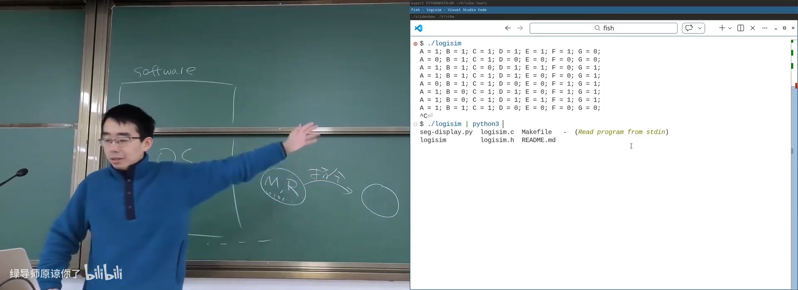

---

## 7. 操作系统的发展历史

### 7.1 1940s：没有操作系统

*(参考时间: 01:05:52)*

1946 年公开的 ENIAC 可以看作图灵机的一种数字电路实现。它同样遵循状态机模型，也有 Program Counter，但 next PC 由物理接线决定，重新编程需要改变接线。

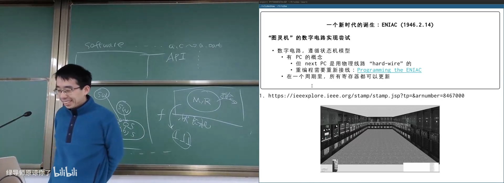

当时的硬件包括：

- 真空电子管逻辑；
- 水银延迟线存储器；
- 打孔纸带与指示灯 I/O。

延迟线利用声波或电信号在介质中传播，把一串 bit 循环送回输入端，从而实现临时存储。输入输出则是机械纸带打孔。

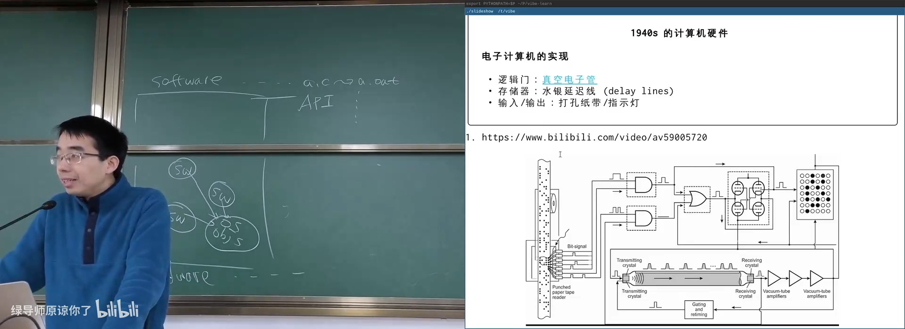

最早的软件用于计算平方数、素数表和弹道轨迹。程序设计课常以“判断素数”为循环示例，并非偶然，它来自早期计算任务的历史。

当时如果有问题，程序员面对的是真正的 bug：昆虫卡在继电器中导致机器故障。1940 年代没有操作系统，程序直接操作硬件，能把纸带上的程序成功运行起来就已经很了不起。

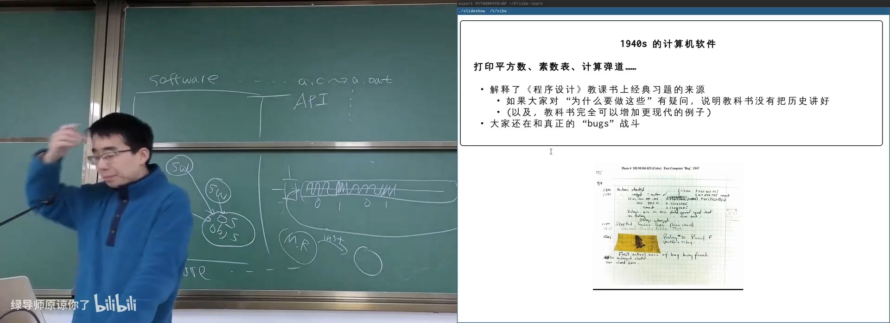

讲师把这个阶段类比为今天的 Agents、MCP 和 Skills：体系刚刚形成，工具链简单，基础设施尚未标准化，但新的可能性正在出现。

### 7.2 1950s-1960s：批处理与作业调度

晶体管、磁芯内存、更丰富的 I/O 设备出现后，处理器速度开始远远高于机械 I/O。中断机制出现，使设备可以在完成操作后通知 CPU。

Fortran 让程序员可以写一行代码对应一张打孔卡片。科学、工程和军事需求迅速增长，但计算机极其昂贵，通常整个学校只有一台。

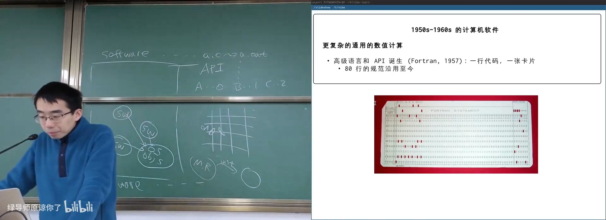

大量用户需要共享同一台机器，于是出现：

- 公用库函数；
- 作业装载与退出代码；
- 作业排队与调度；
- 面向操作员的管理程序。

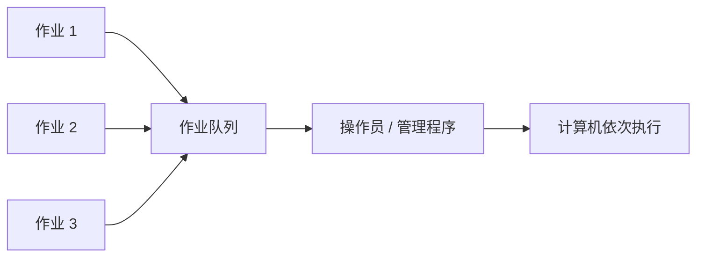
```mermaid
flowchart LR
    J1["作业 1"] --> Q["作业队列"]
    J2["作业 2"] --> Q
    J3["作业 3"] --> Q
    Q --> O["操作员 / 管理程序"]
    O --> C["计算机依次执行"]
```

“Operating System” 在这个阶段更像围绕机器操作员建立的一套作业管理系统，因此在繁体中文中也常译为“作業系統”。

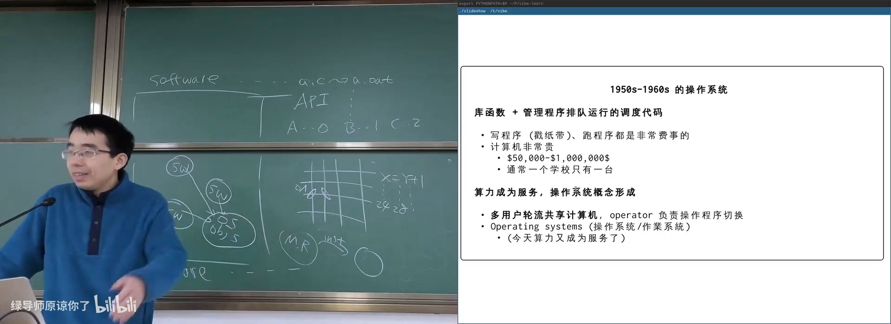

### 7.3 1960s-1970s：多道程序与时分复用

集成电路和总线出现后，内存变得更快、更大，虚拟存储开始发展。内存第一次能够同时容纳多个程序。

当一个程序等待 I/O 时，CPU 可以切换到另一个程序；等 I/O 完成后，再恢复原程序。这形成了最早的 **多道程序（multiprogramming）**。

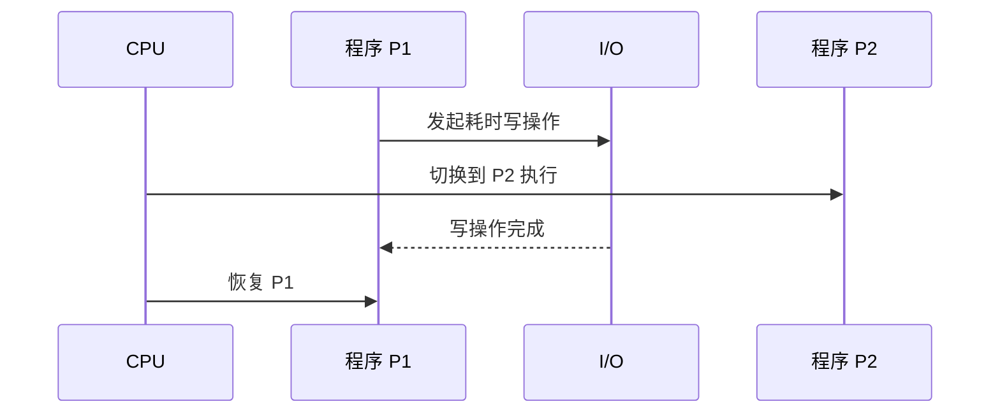
```mermaid
sequenceDiagram
    participant CPU
    participant P1 as 程序 P1
    participant IO as I/O
    participant P2 as 程序 P2
    P1->>IO: 发起耗时写操作
    CPU->>P2: 切换到 P2 执行
    IO-->>P1: 写操作完成
    CPU->>P1: 恢复 P1
```

随后，中断不仅用于 I/O 完成，还可以周期性打断 CPU，实现时间片调度。操作系统从此可以在程序运行任意位置主动切换。

这意味着：

- 一个死循环不会永久占满 CPU；
- 多个程序可以看起来“同时运行”；
- CPU 实现时分复用；
- 现代进程调度模型形成。

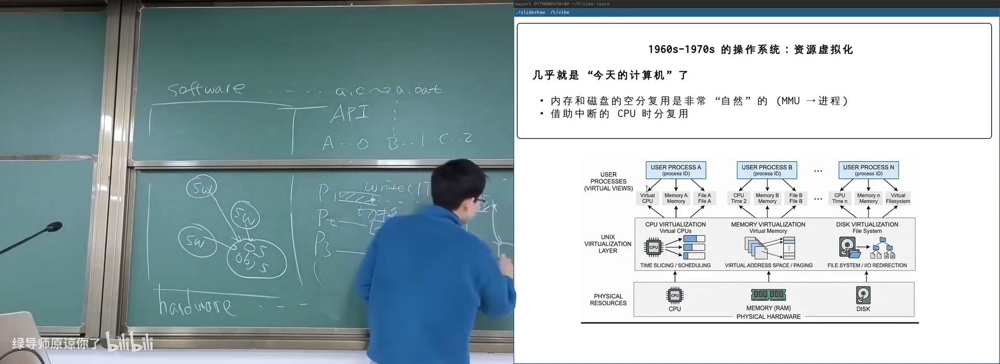

同一时期出现了更多高级语言：

- COBOL；
- APL；
- BASIC；
- Pascal；
- C（1972）。

C 语言至今仍支撑着现代操作系统和系统软件。

### 7.4 1970s 以后：UNIX 与现代应用生态

UNIX 奠定了 AI 时代之前计算机世界的基础：

- 1973 年：信号 API、管道、grep；
- 1983 年：BSD socket；
- 1984 年：procfs；
- 之后衍生出 BSD、GNU、macOS、AIX、Minix、Windows、Linux、Debian、Ubuntu、iOS、Android 等庞大生态。

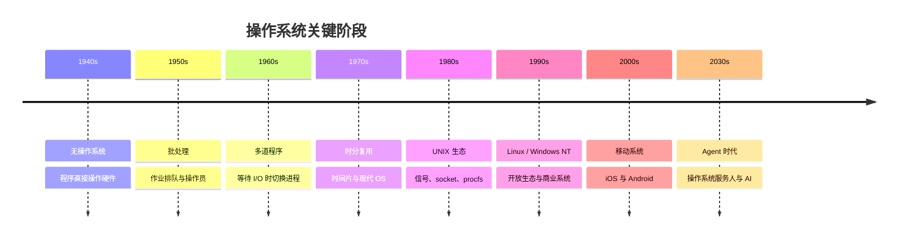
```mermaid
timeline
    title 操作系统关键阶段
    1940s : 无操作系统 : 程序直接操作硬件
    1950s : 批处理 : 作业排队与操作员
    1960s : 多道程序 : 等待 I/O 时切换进程
    1970s : 时分复用 : 时间片与现代 OS
    1980s : UNIX 生态 : 信号、socket、procfs
    1990s : Linux / Windows NT : 开放生态与商业系统
    2000s : 移动系统 : iOS 与 Android
    2030s : Agent 时代 : 操作系统服务人与 AI
```

### 7.5 2030s 以后：操作系统不只服务人类

未来操作系统仍会管理硬件和程序，但服务对象会发生变化：

- 人类通过自然语言和动态界面操作；
- Agent 通过工具与系统 API 操作；
- Model Context 可能像“一个用户”或“一个进程”一样拥有状态；
- Agent 可以创建分身、调用工具、协同完成任务；
- 操作系统可能增加面向模型的新抽象层。

底层机制不一定全部改变，但抽象层和应用形态会继续演化。

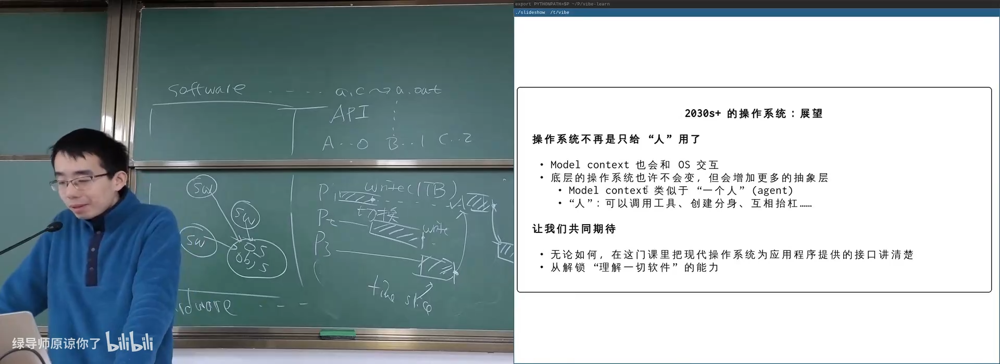

---

## 8. 怎么学习操作系统

### 8.1 从动机和第一性原理出发

课程建议关注：

- 基本动机：为什么需要这个机制？
- 基本方法：问题如何被抽象和解决？
- 历史里程碑：系统如何一步步演化？
- 走过的弯路：为什么某些方案失败？
- 应用创新：如何用已有 API 构建新软件？

不要求记忆犄角旮旯的细节。真正理解 first principles 后，细节可以由原理推导，也可以在 AI 协助下快速补充。

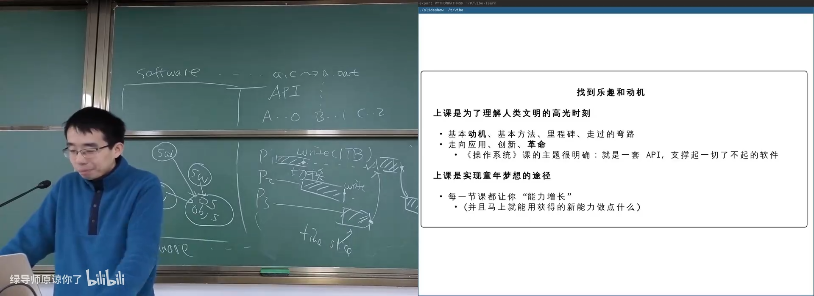

### 8.2 拥抱 AI，但不放弃掌控

课程将大语言模型定义为 next-token prediction 的概率模型，但它在聊天、解题、编码等任务上已经表现出强大能力。

Agent 是“具备手和脚的大语言模型”：

- 能读取整个项目；
- 能定位并修改文件；
- 能调用工具和执行命令；
- 能根据 copilot 提供的上下文理解过去发生的事。

AI 可以显著降低学习与实现成本，但不能替代对系统结构的理解。人类仍然需要掌控：

- 目标与需求；
- 抽象层设计；
- 安全边界；
- 验证与调试；
- 复杂系统的长期演化。

### 8.3 不让考试本能压过长期价值

大学学习不应只围绕短期分数。尤其在 AI 时代，更应该追求长期价值：

- 理解一个领域的核心思想；
- 建立跨层概念体系；
- 做真正有亮点的项目；
- 把兴趣转化为可持续的能力。

讲师强调 Academic Integrity，也提醒学生：世界上已经越来越少有“完全学不懂”的知识，更大的约束往往是时间与目标选择。

---

## 9. 本讲总结

第 1 讲没有直接进入内核实现，而是先建立一张全景地图：

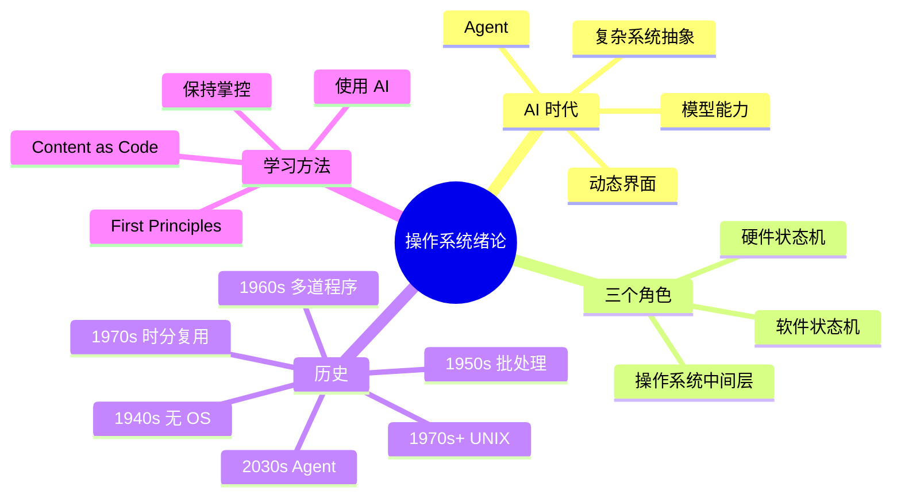
```mermaid
mindmap
  root((操作系统绪论))
    AI 时代
      模型能力
      Agent
      动态界面
      复杂系统抽象
    三个角色
      硬件状态机
      软件状态机
      操作系统中间层
    历史
      1940s 无 OS
      1950s 批处理
      1960s 多道程序
      1970s 时分复用
      1970s+ UNIX
      2030s Agent
    学习方法
      First Principles
      Content as Code
      使用 AI
      保持掌控
```

核心结论可以概括为：

- 操作系统是硬件与应用程序之间的抽象层；
- 硬件和软件都可以理解为状态机；
- 操作系统管理程序状态，并向应用暴露 API 和对象；
- 操作系统的历史，是从单程序执行、批处理、进程切换走向时分复用的过程；
- AI 增强了编程与应用生成能力，但复杂系统仍需要人类设计抽象；
- 操作系统为 AI 提供了读写文件、网络通信、隔离环境和调用工具的真实能力；
- 学习操作系统不仅是学习旧知识，也是理解并掌控未来软件系统的基础。

> **Code is cheap, show me the talk.**  
> 但只有当人真正理解系统，才能把“talk”变成可靠、可控、能够长期演化的软件。

---

## 附：官方参考与延伸阅读

课程与讲义：

- [《操作系统原理》2026 课程主页](https://jyywiki.cn/OS/2026/)
- [第 1 讲讲义：操作系统概述](https://jyywiki.cn/OS/2026/lect1.md)
- [本讲视频](https://www.bilibili.com/video/BV1opAfzpEf9/)

课堂提到的工具、项目与资料：

- [Remotion：用代码生成视频](https://www.remotion.dev/)
- [mini-rv32ima：C 语言实现的 RISC-V 模拟器](https://github.com/cnlohr/mini-rv32ima)
- [nvboard：数字电路模拟与可视化](https://github.com/NJU-ProjectN/nvboard)
- [数字电路模拟器演示](https://jyywiki.cn/OS/demos/intro/logisim)
- [汉诺塔状态机演示](https://jyywiki.cn/OS/demos/intro/hanoi-nr)
- [Programming the ENIAC](https://ieeexplore.ieee.org/stamp/stamp.jsp?tp=&arnumber=8467000)
- [Fire in the Valley](https://www.amazon.com/Fire-Valley-Birth-Personal-Computer/dp/1937785769)
- [Stack Overflow: Helping One Million Developers Exit Vim](https://stackoverflow.blog/2017/05/23/stack-overflow-helping-one-million-developers-exit-vim/)
- [Stack Overflow is dying](https://www.digit.in/features/general/stack-overflow-is-dying-blame-it-on-chatgpt-and-ai-coding-tools.html)
- [MIT Academic Integrity](https://integrity.mit.edu/)

阅读材料：

- *Operating Systems: Three Easy Pieces*
  - Preface；
  - 第 1 章：Dialogue on the Book；
  - 第 2 章：Introduction to Operating Systems。
- Harley Hahn, *Guide to Unix and Linux*（延伸阅读）。

> **版权说明**：课程讲义与幻灯片的著作权归蒋炎岩所有，采用 Creative Commons BY-NC 4.0 许可。电子书正文为课堂内容的书面化重构，脚本占位符已替换为视频画面或官方资料渲染图；引用与来源链接均保留在本页。
