# 应用视角的操作系统：程序、系统调用与真实应用

> **课程**：2026 春季学期《操作系统原理》，第 2 讲  
> **讲师**：蒋炎岩（jyy）  
> **官方课程主页**：<https://jyywiki.cn/OS/2026/>  
> **官方讲义**：<https://jyywiki.cn/OS/2026/lect2.md>  
> **视频来源**：[Bilibili BV1KNPHzPEra](https://www.bilibili.com/video/BV1KNPHzPEra/)  
> **版权说明**：课程讲义与幻灯片归蒋炎岩所有，采用 [Creative Commons BY-NC 4.0](http://creativecommons.org/licenses/by-nc/4.0/) 许可；本电子书是对课堂讲授的书面化重构，保留出处与许可说明。

## 导读：应用程序眼中的操作系统

上一讲从历史角度回答了“为什么需要操作系统”。本讲换到应用程序视角，把操作系统理解为：

> **操作系统是一组 API 和一组对象。**

应用程序通过这些 API 管理文件、设备、内存和其他进程。要真正理解这组接口，首先必须彻底回答一个更基础的问题：

> **什么是程序？**

本讲会从 C 语言程序的状态机模型出发，经过解释、函数调用、编译优化、最小可执行文件和系统调用，最后打开真实的 GCC、xedit、Coreutils 和后台守护进程，证明它们与最小的汇编程序没有本质区别。

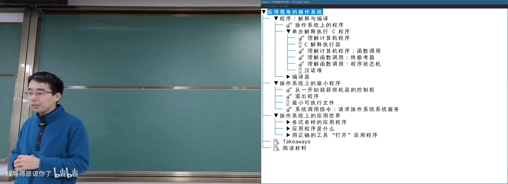

---

## 1. 为什么选择 C 语言

*(参考时间: 00:02:03)*

课程主要使用 C 语言分析操作系统。原因不是 C 语言最现代，而是它恰好位于两个极端之间：

- 汇编可以直接操作硬件和系统调用，但不适合构建大型应用；
- JavaScript、TypeScript 等高级语言有大量语言运行时和生态特性，与操作系统接口相距较远；
- C 既能直接调用操作系统 API，又足以编写真实应用；
- C 也是 UNIX 和早期软件生态最重要的构建语言。

C 语言可以被看成“接近机器的高级语言”。理解 C 程序如何执行，就能够在语言语义、机器指令和操作系统接口之间建立清晰联系。

---

## 2. 程序：状态机、解释与编译

### 2.1 任何 C 程序都可以改写为每行只做一件事

复杂表达式可以被拆解为多个简单步骤。例如：

```c
x = y + z + w;
```

可以改写为：

```c
t1 = y + z;
t2 = t1 + w;
x = t2;
```

条件、循环和函数调用参数中的复杂表达式，也可以提取为临时变量。经过这种转换后，程序更接近 **SimpleC**：

- 每一行只执行一个简单动作；
- 条件尽量简化为布尔变量；
- 程序行为对应清晰的状态迁移；
- 每一条语句都容易翻译为少量机器指令。

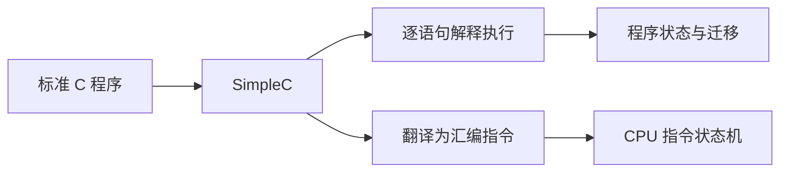
```mermaid
flowchart LR
    C["标准 C 程序"] --> S["SimpleC"]
    S --> I["逐语句解释执行"]
    S --> A["翻译为汇编指令"]
    I --> T["程序状态与迁移"]
    A --> M["CPU 指令状态机"]
```

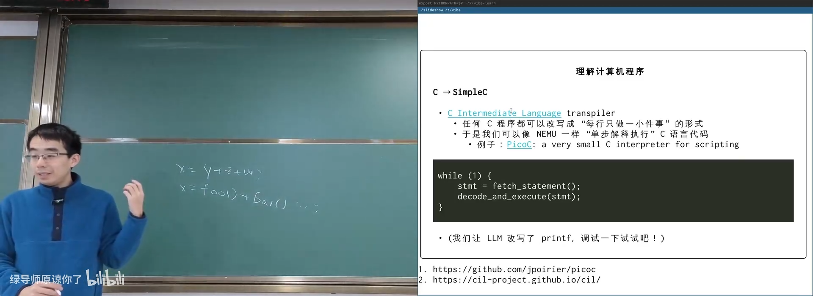

C Intermediate Language（CIL）等项目就采用类似思路，把符合标准的 C99 程序转换成更简单、更适合分析和优化的 C 形式。

### 2.2 解释执行

最简单的解释器可以用下面的循环概括：

```c
while (1) {
    stmt = fetch_statement();
    decode_and_execute(stmt);
}
```

如果程序已经拆成简单语句，解释器便可以从当前 Program Counter 取出语句，根据语义修改变量、栈或 PC，再进入下一状态。

课堂使用 GDB 演示了这种状态迁移：代码经过 SimpleC 风格改写后，每一步都可以观察变量、栈顶 Frame 和 PC 的变化。

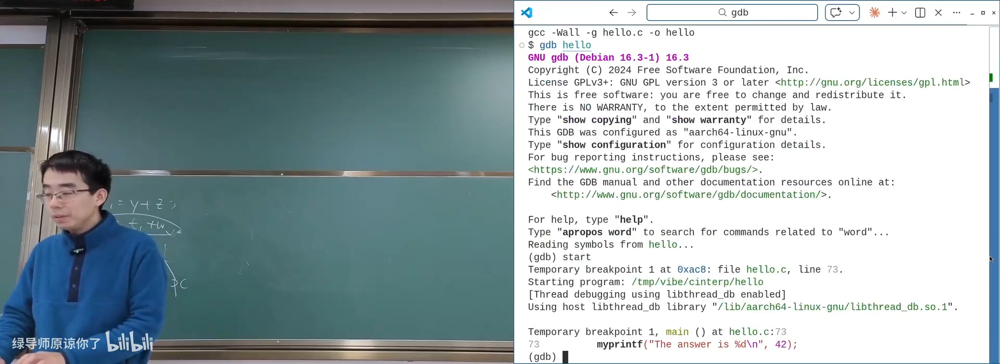

还可以通过脚本自动收集每一步状态，形成程序执行 trace。这样，一个 C 程序在运行时就变成了一串可分析、可回放、可可视化的状态序列。

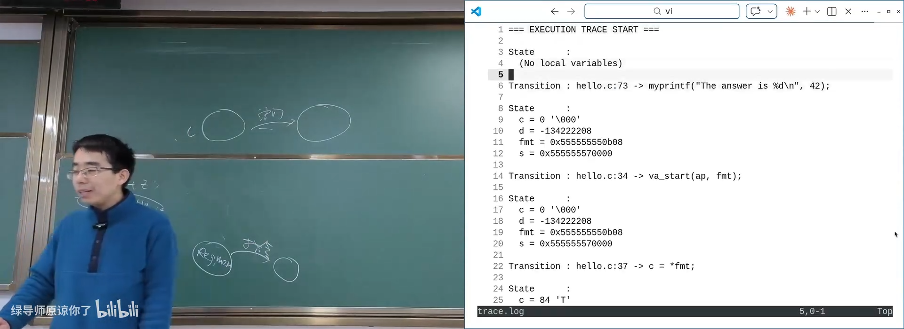

### 2.3 函数调用比普通赋值复杂

汉诺塔长期被视为 C/C++ 入门时的难点。它与数学函数有一个根本差异：

> C/C++ 函数执行具有先后顺序，并可能产生全局副作用。

斐波那契递归的交换顺序通常不改变返回值：

```c
return f(n - 1) + f(n - 2);
return f(n - 2) + f(n - 1);
```

但汉诺塔会通过 `printf` 输出移动步骤，因此调用顺序不同，外部可观察结果也不同。

真正精确的程序状态并不仅是“变量 + PC”：

```text
状态 = [StackFrame, StackFrame, ...] + 全局变量
```

每一个 Stack Frame 有自己的：

- 局部变量；
- 参数；
- 返回地址；
- 当前 PC。

初始状态只有一个 `main` Frame，包含 `argc`、`argv`、局部变量和 PC。状态迁移总是从最顶层 Frame 的 PC 取语句执行。

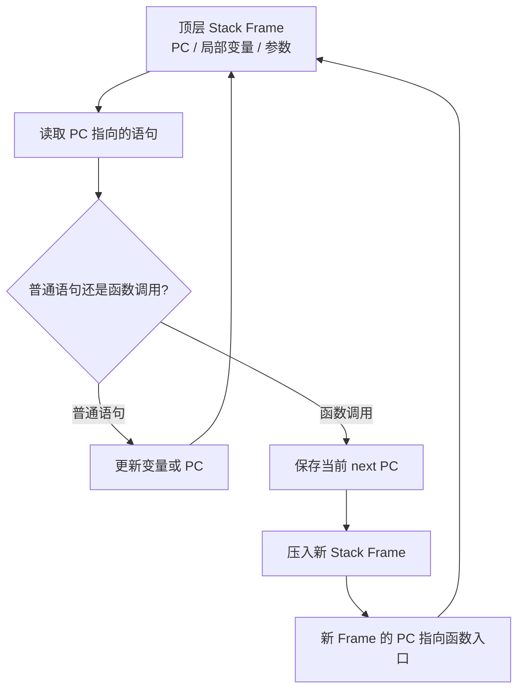
```mermaid
flowchart TD
    A["顶层 Stack Frame<br/>PC / 局部变量 / 参数"] --> B["读取 PC 指向的语句"]
    B --> C{"普通语句还是函数调用?"}
    C -->|"普通语句"| D["更新变量或 PC"]
    C -->|"函数调用"| E["保存当前 next PC"]
    E --> F["压入新 Stack Frame"]
    F --> G["新 Frame 的 PC 指向函数入口"]
    D --> A
    G --> A
```

函数调用可以归纳为两个机械操作：

1. 保存调用者的 next PC；
2. 压入被调用者的新 Frame，并将 PC 设置为函数入口。

返回则弹出当前 Frame，恢复调用者保存的 PC。

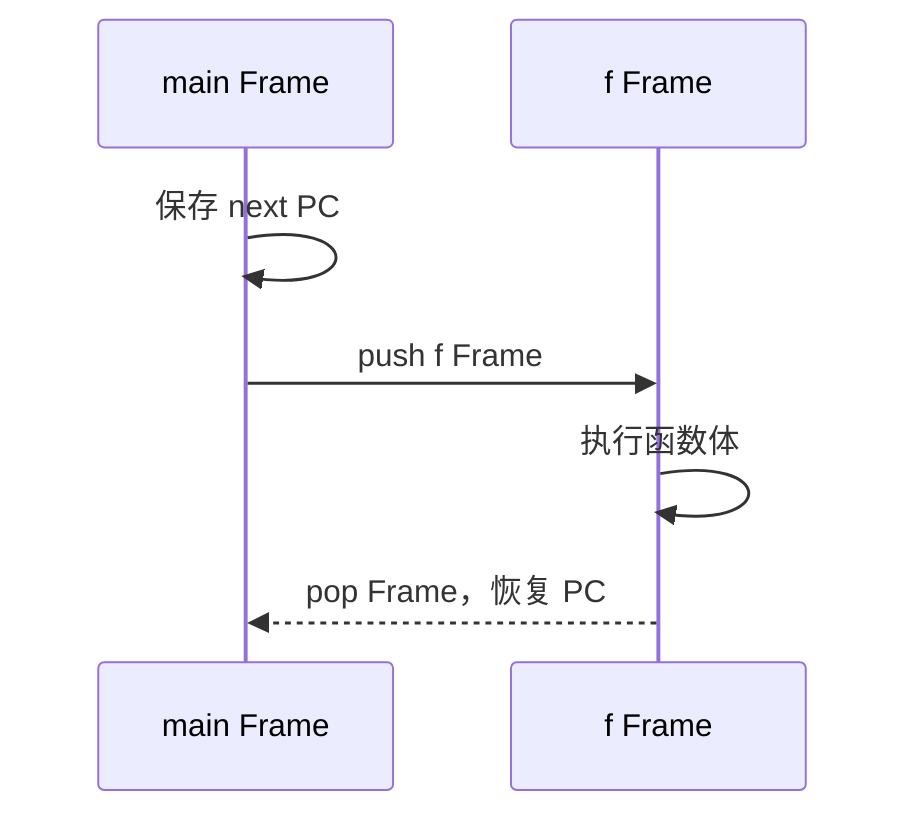
```mermaid
sequenceDiagram
    participant M as main Frame
    participant F as f Frame
    M->>M: 保存 next PC
    M->>F: push f Frame
    F->>F: 执行函数体
    F-->>M: pop Frame，恢复 PC
```

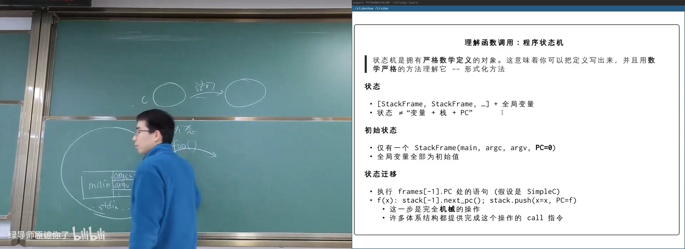

### 2.4 非递归汉诺塔与形式语义

一旦显式维护 Frame，递归程序就可以机械地改写为非递归版本：

```c
struct frame {
    int pc;
    int n;
    char from, to, aux;
    int c1, c2;
};
```

程序根据当前 Frame 的 `pc` 决定执行入口代码、第一次递归、移动步骤还是第二次递归。表面上是循环，实际上是在模拟 C 语言的形式语义。

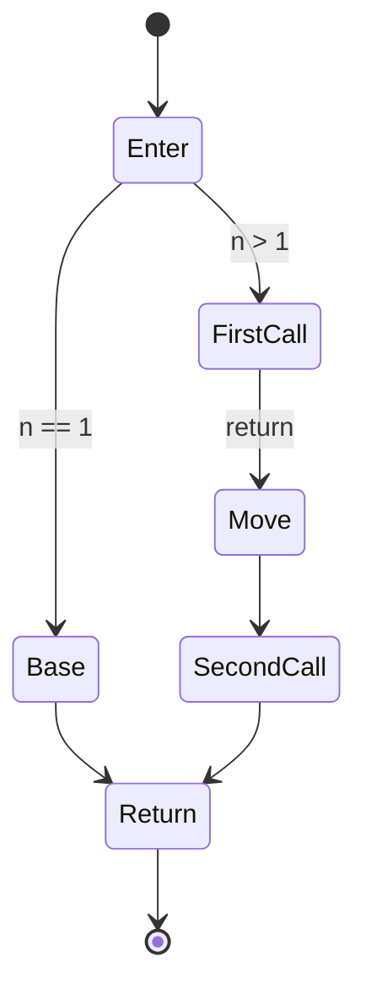
```mermaid
stateDiagram-v2
    [*] --> Enter
    Enter --> Base: n == 1
    Base --> Return
    Enter --> FirstCall: n > 1
    FirstCall --> Move: return
    Move --> SecondCall
    SecondCall --> Return
    Return --> [*]
```

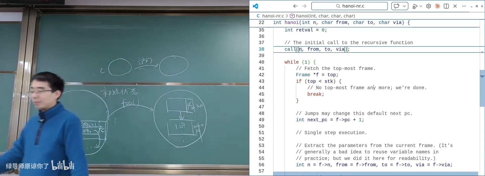

这种视角下，计算机世界没有任何魔法。过程调用、递归和返回都可以由定义清晰的 Frame 操作解释。

---

## 3. 编译器与“编译正确”

### 3.1 编译器不是简单的逐句翻译器

编译器将 C 程序转换为目标代码。最早期编译器接近 transpiler，逐条改变语法或翻译语句；现代编译器则允许重排、合并和删除大量计算。

例如：

```c
return 2 * 3 + 3 * 6 + 1;
```

可以在编译期直接得到 25。若某个变量从未被外部使用，则相关计算属于死代码，可以被删除。

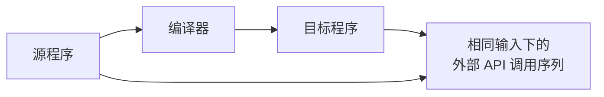
```mermaid
flowchart LR
    S["源程序"] --> C["编译器"]
    C --> O["目标程序"]
    O --> R["相同输入下的<br/>外部 API 调用序列"]
    S --> R
```

### 3.2 编译正确性

在假设程序终止的前提下，可以给出一个实用定义：

> 对任意输入，编译后程序产生的外部调用序列，必须与 C 语言形式语义下的调用序列一致。

外部调用主要包括系统调用以及链接后才能确定行为的函数。编译器不能随意删除、重排或修改这些调用，因为它们可能改变文件、设备或真实世界。

只要程序最终不产生任何外部可观察行为，编译器原则上可以把所有计算删除。

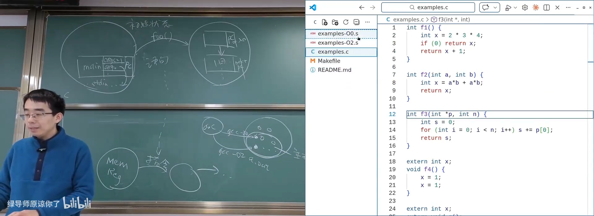

课堂对比了 ARM64 上的 `-O0` 与 `-O2` 结果：多次赋值可以合并，常数运算可以折叠，但系统调用和外部 API 必须保留。

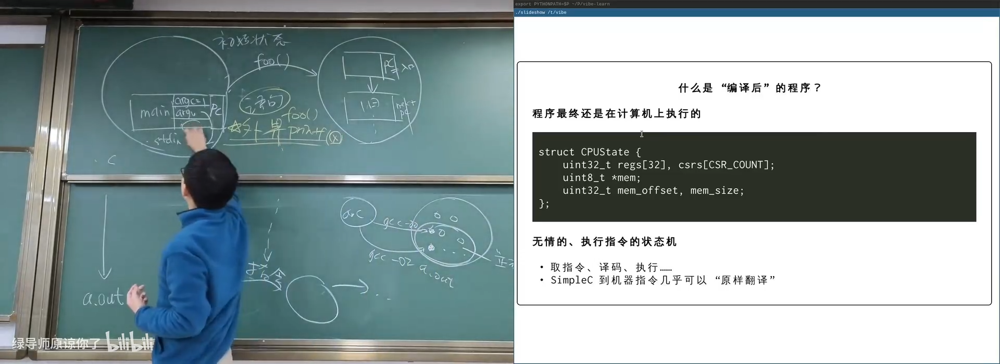

---

## 4. 操作系统上的最小程序

### 4.1 从 `_start` 获得控制权

《计算机系统基础》通常告诉学生程序从 `_start` 开始。实际上，普通 C 程序并不直接从 `main` 开始：

- 操作系统加载器设置进程初始状态；
- 入口先跳到运行时初始化代码；
- 初始化完成后调用 `main`；
- `main` 返回后执行清理逻辑；
- 最后必须请求操作系统终止进程。

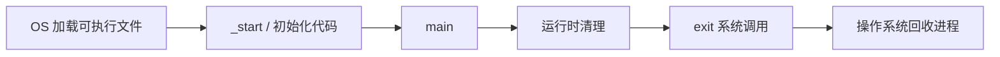
```mermaid
flowchart LR
    L["OS 加载可执行文件"] --> S["_start / 初始化代码"]
    S --> M["main"]
    M --> F["运行时清理"]
    F --> E["exit 系统调用"]
    E --> X["操作系统回收进程"]
```

### 4.2 程序为什么不能自己停下来

指令集中的普通指令只能改变当前进程的寄存器和内存。它们不能让整个计算机断电，也不能可靠地终止进程。程序若直接从 `_start` 返回，会尝试从初始栈中弹出一个返回地址；通常得到非法 PC，最终触发 segmentation fault。

程序必须请求操作系统：

```asm
movq $SYS_exit, %rax   # 系统调用编号: exit
movq $1,       %rdi   # 退出状态
syscall
```

不同体系结构的系统调用指令不同：

| 体系结构 | 指令 |
|---|---|
| x86-64 | `syscall` |
| RISC-V | `ecall` |
| AArch64 | `svc` |

### 4.3 用汇编写最小 Hello World

最小程序不需要标准库，只需把参数放入正确寄存器并执行系统调用：

```asm
movq $SYS_write, %rax
movq $1,         %rdi   # stdout
lea  message(%rip), %rsi
movq $12,        %rdx   # length
syscall

movq $SYS_exit,  %rax
movq $1,         %rdi
syscall
```

汇编器生成目标文件，链接器设置入口地址，最终得到一个可以正常输出并退出的 ELF 文件。

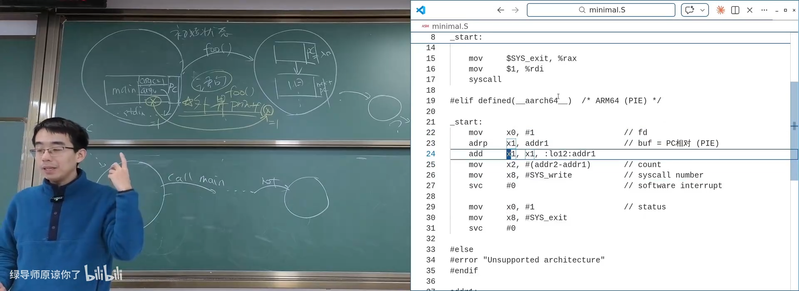

### 4.4 系统调用：整个课程最重要的一页

*(参考时间: 00:53:46)*

普通指令只能在当前程序的状态内工作。`syscall` 是一条特殊指令：

- 它主动放弃当前程序对状态机的控制；
- 控制权交给操作系统；
- 操作系统根据寄存器中的编号和参数执行服务；
- 服务完成后可能修改进程状态后返回；
- 也可能直接终止进程，永远不返回。

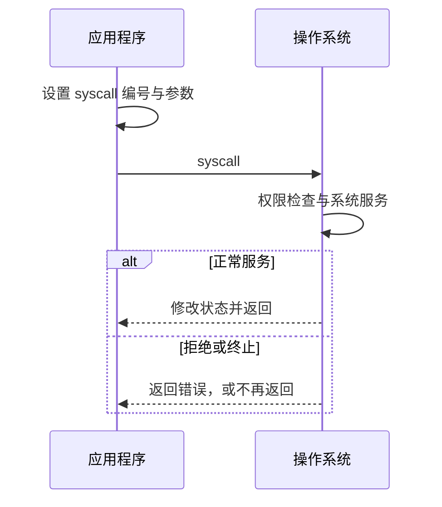
```mermaid
sequenceDiagram
    participant P as 应用程序
    participant O as 操作系统
    P->>P: 设置 syscall 编号与参数
    P->>O: syscall
    O->>O: 权限检查与系统服务
    alt 正常服务
        O-->>P: 修改状态并返回
    else 拒绝或终止
        O-->>P: 返回错误，或不再返回
    end
```

讲师用“全身麻醉”作类比：程序先约定好请求，随后完全失去控制权。醒来后可能一切正常，也可能状态被改变，甚至再也醒不过来。

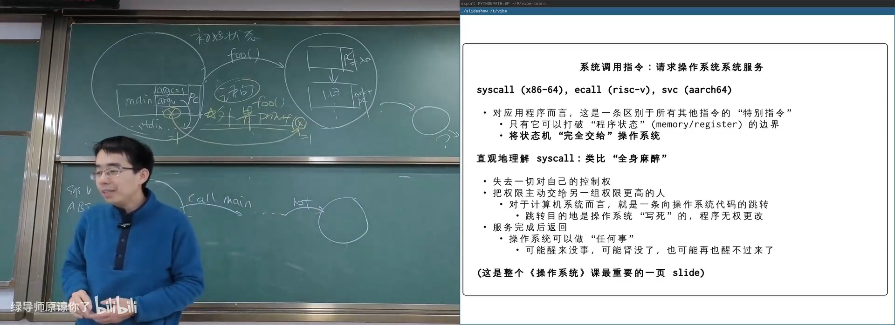

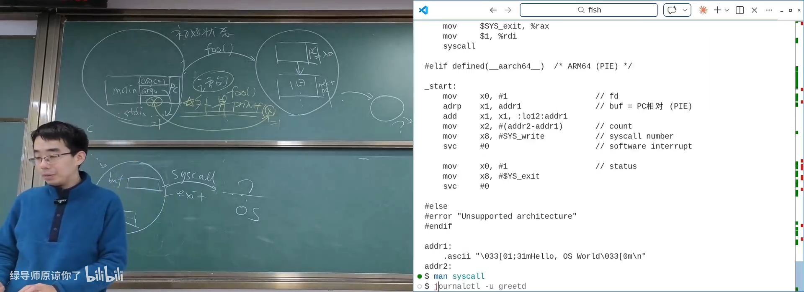

系统调用参数通常通过寄存器传递：

- x86-64：编号放 `rax`，参数依次放 `rdi`、`rsi`、`rdx` 等；
- AArch64：编号放 `x8`，参数依次放 `x0`、`x1`、`x2` 等。

---

## 5. 所有真实应用程序都是同一种东西

*(参考时间: 00:58:54)*

操作系统面前“众生平等”。无论是终端、窗口管理器、VS Code、浏览器、游戏、杀毒软件还是病毒，它们与最小汇编程序的结构都没有本质区别：

```text
应用程序 = 计算 + 系统调用
```

程序被加载后从入口开始执行，不断完成计算和系统调用，最终退出。

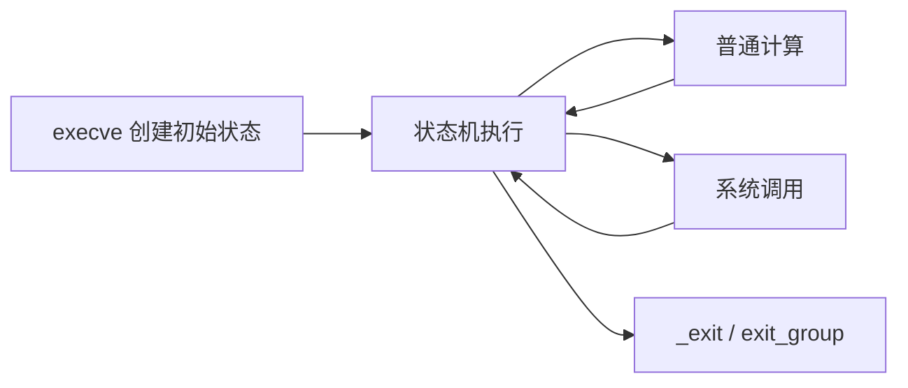
```mermaid
flowchart LR
    E["execve 创建初始状态"] --> R["状态机执行"]
    R --> C["普通计算"]
    R --> S["系统调用"]
    C --> R
    S --> R
    R --> X["_exit / exit_group"]
```

### 5.1 可执行文件是状态机的初始状态描述

ELF 文件包含：

- 文件类型和机器架构；
- 程序入口地址；
- 节区与段；
- 指令序列；
- 数据与符号信息；
- 动态链接所需元数据。

因此，可执行文件可以理解为：

> **“一个程序状态机初始状态的完整描述。”**

`minimal.S`、`/usr/bin/as`、浏览器和游戏都是 ELF 文件，只是复杂度相差巨大。

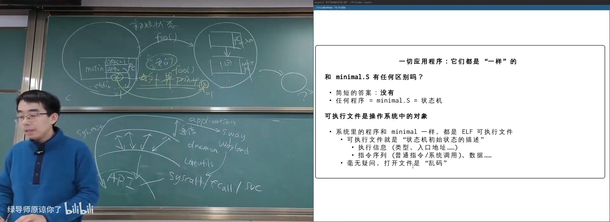

---

## 6. 操作系统上的应用世界

### 6.1 Applications、Utilities 与 Daemons

应用生态通常分为多层：

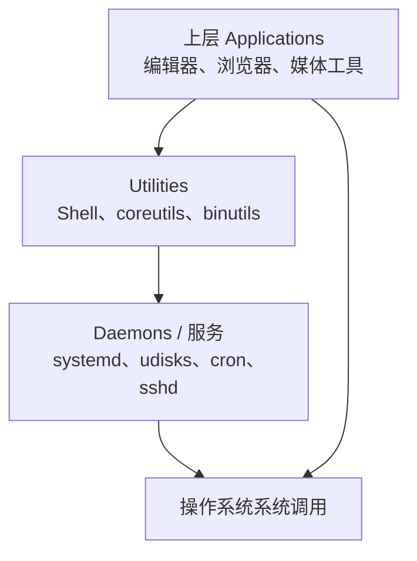
```mermaid
flowchart TD
    A["上层 Applications<br/>编辑器、浏览器、媒体工具"] --> U["Utilities<br/>Shell、coreutils、binutils"]
    U --> D["Daemons / 服务<br/>systemd、udisks、cron、sshd"]
    D --> S["操作系统系统调用"]
    A --> S
```

#### Applications

- VS Code、Cursor 等开发工具；
- GCC、Clang、Node.js、GDB 等开发与调试工具；
- tmux、Vim、htop 等终端工具；
- LibreOffice、GIMP、Chrome、Firefox；
- OBS、VLC 等媒体工具。

#### Utilities

- GNU Coreutils、BusyBox、Toybox；
- Shell、Claude Code；
- Binutils；
- apt、dpkg、ip、ssh、curl；
- ffmpeg、GStreamer。

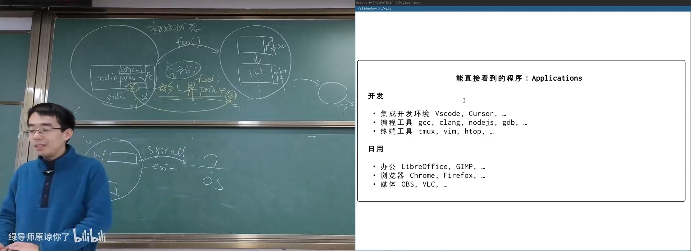

#### Daemons

- systemd 管理服务；
- `systemd-udevd` 处理设备事件；
- `cron` 定时执行任务；
- `udisksd` 处理磁盘与 U 盘挂载；
- `sshd`、数据库服务、D-Bus；
- 音频与图形服务。

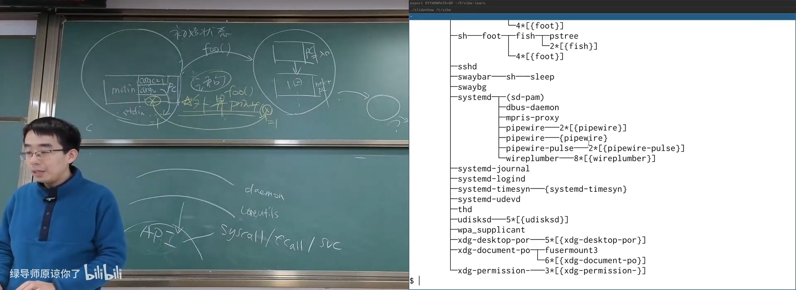

### 6.2 图形界面为什么不能直接画屏幕

如果每个 GUI 程序都直接向屏幕写像素，窗口会互相覆盖，设备也会失控。因此系统在操作系统 API 之上又构建了抽象层：


```mermaid
flowchart LR
    A["GUI 应用"] --> T["GTK / Qt / 工具包"]
    T --> C["Wayland Compositor"]
    C --> G["图形驱动"]
    G --> S["操作系统与显示设备"]
```

应用通过消息协议请求窗口管理器绘制内容。窗口移动、缩放和遮挡由合成器统一管理，因此应用只关心自己的相对坐标。

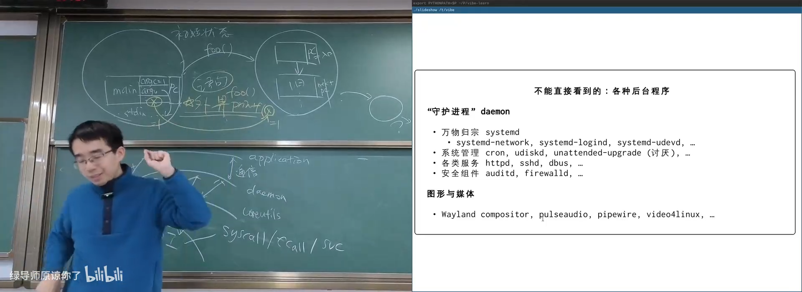

---

## 7. 用正确的工具打开程序

### 7.1 `strace`：观察系统调用

`strace` 可以跟踪程序执行过程中的系统调用。最简单的程序在启动时也会执行大量系统调用，因为动态链接器、运行时和标准库都需要打开文件、映射内存和初始化状态。

```bash
strace ./a.out
strace -f gcc hello.c
```

- `-f` 表示同时跟踪子进程；
- 输出会显示 `execve`、`openat`、`read`、`write`、`mmap`、`unlinkat` 等调用；
- 通过这些记录可以判断程序是内部完成工作，还是启动外部工具。

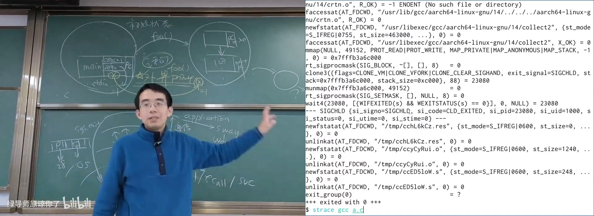

### 7.2 用 UNIX 管道过滤 trace

完整 trace 可能包含数千行。传统 UNIX 方法是把文本通过管道交给 `grep`、`sed` 和 `awk`：

```bash
strace -f gcc hello.c 2>&1 \
  | grep execve \
  | sed 's/^[0-9]* *//'
```

更复杂的问题可以继续串联工具。今天的 Agent 同样会优先组合已有命令行工具，而不是每次都从头编写完整程序。

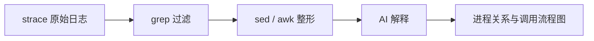
```mermaid
flowchart LR
    T["strace 原始日志"] --> G["grep 过滤"]
    G --> S["sed / awk 整形"]
    S --> A["AI 解释"]
    A --> D["进程关系与调用流程图"]
```

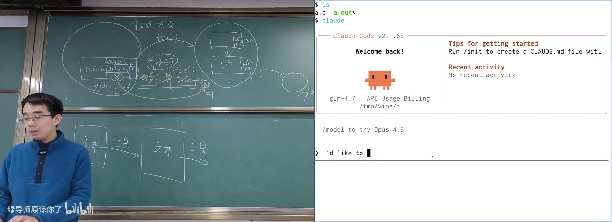

### 7.3 GCC 在背后做了什么

`gcc a.c` 并不是把所有工作都放在同一个进程里完成。trace 可以看到它通过 `execve` 启动：

- 编译器前端；
- 汇编器；
- 链接器。

GCC 还可能生成临时 `.o` 文件，完成链接后通过 `unlinkat` 删除。


```mermaid
flowchart LR
    G["gcc 驱动程序"] --> C["cc1 / 编译器前端"]
    C --> A["as / 汇编器"]
    A --> L["ld / 链接器"]
    L --> O["可执行文件"]
```

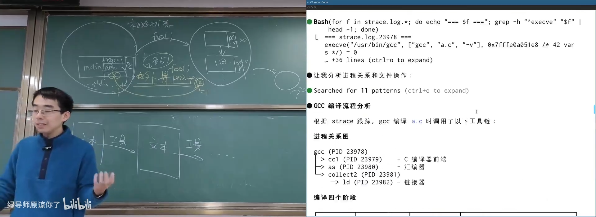

### 7.4 图形程序 xedit

`xedit` 是简单的 X11 图形编辑器。它的系统调用主要由 `poll`、`recvmsg` 和发送消息组成，而不是逐个像素直接写屏幕。

程序与 X Server 按照协议通信；在虚拟机中，X11 消息还可以通过 SSH X11 forwarding 转发到宿主机。VS Code 等现代 GUI 程序在抽象层上采用同样的交互模型。

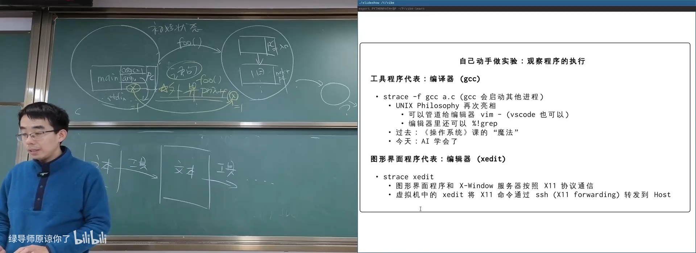

---

## 8. 打开二进制：从观察走向修改

### 8.1 二进制没有魔法

对象文件和可执行文件都是字节序列。常用工具包括：

- `objdump`：反汇编与查看节区；
- `file`：识别文件类型与架构；
- `readelf`：分析 ELF 结构；
- `strings`：提取可打印字符串；
- `size`：查看各段大小；
- `xxd` / `hexdump`：查看和修改原始字节。

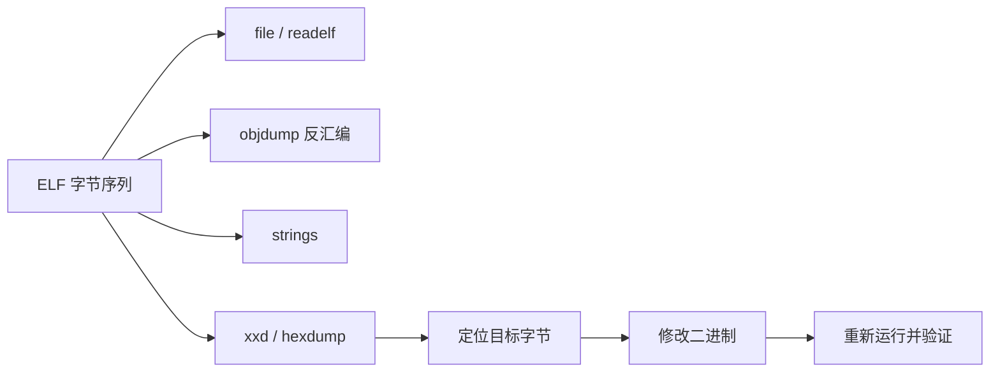
```mermaid
flowchart LR
    B["ELF 字节序列"] --> F["file / readelf"]
    B --> O["objdump 反汇编"]
    B --> S["strings"]
    B --> H["xxd / hexdump"]
    H --> P["定位目标字节"]
    P --> M["修改二进制"]
    M --> V["重新运行并验证"]
```

### 8.2 修改最小程序的返回值

课堂让 AI 完成一个小任务：

> 把 `minimal` 程序的返回值从 1 改成 42。

Agent 先运行程序确认返回值，再用 `xxd` 等工具定位字节，分析 ARM64 机器码，找到设置返回值的 `mov` 指令，然后修改目标字节并重新执行验证。

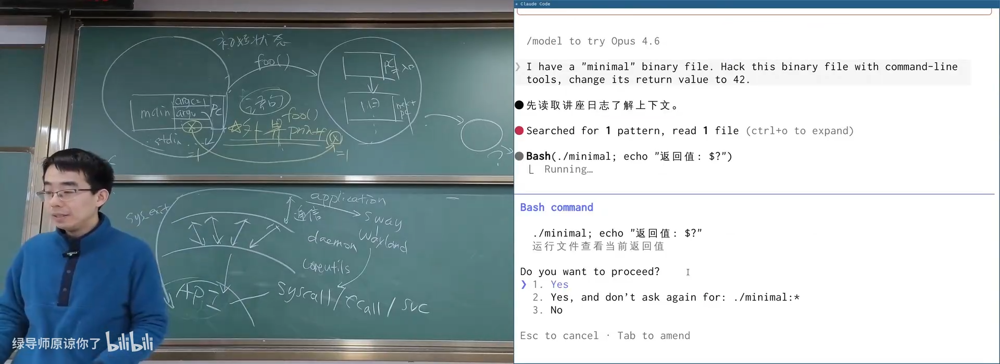

这体现了现代工具链的威力：

- 工具可以组合；
- 代码可以无限复用；
- AI 知道在正确的时候调用正确工具；
- 初学者与顶尖工程师的工具执行力差距正在缩小。

### 8.3 童年逆向故事

*(参考时间: 01:14:28)*

讲师回忆了早期游戏光盘时代的一次逆向经历。在《大富翁 4》的存档目录中发现隐藏内容，存档中的字节控制进度。把一个 `0x00` 改成 `0x01`，游戏行为就发生变化。

当时既缺少工具，也缺少知识，因此感觉困难。今天：

- 同样方法可以用于分析 Windows binary；
- 复杂文件可以被工具切分和解释；
- AI 能帮助初学者理解机器码和文件格式；
- `Curiosity is all you need`。

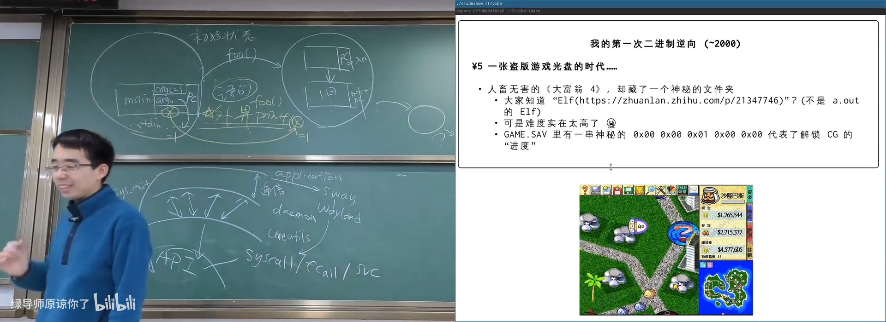

---

## 9. 从现象回到操作系统接口

本讲展示了大量应用，但最终都回到同一个模型：

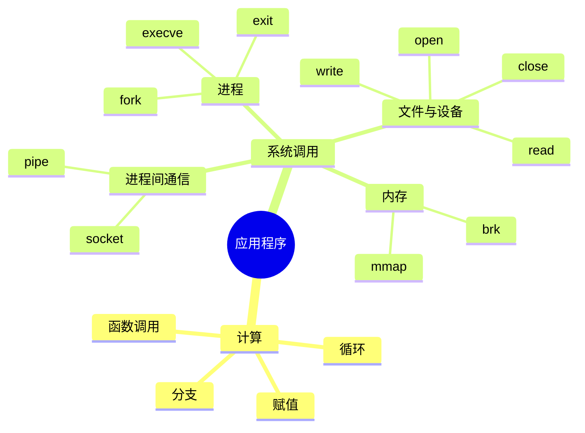
```mermaid
mindmap
  root((应用程序))
    计算
      赋值
      分支
      循环
      函数调用
    系统调用
      进程
        fork
        execve
        exit
      文件与设备
        open
        close
        read
        write
      内存
        mmap
        brk
      进程间通信
        pipe
        socket
```

操作系统提供的抽象包括：

- 进程管理；
- 文件与设备管理；
- 虚拟内存；
- 进程间通信；
- 网络；
- 权限与安全。

应用不会直接操作硬件，而是请求操作系统帮助。操作系统负责：

- 检查权限；
- 维护对象状态；
- 隔离不同程序；
- 调度共享资源；
- 为开发者提供稳定抽象。

---

## 10. 本讲总结

核心结论如下：

1. 程序是状态机，状态由栈帧、变量和每个 Frame 的 PC 组成。
2. 函数调用可以机械地理解为压栈、保存 next PC、跳转入口。
3. 任意递归程序都可以显式维护栈帧，改写为等价的非递归状态机。
4. 编译正确意味着编译前后对所有输入产生相同的外部调用序列。
5. 普通指令只能修改当前程序状态，`syscall` 才能请求操作系统服务。
6. 程序无法自行退出，必须调用 `exit`；调度和资源回收由操作系统完成。
7. 所有真实应用，无论是 GCC、浏览器还是游戏，都是“计算 + 系统调用”。
8. `strace`、GDB、objdump 和二进制工具能打开程序执行过程。
9. GUI、Shell 和工具链都不是魔法，而是建立在系统调用之上的多层抽象。
10. AI 擅长组合已有工具，但人类必须理解系统边界与工具用途。

> **程序 = 状态机。**  
> **应用 = 计算 + 操作系统 API。**

---

## 附：官方参考与延伸阅读

课程与讲义：

- [《操作系统原理》2026 课程主页](https://jyywiki.cn/OS/2026/)
- [第 2 讲讲义：应用视角的操作系统](https://jyywiki.cn/OS/2026/lect2.md)
- [本讲视频](https://www.bilibili.com/video/BV1KNPHzPEra/)

工具、项目与课堂资料：

- [C Intermediate Language](https://cil-project.github.io/cil/)
- [PicoC：小型 C 解释器](https://github.com/jpoirier/picoc)
- [C 解释执行器演示](https://jyywiki.cn/OS/demos/intro/cinterp)
- [汉诺塔状态机演示](https://jyywiki.cn/OS/demos/intro/hanoi-nr)
- [mini-rv32ima](https://github.com/cnlohr/mini-rv32ima)
- [编译器与优化演示](https://jyywiki.cn/OS/demos/intro/ccompile)
- [最小可执行文件演示](https://jyywiki.cn/OS/demos/intro/minimal)
- [GNU Coreutils](https://www.gnu.org/software/coreutils/)
- [BusyBox](https://www.busybox.net/)
- [Toybox](https://landley.net/toybox/)
- [GNU Binutils](https://www.gnu.org/software/binutils/)
- GDB 文档目录，尤其是 Reverse Execution 与 TUI。

阅读建议：

- 与 AI 一起了解 Coreutils 和 Binutils；
- 浏览 BusyBox、Toybox 中常用工具的精简实现；
- 使用 GDB 单步观察简单程序、动态链接器和系统调用。

> **版权说明**：课程讲义与幻灯片的著作权归蒋炎岩所有，采用 Creative Commons BY-NC 4.0 许可。电子书正文为课堂内容的书面化重构，脚本占位符已替换为视频画面或官方资料渲染图；引用与来源链接均保留在本页。
