# 硬件视角的操作系统：从 CPU Reset 到固件

> **课程**：2026 春季学期《操作系统原理》，第 3 讲  
> **讲师**：蒋炎岩（jyy）  
> **官方课程主页**：<https://jyywiki.cn/OS/2026/>  
> **官方讲义**：<https://jyywiki.cn/OS/2026/lect3.md>  
> **视频来源**：[Bilibili BV18fcozAEsy](https://www.bilibili.com/video/BV18fcozAEsy/)  
> **版权说明**：课程讲义与幻灯片归蒋炎岩所有，采用 [Creative Commons BY-NC 4.0](http://creativecommons.org/licenses/by-nc/4.0/) 许可；本电子书是对课堂讲授的书面化重构，保留出处与许可说明。

## 导读：硬件根本不知道有没有操作系统

上一讲从应用视角把操作系统理解为“一组 API 和对象”。本讲切换到硬件视角，给出一个极其重要的结论：

> **硬件根本不知道有没有操作系统。**

CPU 只是一台无情执行指令的状态机。它不会判断当前跑的是 Linux、Windows、裸机程序还是病毒；它按照手册规定，从 PC 取值、译码、执行、响应中断，然后进入下一状态。

操作系统之所以能够存在，是因为硬件提供了一些关键机制：

- 明确规定的 CPU Reset 初始状态；
- 指令集与特权级；
- 中断和异常；
- 内存映射 I/O；
- 对外部设备的输入输出能力；
- 多处理器启动与核间通信。

本讲将沿着一次真实的计算机启动过程，从 CPU Reset 开始，经过固件、BIOS/UEFI、启动扇区，最终进入操作系统。

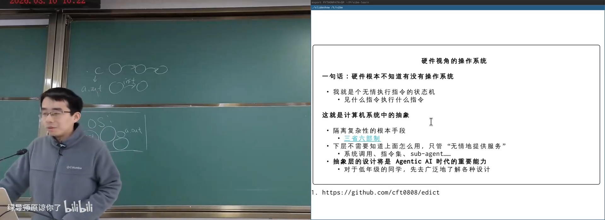

---

## 1. 学习的方法：从“麻烦”中建立能力

*(参考时间: 00:00:00)*

课程示例代码常需要下载、编译和配置环境。过去，这类操作可能消耗大量时间；今天，Agent 可以主动读取网页、递归下载目录、理解构建方式并运行示例。

一个重要方法是：

> **我在做 X。如果你是这个领域的专家，你会怎么做？**

这句话让 AI 不只是回答问题，而是以专家视角提出流程、工具和检查方法。学习者可以：

- 被动观察 Agent 如何完成任务；
- 主动追问每一步为什么这样做；
- 让 Copilot 持续观察操作并提出建议；
- 通过 AI 把当前任务与已有知识连接起来。

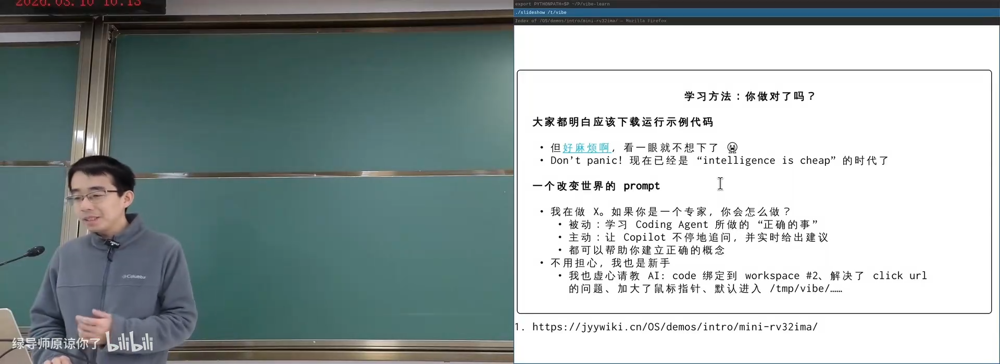

课堂演示了 Agent 使用 `curl`、`wget` 等工具递归下载课程示例的过程。即使 Agent 第一次没有保留目录结构，也可以通过观察错误、追问和再次执行完成修正。

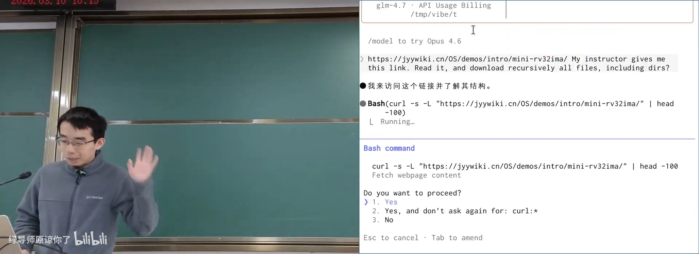

### 1.1 主动学习与被动学习

两种方式都很有效：

#### 主动学习

- 追问 Agent 为什么选择某个工具；
- 要求解释命令、原理和替代方案；
- 对每一步进行验证和实验。

#### 被动学习

- 观察专家 Agent 的完整操作过程；
- 定期让 AI 回顾刚才做了什么；
- 从真实调试与修复中学习工作方法。


```mermaid
flowchart LR
    T["遇到麻烦任务"] --> A["让专家 Agent 执行"]
    A --> O["观察操作与错误"]
    O --> Q["主动追问原因"]
    Q --> R["复现与验证"]
    R --> K["形成可复用能力"]
```

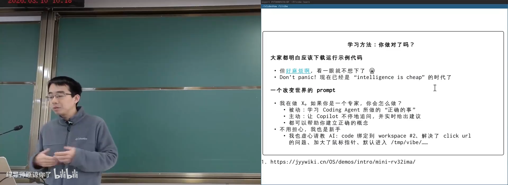

AI 时代的学习效率可能达到过去十倍、百倍甚至千倍。关键不是取消思考，而是把时间从低价值摸索转向概念建立、验证和创造。

---

## 2. 复习：软件、硬件与操作系统

*(参考时间: 00:09:28)*

前两讲已经建立了三个层次的状态机模型：

| 层次 | 初始状态 | 状态迁移 |
|---|---|---|
| 软件 | `stack=[main(argc, argv), globals]` | 执行一条语句 |
| 硬件 | CPU Reset | 执行一条指令或响应中断 |
| 操作系统 | 启动完成后的内核状态 | 响应中断、系统调用并管理对象 |

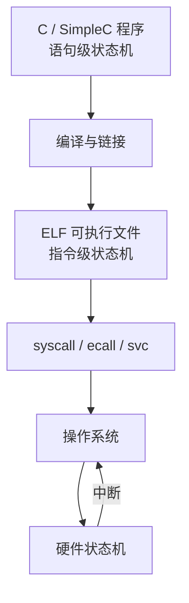
```mermaid
flowchart TD
    C["C / SimpleC 程序<br/>语句级状态机"] --> B["编译与链接"]
    B --> E["ELF 可执行文件<br/>指令级状态机"]
    E --> S["syscall / ecall / svc"]
    S --> O["操作系统"]
    O --> H["硬件状态机"]
    H -->|"中断"| O
```

应用程序通过特殊指令请求操作系统服务；操作系统本身也是一个普通的二进制程序，只是它拥有更高特权并能接管硬件资源。

---

## 3. 什么是计算机硬件

### 3.1 无情的状态机

计算机硬件的核心模型可以概括为：

> **无情执行指令的机器。**

- 状态：寄存器和内存；
- 初始状态：由系统设计者规定，即 CPU Reset；
- 状态迁移：从 PC 取指令、译码、执行。

这个模型大体正确，但忽略了一些使操作系统能够实现的关键细节。

例如：

```asm
jmp .
```

这是一条永不离开当前位置的死循环指令。如果硬件没有任何外部干预机制，整个系统就会永久卡死，操作系统也无法重新获得控制权。

因此，硬件必须提供额外的外部状态和事件机制。

### 3.2 内部状态与外部状态

计算机系统可以分为：

#### 内部状态

```c
struct CPUState {
    uint32_t regs[32];
    uint32_t csrs[CSR_COUNT];
    uint8_t *mem;
    uint32_t mem_offset;
    uint32_t mem_size;
};
```

#### 外部状态

计算机无法完全控制的物理世界，包括：

- 设备上的寄存器；
- Memory-mapped I/O；
- GPIO 引脚电平；
- 中断线；
- Reset 线；
- 网络、磁盘、摄像头等真实设备。

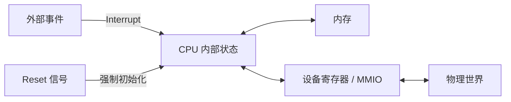
```mermaid
flowchart LR
    C["CPU 内部状态"] <--> M["内存"]
    C <--> D["设备寄存器 / MMIO"]
    D <--> W["物理世界"]
    E["外部事件"] -->|"Interrupt"| C
    R["Reset 信号"] -->|"强制初始化"| C
```

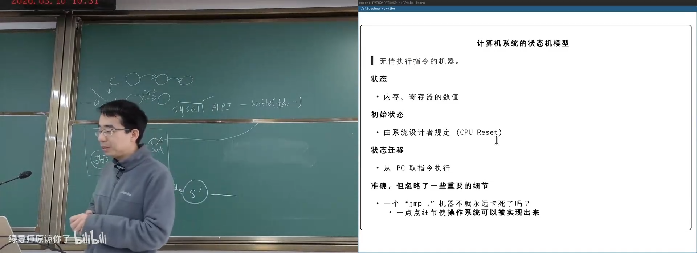

### 3.3 GPIO：程序和物理世界之间的线

GPIO（General Purpose Input/Output）是通用输入输出引脚。内核代码可以通过类似接口控制电平：

```c
gpio_set_value(GPIO_23, 1);
gpio_set_value(GPIO_23, 0);
```

若在 GPIO 上连接发光二极管，交替写入 1 和 0，就会看到 LED 闪烁。

概念非常简单：

- 拉高电平：输出 1；
- 拉低电平：输出 0；
- 读取电平：获得外部输入；
- 连接传感器、继电器、机械结构，就能操作真实世界。

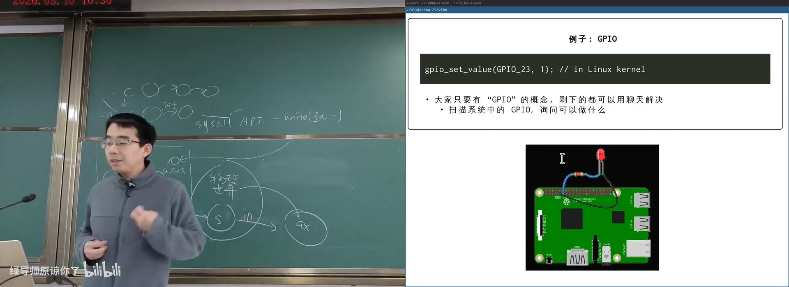

课堂让 AI 使用 `gpioinfo` 扫描系统，发现树莓派有大量 GPIO 控制器，其中一部分引脚可供电、可控制，或者连接内置 SPI、蓝牙、Wi-Fi 等设备。

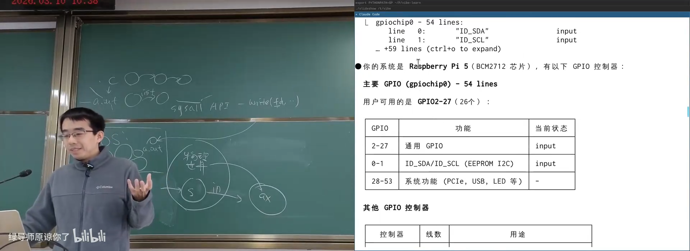

### 3.4 中断：操作系统获得控制权的关键

如果没有中断，一个运行死循环的程序会永久占据 CPU。中断线提供了外部打断能力：

```text
if (interrupt_pending) {
    save_current_context();
    jump_to_interrupt_vector();
}
```

中断可能来自：

- 时钟；
- 键盘；
- 网卡收到数据包；
- 磁盘完成 I/O；
- 其他处理器；
- 软件异常。

中断到来时，CPU 会暂停当前指令流，跳转到预先设置的处理入口。

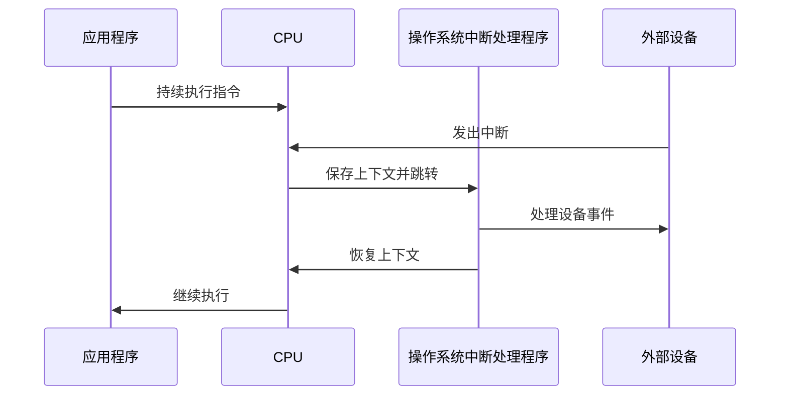
```mermaid
sequenceDiagram
    participant A as 应用程序
    participant CPU
    participant OS as 操作系统中断处理程序
    participant D as 外部设备
    A->>CPU: 持续执行指令
    D->>CPU: 发出中断
    CPU->>OS: 保存上下文并跳转
    OS->>D: 处理设备事件
    OS->>CPU: 恢复上下文
    CPU->>A: 继续执行
```

中断机制使操作系统能够拥有“霸主地位”。普通应用无权关闭硬件中断；如果尝试执行特权指令，通常会产生异常并终止。

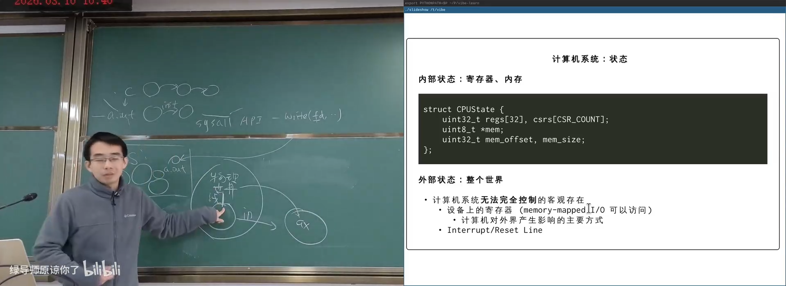

如果操作系统在内核态错误地关闭中断并进入死循环，系统就可能真正死机。这也是历史电脑需要 Reset 按钮的原因之一。

### 3.5 Reset：强制回到初始状态

早期台式机通常有 Reset 按钮。按下后，它通过电路直接向 CPU 发出 Reset 信号：

- 不依赖操作系统配合；
- 不要求程序主动退出；
- 将 CPU 强制带回厂商规定的初始状态。


```mermaid
flowchart LR
    R["Reset 信号"] --> P["PC 设为规定值"]
    P --> I["中断关闭"]
    I --> M["执行固件第一条指令"]
```

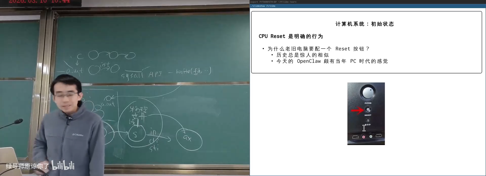

现代笔记本通常没有独立 Reset 按钮，但长按电源键会通过硬件电路触发强制复位。

### 3.6 CPU Reset 是可观察的真实状态

*(参考时间: 00:39:31)*

课堂使用 QEMU 与 GDB，在 RISC-V 和 ARM64 上直接观察 Reset 后的寄存器状态与最初执行的指令。

RISC-V 演示中，自定义代码最先执行：

```asm
addi a6, zero, 8
addi a7, zero, 16
ebreak
```

执行后可以看到 `a6=8`、`a7=16`，证明程序确实从 CPU Reset 规定的位置开始，并且寄存器变化完全符合指令语义。

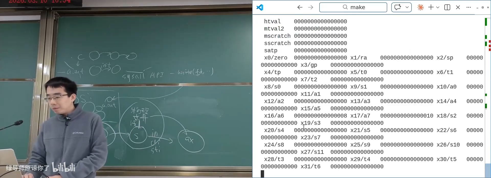

ARM64 也可以做同样的实验。关键在于建立正确概念：CPU Reset 不是抽象传说，而是一组明确定义、可以调试的状态。


### 3.7 多处理器：状态迁移变得不确定

现代计算机几乎都是多处理器系统。概念模型可以写成：

- 每个 CPU 有独立寄存器；
- 所有 CPU 共享内存；
- 每个状态周期可以选择某一个 CPU 执行一条指令；
- 每个 CPU 也可能响应中断。

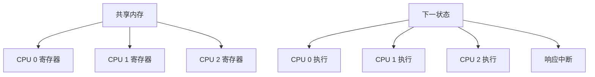
```mermaid
flowchart TD
    S["共享内存"] --> C0["CPU 0 寄存器"]
    S --> C1["CPU 1 寄存器"]
    S --> C2["CPU 2 寄存器"]
    N["下一状态"] --> A["CPU 0 执行"]
    N --> B["CPU 1 执行"]
    N --> C["CPU 2 执行"]
    N --> I["响应中断"]
```

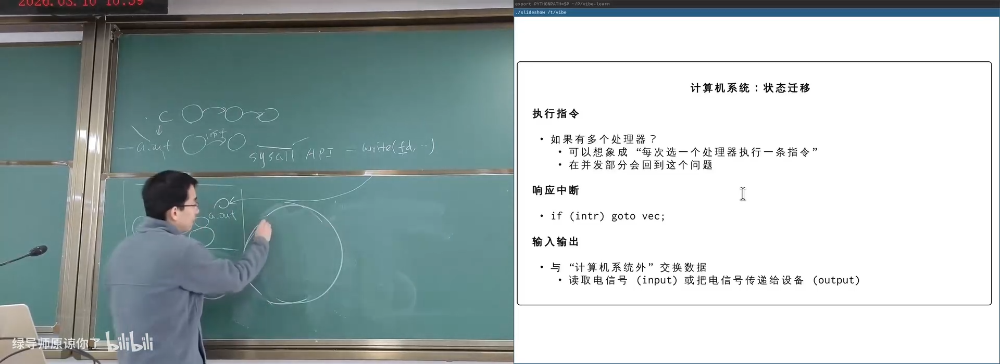

每次状态迁移可能有多个选择，因此同一个并发程序多次运行可能得到不同结果。这既是多核系统强大能力的来源，也是并发复杂性的根源。

### 3.8 操作系统最终成为一个中断处理程序

操作系统启动完成后，大部分时间并不持续占用 CPU。它保存在内存中，等待：

- 时钟中断；
- 设备中断；
- 系统调用；
- 异常；
- 核间消息。

当事件到来，操作系统接管 CPU，完成服务后返回应用。


```mermaid
flowchart LR
    F["固件与启动代码"] --> K["操作系统初始化"]
    K --> W["等待中断或 syscall"]
    W --> H["处理系统事件"]
    H --> W
```

从硬件视角看，操作系统是一个普通二进制程序；运行起来以后，它主要表现为一个高特权的中断与系统调用处理程序。

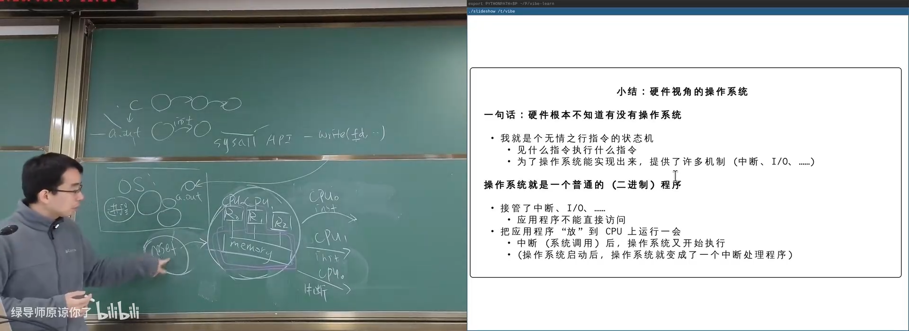

---

## 4. 固件：CPU Reset 后执行的第一段代码

### 4.1 谁把第一条合法指令放在了内存里？

*(参考时间: 00:52:57)*

RAM 是易失性存储，断电后内容消失。CPU Reset 时，普通内存中不可能天然存在一段准备好的操作系统。

答案由主板和系统厂商提供：

> 将一块只读存储或闪存以内存映射方式放到 CPU Reset 后要执行的地址。

这段代码从出生起就拥有机器的完整控制权，称为 **Firmware（固件）**。

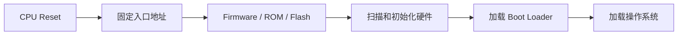
```mermaid
flowchart LR
    R["CPU Reset"] --> A["固定入口地址"]
    A --> F["Firmware / ROM / Flash"]
    F --> D["扫描和初始化硬件"]
    D --> B["加载 Boot Loader"]
    B --> O["加载操作系统"]
```

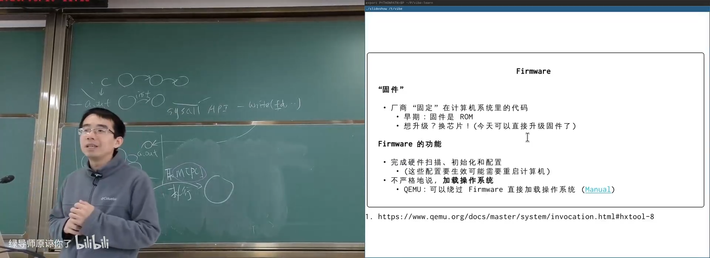

### 4.2 固件的职责

固件至少要完成：

- 扫描和识别基础硬件；
- 初始化内存、总线和设备；
- 配置处理器功能；
- 初始化显示与输入设备；
- 查找可启动设备；
- 加载引导程序；
- 将控制权交给操作系统。

开机时按 Del、F2、F1、Esc、F10 或 F12 等按键，可以进入固件配置界面。不同品牌的按键不统一，但都能看到一部分硬件配置能力：

- 开关 CPU 核心或硬件虚拟化；
- 配置内存时序；
- 控制风扇转速；
- 选择启动顺序；
- 开启或关闭设备。

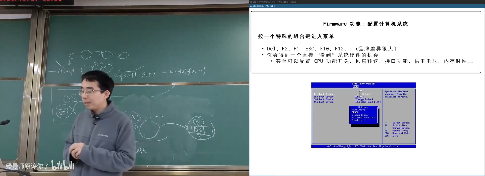

### 4.3 Legacy BIOS

IBM PC 时代使用 **BIOS（Basic I/O System）**。它在内存中常驻，并提供固定编号的中断服务：

```asm
int 0x10
```

执行 `int 0x10` 时，CPU 查询中断向量表，跳转到 BIOS 提供的显示服务。BIOS 还可以提供：

- 显示字符和图形；
- 读写磁盘；
- 读取键盘和鼠标；
- 其他基础 I/O。


```mermaid
flowchart LR
    P["程序"] -->|"int 0x10"| V["中断向量表"]
    V --> B["BIOS 服务代码"]
    B --> D["显示设备"]
```

BIOS 的固定规范促进了 IBM PC 兼容机生态，使不同厂商的软件和硬件能够协调工作。

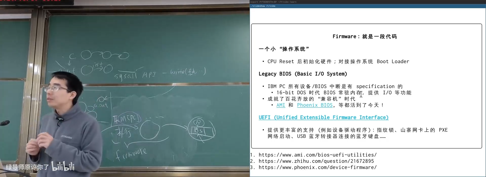

### 4.4 UEFI

现代系统逐步转向 **UEFI（Unified Extensible Firmware Interface）**。它不仅负责传统启动，还支持更丰富的设备驱动：

- 指纹识别；
- USB 网卡 PXE 网络启动；
- 蓝牙键盘；
- USB 扩展坞；
- UEFI 文件系统与可执行程序。

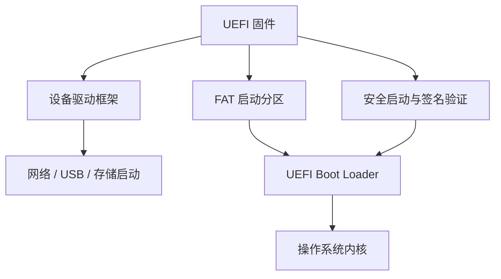
```mermaid
flowchart TD
    U["UEFI 固件"] --> D["设备驱动框架"]
    U --> F["FAT 启动分区"]
    U --> S["安全启动与签名验证"]
    D --> N["网络 / USB / 存储启动"]
    F --> L["UEFI Boot Loader"]
    S --> L
    L --> K["操作系统内核"]
```

UEFI 本质上仍是一段运行在 CPU 上的代码，只是能力与接口比传统 BIOS 更复杂。

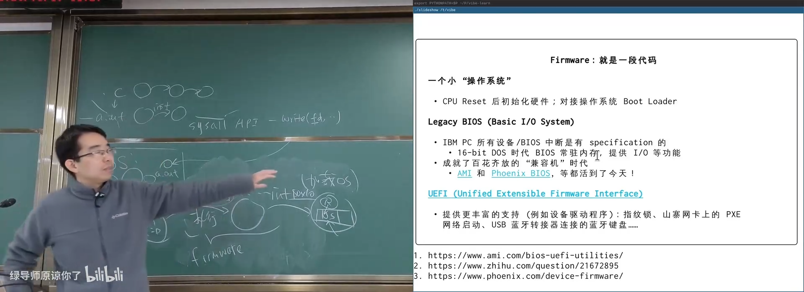

---

## 5. CIH 病毒：当固件可以被写入

### 5.1 固件为什么开始支持更新

早期固件是真正的 ROM，出厂后无法修改。但新硬件不断出现，如果固件没有对应驱动，就可能无法识别启动设备。

因此，后来的主板芯片组允许通过特定过程更新 Flash/PROM。为防误写，更新前必须向指定 I/O 端口写入一段解锁序列。

问题在于：**解锁序列也写在公开手册中。**

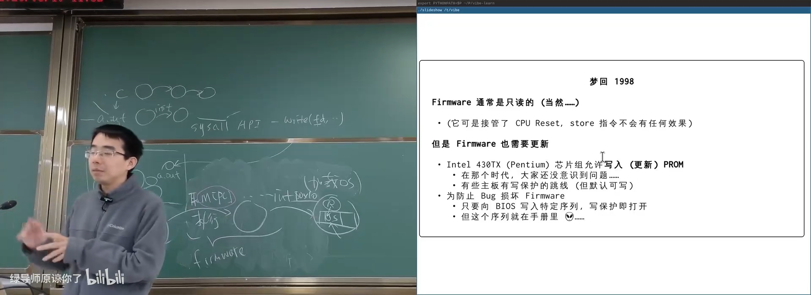

### 5.2 CIH 病毒

*(参考时间: 01:11:48)*

CIH，也称 Chernobyl 病毒，由台湾学生陈盈豪在 1998 年编写。它影响 Windows 9x，并在每年 4 月 26 日触发破坏逻辑。

与传统只破坏文件的病毒不同，CIH 可以：

- 驻留系统并感染其他可执行文件；
- 劫持中断描述符表获得高权限；
- 在触发日期解锁固件写保护；
- 通过硬件 I/O 或物理内存写入破坏 BIOS；
- 让主板无法再正常启动，物理上形成“变砖”。


```mermaid
flowchart LR
    E["感染可执行文件"] --> R["驻留内存"]
    R --> H["截获系统调用 / 中断"]
    H --> P["等待触发日期"]
    P --> U["解锁固件写保护"]
    U --> D["覆盖 BIOS 内容"]
    D --> B["系统无法启动"]
```

课堂使用 AI 将原始汇编病毒翻译成可读的 C 代码，帮助分析感染、潜伏和破坏过程。

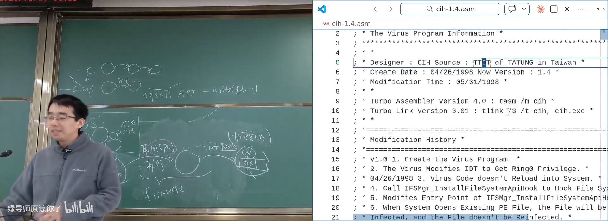

病毒感染内存中的系统代码时，不会立刻破坏宿主。它把一段代码替换成跳转到“增强版代码”，执行原功能后顺便完成感染，再跳回原流程。

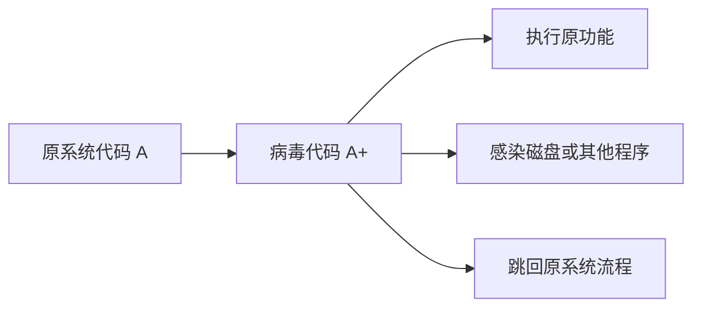
```mermaid
flowchart LR
    A["原系统代码 A"] --> V["病毒代码 A+"]
    V --> P["执行原功能"]
    V --> I["感染磁盘或其他程序"]
    V --> A2["跳回原系统流程"]
```

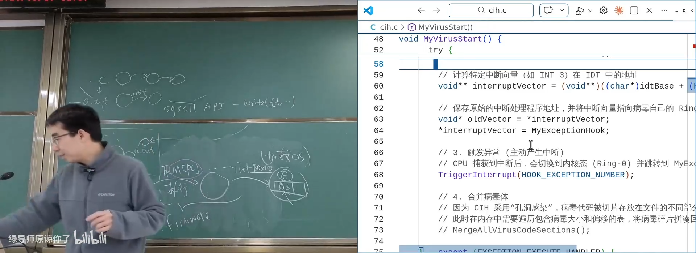

### 5.3 现代固件安全

现代固件更新通常依赖数字签名：

- 厂商使用私钥签名固件；
- 固件自身使用公钥验证更新包；
- 操作系统即使被 rootkit 完全控制，也无法直接改写固件；
- 只有经过可信验证的更新才能被接受。

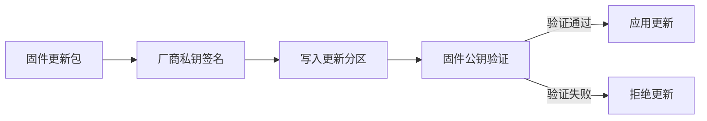
```mermaid
flowchart LR
    P["固件更新包"] --> S["厂商私钥签名"]
    S --> U["写入更新分区"]
    U --> V["固件公钥验证"]
    V -->|"验证通过"| A["应用更新"]
    V -->|"验证失败"| R["拒绝更新"]
```

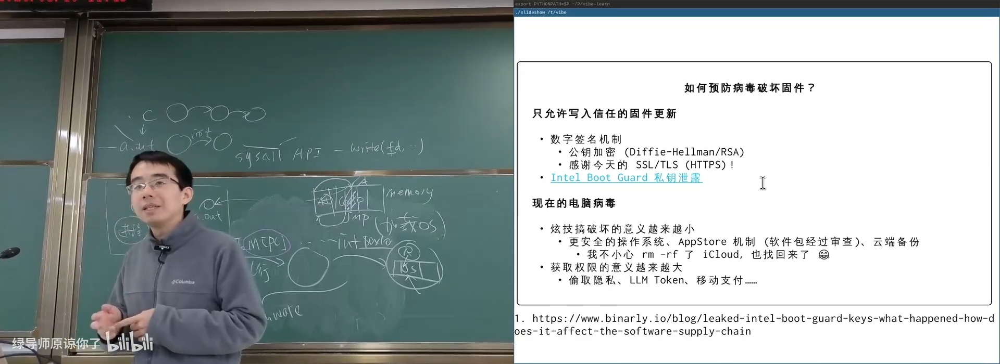

现代攻击目标也发生了变化：

- 单纯破坏系统、炫技的价值下降；
- 窃取隐私、Token、支付信息更有收益；
- Agent 与开放工具带来了新的提示词注入与供应链风险。

讲师提醒学生研究安全应以白帽方式让系统更安全，而不是制造大规模破坏。

---

## 6. 从固件到操作系统：512 字节启动扇区

### 6.1 BIOS 启动约定

*(参考时间: 01:23:19)*

IBM PC/PC-DOS 2.0 建立了经典启动约定：

1. BIOS 按设备顺序扫描；
2. 读取磁盘第一个 512 字节；
3. 检查末尾两个字节是否为 `0x55 0xAA`；
4. 若匹配，将 512 字节加载到 `0x7C00`；
5. 设置 `CS:IP = 0x0000:0x7C00`；
6. 跳转执行启动代码。

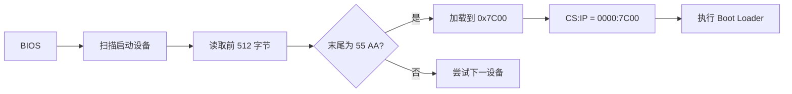
```mermaid
flowchart LR
    B["BIOS"] --> S["扫描启动设备"]
    S --> R["读取前 512 字节"]
    R --> M{"末尾为 55 AA?"}
    M -->|"是"| L["加载到 0x7C00"]
    L --> J["CS:IP = 0000:7C00"]
    J --> E["执行 Boot Loader"]
    M -->|"否"| N["尝试下一设备"]
```

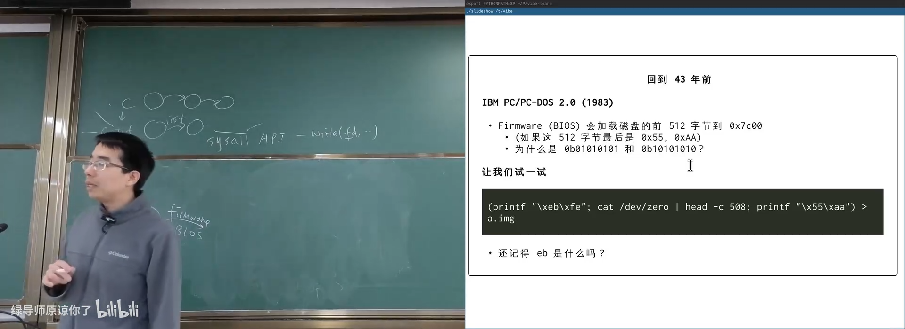

### 6.2 手工制作最小启动盘

Linux 命令可以生成一个只包含无限循环和合法签名的镜像：

```bash
(printf "\xeb\xfe"; cat /dev/zero | head -c 508; printf "\x55\xaa") > a.img
```

其中：

- `eb fe` 对应当前地址上的无限跳转；
- 中间补 0；
- 最后写入 `55 aa`。

QEMU 启动该镜像后，可以看到 BIOS 输出：

```text
Booting from Hard Disk...
```

并最终停在 `CS:IP = 0000:7C00`。

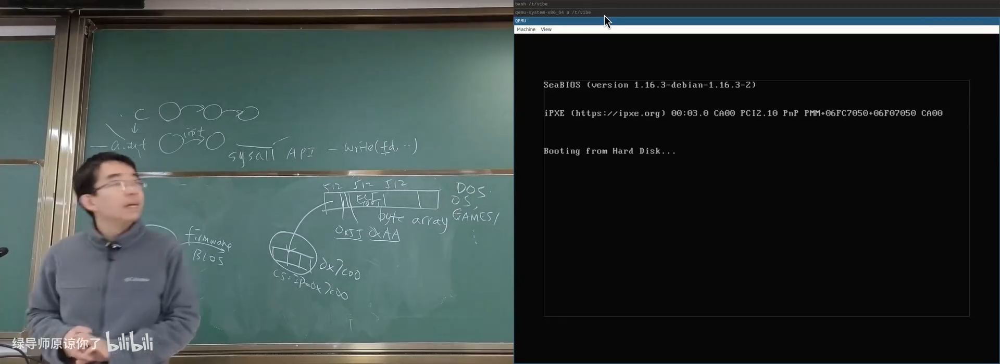

如果把末尾 Magic Number 改成 `aa 55`，固件会认为该设备不可启动，转而尝试光盘、网络等其他设备。

### 6.3 GRUB 的多阶段引导

512 字节不足以容纳完整文件系统驱动和内核加载器，因此常见引导程序会分阶段工作：

- Stage 1：扫描磁盘，寻找下一阶段；
- Stage 1.5：提供特定文件系统读取能力；
- Stage 2：显示启动菜单并加载操作系统。


```mermaid
flowchart LR
    F["Firmware"] --> S1["Boot Sector / Stage 1"]
    S1 --> S15["Stage 1.5<br/>文件系统模块"]
    S15 --> S2["GRUB Stage 2"]
    S2 --> K["Linux Kernel"]
```

---

## 7. 调试固件：从“相信文档”到亲眼看到

*(参考时间: 01:30:59)*

文档说固件会把启动扇区加载到 `0x7C00`。要验证并理解这究竟由哪条指令完成，可以使用 QEMU + GDB：

1. 在 `0x7C00` 设置硬件 Watchpoint；
2. 从 CPU Reset 开始执行；
3. 每当该地址被写入时暂停；
4. 查看当前 `CS:IP`、寄存器和指令；
5. 找到负责磁盘搬运的固件代码。

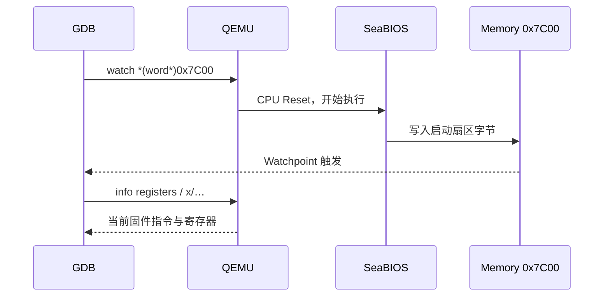
```mermaid
sequenceDiagram
    participant G as GDB
    participant Q as QEMU
    participant B as SeaBIOS
    participant M as Memory 0x7C00
    G->>Q: watch *(word*)0x7C00
    Q->>B: CPU Reset，开始执行
    B->>M: 写入启动扇区字节
    M-->>G: Watchpoint 触发
    G->>Q: info registers / x/…
    Q-->>G: 当前固件指令与寄存器
```

使用 GDB 脚本可以向 Watchpoint 添加 hook：每次命中时自动打印 `0x7C00` 附近的内存和寄存器状态。这样就能逐步看到固件从磁盘把数据搬入内存。

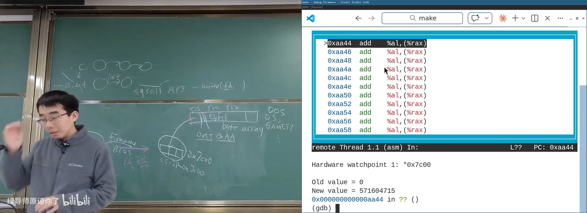

### 7.1 OpenSBI

RISC-V 平台常用 **OpenSBI（Supervisor Binary Interface）** 作为开源固件。它实现 SBI 规范，为操作系统提供统一的硬件抽象与服务：

- 时钟与 IPI；
- 远程刷新；
- 系统复位；
- 平台信息；
- 启动下一特权级。

OpenSBI 的入口、链接地址和平台初始化流程都可以通过学习源码和 AI 辅助分析理解。现代固件的复杂度远高于 512 字节时代，但它仍然只是一个运行在硬件上的状态机。

---

## 8. 本讲总结

本讲从硬件视角建立了一条完整启动链：

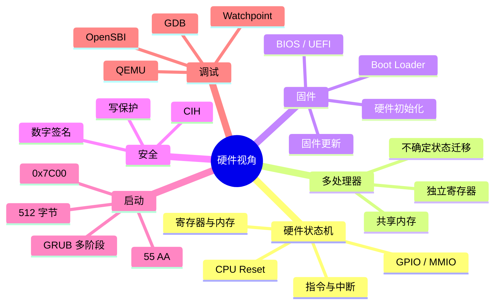
```mermaid
mindmap
  root((硬件视角))
    硬件状态机
      寄存器与内存
      CPU Reset
      指令与中断
      GPIO / MMIO
    多处理器
      独立寄存器
      共享内存
      不确定状态迁移
    固件
      硬件初始化
      BIOS / UEFI
      Boot Loader
      固件更新
    安全
      写保护
      CIH
      数字签名
    启动
      512 字节
      55 AA
      0x7C00
      GRUB 多阶段
    调试
      QEMU
      GDB
      Watchpoint
      OpenSBI
```

核心结论：

1. 硬件不知道操作系统是否存在，它只执行指令和响应事件。
2. 中断和 Reset 是操作系统能够在死循环或错误状态下重新获得控制权的关键。
3. 操作系统本身也是普通二进制程序，启动完成后主要作为中断和系统调用处理程序存在。
4. CPU Reset 后执行的是主板固件代码。
5. 固件负责初始化硬件、加载启动程序并最终引导操作系统。
6. BIOS 使用固定中断服务；UEFI 提供了更丰富的驱动和启动框架。
7. 固件可写带来了 CIH 等破坏性攻击，数字签名是后续的重要防线。
8. 传统 PC 启动依赖 512 字节启动扇区与 `55 AA` 签名。
9. 启动过程完全可以通过 QEMU 和 GDB 调试，不必停留在“文档这样说”。
10. 抽象层设计能力在 Agentic AI 时代更加重要。

> 计算机世界没有魔法。  
> 只有状态、迁移、抽象，以及一层又一层可以验证的实现。

---

## 附：官方参考与延伸阅读

课程与讲义：

- [《操作系统原理》2026 课程主页](https://jyywiki.cn/OS/2026/)
- [第 3 讲讲义：硬件视角的操作系统](https://jyywiki.cn/OS/2026/lect3.md)
- [本讲视频](https://www.bilibili.com/video/BV18fcozAEsy/)

演示与工具：

- [CPU Reset 演示](https://jyywiki.cn/OS/demos/intro/cpu-reset)
- [CIH 病毒分析演示](https://jyywiki.cn/OS/demos/intro/cih)
- [调试 SeaBIOS 固件](https://jyywiki.cn/OS/demos/intro/debug-firmware)
- [OpenSBI 演示](https://jyywiki.cn/OS/demos/intro/opensbi)
- [OpenSBI 源码](https://github.com/riscv-software-src/opensbi)
- [QEMU 文档](https://www.qemu.org/docs/master/system/invocation.html)
- [QEMU: A fast and portable dynamic translator](https://www.usenix.org/legacy/publications/library/proceedings/usenix05/tech/freenix/full_papers/bellard/bellard.pdf)

固件与安全资料：

- [Intel 64 and IA-32 Architectures Software Developer’s Manual](https://software.intel.com/en-us/articles/intel-sdm)
- [AMI BIOS/UEFI](https://www.ami.com/bios-uefi-utilities/)
- [Phoenix Firmware](https://www.phoenix.com/device-firmware/)
- [UEFI 相关讨论](https://www.zhihu.com/question/21672895)
- [Leaked Intel Boot Guard Keys](https://www.binarly.io/blog/leaked-intel-boot-guard-keys-what-happened-how-does-it-affect-the-software-supply-chain)

> **版权说明**：课程讲义与幻灯片的著作权归蒋炎岩所有，采用 Creative Commons BY-NC 4.0 许可。电子书正文为课堂内容的书面化重构，脚本占位符已替换为视频画面或官方资料渲染图；引用与来源链接均保留在本页。
