# LLM、Agents 与 Scaling Law：从语言模型到最小操作系统

> **课程**：2026 春季学期《操作系统原理》，Hacking Day 选讲  
> **讲师**：蒋炎岩（jyy）  
> **官方课程主页**：<https://jyywiki.cn/OS/2026/>  
> **官方讲义**：<https://jyywiki.cn/OS/2026/lect4.md>  
> **视频来源**：[Bilibili BV1gEcmzzE4P](https://www.bilibili.com/video/BV1gEcmzzE4P/)  
> **版权说明**：课程讲义与幻灯片归蒋炎岩所有，采用 [Creative Commons BY-NC 4.0](http://creativecommons.org/licenses/by-nc/4.0/) 许可；本电子书是对课堂讲授的书面化重构，保留出处与许可说明。

## 导读：Hacking Day

*(参考时间: 00:00:00)*

课程调整为 3 学分后，每四次课安排一次 Hacking Day，讲授与操作系统和应用生态相关的扩展知识，不作为考试内容。

本讲讨论三个相互关联的问题：

1. 大语言模型为什么能够理解世界并生成代码？
2. Agent 为什么能像人一样长期工作？
3. 为什么“增加算力、数据和模型规模”能够带来智能的质变？

课堂最后不依赖预演，直接让 Coding Agent 生成一个 RISC-V 最小操作系统内核，并观察它如何规划、写代码、编译、报错和修复。

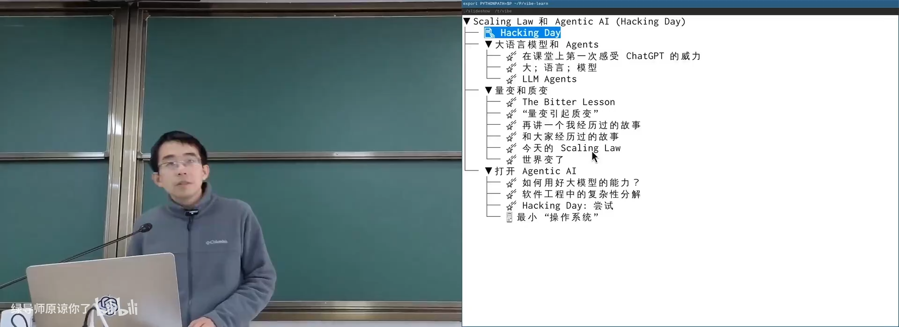

---

## 1. 第一次感受到 ChatGPT 的威力

*(参考时间: 00:02:10)*

ChatGPT 发布仅两个多月时，课堂曾询问它一个编译器优化问题：一段包含内联汇编的 C 代码，经过编译后会得到怎样的结果？

当时的 GPT-3.5 给出了相当准确的回答。那一刻让人感觉世界发生了根本变化：

- 模型不仅会背知识，还表现出程序语言和编译行为的“直觉”；
- 自然语言成为可以直接调用复杂专业知识的接口；
- 编程不再只属于熟练程序员。

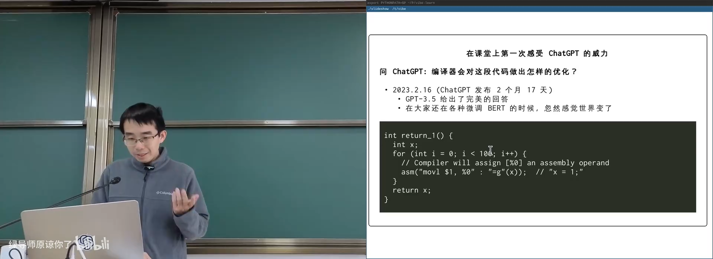

---

## 2. 什么是大语言模型

### 2.1 大：应对宏观复杂性的必要条件

*(参考时间: 00:03:55)*

薛定谔在《生命是什么》中提出过一个看似朴素的问题：为什么原子这么小，而生命体这么大？

一个原子能携带的信息非常有限。极少数原子组成的系统，很难承载生命和智能表现出的复杂性。因此，“大”是应对宏观复杂世界的必要条件。

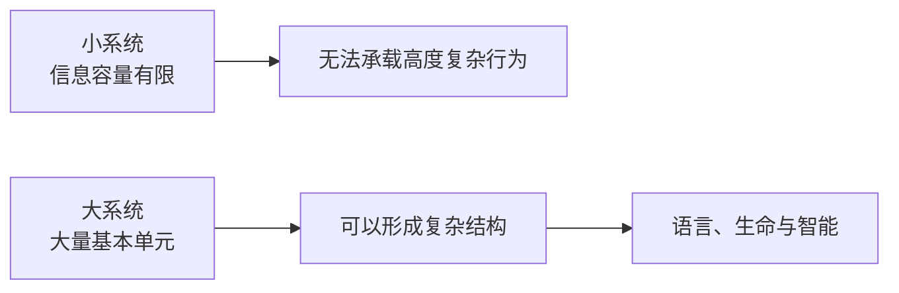
```mermaid
flowchart LR
    A["小系统<br/>信息容量有限"] --> B["无法承载高度复杂行为"]
    C["大系统<br/>大量基本单元"] --> D["可以形成复杂结构"]
    D --> E["语言、生命与智能"]
```

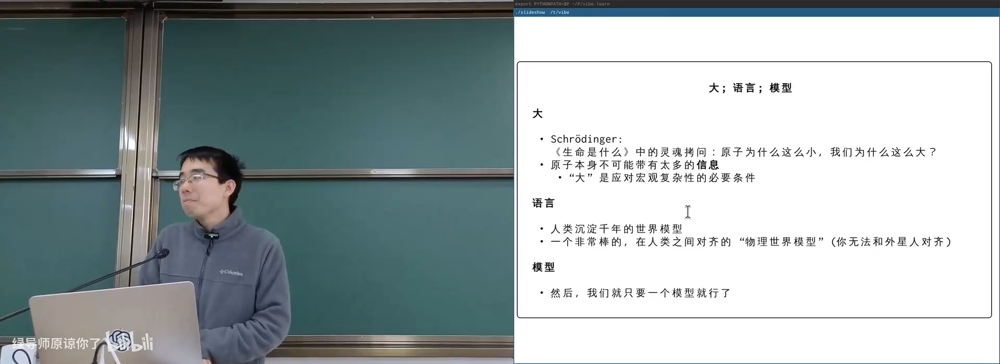

### 2.2 语言：人类沉淀的世界模型

*(参考时间: 00:05:49)*

为什么大语言模型选择“语言”作为核心，而不是图像或棋局？

讲师认为，语言是人类几千年以来共同积累、相互对齐的世界模型。例如：

> “我在来上课的路上看到一个美女。”

这句话非常短，但背后隐含了：

- 什么是“来上课”；
- 什么是“路上”；
- 什么是“看到”；
- 什么是“美女”；
- 每个人如何在各自经验中解构这个概念。

不同人想到的形象不同，但概念结构大致相似，因为人类共享物理世界、教育体系和文化经验。这种共享 Grounding 使语言能够成为跨个体对齐的抽象。

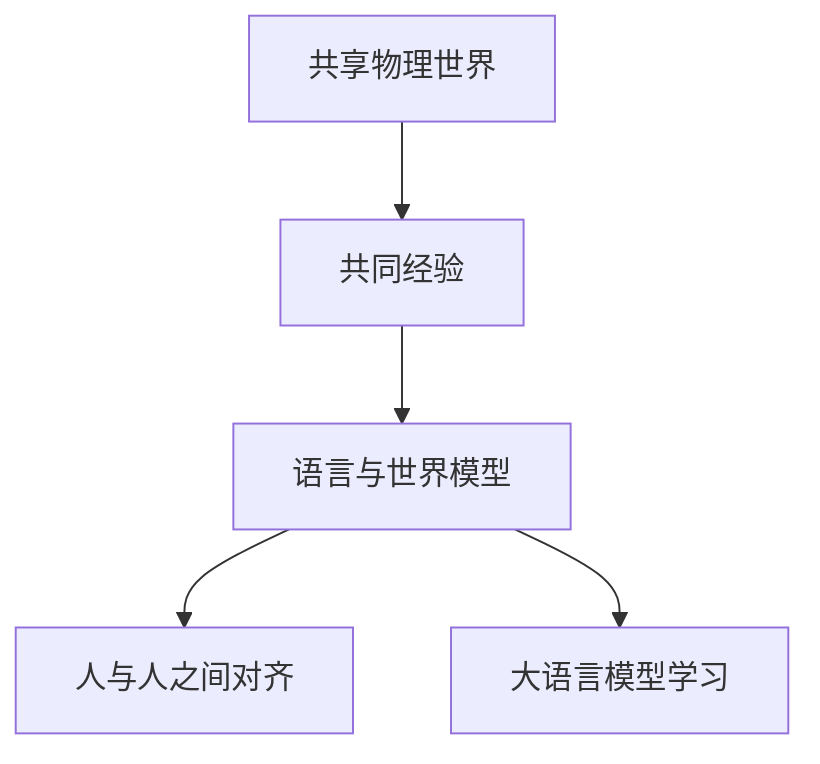
```mermaid
flowchart TD
    W["共享物理世界"] --> E["共同经验"]
    E --> L["语言与世界模型"]
    L --> A["人与人之间对齐"]
    L --> M["大语言模型学习"]
```

这也解释了模型有时为什么理解得很好，有时又会误解：语言压缩了信息，也丢失了部分个体经验。

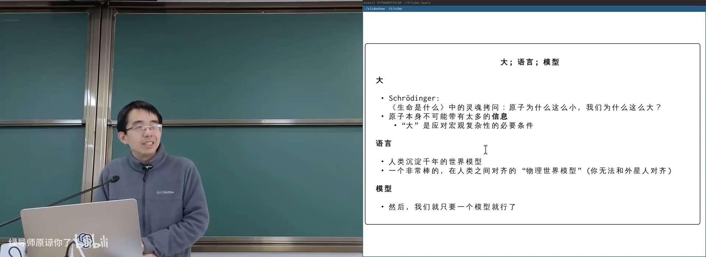

### 2.3 模型：Next Token Prediction

*(参考时间: 00:09:40)*

语言模型的核心机制是根据已有上下文，预测下一个 token 的概率分布。

训练通常分为两个阶段：


```mermaid
flowchart LR
    T["大规模文本"] --> P["预训练<br/>学习世界与语言结构"]
    P --> F["后训练<br/>指令遵循与对话"]
    F --> C["上下文 / Context"]
    C --> N["预测 next token"]
    N --> C
```

- 预训练：从海量文本学习语言、知识和统计规律；
- 后训练：把模型调整为愿意遵循指令、进行对话的助手；
- 推理：根据完整上下文不断预测下一个 token。

图片、语音和视频等多模态信息最终也可以映射到同一视觉或语言空间，因此模型可以统一处理不同感官输入。

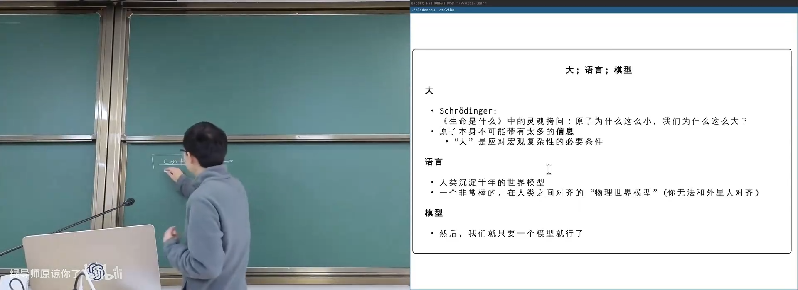

### 2.4 为什么概率模型能够写程序

*(参考时间: 00:11:07)*

2022 年，Google 发布 AlphaCode，展示了神经模型在编程竞赛中的潜力。课堂回忆起当时最令人震惊的问题：

> 一个只会预测下一个 token 的模型，为什么能顺序写出上百行正确程序？

结构与人类编写代码的方式不同。人类程序员通常会：

1. 理解问题；
2. 设计算法；
3. 写伪代码；
4. 把伪代码逐步翻译成代码。

如果把伪代码视为草稿纸，那么最后“写代码”可以近似看成一种机器翻译任务。


```mermaid
flowchart LR
    P["问题描述"] --> R["推理与伪代码"]
    R --> C["代码生成"]
    C --> T["编译与测试"]
    T -->|"失败"| R
    T -->|"成功"| O["可运行程序"]
```

大模型在上下文中保留足够多中间结果后，可以把复杂思考转成接近线性的生成过程。这也是将模型能力继续扩展的关键。

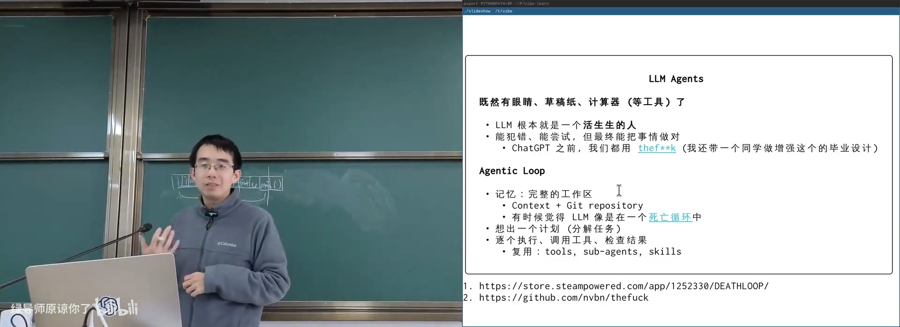

---

## 3. 从语言模型到具有感官和工具的 Agent

### 3.1 “眼睛”：ViT 与多模态

图像可以被切分成小块，每块映射成向量，再与文本 token 放在同一空间处理。ViT 等工作使“看图片”变成语言模型可以处理的任务。


```mermaid
flowchart LR
    I["图像"] --> P["切分为 patch"]
    P --> V["视觉向量"]
    V --> T["与文本 token 对齐"]
    T --> M["多模态语言模型"]
```

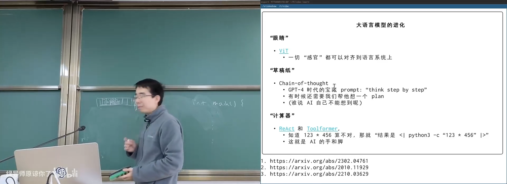

### 3.2 “草稿纸”：Chain-of-Thought

如果模型只在脑内一次性得到答案，就容易受有限上下文和短期工作记忆限制。把推理步骤写出来，可以显著提升复杂任务表现。

GPT-4 时代常使用：

```text
Think step by step.
```

例如计算 `123 + 456`，模型可以把数字拆成百位、十位和个位，再逐步组合。虽然路径更长，但每一步更简单，更容易保持正确。

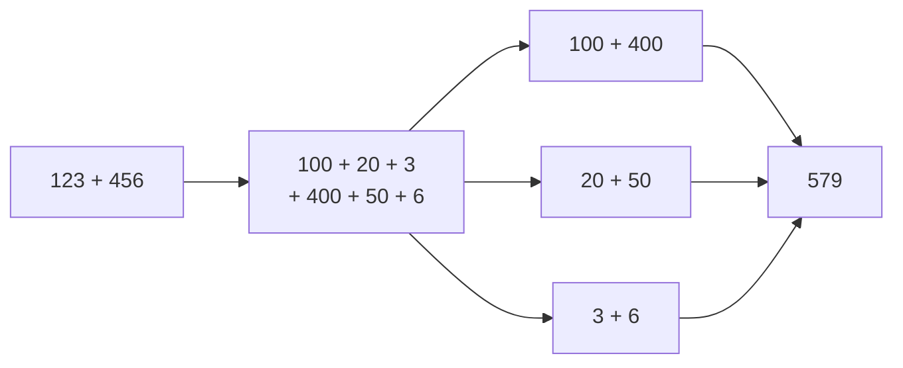
```mermaid
flowchart LR
    Q["123 + 456"] --> A["100 + 20 + 3<br/>+ 400 + 50 + 6"]
    A --> B["100 + 400"]
    A --> C["20 + 50"]
    A --> D["3 + 6"]
    B --> R["579"]
    C --> R
    D --> R
```

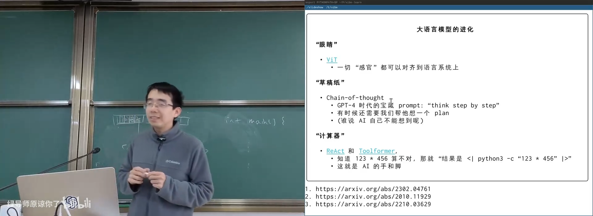

### 3.3 “计算器”：ReAct 与 Toolformer

模型不必自己完成所有计算。对 `123 × 456`，人类会自然打开计算器。类似地，模型可以输出调用工具的意图，把结果写回上下文后继续推理。

这就是 Agent 的“手和脚”。

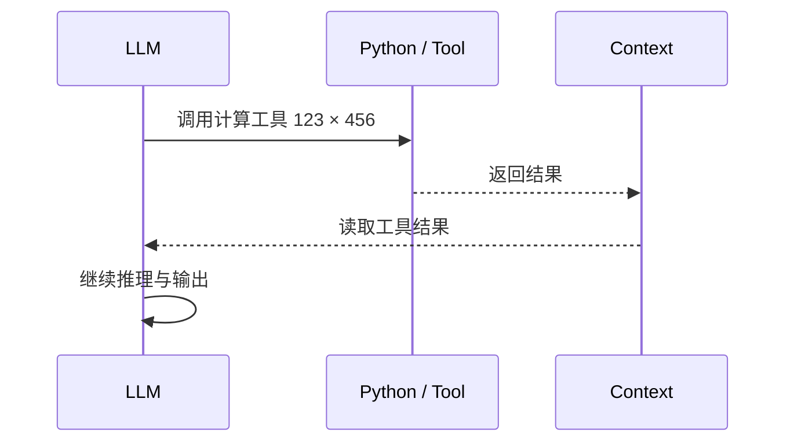
```mermaid
sequenceDiagram
    participant M as LLM
    participant T as Python / Tool
    participant C as Context
    M->>T: 调用计算工具 123 × 456
    T-->>C: 返回结果
    C-->>M: 读取工具结果
    M->>M: 继续推理与输出
```

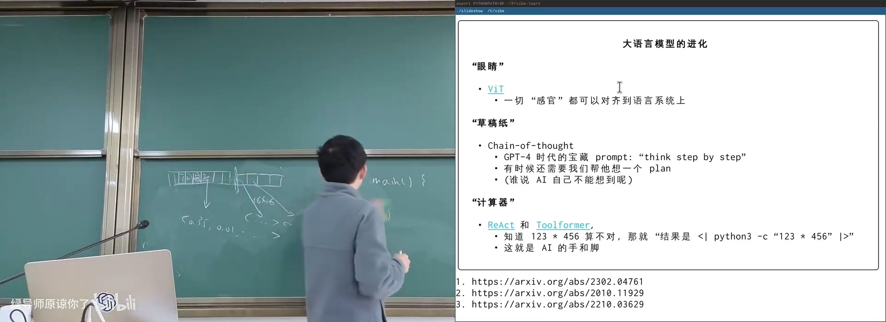

### 3.4 Agentic Loop

*(参考时间: 00:29:33)*

LLM 有眼睛、草稿纸和工具后，就接近一个能够犯错、尝试、修正并最终完成任务的“人”。

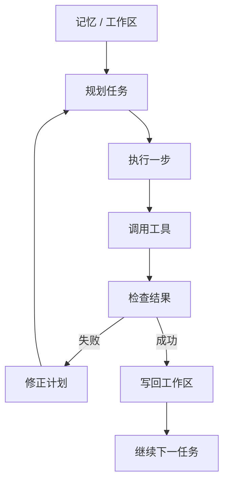
```mermaid
flowchart TD
    M["记忆 / 工作区"] --> P["规划任务"]
    P --> E["执行一步"]
    E --> T["调用工具"]
    T --> C["检查结果"]
    C -->|"失败"| R["修正计划"]
    R --> P
    C -->|"成功"| W["写回工作区"]
    W --> N["继续下一任务"]
```

Agent 还需要：

- 记忆：Context、文件系统、Git 仓库；
- 分解：把大任务拆成小任务；
- 执行：调用工具、运行测试；
- 检查：读取错误并验证；
- 复用：Tools、Sub-agents、Skills。

### 3.5 工作区就是 Agent 的工作记忆

一个项目目录就是理想的 Working Memory：

```text
project/
├── README.md
├── docs/
├── plan.md
├── src/
├── tests/
└── logs/
```

人类软件工程的长期最佳实践，恰好为 Agent 提供了完整的舞台。

#### Git 是一组平行宇宙

*(参考时间: 00:31:09)*

Git 保存目录快照。Agent 可以修改、提交、回退、创建分支、Cherry-pick 和合并。即使当前工作区被改乱，也能回到过去的快照。

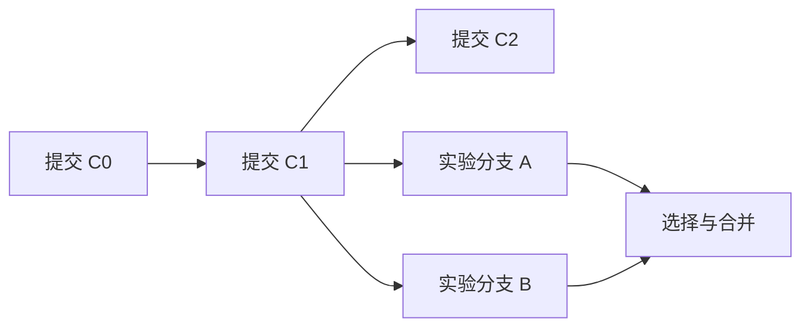
```mermaid
flowchart LR
    C0["提交 C0"] --> C1["提交 C1"]
    C1 --> C2["提交 C2"]
    C1 --> B1["实验分支 A"]
    C1 --> B2["实验分支 B"]
    B1 --> M["选择与合并"]
    B2 --> M
```

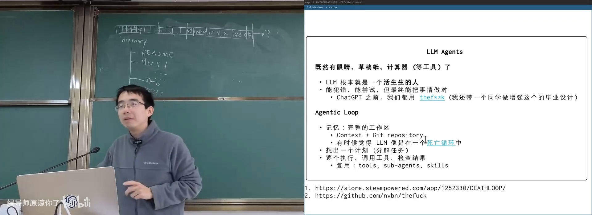

### 3.6 大模型像在“死亡循环”中工作

模型推理结束后不会永久保留工作记忆。下一次启动时，它只有训练好的参数和当前上下文。

因此，Agent 必须把计划写进 `plan.md`，把结果写进代码、测试和日志。这类似游戏 *Deathloop*：每一次醒来都失去记忆，只能通过外部世界保存进度。

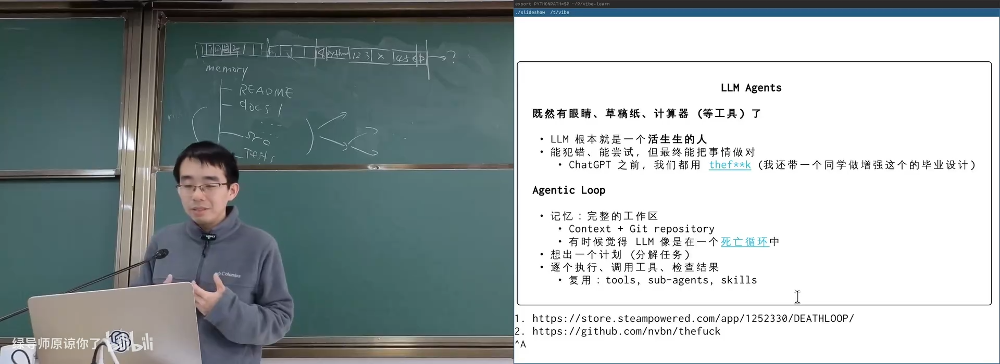

### 3.7 非程序员也可以使用工作区

工作区不是程序员专属。学生可以建立：

```text
study/
├── lectures/
├── exercises/
├── mistakes.md
├── schedule.md
└── exam-papers/
```

然后让 Agent：

- 根据薄弱知识点生成复习计划；
- 从错题本设计模拟题；
- 搜索往年题；
- 定时发送复习提醒；
- 把任务排入 `cron`。

讲师早已把个人文档、学习记录和工作资料放入结构化数据库，再通过 Claude Code、Telegram Bot 和定时任务管理。

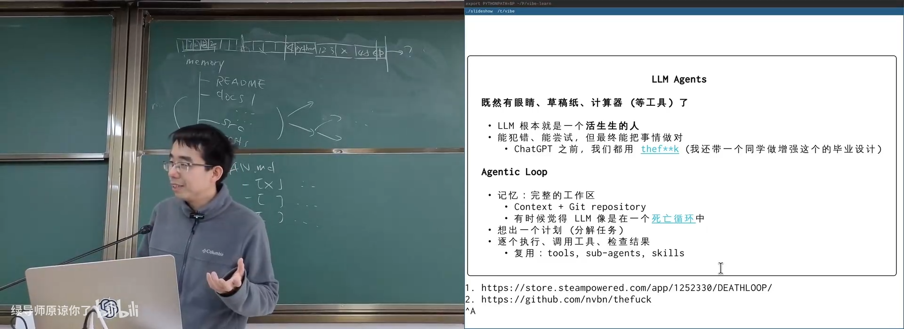

---

## 4. Scaling Law：量变如何引起质变

### 4.1 The Bitter Lesson

*(参考时间: 00:38:25)*

Richard Sutton 在《The Bitter Lesson》中指出，人类倾向于把领域知识、对称性和复杂先验写进系统，但长期最有效的方法，往往是能随着算力不断扩展的通用方法。

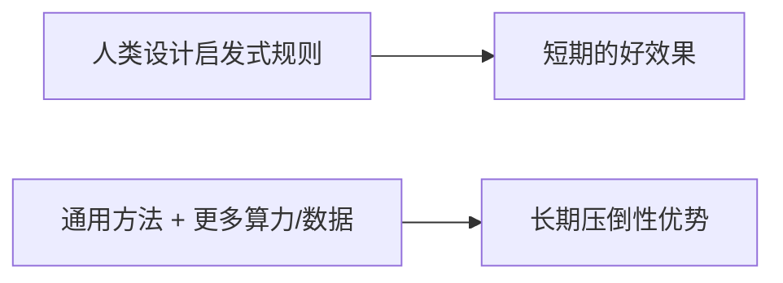
```mermaid
flowchart LR
    H["人类设计启发式规则"] --> L["短期的好效果"]
    S["通用方法 + 更多算力/数据"] --> G["长期压倒性优势"]
```

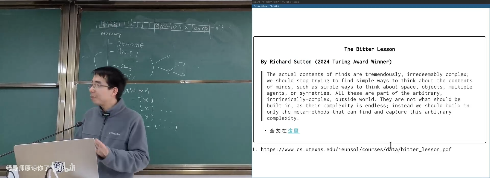

### 4.2 存储增长与搜索引擎

*(参考时间: 00:40:17)*

1980 年代，人们发现互联网数据增长速度慢于存储设备容量增长。按趋势外推，总有一天可以存下所有网页。

一旦“全量存储”和高效检索成为可能，搜索引擎就成为历史必然。

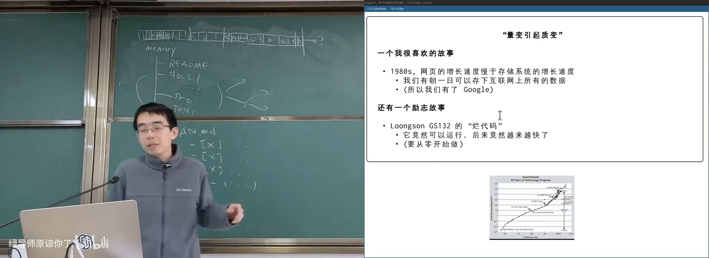

### 4.3 DeepBlue：象棋中的 Scaling Law

*(参考时间: 00:44:42)*

计算机象棋使用 Elo 评分系统衡量棋力。每增加一层搜索深度，机器棋力通常稳定提升。

当研究者意识到“智能可以随算力提升”后，最有收益的方向不再只是优化启发式规则，而是：

- 使用超级计算机；
- 设计象棋专用加速电路；
- 在单位时间搜索更深。

1997 年，DeepBlue 击败 Garry Kasparov。

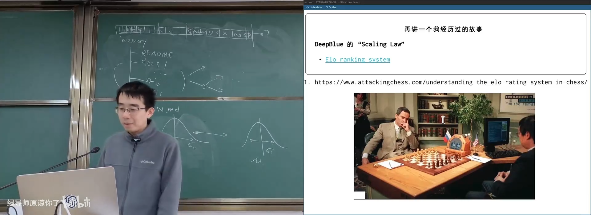

### 4.4 AlphaGo 与神经网络搜索

*(参考时间: 00:47:48)*

AlphaGo 把神经网络与蒙特卡洛树搜索结合，并使用卷积网络理解棋局。它延续了同样的规律：

> 所谓智能表现，可以通过更强的表示、更多数据和更多计算持续提升。

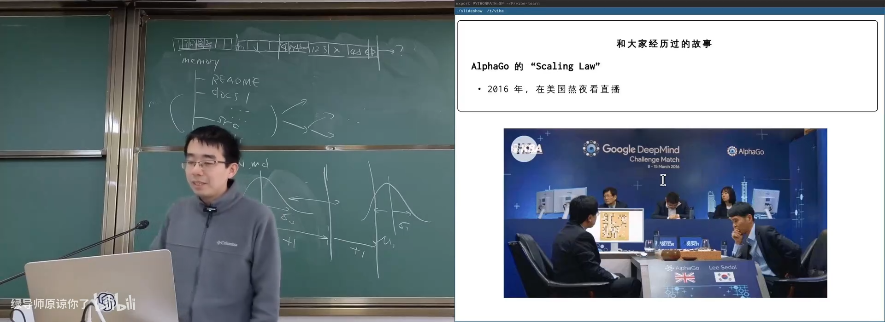

### 4.5 大语言模型的 Scaling Law

*(参考时间: 00:49:00)*

Kaplan Scaling Law 和 Chinchilla 论文说明：

- 模型参数、数据量与训练计算量存在可预测关系；
- 在给定计算预算下，参数和数据需要按比例增长；
- 训练 loss 会随规模增加而稳定下降；
- 小规模实验的结果可以外推到更大模型。

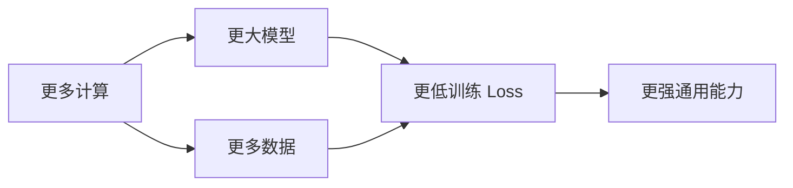
```mermaid
flowchart LR
    C["更多计算"] --> M["更大模型"]
    C --> D["更多数据"]
    M --> L["更低训练 Loss"]
    D --> L
    L --> A["更强通用能力"]
```

OpenAI 训练 GPT-3 时，并不知道所有设计细节是否最优，但小规模实验使研究者相信：

> 数据还没有把模型喂饱，扩大规模应该继续有效。

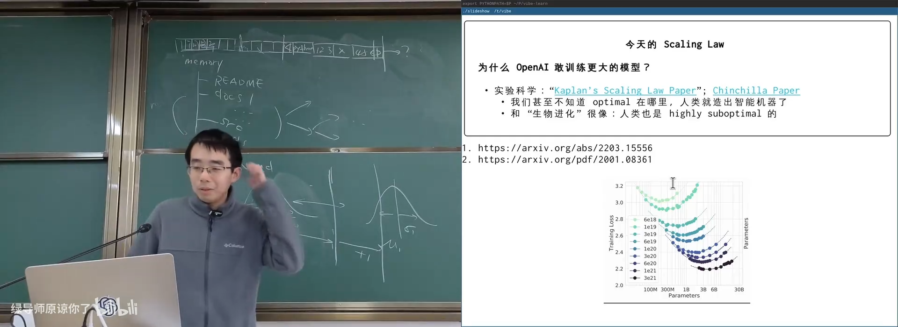

### 4.6 “Heuristics is dead”

*(参考时间: 00:54:03)*

Jim Gray 曾提出：

> Tape is Dead, Disk is Tape, Flash is Disk, RAM Locality is King.

课堂将这一表述类比到 AI：

> **Heuristics is dead, Policy is Heuristics, LLM is Policy, Mechanism is King.**

含义不是所有启发式方法都毫无价值，而是：

- 只靠手工规则和局部微调很难持续；
- 应构建可承载大规模数据和模型探索的机制；
- LLM 可以充当策略生成器；
- 真正重要的是能支撑智能持续扩展的系统底座。

### 4.7 正确的“量变”

“量变引起质变”不等于原地重复任何微小工作。

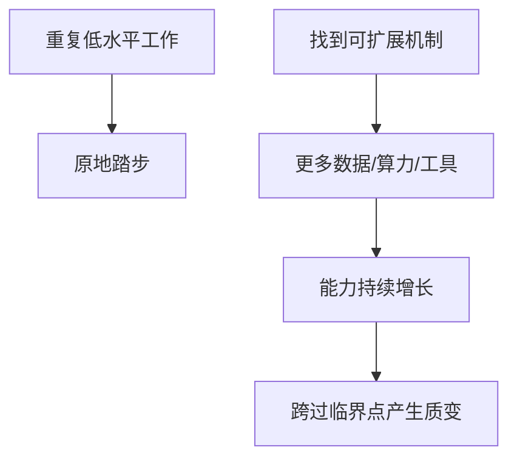
```mermaid
flowchart TD
    A["重复低水平工作"] --> X["原地踏步"]
    B["找到可扩展机制"] --> C["更多数据/算力/工具"]
    C --> D["能力持续增长"]
    D --> E["跨过临界点产生质变"]
```

需要找到真正能够复利的曲线。Agent、Skills、开放协议和可组合工具，都是当前可能“走量”的机制。

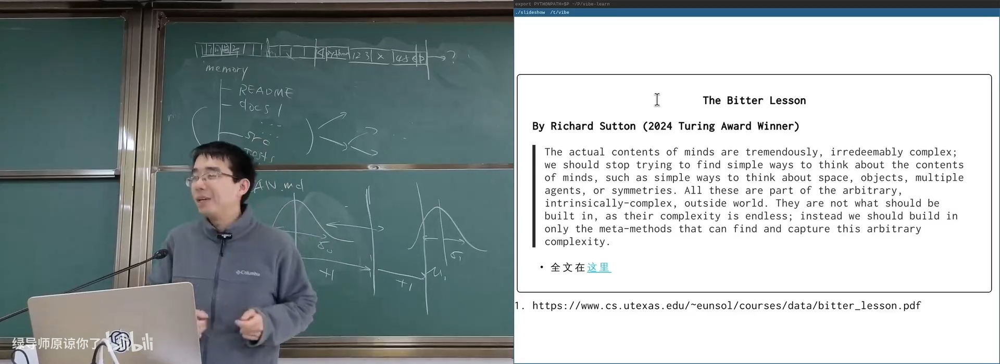

---

## 5. 如何用好大模型

### 5.1 Prompt Engineering 是 Attention Engineering

*(参考时间: 00:59:32)*

Transformer 的核心机制是 Self-Attention。提示词工程的目标，是让模型把注意力集中到真正重要的信息上，并抑制平庸的平均回答。

如果只说“写一篇小说”，模型可能生成泛化、平均的文本。要得到高质量结果，应提供：

- 人物与场景设定；
- 风格与结构；
- 禁止事项；
- 目标读者；
- 样例和评价标准。

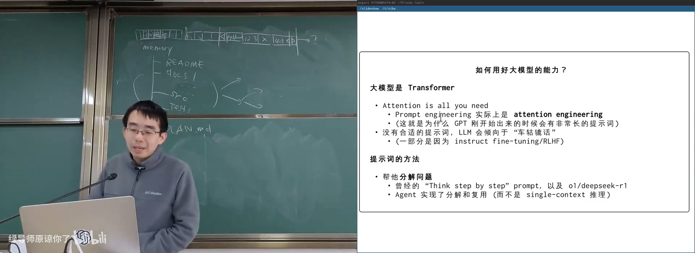

### 5.2 分解问题就是构建抽象

*(参考时间: 01:01:00)*

复杂任务无法直接交给 AI 时，最有效的方法是分解。

经典系统抽象包括：

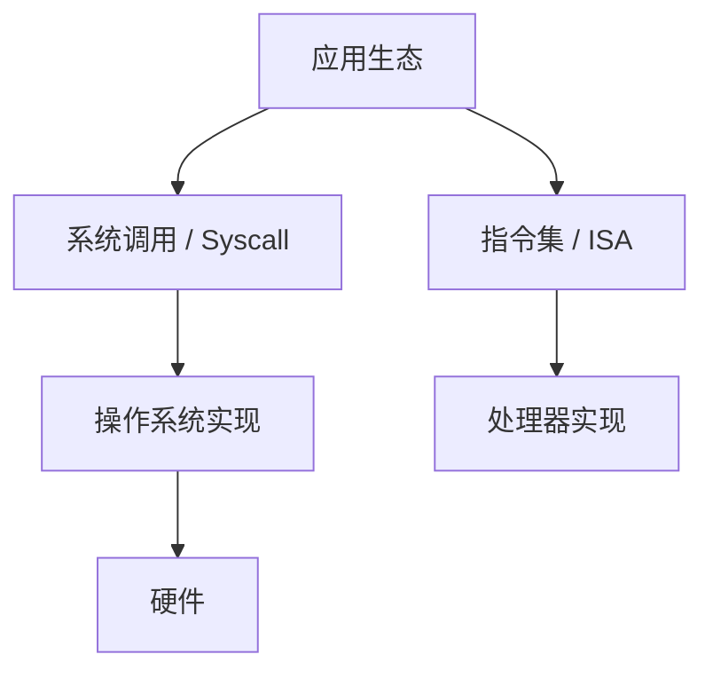
```mermaid
flowchart TD
    A["应用生态"] --> S["系统调用 / Syscall"]
    S --> O["操作系统实现"]
    O --> H["硬件"]
    A --> I["指令集 / ISA"]
    I --> H2["处理器实现"]
```

- 系统调用隔离应用生态与内核实现；
- 指令集隔离软件与处理器实现；
- 抽象层使上下两侧可以独立演化。

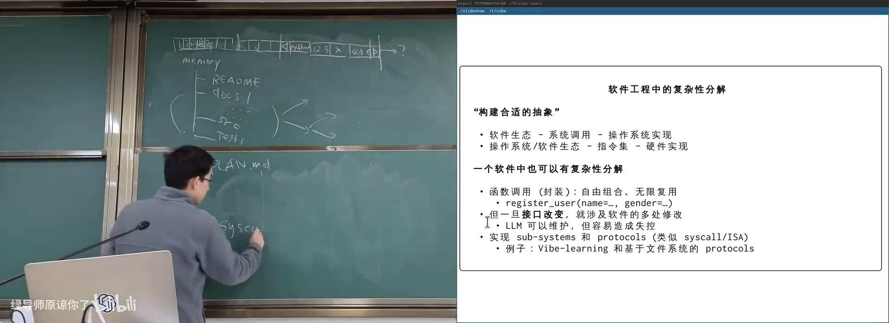

### 5.3 函数调用不够时，使用协议

*(参考时间: 01:06:33)*

函数调用可以直接组合，也方便复用。但当跨模块接口变化时，修改会扩散到整个系统。

另一种设计是定义子系统和协议，例如让多个组件通过文件系统通信。

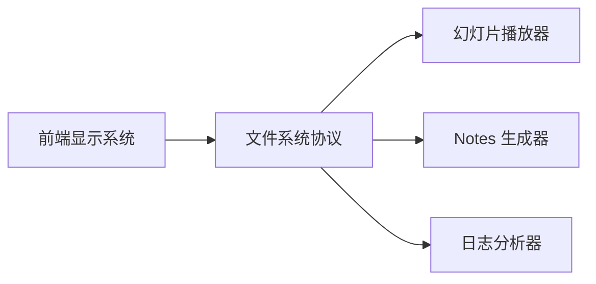
```mermaid
flowchart LR
    UI["前端显示系统"] --> F["文件系统协议"]
    F --> S["幻灯片播放器"]
    F --> N["Notes 生成器"]
    F --> L["日志分析器"]
```

课堂的 Vibe-learning 系统把幻灯片事件写入日志目录，由独立程序读取和渲染。前端和渲染器彻底解耦，多个 Agent 可以并行修改不同组件，而不污染整个项目。

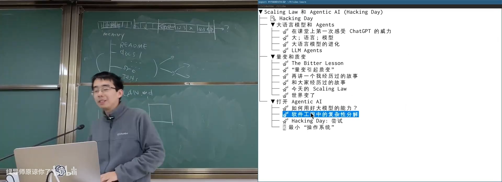

---

## 6. Hacking Day：用 Agent 实现最小操作系统

### 6.1 准备一个最小提示词

*(参考时间: 01:10:26)*

课堂准备了一个极简任务：

> 在不依赖外部库的情况下，实现一个可在 QEMU 启动的最小 RISC-V 操作系统，创建两个内核线程并展示调度与切换。

讲师要求自己暂时“清空”操作系统知识，只使用自然语言任务和 Agent 生成的 `CLAUDE.md` / `AGENTS.md` 设计文档。

文档中定义：

- 项目目标；
- 架构和流程；
- 禁止项；
- 测试方式；
- Working Style；
- 每次改动必须解释和运行最小测试。


```mermaid
flowchart LR
    G["自然语言目标"] --> D["CLAUDE.md / AGENTS.md"]
    D --> P["规划"]
    P --> C["生成代码"]
    C --> T["构建与测试"]
    T --> F["反馈修复"]
    F --> C
```

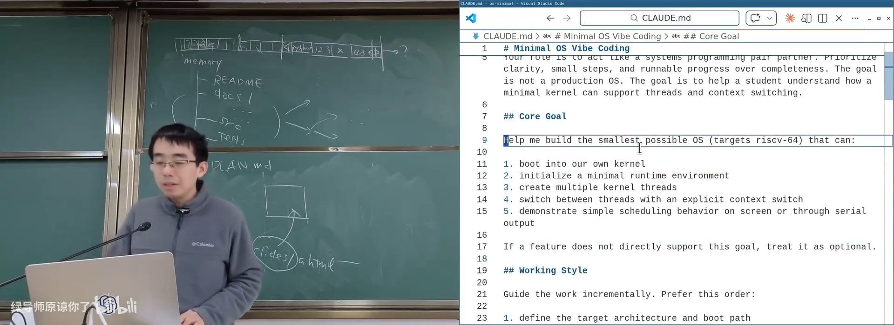

### 6.2 Agent 的规划与代码生成

Agent 首先创建目录、Makefile、`kernel.h`、`thread.h` 和源代码，再逐步实现：

- 内核入口；
- 最小 runtime 环境；
- 线程结构；
- 上下文切换；
- 汇编保存和恢复寄存器；
- 调度循环。

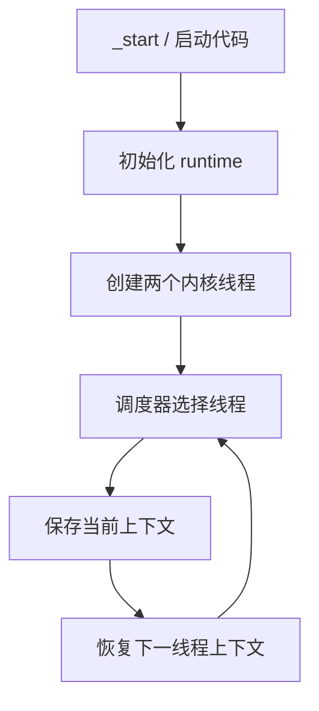
```mermaid
flowchart TD
    B["_start / 启动代码"] --> R["初始化 runtime"]
    R --> T["创建两个内核线程"]
    T --> S["调度器选择线程"]
    S --> C["保存当前上下文"]
    C --> N["恢复下一线程上下文"]
    N --> S
```

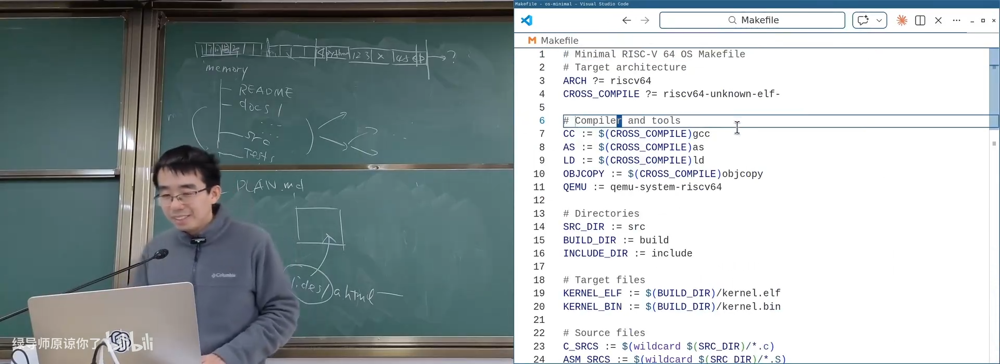

### 6.3 编译错误与自动修复

第一次构建出现了指针宽度转换问题：

```text
cast a pointer from integer of different size
```

Agent 根据错误信息修改类型和指针转换，再次编译。这个过程与人类做 Computer Systems 实验没有本质区别。

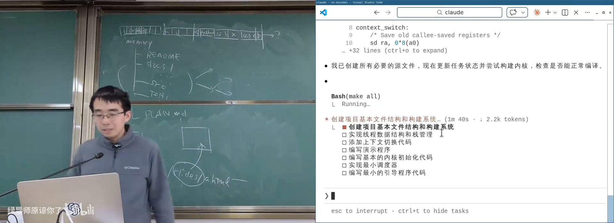

### 6.4 QEMU 中成功运行

构建完成后，最小操作系统在 QEMU 中运行，两个线程交替输出编号，显示上下文切换生效。

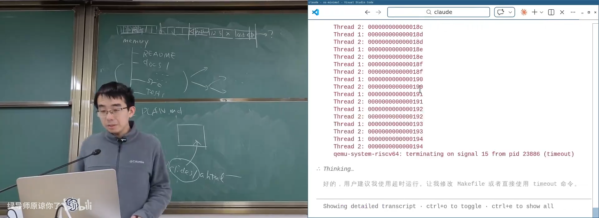

Agent 最终完成了一个令讲师意外的可用版本。这说明在今天：

- 大量“众所周知”的实现可以被模型复用；
- Agent 具备从任务规划到构建修复的完整工作流；
- 人类不需要事无巨细地编写每一行代码。

### 6.5 人类仍然重要在哪里

*(参考时间: 01:19:21)*

Agent 的行为带有强烈的“Do it”倾向：

1. 立即写大量代码；
2. 构建；
3. 看到错误；
4. 直接修复；
5. 继续运行。

人类系统工程师更倾向于先建立：

- 清晰的测试框架；
- 日志和 Trace 工具；
- 可重复运行环境；
- 抽象边界；
- 验证与断言机制。

Agent 运行长输出命令时，如果不及时停止，日志会大量进入 Context，浪费 Token 并淹没有效信息。更好的做法是提供最小 Test Framework，让每一步只返回最关键结果。

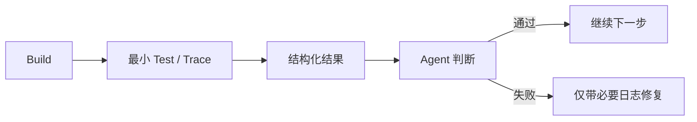
```mermaid
flowchart LR
    B["Build"] --> T["最小 Test / Trace"]
    T --> R["结构化结果"]
    R --> A["Agent 判断"]
    A -->|"通过"| N["继续下一步"]
    A -->|"失败"| F["仅带必要日志修复"]
```

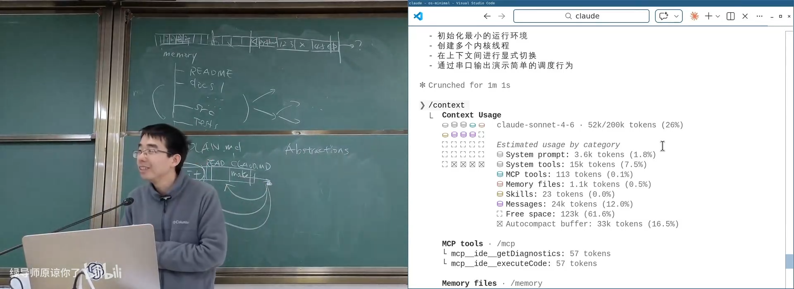

这些系统设计能力，是“人类智慧”在当前 Agent 工作流中仍然最重要的部分。

---

## 7. 本讲总结

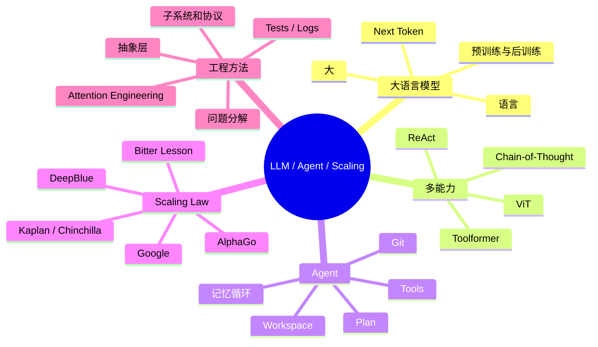
```mermaid
mindmap
  root((LLM / Agent / Scaling))
    大语言模型
      大
      语言
      Next Token
      预训练与后训练
    多能力
      ViT
      Chain-of-Thought
      ReAct
      Toolformer
    Agent
      Workspace
      Plan
      Tools
      Git
      记忆循环
    Scaling Law
      Bitter Lesson
      Google
      DeepBlue
      AlphaGo
      Kaplan / Chinchilla
    工程方法
      Attention Engineering
      问题分解
      抽象层
      子系统和协议
      Tests / Logs
```

核心结论：

1. 大语言模型通过海量语言学习人类共享的世界模型。
2. Next-token prediction 配合注意力机制，可以完成推理与程序生成。
3. 多模态、草稿纸和工具调用使模型逐渐具备完整 Agent 能力。
4. Agent 需要工作区、计划、Git、工具和验证机制维持长期记忆。
5. Scaling Law 表明算力、数据和参数可以稳定改善模型能力。
6. “量变引起质变”只适用于能够复利和扩展的机制。
7. Prompt Engineering 本质上是引导模型注意力。
8. 复杂问题必须通过分解和抽象解决。
9. 系统调用、ISA、文件系统协议都是适合 AI 协作的清晰边界。
10. Agent 已经能够完成最小操作系统实现，但测试、Trace、抽象与验证仍需要人类设计。

> **Heuristics is dead, Policy is Heuristics, LLM is Policy, Mechanism is King.**

---

## 附：官方参考与延伸阅读

课程与讲义：

- [《操作系统原理》2026 课程主页](https://jyywiki.cn/OS/2026/)
- [第 4 讲讲义：Scaling Law 和 Agentic AI](https://jyywiki.cn/OS/2026/lect4.md)
- [本讲视频](https://www.bilibili.com/video/BV1gEcmzzE4P/)

核心论文与资料：

- [The Bitter Lesson](https://www.cs.utexas.edu/~eunsol/courses/data/bitter_lesson.pdf)
- [An Image is Worth 16x16 Words: ViT](https://arxiv.org/abs/2010.11929)
- [ReAct: Reasoning and Acting in Language Models](https://arxiv.org/abs/2210.03629)
- [Toolformer](https://arxiv.org/abs/2302.04761)
- [Kaplan et al., Scaling Laws for Neural Language Models](https://arxiv.org/pdf/2001.08361)
- [Chinchilla Scaling Laws](https://arxiv.org/abs/2203.15556)
- [Elo Rating System](https://www.attackingchess.com/understanding-the-elo-rating-system-in-chess/)

课程演示与工程实践：

- [最小操作系统 os-minimal](https://jyywiki.cn/OS/demos/intro/os-minimal)
- [OpenClaw AGENTS.md](https://github.com/openclaw/openclaw/blob/main/AGENTS.md)
- [DEATHLOOP 游戏](https://store.steampowered.com/app/1252330/DEATHLOOP/)
- [thefuck：修复上一条命令](https://github.com/nvbn/thefuck)

> **版权说明**：课程讲义与幻灯片的著作权归蒋炎岩所有，采用 Creative Commons BY-NC 4.0 许可。电子书正文为课堂内容的书面化重构，脚本占位符已替换为视频画面或官方资料渲染图；引用与来源链接均保留在本页。
