# 程序和进程：fork、execve 与 exit

> **课程**：2026 春季学期《操作系统原理》，第 5 讲  
> **讲师**：蒋炎岩（jyy）  
> **官方课程主页**：<https://jyywiki.cn/OS/2026/>  
> **官方讲义**：<https://jyywiki.cn/OS/2026/lect5.md>  
> **视频来源**：[Bilibili BV1N8w9zJENu](https://www.bilibili.com/video/BV1N8w9zJENu/)  
> **版权说明**：课程讲义与幻灯片归蒋炎岩所有，采用 [Creative Commons BY-NC 4.0](http://creativecommons.org/licenses/by-nc/4.0/) 许可；本电子书是对课堂讲授的书面化重构，保留出处与许可说明。

## 导语：操作系统正片从虚拟化开始

*(参考时间: 00:03:07)*

前四讲建立了两个基础视角：

- 应用视角：操作系统 = 对象 + API；
- 硬件视角：操作系统 = 一个由固件加载的普通程序。

从本讲开始进入操作系统三大主题中的 **Virtualization（虚拟化）**：

> 操作系统如何把一台物理计算机抽象成多台“虚拟计算机”，让每个程序看起来都像独占一台机器？

核心抽象就是 **进程（Process）**。

课程仍使用较老的 Book8088 实物计算机演示：虽然它只有 16 位 CPU、没有 MMU，也没有现代保护模式，但同样可以运行程序、绘制图形和播放声音。它和今天的计算机在状态机模型上没有本质区别。

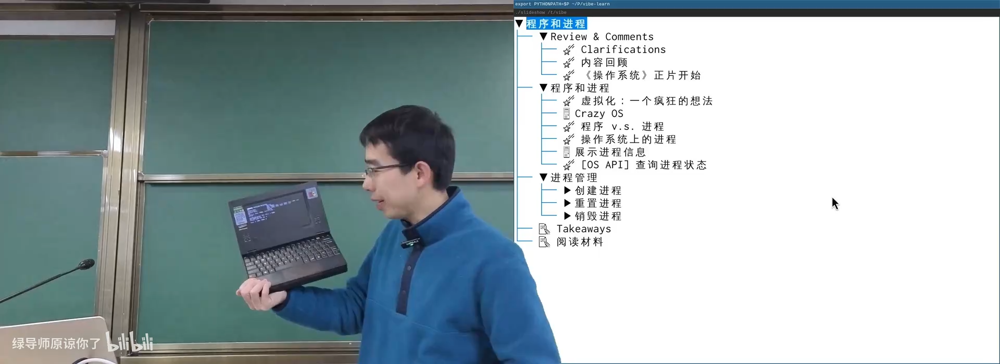

上一讲现场调用的模型日志显示，实际使用的是 `doubao-seed-2.0-code`。模型速度很快，但指令遵循和复杂推理能力相对较弱。即便如此，它仍然可以完成不少操作系统实验任务，说明工具与基础模型正在快速变化。


---

## 1. CrazyOS：用模拟器实现一个最小操作系统

### 1.1 可以同时运行两个程序吗？

*(参考时间: 00:08:01)*

假设没有操作系统，只有一个直接运行在硬件上的 C 程序。程序通常是顺序执行的：

```c
main();
p1();
p2();
```

如果 `p1` 是死循环，`p2` 永远不会开始。

但我们能否不用硬件 MMU，也不依赖真实操作系统，在软件里模拟两个程序“同时运行”？

答案是肯定的。

在汉诺塔的非递归实现中，我们已经知道：

- 每个程序都是一个状态机；
- 状态包括寄存器、内存、栈帧和 PC；
- 只要不断取出下一条语句并执行，就能模拟程序运行。

如果模拟器持有 `p1` 和 `p2` 两份状态，就可以轮流推进：

```c
while (1) {
    p = pickup_one();
    p->single_step();
}
```

这就是 CrazyOS。

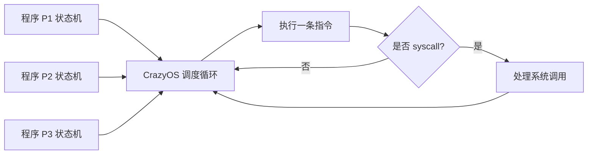
```mermaid
flowchart LR
    P1["程序 P1 状态机"] --> C["CrazyOS 调度循环"]
    P2["程序 P2 状态机"] --> C
    P3["程序 P3 状态机"] --> C
    C --> S["执行一条指令"]
    S --> E{"是否 syscall?"}
    E -->|"否"| C
    E -->|"是"| H["处理系统调用"]
    H --> C
```

真实操作系统不会逐条解释指令，而是把进程状态加载到 CPU 上运行一段时间，再通过中断保存和切换。这就是上下文切换与时间片轮转的原理。

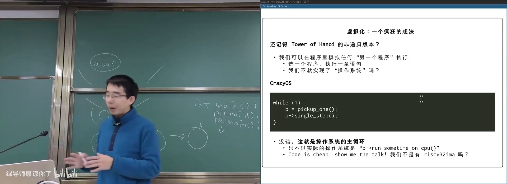

### 1.2 CrazyOS 如何运行真实程序

CrazyOS 使用 `mini-rv32ima` 模拟 RISC-V 指令。每个程序拥有：

- 独立的 CPU 状态；
- 独立内存；
- 程序入口 PC；
- 一个操作系统内部的状态结构 `struct proc`。

课堂中 `P1` 每次累加 10，`P2` 每次累加 1。CrazyOS 使用 Round-Robin 策略：

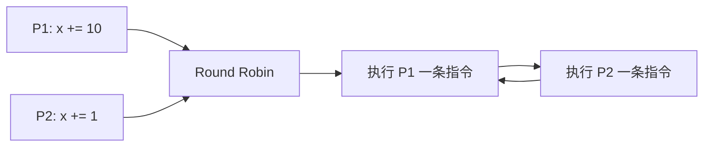
```mermaid
flowchart LR
    P1["P1: x += 10"] --> R["Round Robin"]
    P2["P2: x += 1"] --> R
    R --> S1["执行 P1 一条指令"]
    S1 --> S2["执行 P2 一条指令"]
    S2 --> S1
```

系统还实现了自定义 `putchar` 系统调用：程序把字符放入缓冲区，遇到换行或缓冲区满时，操作系统代理输出。

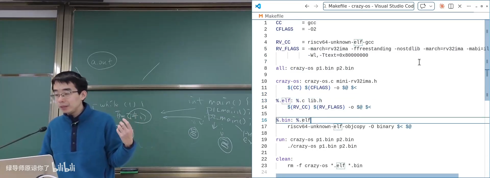

执行 `P1` 和 `P2` 时，可以看到两个程序交替输出。数字越大的 `P1` 需要执行更多输出逻辑，因此推进速度逐渐落后于 `P2`，具体反映了“每条指令执行一次”而非“每次执行相同时间”的调度模型。

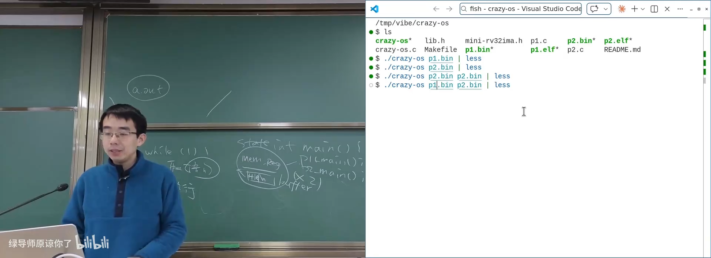

---

## 2. 程序和进程

### 2.1 程序是静态描述，进程是运行实例

*(参考时间: 00:20:38)*

程序是状态机的静态描述，包含：

- 初始状态；
- 状态迁移规则；
- 指令序列；
- 数据布局；
- 入口地址。

进程是程序状态机在操作系统中的一次运行实例：

```text
程序：hello.bin
进程：PID 1234 正在运行 hello.bin
```

同一个程序可以同时运行多份，形成多个进程。每个进程都有自己的一份：

- 寄存器值；
- 内存内容；
- 栈和 PC；
- 打开文件；
- 操作系统内部状态。

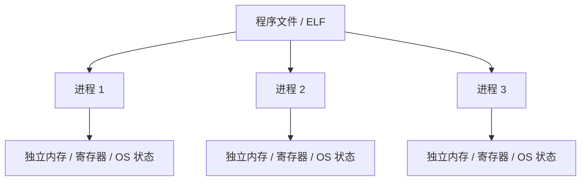
```mermaid
flowchart TD
    F["程序文件 / ELF"] --> P1["进程 1"]
    F --> P2["进程 2"]
    F --> P3["进程 3"]
    P1 --> S1["独立内存 / 寄存器 / OS 状态"]
    P2 --> S2["独立内存 / 寄存器 / OS 状态"]
    P3 --> S3["独立内存 / 寄存器 / OS 状态"]
```

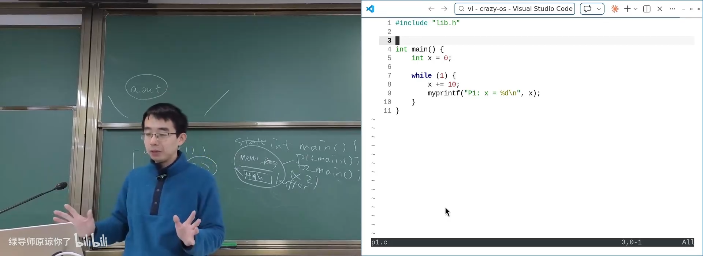

### 2.2 进程还有哪些操作系统状态？

*(参考时间: 00:27:47)*

应用程序从自身内存和寄存器只能看到程序状态，无法直接看到操作系统保存的额外信息。

真实进程可能拥有：

- `pid`：进程号；
- `ppid`：父进程号；
- `pgid`：进程组；
- UID、EUID、GID、EGID；
- 命令行参数；
- 调度信息与优先级；
- 已使用 CPU 时间和内存；
- 打开的文件描述符；
- 信号处理状态；
- 地址空间映射。

课堂让 AI 编写工具，通过 `/proc` 和系统调用尽可能完整地展示进程状态。

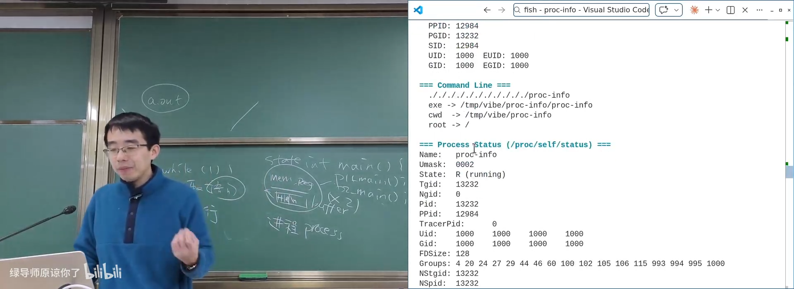

### 2.3 procfs：用文件系统观察进程

UNIX 发明了 `procfs`，把进程信息映射为文件目录：

```text
/proc/<pid>/
/proc/self/
```

可以通过：

```c
readdir();
open();
read();
```

读取：

- `cmdline`：启动命令与参数；
- `status`：进程基本信息；
- `stat`：调度与运行状态；
- `maps`：地址空间映射；
- `fd/`：打开的文件描述符；
- `cwd`：当前工作目录；
- 其他子系统和内核状态。


```mermaid
flowchart LR
    P["用户进程"] --> V["VFS"]
    V --> F["procfs"]
    F --> K["进程 / 调度 / 内存 / 文件内核对象"]
    K --> F
    F --> P
```

`procfs` 是操作系统信息的宝库，也是理解进程内部状态的优秀入口。

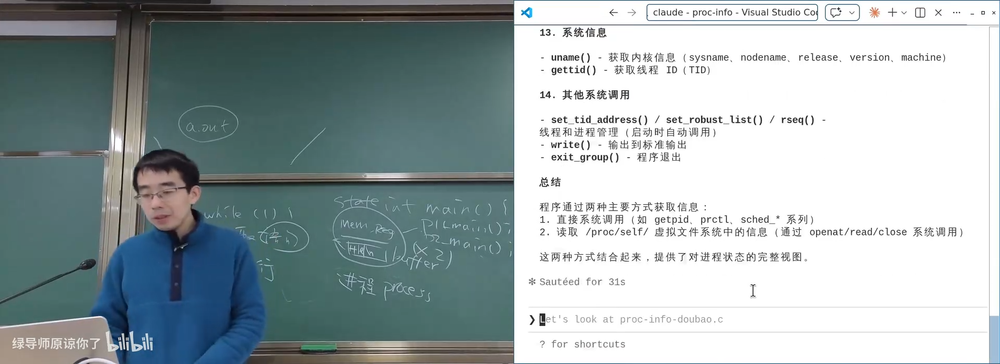

---

## 3. 进程管理：创建、重置、销毁

### 3.1 操作系统是状态机管理者

进程管理可以概括为三类操作：

| 操作 | 直观 API | UNIX API |
|---|---|---|
| 创建状态机 | `spawn(path, argv)` | `fork()` |
| 重置状态机 | `load(path, argv)` | `execve()` |
| 销毁状态机 | `terminate(status)` | `_exit()` |

UNIX 没有直接提供 `spawn`，而是采用：

```text
Spawn = fork + execve
```

这使创建进程具有极大的灵活性。

### 3.2 fork：完整复制当前状态机

```c
pid_t fork(void);
```

`fork()` 的行为是立即复制当前进程：

- 寄存器和内存的完整状态；
- 栈和 PC；
- 打开文件等操作系统资源；
- 进程的一些内部属性。

如何区分父子进程？

- 子进程：`fork()` 返回 0；
- 父进程：`fork()` 返回子进程 PID；
- 失败：返回 -1，并设置 `errno`。

```c
pid_t pid = fork();

if (pid == -1) {
    perror("fork");
} else if (pid == 0) {
    /* 子进程 */
} else {
    /* 父进程，pid 是子进程号 */
}
```

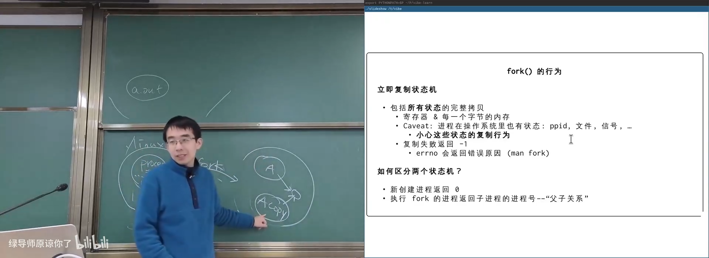

课堂中在 CrazyOS 里实现的 `fork` 也只需要：

1. 找到空闲 `struct proc`；
2. 复制旧进程全部状态；
3. 设置父子进程不同的返回值。

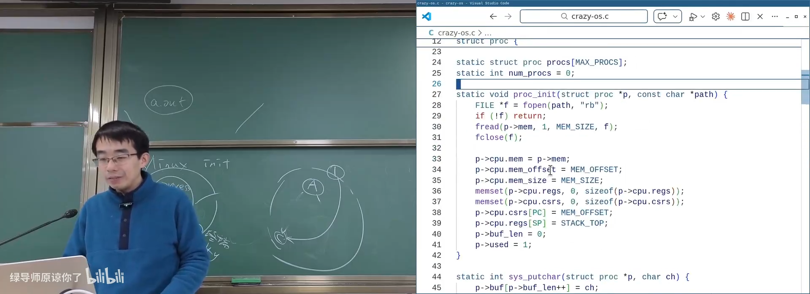

### 3.3 进程树与孤儿进程

进程通过父子关系形成树：

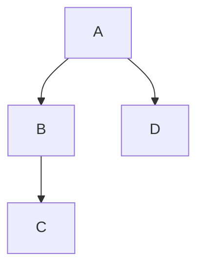
```mermaid
flowchart TD
    A["A"] --> B["B"]
    B --> C["C"]
    A --> D["D"]
```

如果进程 B 先退出，C 的 `ppid` 应该是什么？

如果保留 B 的 PID，而 B 的编号之后可能被新进程复用，就会把一个错误进程识别为父进程。

UNIX 采用的办法是：

- PID 1 永远不会退出；
- 失去父进程的孤儿进程被重新托管给 PID 1；
- 这样每个进程的 `ppid` 始终合法。

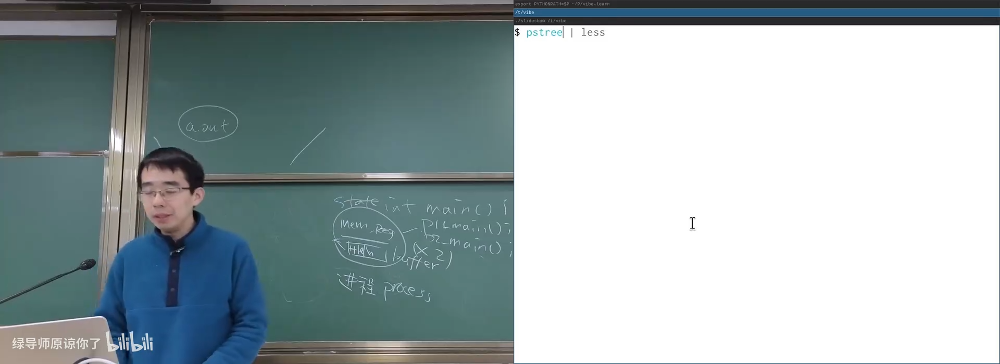

课堂让 AI 创建五层进程树，随机退出部分进程，再用 Mermaid 可视化整个父子关系，直观看到孤儿进程被重新挂到 1 号进程下。

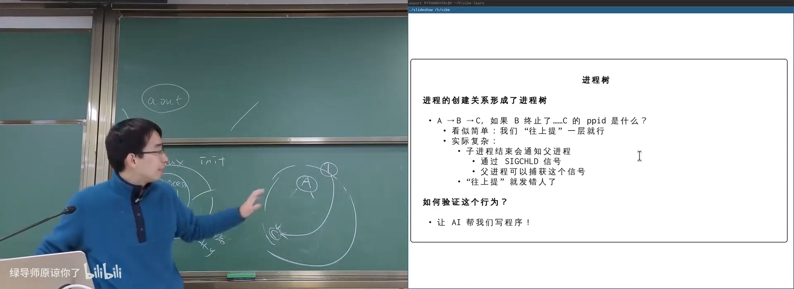

### 3.4 fork bomb

如果持续执行：

```c
while (1) {
    fork();
}
```

进程数量会按指数增长：

```text
1 -> 2 -> 4 -> 8 -> ...
```

这就是 Fork Bomb。它会快速耗尽进程表、内存等资源。

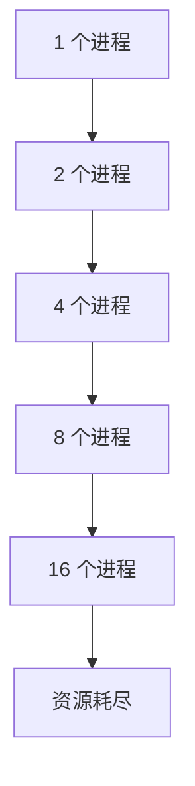
```mermaid
flowchart TD
    P0["1 个进程"] --> P1["2 个进程"]
    P1 --> P2["4 个进程"]
    P2 --> P3["8 个进程"]
    P3 --> P4["16 个进程"]
    P4 --> PX["资源耗尽"]
```

现代 Linux 有 OOM 保护和进程组识别能力，通常可以终止恶意进程组，但恶意程序仍可能造成严重的资源冲击。

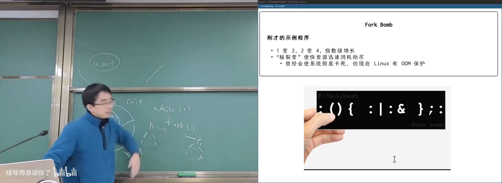

### 3.5 fork 的复制为什么仍然高效

真实 Linux 不会每次 `fork()` 都逐字节复制整块内存，而是使用 **Copy-on-Write（写时复制）**：

1. 父子进程初始共享物理页；
2. 页面标记为只读；
3. 任一方写入时触发页错误；
4. 操作系统再复制该页面。

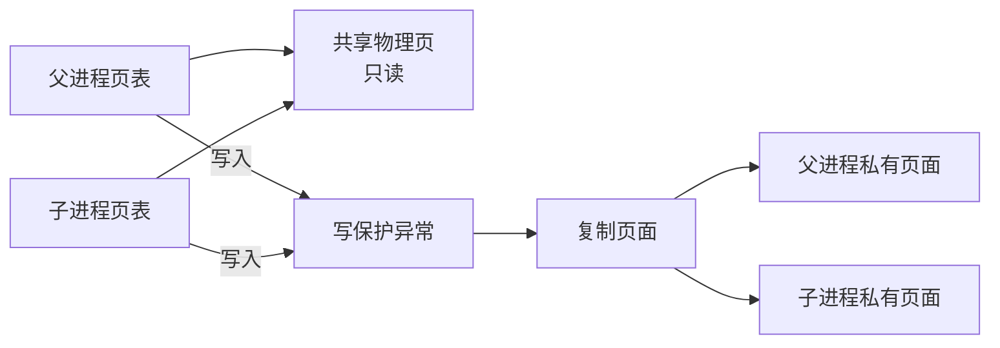
```mermaid
flowchart LR
    P["父进程页表"] --> M["共享物理页<br/>只读"]
    C["子进程页表"] --> M
    P -->|"写入"| F["写保护异常"]
    C -->|"写入"| F
    F --> N["复制页面"]
    N --> P2["父进程私有页面"]
    N --> C2["子进程私有页面"]
```

因此，只读的大数据结构可以在父子进程间长期共享。

### 3.6 fork 的典型应用

#### 共享预处理结果

先计算大素数表或大型索引，再 `fork` 多个子进程，让它们共享这份只读结果。

#### Android Zygote

Android 的 Zygote 进程预先加载 Java 运行时和公共库。启动应用时：

1. Zygote 执行 `fork()`；
2. 子进程继承已初始化运行时；
3. 子进程加载应用代码；
4. Zygote 自身保持不变。

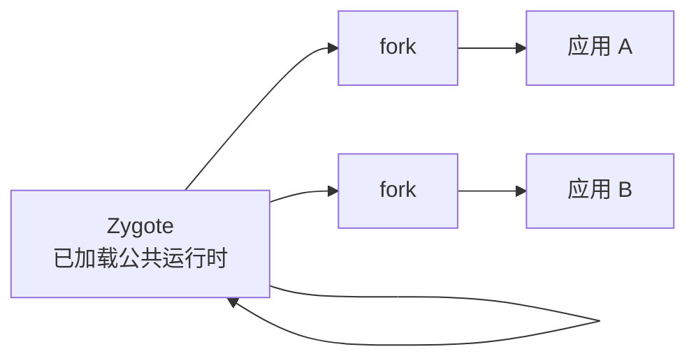
```mermaid
flowchart LR
    Z["Zygote<br/>已加载公共运行时"] --> F1["fork"]
    Z --> F2["fork"]
    F1 --> A1["应用 A"]
    F2 --> A2["应用 B"]
    Z --> Z
```

这显著缩短了应用冷启动时间。

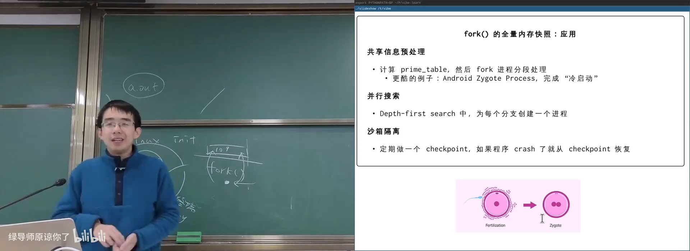

#### Fork-based DFS

DFS 搜索时，每个分支都可以 `fork` 一个进程继承当前搜索状态：

- 分支 A 在子进程 A 中继续；
- 分支 B 在子进程 B 中继续；
- 子进程自然拥有当前路径、迷宫和访问标记的完整快照。

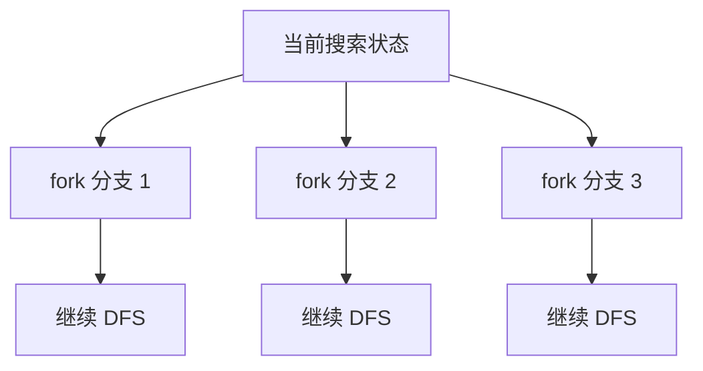
```mermaid
flowchart TD
    S["当前搜索状态"] --> F1["fork 分支 1"]
    S --> F2["fork 分支 2"]
    S --> F3["fork 分支 3"]
    F1 --> D1["继续 DFS"]
    F2 --> D2["继续 DFS"]
    F3 --> D3["继续 DFS"]
```

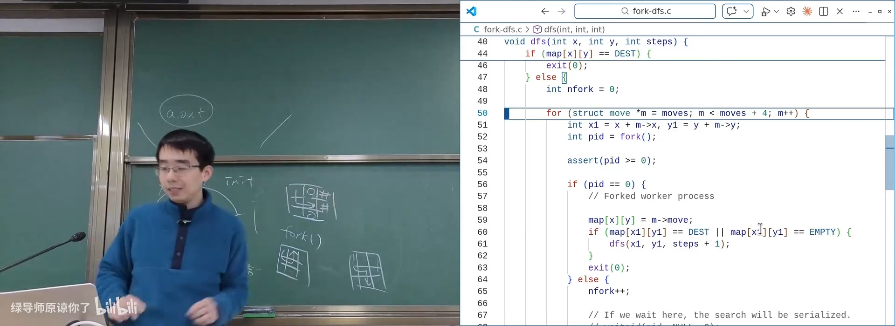

#### 检查点与故障恢复

长期服务可以定期 fork 出“检查点进程”保存完整内存状态。主进程崩溃后，再由检查点进程接管。

---

## 4. fork 程序的精确行为

### 4.1 展开循环理解 fork

考虑：

```c
for (int i = 0; i < 2; i++) {
    fork();
    printf("Hello\n");
}
```

循环展开后：

```c
i = 0;
fork();
printf("Hello\n");
i = 1;
fork();
printf("Hello\n");
```

第一次 `fork` 后进程从 1 变 2；第二次 `fork` 后从 2 变 4。最终应有 4 个进程，每个执行一次最后输出，总计 4 行。

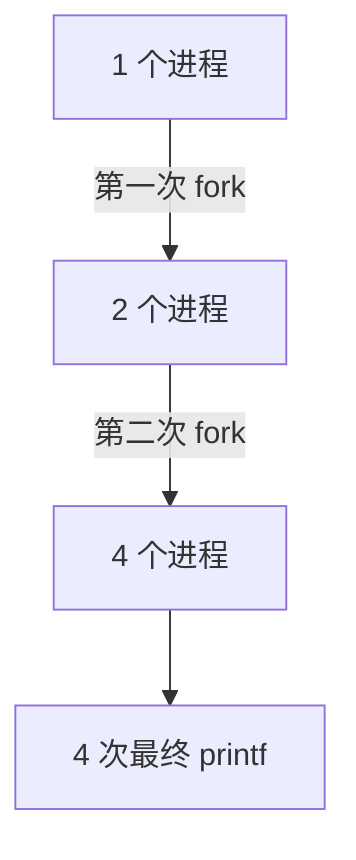
```mermaid
flowchart TD
    P0["1 个进程"] -->|"第一次 fork"| P1["2 个进程"]
    P1 -->|"第二次 fork"| P2["4 个进程"]
    P2 --> O["4 次最终 printf"]
```

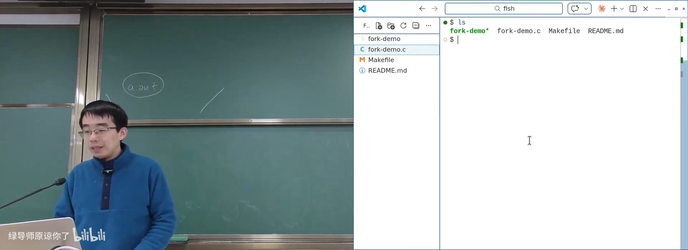

### 4.2 为什么终端看到 6 行，管道却看到 8 行？

运行：

```bash
./a.out
./a.out | wc -l
```

可能看到：

- 终端：6 行；
- 管道：8 行。

原因是 C 标准库的输出缓冲会随输出目标改变。

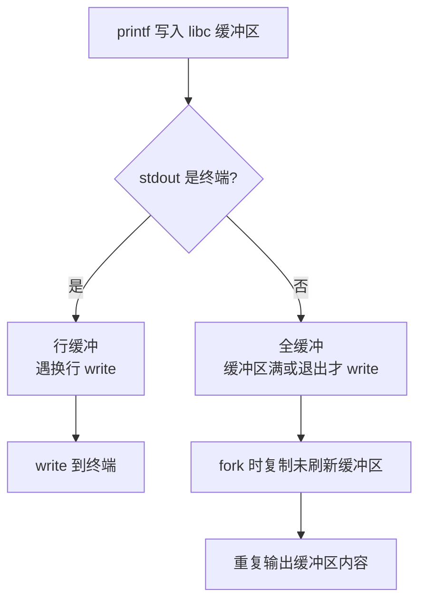
```mermaid
flowchart TD
    P["printf 写入 libc 缓冲区"] --> T{"stdout 是终端?"}
    T -->|"是"| L["行缓冲<br/>遇换行 write"]
    T -->|"否"| F["全缓冲<br/>缓冲区满或退出才 write"]
    L --> W1["write 到终端"]
    F --> R["fork 时复制未刷新缓冲区"]
    R --> W2["重复输出缓冲区内容"]
```

第一次 `fork` 时，如果先前的 `Hello` 仍留在缓冲区中，它也会被复制到子进程。多个子进程最终刷新缓冲区，导致某些内容重复。

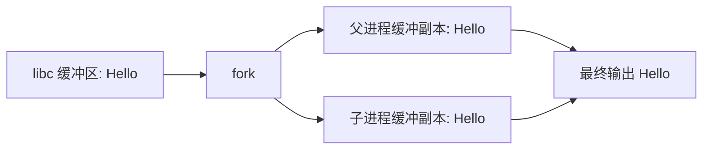
```mermaid
flowchart LR
    B["libc 缓冲区: Hello"] --> F["fork"]
    F --> B1["父进程缓冲副本: Hello"]
    F --> B2["子进程缓冲副本: Hello"]
    B1 --> O["最终输出 Hello"]
    B2 --> O
```

这提醒我们：

- 系统调用 `write` 是真正向操作系统输出；
- `printf` 只写入 libc 缓冲区；
- 缓冲策略可能改变程序可见行为；
- 可以使用 `setbuf()` 或 `stdbuf` 控制缓冲。

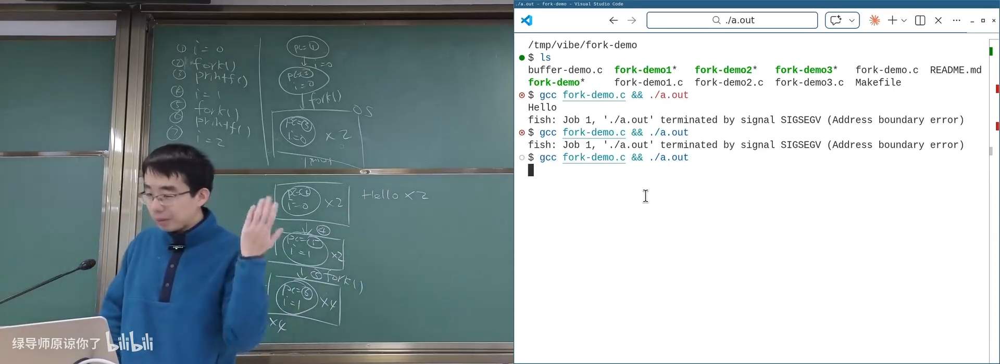

---

## 5. execve：把当前状态机复位成另一个程序

### 5.1 execve 是唯一真正“执行程序”的系统调用

```c
int execve(
    const char *filename,
    char *const argv[],
    char *const envp[]
);
```

执行 `execve` 后：

- 当前进程的用户态内存和寄存器被替换；
- 程序被加载为新的初始状态；
- PC 指向新程序入口；
- `argv` 和 `envp` 被传递给新程序；
- 进程号、工作目录、打开文件等操作系统状态通常保持。


```mermaid
flowchart LR
    A["进程 A 当前状态"] --> E["execve(path, argv, envp)"]
    E --> B["同一个 PID"]
    B --> N["新程序初始状态"]
```

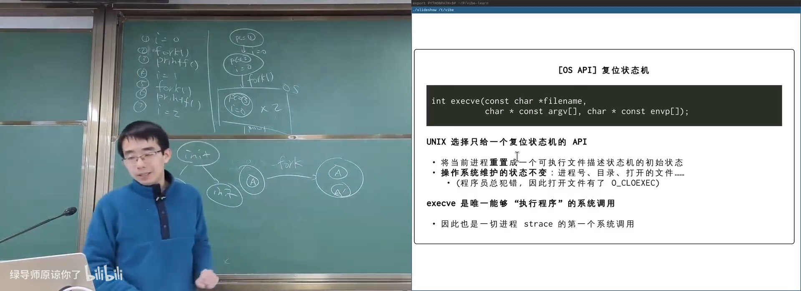

### 5.2 main 参数从哪里来？

```c
int main(int argc, char *argv[]) {
    ...
}
```

- `argc`：参数数量；
- `argv`：参数向量；
- `argv[0]`：程序启动时的命令名；
- `argv[n]`：其余参数。

例如：

```bash
./a.out 1 2 3
```

会得到：

```text
argv[0] = "./a.out"
argv[1] = "1"
argv[2] = "2"
argv[3] = "3"
```

所有进程 `strace` 的第一条系统调用通常是 `execve`，即使是几乎不调用其他系统调用的最小程序。

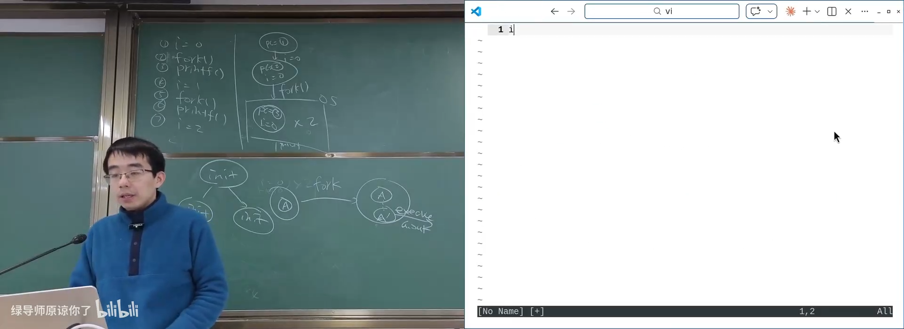

### 5.3 环境变量 envp

环境变量是一组 `KEY=VALUE` 字符串：

```text
PATH=...
HOME=...
PWD=...
DISPLAY=...
TERM=...
```

常用命令：

```bash
env
echo $PWD
echo $TERM
```

`fork` 创建子进程时会继承环境变量，`execve` 也会把它传给新程序。因此，把 API Key 直接放在环境变量里存在泄露风险：任何被启动的子进程都可能读取它。

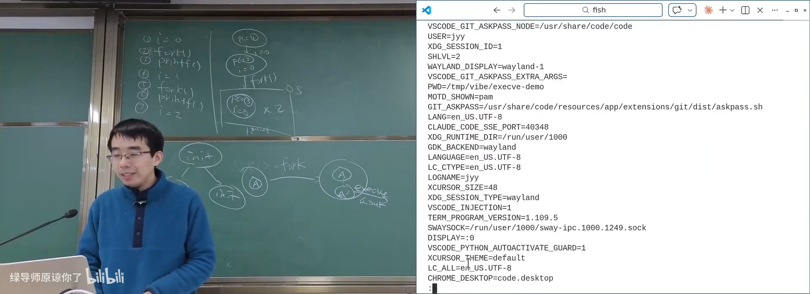

### 5.4 PATH：可执行文件搜索路径

Shell 执行：

```bash
gcc a.c
```

时，会按 `PATH` 中的目录顺序寻找 `gcc`：


```mermaid
flowchart LR
    G["gcc"] --> P["读取 PATH"]
    P --> D1["目录 1"]
    D1 -->|"未找到"| D2["目录 2"]
    D2 -->|"未找到"| D3["目录 3"]
    D3 -->|"找到"| E["execve(full_path)"]
```

`strace gcc` 可以看到 GCC 逐个尝试：

```text
execve("/usr/local/sbin/as", ...)
execve("/usr/local/bin/as", ...)
execve("/usr/sbin/as", ...)
execve("/usr/bin/as", ...)
```

如果把 `PATH` 设为空，GCC 就找不到汇编器 `as`；把 `PATH` 恢复为 `/usr/bin`，它又可以正常运行。

```bash
PATH="" /usr/bin/gcc a.c
PATH="/usr/bin/" /usr/bin/gcc a.c
```

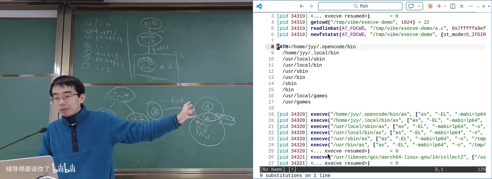

这再次证明“机器永远是对的”：程序行为都可以追溯到明确的环境状态和系统调用。

---

## 6. exit：销毁状态机

```c
void _exit(int status);
```

`_exit` 立即终止当前进程，并把状态码交给父进程。标准库 `exit()` 会先执行清理和刷新缓冲区，再调用底层退出系统调用。

有了线程后，Linux 还区分：

- `exit`：终止当前线程；
- `exit_group`：终止整个线程组。

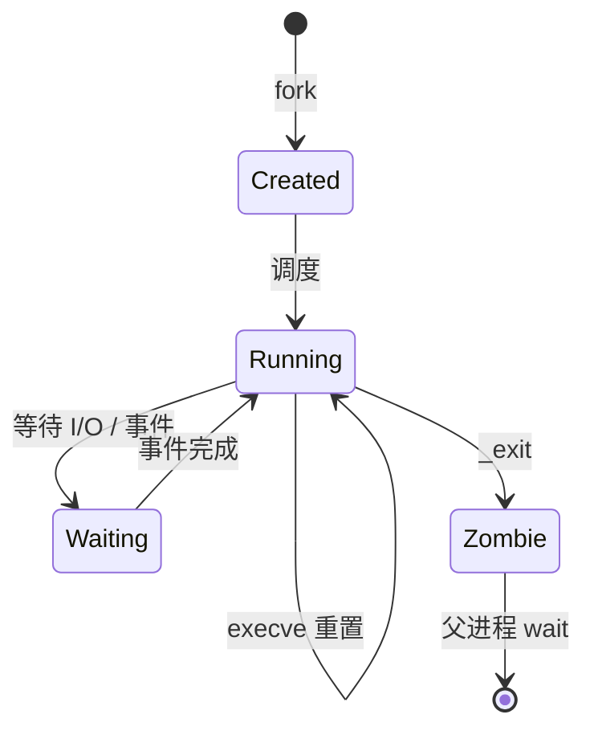
```mermaid
stateDiagram-v2
    [*] --> Created: fork
    Created --> Running: 调度
    Running --> Waiting: 等待 I/O / 事件
    Waiting --> Running: 事件完成
    Running --> Running: execve 重置
    Running --> Zombie: _exit
    Zombie --> [*]: 父进程 wait
```

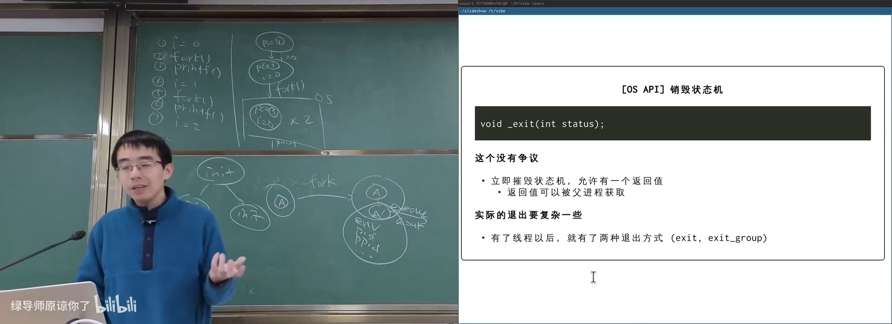

---

## 7. UNIX 进程生命周期

典型创建流程：

```c
pid_t pid = fork();

if (pid == -1) {
    perror("fork");
} else if (pid == 0) {
    execve(path, argv, envp);
    perror("execve");
    _exit(EXIT_FAILURE);
} else {
    int status;
    waitpid(pid, &status, 0);
}
```

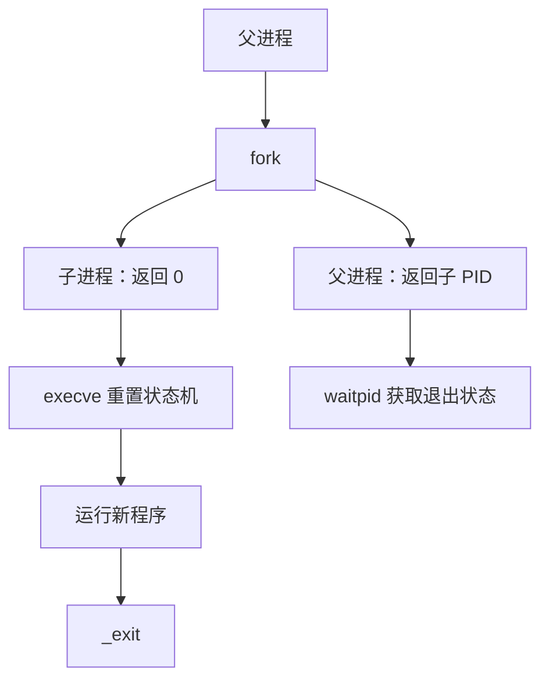
```mermaid
flowchart TD
    P["父进程"] --> F["fork"]
    F --> C["子进程：返回 0"]
    F --> P2["父进程：返回子 PID"]
    C --> E["execve 重置状态机"]
    E --> A["运行新程序"]
    A --> X["_exit"]
    P2 --> W["waitpid 获取退出状态"]
```

这就是 UNIX 世界中几乎所有进程的来源：

> **Spawn = fork + execve**

Linux 启动后最初只有一个 PID 1 进程，之后所有进程都由它或它的后代逐步孵化出来。


---

## 8. 本讲总结

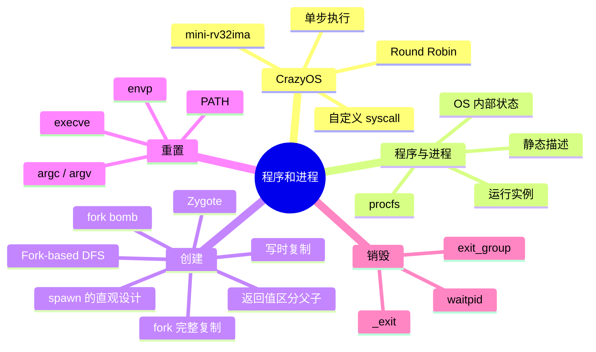
```mermaid
mindmap
  root((程序和进程))
    CrazyOS
      mini-rv32ima
      单步执行
      Round Robin
      自定义 syscall
    程序与进程
      静态描述
      运行实例
      OS 内部状态
      procfs
    创建
      spawn 的直观设计
      fork 完整复制
      返回值区分父子
      写时复制
      fork bomb
      Zygote
      Fork-based DFS
    重置
      execve
      argc / argv
      envp
      PATH
    销毁
      _exit
      exit_group
      waitpid
```

核心结论：

1. 程序是状态机的静态描述，进程是它的运行实例。
2. CrazyOS 证明只需轮流执行多个状态机，就能模拟多进程与系统调用。
3. 真实操作系统额外维护大量进程状态，可通过 `procfs` 和系统调用观察。
4. Windows 倾向直接提供 `CreateProcess` 一类 spawn API。
5. UNIX 使用 `fork` 完整复制当前状态机，再用返回值区分父子进程。
6. 孤儿进程会被重新托管给 PID 1，保证父进程关系合法。
7. `fork` 配合写时复制可以用较低成本共享大块只读状态。
8. fork 可以用于并行搜索、Zygote 冷启动优化和检查点恢复。
9. `execve` 是唯一真正执行程序的系统调用，负责设置新程序初始状态。
10. `main(argc, argv, envp)` 的参数来自 `execve`。
11. `PATH` 决定 shell 与运行时按什么顺序搜索可执行文件。
12. `exit` 销毁状态机；`fork + execve + exit` 构成 UNIX 进程生命周期。

> **Spawn = fork + execve。**  
> 计算机世界里没有魔法，只有被精确定义的进程状态与系统调用。

---

## 附：官方参考与延伸阅读

课程与讲义：

- [《操作系统原理》2026 课程主页](https://jyywiki.cn/OS/2026/)
- [第 5 讲讲义：程序和进程](https://jyywiki.cn/OS/2026/lect5.md)
- [本讲视频](https://www.bilibili.com/video/BV1N8w9zJENu/)

课程演示：

- [CrazyOS](https://jyywiki.cn/OS/demos/virtualization/crazy-os)
- [展示进程信息](https://jyywiki.cn/OS/demos/virtualization/proc-info)
- [创建进程子树](https://jyywiki.cn/OS/demos/virtualization/pstree)
- [Fork-based DFS](https://jyywiki.cn/OS/demos/virtualization/fork-dfs)
- [理解 fork](https://jyywiki.cn/OS/demos/virtualization/fork-demo)
- [理解 execve](https://jyywiki.cn/OS/demos/virtualization/execve-demo)
- [理解 exit](https://jyywiki.cn/OS/demos/virtualization/exit-demo)

阅读材料：

- *Operating Systems: Three Easy Pieces*
  - 第 3 章：Dialogue；
  - 第 4 章：Processes；
  - 第 5 章：Process API。
- `man 2 fork`
- `man 2 execve`
- `man 2 exit`
- `man 7 signal`
- `man 5 proc`
- `man 3 setbuf`
- `man 1 stdbuf`

> **版权说明**：课程讲义与幻灯片的著作权归蒋炎岩所有，采用 Creative Commons BY-NC 4.0 许可。电子书正文为课堂内容的书面化重构，脚本占位符已替换为视频画面或官方资料渲染图；引用与来源链接均保留在本页。
