# 进程的地址空间：mmap、munmap 与 mprotect

> **课程**：2026 春季学期《操作系统原理》，第 6 讲  
> **讲师**：蒋炎岩（jyy）  
> **官方课程主页**：<https://jyywiki.cn/OS/2026/>  
> **官方讲义**：<https://jyywiki.cn/OS/2026/lect6.md>  
> **视频来源**：[Bilibili BV18nAjz9EcW](https://www.bilibili.com/video/BV18nAjz9EcW/)  
> **版权说明**：课程讲义与幻灯片归蒋炎岩所有，采用 [Creative Commons BY-NC 4.0](http://creativecommons.org/licenses/by-nc/4.0/) 许可；本电子书是对课堂讲授的书面化重构，保留出处与许可说明。

## 导语：进程的内存里到底有什么？

上一讲通过 `fork`、`execve` 和 `exit` 建立了进程生命周期。CrazyOS 中每个 `struct proc` 都拥有一块固定大小的 `mem`：

```c
#define MEM_SIZE   (1 << 20)
#define MEM_OFFSET 0x80000000u
#define STACK_TOP  (MEM_OFFSET + MEM_SIZE)

struct proc {
    struct CPUState cpu;
    uint8_t mem[MEM_SIZE];
    /* pid, buffer, length, ... */
};
```

这说明进程不仅有寄存器和 PC，也有自己的内存。真实进程的地址空间比 CrazyOS 复杂得多：

- 程序代码；
- 只读数据；
- 已初始化数据；
- 未初始化数据；
- 堆；
- 栈；
- 动态链接库；
- 内核提供的 `vvar` / `vdso`；
- 匿名映射；
- 文件映射；
- 共享内存。

本讲的关键问题是：

> **进程地址空间中的每一个字节，究竟由谁规定、从哪里来、为什么放在那里？**

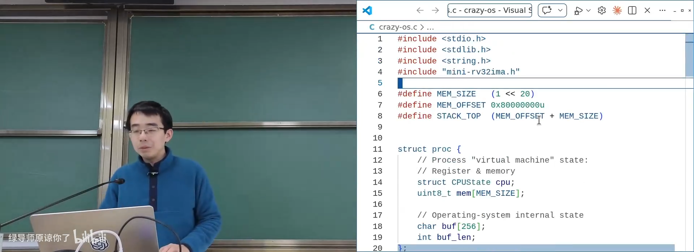

---

## 1. 地址空间与指针

### 1.1 教科书定义

操作系统为每个进程提供独立的虚拟地址范围，称为 **进程地址空间（Address Space）**。

核心作用包括：

- 隔离：不同进程互不干扰；
- 保护：无权限访问产生异常；
- 抽象：程序以为拥有一大片连续内存；
- 扩展：内存可按需分配；
- 有限共享：在隔离基础上支持共享内存。

但只记定义并不能回答：

- 代码、数据和栈分别在哪？
- 为什么有些地址可读、有些可写、有些可执行？
- 为什么每次运行地址可能变化？
- 程序未访问的内存为什么可以先“分配”？

这些问题的答案需要从地址、ELF、加载器和 ABI 一层层构建。

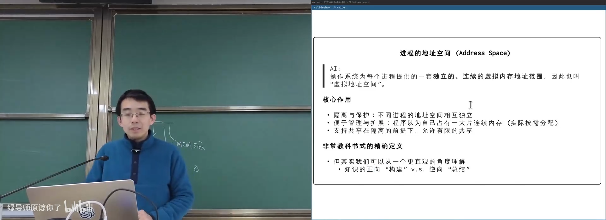

### 1.2 地址空间就是可由指针访问的字节序列

CPU 的 `load` / `store` 指令需要一个地址和位宽：

```c
unsigned char *ptr = ...;
unsigned char value = *ptr;   /* load */
*ptr = 1;                     /* store */
```

指针本质上保存地址。地址空间就是进程通过 `load`、`store` 和取指能够访问的字节范围。

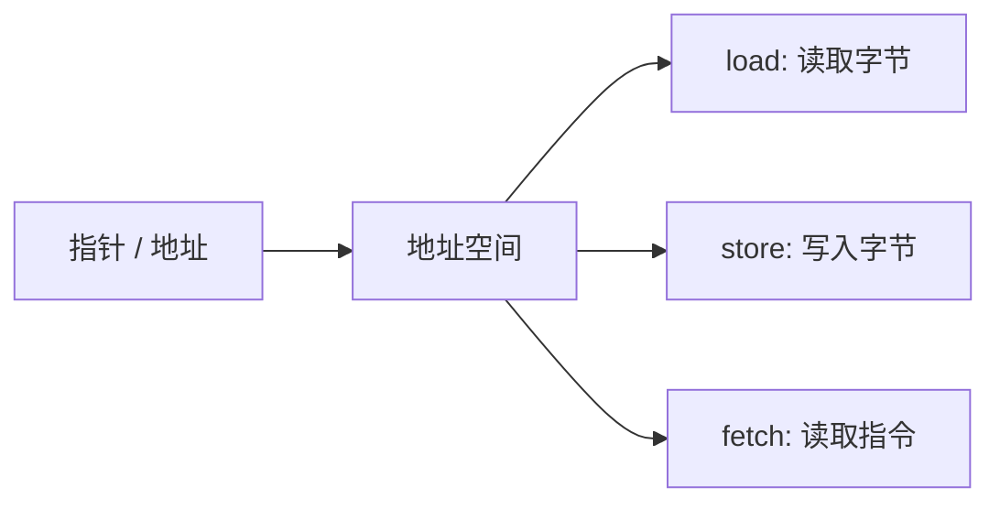
```mermaid
flowchart LR
    P["指针 / 地址"] --> M["地址空间"]
    M --> L["load: 读取字节"]
    M --> S["store: 写入字节"]
    M --> F["fetch: 读取指令"]
```

### 1.3 为什么需要 volatile

```c
volatile char *ptr = input();
*ptr;
```

如果读取结果没有被使用，普通指针访问可能被编译器当作死代码删除。

`volatile` 告诉编译器：

> 对该地址的访问具有可观察效果，不允许优化掉。

它与“指向的内存不可修改”的 `const` 不同：

- `const char *`：不能通过该指针修改内存；
- `volatile char *`：每次访问都必须真实执行；
- `volatile char * volatile`：指针本身也不能被优化缓存。

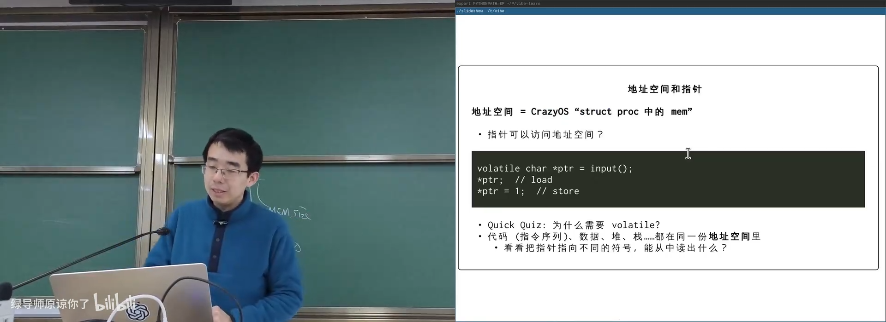

课堂使用指针分别指向函数、全局变量和局部变量，打印地址，并读取 `main` 函数开头的机器码，再与二进制文件交叉验证。

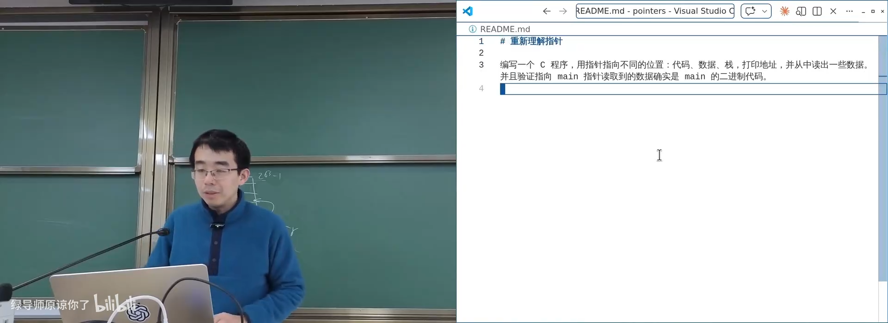

---

## 2. 地址空间中的字节从哪里来

### 2.1 字节本身不带类型

一个字节本身没有“整数”“指针”或“指令”标签。它被如何解释取决于 CPU 当前如何使用它：

- PC 指向它：作为指令取指、译码；
- `load` 读取它：按指定位宽解释为数据；
- `store` 写入它：替换对应字节。

所以必须先回答“字节是什么”，再回答“字节放在哪里”和“初始值是什么”。

### 2.2 ELF 与 PT_LOAD

链接器将代码和数据组织为 ELF 节区：

- `.text`：机器指令；
- `.rodata`：只读数据；
- `.data`：有初始值的可写数据；
- `.bss`：零初始化的数据，不占文件中的实际内容；
- 其他链接与动态加载元数据。

加载器只关心 ELF 中的 `PT_LOAD` 段。每段包含：

```text
文件偏移
虚拟地址
大小
对齐
访问权限
```


```mermaid
flowchart LR
    S["源文件"] --> C["编译与汇编"]
    C --> O["目标文件<br/>.text / .data / .bss"]
    O --> L["链接器"]
    L --> E["ELF"]
    E --> H["Program Headers<br/>PT_LOAD"]
    H --> A["进程地址空间"]
```

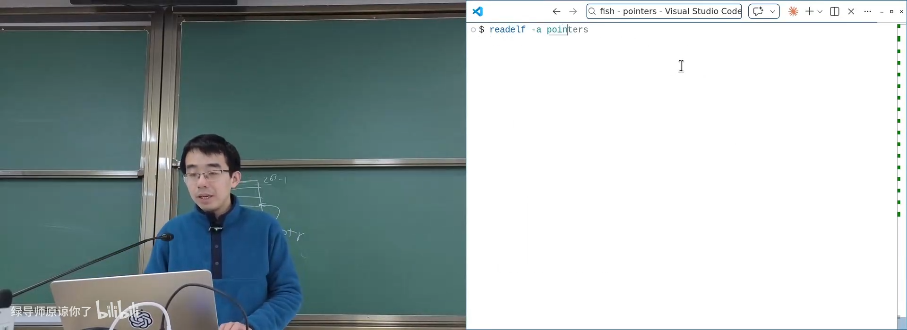

### 2.3 ABI、加载器与初始栈

操作系统加载器与 System V ABI 共同规定进程初始状态：

- 加载 `PT_LOAD` 段；
- 清零 `bss`；
- 设置初始 PC 和 SP；
- 在栈上放置 `argc`、`argv`、`envp`、`auxv` 字符串与指针；
- 设置必要寄存器。

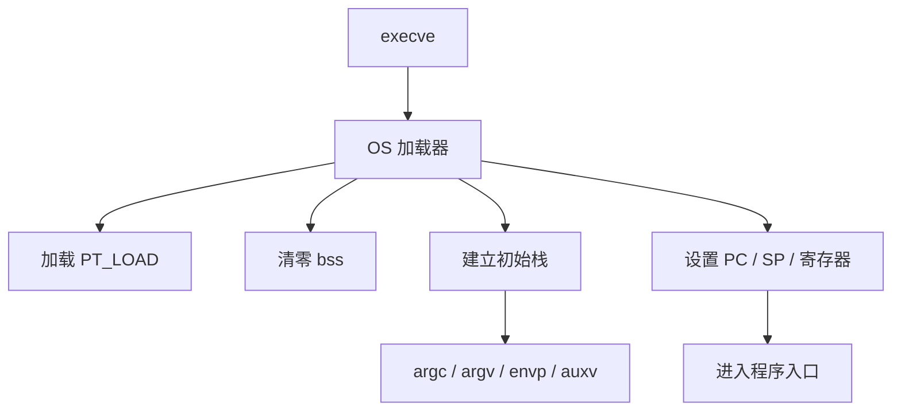
```mermaid
flowchart TD
    E["execve"] --> L["OS 加载器"]
    L --> P["加载 PT_LOAD"]
    L --> B["清零 bss"]
    L --> S["建立初始栈"]
    S --> A["argc / argv / envp / auxv"]
    L --> R["设置 PC / SP / 寄存器"]
    R --> U["进入程序入口"]
```

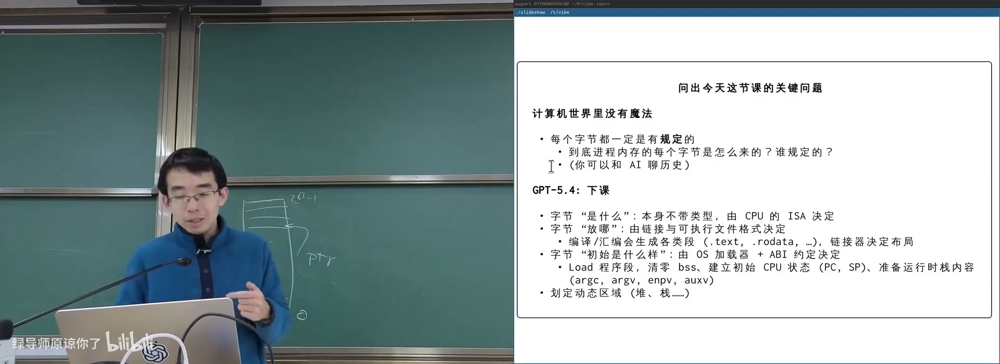

### 2.4 ASLR

同一个程序多次运行时，函数和变量的绝对地址可能不同。这是因为 Linux 启用了：

> **Address Space Layout Randomization（ASLR）**

系统会随机化代码、栈、堆和动态库的加载位置，使攻击者更难预测地址。GDB 默认可能关闭或固定部分随机化，因此调试时地址更稳定。

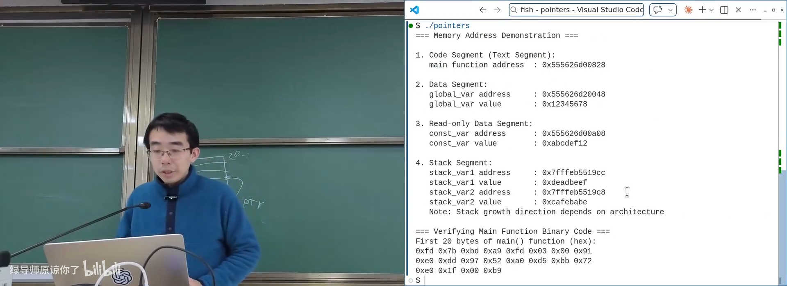

---

## 3. 探索真实进程地址空间

### 3.1 `/proc/<pid>/maps`

Linux 通过 `procfs` 提供进程地址空间映射：

```bash
cat /proc/<pid>/maps
```

每一行通常包含：

```text
起始地址-结束地址  权限  偏移  设备  inode  路径
```

权限由三个字符组成：

- `r`：可读；
- `w`：可写；
- `x`：可执行。

典型区域包括：

- 可执行文件映射；
- 共享库；
- 匿名堆区域；
- 线程栈；
- `vvar`；
- `vdso`；
- `vsyscall`。

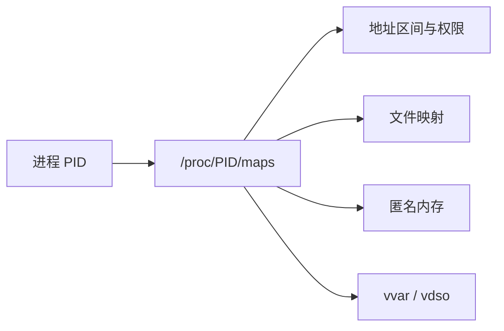
```mermaid
flowchart LR
    P["进程 PID"] --> F["/proc/PID/maps"]
    F --> R["地址区间与权限"]
    F --> M["文件映射"]
    F --> A["匿名内存"]
    F --> V["vvar / vdso"]
```

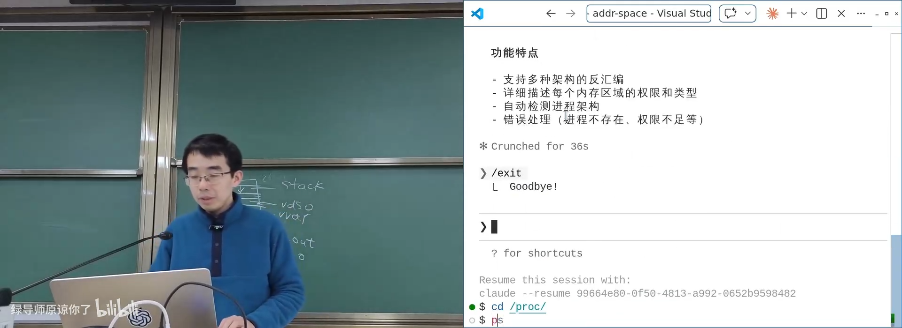

### 3.2 最小程序也不只有代码与栈

即使是一个直接用 `ld` 链接的最小程序，地址空间中仍可能出现：

- 一段可读可执行的程序映射；
- `vvar`；
- `vdso`；
- 初始栈。

`vvar` 与 `vdso` 是 Linux 提供的优化机制：

- `vvar`：内核与用户态共享的只读数据；
- `vdso`：可直接在用户态执行的少量代码。

对于 `gettimeofday()` 等高频调用，程序可以利用 CPU 时间计数器和共享数据，在不进入内核的情况下得到时间。

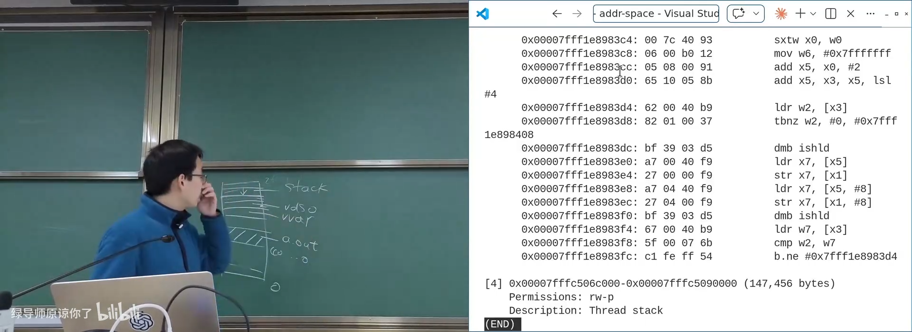

### 3.3 Address Space Explorer

课堂让 AI 编写一个命令行工具：

> 接收 PID，解析 `/proc/<pid>/maps`，展示地址空间，并对可执行区域反汇编前 1 KB。

核心实现只需要：

1. 读取 `/proc/<pid>/maps`；
2. 解析每段地址、权限和路径；
3. 对可执行区间读取内存；
4. 使用 Capstone 等反汇编库解码指令。

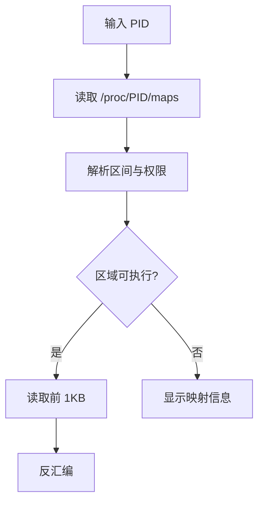
```mermaid
flowchart TD
    PID["输入 PID"] --> MAPS["读取 /proc/PID/maps"]
    MAPS --> PARSE["解析区间与权限"]
    PARSE --> EXEC{"区域可执行?"}
    EXEC -->|"是"| READ["读取前 1KB"]
    READ --> DIS["反汇编"]
    EXEC -->|"否"| SKIP["显示映射信息"]
```

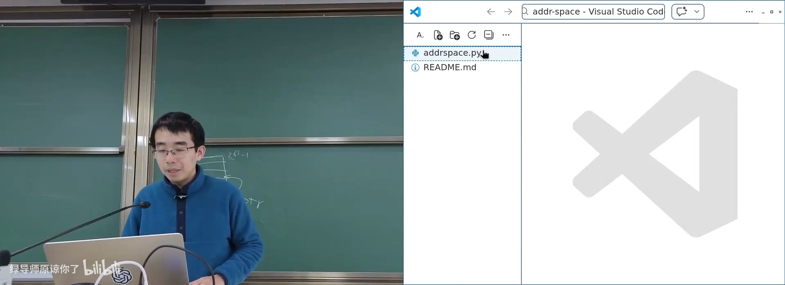

---

## 4. MMU：操作系统给进程戴上的 VR 眼镜

### 4.1 虚拟地址到物理页

地址空间中的“连续地址”并不对应连续的物理页。CPU 每次取指、`load` 和 `store` 都经过 MMU：

- 查页表；
- 检查权限；
- 找到物理页；
- 完成访问；
- 若映射不存在或无权限则触发异常。

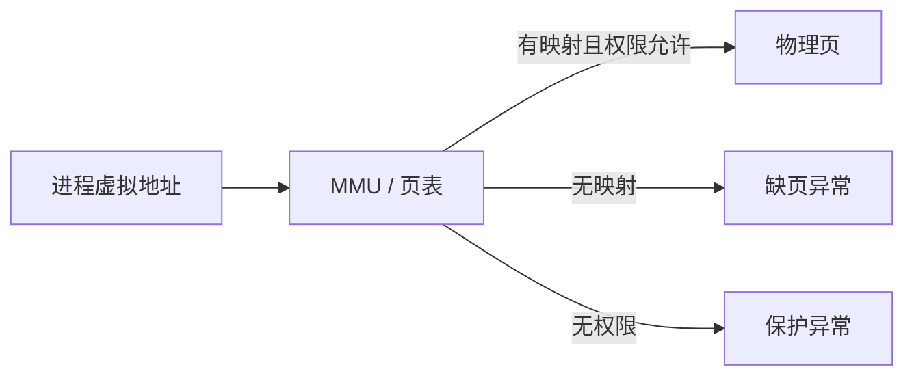
```mermaid
flowchart LR
    V["进程虚拟地址"] --> M["MMU / 页表"]
    M -->|"有映射且权限允许"| P["物理页"]
    M -->|"无映射"| PF["缺页异常"]
    M -->|"无权限"| EX["保护异常"]
```

用户进程不能直接配置 MMU，因此它只能看到操作系统“投影”出来的世界。讲师把它类比为无法摘下的 VR 眼镜：

> 进程以为自己在访问一片连续内存，实际看到的地址和权限完全由操作系统决定。

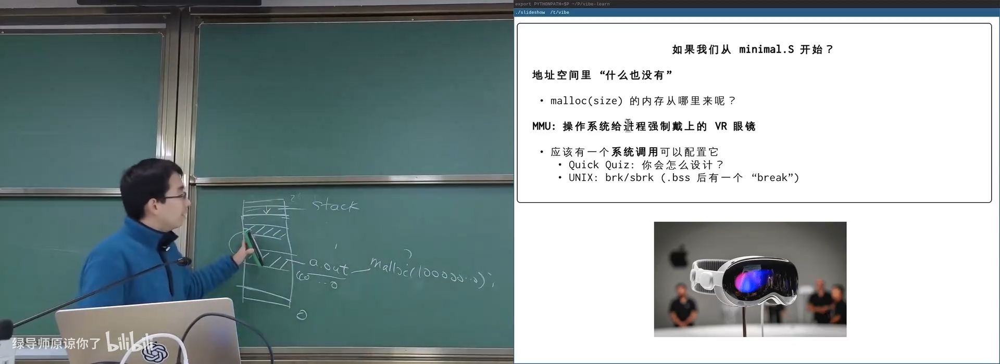

### 4.2 为什么 0 地址不可访问

绝大多数进程的第 0 页没有合法映射。因此：

```c
*(char *)0 = 1;
```

会触发 segmentation fault。空指针访问能被检测出来，正是因为地址空间存在大范围“洞”。

### 4.3 brk / sbrk

早期 UNIX 用 `brk` / `sbrk` 改变 data segment 末尾的 break：

- 增大 break：申请更多连续堆空间；
- 减小 break：释放堆尾部空间。

```text
[text][data][bss]                [stack]
                 ^
               brk
```

`brk` 只能调整堆尾部，难以支持大块、稀疏或文件映射，因此现代系统主要使用 `mmap`。

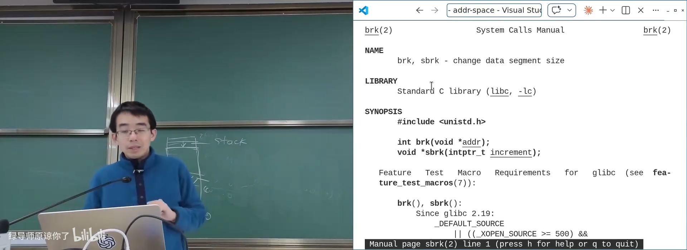

---

## 5. mmap、munmap 与 mprotect

### 5.1 API

```c
void *mmap(void *addr, size_t length, int prot, int flags,
           int fd, off_t offset);

int munmap(void *addr, size_t length);

int mprotect(void *addr, size_t length, int prot);
```

- `addr`：建议映射地址；
- `length`：映射长度；
- `prot`：读、写、执行权限；
- `flags`：匿名、私有、共享、固定地址等；
- `fd`：可选文件；
- `offset`：映射文件偏移。

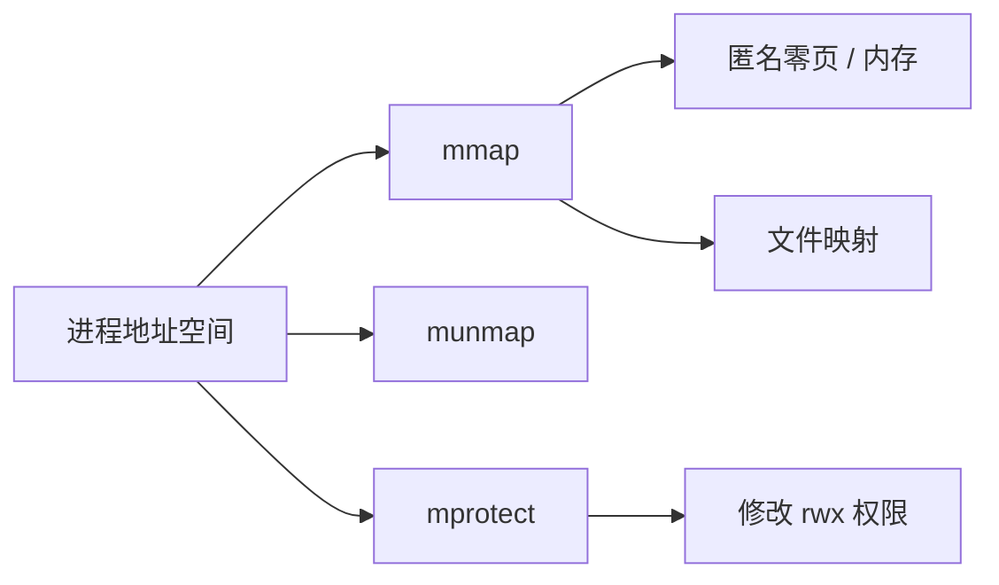
```mermaid
flowchart LR
    A["进程地址空间"] --> M["mmap"]
    M --> AN["匿名零页 / 内存"]
    M --> FM["文件映射"]
    A --> U["munmap"]
    A --> P["mprotect"]
    P --> R["修改 rwx 权限"]
```

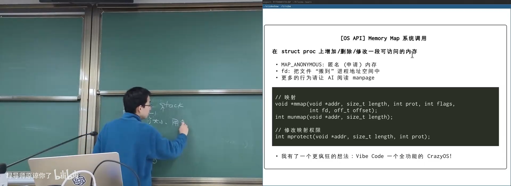

### 5.2 匿名映射与按需分配

使用：

```c
mmap(NULL, length,
     PROT_READ | PROT_WRITE,
     MAP_PRIVATE | MAP_ANONYMOUS,
     -1, 0);
```

可以获得一段初始值为零的匿名内存。

关键点是：

- `mmap` 可以瞬间返回，即使申请 8 GB；
- 此时不一定分配任何物理页；
- 只有第一次访问某个页面时，才触发缺页异常并分配物理页；
- 未访问的页面不会占用实际内存。

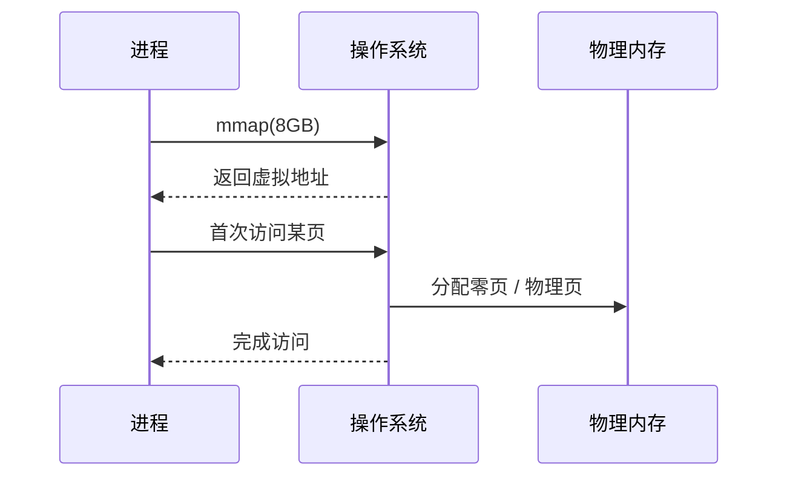
```mermaid
sequenceDiagram
    participant P as 进程
    participant O as 操作系统
    participant M as 物理内存
    P->>O: mmap(8GB)
    O-->>P: 返回虚拟地址
    P->>O: 首次访问某页
    O->>M: 分配零页 / 物理页
    O-->>P: 完成访问
```

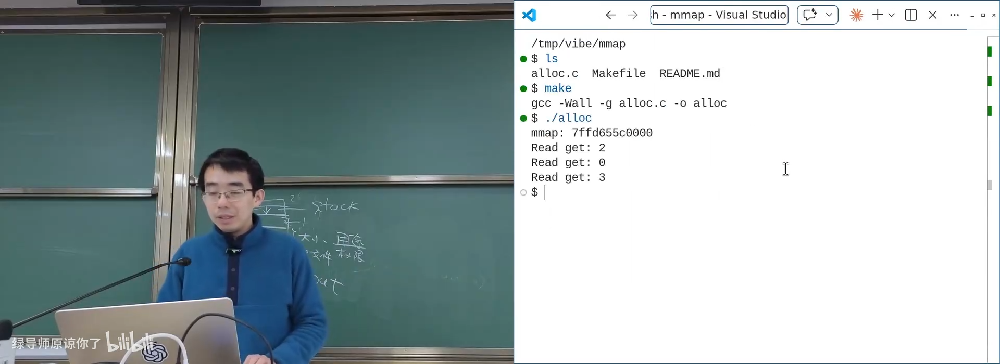

`strace` 可以看到真实的 `mmap` 参数和返回地址。

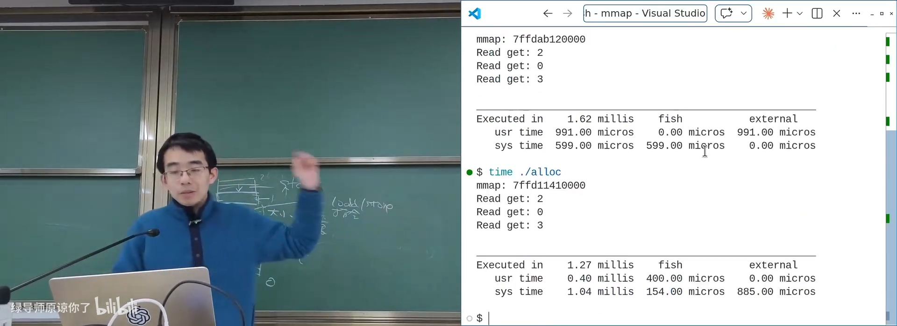

### 5.3 文件映射

传入文件描述符后，`mmap` 可以把文件映射到地址空间：


```mermaid
flowchart LR
    F["文件 / 设备"] --> O["open"]
    O --> FD["文件描述符"]
    FD --> M["mmap"]
    M --> A["进程地址空间"]
    A --> P["通过指针读写"]
```

典型用途：

- 映射大文件，只访问部分页面；
- 映射磁盘或设备；
- 映射 `/dev/gpiomem` 控制 GPIO；
- 在多个进程之间映射共享内存；
- 把设备寄存器当成内存访问。

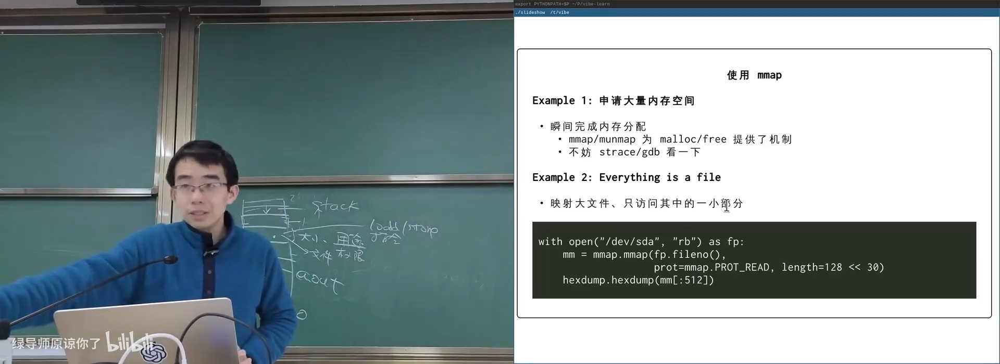

危险也由此产生：错误地映射并写入整个磁盘设备，可能覆盖真实数据。课堂回忆了曾误覆盖讲台机磁盘的事故。

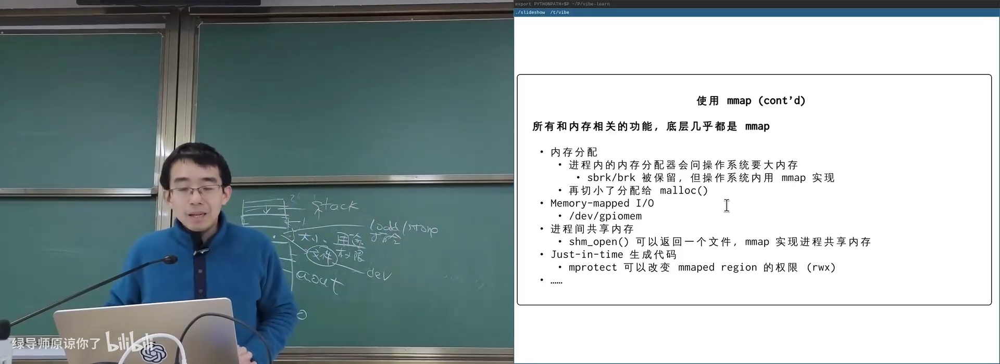

### 5.4 共享内存

`shm_open()` 返回一个类似文件的描述符，多个进程可以分别 `mmap`：

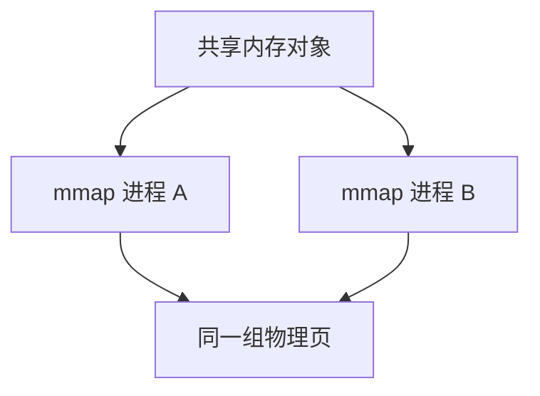
```mermaid
flowchart TD
    S["共享内存对象"] --> M1["mmap 进程 A"]
    S --> M2["mmap 进程 B"]
    M1 --> R["同一组物理页"]
    M2 --> R
```

这为进程间通信和共享大块数据结构提供了高效机制。

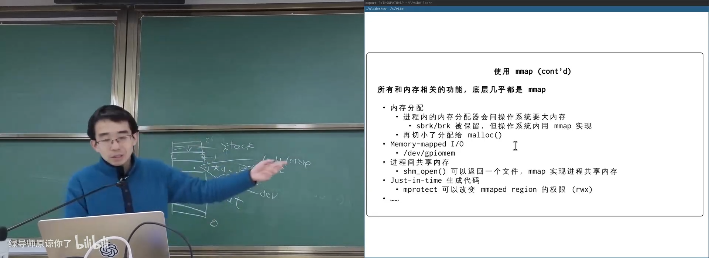

### 5.5 mprotect 与 JIT

动态生成代码时，可以先用可读可写权限写入机器码，再通过：

```c
mprotect(addr, length, PROT_READ | PROT_EXEC);
```

把数据页变成可执行页。


```mermaid
flowchart LR
    A["RW 内存"] --> W["写入机器码"]
    W --> P["mprotect: R + X"]
    P --> J["跳转到生成代码"]
```

浏览器 JavaScript 引擎、Java JIT 等都在运行时生成并执行代码。

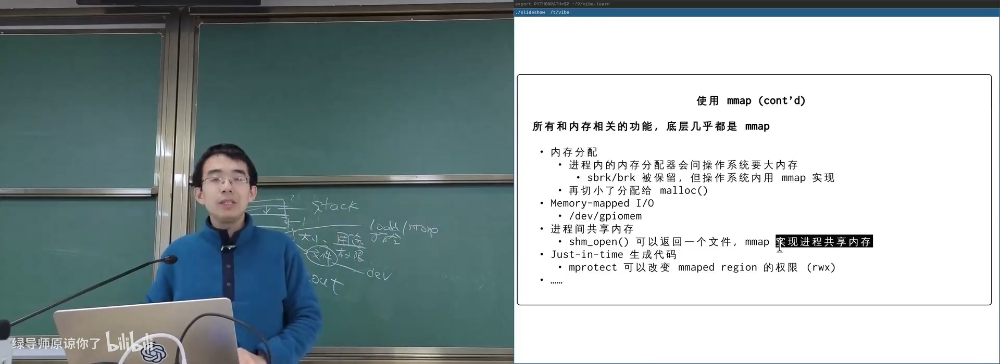

---

## 6. 入侵进程地址空间

### 6.1 GDB 如何插入断点

*(参考时间: 00:48:33)*

普通代码页通常是 `r-x`，不可写。GDB 要打断点，需要：

1. 使用 `ptrace` 附加目标进程；
2. 修改目标页权限；
3. 把目标指令替换为断点指令；
4. 命中后暂停目标进程；
5. 恢复原指令；
6. 再继续执行。

在 x86 上，单字节 `int3` 可作为软件断点：

```asm
int3
```

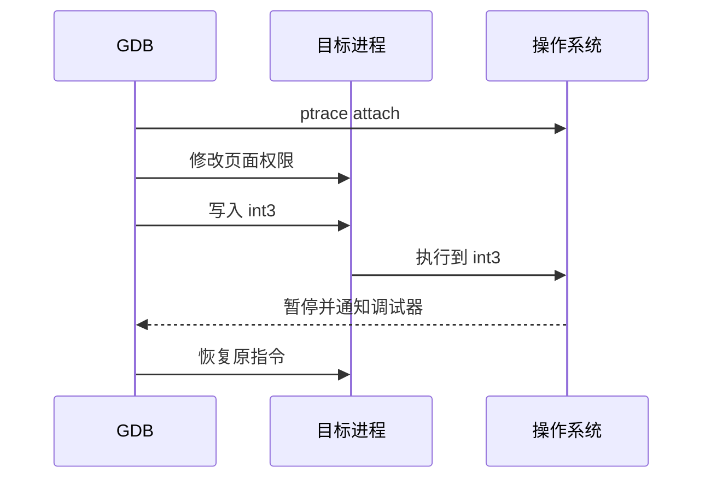
```mermaid
sequenceDiagram
    participant G as GDB
    participant P as 目标进程
    participant O as 操作系统
    G->>O: ptrace attach
    G->>P: 修改页面权限
    G->>P: 写入 int3
    P->>O: 执行到 int3
    O-->>G: 暂停并通知调试器
    G->>P: 恢复原指令
```

因此，调试器本身就是“合法入侵另一个进程地址空间”的工具。

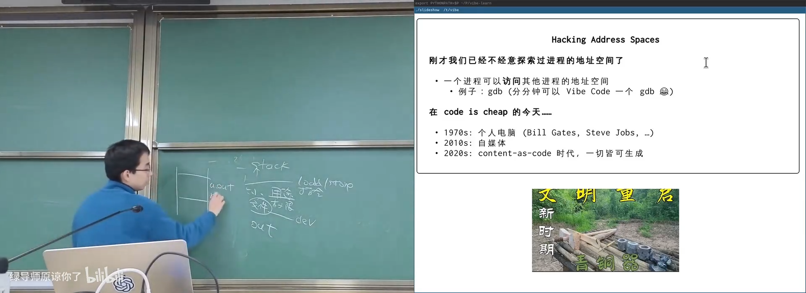

### 6.2 Game Genie：总线上的物理金手指

*(参考时间: 00:53:51)*

在无 MMU 的卡带机时代，Game Genie 插在主机和游戏卡带之间，直接拦截地址总线与数据总线。

它维护一个 Lookup Table：

```text
如果读取地址 A 且原值为 X
则把返回值替换为 Y
```

游戏初始化生命值为 3 时，只需匹配存放常数 3 的指令地址，就能改成 30、99 或任意值。

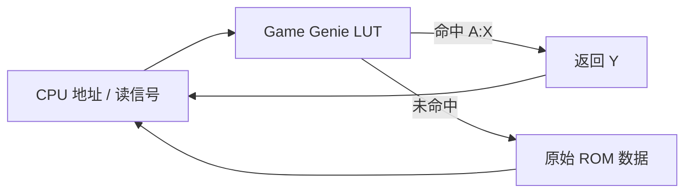
```mermaid
flowchart LR
    C["CPU 地址 / 读信号"] --> G["Game Genie LUT"]
    G -->|"命中 A:X"| Y["返回 Y"]
    G -->|"未命中"| R["原始 ROM 数据"]
    Y --> C
    R --> C
```

Game Genie 本质上是一个极小的可编程固件，先展示自己的界面，配置 LUT，再把控制权交回游戏。

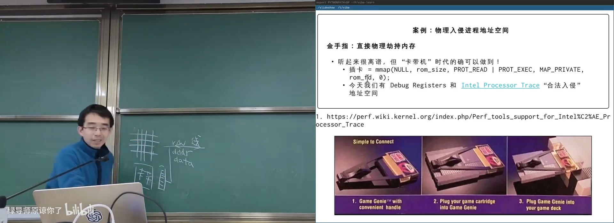

### 6.3 内存扫描修改器

现代游戏外挂通常不需要改装总线，而是直接读写目标进程内存。

#### 单地址变量

若游戏把金钱保存在一个固定地址：

```text
进入游戏：EXP = 4950
击败怪物：EXP = 5100
```

可以：

1. 扫描所有值为 4950 的内存；
2. 打怪后再次扫描值变为 5100 的地址；
3. 缩小候选集合；
4. 找到真正的 EXP 地址并修改。

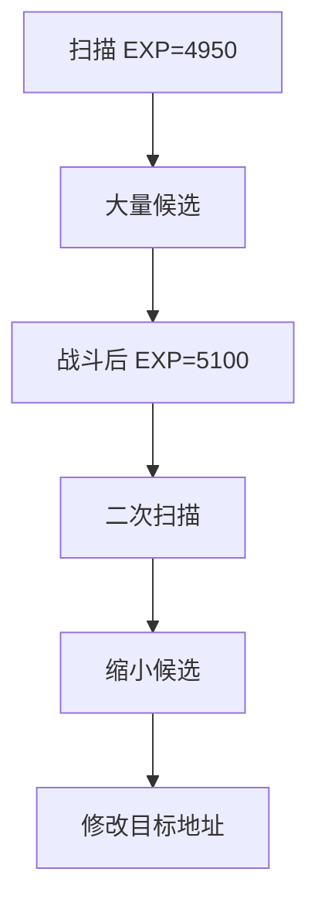
```mermaid
flowchart TD
    S1["扫描 EXP=4950"] --> C1["大量候选"]
    C1 --> E["战斗后 EXP=5100"]
    E --> S2["二次扫描"]
    S2 --> F["缩小候选"]
    F --> M["修改目标地址"]
```

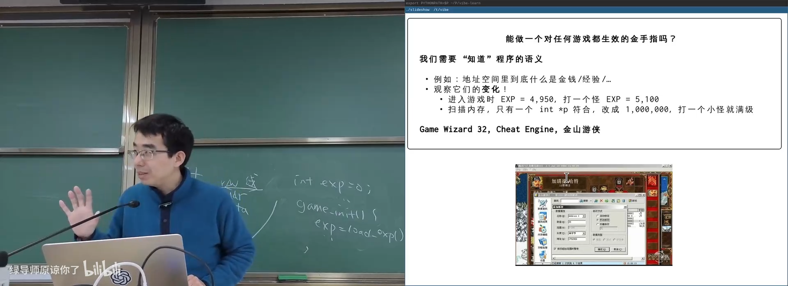

课堂使用 DOSBox + 金山游侠风格工具演示修改即时战略游戏中的金钱。

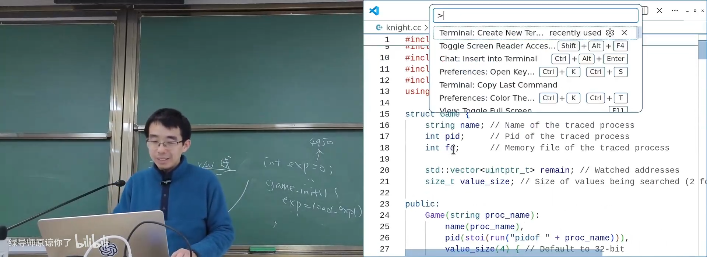

#### 数据不可变时扫描失效

如果游戏使用持久化数据结构：

```c
state_new = new State(state);
state_new.update(exp);
state = state_new;
```

每次更新都会创建新对象，旧地址失效，简单扫描无法定位。

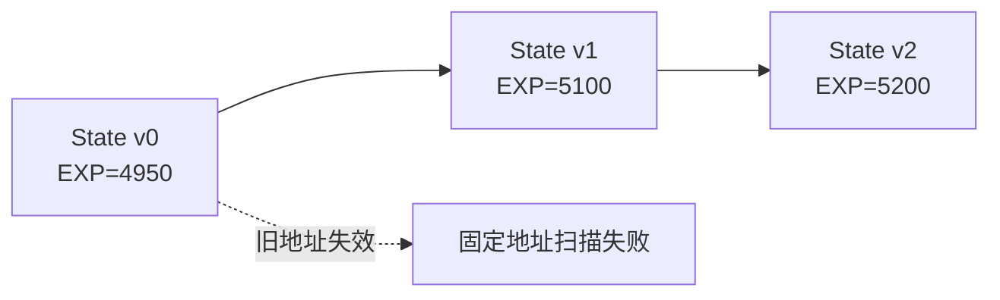
```mermaid
flowchart LR
    S0["State v0<br/>EXP=4950"] --> S1["State v1<br/>EXP=5100"]
    S1 --> S2["State v2<br/>EXP=5200"]
    S0 -.旧地址失效.-> X["固定地址扫描失败"]
```

此时需要更深入理解程序语义，甚至编写专门的调试器脚本。

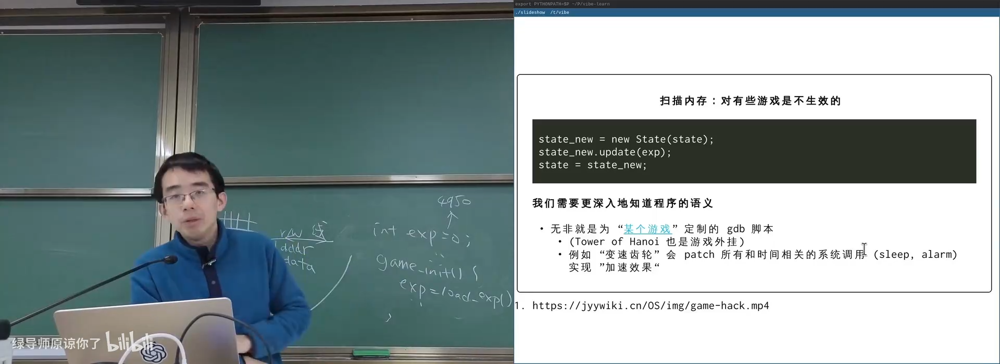

### 6.4 变速齿轮

程序无法直接感知时间，只能通过系统调用，例如：

```c
sleep();
usleep();
alarm();
gettimeofday();
```

变速工具可以：

- 拦截或替换时间相关函数；
- 把 `sleep(t)` 变成 `sleep(t / speed)`；
- 对 `gettimeofday()` 构造一个按比例加速的虚拟时间轴。


```mermaid
flowchart LR
    A["游戏调用 sleep / gettimeofday"] --> H["时间劫持层"]
    H --> V["虚拟时间轴"]
    V --> R["游戏认为时间加速"]
```

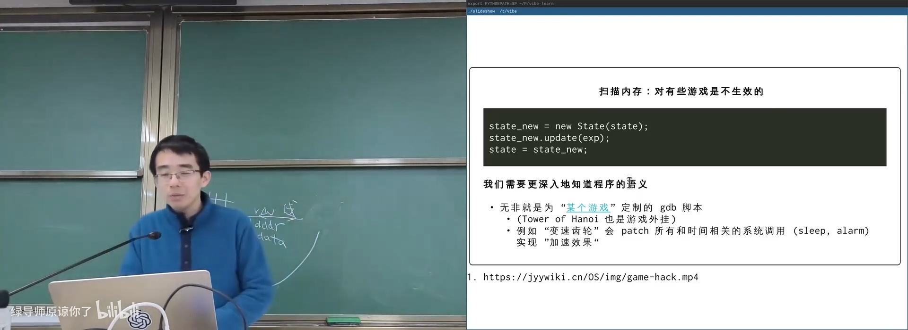

### 6.5 更底层的 DMA 与 CXL

在更极端的场景中，外设可以通过 DMA 持续读取主内存，甚至把内存镜像到另一台计算机或 FPGA。


```mermaid
flowchart LR
    CPU["CPU"] --> M["DRAM"]
    M --> DMA["DMA / PCIe 设备"]
    DMA --> F["FPGA / 另一台机器"]
    F --> A["外部分析或修改内存"]
```

CXL 等高速内存互联还可以实现双写和内存镜像，用于数据中心容错，也可能被用于观测和修改进程状态。

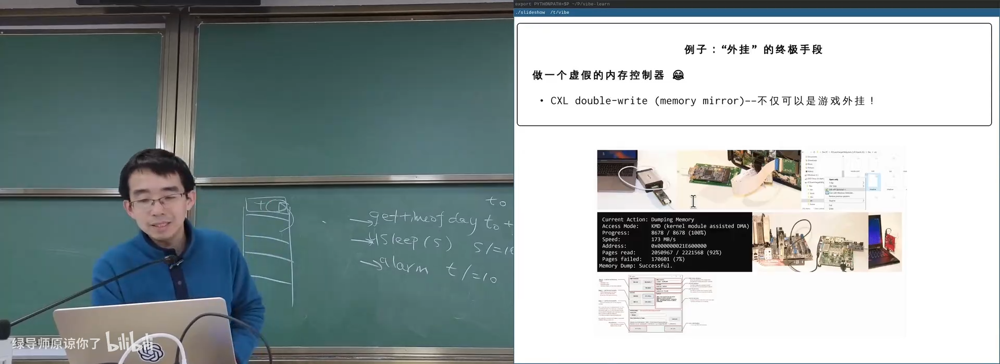

---

## 7. `/proc/<pid>/mem`

游戏修改器与地址空间探索工具最终都可以归结为文件操作：

```c
int fd = open("/proc/<pid>/mem", O_RDWR);
lseek(fd, address, SEEK_SET);
read(fd, buffer, size);
write(fd, data, size);
```

`/proc/<pid>/mem` 看起来是一个普通文件，但它实际代表目标进程的完整地址空间。


```mermaid
flowchart LR
    P["修改器进程"] --> F["/proc/PID/mem"]
    F --> A["目标进程地址空间"]
    A --> M["读取或修改数据"]
```

权限检查仍然存在：通常需要 `ptrace` 权限或 root 权限。

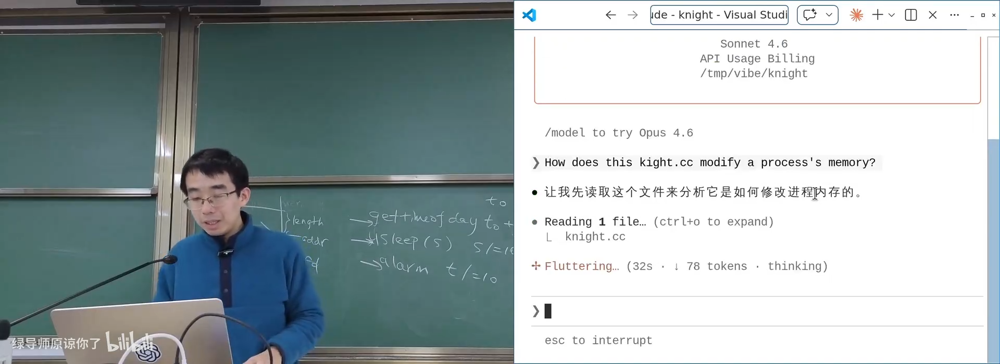

---

## 8. 本讲总结


```mermaid
mindmap
  root((进程地址空间))
    字节来源
      ISA 解释
      ELF PT_LOAD
      Loader + ABI
      argv / envp / auxv
      ASLR
    指针与虚拟内存
      地址与位宽
      volatile
      MMU 页表
      权限检查
    管理 API
      brk / sbrk
      mmap
      匿名映射
      文件映射
      munmap
      mprotect
    应用
      malloc
      共享内存
      MMIO
      JIT
      vvar / vdso
    入侵
      GDB / ptrace
      Game Genie
      内存扫描
      变速齿轮
      DMA / CXL
      /proc/pid/mem
```

核心结论：

1. 地址空间是进程可以通过指针访问的虚拟地址范围。
2. 字节本身无类型，含义由 CPU 指令决定。
3. ELF 的 `PT_LOAD`、加载器和 ABI 决定数据放在哪里。
4. 初始栈中保存 `argc`、`argv`、`envp`、`auxv`。
5. ASLR 随机化地址布局，提高攻击难度。
6. `procfs` 的 `maps` 和 `mem` 可以观察甚至修改其他进程。
7. MMU 是操作系统强制施加的地址翻译与权限检查机制。
8. `brk` 是旧式堆扩展 API；现代内存映射主要依赖 `mmap`。
9. `mmap` 可按需分配匿名内存，也可映射文件、设备和共享内存。
10. `munmap` 回收映射，`mprotect` 修改读、写、执行权限。
11. 动态代码生成依赖从读写页面切换到可执行页面。
12. 调试器、游戏外挂和内存工具都建立在进程内存访问能力之上。

> 计算机世界里没有魔法。  
> 每一个地址、每一个字节和每一项权限，最终都有明确的来源。

---

## 附：官方参考与延伸阅读

课程与讲义：

- [《操作系统原理》2026 课程主页](https://jyywiki.cn/OS/2026/)
- [第 6 讲讲义：进程的地址空间](https://jyywiki.cn/OS/2026/lect6.md)
- [本讲视频](https://jyywiki.cn/OS/2026/video/BV18nAjz9EcW/)

课程演示：

- [CrazyOS](https://jyywiki.cn/OS/demos/virtualization/crazy-os)
- [重新理解指针](https://jyywiki.cn/OS/demos/virtualization/pointers)
- [探索进程地址空间](https://jyywiki.cn/OS/demos/virtualization/addr-space)
- [mmap 系统调用](https://jyywiki.cn/OS/demos/virtualization/mmap)
- [金山游侠式内存修改器](https://jyywiki.cn/OS/demos/virtualization/knight)

系统与硬件资料：

- [System V ABI](http://jyywiki.cn/OS/manuals/sysv-abi.pdf)，重点阅读 Section 3.4 Process Initialization。
- [Intel Processor Trace](https://perf.wiki.kernel.org/index.php/Perf_tools_support_for_Intel%C2%AE_Processor_Trace)
- [Game Genie Technical Notes](https://tuxnes.sourceforge.net/gamegenie.html)
- [Game Genie 专利 EP0402067A2](https://patents.google.com/patent/EP0402067A2/en)
- [Game Genie 工作原理](https://www.howtogeek.com/706248/what-was-the-game-genie-cheat-device-and-how-did-it-work/)

阅读材料：

- *Operating Systems: Three Easy Pieces*
  - 第 12 章：Dialogue；
  - 第 13 章：Address Spaces；
  - 第 14 章：Memory API。
- `man 2 mmap`
- `man 2 munmap`
- `man 2 mprotect`
- `man 2 brk`
- `man 5 proc`
- `man 2 ptrace`

> **版权说明**：课程讲义与幻灯片的著作权归蒋炎岩所有，采用 Creative Commons BY-NC 4.0 许可。电子书正文为课堂内容的书面化重构，脚本占位符已替换为视频画面或官方资料渲染图；引用与来源链接均保留在本页。
