# 访问操作系统对象：文件描述符与管道

> **课程**：2026 春季学期《操作系统原理》，第 7 讲  
> **讲师**：蒋炎岩（jyy）  
> **官方课程主页**：<https://jyywiki.cn/OS/2026/>  
> **官方讲义**：<https://jyywiki.cn/OS/2026/lect7.md>  
> **视频来源**：[Bilibili BV1QFQmB7EQD](https://www.bilibili.com/video/BV1QFQmB7EQD/)  
> **版权说明**：课程讲义与幻灯片归蒋炎岩所有，采用 [Creative Commons BY-NC 4.0](http://creativecommons.org/licenses/by-nc/4.0/) 许可；本电子书是对课堂讲授的书面化重构，保留出处与许可说明。

## 导语：进程之外还有一整个世界

前几讲解决了进程自身的两个核心问题：

- 生命周期：`fork`、`execve`、`exit`；
- 地址空间：`mmap`、`munmap`、`mprotect`。

但进程不能只读写自己的内存。只要它要：

- 读取网络请求；
- 写入文件；
- 打开终端；
- 和其他进程交换数据；
- 使用打印机、GPU、键盘等设备；

它就必须访问操作系统中的其他对象。

应用开发者关心“我想做什么”，操作系统设计者关心“提供什么样的通用机制，让所有应用都能自行组合出所需功能”。

UNIX 给出的核心答案是：

> **Everything is a File。**

文件描述符则是应用程序用来访问这些操作系统对象的指针。

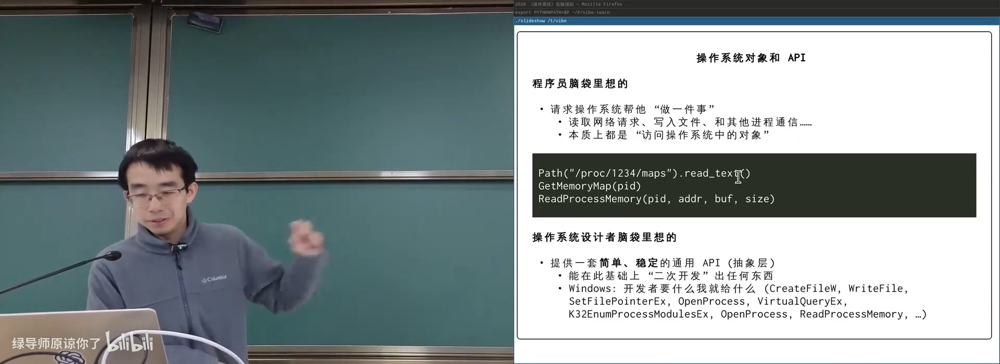

---

## 1. 实验、Git 与 AI 辅助工作流

*(参考时间: 00:00:05)*

课程实验框架在 3 月 22 日更新过，一度出现“新框架搭配旧 TestKit”的版本问题。解决方式不是记死 Git 命令，而是理解目标：

- 查看提交历史；
- 暂时回退一个 commit；
- 从远端同步更新；
- 将更新合并回本地。

Agent 可以根据目标自动组合 `git log`、`git reset`、`git fetch`、`git merge` 等命令。


```mermaid
flowchart LR
    P["明确目标"] --> A["Coding Agent"]
    A --> G1["git log"]
    G1 --> G2["git reset"]
    G2 --> G3["git fetch"]
    G3 --> G4["git merge"]
    G4 --> R["同步完成"]
```

重点不是要求每个人背住命令，而是建立“哪件事能够做到”的概念，再让 AI 放大人的自主性。

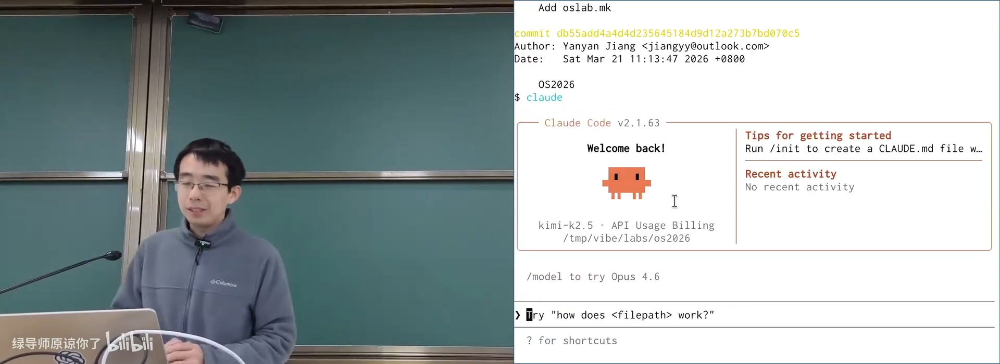

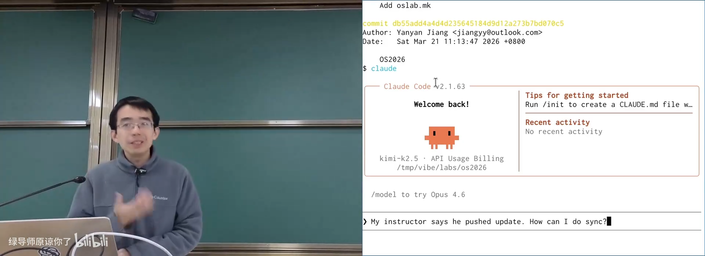

---

## 2. 进程是一个封闭世界

*(参考时间: 00:07:02)*

进程自己的资源只有寄存器和地址空间。除此之外的一切访问都要经过系统调用：

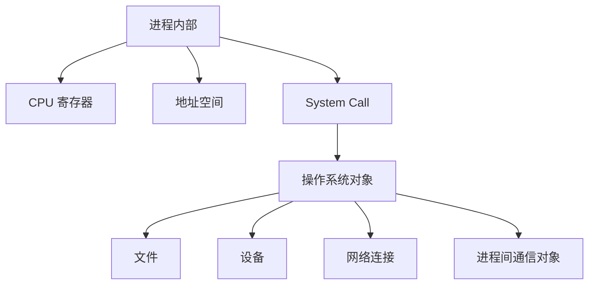
```mermaid
flowchart TD
    P["进程内部"] --> C["CPU 寄存器"]
    P --> M["地址空间"]
    P --> S["System Call"]
    S --> O["操作系统对象"]
    O --> F["文件"]
    O --> D["设备"]
    O --> N["网络连接"]
    O --> I["进程间通信对象"]
```

操作系统经过几十年演化，已经定义了大量对象：

- 文件与目录；
- 管道和 FIFO；
- 套接字；
- 终端与伪终端；
- GPU、输入设备、块设备；
- 信号与锁；
- 共享内存；
- 进程与线程。

问题在于：操作系统不可能为每一种对象单独发明完全不同的编程模型。它需要一种统一、稳定、可复用的抽象。

---

## 3. 从程序员意图到操作系统机制

### 3.1 程序员想表达的是对象操作

应用开发者更希望写出接近自然语言的接口：

```python
Path("/proc/1234/maps").read_text()

memory_map = GetMemoryMap(pid)
ReadProcessMemory(pid, address, buffer, size)
```

而不是每次都直接使用一系列底层系统调用。

### 3.2 操作系统提供通用机制

UNIX 没有为 `GetMemoryMap` 发明专门的系统调用，而是把进程信息放进：

```text
/proc/<pid>/maps
/proc/<pid>/mem
```

应用只需复用已经存在的文件 API：

```c
open();
read();
write();
```

Windows 选择了另一种设计：

- `CreateFileW`
- `WriteFile`
- `SetFilePointerEx`
- `OpenProcess`
- `VirtualQueryEx`
- `ReadProcessMemory`

它为开发者提供更直接的专用 API，能够更高效地把结构体信息交给应用。

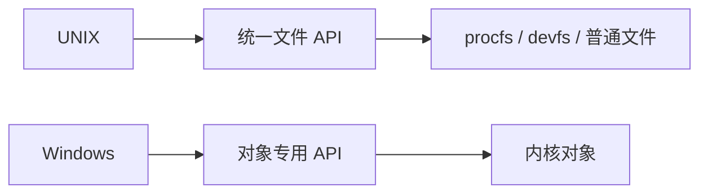
```mermaid
flowchart LR
    U["UNIX"] --> UF["统一文件 API"]
    UF --> P["procfs / devfs / 普通文件"]
    W["Windows"] --> WA["对象专用 API"]
    WA --> K["内核对象"]
```

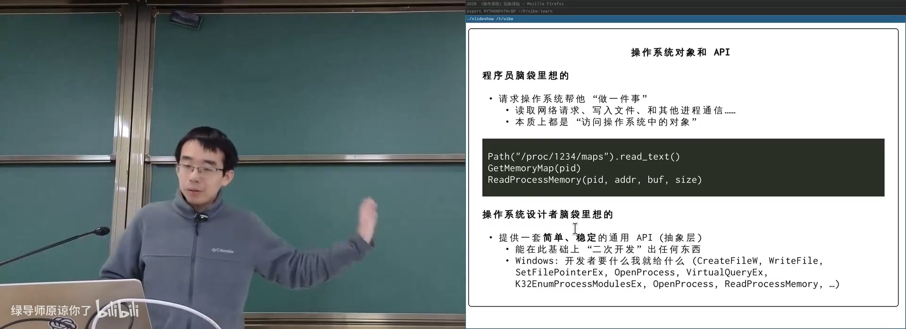

---

## 4. Everything is a File

### 4.1 什么是文件？

最朴素的解释是：

> 一个有名字的数据对象，表现为可读写、可定位的字节序列。

文件模型非常通用，因为数据流、数组、图片、文本、日志都可以表示成字节序列。

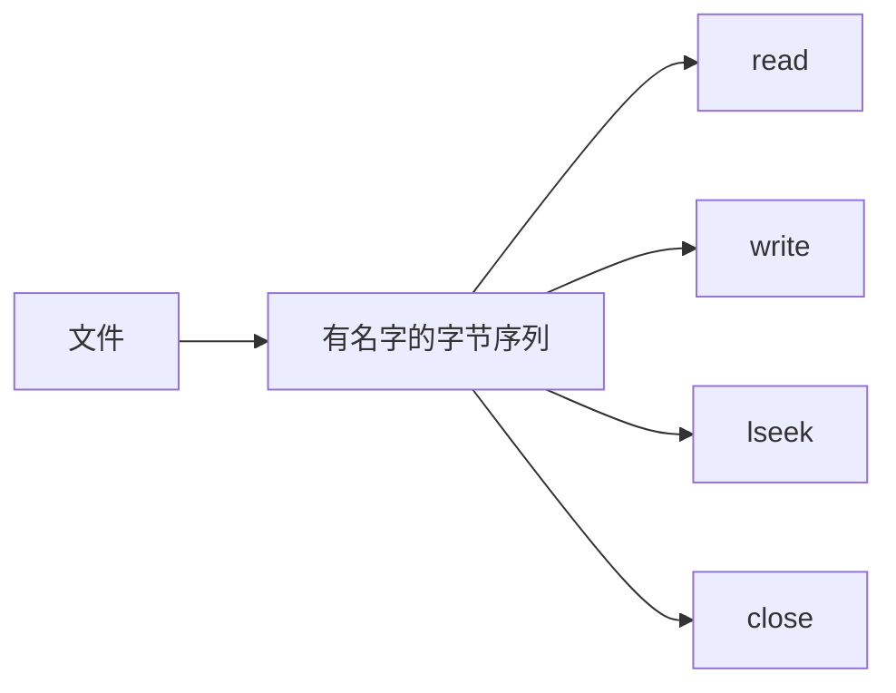
```mermaid
flowchart LR
    F["文件"] --> B["有名字的字节序列"]
    B --> R["read"]
    B --> W["write"]
    B --> S["lseek"]
    B --> C["close"]
```

### 4.2 什么可以被“假装成文件”？

UNIX 把操作系统对象暴露成文件：

- 普通文件：文本、图片、代码；
- 设备文件：磁盘、终端、GPU、GPIO；
- 伪设备：`/dev/null`、`/dev/urandom`；
- procfs：进程和内核状态；
- sysfs：内核与设备信息；
- 管道：进程间字节流；
- 套接字：网络与本地通信；
- 共享内存对象。

随后再用目录树给这些对象命名。

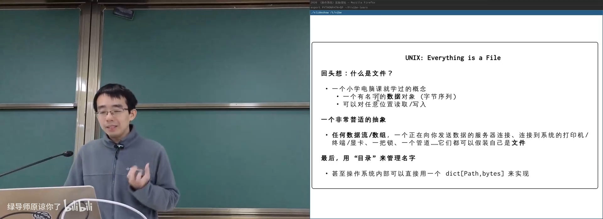

### 4.3 文件系统可以构建信息系统

课程网站的在线评测系统本身就是一个例子：

```text
/var/www/filerecv/OS2025/M1/<student>/<timestamp>.zip
```

提交完成后，后台评测程序监控目录，并生成：

```text
<timestamp>.result
```

前端刷新页面时直接遍历目录树。


```mermaid
flowchart LR
    W["Web 后端"] --> F["提交目录"]
    F --> J["Online Judge 监控"]
    J --> R["生成 .result"]
    R --> U["前端遍历目录"]
```

文件系统的优点：

- 人类可以直接查看和修改；
- 命令行为工具可以组合；
- 重判只需删除 `.result`；
- 不需要为每个操作写专用后台工具。

代价是缺少数据库那样的事务一致性保证。

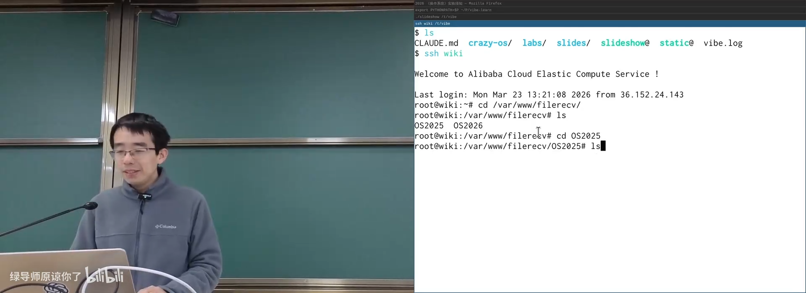

例如重判所有提交，只需要删除旧结果：

```bash
find ... -name '*.result' -delete
```

评测器再次扫描时，会重新处理缺少结果的任务。

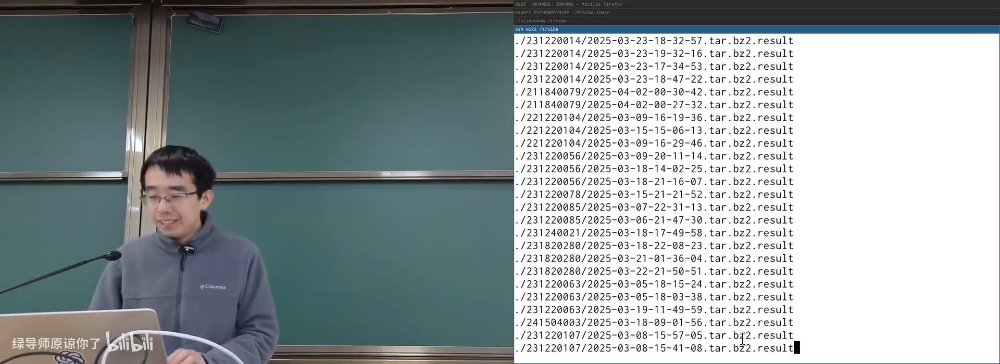

### 4.4 FHS

Linux 文件系统布局遵循 **Filesystem Hierarchy Standard（FHS）**：

- `/bin`、`/usr/bin`；
- `/etc`；
- `/home`；
- `/dev`；
- `/proc`；
- `/sys`；
- `/var`；
- `/tmp`。

标准让用户和程序能够预测文件位置。macOS 虽然是 UNIX 系统，但并不完全遵循 Linux FHS。

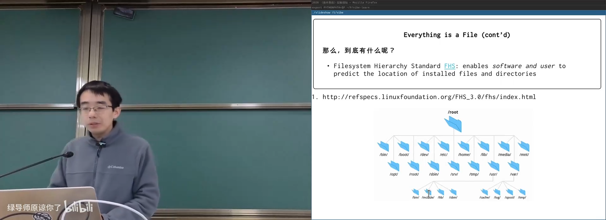

---

## 5. UNIX Philosophy：组合小工具

*(参考时间: 00:33:08)*

UNIX Philosophy 可以概括为：

1. 每个程序只做一件事，并把它做好；
2. 程序能够协同工作；
3. 把文本流作为通用接口。


```mermaid
flowchart LR
    E["一个工具的输出"] --> T["文本流"]
    T --> P["管道"]
    P --> I["另一个工具的输入"]
```

文本接口同时面向：

- 人类：容易查看、编辑和调试；
- 机器：容易解析和组合；
- Agent：容易进入语言模型上下文。

例如统计所有进程的 `VmRSS`：

```bash
grep -s VmRSS /proc/*[0-9]/status \
  | awk '{sum += $2} END {print sum " kB"}'
```

这种“快速但不够严谨”的接口也有缺点，例如空格、引号和格式变化会让解析变得脆弱。AI 时代，Agent 可以生成更严格的程序或直接调用结构化 API。

但“小工具组合”和“统一数据接口”的思想仍然有巨大价值。

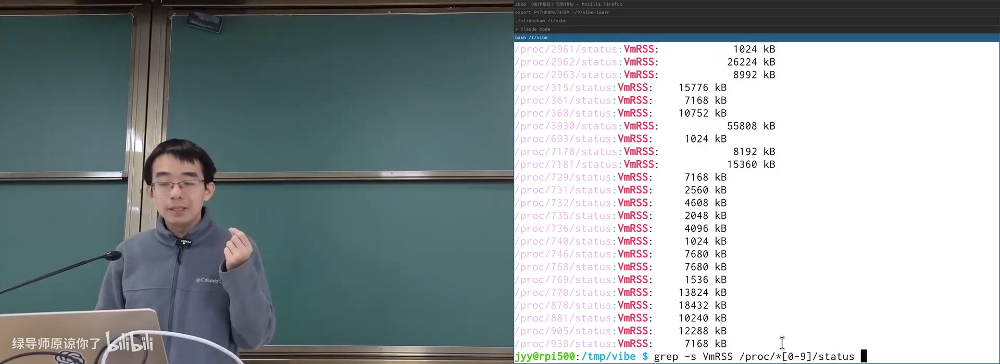

---

## 6. 文件在操作系统内部是什么

### 6.1 从 CrazyOS 理解文件对象

CrazyOS 中每个进程有输出缓冲区：

```c
struct proc {
    char buf[BUFSIZE];
    size_t buf_len;
};
```

如果给它一个当前偏移：

```c
struct FILE {
    char *data;
    size_t offset;
};
```

立即得到文件的最小模型：

- `open`：分配 `struct FILE`；
- `close`：释放 `struct FILE`；
- `read`：从 `data + offset` 读取并推进 offset；
- `write`：写入并推进 offset；
- `lseek`：修改 offset；
- `dup`：创建指向同一文件对象的新引用。

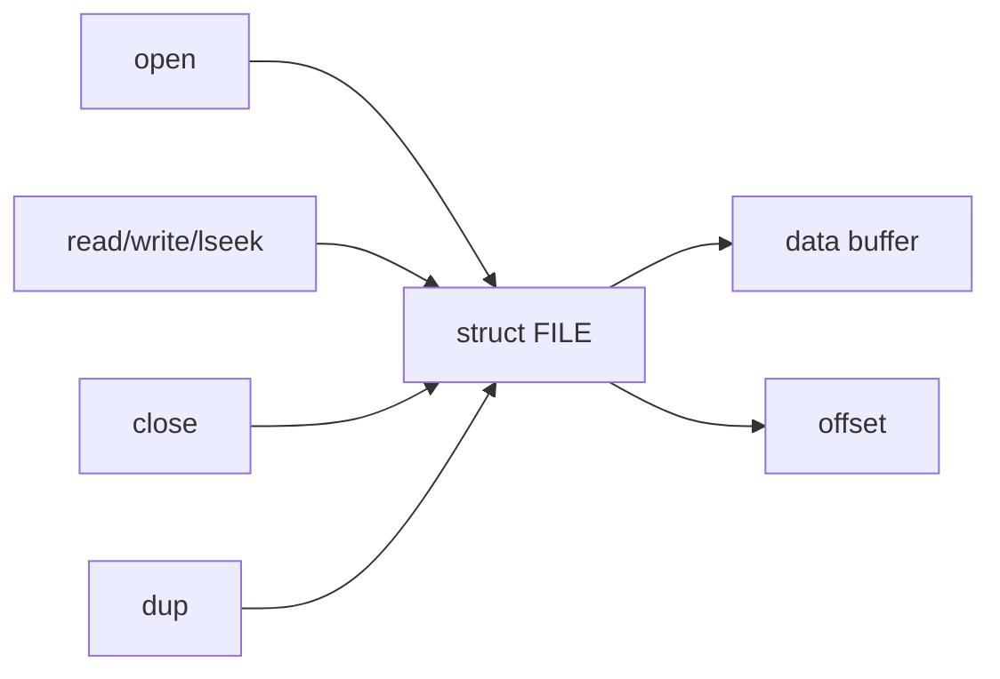
```mermaid
flowchart LR
    O["open"] --> F["struct FILE"]
    F --> D["data buffer"]
    F --> P["offset"]
    R["read/write/lseek"] --> F
    C["close"] --> F
    U["dup"] --> F
```

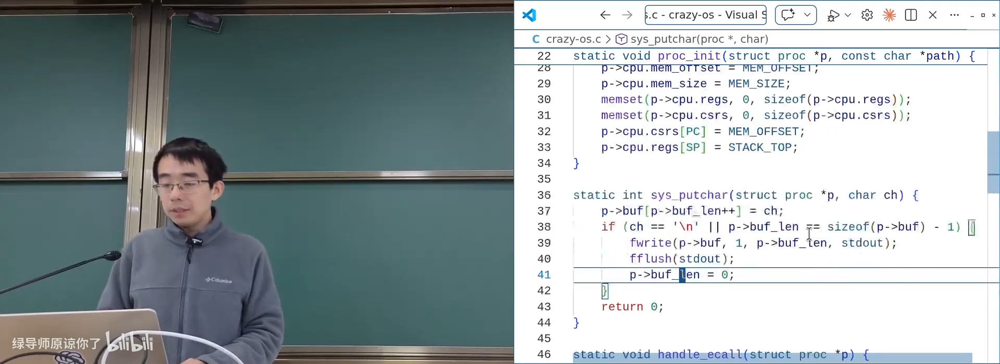

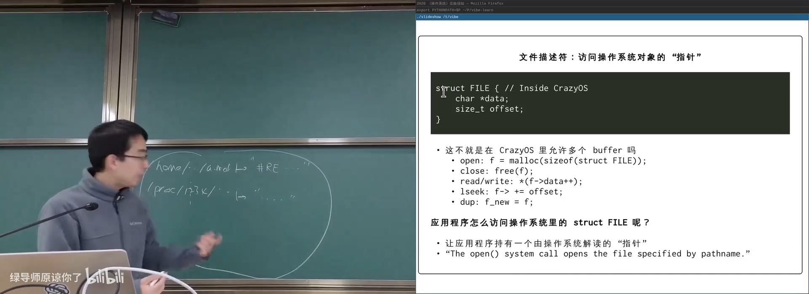

### 6.2 应用不能直接持有内核指针

`struct FILE` 位于内核地址空间，应用无法直接解引用。UNIX 使用一个整数间接引用对象：

```text
文件描述符（File Descriptor）
```

文件描述符只对当前进程有意义，由操作系统负责解释。

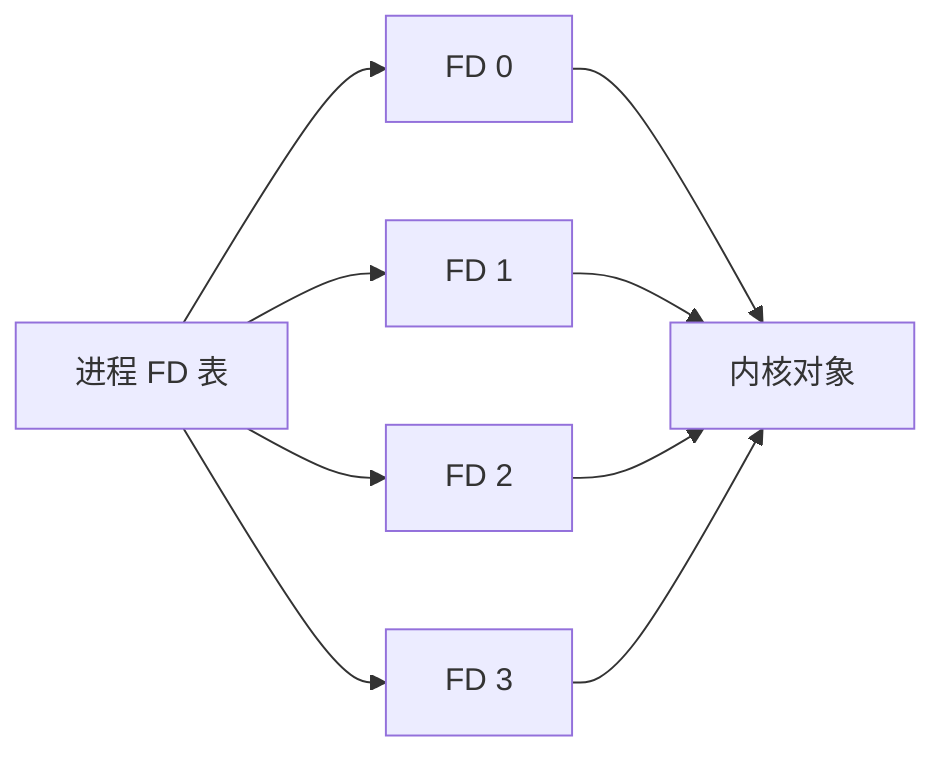
```mermaid
flowchart LR
    P["进程 FD 表"] --> D0["FD 0"]
    P --> D1["FD 1"]
    P --> D2["FD 2"]
    P --> D3["FD 3"]
    D0 --> K["内核对象"]
    D1 --> K
    D2 --> K
    D3 --> K
```

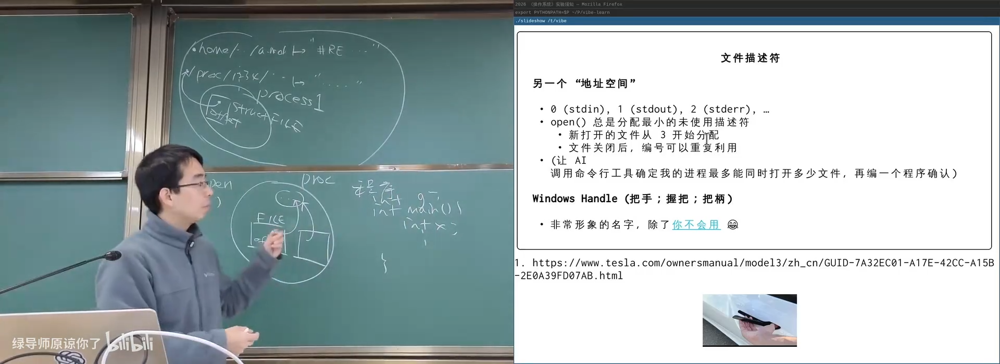

### 6.3 三个标准描述符

进程启动时通常已有：

| FD | 名称 | 用途 |
|---|---|---|
| 0 | stdin | 标准输入 |
| 1 | stdout | 标准输出 |
| 2 | stderr | 标准错误 |

`open` 总是分配当前最小的未使用描述符。

例如：

- 0、1、2 已使用，则新文件获得 3；
- 关闭 FD 3 后再打开，新对象仍优先获得 3。

```c
write(1, "hello\n", 6);
```

本质上是在向 FD 1 对应的内核对象写入字节。

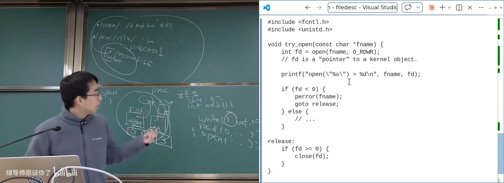

### 6.4 Windows Handle

Windows 用 **Handle** 表示操作系统对象引用。Handle 更像带权限的“把柄”：

- 不仅包含对象标识；
- 也可能携带访问权限；
- 不同 Handle 可以指向不同对象或具有不同权限。

UNIX 文件描述符只是一个整数索引，权限语义更多保存在内核对象中。

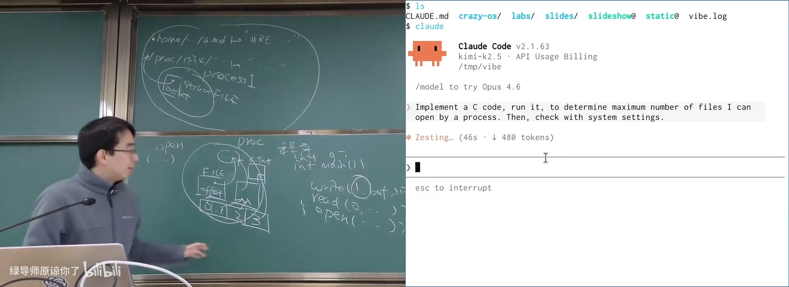

---

## 7. 文件描述符与 fork 的复杂交互

*(参考时间: 01:01:24)*

考虑：

```c
int fd = open("log.txt", O_WRONLY);
write(fd, "1", 1);
fork();
write(fd, "2", 1);
```

问题是：最终文件里应该有几个 `2`？

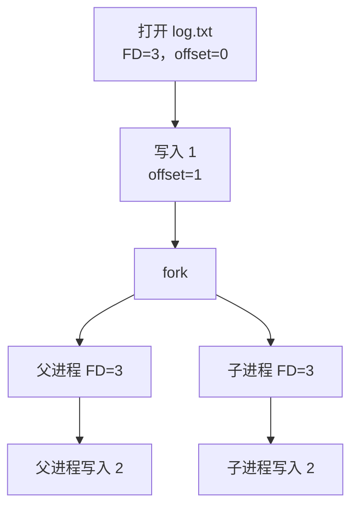
```mermaid
flowchart TD
    O["打开 log.txt<br/>FD=3，offset=0"] --> W1["写入 1<br/>offset=1"]
    W1 --> F["fork"]
    F --> P["父进程 FD=3"]
    F --> C["子进程 FD=3"]
    P --> W2["父进程写入 2"]
    C --> W3["子进程写入 2"]
```

有两种可能设计：

#### 深复制

父子进程拥有独立 offset，最终文件可能为：

```text
12
```

双方从同一位置覆盖写入。

#### 浅复制

父子进程共享打开文件对象和 offset：

```text
122
```

两次写入顺序追加。

UNIX 选择浅复制。父子进程共享 offset，因此日志或追加型文件不会轻易互相覆盖。如果要获得独立 offset，可以再次 `open` 文件。

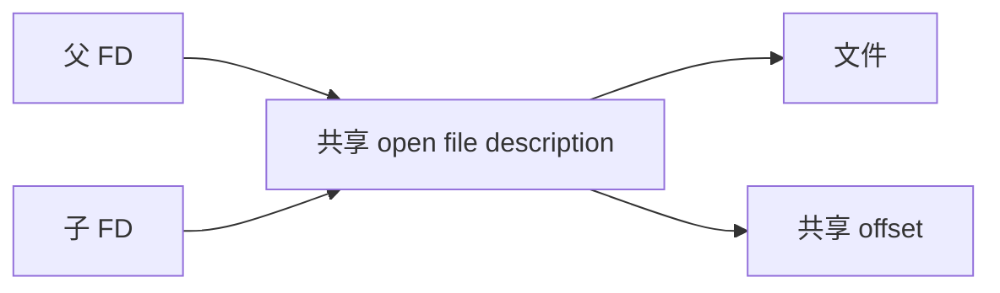
```mermaid
flowchart LR
    P["父 FD"] --> O["共享 open file description"]
    C["子 FD"] --> O
    O --> F["文件"]
    O --> S["共享 offset"]
```

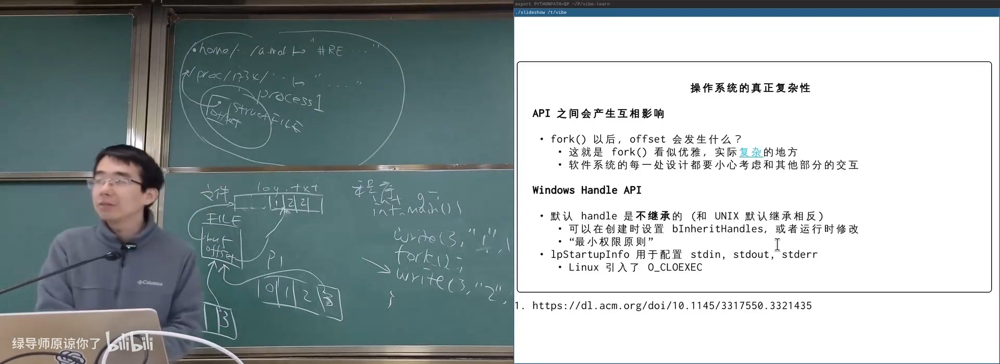

这种默认继承带来安全风险：父进程打开敏感文件后若忘记关闭，子进程通过 `execve` 执行的其他程序也可能继承该 FD。

解决方案：

```c
open(path, O_CLOEXEC);
```

让描述符在 `execve` 时自动关闭，更接近“最小权限原则”。

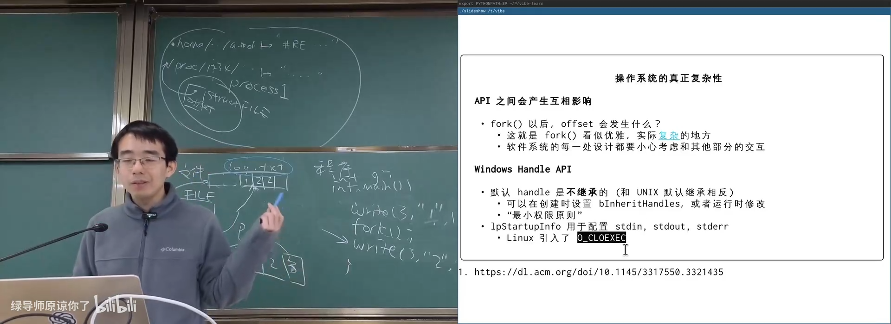

---

## 8. 看看系统里到底打开了什么

`/proc/<pid>/fd/` 把每个进程的文件描述符映射为符号链接：

```bash
ls -l /proc/*/fd/* 2>/dev/null
```

可以看到：

- `/dev/pts/...`：伪终端；
- `/dev/tty...`：控制台；
- `/dev/null`：空设备；
- GPU 渲染设备；
- 输入设备；
- pipe；
- socket。


```mermaid
flowchart LR
    P["进程 PID"] --> FD["/proc/PID/fd"]
    FD --> N["FD 0 / 1 / 2 / ..."]
    N --> O["对应的内核对象"]
```

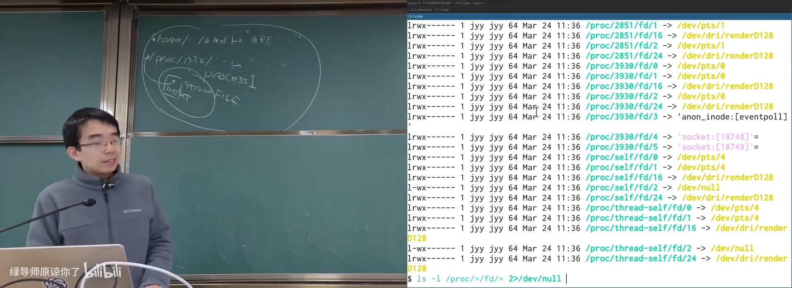

只要权限允许，还可以直接向终端设备写数据：

```bash
echo hello > /dev/pts/5
```

对应终端会立即显示内容。这说明 Everything is a File 不只是概念，而是可以真实操作的接口。

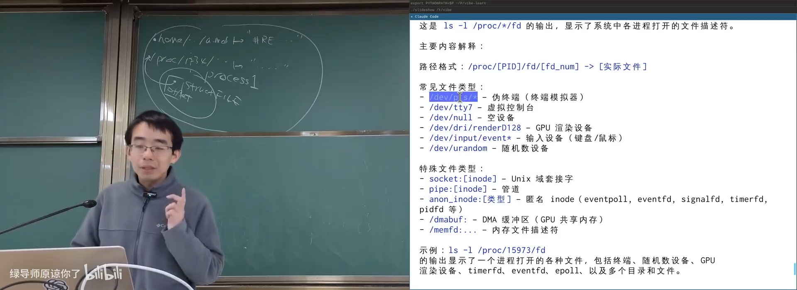

---

## 9. 管道：进程间的字节流

### 9.1 匿名管道

```c
int pipe(int pipefd[2]);
```

系统会创建一个匿名管道对象，并返回两个文件描述符：

- `pipefd[0]`：读端；
- `pipefd[1]`：写端。


```mermaid
flowchart LR
    W["写端 FD"] --> P["Pipe 缓冲区"]
    P --> R["读端 FD"]
```

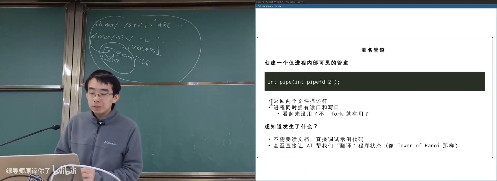

管道具有阻塞行为：

- 管道为空时，`read` 会等待；
- 管道已满时，`write` 会等待；
- 写端全部关闭后，读取会得到 EOF。

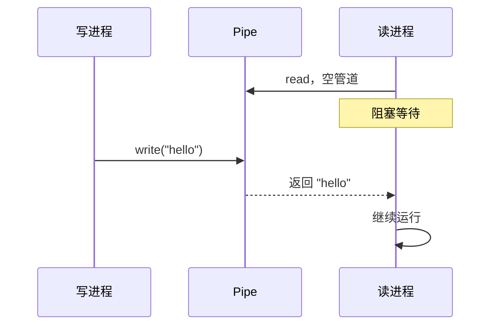
```mermaid
sequenceDiagram
    participant W as 写进程
    participant P as Pipe
    participant R as 读进程
    R->>P: read，空管道
    Note over R: 阻塞等待
    W->>P: write("hello")
    P-->>R: 返回 "hello"
    R->>R: 继续运行
```

### 9.2 命名管道 FIFO

如果不同时具有亲缘关系的进程也要通过管道通信，可以创建命名管道：

```bash
mkfifo /tmp/my.pipe
```

```c
mkfifo("/tmp/my.pipe", 0666);
```

它在文件系统中有一个名字，但行为仍是管道：

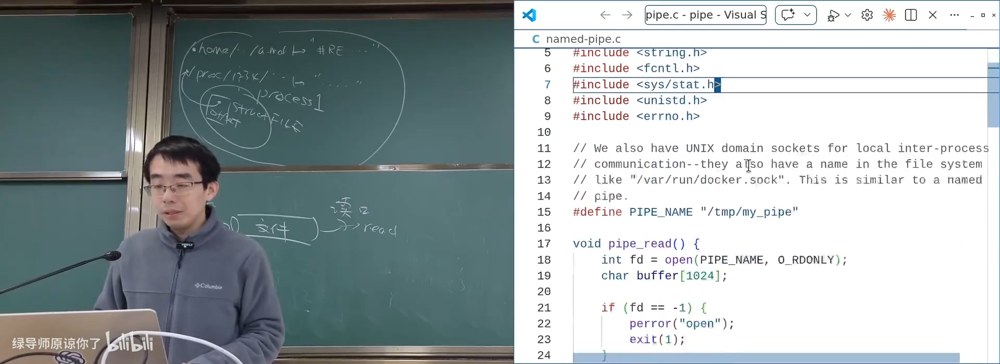

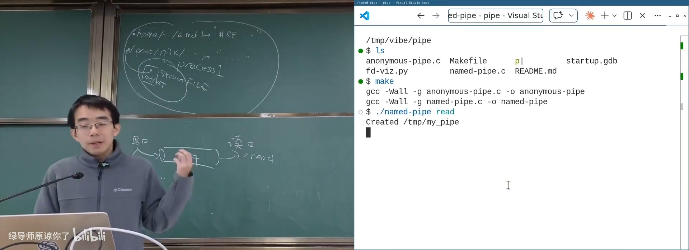

### 9.3 Shell 管道如何工作

Shell 中的：

```bash
ls | wc -l
```

大致流程：

1. Shell 创建匿名管道；
2. `fork` 出两个子进程；
3. 左进程关闭写端，把 stdout 指向管道写端；
4. 右进程关闭写端，把 stdin 指向管道读端；
5. `execve` 分别执行 `ls` 和 `wc`。

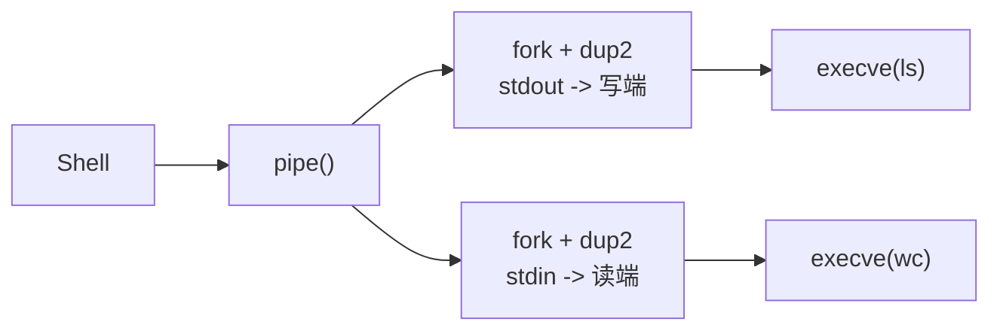
```mermaid
flowchart LR
    S["Shell"] --> P["pipe()"]
    P --> L["fork + dup2<br/>stdout -> 写端"]
    P --> R["fork + dup2<br/>stdin -> 读端"]
    L --> LS["execve(ls)"]
    R --> WC["execve(wc)"]
```

课堂使用 AI 生成工具，自动读取 `/proc/<pid>/fd` 并绘制进程、FD 与管道之间的 Mermaid 关系图。

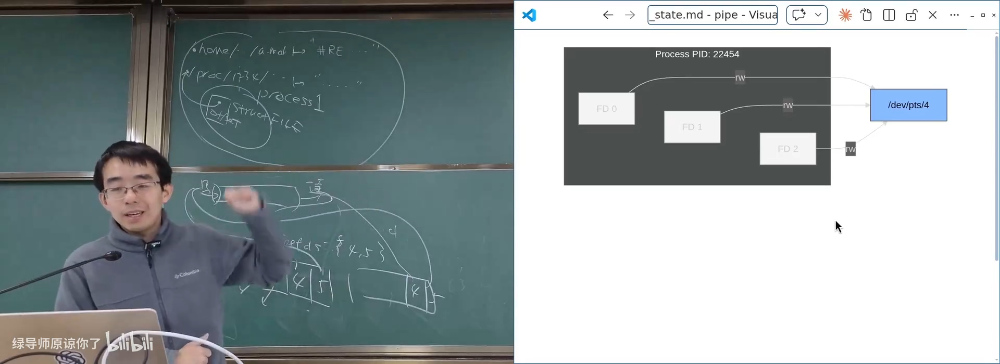

---

## 10. TestKit：用进程运行测试

*(参考时间: 01:27:03)*

课程 TestKit 使用 `fork` 为每个测试用例创建子进程：

1. 父进程注册测试；
2. 每个测试在独立子进程中运行；
3. 子进程崩溃或 `assert` 失败不会杀死整个测试进程；
4. 使用共享内存或管道收集子进程输出；
5. 设置超时，检测死循环；
6. 父进程汇总通过和失败结果。

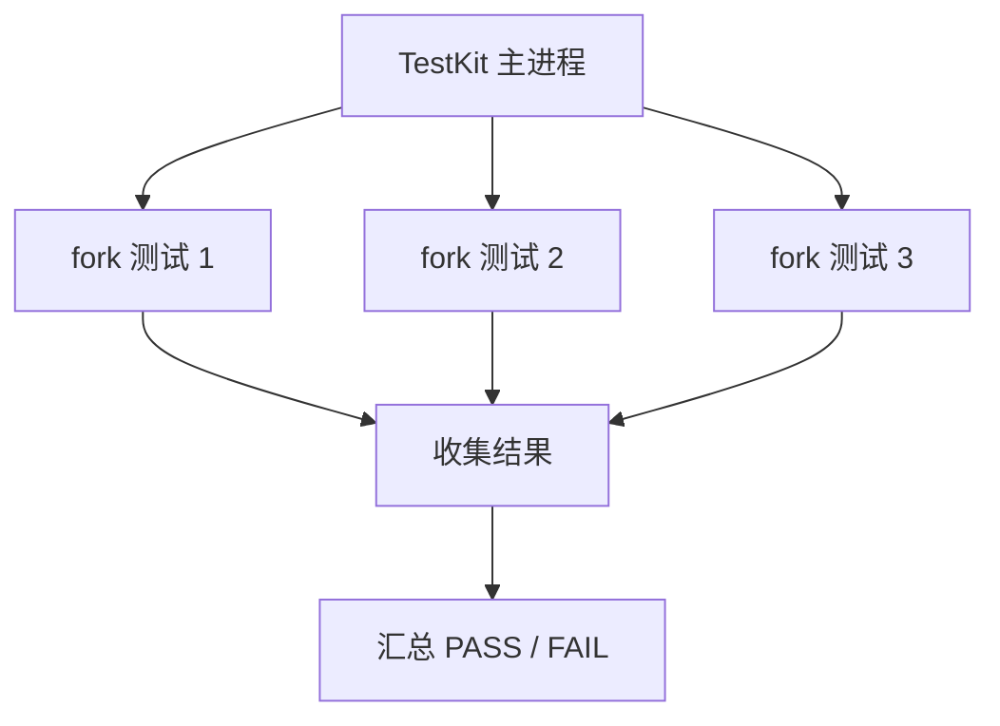
```mermaid
flowchart TD
    P["TestKit 主进程"] --> T1["fork 测试 1"]
    P --> T2["fork 测试 2"]
    P --> T3["fork 测试 3"]
    T1 --> R["收集结果"]
    T2 --> R
    T3 --> R
    R --> S["汇总 PASS / FAIL"]
```

这正是此前学过的进程、地址空间、文件和管道 API 的综合应用。

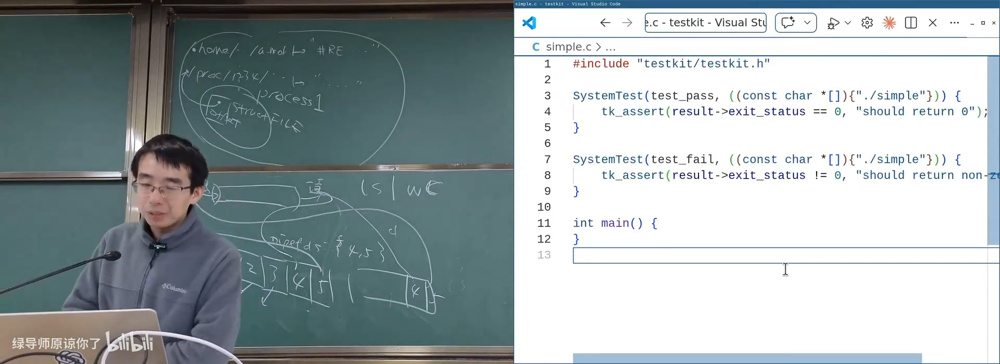

---

## 11. 本讲总结

```mermaid
mindmap
  root((访问操作系统对象))
    Everything is a File
      字节序列
      有名字对象
      数据流
      设备
      procfs / devfs
      socket / pipe
    UNIX Philosophy
      Do one thing well
      Work together
      Text stream interface
      Tool composition
    UNIX 文件模型
      struct FILE
      buffer + offset
      open / close
      read / write / lseek / dup
    文件描述符
      FD 0/1/2
      最小未使用编号
      Fork 共享 offset
      O_CLOEXEC
      Windows Handle
    procfs
      /proc/PID/fd
      查看打开对象
      /dev/pts
    管道
      pipe()
      读端 / 写端
      阻塞与容量
      FIFO
      shell 管线
    TestKit
      fork 子进程
      崩溃隔离
      超时
      结果汇总
```

核心结论：

1. 操作系统对象包括文件、设备、管道、套接字、进程等多种资源。
2. UNIX 用统一文件抽象复用 open/read/write/lseek/close。
3. Windows 更倾向提供对象专用 API 和 Handle。
4. 文件可表示数据流、数组、设备和进程状态。
5. 文件系统可以构建包括在线评测在内的大量信息系统。
6. 文件在最小模型中由数据缓冲区和 offset 组成。
7. 文件描述符是用户态访问内核对象的整数指针。
8. 0、1、2 分别对应 stdin、stdout、stderr。
9. `open` 返回最小未使用的文件描述符。
10. `fork` 后父子进程共享打开文件对象和 offset。
11. `O_CLOEXEC` 防止敏感文件描述符泄漏给 `execve` 后的程序。
12. 管道是带阻塞语义和有限容量的内核字节缓冲区。
13. Shell 管道本质上是 `pipe + fork + dup2 + execve`。
14. TestKit 展示了进程、文件描述符、管道与共享内存的综合应用。

> UNIX 的核心设计不是拥有最多专用 API，  
> 而是用少量通用机制组合出几乎无限的应用。

---

## 附：官方参考与延伸阅读

课程与讲义：

- [《操作系统原理》2026 课程主页](https://jyywiki.cn/OS/2026/)
- [第 7 讲讲义：访问操作系统对象](https://jyywiki.cn/OS/2026/lect7.md)
- [本讲视频](https://jyywiki.cn/OS/2026/video/BV1QFQmB7EQD/)

课程演示：

- [CrazyOS](https://jyywiki.cn/OS/demos/virtualization/crazy-os)
- [文件描述符](https://jyywiki.cn/OS/demos/virtualization/filedesc)
- [UNIX 管道](https://jyywiki.cn/OS/demos/virtualization/pipe)
- [TestKit 测试框架](https://jyywiki.cn/OS/demos/virtualization/testkit)

规范与资料：

- [Filesystem Hierarchy Standard 3.0](http://refspecs.linuxfoundation.org/FHS_3.0/fhs/index.html)
- [The UNIX-HATERS Handbook](https://web.mit.edu/~simsong/www/ugh.pdf)
- [A Fork in the Road](https://dl.acm.org/doi/10.1145/3317550.3321432)

阅读材料：

- *Operating Systems: Three Easy Pieces*
  - 第 39 章：Files and Directories。
- `man 2 open`
- `man 2 close`
- `man 2 read`
- `man 2 write`
- `man 2 lseek`
- `man 2 dup`
- `man 2 pipe`
- `man 3 mkfifo`
- `man 5 proc`

> **版权说明**：课程讲义与幻灯片的著作权归蒋炎岩所有，采用 Creative Commons BY-NC 4.0 许可。电子书正文为课堂内容的书面化重构，脚本占位符已替换为视频画面或官方资料渲染图；引用与来源链接均保留在本页。
