# 终端和 UNIX Shell：从打字机到 Job Control

> **课程**：2026 春季学期《操作系统原理》，Hacking Day 选讲  
> **讲师**：蒋炎岩（jyy）  
> **官方课程主页**：<https://jyywiki.cn/OS/2026/>  
> **官方讲义**：<https://jyywiki.cn/OS/2026/lect8.md>  
> **视频来源**：[Bilibili BV1nQXsBuEUz](https://www.bilibili.com/video/BV1nQXsBuEUz/)  
> **版权说明**：课程讲义与幻灯片归蒋炎岩所有，采用 [Creative Commons BY-NC 4.0](http://creativecommons.org/licenses/by-nc/4.0/) 许可；本电子书是对课堂讲授的书面化重构，保留出处与许可说明。

## 导语：键盘与终端的漫长演化

今天使用的终端看起来像软件界面，但它的祖先可以追溯到：

- 管风琴与水风琴键盘；
- 机械打字机；
- 电传打字机；
- Video Teletypewriter；
- VT100 终端；
- 伪终端与终端模拟器。

很多今天看似奇怪的行为，都来自这段历史：

- `Shift` 和 `Caps Lock`；
- `CR` 与 `LF`；
- `Tab` 与等宽字体；
- `Ctrl-C`、`Ctrl-D`、`Ctrl-Z`；
- ANSI Escape Sequence；
- Session、Process Group 与 Job Control。

本讲从一个核心事实出发：

> 终端本质上只是和操作系统交换字符。

一切更复杂的行为，其实都是操作系统、终端驱动和应用程序共同解释这些字节的结果。

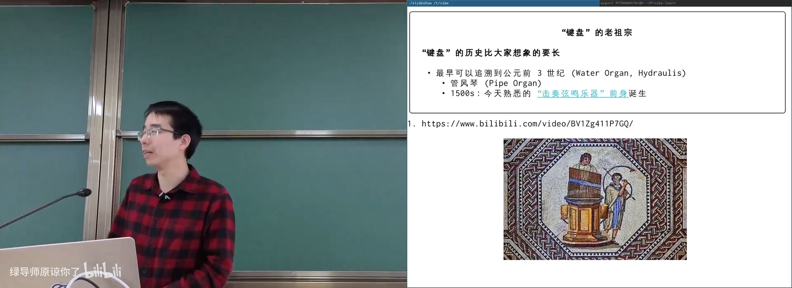

---

## 1. 打字机留下的遗产

### 1.1 机械打字机

打字机把按键动作转变为：

1. 字锤或字模击打色带；
2. 纸张留下字符；
3. 擒纵机构把字车向右移动一格。

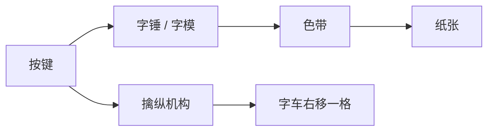
```mermaid
flowchart LR
    K["按键"] --> M["字锤 / 字模"]
    M --> R["色带"]
    R --> P["纸张"]
    K --> E["擒纵机构"]
    E --> C["字车右移一格"]
```

早期机械结构同时按下两个键容易卡住。QWERTY 布局在 1860 年代被设计出来，目标之一就是降低相邻字锤冲突和打字速度。

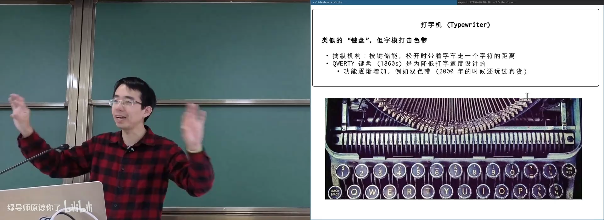

### 1.2 Shift、Caps Lock、Tab

这些键都保留了机械时代的操作模型：

- `Shift`：把字模或字锤向上移动，切换字符集；
- `Caps Lock`：把档位锁定在上方；
- `Tab`：移动到下一个 tab stop；
- 等宽字体：每个字符推进相同距离，便于对齐表格。

### 1.3 CR 与 LF

```text
\r = Carriage Return：打印头回到行首
\n = Line Feed：纸张向上移动一行
```

终端中，`\r` 不换行，只回到行首，所以后输出的字符会覆盖前一行。

UNIX 的文本换行通常只用 `\n`，终端驱动和显示系统负责组合出“回车 + 换行”效果；Windows 文本格式常见 `\r\n`。

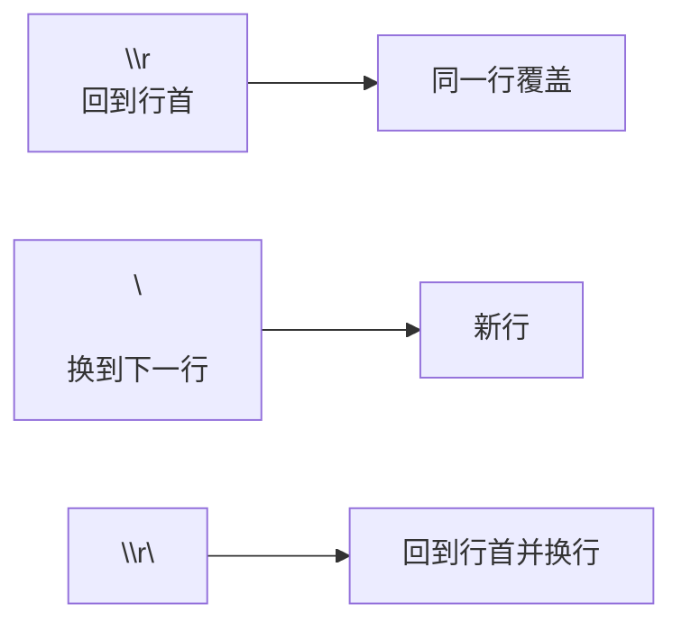
```mermaid
flowchart LR
    CR["\\r<br/>回到行首"] --> T["同一行覆盖"]
    LF["\\n<br/>换到下一行"] --> N["新行"]
    CRLF["\\r\\n"] --> T2["回到行首并换行"]
```

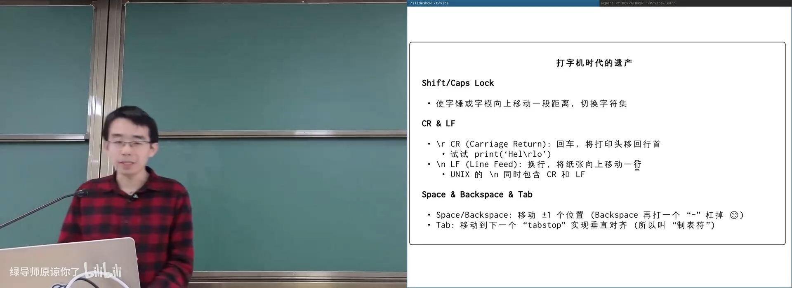

### 1.4 Space 与 Backspace

- `Space`：光标右移一格；
- `Backspace`：光标左移一格。

机械打字机不能真正删除字符，只能退格后重新敲击或打印“-”划掉。这一模型也影响了现代键盘命名。

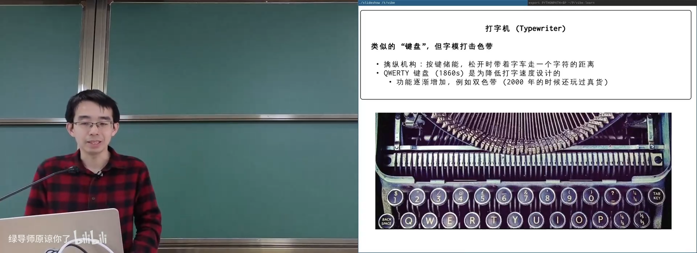

---

## 2. 电传打字机与 VT100

### 2.1 Teletypewriter

电传打字机允许多个终端通过线路通信：

- 本地按键编码后发送；
- 远端打印文字；
- 使用 Baudot Code 等 5-bit 编码。

当计算机接入电传打字机后，人可以通过键盘输入，并通过打印机看到输出。

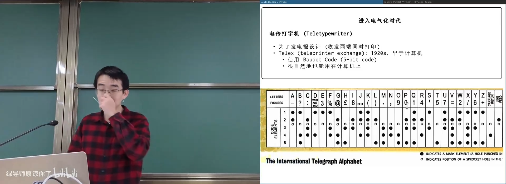

### 2.2 TTY 名称的由来

`TTY` 来自 **Teletypewriter**。终端对操作系统最核心的接口可以理解为：

```c
putchar(c);
```

操作系统向终端写入一个字符；终端根据字符含义移动光标、换行、响铃或解释控制代码。

### 2.3 VT100

1978 年的 VT100 是终端历史里程碑：

- 完整支持 ANSI Escape Sequence；
- 使用 80×24 字符布局；
- 支持光标移动、颜色、清屏和滚动；
- 成为事实上的行业标准。

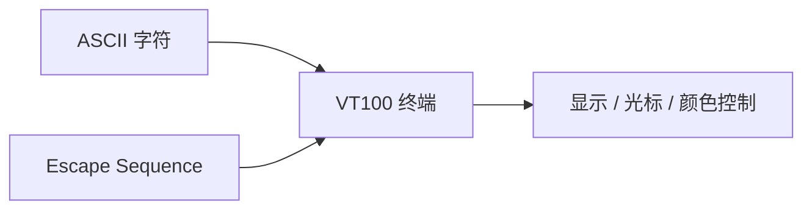
```mermaid
flowchart LR
    A["ASCII 字符"] --> V["VT100 终端"]
    E["Escape Sequence"] --> V
    V --> D["显示 / 光标 / 颜色控制"]
```

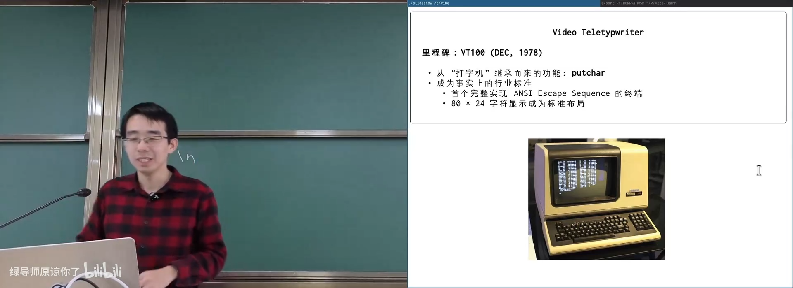

### 2.4 Unicode 让终端重新繁荣

Unicode 提供大量符号：

- 不同高度的块字符；
- 线条与箭头；
- Emoji；
- Powerline 状态栏符号。

这些字符可以组合成图形、进度条、树状结构和终端界面。

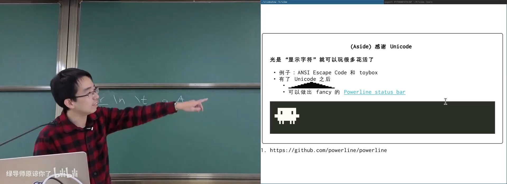

---

## 3. 终端作为输入设备

### 3.1 原始字符流

终端将按键转换成字节：

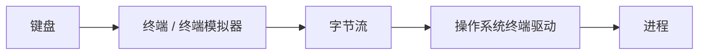
```mermaid
flowchart LR
    K["键盘"] --> T["终端 / 终端模拟器"]
    T --> B["字节流"]
    B --> O["操作系统终端驱动"]
    O --> P["进程"]
```

特殊键不会发送自己的状态：

- 按下 `Shift` 不会发送任何字节；
- 只有 `Shift + A` 才发送大写 `A`；
- 按下 `Ctrl` 本身也不会发送字节；
- `Ctrl-C` 发送 ASCII `0x03`；
- `Ctrl-D` 发送 ASCII `0x04`。

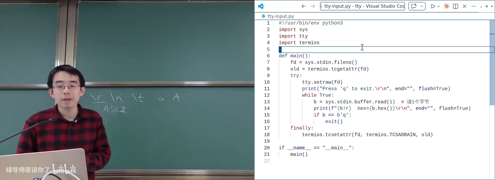

### 3.2 Ctrl-C 首先只是一个字节

终端本身并不知道“Ctrl-C 应该杀进程”。它只发送 `0x03`。

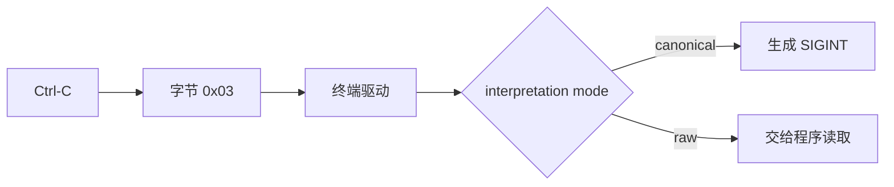
```mermaid
flowchart LR
    K["Ctrl-C"] --> B["字节 0x03"]
    B --> D["终端驱动"]
    D --> I{"interpretation mode"}
    I -->|"canonical"| S["生成 SIGINT"]
    I -->|"raw"| R["交给程序读取"]
```

如果程序把终端配置为 raw mode，`0x03` 会直接进入程序，`Ctrl-C` 就不会自动终止它。

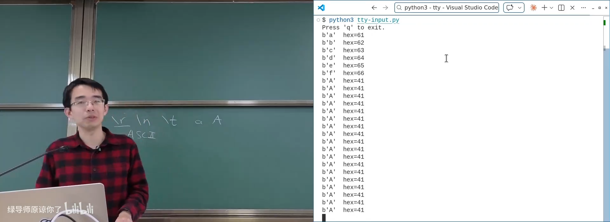

### 3.3 Escape Sequence

ASCII 没有“上、下、左、右”和颜色等控制能力，于是终端使用：

```text
ESC + 其他字符
```

组成 Escape Sequence。

例如方向键会发送多字节序列，应用解析后执行移动或历史命令操作。

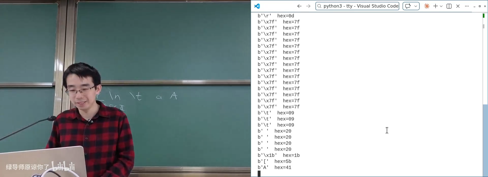

### 3.4 Canonical Mode

当运行 `cat` 并输入文字时，`read()` 不会在每次按键后立即返回：

- 终端驱动维护行缓冲；
- 退格会在驱动中编辑缓冲区；
- 回车后整行才交给程序；
- 回显由终端驱动控制。

这就是 **canonical mode（行编辑模式）**。

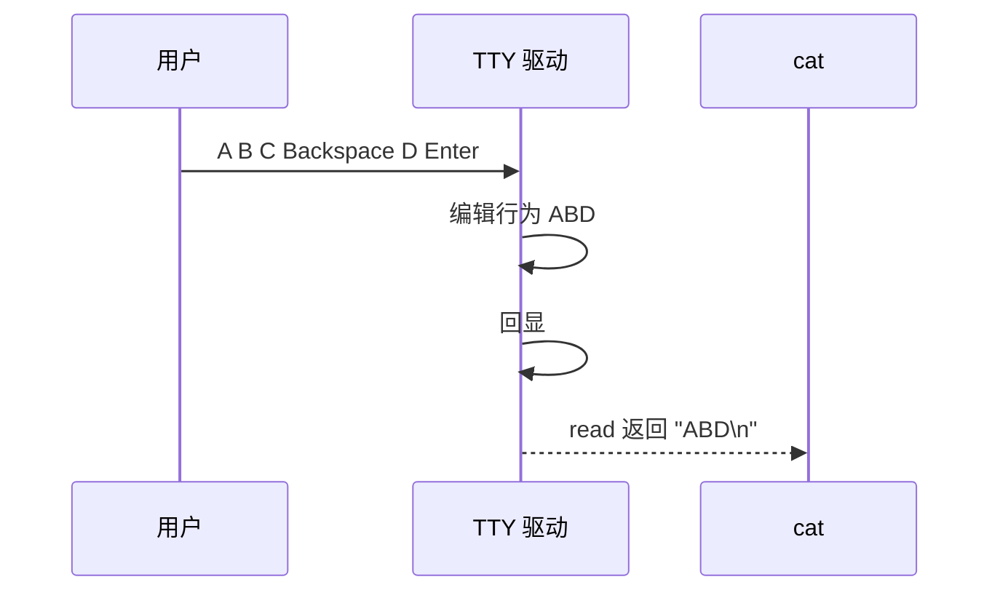
```mermaid
sequenceDiagram
    participant U as 用户
    participant D as TTY 驱动
    participant P as cat
    U->>D: A B C Backspace D Enter
    D->>D: 编辑行为 ABD
    D->>D: 回显
    D-->>P: read 返回 "ABD\n"
```

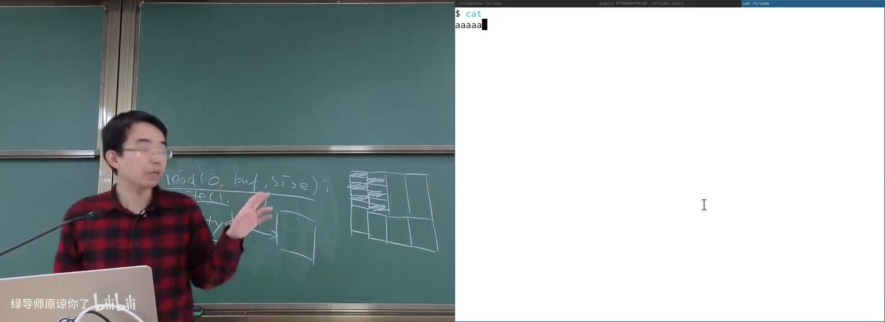

---

## 4. 伪终端与终端模拟器

### 4.1 想要多少终端就有多少

现代系统通过 **Pseudo Terminal（PTY）** 虚拟化终端设备：

- PTY master：连接终端模拟器；
- PTY slave：连接 Shell 或其他程序；
- 两侧形成双向字符通道。


```mermaid
flowchart LR
    E["Terminal Emulator"] --> M["PTY Master"]
    M <--> S["PTY Slave"]
    S <--> P["Shell / Application"]
```

创建 PTY 通常会打开 `/dev/ptmx`，再执行授权和解锁操作，最终得到对应的 `/dev/pts/N` 从设备。

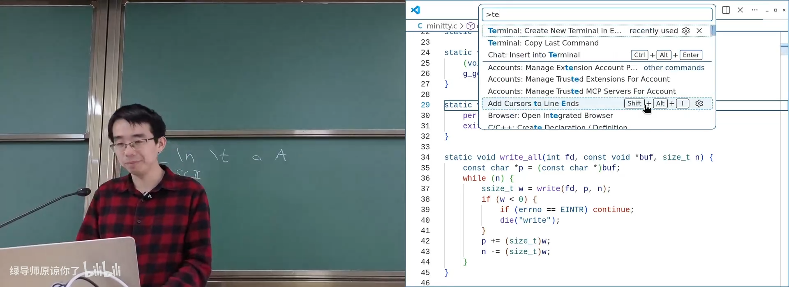

### 4.2 ttyrec

如果记录 PTY 中流动的所有字符和时间戳，就可以重放终端会话：

```bash
ttyrec session.rec
ttyplay session.rec
```

终端界面本质上仍是字符和控制序列，因此记录字符流比录制视频更轻量。

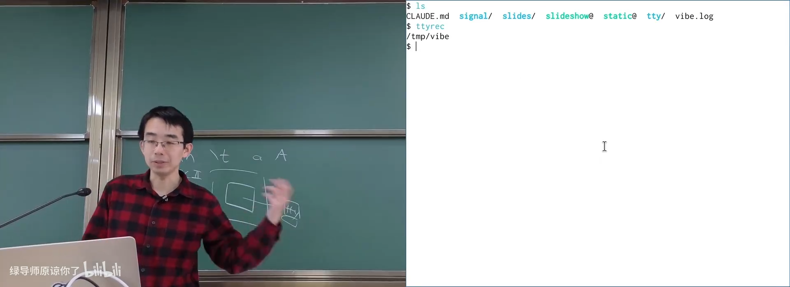

### 4.3 Sixel

VT200 时代出现了 Sixel：

- 一个字节编码 6×1 个像素是否点亮；
- 使用调色板提供颜色；
- 现代部分终端重新支持。

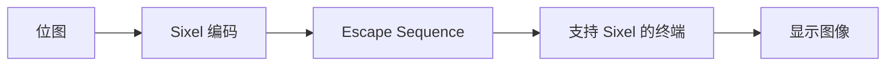
```mermaid
flowchart LR
    I["位图"] --> S["Sixel 编码"]
    S --> E["Escape Sequence"]
    E --> T["支持 Sixel 的终端"]
    T --> O["显示图像"]
```

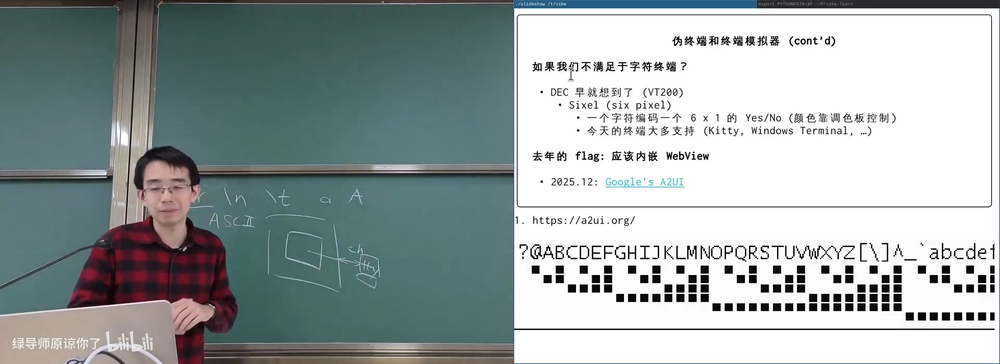

---

## 5. 终端与系统登录

### 5.1 getty 与 login

系统初始化时，`init` 会在不同终端上启动 `getty`：

1. 打开 TTY 设备；
2. 配置波特率等终端参数；
3. 把标准输入、输出、错误指向该终端；
4. 提示输入用户名；
5. 运行 `login` 建立用户会话。

远程 SSH 登录也会分配 PTY，然后执行类似流程。

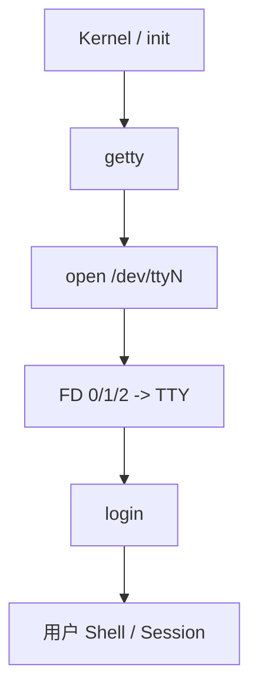
```mermaid
flowchart TD
    K["Kernel / init"] --> G["getty"]
    G --> O["open /dev/ttyN"]
    O --> F["FD 0/1/2 -> TTY"]
    F --> L["login"]
    L --> S["用户 Shell / Session"]
```

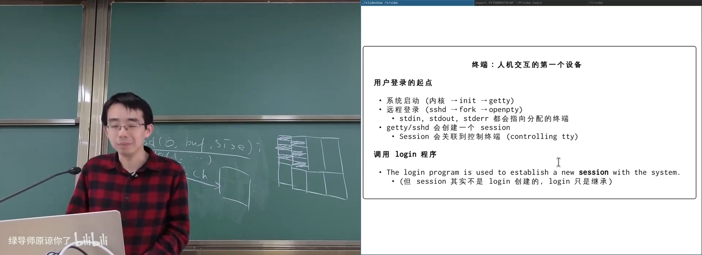

### 5.2 TUI

字符终端可以构建完整用户界面：

- 文本框、按钮和复选框；
- 表格与滚动条；
- 主题与动画；
- Mouse Tracking；
- 终端模拟器中的各种应用。

Python `textual` 等框架利用 Unicode 和 ANSI Escape Sequence 构建 TUI。

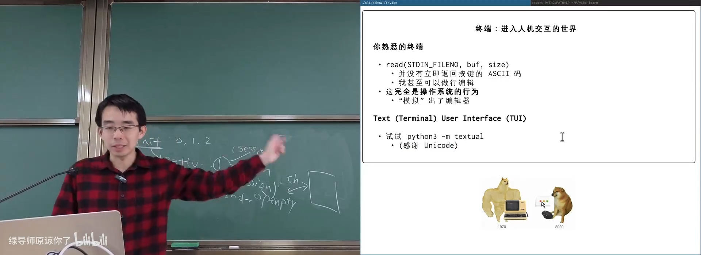

---

## 6. Ctrl-C、信号与前台进程

### 6.1 信号机制

应用程序可以注册信号处理器：

```c
signal(SIGINT, handler);
sigaction(...);
```

信号会在程序任意位置打断当前执行，并跳转到处理器。处理器可以：

- 清理资源后退出；
- 忽略信号；
- 设置标志继续执行；
- 改变程序状态。

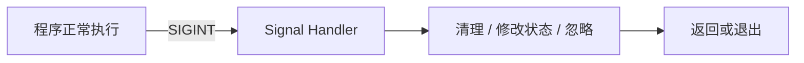
```mermaid
flowchart LR
    R["程序正常执行"] -->|"SIGINT"| H["Signal Handler"]
    H --> C["清理 / 修改状态 / 忽略"]
    C --> R2["返回或退出"]
```

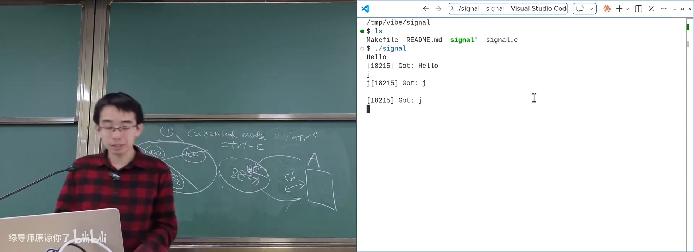

### 6.2 Ctrl-C 应该发送给谁？

一个终端上可能运行庞大进程树：

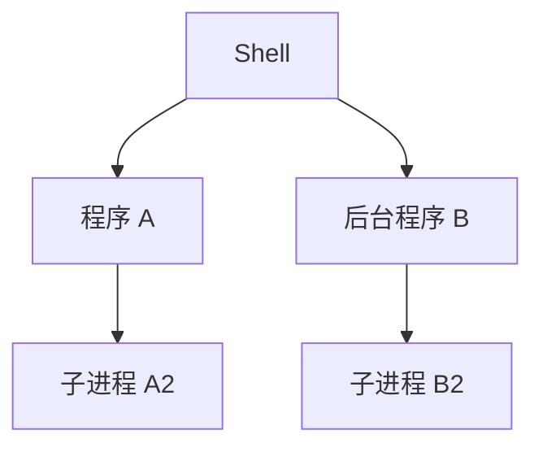
```mermaid
flowchart TD
    S["Shell"] --> P1["程序 A"]
    P1 --> P2["子进程 A2"]
    S --> P3["后台程序 B"]
    P3 --> P4["子进程 B2"]
```

如果简单地向进程树所有节点发送 `SIGINT`：

- 可能误伤后台任务；
- 可能因孤儿进程而找不到部分后代；
- 多终端和后台任务使父子关系不足以确定目标。

UNIX 引入两个额外分组：

- **Session**：最大的终端会话分组；
- **Process Group**：前台或后台任务分组。

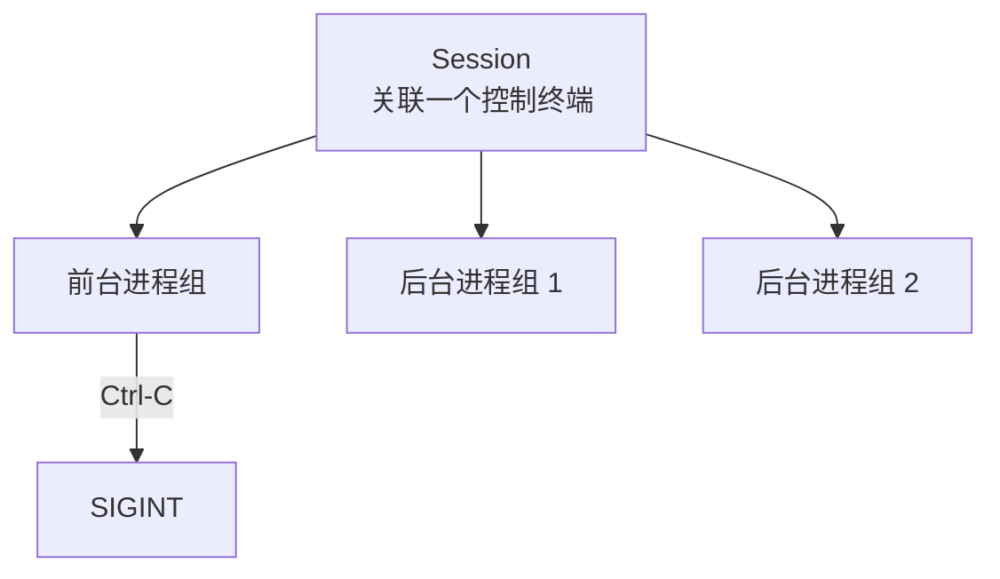
```mermaid
flowchart TD
    S["Session<br/>关联一个控制终端"] --> G1["前台进程组"]
    S --> G2["后台进程组 1"]
    S --> G3["后台进程组 2"]
    G1 -->|"Ctrl-C"| I["SIGINT"]
```

Ctrl-C 发送给前台进程组中的全部进程。后台进程组不会收到。

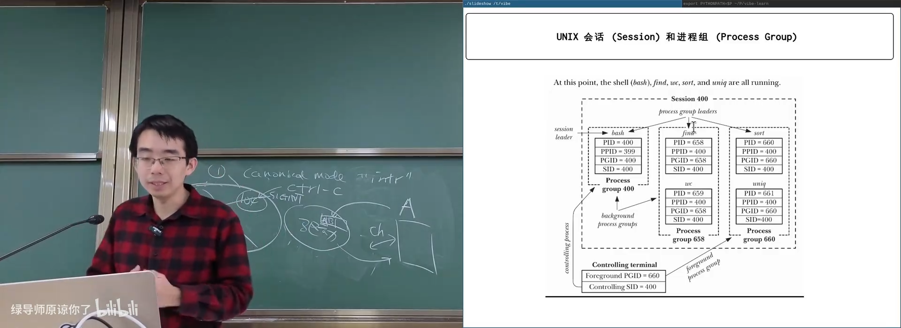

### 6.3 相关 API

```c
setsid();
getsid();
setpgid();
getpgid();
tcsetpgrp();
tcgetpgrp();
```

这些 API 不够优雅，但支撑了终端多任务：

- 创建或查询 Session；
- 设置 Process Group；
- 设置终端前台进程组。

系统复杂性还体现在 UID 演化：

- real UID；
- effective UID；
- saved UID。

这些都是历史与安全需求不断叠加的结果。

### 6.4 Job Control

终端中的 Job Control 类似窗口管理器：

| 图形界面 | Shell |
|---|---|
| 最小化 | `Ctrl-Z` |
| 恢复窗口 | `fg` |
| 后台继续 | `bg` |
| 查看窗口列表 | `jobs` |
| 关闭程序 | `Ctrl-C` / `kill` |

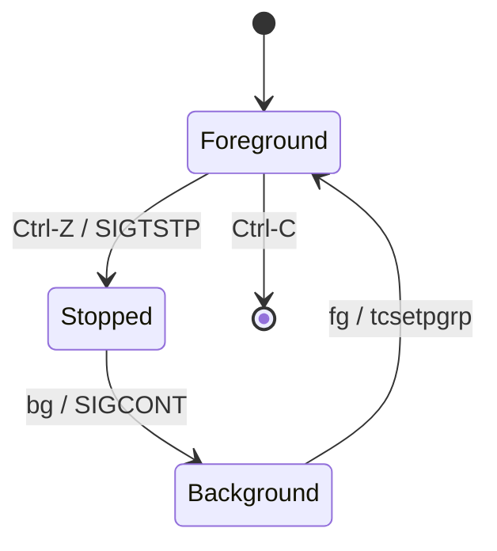
```mermaid
stateDiagram-v2
    [*] --> Foreground
    Foreground --> Stopped: Ctrl-Z / SIGTSTP
    Stopped --> Background: bg / SIGCONT
    Background --> Foreground: fg / tcsetpgrp
    Foreground --> [*]: Ctrl-C
```

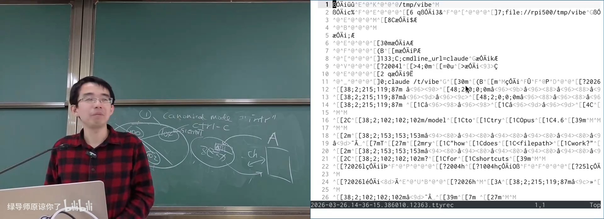

### 6.5 SIGHUP 与远程连接

Session 通常关联一个控制终端。Session Leader 退出或终端断开时，会话内进程可能收到：

```text
SIGHUP
```

这解释了为什么 SSH 断开后，远程长任务有时也会终止。

解决办法：

```bash
nohup long-task &
tmux
screen
```

也可以使用 systemd、容器或任务队列管理长期服务。

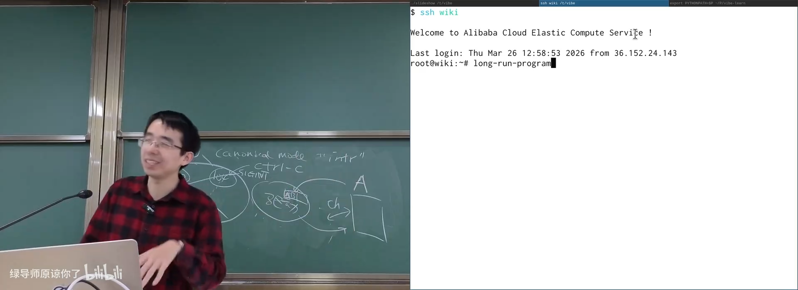

### 6.6 历史方案的现代替代

现代系统有多种隔离和管理进程的方法：

- tmux / Sway 管理多个 PTY；
- Android 为每个应用分配独立 UID；
- Snap 使用 AppArmor、seccomp、namespaces；
- 容器与虚拟机用整体生命周期管理所有进程。

这些方案说明：将进程绑定到设备的旧设计并非唯一答案，但在 POSIX 兼容生态中仍然必须实现。

---

## 7. UNIX Shell：一门编程语言

*(参考时间: 01:18:06)*

Shell 不只是“输入命令的地方”，它是一门极简的编程语言：

- 只有字符串数据类型；
- 支持文本替换；
- 支持顺序、逻辑与管道；
- 支持重定向；
- 支持变量、循环、条件；
- 支持命令替换与进程替换。

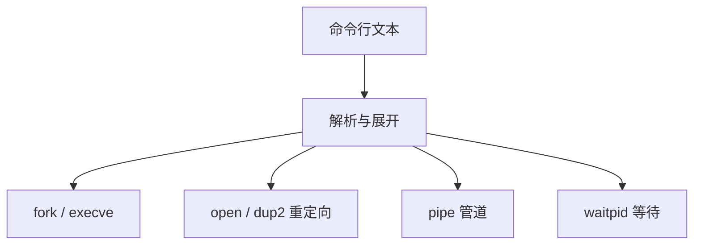
```mermaid
flowchart TD
    C["命令行文本"] --> P["解析与展开"]
    P --> F["fork / execve"]
    P --> R["open / dup2 重定向"]
    P --> Q["pipe 管道"]
    P --> W["waitpid 等待"]
```

### 7.1 只有一个 Shell 循环

最小 Shell 的模型接近：

```c
while (1) {
    print_prompt();
    read_command();
    execute_command();
}
```

如果暂时不考虑 Job Control，一个零依赖 Shell 可以只有几百行代码，直接建立在 `fork`、`execve`、`pipe`、`dup2` 和 `waitpid` 之上。

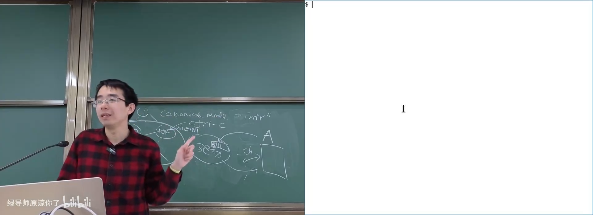

### 7.2 文本替换与命令替换

Shell 的核心是分阶段文本展开：

- 变量替换：`$HOME`
- 命令替换：`$(command)`
- 算术命令：`$((1 + 2))`
- 进程替换：`<(command)`、`>(command)`
- 通配符展开：`*.c`


```mermaid
flowchart LR
    T["原始命令文本"] --> V["变量替换"]
    V --> C["命令替换"]
    C --> G["通配符展开"]
    G --> W["拆分参数"]
    W --> E["执行命令"]
```

早期 Shell 没有整数类型，算术甚至需要调用外部 `expr`：

```bash
expr 1 + 2
```

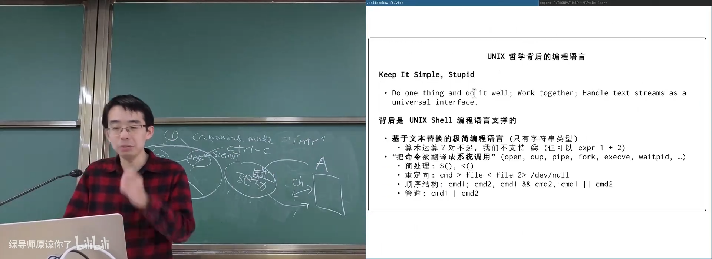

### 7.3 重定向

Shell 先由父进程打开文件，再让子进程继承描述符：

```c
int fd_in  = open(in,  O_RDONLY | O_CLOEXEC);
int fd_out = open(out, O_WRONLY | O_CREAT | O_TRUNC | O_CLOEXEC);

if (fork() == 0) {
    dup2(fd_in, 0);
    dup2(fd_out, 1);
    execve(...);
}
```

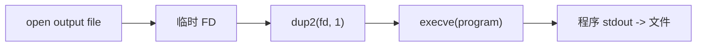
```mermaid
flowchart LR
    F["open output file"] --> FD["临时 FD"]
    FD --> D["dup2(fd, 1)"]
    D --> E["execve(program)"]
    E --> O["程序 stdout -> 文件"]
```

常见重定向：

```bash
cmd > file
cmd >> file
cmd < file
cmd 2> error.log
cmd > file 2>&1
```

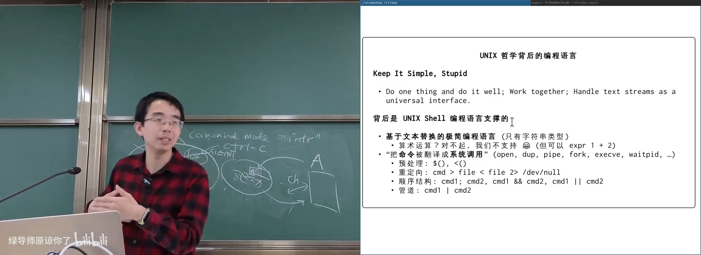

### 7.4 管道

Shell 管道的系统调用流程：

1. `pipe()`；
2. 创建左右两个子进程；
3. 左子进程关闭读端，把 stdout 指向写端；
4. 右子进程关闭写端，把 stdin 指向读端；
5. 分别 `execve`；
6. 父进程关闭两端并等待。

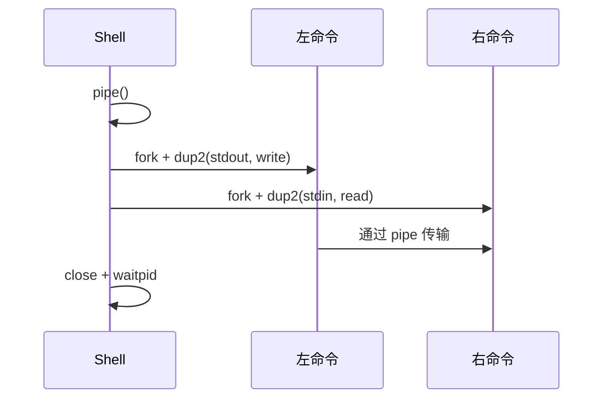
```mermaid
sequenceDiagram
    participant S as Shell
    participant L as 左命令
    participant R as 右命令
    S->>S: pipe()
    S->>L: fork + dup2(stdout, write)
    S->>R: fork + dup2(stdin, read)
    L->>R: 通过 pipe 传输
    S->>S: close + waitpid
```

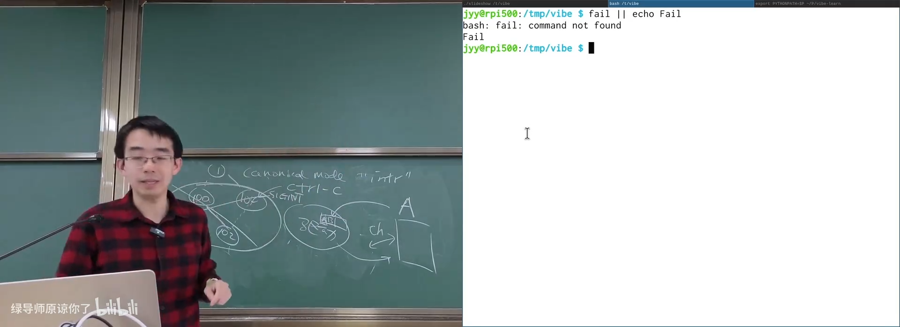

### 7.5 逻辑控制与短路

```bash
cmd1 && cmd2   # cmd1 成功才执行 cmd2
cmd1 || cmd2   # cmd1 失败才执行 cmd2
cmd1 ; cmd2    # 顺序执行
```

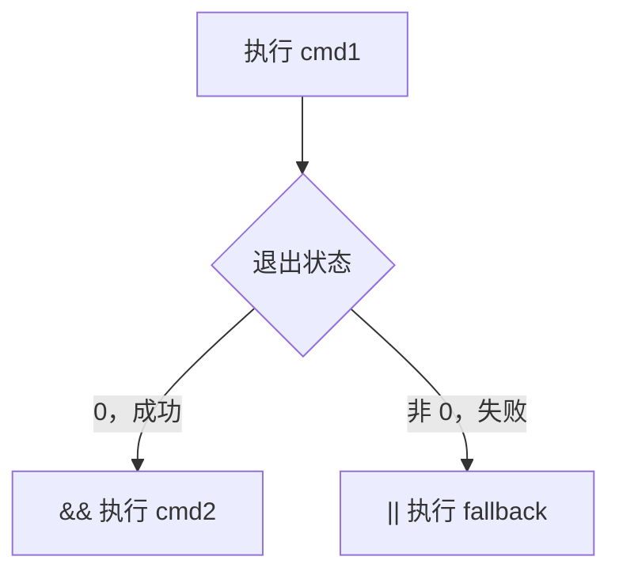
```mermaid
flowchart TD
    A["执行 cmd1"] --> S{"退出状态"}
    S -->|"0，成功"| B["&& 执行 cmd2"]
    S -->|"非 0，失败"| C["|| 执行 fallback"]
```

### 7.6 Shell 的缺点

Shell 是 1970 年代算力和工程能力下的折中：

- 没有强类型；
- 空格、引号和文件名容易导致解析问题；
- 不同 Shell 对边缘语法行为不同；
- 复杂逻辑很快变得难以维护；
- `sudo echo > file` 不生效，因为重定向由当前 Shell 完成，而不是 `sudo` 程序完成。

示例：

```bash
sudo echo hello > /etc/a.txt
```

Shell 会先以当前用户权限打开 `/etc/a.txt`，所以重定向仍然失败。

正确思路是让拥有权限的程序处理整个写入流程，或使用支持直接写文件的工具。

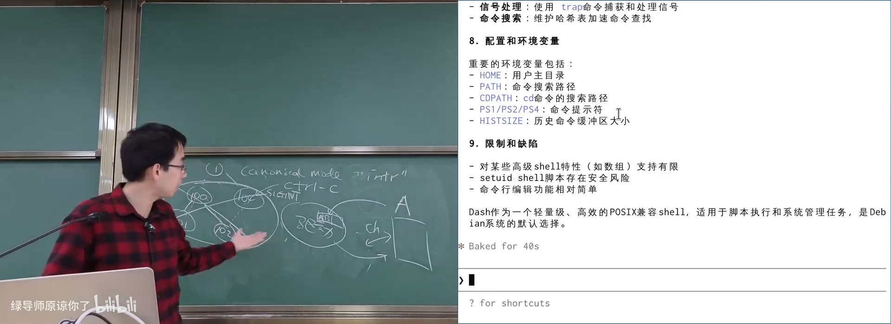

### 7.7 阅读手册仍然是获得想象力的来源

```bash
man -P cat sh | claude "Make a comprehensive summary"
```

AI 可以快速总结手册，但人的目标仍是建立“什么事情可以做到”的完整概念。Shell 手册中的特殊参数、循环、重定向和 Job Control 都能扩展想象空间。

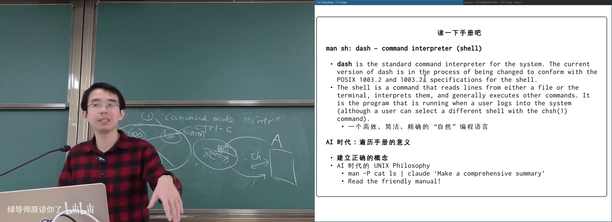

### 7.8 Shebang

脚本以：

```text
#!/bin/sh
```

开头时，内核会读取第一行，执行指定解释器，并把脚本路径作为参数传入。

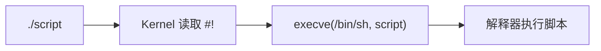
```mermaid
flowchart LR
    X["./script"] --> K["Kernel 读取 #!"]
    K --> I["execve(/bin/sh, script)"]
    I --> R["解释器执行脚本"]
```

Shebang 使文本文件成为可直接执行的脚本，是 UNIX 组合哲学的重要组成部分。

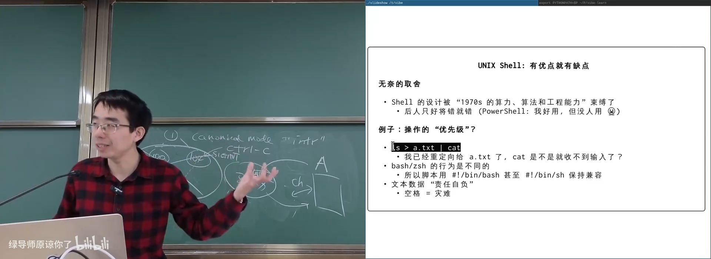

---

## 8. 一个零依赖 UNIX Shell

XV6 等项目提供了极小 Shell 实现：

- 不依赖 libc；
- 使用 `-ffreestanding` 编译；
- 直接链接系统调用接口；
- 支持重定向、管道、后台执行和命令组合。

它证明：

> Shell 是 Kernel 之外的“壳”，而整个 Shell 应用世界可以只建立在少量系统调用之上。

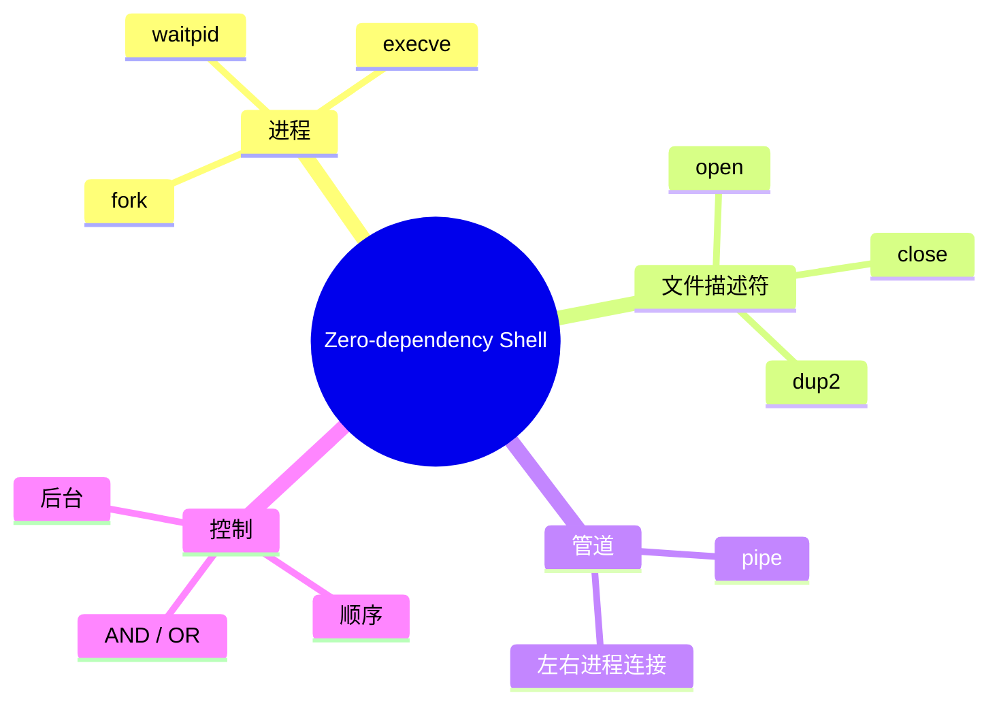
```mermaid
mindmap
  root((Zero-dependency Shell))
    进程
      fork
      execve
      waitpid
    文件描述符
      open
      close
      dup2
    管道
      pipe
      左右进程连接
    控制
      顺序
      AND / OR
      后台
```


---

## 9. 本讲总结

1. 终端的历史来自管风琴、打字机和电传打字机。
2. `CR`、`LF`、`Shift`、`Tab` 都保留打字机语义。
3. TTY 是 Teletypewriter 缩写。
4. ASCII 控制字符最初为电传设备设计。
5. VT100 和 ANSI Escape Sequence 奠定现代终端。
6. Unicode 让终端可以绘制复杂字符界面。
7. `Ctrl-C` 在 raw mode 下只是字节 `0x03`。
8. canonical mode 由终端驱动执行行编辑和回显。
9. PTY 让系统可以创建任意数量的虚拟终端。
10. 信号允许外部事件打断程序并跳转到处理函数。
11. Ctrl-C 向前台进程组发送 `SIGINT`。
12. Session 和 Process Group 解决“谁属于同一个终端任务”的问题。
13. Job Control 用 `Ctrl-Z`、`bg`、`fg` 模拟终端窗口管理器。
14. Session 断开可能发送 `SIGHUP`。
15. Shell 是一门以字符串和文本替换为核心的编程语言。
16. 重定向、管道和逻辑控制最终都被翻译成系统调用。
17. `sudo echo > file` 失败是 Shell 和权限边界共同作用的结果。
18. 零依赖 Shell 展示了系统调用如何支撑整个应用生态。

> 终端只交换字符。  
> 所有复杂的输入编辑、信号、任务控制与 Shell 语法，都是建立在这些字符之上的系统设计。

---

## 附：官方参考与延伸阅读

课程与讲义：

- [《操作系统原理》2026 课程主页](https://jyywiki.cn/OS/2026/)
- [第 8 讲讲义：终端和 UNIX Shell](https://jyywiki.cn/OS/2026/lect8.md)
- [本讲视频](https://jyywiki.cn/OS/2026/video/BV1nQXsBuEUz/)

历史与终端资料：

- [机械键盘与击奏弦鸣乐器演示](https://www.bilibili.com/video/BV1Zg411P7GQ/)
- [Teletype Model 28 Technical Data Sheet](http://www.samhallas.co.uk/repository/telegraph/teletype_28_tech_data.pdf)
- [Powerline Status Bar](https://github.com/powerline/powerline)
- [Google A2UI](https://a2ui.org/)

课程演示：

- [理解终端](https://jyywiki.cn/OS/demos/virtualization/tty)
- [信号处理](https://jyywiki.cn/OS/demos/virtualization/signal)
- [Shebang](https://jyywiki.cn/OS/demos/virtualization/shebang)

标准与阅读材料：

- [Setuid Demystified](https://www.usenix.org/conference/11th-usenix-security-symposium/setuid-demystified)
- POSIX `sh` 手册：`man 1 sh`
- `man 2 setsid`
- `man 2 setpgid`
- `man 3 tcsetpgrp`
- `man 7 signal`
- `man 4 tty`
- `man 4 pts`
- `man 2 ioctl_tty`

> **版权说明**：课程讲义与幻灯片的著作权归蒋炎岩所有，采用 Creative Commons BY-NC 4.0 许可。电子书正文为课堂内容的书面化重构，脚本占位符已替换为视频画面或官方资料渲染图；引用与来源链接均保留在本页。
