# C 标准库原理：在系统调用之上搭起第一层应用世界

> **课程**：2026 春季学期《操作系统原理》  
> **讲师**：蒋炎岩（jyy）  
> **官方课程主页**：<https://jyywiki.cn/OS/2026/>  
> **官方讲义**：<https://jyywiki.cn/OS/2026/lect9.md>  
> **视频来源**：[Bilibili BV1GHXCBkEZf](https://www.bilibili.com/video/BV1GHXCBkEZf/)  
> **版权说明**：课程讲义与幻灯片归蒋炎岩所有，采用 [Creative Commons BY-NC 4.0](http://creativecommons.org/licenses/by-nc/4.0/) 许可；本电子书是对课堂讲授的书面化重构，保留出处与许可说明。

## 导语：从只有系统调用的世界出发

*(参考时间: 00:00)*

前面的课程已经建立了一个足够小的程序世界：程序拥有寄存器和内存，可以执行指令；除此之外，几乎所有与外部世界的交互，都要经过系统调用。

这条路线可以概括为：

- 进程管理 API：`fork`、`execve`、`exit`；
- 内存管理 API：`mmap`、`munmap`、`mprotect`；
- 对象访问 API：`open`、`read`、`write`、`lseek`；
- UNIX 暴露出来的对象：文件、管道、`/proc`、终端和其他资源。

从理论上说，只掌握这些接口，就足以写出应用软件。可是从工程实践看，如果每次都直接拿系统调用来拼装程序，开发体验会非常糟糕。例如打印一个字符串，可能要反复调用 `write`；处理文件本地缓冲、错误信息、格式化和进程退出，也要在每个程序里重复实现。

应用生态需要复用，而第一个大规模复用层就是 **C 语言标准库（libc）**。

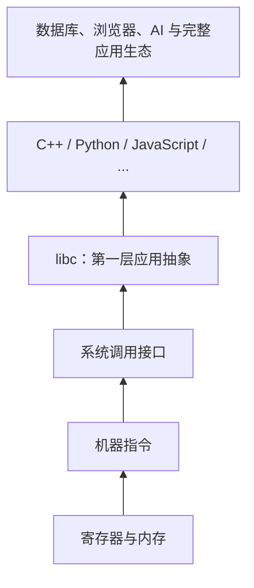
```mermaid
flowchart BT
    A["寄存器与内存"] --> B["机器指令"]
    B --> C["系统调用接口"]
    C --> D["libc：第一层应用抽象"]
    D --> E["C++ / Python / JavaScript / ..."]
    E --> F["数据库、浏览器、AI 与完整应用生态"]
```

这一讲的目标不是罗列所有 libc 函数，而是沿着 musl libc 的实现，观察标准化接口如何从机器、ABI、系统调用和进程运行环境中生长出来。

---

## 1. C 的完全体：计算模型与 FFI

### 1.1 SimpleC 只描述了计算

*(参考时间: 00:09)*

课程前面定义过一种简化的 C 模型。任意 C 程序都可以被整理成较为规则的形式：

- 赋值、条件、循环和函数调用；
- 指针、数组和结构体是内存与地址的直接操作；
- 控制流最终可以转换为跳转、寄存器腾挪和 load/store。

因此，SimpleC 可以较直接地翻译成 x86-64、AArch64 或 RISC-V 汇编。它很好地描述了“计算”，却没有完整描述 C 与世界交互的能力。

### 1.2 Foreign Function Interface

C 的完全体还需要 **Foreign Function Interface，FFI**：跨越语言和二进制边界调用其他代码的能力。

在 C 中有两条典型路径：

1. 直接链接由汇编或其他语言实现的函数；
2. 在 C 源码中嵌入内联汇编。

Python 也有同样的现实。Python 的 `mmap` 模块最终要落到系统调用；CPython 本身由 C 实现，因此 Python 与 C 之间可以相互调用。语言之间的 FFI 让高层应用能够复用底层实现。


```mermaid
flowchart LR
    A["C 源码"] --> B["声明外部函数"]
    B --> C["链接器解析符号"]
    C --> D["汇编 / 其他语言实现"]
    D --> E["ABI 约定寄存器、栈与返回值"]
    E --> F["函数调用成功"]
```

### 1.3 ABI 是跨语言调用的合同

在 x86-64 System V ABI 中，前几个整数参数通常放在 `rdi`、`rsi`、`rdx`、`rcx`、`r8`、`r9`，返回值放在 `rax`。栈上还会有返回地址、保存的寄存器和超出寄存器数量的参数。

C 和汇编只要共同遵守 ABI，就能互相调用。

```c
/* 汇编实现只要符合 ABI，C 侧就可以像普通函数一样声明。 */
extern int add(int x, int y);
```

```asm
; x86-64 System V 示例
add:
    mov eax, edi
    add eax, esi
    ret
```

系统调用本身也是通过这条路径进入的。`fork`、`pipe` 等 C 函数最终可能落到一小段执行特定系统调用指令的汇编代码上。

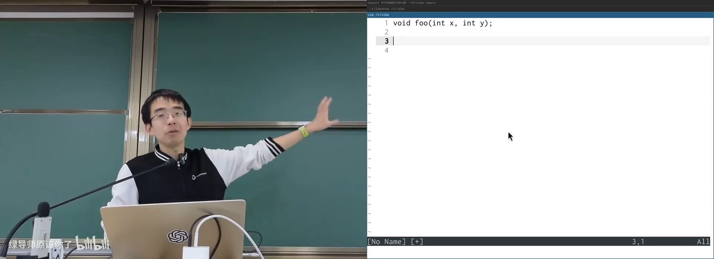

### 1.4 内联汇编：必要但危险

*(参考时间: 00:13)*

内联汇编可以直接在 C 中写目标平台指令。一个最小示例是在 `_start` 中直接执行 Linux x86-64 的 `exit` 系统调用：

```c
void _start(void) {
    __asm__(
        "mov $60, %eax\n"   /* syscall: exit */
        "xor %edi, %edi\n"  /* status: 0 */
        "syscall"
    );
}
```

这段代码在 x86-64 Linux 上可以工作，但原样拿到 AArch64 上会失败，因为嵌入的字符串会原封不动交给汇编器，而不同指令集并不认识这条指令。

GCC 扩展内联汇编的语法大致由五部分组成：

```text
Instructions : Outputs : Inputs : Clobbers : GotoLabels
```

它之所以复杂，是因为最初希望：

- 保持 C 语法解析器兼容，把汇编放在字符串里；
- 允许汇编引用 C 作用域里的变量；
- 允许把汇编结果写回 C 变量；
- 允许指定输出、输入、可读写的操作数和被破坏的寄存器；
- 与编译器的寄存器分配及优化协同。

例如：

```c
int a = 7, b = 5, result;

__asm__(
    "leal (%1,%1,4), %0"  /* result = a * 5 */
    : "=r" (result)       /* output operand */
    : "r" (a)             /* input operand */
);

printf("%d * %d = %d\n", a, b, result);
```

问题在于，编译器只负责外围约束，不会真正理解字符串内部汇编的语义。如果一段内联汇编破坏了寄存器却没有写入 clobber 列表，程序可能今天看起来完全正常，等编译器升级、优化策略改变后突然出错。

讲师提到，2019 年曾试图研究内联汇编误用问题，结果相关工作被别人先发表。到了 AI 时代，这种需要大量细节记忆的工作，已经越来越适合交给模型处理；但理解 FFI 与 ABI 的概念仍然重要。

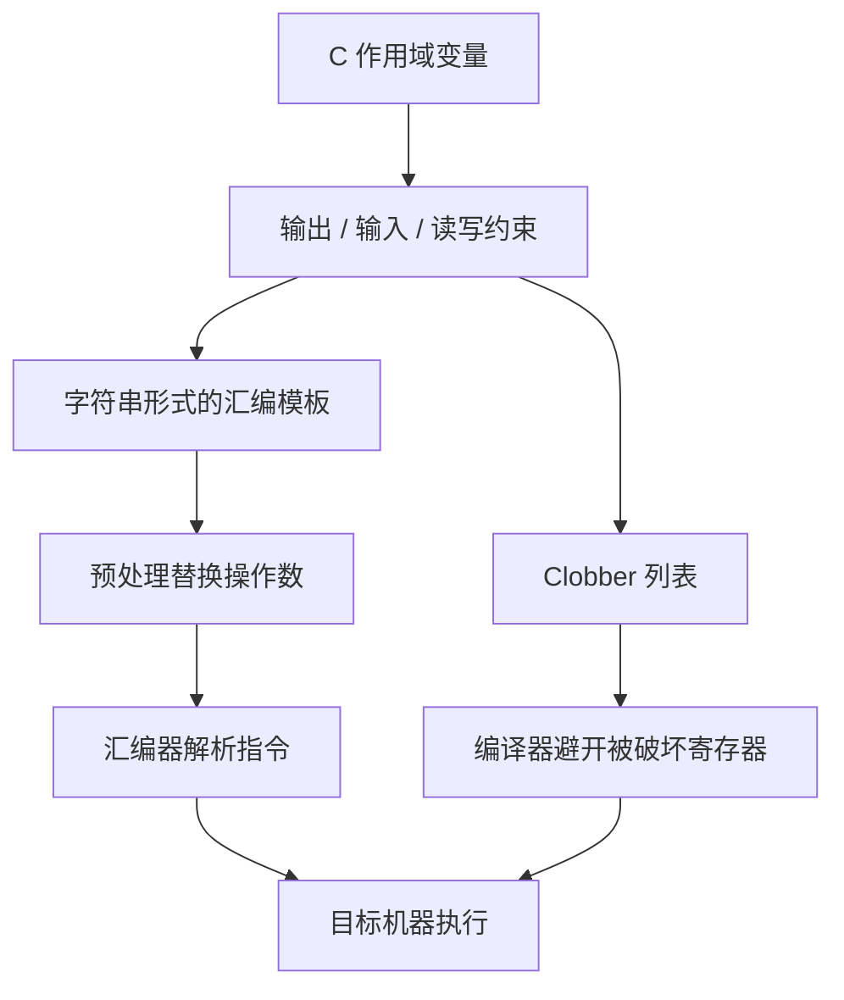
```mermaid
flowchart TD
    A["C 作用域变量"] --> B["输出 / 输入 / 读写约束"]
    B --> C["字符串形式的汇编模板"]
    C --> D["预处理替换操作数"]
    D --> E["汇编器解析指令"]
    E --> F["目标机器执行"]
    B --> G["Clobber 列表"]
    G --> H["编译器避开被破坏寄存器"]
    H --> F
```

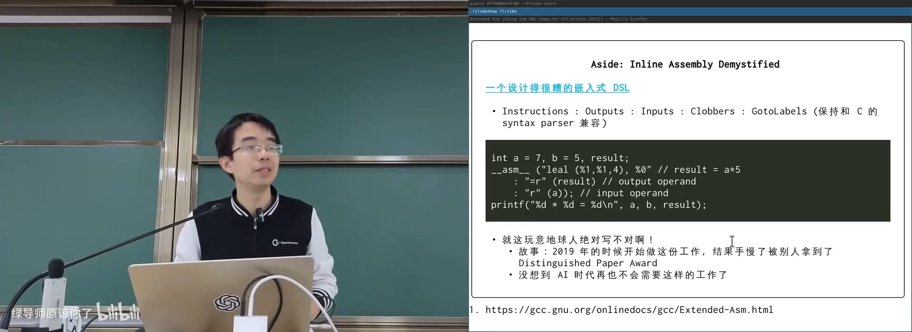

### 1.5 层层累积的应用生态

*(参考时间: 00:23)*

SimpleC 提供计算，FFI 提供跨越边界的调用能力；两者相加，已经足以实现操作系统和应用生态中的任何东西。

计算机软件的历史也是一层层累积抽象的历史：

- 1950 年代：主要直接使用汇编和打孔纸；
- 1960 年代以后：C、Pascal 与结构化程序设计逐渐普及；
- 1970 年代：在 UNIX 上用 C 写程序，成为可移植应用的重要起点；
- 2010 年代：C 仍很强，但大量应用转向 Python、Java、JavaScript；
- 2026 年：自然语言成为新的编程入口，但底座仍然是机器、系统调用与 C/UNIX 构建出的抽象层。

这像一颗洋葱，或者一座不断加高的建筑：

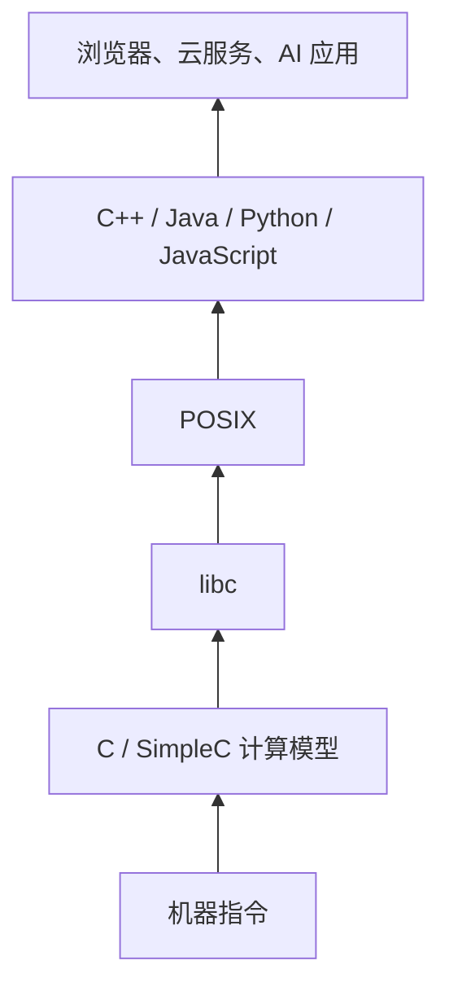
```mermaid
flowchart BT
    A["机器指令"] --> B["C / SimpleC 计算模型"]
    B --> C["libc"]
    C --> D["POSIX"]
    D --> E["C++ / Java / Python / JavaScript"]
    E --> F["浏览器、云服务、AI 应用"]
```

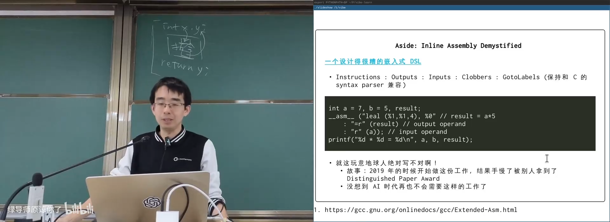

---

## 2. 标准化的力量

### 2.1 ISO C：稳定而广泛的可移植层

*(参考时间: 00:25)*

C 语言遵循 ISO C 标准。标准本身不是为了限制实现者，而是让大家能够在一个稳定、共同的语义体系中交流。

它的价值体现在：

- 不必在升级实现时频繁担心语义破坏；
- 同一份符合标准的代码可以跨处理器、操作系统和设备；
- 只使用标准中最小的可移植部分时，程序可以运行在服务器、超级计算机、手表、手环乃至只有很小内存的设备上。

当然，可移植性需要开发者配合。例如不能默认 `int` 永远是 4 字节：

```c
/* 不可移植：假设 int 的宽度固定。 */
unsigned int x = 0xffffffffu;

/* 更明确：使用具有固定宽度的类型。 */
#include <stdint.h>
uint32_t y = UINT32_C(0xffffffff);
```

### 2.2 POSIX：让 UNIX 风格接口可复用

ISO C 之上还有 POSIX。`unistd.h` 中的 `fork`、`pipe`、`execve` 等接口及其行为，由 POSIX 标准规定。

几乎所有具备一定复杂性的通用操作系统，都至少需要：

1. 一个 C 编译器，能够编译别人写出的程序；
2. 一定程度的 POSIX 兼容层，让常见命令行工具和应用程序可以迁移运行。

Android、OpenHarmony 等系统分别使用 Toybox、BusyBox 一类工具集，它们在 C 与 POSIX 接口上实现了许多核心命令。C 的声音因此遍布各种设备，即使最终用户不再直接用 C 编程。

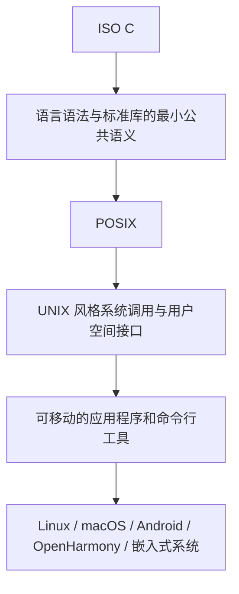
```mermaid
flowchart TD
    A["ISO C"] --> B["语言语法与标准库的最小公共语义"]
    B --> C["POSIX"]
    C --> D["UNIX 风格系统调用与用户空间接口"]
    D --> E["可移动的应用程序和命令行工具"]
    E --> F["Linux / macOS / Android / OpenHarmony / 嵌入式系统"]
```

### 2.3 为什么选择 musl libc

*(参考时间: 00:29)*

系统通常自带 glibc。也可以下载调试符号，直接单步调试 glibc 的每一行。但 glibc 有沉重的历史包袱和大量针对不同平台、指令集的优化，这些优化对初学者理解“原理”反而是噪音。

讲师让 AI 推荐更适合学习的 libc，结果是 **musl**。musl 代码相对现代、整洁，并基于 Linux API 实现；把 musl 编译成带调试信息的静态版本后，可以非常清楚地观察：

- 头文件中的类型和宏；
- 字符串、内存和随机数函数；
- `stdio` 对文件描述符的封装；
- `printf` 的解析核心；
- `setjmp`、`longjmp`；
- `errno` 与 `perror`；
- 环境变量初始化；
- C Runtime 的入口和退出。

讲师用 AI 和编译器生成了一份可用于调试的 `musl-gcc`，再把最小程序编译成静态可执行文件，以便从第一条指令开始追踪 libc。

```bash
# 示意：用带调试信息的 musl 工具链编译静态程序
musl-gcc -g3 -O1 -static demo.c -o demo

# 查看头文件展开后的结果
musl-gcc -E inttypes_demo.c

# 使用调试器观察 libc 内部
gdb ./demo
```

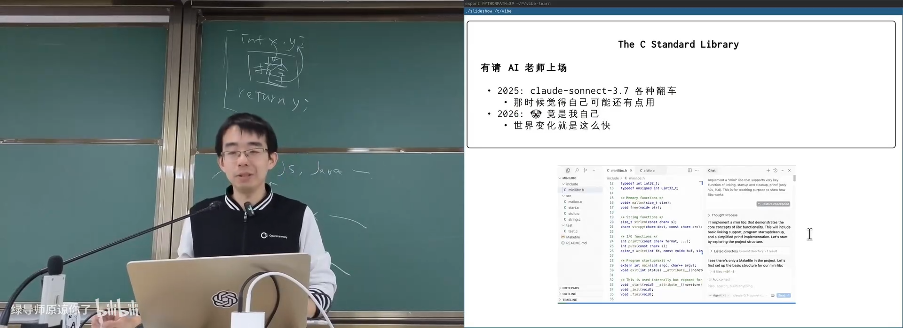

### 2.4 从第一条指令开始调试

这份 musl 环境让课堂能够把“一个最简单的 C 程序”拆到指令、寄存器和系统调用的粒度。`main` 并不是程序真正执行的第一条指令，`printf` 也不是魔法，环境变量不是凭空出现的。

整条路线可以简化为：


```mermaid
flowchart LR
    A["ELF entry"] --> B["_start"]
    B --> C["__libc_start_main"]
    C --> D["__init_libc"]
    D --> E["main(argc, argv, envp)"]
    E --> F["exit"]
    F --> G["执行 atexit handlers"]
    G --> H["flush stdio buffers"]
    H --> I["exit system call"]
```

---

## 3. Freestanding 环境：不依赖操作系统的 C

*(参考时间: 00:36:55)*

C 程序通常有两种执行环境：

- **Hosted**：有完整标准库，也可以使用操作系统服务；
- **Freestanding**：不默认依赖宿主操作系统，只提供语言核心和少量头文件。

在 freestanding 环境中，不能假设 `putchar`、`exit`、`fopen` 或文件描述符存在。操作系统内核、裸机固件和引导程序通常需要这种模型。C 仍然可以借助内联汇编访问硬件，但不会把普通 C 程序直接变成“无需操作系统的程序”。

### 3.1 机器与平台定义

Freestanding C 仍然提供许多与机器直接相关的常量、类型和宏：

- `stddef.h`：`size_t`、`ptrdiff_t`、`NULL`、`offsetof`；
- `float.h`：浮点数范围、精度和表示特性；
- `limits.h`：整数和字符类型范围；
- `stdint.h`：固定宽度和最小宽度整数类型；
- `inttypes.h`：固定宽度整数的格式化宏。

例如，`int` 和 `long` 的宽度与机器字长相关：

- 32 位机器上，`long` 通常是 4 字节；
- 64 位机器上，`long` 通常是 8 字节；
- `int32_t`、`uint64_t` 则提供明确的固定宽度语义。

如果直接使用 `printf`，很容易写出错误的格式：

```c
long value = 42;

printf("%d\n", value);  /* 错误：long 不一定是 int */
printf("%ld\n", value); /* 正确，但 long 的宽度仍随平台变化 */
```

固定宽度整数需要 `inttypes.h` 提供的格式宏：

```c
#include <inttypes.h>
#include <stdint.h>
#include <stdio.h>

int64_t i = INT64_C(-123456789);
uint64_t u = UINT64_C(123456789);
uintptr_t p = (uintptr_t)&i;

printf("i = %" PRId64 "\n", i);
printf("u = %" PRIu64 "\n", u);
printf("p = 0x%" PRIxPTR "\n", p);
```

在预处理后，`PRId64` 一类宏会展开为平台对应的实际格式串片段。C 的字符串字面量相邻拼接规则让这种间接构造可以正常工作：

```c
"value = %" PRId64 "\n"
```

这说明语言机制、预处理、标准库设计是环环相扣的。

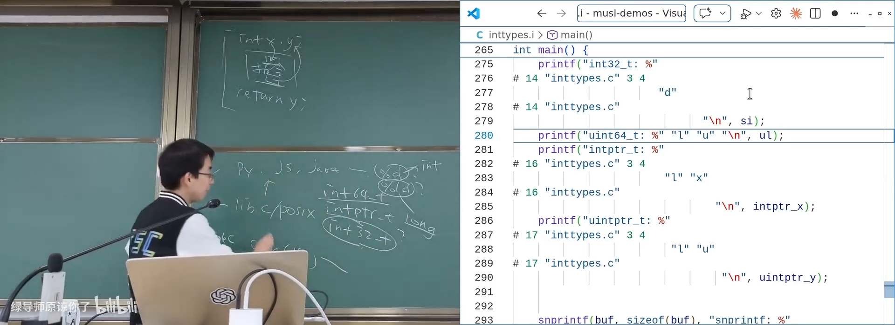

### 3.2 `offsetof`：把地址当计算

`offsetof(T, member)` 可以给出结构体成员相对对象头部的偏移。一个典型实现思路是：

```c
#define offsetof(TYPE, MEMBER) \
    ((size_t)&(((TYPE *)0)->MEMBER))
```

这里并不是真的要解引用空指针，而是构造一个“地址为 0 的对象”的成员地址，再把地址转换为整数。编译器也可以使用内建能力实现它。

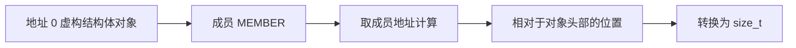
```mermaid
flowchart LR
    Z["地址 0 虚构结构体对象"] --> A["成员 MEMBER"]
    A --> B["取成员地址计算"]
    B --> C["相对于对象头部的位置"]
    C --> D["转换为 size_t"]
```

### 3.3 可变参数与 `stdarg.h`

*(参考时间: 00:43:30)*

`printf("...", 1, 2, 3, ...)` 可以接收数量不固定的参数。传统 32 位 x86 调用约定把参数主要放在栈上，可以把第一个参数后面的地址视为参数数组。但在 x86-64、AArch64 等现代体系结构上，大部分参数通过寄存器传递，这个简单做法不再成立。

编译器、ABI 与标准库必须协作：当函数包含可变参数时，为 `va_list`、`va_start`、`va_arg` 等宏准备足够的信息，让它们能够逐个读取参数。

```c
#include <stdarg.h>

long sum(int count, ...) {
    va_list ap;
    long total = 0;

    va_start(ap, count);
    for (int i = 0; i < count; ++i) {
        total += va_arg(ap, int);
    }
    va_end(ap);

    return total;
}
```

真正复杂的地方不在循环，而在 ABI：寄存器参数、栈参数、浮点参数和对齐规则都可能不同。

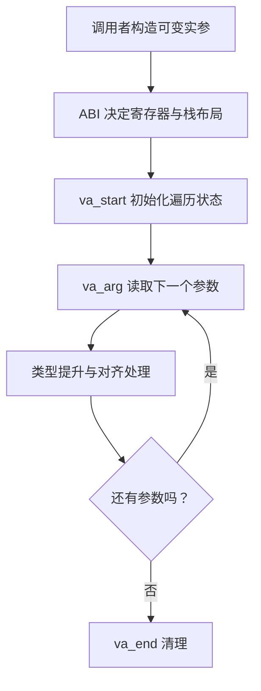
```mermaid
flowchart TD
    A["调用者构造可变实参"] --> B["ABI 决定寄存器与栈布局"]
    B --> C["va_start 初始化遍历状态"]
    C --> D["va_arg 读取下一个参数"]
    D --> E["类型提升与对齐处理"]
    E --> F{"还有参数吗？"}
    F -- "是" --> D
    F -- "否" --> G["va_end 清理"]
```

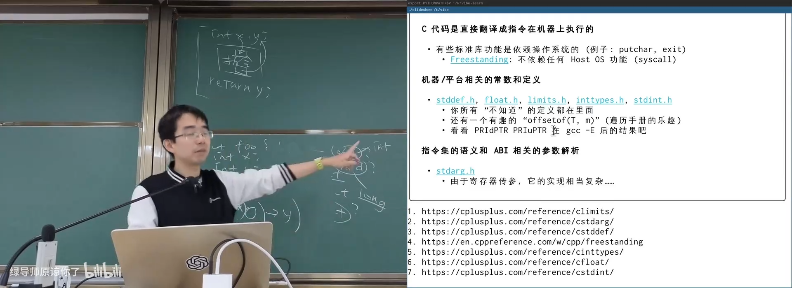

---

## 4. 随手可以实现的函数，以及真正困难的部分

### 4.1 字符串、内存与随机数

*(参考时间: 00:45)*

`string.h` 中很多函数看起来像 C 初学者的课后练习：

```c
void *memcpy(void *dest, const void *src, size_t n);
void *memmove(void *dest, const void *src, size_t n);
char *strcpy(char *dest, const char *src);
```

它们的接口容易理解，但要与不同机器上的向量指令、对齐规则和性能要求结合，实现并不简单。

`stdlib.h` 中的随机数函数也有一个常见误解：

```c
#include <stdlib.h>

srand(1234);
int a = rand();

srand(1234);
int b = rand();

/* a == b：相同种子产生相同序列。 */
```

`rand` 不是不可预测的熵源，而是一个由种子决定的伪随机数生成器。它本质上是数学函数或确定性状态机。

### 4.2 `qsort` 为什么难用

*(参考时间: 00:46)*

通用排序函数的接口是：

```c
void qsort(void *base, size_t nmemb, size_t size,
           int (*compar)(const void *, const void *));
```

C 缺少模板、泛型和闭包这类机制，为了排序任意元素，只能：

- 用 `void *` 抹掉类型；
- 用字节大小计算元素地址；
- 要求调用者提供比较函数；
- 在必要时通过全局变量传递上下文。

如果在 C++ 或 Python 中，开发者通常会使用模板、比较器或结构体，接口可读性更好。`qsort` 是可以工作的，但它清楚地展示了 C 作为“高级汇编语言”时，抽象能力与可读性之间的取舍。

### 4.3 `math.h` 与 NaN

浮点数并不等同于数学实数。考虑下面这个值：

```c
#include <math.h>

double a = NAN;
```

对它执行比较时会出现：

```c
(a > a) == false
(a < a) == false
(a == a) == false
```

满足“不大于自己、不小于自己，也不等于自己”的数是 **NaN**，即 Not a Number。它来自 IEEE 754 的特殊值编码，也会出现在量化、浮点精度、特殊运算和异常传播中。

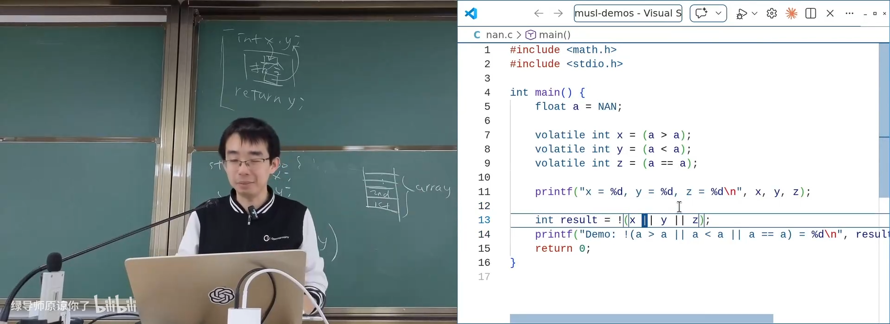

---

## 5. `setjmp` / `longjmp`：栈上的长跳转

*(参考时间: 00:48:30)*

### 5.1 回到 SimpleC 的栈

SimpleC 的执行模型可以概括为：

```text
pc = stack[-1].PC
stack[-1].PC.next()
inst[pc].execute()
```

每次函数调用都会在栈上放入新的栈帧，每个栈帧带有当前执行位置。函数返回时，弹出栈顶帧。

`setjmp` 和 `longjmp` 对这个模型做了一次很有意思的改造：

- `setjmp(buf)` 把当前栈深度和返回位置记录到 `buf` 中；
- 正常执行时，`setjmp` 返回 `0`；
- 之后可以继续调用任意层函数；
- `longjmp(buf, value)` 直接丢弃中间所有栈帧，回到 `setjmp` 记录的位置；
- `longjmp` 传入的 `value` 会成为 `setjmp` 第二次返回的值；如果传入 `0`，标准要求改为返回非零值。

```c
#include <setjmp.h>
#include <stdio.h>

static jmp_buf checkpoint;

static void second(void) {
    puts("inside second");
    longjmp(checkpoint, 42);
}

static void first(void) {
    puts("inside first");
    second();
    puts("unreachable after longjmp");
}

int main(void) {
    int value = setjmp(checkpoint);
    if (value == 0) {
        puts("setjmp returns 0");
        first();
    } else {
        printf("longjmp returns %d\n", value);
    }
    return 0;
}
```

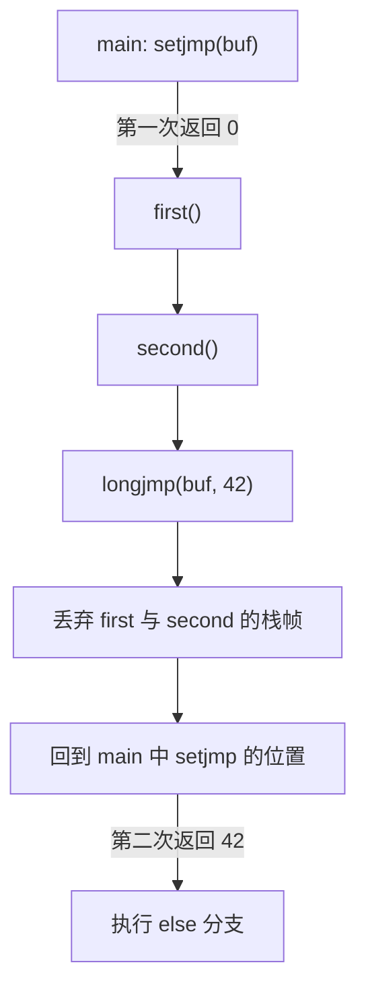
```mermaid
flowchart TD
    A["main: setjmp(buf)"] -->|"第一次返回 0"| B["first()"]
    B --> C["second()"]
    C --> D["longjmp(buf, 42)"]
    D --> E["丢弃 first 与 second 的栈帧"]
    E --> F["回到 main 中 setjmp 的位置"]
    F -->|"第二次返回 42"| G["执行 else 分支"]
```

### 5.2 大型 `goto` 与资源清理

函数内部的 `goto` 只能在同一函数中跳转。`setjmp` / `longjmp` 则像一个大号的跨函数 `goto`。

它适合处理复杂资源清理：

```c
int operation(void) {
    int ret = -1;
    Resource *a = acquire_a();
    Resource *b = acquire_b();

    if (!a || !b) {
        goto cleanup;
    }

    if (do_work(a, b) != 0) {
        goto cleanup;
    }

    ret = 0;

cleanup:
    release_b(b);
    release_a(a);
    return ret;
}
```

`longjmp` 能把“跳到统一清理点”扩展到多层函数。它不需要额外的系统调用，主要由编译器生成正确的寄存器和控制流保存代码。

讲师用“拆帐篷”作比喻：在宿舍先记录一个位置，然后去教学楼、逸夫楼、食堂；做完一系列事情后执行 `longjmp`，不管中间经历了什么，历史栈全部清掉，直接回到当初标记的位置，同时带走一个返回值。


```mermaid
flowchart LR
    A["标记：宿舍"] --> B["第一层：教学楼"]
    B --> C["第二层：逸夫楼"]
    C --> D["第三层：食堂"]
    D --> E["longjmp：直接回宿舍"]
    E --> F["携带返回值恢复现场"]
```

这项能力也会在实验和协程实现中发挥重要作用。

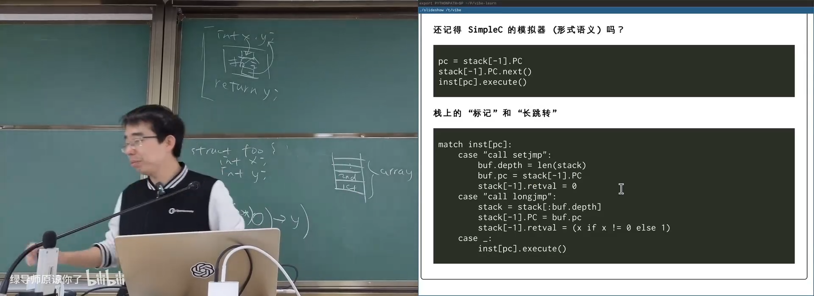

---

## 6. 系统调用封装：`stdio` 与文件描述符

*(参考时间: 00:55:46)*

### 6.1 `FILE *` 背后是文件描述符

C 标准 I/O 与 UNIX 文件接口存在明显的对应关系：

| C 标准 I/O | UNIX / 系统调用层 |
| --- | --- |
| `fopen` | `open` |
| `fread` | `read` |
| `fwrite` | `write` |
| `fseek`、`ftell` | `lseek` |
| `fclose` | `close` |

`FILE *` 并不是操作系统对象本身，而是 libc 在用户空间维护的一层结构。它内部至少包含：

- 文件描述符；
- 读写缓冲区；
- 当前缓冲指针与剩余字节数；
- 错误状态和 EOF 状态；
- 当前偏移与缓冲状态；
- 一组 `read`、`write`、`seek`、`close` 函数指针。

```c
typedef struct _IO_FILE FILE;

FILE *fp = fopen("data.bin", "rb");
char buffer[4096];

size_t n = fread(buffer, 1, sizeof(buffer), fp);
/* fread 可能在用户空间缓冲，底层再调用 read。 */

fclose(fp);
```

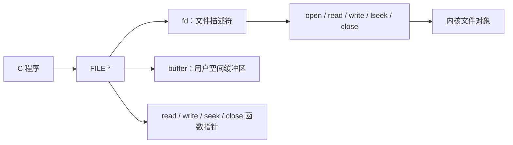
```mermaid
flowchart LR
    A["C 程序"] --> B["FILE *"]
    B --> C["fd：文件描述符"]
    B --> D["buffer：用户空间缓冲区"]
    B --> E["read / write / seek / close 函数指针"]
    C --> F["open / read / write / lseek / close"]
    F --> G["内核文件对象"]
```

musl 的 `FILE` 结构比 glibc 更适合阅读。它的函数指针设计类似面向对象：同一个 `FILE` 接口可以连接普通文件、字符串缓冲、管道等不同后端。例如 `sprintf` 可以向内存缓冲区“写文件”，只要实现相应的读写和定位操作。

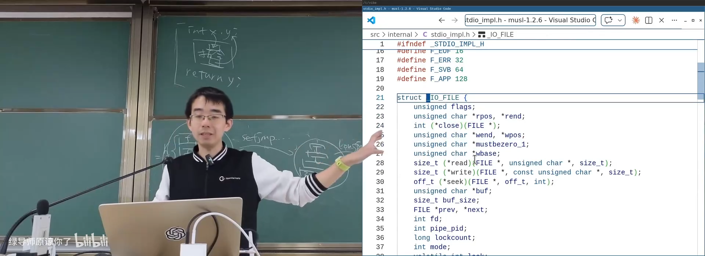

### 6.2 `printf` 家族共享一个解析核心

`printf`、`fprintf`、`sprintf`、`snprintf` 等功能看似很多，但不应复制多套格式化逻辑。它们通常统一落到一个可变参数的格式化函数：

```c
int vfprintf(FILE *stream, const char *format, va_list ap);
```

总体流程是：

1. 从左到右扫描格式字符串；
2. 遇到普通字符就输出；
3. 遇到 `%d`、`%s`、`%x` 等转换说明，就解析宽度、精度和标志；
4. 从 `va_list` 读取对应参数；
5. 把结果写入目标 `FILE` 或内存缓冲；
6. 最终由 `FILE` 的写入函数连接到底层文件描述符。

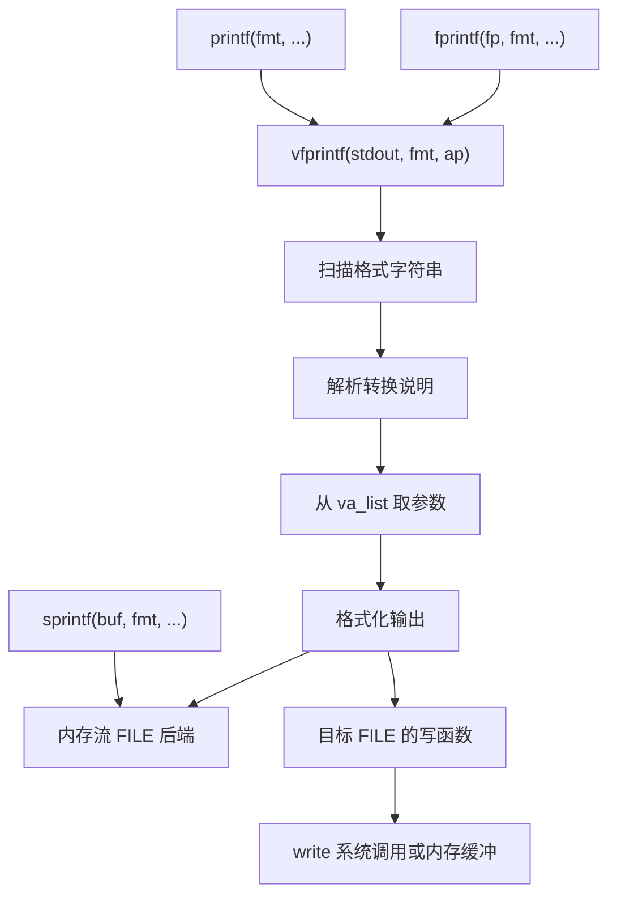
```mermaid
flowchart TD
    A["printf(fmt, ...)"] --> B["vfprintf(stdout, fmt, ap)"]
    C["fprintf(fp, fmt, ...)"] --> B
    D["sprintf(buf, fmt, ...)"] --> E["内存流 FILE 后端"]
    B --> F["扫描格式字符串"]
    F --> G["解析转换说明"]
    G --> H["从 va_list 取参数"]
    H --> I["格式化输出"]
    I --> E
    I --> J["目标 FILE 的写函数"]
    J --> K["write 系统调用或内存缓冲"]
```

这种设计减少了代码克隆，也让 `printf` 家族共享同一套解析、宽度和精度规则。

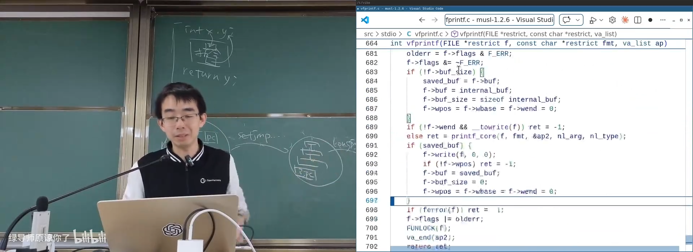

---

## 7. 进程管理封装：退出与协作

*(参考时间: 01:01)*

### 7.1 正常退出、异常退出与 `atexit`

libc 提供几种进程管理能力：

- `abort()`：给自己发送 `SIGABRT`，通常会触发 core dump；
- `exit()`：正常退出，刷新 stdio 缓冲区并执行已注册的退出处理器；
- `atexit()`：注册正常退出时调用的函数；
- `_exit()`：直接执行退出系统调用，不运行用户态清理。

```c
#include <stdio.h>
#include <stdlib.h>

static void remove_temporary_file(void) {
    puts("cleanup: remove temporary file");
}

int main(void) {
    atexit(remove_temporary_file);
    puts("main body");
    return 0;
}
```

`atexit` 适合清理临时文件和资源。在线评测系统会在进程结束后统一回收一切；真实系统则不能假设整个机器会替每个程序收拾现场。一个高频调用、反复创建大临时文件的工具，如果从不删除文件，最终可能耗尽 `/tmp`。

`assert` 失败时通常不是调用 `exit`，而是走 `abort` 路径，所以进程会表现为被 `SIGABRT` 终止。若系统配置允许，还会产生 core dump。名称中的 **core** 來自早期磁芯内存（core memory）：把进程内存状态转储到持久存储，以便事后调试。

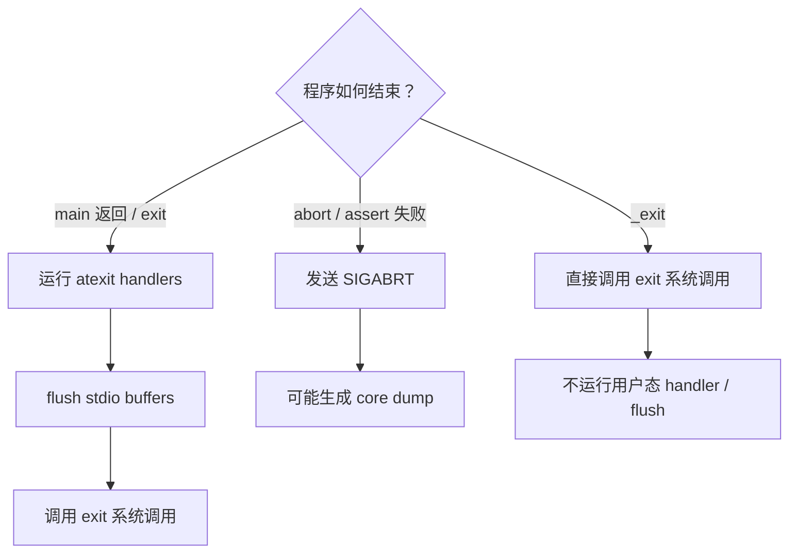
```mermaid
flowchart TD
    A{"程序如何结束？"} -->|"main 返回 / exit"| B["运行 atexit handlers"]
    B --> C["flush stdio buffers"]
    C --> D["调用 exit 系统调用"]
    A -->|"abort / assert 失败"| E["发送 SIGABRT"]
    E --> F["可能生成 core dump"]
    A -->|"_exit"| G["直接调用 exit 系统调用"]
    G --> H["不运行用户态 handler / flush"]
```

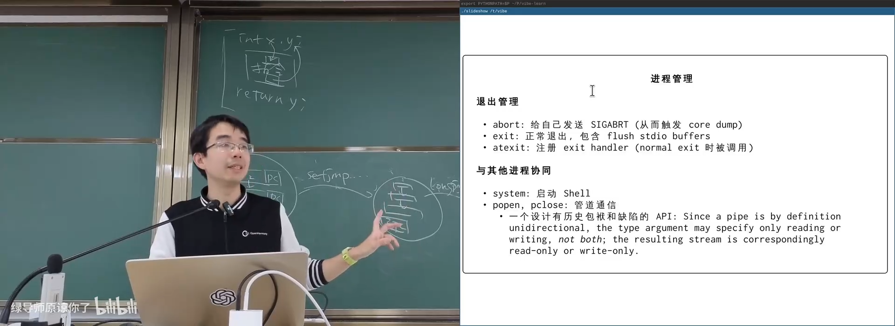

### 7.2 `system`：启动 Shell 执行命令

最方便但最重的进程协作接口是 `system`：

```c
#include <stdlib.h>

int status = system("ls -l");
```

它的背后会启动一个 Shell，再由 Shell 解析和执行命令。这带来了额外开销，也意味着当前进程会等待子进程结束。

它很适合简单场景，例如清屏：

```c
system("clear");
```

直接输出 ANSI escape sequence 通常更轻，但在只需要一个快速、可工作的解决方案时，`system` 往往足够。

### 7.3 `popen` 与单向管道

`popen` 启动命令并返回一个 `FILE *`，使调用者可以读取命令输出，或者向命令标准输入写入：

```c
#include <stdio.h>

FILE *fp = popen("uname -a", "r");
char buffer[256];

while (fgets(buffer, sizeof(buffer), fp)) {
    fputs(buffer, stdout);
}

pclose(fp);
```

但 `popen` 产生的管道是单向的。`pipe` 系统调用会返回两个文件描述符；`FILE *` 却只对应一个描述符，因此 API 无法同时提供“读写两端”而保持好看。

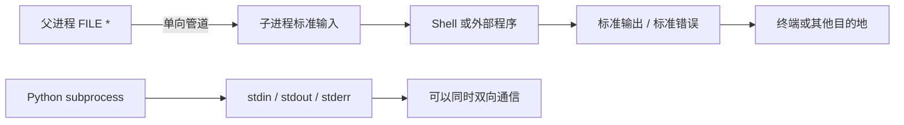
```mermaid
flowchart LR
    A["父进程 FILE *"] -->|"单向管道"| B["子进程标准输入"]
    B --> C["Shell 或外部程序"]
    C --> D["标准输出 / 标准错误"]
    D --> E["终端或其他目的地"]

    F["Python subprocess"] --> G["stdin / stdout / stderr"]
    G --> H["可以同时双向通信"]
```

`popen` 的历史包袱很明显，但对“执行一个命令并取得输出”这个常见需求而言，它比 `system` 更有控制力。

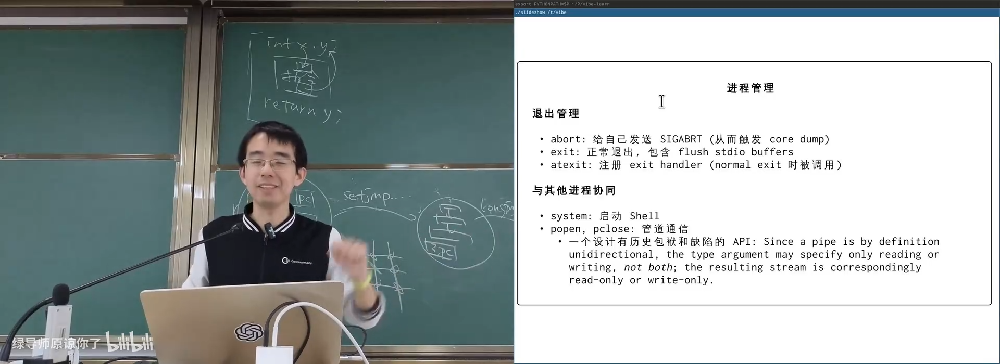

---

## 8. 错误处理：`errno` 与 `perror`

*(参考时间: 01:06)*

### 8.1 系统调用必须面对失败

所有涉及外部资源的接口都可能失败。手册页通常提供 `ERRORS` 一节，列出每个错误码和含义。

`fork` 失败时可能返回：

- `EAGAIN`：暂时没有资源，过一段时间可以重试；
- `ENOMEM`：内存不足。

`open` 的错误更多：

- `EACCES`：权限不足；
- `ENOENT`：文件不存在；
- `EEXIST`：配合 `O_CREAT | O_EXCL` 时，文件已经存在；
- `EINTR`：调用被信号中断；
- 更多与路径、文件系统和资源限制相关的错误。

在线评测程序常常假设输入一定合法、资源一定充足，因此很少真正处理错误。工具程序和系统软件不能这样假设。

```c
#include <errno.h>
#include <fcntl.h>
#include <stdio.h>
#include <unistd.h>

int fd = open("missing.txt", O_RDONLY);
if (fd < 0) {
    perror("open missing.txt");
    return 1;
}
```

### 8.2 错误码、线程与本地化

`errno` 用来保存最近一次失败的库函数或系统调用错误原因：

```c
if (open("missing.txt", O_RDONLY) < 0) {
    int saved = errno;
    printf("errno = %d\n", saved);
}
```

`perror` 会打印调用者提供的字符串，再根据 `errno` 追加系统错误说明：

```text
open missing.txt: No such file or directory
```

错误文本还会受 `LANGUAGE` 等环境变量影响。同一个 `ls` 程序在相同系统上访问相同文件，通过环境变量切换语言后，会得到不同语言的错误信息。这说明错误说明不是内核直接打印的固定英文字符串，而是 libc 根据运行环境格式化和选择的结果。

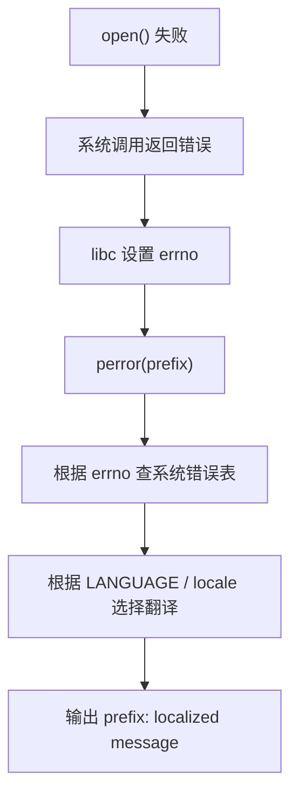
```mermaid
flowchart TD
    A["open() 失败"] --> B["系统调用返回错误"]
    B --> C["libc 设置 errno"]
    C --> D["perror(prefix)"]
    D --> E["根据 errno 查系统错误表"]
    E --> F["根据 LANGUAGE / locale 选择翻译"]
    F --> G["输出 prefix: localized message"]
```

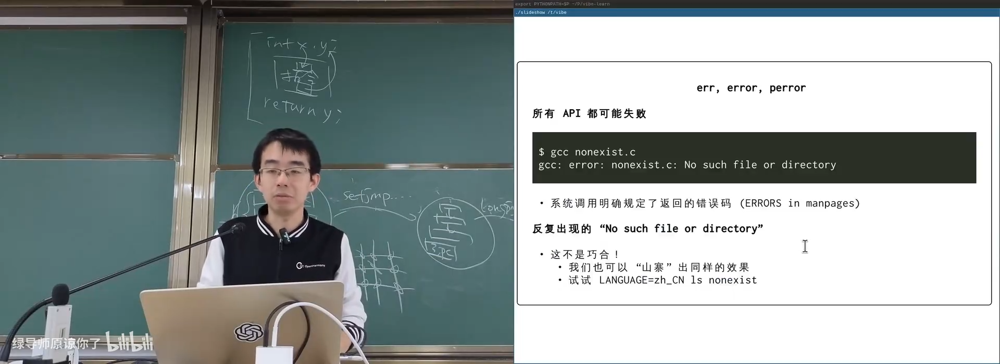

---

## 9. 进程运行环境：`envp` 与 `environ`

*(参考时间: 01:12:05)*

### 9.1 环境变量是一组继承的键值对

进程可以用环境变量影响程序行为。`execve` 接收一个 `envp` 参数：

```c
int main(int argc, char *argv[], char *envp[]);
```

在更通用的写法中，`main` 只声明两个参数：

```c
int main(int argc, char *argv[]);
```

环境变量则通过全局符号 `environ` 访问：

```c
extern char **environ;

for (char **env = environ; *env != NULL; ++env) {
    puts(*env);
}
```

环境变量格式是：

```text
KEY=VALUE
```

例如：

```text
LANGUAGE=zh_CN
PATH=/usr/local/bin:/usr/bin:/bin
HOME=/home/user
```

### 9.2 默认继承与用户级行为配置

底层 `execve` 必须显式给出环境变量。更方便的 `exec` 包装函数，例如 `execl`、`execvp`，默认让子进程继承父进程的环境。

这形成了一个强大的用户级机制：

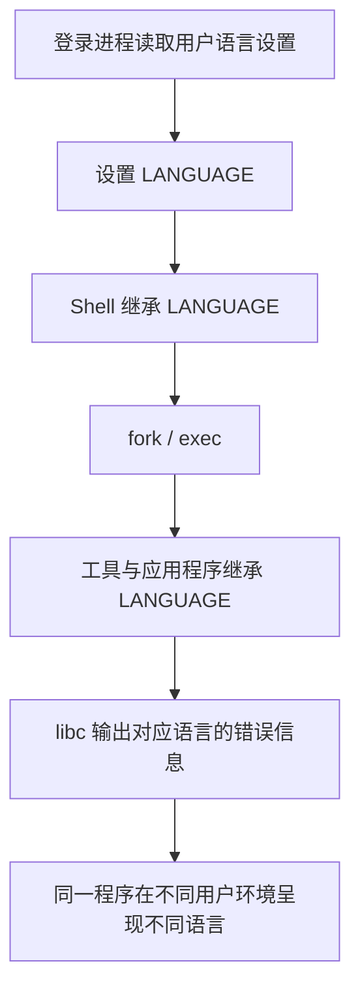
```mermaid
flowchart TD
    A["登录进程读取用户语言设置"] --> B["设置 LANGUAGE"]
    B --> C["Shell 继承 LANGUAGE"]
    C --> D["fork / exec"]
    D --> E["工具与应用程序继承 LANGUAGE"]
    E --> F["libc 输出对应语言的错误信息"]
    F --> G["同一程序在不同用户环境呈现不同语言"]
```

因此，登录时设置一次语言环境，之后所有子孙进程都会继承，直到有人主动修改或清除它。

### 9.3 `environ` 是谁赋值的？

`environ` 是一个由 libc 提供的全局指针：

```c
extern char **environ;
```

它和 `stdout`、`stderr` 一样，由 libc 负责初始化。

需要注意两个层次：

```c
/* 打印 environ 变量保存的地址，也就是环境数组的首地址。 */
printf("%p\n", (void *)environ);

/* 打印 environ 这个变量自身在进程地址空间中的地址。 */
printf("%p\n", (void *)&environ);
```

进程刚启动时，初始参数和环境变量位于栈上，并由 System V ABI 的 **Initial Process Stack** 规定布局。地址空间随机化意味着这些数据的地址无法在链接时写死。因此，`environ` 在一开始可能仍为空；libc 必须从初始栈找到 `envp`，再给全局变量赋正确值。

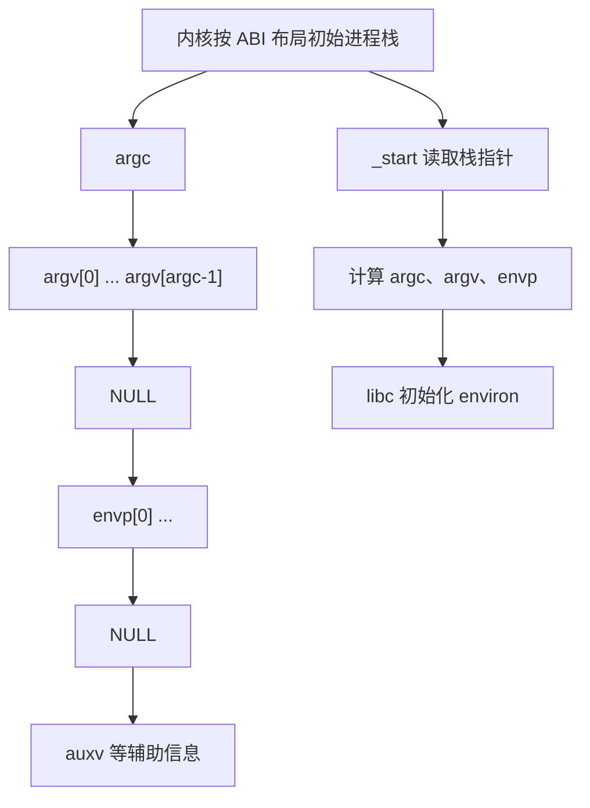
```mermaid
flowchart TD
    A["内核按 ABI 布局初始进程栈"] --> B["argc"]
    B --> C["argv[0] ... argv[argc-1]"]
    C --> D["NULL"]
    D --> E["envp[0] ..."]
    E --> F["NULL"]
    F --> G["auxv 等辅助信息"]
    A --> H["_start 读取栈指针"]
    H --> I["计算 argc、argv、envp"]
    I --> J["libc 初始化 environ"]
```

在 GDB 中对 `environ` 设置 watchpoint，可以观察 libc 写入它的精确位置。musl 的初始化代码最终会执行类似下面的赋值：

```c
__environ = envp;
```

计算机系统里没有魔法：如果某个全局状态必须存在，就一定有某一小段代码从初始状态把它算出来。

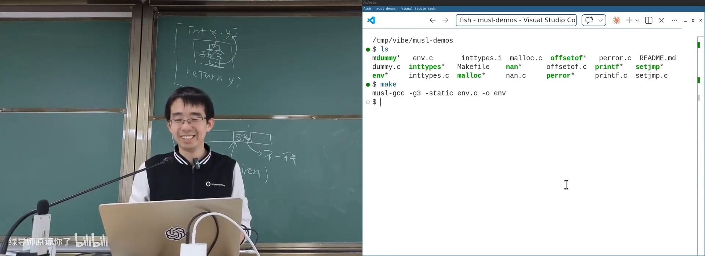

---

## 10. C Runtime：从 `_start` 到 `exit`

*(参考时间: 01:19)*

### 10.1 程序不是从 `main` 开始的

链接器会在 ELF 文件中写入入口地址。该地址通常指向 `_start`，它来自 C Runtime 目标文件，例如 `crt1.o`。

不同平台还会链接 `crtbegin.o`、`crtend.o`、`crtn.o` 等运行时对象，用它们完成初始化、终结和构造析构支持。

可以查看 ELF 入口：

```bash
readelf -h ./demo | grep 'Entry point'
nm ./demo | grep '_start'
```

入口极小，但它承担了从内核交接状态到 C 世界的关键转换。

### 10.2 `_start` 与初始栈

在 x86-64 Linux 上，`_start` 的大致逻辑是：

1. 从初始栈指针读取 `argc`；
2. 计算 `argv = initial_sp + 1`；
3. 根据 ABI 跳过 `argv` 和终止 NULL，得到 `envp`；
4. 把控制权交给 `__libc_start_main` 或等价的 C Runtime 包装函数。

```c
/* 概念性代码，实际版本由汇编实现。 */
long *sp = initial_stack_pointer;
long argc = sp[0];
char **argv = (char **)&sp[1];
char **envp = argv + argc + 1;

__libc_start_main(main, argc, argv, envp, ...);
```

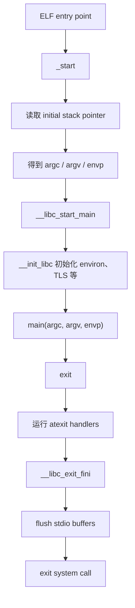
```mermaid
flowchart TD
    A["ELF entry point"] --> B["_start"]
    B --> C["读取 initial stack pointer"]
    C --> D["得到 argc / argv / envp"]
    D --> E["__libc_start_main"]
    E --> F["__init_libc 初始化 environ、TLS 等"]
    F --> G["main(argc, argv, envp)"]
    G --> H["exit"]
    H --> I["运行 atexit handlers"]
    I --> J["__libc_exit_fini"]
    J --> K["flush stdio buffers"]
    K --> L["exit system call"]
```

### 10.3 `__libc_start_main` 的后半段

主函数返回之后，C 程序并没有直接执行一条裸的退出系统调用。正常路径还要经过：

1. `exit`；
2. 按规则运行已注册的 `atexit` 处理器；
3. 运行终止处理；
4. 刷新 stdio 缓冲区；
5. 调用真正的退出系统调用。

因此，一个最小 C 程序的完整生命周期可以写成：


```mermaid
flowchart LR
    A["内核加载 ELF"] --> B["跳转到 _start"]
    B --> C["解析初始栈"]
    C --> D["初始化 libc"]
    D --> E["调用 main"]
    E --> F["执行 atexit 与清理"]
    F --> G["flush buffers"]
    G --> H["exit 系统调用"]
```

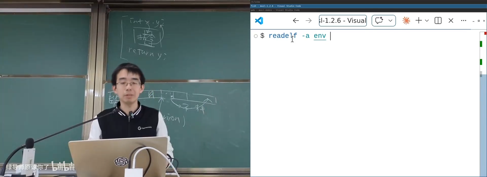

### 10.4 libc 最终包含什么

经过这一路的观察，libc 可以被理解为四类能力的集合：

1. **机器相关的定义**：类型宽度、浮点特性、整数范围、格式化宏、`offsetof`；
2. **计算封装**：字符串、内存、随机数、排序、数学和长跳转；
3. **系统调用封装**：文件、标准 I/O、进程管理、错误处理和进程协作；
4. **C Runtime 支撑**：启动、初始栈解析、环境变量初始化、退出处理和标准流刷新。

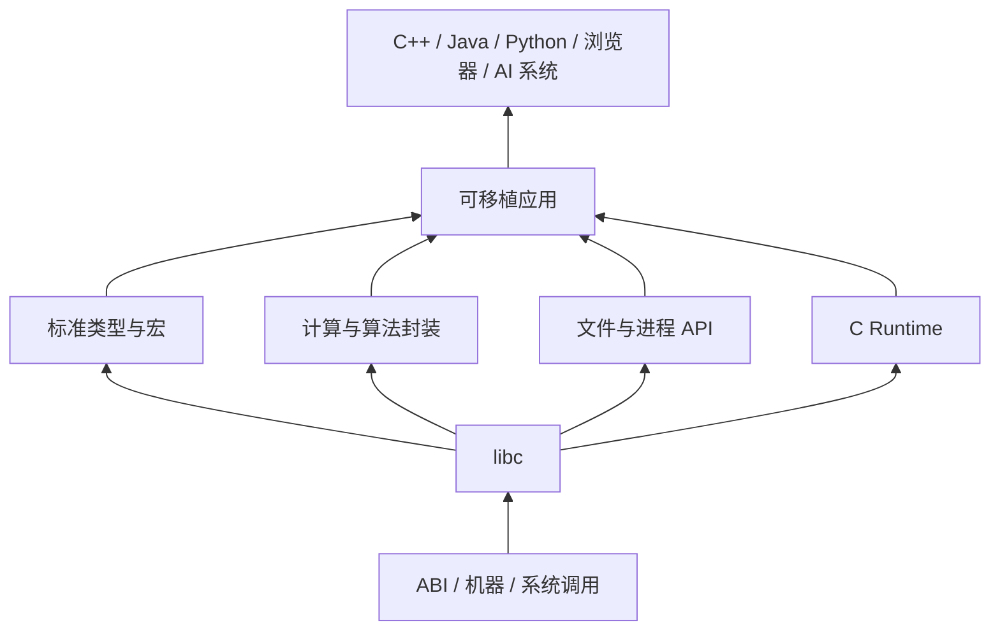
```mermaid
flowchart BT
    A["ABI / 机器 / 系统调用"] --> B["libc"]
    B --> C["标准类型与宏"]
    B --> D["计算与算法封装"]
    B --> E["文件与进程 API"]
    B --> B4["C Runtime"]
    C --> F["可移植应用"]
    D --> F
    E --> F
    B4 --> F
    F --> G["C++ / Java / Python / 浏览器 / AI 系统"]
```

这就是应用生态的“第一级抽象”：它不隐藏所有复杂性，却把最常见的机器差异、系统调用模式、运行环境初始化和错误处理组织成了可复用、可标准化的接口。

---

## 11. 总结：从最小模型到万千世界

这一讲从 SimpleC 和系统调用出发，补齐了 C 语言连接汇编世界的 FFI，又沿着 libc 的源码依次走过：

- ISO C 与 POSIX 如何建立稳定可移植层；
- 为什么 musl 比 glibc 更适合学习；
- freestanding 与 hosted 环境的差别；
- 固定宽度整数、格式宏和 `offsetof`；
- 寄存器 ABI 下的 `stdarg`；
- `qsort`、随机数和 NaN 体现出的语言边界；
- `setjmp` / `longjmp` 如何实现跨函数长跳转；
- `FILE *` 如何封装文件描述符与缓冲；
- `printf` 家族如何共享 `vfprintf`；
- `exit`、`atexit`、`abort`、`system` 和 `popen` 的进程语义；
- `errno`、`perror` 与本地化错误信息；
- `envp`、`environ` 和进程环境继承；
- `_start`、`__libc_start_main`、`__init_libc` 与最终退出。

今天 C 在应用开发方面有不少缺陷，但它仍然提供了观察“第一级抽象”如何构建的绝佳范本。正如讲师反复强调的，计算机系统里没有魔法：每一个看似自动发生的初始化、每一次跨语言调用、每一个错误提示，都可以沿着 ABI、libc、系统调用和内核的边界找到实现的落点。

---

## 附：官方参考与延伸阅读

以下链接来自官方讲义第 9 讲及课堂内容，按主题整理：

- **计算与 FFI**
  - [GCC Extended Asm](https://gcc.gnu.org/onlinedocs/gcc/Extended-Asm.html)
- **C 标准库与 freestanding**
  - [Freestanding 实现](https://en.cppreference.com/w/cpp/freestanding)
  - [`stddef.h`](https://cplusplus.com/reference/cstddef/)
  - [`float.h`](https://cplusplus.com/reference/cfloat/)
  - [`limits.h`](https://cplusplus.com/reference/climits/)
  - [`inttypes.h`](https://cplusplus.com/reference/cinttypes/)
  - [`stdint.h`](https://cplusplus.com/reference/cstdint/)
  - [`stdarg.h`](https://cplusplus.com/reference/cstdarg/)
  - [`string.h`](https://cplusplus.com/reference/cstring/)
  - [`stdlib.h`](https://cplusplus.com/reference/cstdlib/)
  - [`math.h`](https://cplusplus.com/reference/cmath/)
  - [`stdio.h`](https://www.cplusplus.com/reference/cstdio/)
- **libc 实现**
  - [musl libc](https://musl.libc.org)
  - [musl 调试小程序](https://jyywiki.cn/OS/demos/virtualization/musl-demos)
- **浮点格式与量化**
  - [FP8: E4M3 / E5M2](https://arxiv.org/pdf/2209.05433.pdf)
  - [IEEE Spectrum: Number Representation](https://spectrum.ieee.org/number-representation)
- **C 语言的边界与后续讨论**
  - [C is not a low-level language](https://dl.acm.org/doi/pdf/10.1145/3209212)
  - [C isn't a programming language any more](https://gankra.github.io/blah/c-isnt-a-language/)

官方课程资料：

- [课程主页](https://jyywiki.cn/OS/2026/)
- [第 9 讲讲义：C 标准库和实现 (1)](https://jyywiki.cn/OS/2026/lect9.md)
- [视频：09 - C 标准库原理](https://www.bilibili.com/video/BV1GHXCBkEZf/)

> **版权与署名**：本讲课程材料由蒋炎岩（jyy）编写。课程讲义与幻灯片采用 [Creative Commons BY-NC 4.0](http://creativecommons.org/licenses/by-nc/4.0/) 许可；本电子书保留课程出处、作者署名与许可说明。
