# 调试 C 标准库：从 DWARF 到 vDSO 与 malloc

> **课程**：2026 春季学期《操作系统原理》  
> **讲师**：蒋炎岩（jyy）  
> **官方课程主页**：<https://jyywiki.cn/OS/2026/>  
> **官方讲义**：<https://jyywiki.cn/OS/2026/lect10.md>  
> **视频来源**：[Bilibili BV1yu9cBCEAb](https://www.bilibili.com/video/BV1yu9cBCEAb/)  
> **版权说明**：课程讲义与幻灯片归蒋炎岩所有，采用 [Creative Commons BY-NC 4.0](http://creativecommons.org/licenses/by-nc/4.0/) 许可；本电子书是对课堂讲授的书面化重构，保留出处与许可说明。

## 导语：从“知道 libc 封装了什么”到“真正调试它”

*(参考时间: 00:00)*

上一讲从接口层面观察了 C 标准库：

- `FILE *` 封装文件描述符；
- `printf` 家族共享格式化核心；
- `errno`、`perror` 处理错误；
- `environ` 保存进程环境；
- `_start`、`__libc_start_main` 和 `exit` 构成 C Runtime。

这一讲继续向下钻。我们不满足于“知道某个函数大概做了什么”，而是用调试器和真正的 musl libc 源码观察：

- 编译器为什么需要调试信息；
- `_start` 如何解析初始进程栈；
- `printf` 如何把变参数搬到内存；
- `setjmp` 与 `longjmp` 保存和恢复了哪些寄存器；
- `gettimeofday` 为什么不产生系统调用；
- `malloc` 如何在系统调用之上管理小对象。

核心方法是：**从机器的低级状态恢复程序的高级意义**。


```mermaid
flowchart LR
    A["PC、寄存器、内存"] --> B["调试信息"]
    B --> C["函数名、类型、变量、源代码行"]
    C --> D["调用栈、性能火焰图、崩溃快照"]
    D --> E["人类可理解的程序行为"]
```

课堂开始也提到上一讲的“翻车”经历：直接让模型编译并安装 musl libc，模型声称成功，实际使用的仍是系统包管理器安装的版本，导致调试器看不到 libc 源码。这次讲师逐条检查命令和输出，确保自定义 musl 工具链真正生效。

这件事本身就是一条工程经验：**AI 可以完成复杂操作，但关键步骤仍要验证实际状态，而不是只看“已完成”的总结。**

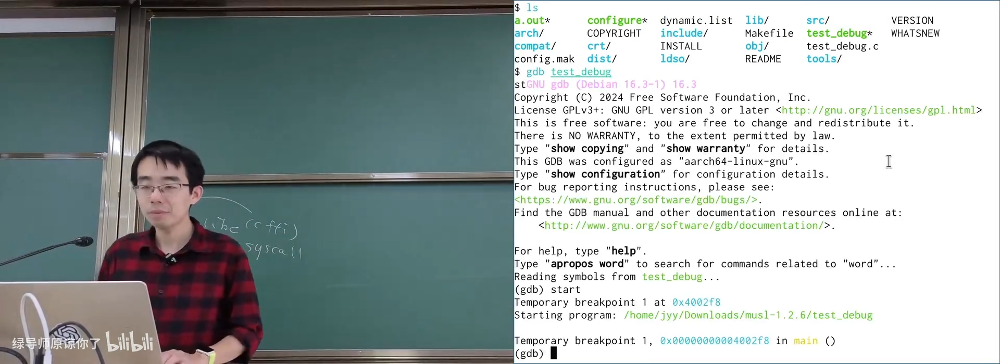

---

## 1. Debug Info：让二进制重新“长出”源代码

### 1.1 编译 `musl-gcc` 与调试信息

*(参考时间: 00:09)*

先要让程序带着调试信息编译。最简单的 C 程序可以写成：

```c
int main(void) {
    return 1;
}
```

普通编译只产生机器指令和数据；加上 `-g` 后，目标文件与可执行文件中会多出调试信息节。

在 musl 教学环境中，可以把 libc 本身也编译成带调试信息、便于阅读的版本：

```bash
CC=musl-gcc \
CFLAGS="-Og -ggdb -fno-omit-frame-pointer" \
./configure --prefix="$HOME/musl-debug"

make -j"$(nproc)"
make install
```

随后静态编译演示程序：

```bash
musl-gcc -Og -ggdb -static test-debug.c -o test-debug
gdb ./test-debug
```

`-Og` 更偏向调试体验，`-ggdb` 生成 GDB 友好的调试信息，`-fno-omit-frame-pointer` 让调用栈更容易恢复。

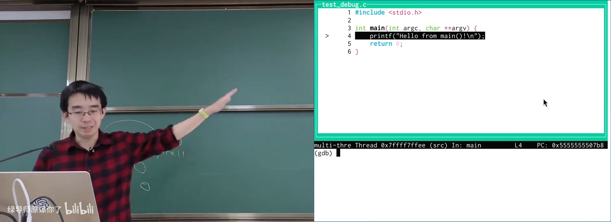

### 1.2 调试信息是二进制中的额外节

*(参考时间: 00:10)*

可以用 `readelf -a` 查看 ELF 文件。除了熟悉的 `.text`、`.data`、`.bss`，带调试信息的文件还会包含：

- `.debug_info`：类型、变量、函数和编译单元等核心信息；
- `.debug_abbrev`：调试信息中使用的缩写表；
- `.debug_line`：机器地址与源代码行的对应；
- `.debug_str`：调试字符串表；
- `.debug_ranges`、`.debug_rnglists`：地址范围；
- `.debug_frame`：调用栈展开所需的信息；
- `.debug_loc`、`.debug_loclists`：变量位置表达式。

```bash
readelf -a ./test-debug | less
readelf -S ./test-debug
```

这些节使用 **DWARF Debugging Standard**。名字也埋着课程常提到的幻想梗：

- **ELF** 是精灵（Elf）；
- **DWARF** 是矮人（Dwarf）。

DWARF 不只是“地址到行号”的表格。它包含一个类似字节码的小型指令集，用来描述：

> 在某个 PC 范围内，某个变量的值在哪里，应该怎样计算出来。

变量可能在寄存器里、栈上、内存中的某个偏移；经过优化后，甚至可能只在某段指令内存在。DWARF 字节码负责把这些位置和计算规则描述出来。

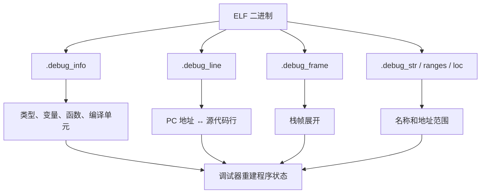
```mermaid
flowchart TD
    A["ELF 二进制"] --> B[".debug_info"]
    A --> C[".debug_line"]
    A --> D[".debug_frame"]
    A --> E[".debug_str / ranges / loc"]
    B --> F["类型、变量、函数、编译单元"]
    C --> G["PC 地址 ↔ 源代码行"]
    D --> H["栈帧展开"]
    E --> I["名称和地址范围"]
    F --> J["调试器重建程序状态"]
    G --> J
    H --> J
    I --> J
```

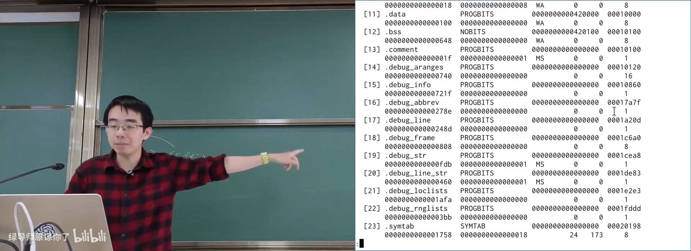

### 1.3 没有 DWARF，符号表也能近似定位

*(参考时间: 00:14)*

即使没有 `-g`，ELF 通常仍保留 `.symtab` 符号表。可以用 `nm` 查看：

```bash
nm ./a.out | grep ' main'
```

它会告诉我们类似：

```text
0000000000400218 T main
```

如果 PC 进入 `main` 的地址范围，调试器至少知道“当前正在执行 `main`”。但符号表通常不能精确告诉调试器“现在正在执行 `main.c` 的第几行”。

调试信息补足了更精细的映射：

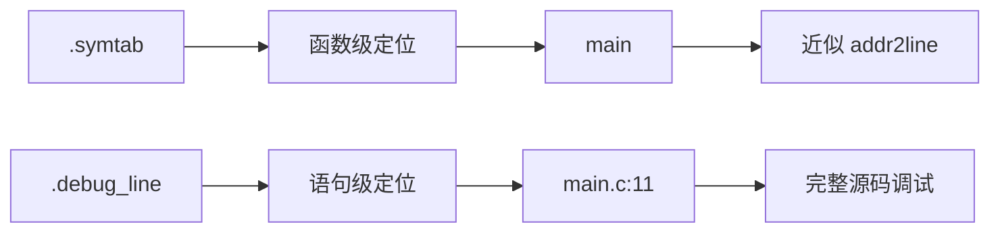
```mermaid
flowchart LR
    S[".symtab"] --> A["函数级定位"]
    A --> B["main"]
    D[".debug_line"] --> C["语句级定位"]
    C --> D2["main.c:11"]
    B --> E["近似 addr2line"]
    D2 --> F["完整源码调试"]
```

`addr2line` 把地址解析为源码位置：

```bash
addr2line -e ./test-debug -f 0x400218
```

输出类似：

```text
main
/path/test-debug.c:3
```

有了符号表和地址映射，理论上就足以实现一个简单调试器。更复杂的部分，例如多级调用栈、变量类型、位域和优化后变量恢复，需要完整 DWARF。

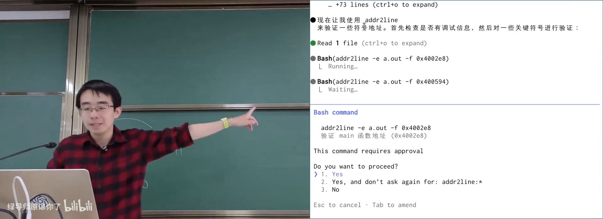

### 1.4 DWARF 字节码为什么存在

*(参考时间: 00:17)*

C 程序中的变量并不总能简单地对应一个寄存器或固定栈偏移。考虑：

- 变量可能一会儿在寄存器，一会儿被写回内存；
- 结构体可能使用位域；
- 优化器可能重排、内联或删除变量；
- 编译器可能只为一段 PC 范围保留某个值。

因此 DWARF 需要一种可执行的描述语言。它能够读取寄存器、访问内存、做算术、判断范围，甚至分支。它本质上足够表达任意值恢复过程，所以是一个图灵完备的字节码系统。

调试器显示：

```text
variable optimized out
```

往往就是编译器没有为该位置生成可恢复信息，或者优化后确实不再存在这个变量。

DWARF 也用于 C++ 异常的 **stack unwinding**：异常抛出时，需要沿着调用栈找到能够处理异常的帧，并在展开过程中恢复寄存器与栈状态。上一讲的 `longjmp` 和这里的栈展开在机制上有相通之处。

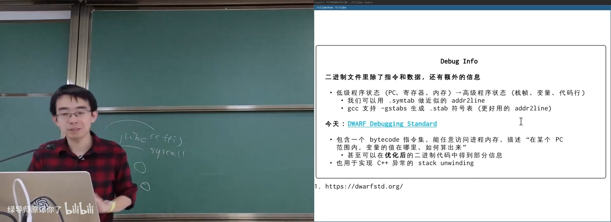

### 1.5 Source Map：浏览器里的调试信息

*(参考时间: 00:20)*

并非所有语言都像 C 一样依赖外部源文件。TypeScript 会被转译成 JavaScript，新版本 JavaScript 又可能被转译成旧浏览器兼容的代码。浏览器沙盒中没有开发者的项目目录，因此调试信息可以直接携带源码。

前端构建常生成 `.map` 文件：

```json
{
  "version": 3,
  "file": "bundle.js",
  "sources": ["src/index.js"],
  "names": ["map", "callbackFn"],
  "mappings": "AAAA, ...",
  "sourcesContent": ["const x = 1; ..."]
}
```

`sourcesContent` 可以把原始源码直接嵌进 Source Map。

课堂上以 Claude Code 的 `cli.js.map` 泄漏为例。压缩后的 JavaScript 本来难以阅读，但 Source Map 中保存了源码，使人们很快得到接近原始项目的代码结构。讲师评价其中不少设计比较普通，但也看到 React 实现的终端 UI、异步 token 处理等有趣细节。

更值得注意的是供应链安全：

- 从网络下载并构建未知项目会执行脚本；
- 依赖包可能被投毒；
- 构建环境中的 token、密钥和环境变量可能泄漏；
- 发布前应使用自动检查扫描源代码和构建产物；
- 处理来路不明的项目最好放在干净沙盒里。

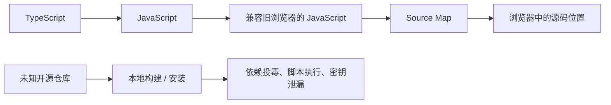
```mermaid
flowchart LR
    TS["TypeScript"] --> JS1["JavaScript"]
    JS1 --> JS2["兼容旧浏览器的 JavaScript"]
    JS2 --> MAP["Source Map"]
    MAP --> SRC["浏览器中的源码位置"]
    REPO["未知开源仓库"] --> CI["本地构建 / 安装"]
    CI --> RISK["依赖投毒、脚本执行、密钥泄漏"]
```

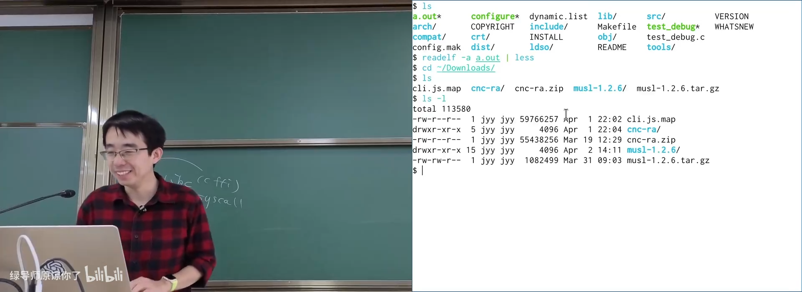

### 1.6 Debug Info 能做什么

*(参考时间: 00:27)*

调试信息的价值可以概括为：**把机器状态重新解释为程序意义**。

典型能力包括：

- `addr2line`：地址映射到源码行；
- backtrace：恢复完整函数调用栈；
- profiler：周期性采样 PC，恢复调用栈并生成火焰图；
- crash dump：保存崩溃时刻的进程快照，事后调试；
- AddressSanitizer：在诊断报告中加入源码位置和对象信息。

以 `bt` 为例，调试器可以一次恢复从 `main` 到当前函数的整个调用链：

```text
#0  second ()
#1  first ()
#2  main ()
```

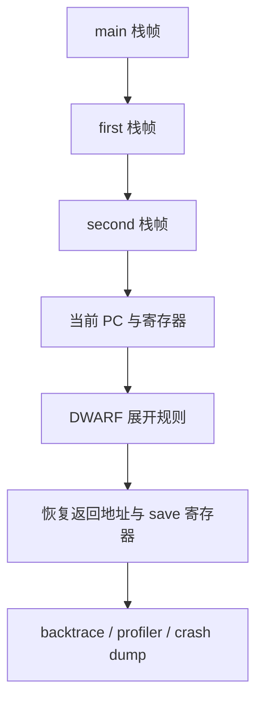
```mermaid
flowchart TD
    A["main 栈帧"] --> B["first 栈帧"]
    B --> C["second 栈帧"]
    C --> D["当前 PC 与寄存器"]
    D --> E["DWARF 展开规则"]
    E --> F["恢复返回地址与 save 寄存器"]
    F --> G["backtrace / profiler / crash dump"]
```

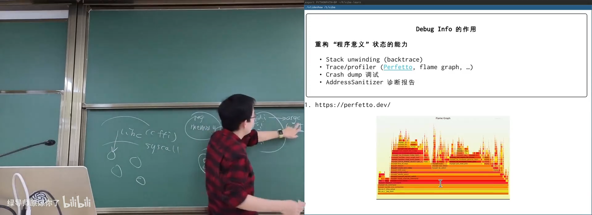

### 1.7 火焰图：采样得到的调用栈时间轴

*(参考时间: 00:31)*

如果每隔很短时间暂停程序并记录调用栈，就能得到一张火焰图：

- 横轴表示时间或采样总体；
- 每一层表示一个调用栈帧；
- 函数进入时向上叠加；
- 函数返回时对应层结束；
- 越宽的框代表该调用路径占用的采样越多。

`strace` 记录系统调用，适合观察内核边界；火焰图采样用户态调用栈，更适合寻找 CPU 性能瓶颈。

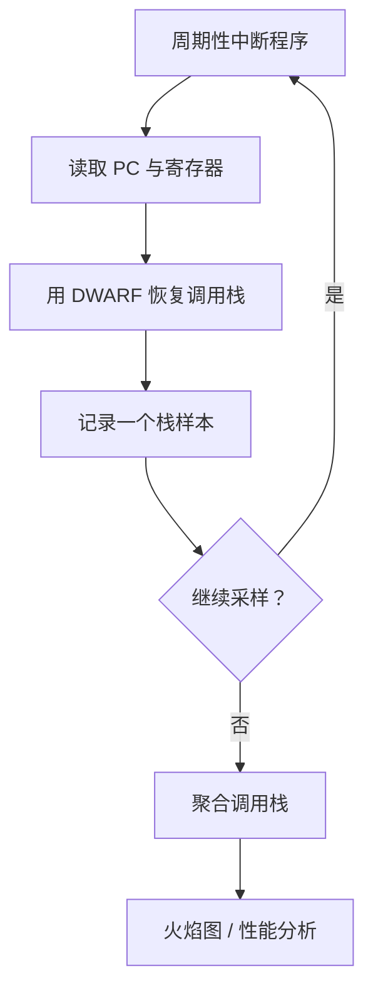
```mermaid
flowchart TD
    A["周期性中断程序"] --> B["读取 PC 与寄存器"]
    B --> C["用 DWARF 恢复调用栈"]
    C --> D["记录一个栈样本"]
    D --> E{"继续采样？"}
    E -- "是" --> A
    E -- "否" --> F["聚合调用栈"]
    F --> G["火焰图 / 性能分析"]
```

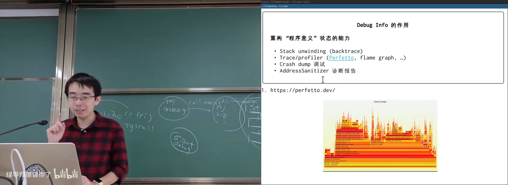

### 1.8 Sanitizer：把隐蔽未定义行为变成诊断报告

*(参考时间: 00:34)*

考虑一个典型的 use-after-free：

```c
int *p = malloc(sizeof(*p));
*p = 1;
free(p);
*p = 2;  /* undefined behavior */
```

这段代码可能不崩溃。释放后，虚拟地址空间中的页可能仍然映射；从机器角度看，指针的值也没改变。问题不会凭空消失，只是暂时没有被观察到。

使用 AddressSanitizer：

```bash
cc -fsanitize=address -g -O1 bug.c -o bug
./bug
```

诊断报告会指出：

```text
heap-use-after-free
```

并利用调试信息展示源码位置、分配栈和释放栈。


```mermaid
flowchart LR
    A["malloc 返回地址"] --> B["程序使用对象"]
    B --> C["free 标记对象已释放"]
    C --> D["指针值仍然存在"]
    D --> E{"再次访问？"}
    E -- "普通运行" --> F["可能静默成功"]
    E -- "ASan 运行" --> G["heap-use-after-free 诊断"]
```

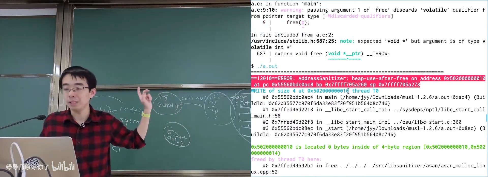

---

## 2. 调试 `crt1.o`：从第一条汇编指令到 `main`

### 2.1 最小程序其实经过了完整 Runtime

*(参考时间: 00:35)*

把 `dummy.c` 编译并静态链接后：

```bash
musl-gcc -Og -ggdb -static dummy.c -o dummy
strace ./dummy
```

`strace` 会显示，程序在 `execve` 后只执行少量初始化，然后直接调用 `exit` 系统调用。相比带大量初始化逻辑的 glibc，musl 的启动路径更短，适合观察。

进入 GDB：

```bash
gdb ./dummy
```

初始 PC 位于 `_start`。`_start` 是汇编代码，进入它所调用的 C 函数 `_start_c` 后，就能看到更完整的调试信息。


### 2.2 用代码反向还原初始进程栈

*(参考时间: 00:36)*

`_start_c` 接收一个 `long *p`。这个指针就是内核交给用户态程序的初始栈位置。

按照 System V ABI，初始栈布局可以表示为：

```text
p[0]        = argc
p[1]        = argv[0]
p[2]        = argv[1]
...
p[1+argc]   = NULL
p[2+argc]   = envp[0]
p[3+argc]   = envp[1]
...
             = NULL
             = auxiliary vector entries
```

因此：

```c
long argc = p[0];
char **argv = (char **)&p[1];
char **envp = argv + argc + 1;
```

在 GDB 中可以打印 `argv[0]`、`envp[0]` 和 `envp[1]`，确认它们分别对应可执行文件名和环境变量。

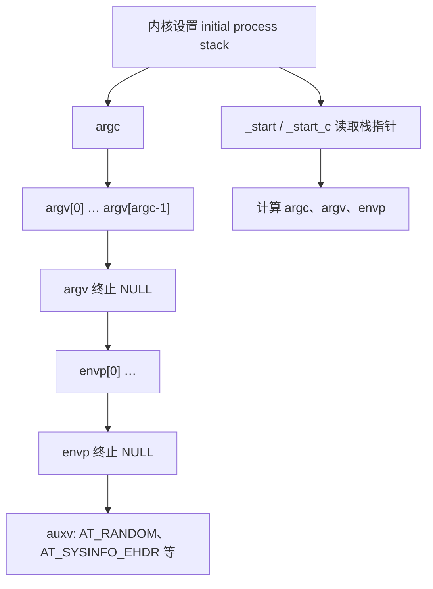
```mermaid
flowchart TD
    A["内核设置 initial process stack"] --> B["argc"]
    B --> C["argv[0] … argv[argc-1]"]
    C --> D["argv 终止 NULL"]
    D --> E["envp[0] …"]
    E --> F["envp 终止 NULL"]
    F --> G["auxv: AT_RANDOM、AT_SYSINFO_EHDR 等"]
    A --> H["_start / _start_c 读取栈指针"]
    H --> I["计算 argc、argv、envp"]
```

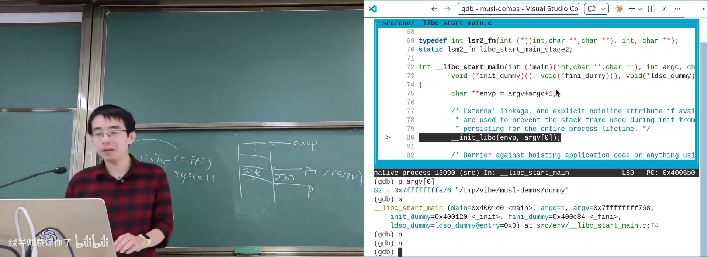

### 2.3 `__init_libc` 与 `__libc_start_main`

*(参考时间: 00:38)*

继续单步会进入 `__init_libc`。这里完成：

- 把 `envp` 赋给全局变量 `environ`；
- 跳过所有环境变量；
- 处理后续 auxiliary vector；
- 保存 TLS、随机数种子、vDSO 地址等运行时信息。

环境变量每一项都是一个指向 NUL 结尾字符串的指针：

```c
extern char **environ;

for (char **e = envp; *e; ++e) {
    /* 处理 KEY=VALUE */
}
```

处理完初始化后，控制流进入 `__libc_start_main`，再由 `stage2` 调用真正的 `main(argc, argv, envp)`。

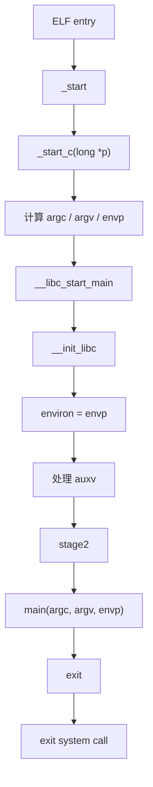
```mermaid
flowchart TD
    A["ELF entry"] --> B["_start"]
    B --> C["_start_c(long *p)"]
    C --> D["计算 argc / argv / envp"]
    D --> E["__libc_start_main"]
    E --> F["__init_libc"]
    F --> G["environ = envp"]
    G --> H["处理 auxv"]
    H --> I["stage2"]
    I --> J["main(argc, argv, envp)"]
    J --> K["exit"]
    K --> L["exit system call"]
```


---

## 3. 调试 `printf`、变参数与 `FILE`

### 3.1 给 `printf` 打断点

*(参考时间: 00:41)*

在 VS Code 或 GDB 中给 musl 的 `printf` 打上断点。进入后可以看到：

```c
int printf(const char *fmt, ...) {
    return vfprintf(stdout, fmt, ...);
}
```

实际实现通过 `va_list` 把可变参数传给 `vfprintf`。

此时展开 `stdout`，能看到 `FILE` 的内部状态：

- `fd = 1`；
- `buf` 指向用户空间缓冲区；
- `buf_size = 1024`；
- 当前读写位置和缓冲位置；
- 错误、EOF 和状态标志。

这直接印证上一讲的结论：标准 I/O 是文件描述符和用户空间缓冲的封装。

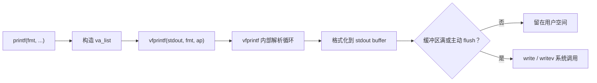
```mermaid
flowchart LR
    A["printf(fmt, ...)"] --> B["构造 va_list"]
    B --> C["vfprintf(stdout, fmt, ap)"]
    C --> D["vfprintf 内部解析循环"]
    D --> E["格式化到 stdout buffer"]
    E --> F{"缓冲区满或主动 flush？"}
    F -- "否" --> G["留在用户空间"]
    F -- "是" --> H["write / writev 系统调用"]
```


### 3.2 变参数不是魔法

*(参考时间: 00:44)*

在旧的 32 位 x86 `cdecl` 调用约定中，参数依次压栈。很多人会用下面的方式访问变参数：

```c
void foo(int n, ...) {
    intptr_t *vargs = (intptr_t *)&n;

    /* vargs[0] = n */
    /* vargs[1] = 第一个可变参数 */
    /* vargs[2] = 第二个可变参数 */
}
```

这个 hack 在现代 x86-64、AArch64、RISC-V 上不再可行，因为前几个参数通过寄存器传递。函数入口时，它们并不天然在内存中形成连续数组。

编译器与 libc 必须协作。以 AArch64 为例，参数寄存器可能是 `x0`、`x1`、`x2` 等。进入可变参数函数后，编译器会生成一段序言，把寄存器参数保存到栈上的一个“寄存器保存区”，使 `va_list` 能按统一方式遍历。

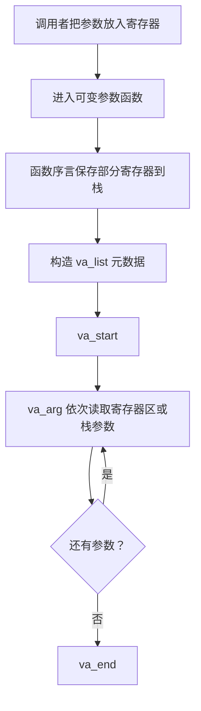
```mermaid
flowchart TD
    A["调用者把参数放入寄存器"] --> B["进入可变参数函数"]
    B --> C["函数序言保存部分寄存器到栈"]
    C --> D["构造 va_list 元数据"]
    D --> E["va_start"]
    E --> F["va_arg 依次读取寄存器区或栈参数"]
    F --> G{"还有参数？"}
    G -- "是" --> F
    G -- "否" --> H["va_end"]
```

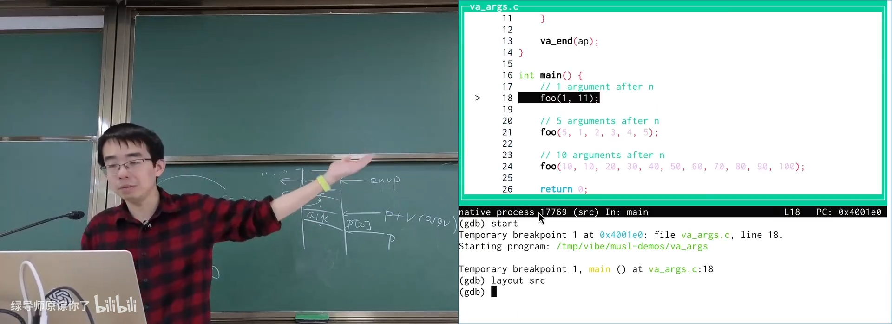

### 3.3 `va_list` 与 `printf` 解析器

从汇编回到 C 语义，可以写成：

```c
#include <stdarg.h>

void foo(int n, ...) {
    va_list ap;
    va_start(ap, n);

    for (int i = 0; i < n; ++i) {
        int value = va_arg(ap, int);
        /* use value */
    }

    va_end(ap);
}
```

`vfprintf` 的核心工作包括：

1. 扫描格式字符串；
2. 普通字符直接输出；
3. 遇到 `%d`、`%s`、`%x` 等转换规范时解析标志、宽度、精度；
4. 用 `va_arg` 取得参数；
5. 格式化到 `FILE` 缓冲；
6. 必要时通过 `write` 或 `writev` 进入内核。

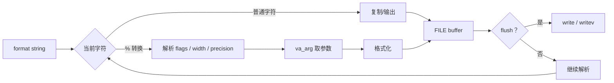
```mermaid
flowchart LR
    A["format string"] --> B{"当前字符"}
    B -- "普通字符" --> C["复制/输出"]
    B -- "% 转换" --> D["解析 flags / width / precision"]
    D --> E["va_arg 取参数"]
    E --> F["格式化"]
    C --> G["FILE buffer"]
    F --> G
    G --> H{"flush？"}
    H -- "是" --> I["write / writev"]
    H -- "否" --> J["继续解析"]
    J --> B
```


---

## 4. 调试 `setjmp` / `longjmp`：给寄存器刷漆

### 4.1 实验设计

*(参考时间: 00:48)*

为了观察 `setjmp` / `longjmp` 到底保存什么，讲师让 AI 写了一段寄存器实验：

1. 在 `setjmp` 前，把 `x0` 到 `x28` 全部写成一组“红色”值；
2. 调用 `setjmp`；
3. 再把所有可用寄存器写成另一组“蓝色”值；
4. 调用 `longjmp`；
5. 观察哪些寄存器恢复成红色，哪些仍保持蓝色。

这像给寄存器“刷漆”，颜色变化直接暴露保存与恢复行为。

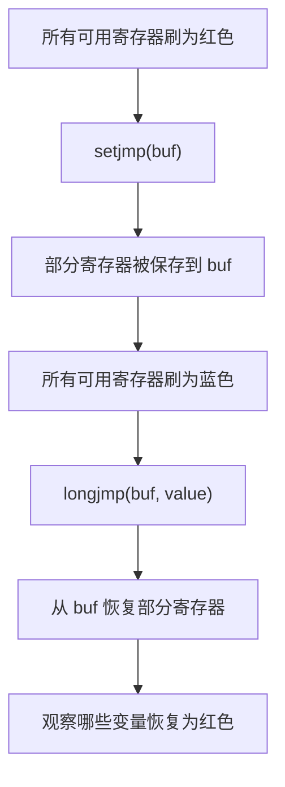
```mermaid
flowchart TD
    A["所有可用寄存器刷为红色"] --> B["setjmp(buf)"]
    B --> C["部分寄存器被保存到 buf"]
    C --> D["所有可用寄存器刷为蓝色"]
    D --> E["longjmp(buf, value)"]
    E --> F["从 buf 恢复部分寄存器"]
    F --> G["观察哪些变量恢复为红色"]
```

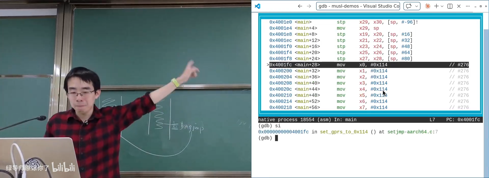

### 4.2 `setjmp` 保存了什么

*(参考时间: 00:51)*

实验里不能随意覆盖栈指针、特殊控制寄存器和运行时必须保持的寄存器。可以修改的通用寄存器中，`x0` 到 `x18` 很快就被函数调用和编译器使用，原来的“红色”值迅速消失。

`setjmp` 的汇编代码把 `x19` 到 `x28` 成对保存到 `buf`，同时保存：

- 返回地址；
- 栈指针；
- 后续恢复所需的上下文。

可以看到类似：

```asm
stp x19, x20, [x0, #...]
stp x21, x22, [x0, #...]
stp x23, x24, [x0, #...]
...
mov w0, #0
ret
```

`stp` 是 AArch64 的一次保存两个寄存器的 store pair 指令。

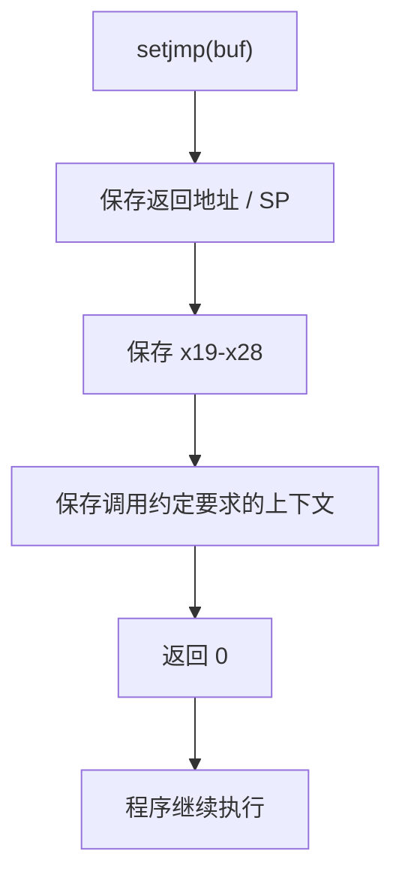
```mermaid
flowchart TD
    A["setjmp(buf)"] --> B["保存返回地址 / SP"]
    B --> C["保存 x19-x28"]
    C --> D["保存调用约定要求的上下文"]
    D --> E["返回 0"]
    E --> F["程序继续执行"]
```


### 4.3 `longjmp` 恢复了什么

*(参考时间: 00:52)*

在 `longjmp` 前，寄存器再次被刷成新值。执行 `longjmp` 后，可以观察到：

- `x0` 到 `x18` 仍然是新值，说明它们没有被 `longjmp` 恢复；
- `x19` 到 `x28` 被恢复成 `setjmp` 保存的旧值；
- 返回地址与栈上下文恢复，控制流回到 `setjmp` 的位置。

`longjmp` 的汇编代码主要执行成对 load：

```asm
ldp x19, x20, [x0, #...]
ldp x21, x22, [x0, #...]
...
ret
```

因此，这个实验实际上逆向了 AArch64 调用约定的一部分。


```mermaid
flowchart LR
    A["setjmp 保存 x19-x28"] --> B["中间调用任意多层函数"]
    B --> C["模型：寄存器和栈帧发生变化"]
    C --> D["longjmp"]
    D --> E["恢复 x19-x28、SP 和返回地址"]
    E --> F["跳回 setjmp 的返回点"]
```


### 4.4 Caller-saved 与 callee-saved

*(参考时间: 00:54)*

为什么 `x0` 到 `x18` 不需要保存？

因为这些寄存器属于调用约定中的 caller-saved，或者更直观地叫 **call-clobbered**：

- 调用函数后，被调用者可以随意改写；
- 调用者不能在调用前把一个需要继续使用的值留在这些寄存器里，并期待调用后还保持；
- 如果调用者需要保留，必须自己先保存。

`x19` 到 `x28` 则是 callee-saved：

- 被调用函数如果想使用，必须先保存原值；
- 返回前必须恢复；
- 因此 `setjmp` 保存它们，`longjmp` 再恢复它们。

这正是函数调用约定能够在汇编层工作的基础。

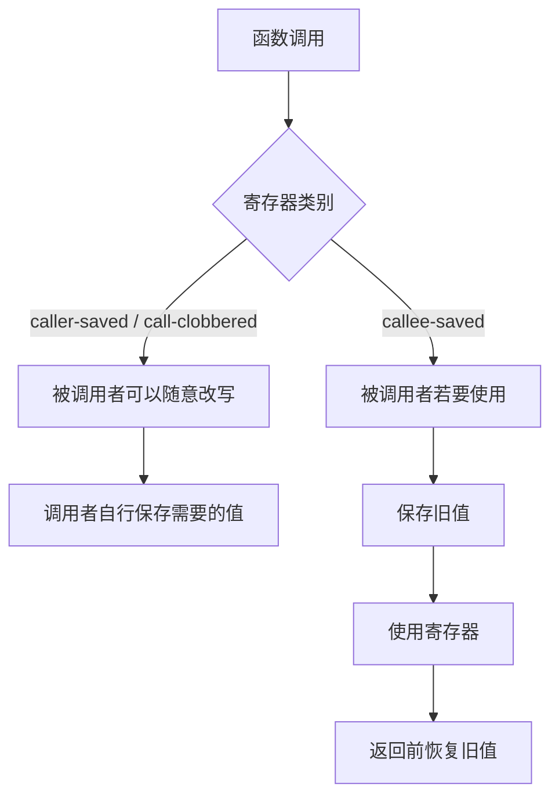
```mermaid
flowchart TD
    A["函数调用"] --> B{"寄存器类别"}
    B -- "caller-saved / call-clobbered" --> C["被调用者可以随意改写"]
    C --> D["调用者自行保存需要的值"]
    B -- "callee-saved" --> E["被调用者若要使用"]
    E --> F["保存旧值"]
    F --> G["使用寄存器"]
    G --> H["返回前恢复旧值"]
```

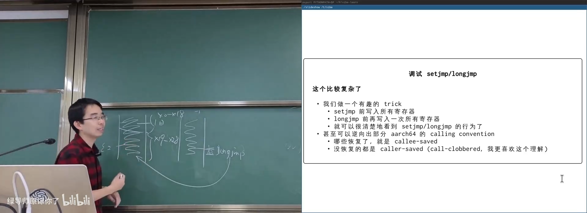

---

## 5. 调试 `gettimeofday`：不进入内核的系统调用

### 5.1 进程自身没有时间概念

*(参考时间: 00:56)*

一个程序可以这样测量经过的时间：

```c
#include <sys/time.h>
#include <unistd.h>

struct timeval t1, t2;

gettimeofday(&t1, NULL);
usleep(200000);
gettimeofday(&t2, NULL);

long elapsed_us =
    (t2.tv_sec - t1.tv_sec) * 1000000L +
    (t2.tv_usec - t1.tv_usec);
```

进程状态只有寄存器和内存，无法仅靠自己感知物理时间。因此从原理上说，读取时间应通过系统调用。

`strace` 运行结果却有意外：

```bash
strace ./gettimeofday-demo
```

可以看到 `nanosleep` 或 `clock_nanosleep`，却看不到 `gettimeofday`。

既然程序打印出的时间正确，它一定通过其他方式读取了时钟。

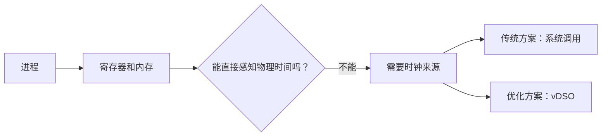
```mermaid
flowchart LR
    A["进程"] --> B["寄存器和内存"]
    B --> C{"能直接感知物理时间吗？"}
    C -- "不能" --> D["需要时钟来源"]
    D --> E["传统方案：系统调用"]
    D --> F["优化方案：vDSO"]
```


### 5.2 `usleep` 最终调用 `clock_nanosleep`

*(参考时间: 01:00)*

进入 musl 的 `usleep` 实现，可以看到它把微秒转换为 `timespec`，然后调用 `clock_nanosleep`：

```c
int usleep(useconds_t usec) {
    struct timespec ts = {
        .tv_sec = usec / 1000000,
        .tv_nsec = (usec % 1000000) * 1000
    };
    return clock_nanosleep(CLOCK_REALTIME, 0, &ts, 0);
}
```

底层系统调用使用内联汇编和 `register` 变量，把参数放入 ABI 规定的寄存器：

```c
register long x8 __asm__("x8") = __NR_clock_nanosleep;
register long x0 __asm__("x0") = CLOCK_REALTIME;
register long x1 __asm__("x1") = 0;
register long x2 __asm__("x2") = (long)&ts;
register long x3 __asm__("x3") = 0;

__asm__ volatile("svc 0"
                 : "+r"(x0)
                 : "r"(x1), "r"(x2), "r"(x3), "r"(x8)
                 : "memory");
```

这段代码很适合观察：libc 并没有消灭系统调用，而是把它们藏在清晰的 C 接口后面。

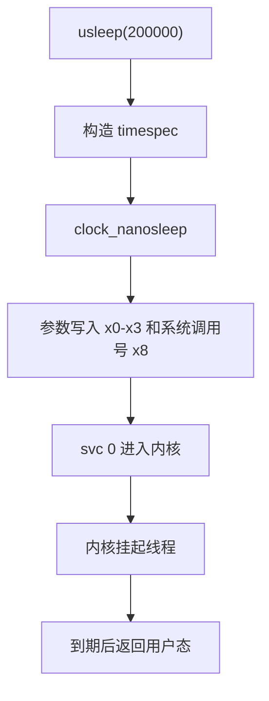
```mermaid
flowchart TD
    A["usleep(200000)"] --> B["构造 timespec"]
    B --> C["clock_nanosleep"]
    C --> D["参数写入 x0-x3 和系统调用号 x8"]
    D --> E["svc 0 进入内核"]
    E --> F["内核挂起线程"]
    F --> G["到期后返回用户态"]
```


### 5.3 vDSO 与 vvar

*(参考时间: 01:01)*

`gettimeofday` 的路径经过条件编译分支，进入 musl 的 `__vdsosym`：

```c
#ifdef VDSO_CGT_SYM
    if (!vdso_func) {
        vdso_func = __vdsosym(VDSO_CGT_VER, VDSO_CGT_SYM);
    }
#endif
```

进程地址空间中有两块特殊区域：

- **vDSO**：Virtual Dynamic Shared Object，内核提供的一小段用户态代码；
- **vvar**：内核维护的只读数据页，包含当前时间、CPU 信息等动态数据。

时钟中断会更新 vvar 中的计数器。用户程序读取 vvar，再调用 vDSO 中的代码完成换算，因此不需要陷入内核。

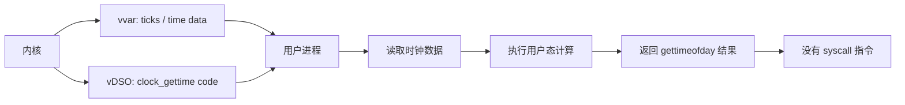
```mermaid
flowchart LR
    A["内核"] --> B["vvar: ticks / time data"]
    A --> C["vDSO: clock_gettime code"]
    B --> D["用户进程"]
    C --> D
    D --> E["读取时钟数据"]
    E --> F["执行用户态计算"]
    F --> G["返回 gettimeofday 结果"]
    G --> H["没有 syscall 指令"]
```

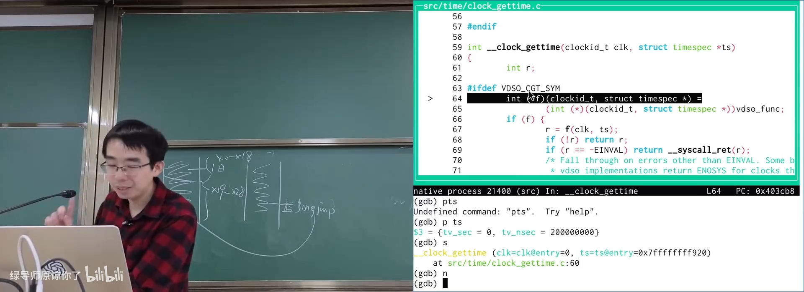

### 5.4 auxv 告诉 libc 去哪里找 vDSO

*(参考时间: 01:03)*

libc 怎么知道 vDSO 被映射在哪里？

答案仍在初始进程栈后面的 **auxiliary vector（auxv）**。内核在启动进程时放置 `AT_SYSINFO_EHDR` 等条目，musl 遍历 auxv 查找 vDSO 的 ELF program headers。

找到 vDSO 后，libc 像一个小型动态加载器一样：

1. 解析 ELF header；
2. 遍历 program headers；
3. 找到 dynamic segment；
4. 遍历动态符号表；
5. 查找 `__kernel_clock_gettime`；
6. 取得函数地址并缓存。

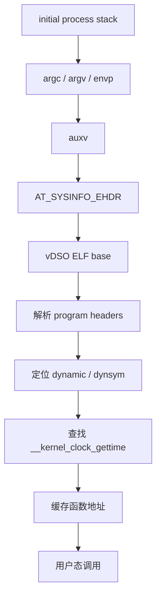
```mermaid
flowchart TD
    A["initial process stack"] --> B["argc / argv / envp"]
    B --> C["auxv"]
    C --> D["AT_SYSINFO_EHDR"]
    D --> E["vDSO ELF base"]
    E --> F["解析 program headers"]
    F --> G["定位 dynamic / dynsym"]
    G --> H["查找 __kernel_clock_gettime"]
    H --> I["缓存函数地址"]
    I --> J["用户态调用"]
```


### 5.5 时钟序列计数器与单步调试陷阱

*(参考时间: 01:05)*

解析到函数地址后，GDB 可以跳进 vDSO 的汇编代码。这里没有 `svc` 系统调用，却能从 vvar 得到正确时间。

让 AI 生成 GDB script，记录 `__kernel_clock_gettime` 的完整指令序列，会发现一个循环：

```text
读取 sequence counter
读取时钟数据
再次读取 sequence counter
如果两次计数器相同，数据有效
否则重试
```

```c
do {
    seq1 = read_seqcount();
    time = read_time_data();
    seq2 = read_seqcount();
} while (seq1 != seq2);
```

这是一种无锁的一致性检查。若读取过程中发生时钟更新，序列号会改变，用户态代码就重新读取。

单步调试时，每条指令之间延迟很大，时钟中断很容易夹在两次读取之间，于是 GDB 看起来陷入“死循环”。这并不表示 vDSO 代码错误，而是调试器的单步速度破坏了原本依赖短暂时间窗口的假设。

```mermaid
flowchart TD
    A["读取 tick 版本 seq1"] --> B["读取时钟数据"]
    B --> C["读取 tick 版本 seq2"]
    C --> D{"seq1 == seq2？"}
    D -- "是" --> E["数据一致，计算时间"]
    D -- "否" --> A
    E --> F["返回用户态调用者"]

    S["GDB 单步"] --> T["指令间延迟变大"]
    T --> U["时钟更新频繁插入"]
    U --> A
```

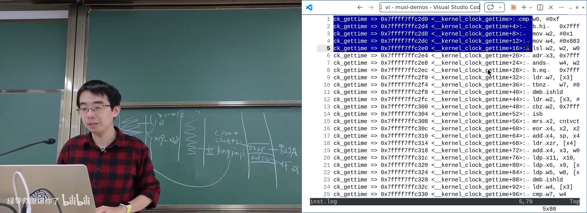

### 5.6 进程没有时间，但可以获得时间

*(参考时间: 01:09)*

`gettimeofday` 的例子给出一个重要结论：

> 系统调用语义不一定等于每次都必须执行机器级系统调用指令。

内核可以把一段安全、受控的实现映射进进程地址空间，由用户态直接执行。它仍然属于“操作系统提供的服务”，只是不经过传统的陷阱路径。

这也解释了若干现象：

- 游戏修改器的“变速齿轮”可以拦截时间相关调用；
- 性能优化会寻找可以避免内核切换的路径；
- vDSO 允许内核在保留抽象的同时缩短高频操作的路径。

```mermaid
flowchart TD
    A["应用请求时间"] --> B{"是否有可用 vDSO？"}
    B -- "否" --> C["syscall / svc 进入内核"]
    C --> D["内核读取时钟"]
    D --> E["返回用户态"]
    B -- "是" --> F["调用 vDSO"]
    F --> G["读取 vvar 数据"]
    G --> H["用户态计算"]
    E --> I["返回时间"]
    H --> I
```

---

## 6. `malloc` / `free`：在系统调用上搭内存分配器

### 6.1 API 很简单，约束却非常严格

*(参考时间: 01:11)*

`malloc` / `free` 的接口非常直观：

```c
void *ptr = malloc(n);
free(ptr);
```

它还要支持非常宽泛的需求：

- 可以申请很小的对象；
- 可以申请很大的对象；
- 标准甚至允许 `malloc(0)` 返回一个之后可以传给 `free` 的唯一指针；
- `calloc`、`realloc`、`aligned_alloc` 等接口可以在 `malloc` 之上实现。

但接口简单不代表语义简单。`malloc` 引入了一条跨函数、跨路径的协议：

- 每次成功分配最终必须恰好释放一次；
- `free` 后不能再使用该指针；
- 不能在释放后再次释放同一个指针；
- 指针可能被复制，所有权容易被误用；
- 并发程序中，一个线程释放对象的同一时刻，另一个线程可能仍在使用。

```c
int *p = malloc(sizeof(*p));
free(p);
*p = 42;  /* use-after-free，未定义行为 */
```

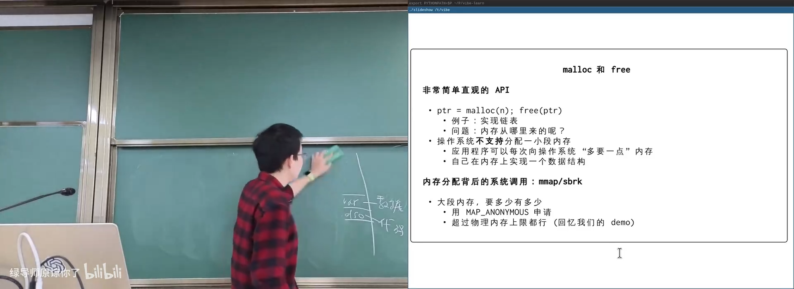

### 6.2 操作系统不分配任意小字节

*(参考时间: 01:12)*

进程向操作系统申请内存的主要接口是：

- `brk` / `sbrk`：移动数据段边界；
- `mmap` / `munmap`：映射或解除映射虚拟内存区域。

`mmap` 按页管理，常见页大小是 4 KiB。因此操作系统无法直接满足 `malloc(1)`、`malloc(7)` 这类任意大小的请求。

```mermaid
flowchart BT
    A["应用程序"] --> B["malloc / free"]
    B --> C["用户态分配器"]
    C --> D["mmap / munmap"]
    C --> E["brk / sbrk"]
    D --> F["内核虚拟内存"]
    E --> F
    F --> G["物理页 / swap"]
```

libc 需要自己维护一组较大的内存区域，再把其中小块切给应用：

```c
/* 思想示意，不是 libc 的真实实现。 */
void *malloc(size_t n) {
    if (n_is_large(n)) {
        return mmap_for_allocation(n);
    }
    return pop_small_block_from_pool(round_up(n));
}
```

```mermaid
flowchart TD
    A["malloc(n)"] --> B{"n 是否足够大？"}
    B -- "是" --> C["直接向内核 mmap"]
    B -- "否" --> D["从已有内存池查找空闲块"]
    D --> E{"找到足够大的块？"}
    E -- "是" --> F["切分并返回"]
    E -- "否" --> G["向内核申请新 region"]
    G --> D
```


### 6.3 十亿美元错误与所有权

*(参考时间: 01:14)*

Tony Hoare 曾把空引用称为自己的 **billion-dollar mistake**。它与手工内存管理有相似的风险：程序员必须维持一个编译器无法直接证明的全局不变量。

对比不同 API：

- `open` / `write` / `close`：语义相对局部，操作本身就是主要效果；
- `malloc` / `free`：要求在程序所有控制流路径上维持配对关系；
- `free` 之后，普通 C 指针仍保存旧地址，语言层面并不自动让它失效。

人们为此发展出多种机制：

- Java、JavaScript 等语言的垃圾回收；
- C++ 的 RAII；
- Rust 的 ownership、borrowing 与生命周期；
- 智能指针、引用计数、区域分配；
- 静态分析与运行时 sanitizer。

```mermaid
flowchart TD
    A["手工内存管理的所有权问题"] --> B["GC / managed runtime"]
    A --> C["C++ RAII"]
    A --> D["Rust ownership / borrowing"]
    A --> E["智能指针 / 引用计数"]
    A --> F["ASan / Valgrind / 静态分析"]
    B --> G["减少显式 free"]
    C --> H["作用域结束自动析构"]
    D --> I["编译期跟踪所有权"]
    E --> J["在类型中表达释放策略"]
    F --> K["发现 use-after-free / leak"]
```

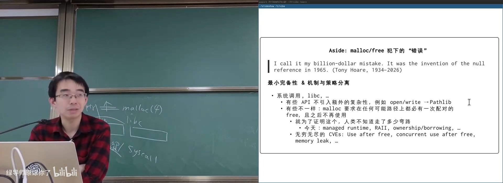

### 6.4 最直观的 malloc 作业方案

*(参考时间: 01:19)*

如果把 `malloc` 当数据结构题，最直接的设计是：

1. 大对象直接使用 `mmap`；
2. 每个较小的 `mmap` region 内部维护空闲区间集合；
3. 分配时寻找第一个足够大的区间；
4. 从区间中切出所需大小；
5. 释放时把区间重新插回集合；
6. 尽可能合并相邻空闲区间。

这自然导向区间树或平衡二叉搜索树：

```text
free_regions = { [addr, size], ... }

allocate(n):
    find first region with size >= n
    remove region
    split into allocated block + remaining free region

free(ptr):
    insert [ptr, size]
    merge with adjacent free regions
```

算法课容易给出平衡树答案，但它并不是现代高性能分配器的主要实现方式。原因是性能不只由查找复杂度决定，还取决于真实工作负载、局部性、并发伸缩和常见对象大小。

```mermaid
flowchart TD
    A["大对象"] --> B["mmap"]
    A --> C["小块分配"]
    C --> D["维护空闲区间集合"]
    D --> E["first fit"]
    E --> F["切分 / 删除"]
    F --> G["free 时插入 / 合并"]
    G --> H["平衡树是教材上的自然答案"]
```


---

## 7. 讲义延伸：真实 `malloc` 为什么不是一棵平衡树

> **编者说明**：以下内容来自官方讲义，但视频在课堂时间结束前没有完整展开。为保持课程材料的完整性和术语一致，本节单独标为讲义延伸，不与课堂原话混在一起。

### 7.1 1995 年的综述：先理解真实工作负载

官方讲义推荐 Paul Wilson 等人的 1995 年动态内存管理综述：

- [Dynamic Storage Allocation: A Survey and Critical Review](http://jyywiki.cn/OS/manuals/malloc-survey.pdf)

其中已经指出，讨论分配器算法前，必须先理解真实程序行为。隔离空闲链表（segregated free lists）等思想早在 1964 年就出现了。多年后的新论文仍然在围绕真实 workload 调整性能和策略。

```mermaid
flowchart LR
    A["真实程序行为"] --> B["对象大小分布"]
    A --> C["生命周期分布"]
    A --> D["并发访问模式"]
    B --> E["分配器 design space"]
    C --> E
    D --> E
    E --> F["策略与数据结构选择"]
```

### 7.2 观察：小对象多，大对象读写频繁

讲义给出一组经验观察：

- 大对象通常被写入和读取很多次，后续访问量应远大于对象大小；
- 若申请 16 MiB，只扫描一次就释放，往往说明程序存在 performance bug；
- 小对象创建频繁，可能生命周期很短；
- 中、大对象和容器往往存活更久；
- 所有处理器都会发生分配和回收，因此小对象路径的 scalability 非常关键。

如果把所有小对象都放进一个带全局锁的区间树，多核扩展性会很差。

### 7.3 Fast path 与 slow path

讲义借用《思考，快与慢》的两套思维系统，把分配器拆为：

- Fast path：速度极快，覆盖大多数常见分配；
- Slow path：不追求极限速度，但处理复杂情况并回退到 `mmap`。

```mermaid
flowchart TD
    A["malloc 请求"] --> B["Fast path"]
    B --> C{"本地缓存命中？"}
    C -- "是" --> D["O(1) 分配完成"]
    C -- "否" --> E["Slow path"]
    E --> F["从全局池补充"]
    F --> G{"池中内存不足？"}
    G -- "是" --> H["mmap 新 region"]
    G -- "否" --> I["切分 / 组织 slab"]
    H --> I
    I --> D
```

### 7.4 Segregated lists、slab 与 O(1) 回收

空间换简洁的典型方案是 slab 分配器：

- 每个 slab 中的对象大小固定；
- 每个线程为若干常见对象大小维护本地缓存；
- 小对象分配走线程本地 fast path；
- 不足时从全局 slab 补充；
- 释放通常只需把对象放回对应空闲链表，可达到 O(1)。

```mermaid
flowchart LR
    A["Thread 0"] --> B["8B slab cache"]
    A --> C["16B slab cache"]
    A --> D["32B slab cache"]
    E["Thread 1"] --> F["8B slab cache"]
    E --> G["16B slab cache"]
    B --> H["共享 page / region"]
    C --> H
    D --> H
    F --> H
    G --> H
```

延伸阅读：

- [Mimalloc: Free List Sharding in Action](https://www.microsoft.com/en-us/research/uploads/prod/2019/06/mimalloc-tr-v1.pdf)
- [Cross Container Attack](https://dl.acm.org/doi/abs/10.5555/3620237.3620571)
- [SOSP 2023/2024-era allocator work](https://dl.acm.org/doi/10.1145/3620666.3651350)

### 7.5 理论与现实的边界

现实分配器通常不针对恶意 worst case 设计，而是针对正常程序行为优化。这给了拒绝服务攻击机会，也意味着：

> 脱离 workload 做优化没有意义。

性能问题需要先回答：

- 哪些对象大小最常见？
- 它们在什么处理器上分配？
- 生命周期多长？
- 多线程共享程度如何？
- 分配路径中的哪个环节成为瓶颈？

AI 时代的变化不是丢掉机制，而是可以更快地在更大的 design space 中搜索策略。机制仍然是舞台，策略可以从启发式升级为由模型驱动的决策。

```mermaid
flowchart TD
    A["Mechanism：数据结构、原子操作、mmap、线程本地缓存"] --> B["Design space"]
    C["Policy：大小分类、阈值、回收时机"] --> B
    B --> D["AI / 实验搜索策略"]
    D --> E["真实 workload 评测"]
    E --> F{"性能是否改善？"}
    F -- "是" --> G["保留策略"]
    F -- "否" --> D
```

---

## 8. 总结：libc 的隐藏角落

这一讲从调试信息开始，逐层观察了 C Runtime 和 libc 中最容易被忽略的机制：

- `-g` 不只是“能看源码”，它把 DWARF 字节码、地址范围和变量位置写进二进制；
- `.symtab` 可以做函数级近似定位，DWARF 才能恢复语句、类型和优化后的状态；
- Source Map 把类似能力带入浏览器沙盒，同时也带来源码与供应链泄漏风险；
- `_start` 从 Initial Process Stack 恢复 `argc`、`argv`、`envp` 和 auxv；
- `__init_libc` 负责 `environ`、vDSO 和运行时状态；
- `printf` 把 `va_list` 与文件描述符封装连接起来；
- `setjmp` / `longjmp` 的“刷漆实验”揭示了 caller-saved 与 callee-saved 寄存器；
- `gettimeofday` 通过 vDSO 与 vvar 在用户态读取时间，不执行 `syscall`；
- `malloc` 在页级系统调用之上管理小对象，并引入跨路径的配对释放约束；
- 高性能分配器依赖真实 workload、fast/slow path、线程本地缓存和 slab。

libc 屏蔽了几乎所有指令集、ABI 和系统调用差异，但它的抽象层内部仍然充满机器相关代码。只有到调试器、汇编和真实 workload 这一层，才能看到这层“看不见的基础设施”究竟如何工作。

```mermaid
flowchart BT
    A["机器指令 / ABI / 系统调用"] --> B["C Runtime"]
    B --> C["libc 函数与运行时状态"]
    C --> D["malloc / stdio / setjmp / 时间接口"]
    D --> E["跨平台应用代码"]
    E --> F["完整应用生态"]

    G["DWARF / GDB / vDSO"] --> B
    G --> C
    G --> D
```

---

## 附：官方参考与延伸阅读

以下链接来自官方讲义第 10 讲及课堂内容：

- [DWARF Debugging Standard](https://dwarfstd.org/)
- [musl debugging demos](https://jyywiki.cn/OS/demos/virtualization/musl-demos)
- [Perfetto](https://perfetto.dev/)
- [Claude Code Source Map](https://github.com/hangsman/claude-code-source/blob/main/cli.js.map)
- [Claude Code reverse-engineering project](https://github.com/oboard/claude-code-rev)
- [Dynamic Storage Allocation: A Survey and Critical Review](http://jyywiki.cn/OS/manuals/malloc-survey.pdf)
- [Mimalloc: Free List Sharding in Action](https://www.microsoft.com/en-us/research/uploads/prod/2019/06/mimalloc-tr-v1.pdf)
- [Cross Container Attack](https://dl.acm.org/doi/abs/10.5555/3620237.3620571)
- [Modern allocator research](https://dl.acm.org/doi/10.1145/3620666.3651350)

官方课程资料：

- [课程主页](https://jyywiki.cn/OS/2026/)
- [第 10 讲讲义：C 标准库和实现 (2)](https://jyywiki.cn/OS/2026/lect10.md)
- [视频：10 - 调试 C 标准库](https://www.bilibili.com/video/BV1yu9cBCEAb/)

> **版权与署名**：本讲课程材料由蒋炎岩（jyy）编写。课程讲义与幻灯片采用 [Creative Commons BY-NC 4.0](http://creativecommons.org/licenses/by-nc/4.0/) 许可；本电子书保留课程出处、作者署名与许可说明。
