# 链接和加载：从 ELF 到动态链接的完整路径

> **课程**：2026 春季学期《操作系统原理》  
> **讲师**：蒋炎岩（jyy）  
> **官方课程主页**：<https://jyywiki.cn/OS/2026/>  
> **官方讲义**：<https://jyywiki.cn/OS/2026/lect11.md>  
> **视频来源**：[Bilibili BV1CoDzB5Eey](https://www.bilibili.com/video/BV1CoDzB5Eey/)  
> **版权说明**：课程讲义与幻灯片归蒋炎岩所有，采用 [Creative Commons BY-NC 4.0](http://creativecommons.org/licenses/by-nc/4.0/) 许可；本电子书是对课堂讲授的书面化重构，保留出处与许可说明。

## 导语：可执行文件到底是什么

*(参考时间: 00:00)*

前面的课程一直在讨论：如何从系统调用构建 libc，再从 libc 构建普通应用。这一讲回到应用运行之前的关键一步：

> 可执行文件如何描述一个进程的初始内存状态，操作系统又如何把它加载起来？

在学习操作系统之前，很多人会把它理解为“双击后弹出窗口的东西”。进入操作系统视角后，**可执行文件实际上是一个普通文件对象**：

- 它有字节序列，可以用 `cat`、十六进制编辑器或文本编辑器查看；
- 通常以 ELF 魔数 `0x7f 'E' 'L' 'F'` 开头；
- 它描述代码、数据、只读内容和其它段应该被映射到进程地址空间的哪些位置；
- 它还可能包含符号表、重定位信息、调试信息和动态链接器路径。


```mermaid
flowchart LR
    A["普通文件对象"] --> B["字节序列"]
    B --> C["ELF / a.out / 其它格式"]
    C --> D["描述段、权限、入口与重定位"]
    D --> E["execve 创建进程初始状态"]
    E --> F["第一条用户态指令开始执行"]
```

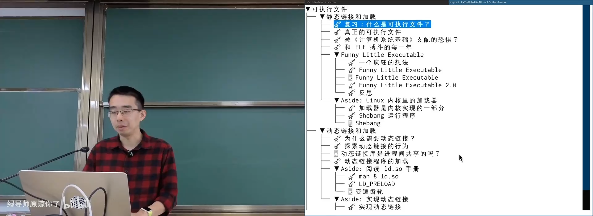

---

## 1. 从 `a.out` 到 ELF

### 1.1 可执行文件描述进程初始状态

*(参考时间: 00:02)*

观察 `/bin/ls`：

```bash
file /bin/ls
xxd -l 64 /bin/ls
readelf -h /bin/ls
```

输出会显示：

```text
ELF 64-bit LSB executable
```

ELF 文件头前面的字节通常是：

```text
7f 45 4c 46
```

小端机器按字节显示为 `7f 45 4c 46`，而 `45 4c 46` 正是 ASCII 的 `ELF`。

从内核角度看，`execve(path, argv, envp)` 会：

1. 读取 `path` 对应的文件；
2. 判断文件格式；
3. 建立新的用户态地址空间；
4. 把代码、数据等映像按要求映射到地址空间；
5. 在初始栈上布置 `argc`、`argv`、`envp` 和 auxiliary vector；
6. 把 PC 设置为程序入口，再把控制权交给用户态。

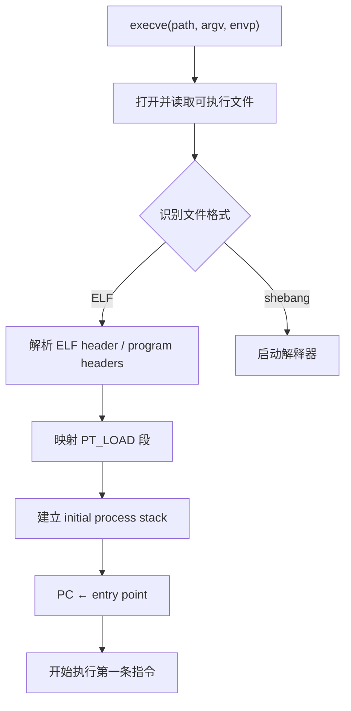
```mermaid
flowchart TD
    A["execve(path, argv, envp)"] --> B["打开并读取可执行文件"]
    B --> C{"识别文件格式"}
    C -- "ELF" --> D["解析 ELF header / program headers"]
    C -- "shebang" --> E["启动解释器"]
    D --> F["映射 PT_LOAD 段"]
    F --> G["建立 initial process stack"]
    G --> H["PC ← entry point"]
    H --> I["开始执行第一条指令"]
```

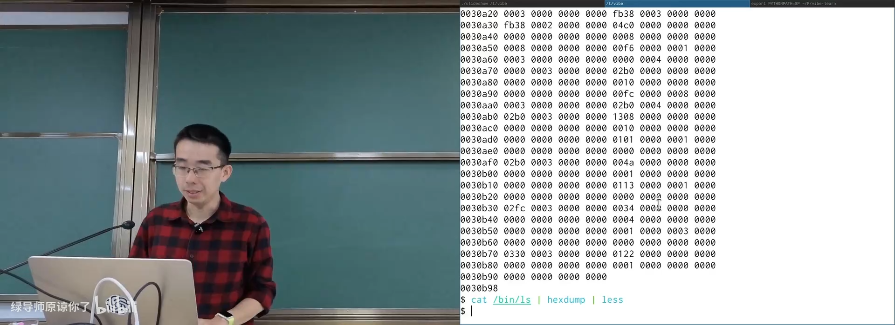

### 1.2 UNIX `a.out` 的极简结构

*(参考时间: 00:04)*

早期 UNIX 使用 `a.out` 格式，其中 `a` 来自 **assembler output**。FreeBSD 手册中还能看到相近的定义：

```c
struct exec {
    uint32_t a_midmag;  /* Machine ID & Magic */
    uint32_t a_text;    /* Text segment size */
    uint32_t a_data;    /* Data segment size */
    uint32_t a_bss;     /* BSS segment size */
    uint32_t a_syms;    /* Symbol table size */
    uint32_t a_entry;   /* Entry point */
    uint32_t a_trsize;  /* Text reloc table size */
    uint32_t a_drsize;  /* Data reloc table size */
};
```

`a.out` 的代码和数据没有显式加载地址，位置通常由系统平台约定。它也缺少后来的许多能力：

- 动态链接；
- 调试信息；
- 复杂的对齐要求；
- thread-local storage；
- 更灵活的段权限和加载布局。

所有复杂格式都是从简单格式逐渐演化出来的。ELF 不是凭空出现，而是为了满足这些不断增长的需求。


```mermaid
flowchart LR
    A["a.out: 代码 / 数据 / BSS / 符号 / 入口"] --> B["平台固定加载位置"]
    B --> C["静态链接"]
    C --> D["新增动态链接、调试、TLS、对齐和安全需求"]
    D --> E["ELF"]
```


### 1.3 ELF 为什么让人痛苦

*(参考时间: 00:07)*

System V ABI 定义了：

- 进程初始化；
- 初始进程栈；
- 目标文件格式；
- 段、节、符号和重定位语义。

ELF 极其强大，但设计取向是机器效率：

- 紧致的 bitfield；
- 大量基于 offset 的索引；
- 字符串与引用它的结构经常不在相邻位置；
- 节、段和符号之间交叉引用；
- 权限使用 bit 组合表示。

例如符号表中的一个符号可能只保存：

```text
name_offset = 4587
```

真正的名字 `_start` 位于文件另一个字符串表中。机器只需要计算 `base + offset`，但人类要不断来回跳转。

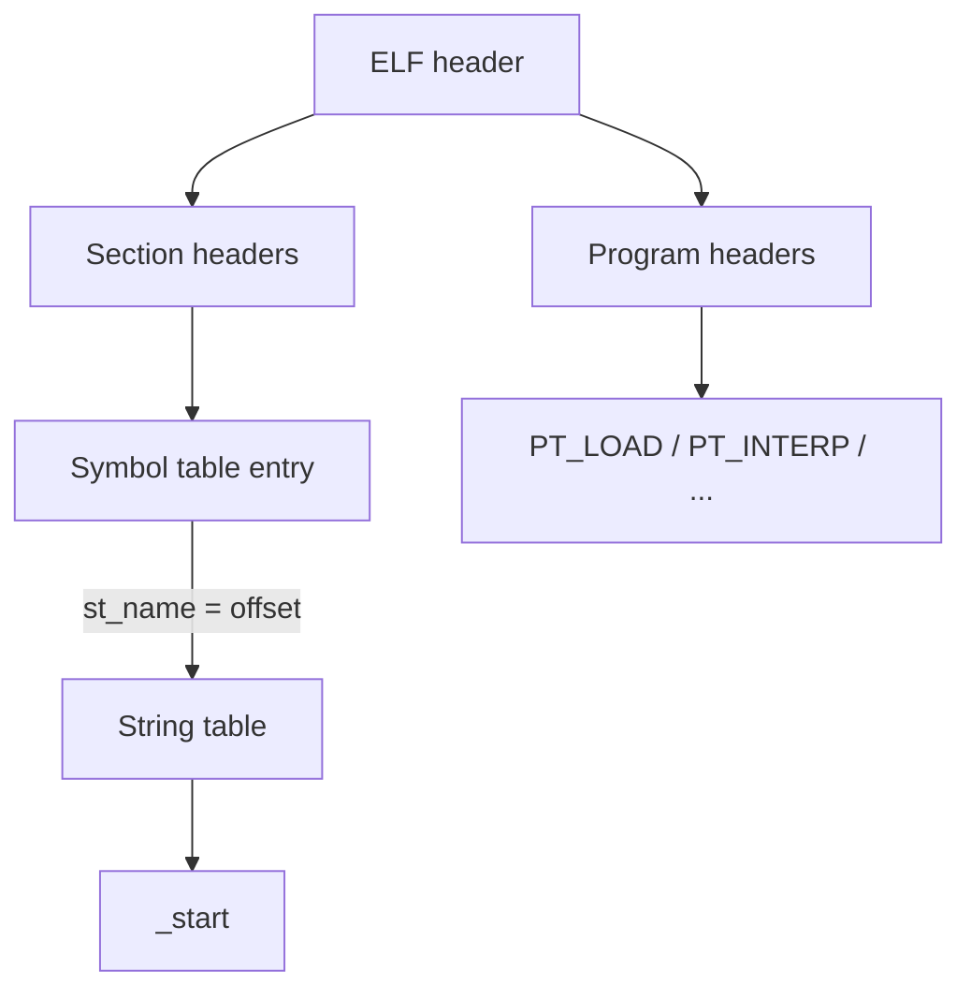
```mermaid
flowchart TD
    A["ELF header"] --> B["Section headers"]
    B --> C["Symbol table entry"]
    C -->|"st_name = offset"| D["String table"]
    D --> E["_start"]
    A --> F["Program headers"]
    F --> G["PT_LOAD / PT_INTERP / ..."]
```

这种“信息不立即出现”的结构让教学和复习都相当困难。问题不只是学生读不懂，任课教师也常觉得内容讲不完。ELF 面向机器而非人类阅读者，这正是后来 FLE 实验想解决的痛点。

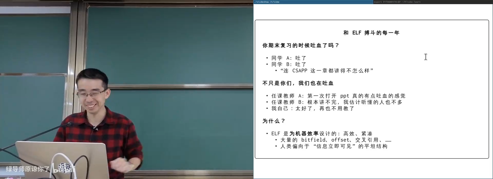

---

## 2. FLE：把 ELF 换成人类可读的等价描述

### 2.1 “等价描述之间可以转换”

*(参考时间: 00:12)*

ELF 本质上只是一个描述：

- 基本属性：版本、体系结构、格式类型；
- 内存布局：哪些数据加载到什么位置、拥有什么权限；
- 链接信息：符号、重定位和导出定义；
- 辅助信息：调试信息、注释和其它元数据。

因此，完全可以把 ELF 转换为另一种等价格式，再实现自己的加载器：

1. 把 ELF 转为人类可读的 JSON、Markdown、图形或自定义 DSL；
2. 在其中直接表示代码、数据和重定位；
3. 实现一个能够加载这种格式的 loader；
4. 用已知程序验证运行结果。

这就是 **Funny Little Executable（FLE）** 的出发点。


```mermaid
flowchart LR
    A["ELF 二进制描述"] --> B["语义等价的自定义格式"]
    B --> C["FLE compiler / linker"]
    C --> D["FLE loader"]
    D --> E["进程初始内存状态"]
    E --> F["验证程序行为"]
```

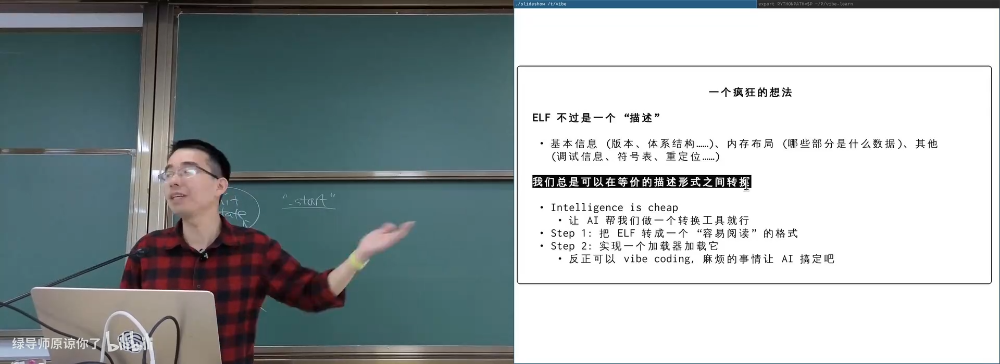

### 2.2 JSON 与可视化

FLE 早期把二进制内容表示为 JSON：符号、代码、导入导出和重定位都直接放在一起。它还引入 emoji 和视觉标记，使阅读者能迅速辨认不同结构。

讲师提到自己多年来一直在改进 FLE。随着 AI 可以生成实现代码，设计者需要做的更多是：

- 提出一个好的表示形式；
- 明确链接器与加载器的语义；
- 识别哪些复杂度可以被描述形式消除；
- 设计验证程序。

```json
{
  "type": "executable",
  "symbols": {
    "_start": 15
  },
  "instructions": [
    "mov ...",
    "syscall"
  ]
}
```

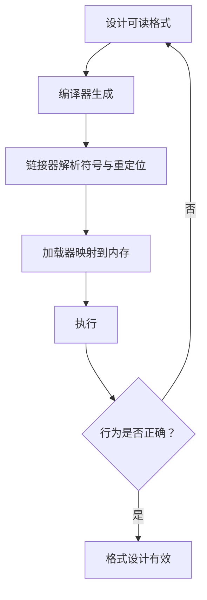
```mermaid
flowchart TD
    A["设计可读格式"] --> B["编译器生成"]
    B --> C["链接器解析符号与重定位"]
    C --> D["加载器映射到内存"]
    D --> E["执行"]
    E --> F{"行为是否正确？"}
    F -- "否" --> A
    F -- "是" --> G["格式设计有效"]
```

### 2.3 用 Markdown 写可执行文件

*(参考时间: 00:18)*

如果重新设计，可以直接用 Markdown：

````markdown
# ELF [class=64 endian=le osabi=sysv machine=x86_64 type=ET_DYN pie=true entry=_start]

## PT_LOAD [flags=R|X align=0x1000]

### .text [type=PROGBITS flags=A|X align=16]

_start:
    48 c7 c0 01 00 00 00          # mov rax,1   ; sys_write
    48 c7 c7 01 00 00 00          # mov rdi,1   ; fd=1
    48 8d 35 {pcrel32: msg - . - 4}  # lea rsi,[rip+msg]
    48 c7 c2 {u32: msg_end - msg} # mov rdx,len
    0f 05                         # syscall

## PT_LOAD [flags=R align=0x1000]

### .rodata [type=PROGBITS flags=A|R align=16]

_msg:
    48 65 6c 6c 6f 2c 20 4d 44 21 0a   # "Hello, MD!\n"
````

重定位不再只是神秘的 `R_X86_64_PC32`，而是直观表达式：

```text
pcrel32: msg - . - 4
```

它表示：在当前位置留出一个四字节字段，链接完成后填入 `msg - . - 4` 的值。

这就是链接的核心之一：**符号确定位置后，把需要的数值填入指定位置。**

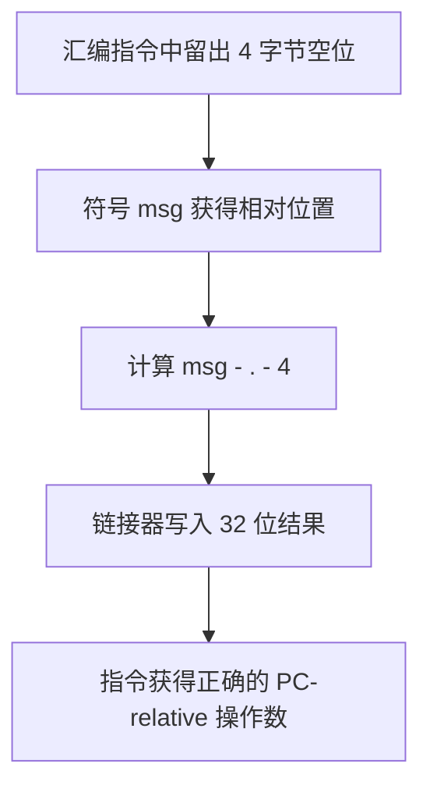
```mermaid
flowchart TD
    A["汇编指令中留出 4 字节空位"] --> B["符号 msg 获得相对位置"]
    B --> C["计算 msg - . - 4"]
    C --> D["链接器写入 32 位结果"]
    D --> E["指令获得正确的 PC-relative 操作数"]
```

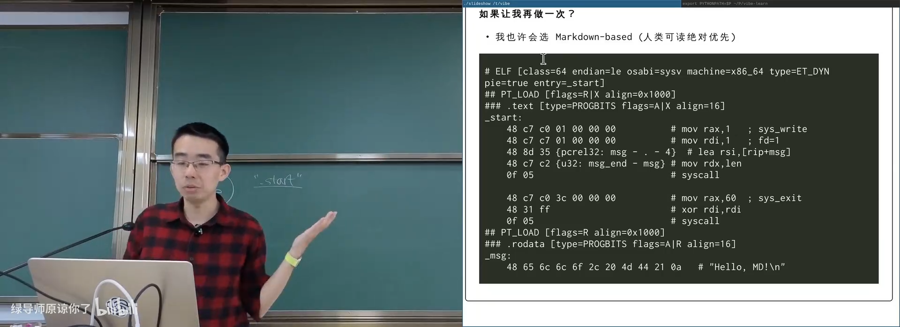

### 2.4 AI 时代的知识组织

*(参考时间: 00:23)*

讲师进一步反思：过去的教学大量投入在构造可视化、调试和解释工具上，而现在这些工具可以通过 prompt 和 AI 快速生成。

新的学习重点变成：

- 知道问题是什么；
- 知道有哪些可转换的表示形式；
- 构建知识网络，把概念联系到一起；
- 提出可以验证的假设；
- 使用 AI 探索设计空间；
- 通过程序真实运行结果确认结论。

只要“链接和加载”这一概念被准确理解，具体格式既可以是 JSON、Markdown，也可以是 SVG 图形。程序最终是否真的打印出 `Hello`，是对整个工具链最直接的验证。

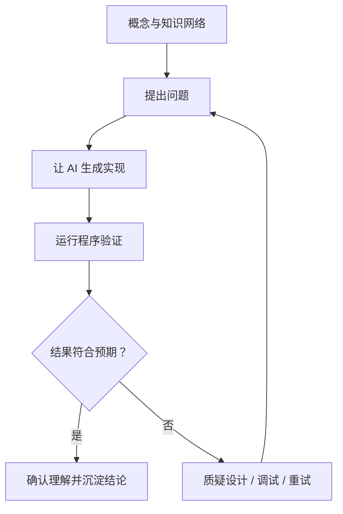
```mermaid
flowchart TD
    A["概念与知识网络"] --> B["提出问题"]
    B --> C["让 AI 生成实现"]
    C --> D["运行程序验证"]
    D --> E{"结果符合预期？"}
    E -- "是" --> F["确认理解并沉淀结论"]
    E -- "否" --> G["质疑设计 / 调试 / 重试"]
    G --> B
```

### 2.5 重定位：留空，再填数

*(参考时间: 00:24)*

在对象文件中定义一个外部符号：

```c
extern int x;

int f(void) {
    x = 1;
    return 0;
}
```

编译：

```bash
cc -c a.c -o a.o
readelf -r a.o
readelf -a a.o
```

对象文件中的指令可能先把地址字段留为 0：

```text
0000000000000000 R_AARCH64_ADR_PREL_PG_HI21  x
0000000000000000 R_AARCH64_ADD_ABS_LO12_NC   x
```

链接器在确定 `x` 的最终位置后，重新计算并把结果填进去。


```mermaid
flowchart LR
    A["编译 a.c"] --> B["指令中预留地址位"]
    B --> C["生成 relocation entry"]
    C --> D["链接器读取符号表"]
    D --> E["确定 x 的地址"]
    E --> F["回填指令字段"]
    F --> G["可执行文件可运行"]
```


---

## 3. Linux 内核中的加载器

### 3.1 `binfmt_elf.c`

*(参考时间: 00:29)*

加载器不是用户态库，而是内核中 `execve` 实现的一部分。Linux 源码中：

- `fs/binfmt_elf.c` 负责加载 ELF；
- `fs/binfmt_script.c` 负责 shebang 脚本；
- 每个 `binfmt` 模块注册自己能够识别的文件特征。

`binfmt_elf.c` 中可以看到课堂上讲过的所有概念：

- ELF header 验证；
- program header 遍历；
- `PT_LOAD` 映射；
- initial process stack；
- `argc`、`argv`、`envp`；
- auxiliary vector；
- interpreter 和动态链接相关入口。

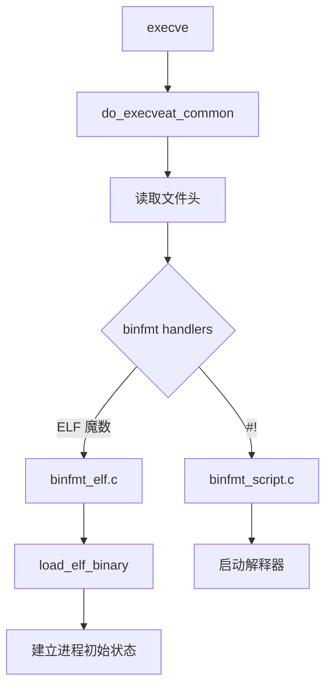
```mermaid
flowchart TD
    A["execve"] --> B["do_execveat_common"]
    B --> C["读取文件头"]
    C --> D{"binfmt handlers"}
    D -- "ELF 魔数" --> E["binfmt_elf.c"]
    D -- "#!" --> F["binfmt_script.c"]
    E --> G["load_elf_binary"]
    F --> H["启动解释器"]
    G --> I["建立进程初始状态"]
```

Linux 有数万个源文件，但 AI 能够根据具体问题按需读取和关联代码。课堂展示了它读取 `binfmt_elf.c` 后，继续追踪 `create_elf_tables()`、`AT_SYSINFO_EHDR`、vDSO 和相关架构宏的过程。


```mermaid
flowchart LR
    A["目标程序入口"] --> B["load_elf_binary"]
    B --> C["验证 ELF 与 program headers"]
    C --> D["映射 PT_LOAD 段"]
    D --> E["create_elf_tables"]
    E --> F["在栈上布置 argc / argv / envp"]
    F --> G["布置 auxv"]
    G --> H["设置入口 PC"]
```

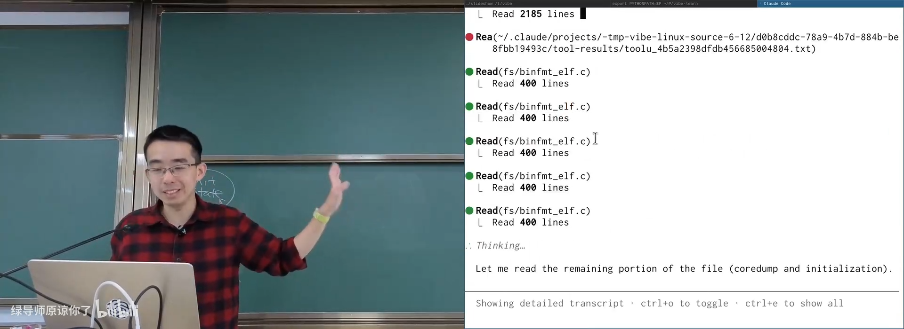

### 3.2 Shebang：文本文件为何可执行

*(参考时间: 00:36)*

如果一个脚本以：

```sh
#!/bin/bash
echo hello
```

开头，并拥有执行权限：

```bash
chmod +x a.sh
./a.sh
```

内核无法把普通文本当作机器码执行。`binfmt_script` 会识别前两个字节 `#!`，然后：

1. 读取第一行剩余部分；
2. 找到解释器路径；
3. 把脚本文件作为解释器的参数再次执行。

```c
/* Linux binfmt_script 的核心判断。 */
if (buf[0] != '#' || buf[1] != '!') {
    return -ENOEXEC;
}
```

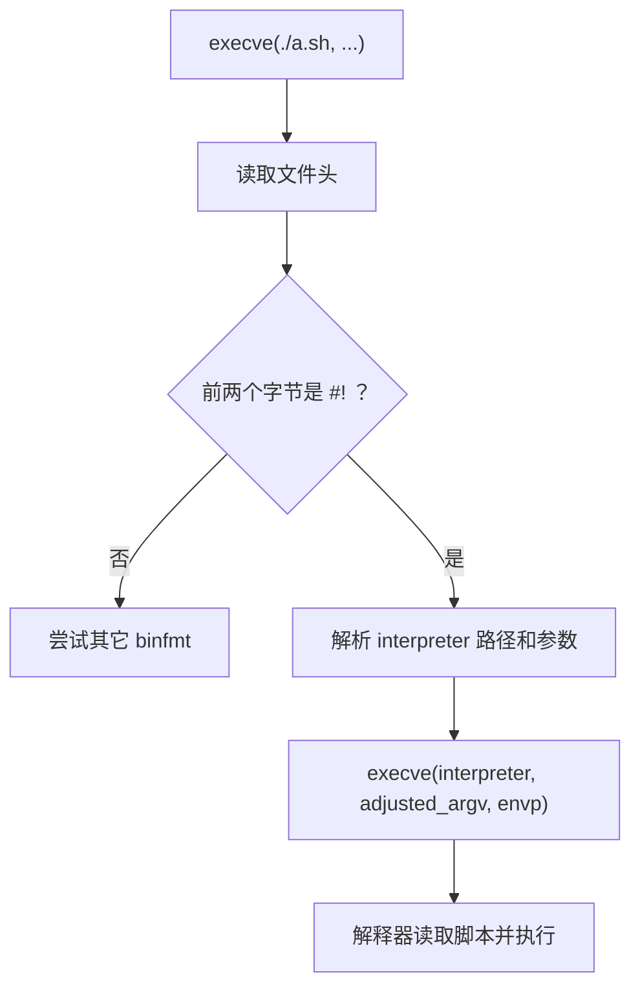
```mermaid
flowchart TD
    A["execve(./a.sh, ...)"] --> B["读取文件头"]
    B --> C{"前两个字节是 #! ？"}
    C -- "否" --> D["尝试其它 binfmt"]
    C -- "是" --> E["解析 interpreter 路径和参数"]
    E --> F["execve(interpreter, adjusted_argv, envp)"]
    F --> G["解释器读取脚本并执行"]
```


### 3.3 Shebang 的参数如何拼接

*(参考时间: 00:39)*

假设脚本 `S` 第一行是：

```text
#!A B C
```

执行：

```bash
./S x y
```

Linux 会近似转换为：

```c
execve(
    "A",
    (char *[]){"A", "B C", "./S", "x", "y", NULL},
    envp
);
```

注意 Linux 会把 shebang 第一行解释器之后的整个部分 `"B C"` 当成一个参数，而脚本路径 `./S` 再插到它后面。

POSIX 没有完全规定这个细节。macOS 等 BSD 系统会把 `B` 和 `C` 拆成两个参数，因此跨平台脚本不应依赖这一点。

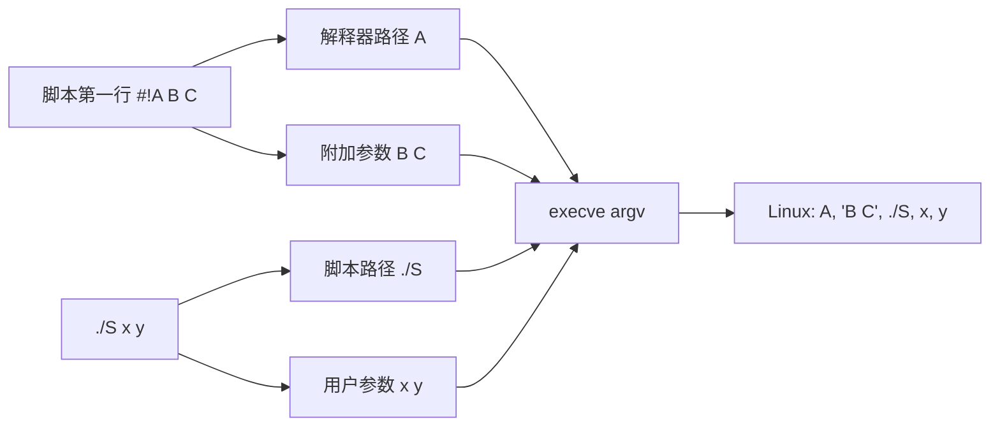
```mermaid
flowchart LR
    A["脚本第一行 #!A B C"] --> B["解释器路径 A"]
    A --> C["附加参数 B C"]
    D["./S x y"] --> E["脚本路径 ./S"]
    D --> F["用户参数 x y"]
    B --> G["execve argv"]
    C --> G
    E --> G
    F --> G
    G --> H["Linux: A, 'B C', ./S, x, y"]
```

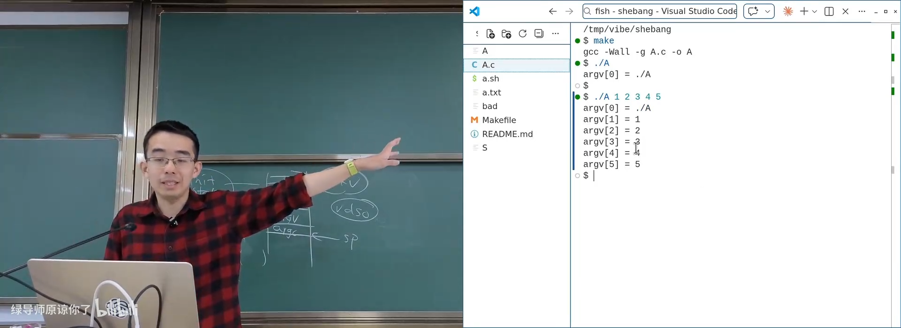

### 3.4 静态链接到此结束

*(参考时间: 00:43)*

静态链接程序的加载过程可以总结为：

- 内核解析 ELF；
- 映射所有需要的段；
- 建立 initial process stack；
- 跳到静态链接的 `_start`；
- 由 C Runtime 初始化并调用 `main`。

问题出现在库规模增长以后：如果系统有数千个程序，每个都复制一份 libc，就会浪费磁盘空间，安全更新也必须重新链接所有程序。

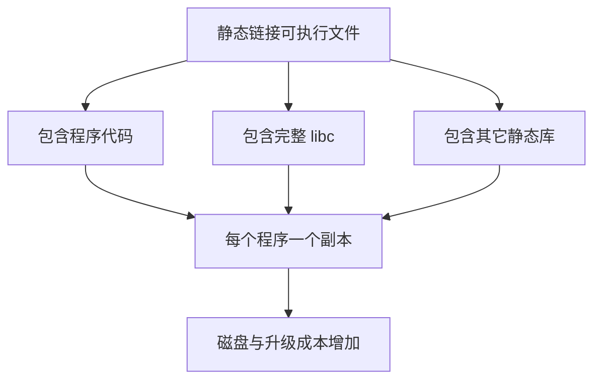
```mermaid
flowchart TD
    A["静态链接可执行文件"] --> B["包含程序代码"]
    A --> C["包含完整 libc"]
    A --> D["包含其它静态库"]
    B --> E["每个程序一个副本"]
    C --> E
    D --> E
    E --> F["磁盘与升级成本增加"]
```

---

## 4. 为什么需要动态链接

### 4.1 共享库减少磁盘和更新成本

*(参考时间: 00:44)*

动态链接把应用代码与运行库拆开：

```text
app
 +-- libc.so
 +-- libm.so
 +-- libreadline.so
 +-- libjvm.so
```

系统级共享库可以只保留一个副本，并且只要保持 ABI 兼容，就能独立升级。大型项目也能被分解成多个 `.so` 模块。

课程以 NEMU 类比：把模拟器编译成 `libnemu.so`，外部框架像“主板”一样把它加载起来，CPU 模块与其它外设模块通过动态库接口协作。

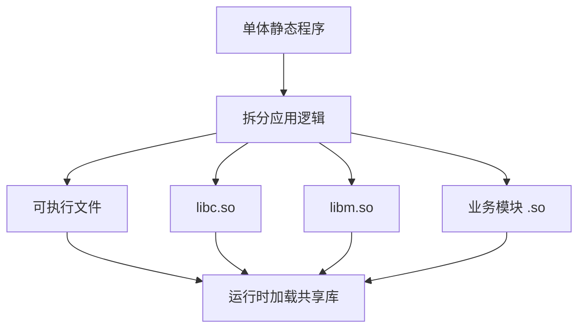
```mermaid
flowchart TD
    A["单体静态程序"] --> B["拆分应用逻辑"]
    B --> C["可执行文件"]
    B --> D["libc.so"]
    B --> E["libm.so"]
    B --> F["业务模块 .so"]
    C --> G["运行时加载共享库"]
    D --> G
    E --> G
    F --> G
```

### 4.2 `/proc/<pid>/maps` 中的共享库

*(参考时间: 00:47)*

查看某个进程：

```bash
pmap <pid>
cat /proc/<pid>/maps
```

可以看到：

- 可执行文件自身的代码段与数据段；
- `libc.so`；
- `libgcc_s.so`；
- `libpcre2` 等依赖库；
- vDSO；
- 动态链接器。

同一个 `.so` 在不同进程地址空间中的虚拟地址可以不同，也可以指向相同的物理页面。

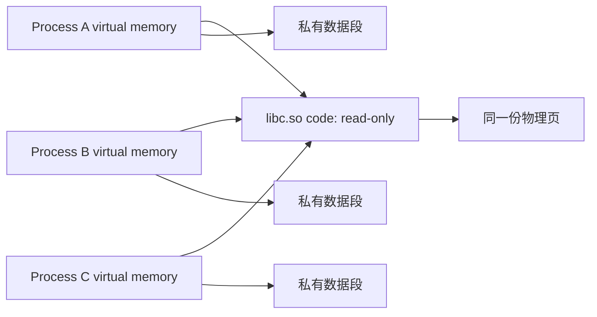
```mermaid
flowchart LR
    A["Process A virtual memory"] --> X["libc.so code: read-only"]
    B["Process B virtual memory"] --> X
    C["Process C virtual memory"] --> X
    X --> P["同一份物理页"]
    A --> DA["私有数据段"]
    B --> DB["私有数据段"]
    C --> DC["私有数据段"]
```

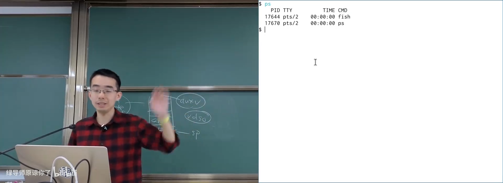

### 4.3 用 `bloat()` 验证内存共享

*(参考时间: 00:49)*

为验证动态链接库确实共享物理内存，课程构造了一个极端的实验：

- 用内联汇编生成大量 NOP；
- 把它们编译进 `libbloat.so`；
- 在 AArch64 上，一条 NOP 占 4 字节；
- 生成约 40 MB 的共享库；
- 编写 `sample`，通过 `dlopen` 加载并调用 `bloat()`。

```c
void *handle = dlopen("./libbloat.so", RTLD_NOW);

typedef void (*bloat_fn)(void);
bloat_fn bloat = (bloat_fn)dlsym(handle, "bloat");

bloat();
printf("bloat at %p\n", (void *)bloat);
```

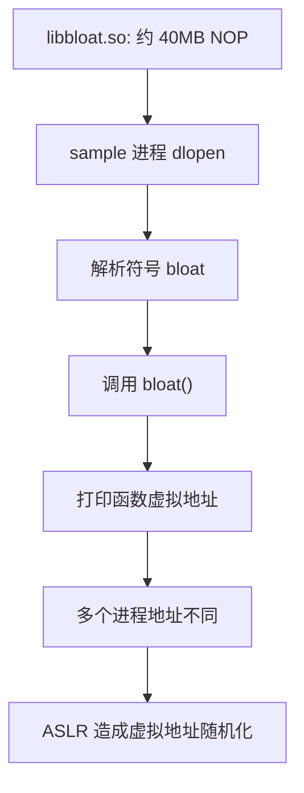
```mermaid
flowchart TD
    A["libbloat.so: 约 40MB NOP"] --> B["sample 进程 dlopen"]
    B --> C["解析符号 bloat"]
    C --> D["调用 bloat()"]
    D --> E["打印函数虚拟地址"]
    E --> F["多个进程地址不同"]
    F --> G["ASLR 造成虚拟地址随机化"]
```


### 4.4 启动 1000 个进程

*(参考时间: 00:51)*

如果每个进程都复制 40 MB，1000 个进程需要约 40 GB 物理内存。实验机器只有 8 GB，却成功运行 1000 个 `sample` 进程。

系统内存占用保持正常，说明只读的库代码页确实被多个进程共享。


```mermaid
flowchart TD
    A["启动 sample 1000 次"] --> B["每个进程映射 libbloat.so"]
    B --> C["只读代码页指向同一物理页面"]
    C --> D["物理内存不会按 40GB 线性增长"]
    D --> E["证明动态库代码页共享"]
```

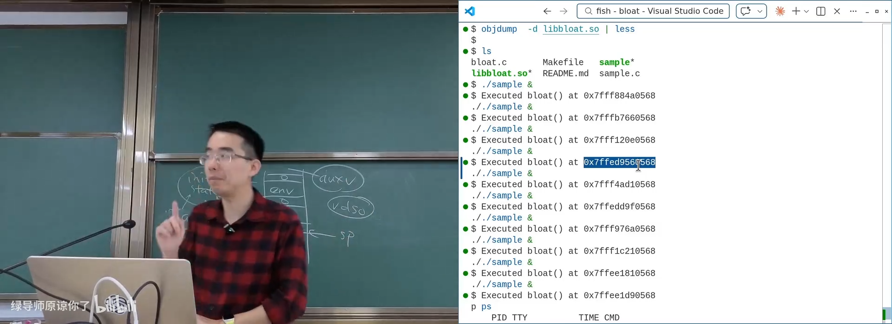

### 4.5 `lsof` 与 `/proc` 的实现关系

*(参考时间: 00:53)*

查看一个库被哪些进程映射：

```bash
lsof libbloat.so
```

可以找到约 1000 个进程，其中额外一项可能是 `lsof` 自己短暂打开的引用。

`lsof` 的实现并不神秘。它扫描：

```text
/proc/<pid>/maps
/proc/<pid>/fd/
/proc/<pid>/...
```

找到进程打开或映射的文件。这与课程中遍历 procfs 实现进程、管道和文件描述符工具的路线完全一致。

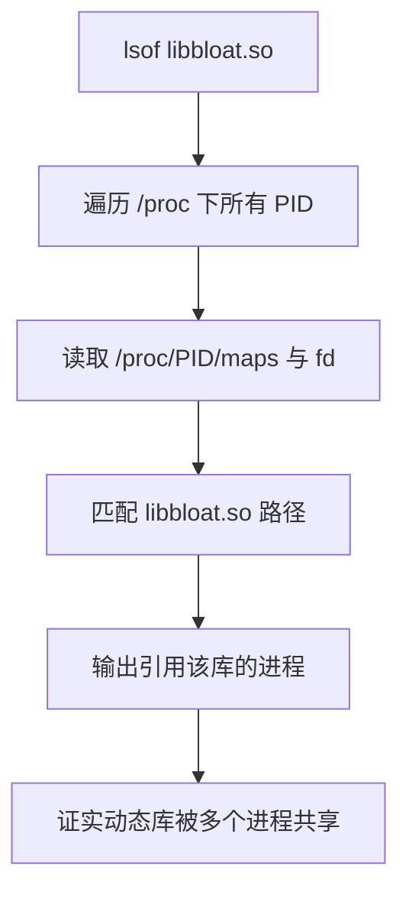
```mermaid
flowchart TD
    A["lsof libbloat.so"] --> B["遍历 /proc 下所有 PID"]
    B --> C["读取 /proc/PID/maps 与 fd"]
    C --> D["匹配 libbloat.so 路径"]
    D --> E["输出引用该库的进程"]
    E --> F["证实动态库被多个进程共享"]
```


---

## 5. 动态链接程序的加载

### 5.1 先有鸡还是先有蛋

*(参考时间: 00:57)*

静态链接程序的 ELF entry 指向 `_start`，而 `_start` 来自 `crt1.o`。随后它调用 `__libc_start_main`，后者再运行 `main`。

动态链接产生三个相互依赖的问题：

1. 程序需要 `_start`，但 `_start` 位于运行时对象；
2. `_start` 要调用动态库中的 `__libc_start_main`；
3. 在动态库尚未加载时，这个函数根本不存在。

答案就是动态链接器解释器。

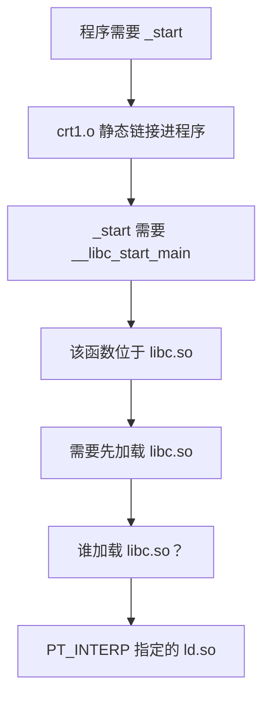
```mermaid
flowchart TD
    A["程序需要 _start"] --> B["crt1.o 静态链接进程序"]
    B --> C["_start 需要 __libc_start_main"]
    C --> D["该函数位于 libc.so"]
    D --> E["需要先加载 libc.so"]
    E --> F["谁加载 libc.so？"]
    F --> G["PT_INTERP 指定的 ld.so"]
```

### 5.2 `PT_INTERP` 指向动态链接器

*(参考时间: 00:58)*

查看动态链接程序：

```bash
readelf -l ./a.out | grep interpreter
```

可以看到：

```text
[Requesting program interpreter: /lib/ld-musl-aarch64.so.1]
```

glibc 程序通常使用：

```text
/lib64/ld-linux-x86-64.so.2
```

ELF 文件中的 `PT_INTERP` 只是一段字符串。内核读取它，把对应文件也映射进进程，然后把初始 PC 设置为动态链接器的入口。

```mermaid
flowchart TD
    A["动态链接 ELF"] --> B["PT_INTERP 字符串"]
    B --> C["内核打开 interpreter"]
    C --> D["映射 ld.so"]
    D --> E["PC ← ld.so entry"]
    E --> F["ld.so 加载依赖库"]
    F --> G["跳回程序 _start"]
```

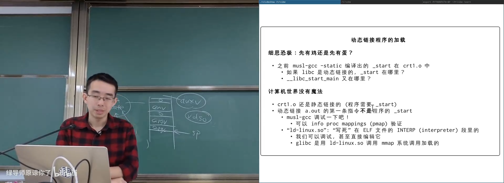

### 5.3 第一条指令不属于程序

*(参考时间: 01:00)*

使用 GDB：

```bash
gdb ./a.out
(gdb) starti
```

对动态链接程序，`starti` 停在动态链接器的 `_dl_start`，不是程序自身的 `_start`。

此时：

- 程序自身的段已经被映射；
- `ld.so` 已经被内核映射；
- `libc.so` 和 C++ 运行库等依赖通常还没有全部加载；
- `ld.so` 接管 initial process stack 中的 `argc`、`argv`、`envp` 和 auxv。

```mermaid
flowchart LR
    A["内核映射主程序"] --> B["内核映射 PT_INTERP"]
    B --> C["PC = ld.so entry"]
    C --> D["_dl_start"]
    D --> E["解析依赖库"]
    E --> F["重定位符号"]
    F --> G["调用程序 _start"]
```


### 5.4 修改 `PT_INTERP` 测试加载流程

*(参考时间: 01:04)*

课程直接编辑 ELF 中的 interpreter 字符串，把 `ld-musl-aarch64.so.1` 改成不存在的 `ld-musl-aarch65.so.1`。

结果：

```text
No such file or directory
```

随后创建一个指向真实 musl loader 的同名符号链接，程序又可以运行。

这说明动态链接器路径完全是可验证的文件系统数据，不是某种隐藏魔法。

```mermaid
flowchart TD
    A["原 PT_INTERP: ld-musl-aarch64.so.1"] --> B["程序正常运行"]
    C["修改为 ld-musl-aarch65.so.1"] --> D["解释器文件不存在"]
    D --> E["execve 失败"]
    F["创建 aarch65 符号链接"] --> G["文件路径重新有效"]
    G --> H["程序恢复运行"]
```


### 5.5 动态链接器加载完整依赖

*(参考时间: 01:06)*

在 `starti` 时查看：

```gdb
info proc mappings
```

glibc 程序的映射中已经有：

- 主程序；
- vDSO；
- `ld-linux.so`；
- 初始栈。

但 `libc.so` 还没映射。在程序 `_start` 处打断点并 `continue` 后，再次查看 mappings，就能看到 `libc.so` 已被加载。

```mermaid
flowchart TD
    A["初始 PC 位于 ld.so"] --> B["mappings: 主程序 + ld.so + vDSO"]
    B --> C["ld.so 解析 DT_NEEDED"]
    C --> D["加载 libc.so 等依赖"]
    D --> E["建立 GOT / 重定位"]
    E --> F["跳转到程序 _start"]
    F --> G["mappings 中已有 libc.so"]
```

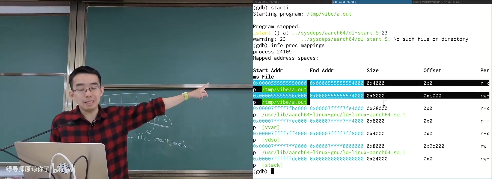

### 5.6 最小初始状态

*(参考时间: 01:08)*

在动态链接程序第一条指令执行时，进程状态可以精确描述为：

- initial process stack，包含 `argc`、`argv`、`envp` 和 auxv；
- 主程序需要加载的段；
- `PT_INTERP` 指定的动态链接器；
- vDSO 和内核辅助数据；
- 当前 PC 位于动态链接器入口。

除此之外，没有别的用户态代码被预先加载。动态链接器随后负责构造完整程序。

```mermaid
flowchart TD
    A["第一条用户态指令之前"] --> B["Initial Process Stack"]
    A --> C["Program PT_LOAD segments"]
    A --> D["Dynamic Loader from PT_INTERP"]
    A --> E["vDSO / auxv"]
    A --> F["PC = ld.so entry"]
    B --> G["开始动态链接"]
    C --> G
    D --> G
    E --> G
    F --> G
```


---

## 6. `ld.so` 手册：动态链接工具金矿

*(参考时间: 01:09)*

`man 8 ld.so` 详细记录了动态链接器行为：

- **`LD_LIBRARY_PATH`**：追加共享库搜索路径；
- **`LD_BIND_NOW`**：启动时解析全部符号，关闭延迟绑定；
- **`LD_DEBUG`**：输出库加载、符号解析和重定位等调试信息；
- **`LD_SHOW_AUXV`**：打印内核传递的 auxiliary vector；
- **`LD_PRELOAD`**：在普通依赖之前预加载共享库。

```mermaid
flowchart LR
    A["ld.so manual"] --> B["搜索路径策略"]
    A --> C["符号绑定策略"]
    A --> D["调试输出"]
    A --> E["auxv 展示"]
    A --> F["LD_PRELOAD 符号覆盖"]
```

### 6.1 `LD_DEBUG=libs`

*(参考时间: 01:12)*

```bash
LD_DEBUG=libs ls
LD_DEBUG=libs code
```

输出会显示程序加载的所有共享库，包括启动时不容易注意到的依赖。

```mermaid
flowchart TD
    A["LD_DEBUG=libs ls"] --> B["ld.so 打印搜索路径"]
    B --> C["加载 DT_NEEDED 依赖"]
    C --> D["输出每次 find / load / init"]
    D --> E["辅助诊断缺失库与版本问题"]
```


### 6.2 `ldd`

*(参考时间: 01:12)*

```bash
ldd /bin/ls
ldd /usr/bin/gcc
```

`ldd` 会模拟动态加载器，递归解析程序依赖，并展示每个需要的共享库最终对应哪个文件。

```mermaid
flowchart LR
    A["ELF 可执行文件"] --> B["读取 DT_NEEDED"]
    B --> C["模拟 ld.so 搜索"]
    C --> D["递归处理依赖"]
    D --> E["输出所需共享库列表"]
```


### 6.3 `LD_SHOW_AUXV`

*(参考时间: 01:14)*

```bash
LD_SHOW_AUXV=1 ls
```

辅助向量中常见字段包括：

- `AT_SYSINFO_EHDR`：vDSO 地址；
- `AT_RANDOM`：随机数种子地址；
- `AT_PHDR`：ELF program headers 地址；
- `AT_ENTRY`：程序入口；
- `AT_BASE`：动态链接器基址。

每次运行，vDSO 地址和随机数都会变化，这正是 ASLR 的结果。

```mermaid
flowchart TD
    A["内核准备 auxv"] --> B["AT_SYSINFO_EHDR: vDSO"]
    A --> C["AT_RANDOM: 随机种子"]
    A --> D["AT_PHDR: program headers"]
    A --> E["AT_ENTRY: 程序入口"]
    A --> F["AT_BASE: 动态链接器基址"]
    B --> G["ld.so / libc 读取 auxv"]
    C --> G
    D --> G
    E --> G
    F --> G
```


---

## 7. `LD_PRELOAD`：动态链接的 Hook 机制

### 7.1 先到先得与符号覆盖

*(参考时间: 01:16)*

动态链接器解析一个未定义符号时，会按加载顺序查找已加载对象：

> 第一个提供该符号的对象胜出。

`LD_PRELOAD` 让指定共享库先于通常依赖被加载。因此，只要它定义了同名符号，就能覆盖后续库中的实现。

```mermaid
flowchart TD
    A["程序引用 printf"] --> B["ld.so 搜索已加载对象"]
    B --> C{"LD_PRELOAD 提供 printf？"}
    C -- "是" --> D["绑定到预加载实现"]
    C -- "否" --> E["继续搜索 libc"]
    E --> F["绑定 libc printf"]
```


### 7.2 Hook 仍然调用原实现

可以用 `dlsym(RTLD_NEXT, ...)` 找到下一个同名实现：

```c
#define _GNU_SOURCE
#include <dlfcn.h>
#include <time.h>

typedef time_t (*time_fn)(time_t *);

time_t time(time_t *loc) {
    static time_fn real_time;
    if (!real_time) {
        real_time = (time_fn)dlsym(RTLD_NEXT, "time");
    }

    puts("time() intercepted");
    return real_time(loc);
}
```

这既是覆盖，也是 hook：

- 调用者仍得到原函数语义；
- 可以在前后插入日志、修改参数或修改返回值；
- 不需要重新编译目标程序。

```mermaid
flowchart LR
    A["目标程序调用 time"] --> B["预加载 time hook"]
    B --> C["记录 / 修改参数"]
    C --> D["dlsym(RTLD_NEXT) 获取原 time"]
    D --> E["调用真正的 time"]
    E --> F["记录 / 修改返回值"]
    F --> G["返回调用者"]
```

### 7.3 变速齿轮：改变应用对时间的感知

*(参考时间: 01:17)*

时间相关程序最终依赖若干 API：

- `gettimeofday`；
- `clock_gettime`；
- `usleep` / `nanosleep`；
- `alarm`；
- `select` / `poll` 的超时参数。

通过 `LD_PRELOAD` 覆盖这些函数，可以维护一个虚拟时间轴：

```text
real_elapsed = real_now - real_start
virtual_elapsed = real_elapsed * speed_factor
virtual_now = virtual_start + virtual_elapsed
```

程序请求睡眠时，把睡眠时间除以倍率；程序读取时间时，返回缩放后的虚拟时间。于是程序认为自己正常运行，实际却以更高速度前进。

```mermaid
flowchart TD
    A["启动时记录真实时间与虚拟时间"] --> B["应用调用时间函数"]
    B --> C{"读取时间还是等待？"}
    C -- "读取时间" --> D["按倍率计算虚拟当前时间"]
    C -- "sleep / timeout" --> E["真实等待时间除以倍率"]
    D --> F["返回虚拟时间"]
    E --> G["提前返回"]
    F --> H["应用观察到加快的时间轴"]
    G --> H
```

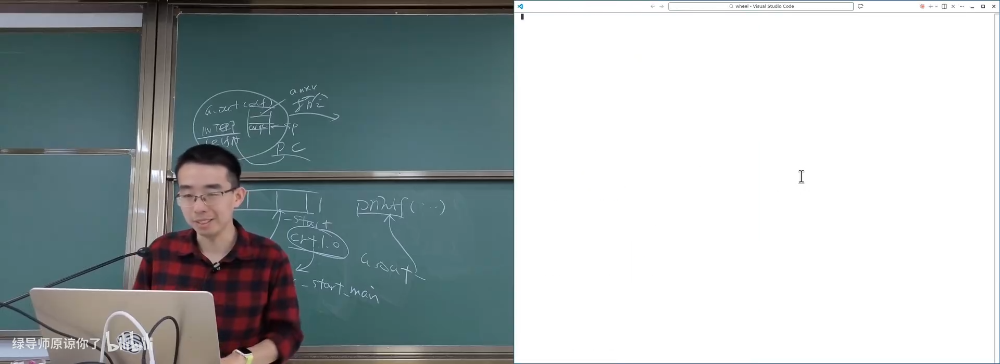

### 7.4 贪吃蛇与 `cmatrix`

*(参考时间: 01:19)*

运行：

```bash
LD_PRELOAD=./libwheel.so ./n-snake
LD_PRELOAD=./libwheel.so ./cmatrix
sleep 1
LD_PRELOAD=./libwheel.so sleep 1
```

贪吃蛇明显变快，`cmatrix` 的字符下落速度也接近十倍。原程序没有重新编译，只是动态链接时的符号绑定发生了变化。

```mermaid
flowchart LR
    A["原程序"] --> B["LD_PRELOAD=libwheel.so"]
    B --> C["时间 API 绑定到 hook"]
    C --> D["snake 变快"]
    C --> E["cmatrix 变快"]
    C --> F["sleep 1 约 0.1 秒返回"]
```


### 7.5 其它 Hook 场景

*(参考时间: 01:21)*

`LD_PRELOAD` 还能用于：

- 覆盖 `malloc` / `free`，记录分配与释放轨迹；
- 劫持 `rand()` 或随机种子，控制“随机”结果；
- 包装文件或网络 API，实现非侵入式日志；
- 覆盖图形交换函数，研究渲染与游戏行为；
- 在测试中注入错误、延迟或特定返回值。

```mermaid
flowchart TD
    A["LD_PRELOAD"] --> B["内存 API: malloc/free"]
    A --> C["随机 API: rand/srand"]
    A --> D["文件 API: open/read/write"]
    A --> E["时间 API: clock/sleep"]
    A --> F["图形 API: swap buffers"]
    B --> G["追踪 / 注入 / 行为修改"]
    C --> G
    D --> G
    E --> G
    F --> G
```

---

## 8. PLT 与 GOT：动态链接如何完成跳转

### 8.1 近跳转无法覆盖整个地址空间

*(参考时间: 01:22)*

编译器通常会为函数调用生成 PC-relative 跳转：

- AArch64 `bl` 的立即数约 26 位，范围约 ±128 MiB；
- x86-64 `call rel32` 的范围约 ±2 GiB；
- 对象文件中未解析符号会先留下 0 或占位值。

如果 `f()` 与 `main()` 在同一可执行文件中，链接器能算出正确相对距离。

但 `printf()` 位于共享库，运行时地址未知，而且可能落在超出近跳转范围的位置。

```mermaid
flowchart TD
    A["编译器生成 call printf"] --> B["需要 32 位 / 26 位 PC-relative 位移"]
    B --> C{"printf 是否在链接时可确定？"}
    C -- "是" --> D["链接器直接回填"]
    C -- "否" --> E["需要间接跳转机制"]
    E --> F["Procedure Linkage Table (PLT)"]
```

### 8.2 PLT 与 GOT

*(参考时间: 01:24)*

动态链接程序把调用转换为：

```asm
call printf@plt
```

`printf@plt` 是一小段 trampoline。典型逻辑是：

```asm
printf@plt:
    jmp *printf@got(%rip)
```

`GOT` 是 Global Offset Table，保存动态链接器在运行时解析出的真实地址。

```mermaid
flowchart LR
    A["main call printf@plt"] --> B["PLT entry"]
    B --> C["读取 GOT[printf]"]
    C --> D["获得 printf 真实地址"]
    D --> E["跳转到 libc printf"]
    F["ld.so 运行时重定位"] --> C
```

首次调用时还可能经过动态链接器解析；使用 now binding 或解析完成表已经被回填后，通常只需 PLT 查表并跳转。

```mermaid
sequenceDiagram
    participant App as main
    participant PLT as printf@plt
    participant GOT as GOT
    participant Loader as ld.so
    participant Libc as libc printf
    App->>PLT: call printf@plt
    PLT->>GOT: read printf address
    alt 尚未解析
        GOT-->>PLT: resolver trampoline
        PLT->>Loader: resolve printf
        Loader->>GOT: write real address
    end
    PLT->>Libc: jump
    Libc-->>App: return
```

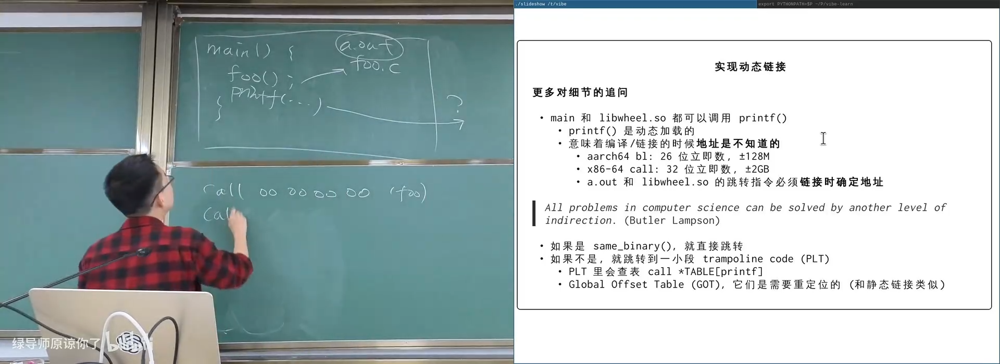

### 8.3 数据不能像代码一样“两级跳转”

*(参考时间: 01:27)*

函数调用可以用 PLT 间接跳转，但数据访问更麻烦：

```c
extern int x;

x = 1;
```

如果 `x` 与代码在同一共享对象中，编译器可以生成一条直接的 store：

```asm
movl $1, x(%rip)
```

如果 `x` 可能来自另一个共享对象，地址在加载时才知道，只能先查 GOT：

```asm
mov x@GOTPCREL(%rip), %rax
movl $1, (%rax)
```

这就是 `-fPIC` 下外部数据访问通常需要多一层间接寻址的原因。它保证位置无关，但会带来性能和代码大小成本。

```mermaid
flowchart TD
    A["写 extern int x"] --> B{"x 是否在同一共享对象且本地绑定？"}
    B -- "是" --> C["mov $1, x(%rip)"]
    B -- "否 / 默认 PIC" --> D["从 GOT 读取 x 地址"]
    D --> E["mov $1, (address)"]
    F["hidden visibility"] --> G["允许编译器省略间接层"]
```


### 8.4 一层间接解决不了，就再加一层

动态链接中的核心模式是 **indirection**：

- 函数调用通过 PLT 间接跳转；
- 真实函数地址放在 GOT；
- 外部数据地址也可能放在 GOT；
- 动态链接器负责在加载时重定位这些表。

```mermaid
flowchart BT
    A["程序代码"] --> B["PLT / GOT"]
    B --> C["运行时真实地址"]
    C --> D["共享库代码或数据"]
    E["ld.so"] --> F["解析符号"]
    F --> G["重定位 GOT"]
    G --> B
```

---

## 9. 总结：从文件到运行中的进程

这一讲把可执行文件、链接和加载串成了一条完整路径：

- 可执行文件是文件对象，也是进程初始状态的描述；
- `a.out` 展示早期静态格式的简单性；
- ELF 为机器效率设计，强大但复杂；
- FLE 证明二进制格式可以在等价描述之间转换；
- Linux 内核通过 `binfmt_elf.c` 加载 ELF；
- `binfmt_script.c` 实现 shebang 和解释器启动；
- 动态链接减少磁盘、内存和更新成本；
- 大量进程可以共享同一个共享库的只读代码页；
- 动态链接程序第一条指令来自 `PT_INTERP` 指定的 `ld.so`；
- `ld.so` 加载依赖、重定位符号，然后调用程序 `_start`；
- `LD_DEBUG`、`LD_SHOW_AUXV` 和 `ldd` 让动态链接过程可观察；
- `LD_PRELOAD` 通过符号绑定顺序实现强大的 hook；
- PLT 与 GOT 用间接层解决远地址和运行时重定位问题。

```mermaid
flowchart LR
    A["ELF 文件"] --> B["内核 execve"]
    B --> C["映射主程序"]
    C --> D["映射 PT_INTERP: ld.so"]
    D --> E["ld.so 加载依赖库"]
    E --> F["重定位 PLT / GOT"]
    F --> G["跳转到程序 _start"]
    G --> H["C Runtime"]
    H --> I["main"]
    I --> J["运行中的进程"]
```

可执行文件不是一个封闭的黑盒。它是一组关于内存布局、入口、符号和重定位的声明；加载器、动态链接器和运行时共同把这些声明变成真实进程。理解这条链条之后，很多看似神奇的机制，例如脚本执行、共享库内存节省、动态调试和 `LD_PRELOAD` 外挂，都能被还原为可以观察、验证和实现的具体步骤。

---

## 附：官方参考与延伸阅读

以下链接来自官方讲义第 11 讲及课堂内容：

- [FreeBSD `a.out(5)` manual](https://man.freebsd.org/cgi/man.cgi?a.out(5))
- [System V ABI](https://jyywiki.cn/OS/manuals/sysv-abi.pdf)
- [Funny Little Executable](https://jyywiki.cn/OS/demos/virtualization/fle)
- [Andrej Karpathy’s LLM Wiki gist](https://gist.github.com/karpathy/442a6bf555914893e9891c11519de94f)
- [Linux `fs/binfmt_elf.c`](https://elixir.bootlin.com/linux/latest/source/fs/binfmt_elf.c)
- [Linux `fs/binfmt_script.c`](https://elixir.bootlin.com/linux/latest/source/fs/binfmt_script.c)
- [CVE-2024-46826](https://cvefeed.io/vuln/detail/CVE-2024-46826)
- [Shebang demo](https://jyywiki.cn/OS/demos/virtualization/shebang)
- [Dynamic linking and bloat demo](https://jyywiki.cn/OS/demos/virtualization/bloat)
- [Time-speed hook demo](https://jyywiki.cn/OS/demos/virtualization/wheel)
- [Semantic Versioning](https://semver.org)

阅读材料：

- *Operating Systems: Three Easy Pieces* 第 17 章，Free Space Management；
- 选读第 18 至 23 章，虚拟内存、分页、TLB、交换与完整 VM 系统。

官方课程资料：

- [课程主页](https://jyywiki.cn/OS/2026/)
- [第 11 讲讲义：链接和加载](https://jyywiki.cn/OS/2026/lect11.md)
- [视频：11 - 链接和加载](https://www.bilibili.com/video/BV1CoDzB5Eey/)

> **版权与署名**：本讲课程材料由蒋炎岩（jyy）编写。课程讲义与幻灯片采用 [Creative Commons BY-NC 4.0](http://creativecommons.org/licenses/by-nc/4.0/) 许可；本电子书保留课程出处、作者署名与许可说明。
