# 从零开始构建 Linux 应用世界：从 initramfs 到应用生态

> **课程**：2026 春季学期《操作系统原理》，Hacking Day  
> **讲师**：蒋炎岩（jyy）  
> **官方课程主页**：<https://jyywiki.cn/OS/2026/>  
> **官方讲义**：<https://jyywiki.cn/OS/2026/lect12.md>  
> **视频来源**：[Bilibili BV17JDWBsEMi](https://www.bilibili.com/video/BV17JDWBsEMi/)  
> **版权说明**：课程讲义与幻灯片归蒋炎岩所有，采用 [Creative Commons BY-NC 4.0](http://creativecommons.org/licenses/by-nc/4.0/) 许可；本电子书是对课堂讲授的书面化重构，保留出处与许可说明。  
> **字幕说明**：平台未提供字幕，本稿由本地 faster-whisper `large-v3` 转写后结合官方讲义校订。

## 导语：操作系统如何长出一个世界

*(参考时间: 00:00)*

这一讲是虚拟化部分的收束，也是一次“寻根”：

- 前面已经观察了进程、地址空间、文件描述符、libc、链接和加载；
- `execve` 的本质是把可执行文件描述的内存状态加载进进程；
- 动态链接程序的 PC 初始指向解释器，随后由 `ld.so` 补齐依赖；
- 可执行文件、运行时库和参数最终构成一个确定的进程初始状态。

接下来要回答两个更大的问题：

1. 这些系统调用从哪里来？
2. 操作系统加载了第一个进程之后，应用世界如何生长起来？


```mermaid
flowchart LR
    A["系统调用与进程状态"] --> B["exe / ld.so / libc"]
    B --> C["第一个用户态进程"]
    C --> D["文件系统与设备对象"]
    D --> E["Shell 与核心工具集"]
    E --> F["包管理与应用生态"]
```

课程的目标可以概括为：

> 阅读手册，指导 AI 写代码，验证任何系统调用为什么这样设计，并观察它如何支撑整个应用生态。

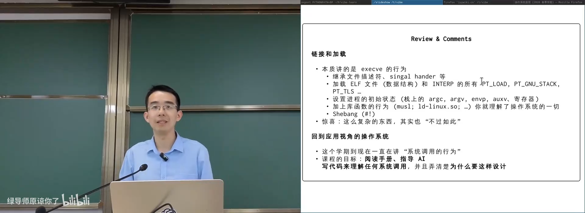

---

## 1. 从 UNIX 到 Linux：伟大系统都从零开始

### 1.1 早期 UNIX 甚至没有 `fork`

*(参考时间: 00:05)*

推荐阅读 Dennis Ritchie 的：

- [Evolution of the UNIX Time-Sharing System](https://read.seas.harvard.edu/~kohler/class/aosref/ritchie84evolution.pdf)

最早的 UNIX Shell 没有现代意义的 `fork`。运行外部程序时，它大致会：

1. 关闭不再需要的文件；
2. 把标准输入、输出、错误连接到终端；
3. 用当时的加载器把程序代码装入内存；
4. 执行程序；
5. 程序退出后，Shell 自身再被重新加载。

那时一台终端上可能只在 Shell 和当前程序之间来回切换。后来，Ken Thompson 等人用很少的汇编实现进程复制，形成了后来 `fork` / `exec` 模型的雏形。

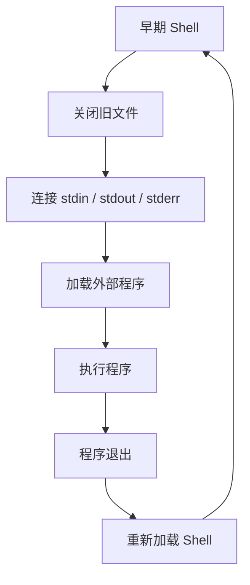
```mermaid
flowchart TD
    A["早期 Shell"] --> B["关闭旧文件"]
    B --> C["连接 stdin / stdout / stderr"]
    C --> D["加载外部程序"]
    D --> E["执行程序"]
    E --> F["程序退出"]
    F --> G["重新加载 Shell"]
    G --> A
```


```mermaid
flowchart LR
    A["简单进程状态"] --> B["复制代码与数据"]
    B --> C["27 行汇编实现 fork 思想"]
    C --> D["Shell 可保留自身，等待子进程"]
    D --> E["fork + exec 模型"]
```

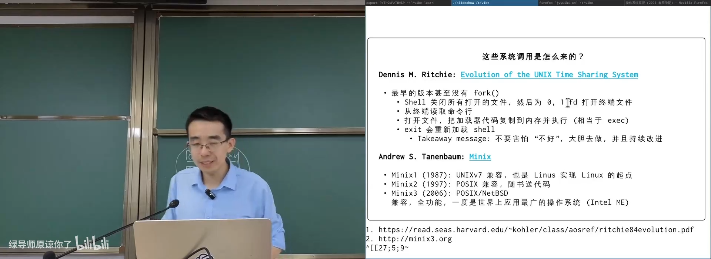

### 1.2 Minix：完整却为教学而设计

*(参考时间: 00:08)*

Andrew S. Tanenbaum 编写了 MINIX：

- 1987 年的 MINIX 1 与 UNIX V7 兼容；
- 1997 年的 MINIX 2 兼容 POSIX；
- 2006 年的 MINIX 3 成为成熟系统；
- Intel 管理引擎曾运行 MINIX 3，使其一度成为世界上部署范围极广的操作系统之一。

课程运行了 MINIX 1.7 与 MINIX 2 镜像。即使只有几十兆，它已经有：

- Shell、`vi`、`cc`；
- 管道和文本工具；
- `man` 手册；
- 文件系统、系统调用和库函数；
- 完整源代码，能够在系统内重新编译自身。


```mermaid
flowchart LR
    M1["MINIX 1：UNIX V7 兼容"] --> M2["MINIX 2：POSIX 兼容"]
    M2 --> M3["MINIX 3：完整可用系统"]
    M3 --> INTEL["曾广泛运行于 Intel ME"]
```

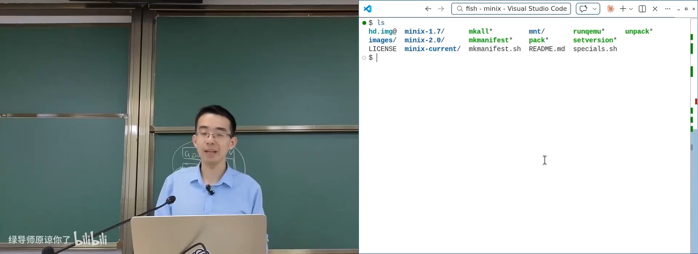

### 1.3 16 位 MINIX 中的 UNIX 体验

*(参考时间: 00:14)*

课程现场验证：

```bash
vi a.c
cc a.c
./a.out
man 2 fork
```

输出显示这是 16 位系统，`sizeof(int)` 的结果也验证了机器模型。MINIX 1 没有现代命令历史，只有 `more` 而没有 `less`，但核心 UNIX 工具、手册、管道、C 编译和 `a.out` 执行都已经具备。

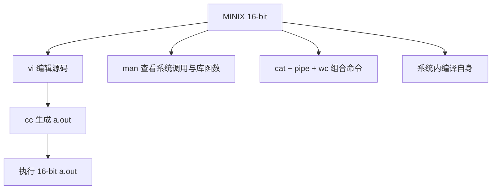
```mermaid
flowchart TD
    A["MINIX 16-bit"] --> B["vi 编辑源码"]
    B --> C["cc 生成 a.out"]
    C --> D["执行 16-bit a.out"]
    A --> E["man 查看系统调用与库函数"]
    A --> F["cat + pipe + wc 组合命令"]
    A --> G["系统内编译自身"]
```

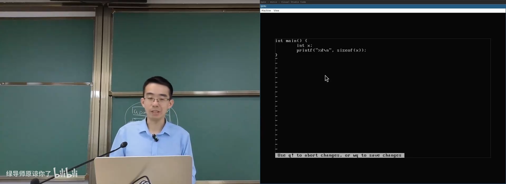

### 1.4 微内核：Send / Receive 的超前设计

*(参考时间: 00:18)*

MINIX 采用微内核思想。理想中，内核只保留极少数机制，文件系统、进程管理、内存管理等服务运行在用户态，通过消息通信：

```text
send(destination, message)
receive(source, message)
```

一个进程请求文件服务，就向文件服务进程发消息；请求内存，就与内存服务进程通信。

这个设计在 1987 年非常超前，但当时的机器很慢：

- 系统调用可以直接进入内核；
- 消息传递要构造消息、切换进程、再返回消息；
- 软件开销明显高于直接系统调用。

因此，MINIX 的性能长期不如一体化的 UNIX。Tanenbaum 的目标是教学“操作系统应该如何设计和实现”，而不是赢得性能竞争。

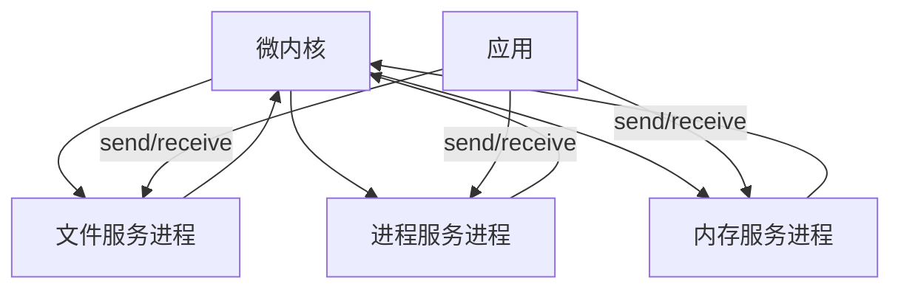
```mermaid
flowchart TD
    A["微内核"] --> B["文件服务进程"]
    A --> C["进程服务进程"]
    A --> D["内存服务进程"]
    E["应用"] -->|send/receive| B
    E -->|send/receive| C
    E -->|send/receive| D
    B --> A
    C --> A
    D --> A
```

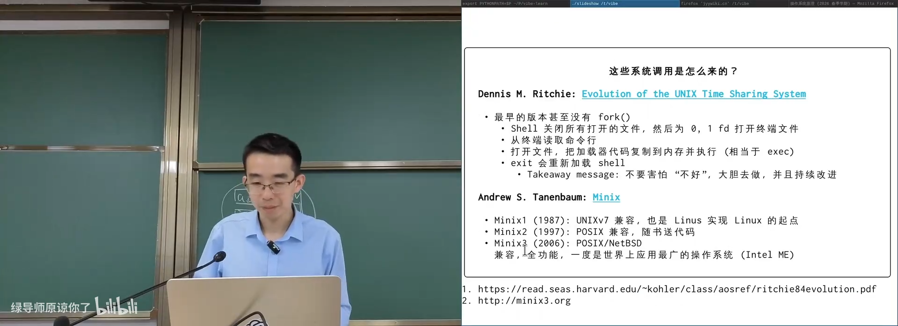

### 1.5 1991 年：Linus 与 Linux

*(参考时间: 00:21)*

1991 年 8 月 25 日，当时 21 岁的 Linus Torvalds 在 `comp.os.minix` 发布消息：

> I'm doing a (free) operating system (just a hobby, won't be big and professional like gnu) for 386(486) AT clones.

早期 Linux：

- 依赖 MINIX 工具链和 MINIX 文件系统；
- 可以和 GNU GCC、Bash 等工具一起工作；
- 开始时只是作者自用的“小爱好”；
- 后来成为服务器、Android、云基础设施和大量设备的共同底座。

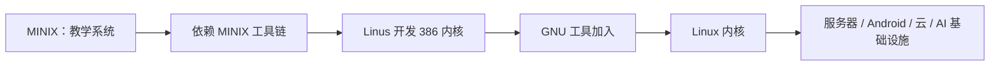
```mermaid
flowchart LR
    A["MINIX：教学系统"] --> B["依赖 MINIX 工具链"]
    B --> C["Linus 开发 386 内核"]
    C --> D["GNU 工具加入"]
    D --> E["Linux 内核"]
    E --> F["服务器 / Android / 云 / AI 基础设施"]
```

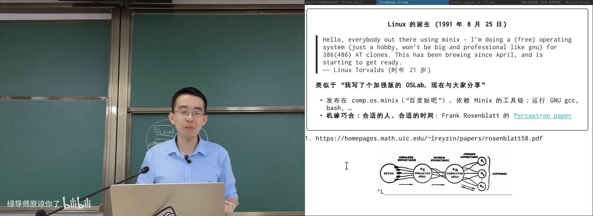

### 1.6 合适的人、时间与土壤

*(参考时间: 00:23)*

Frank Rosenblatt 在 1958 年提出感知机，思想接近今天的神经元模型。但直到 2012 年 AlexNet 出现，大规模神经网络才真正爆发。原因在于：

- 当时缺少足够算力；
- 缺少训练深层网络的成熟方法；
- 缺少研究氛围和产业场景。

类似的故事反复发生：技术思想可能提前几十年出现，但只有“合适的人、合适的时间、合适的土壤”同时具备，才会形成革命。

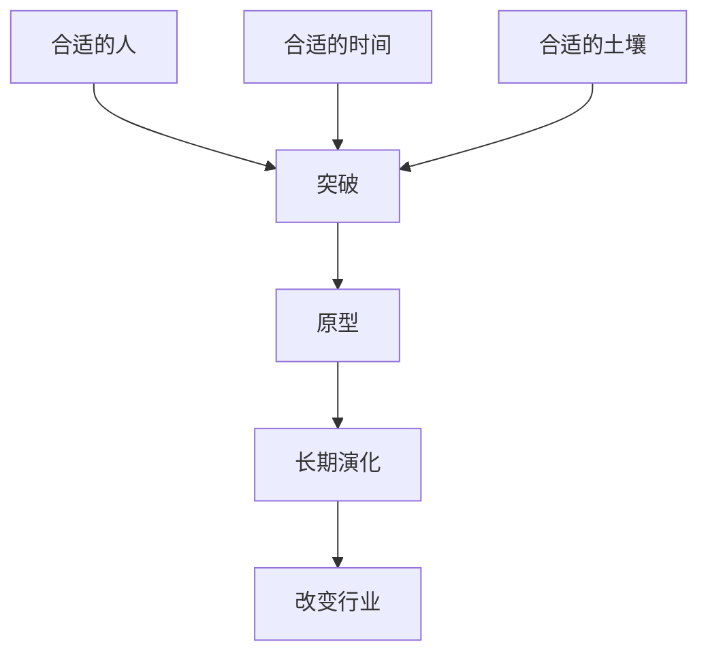
```mermaid
flowchart TD
    A["合适的人"] --> D["突破"]
    B["合适的时间"] --> D
    C["合适的土壤"] --> D
    D --> E["原型"]
    E --> F["长期演化"]
    F --> G["改变行业"]
```

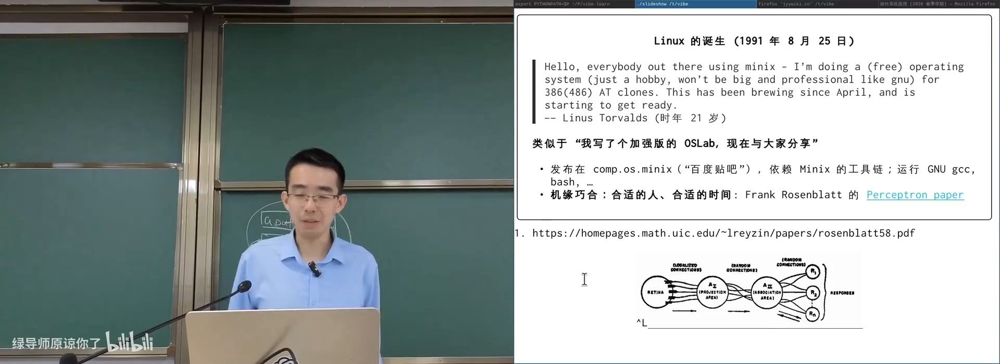

### 1.7 CUDA、AlexNet 与时代反转

*(参考时间: 00:25)*

2012 年：

- Alex Krizhevsky、Ilya Sutskever、Geoffrey Hinton 正在推进 AlexNet；
- CUDA 已存在，但许多人认为它难用；
- Linus 在公开场合批评 NVIDIA 是“遇到过的最糟糕的公司之一”；
- 十多年后，NVIDIA 成为全球市值最高的公司之一。

技术的发展经常充满反转。一个当时充满缺陷的平台，可能因为生态、算力和时间窗口，成为新时代的关键基础设施。

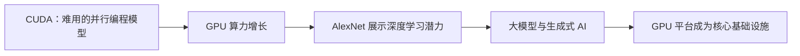
```mermaid
flowchart LR
    A["CUDA：难用的并行编程模型"] --> B["GPU 算力增长"]
    B --> C["AlexNet 展示深度学习潜力"]
    C --> D["大模型与生成式 AI"]
    D --> E["GPU 平台成为核心基础设施"]
```

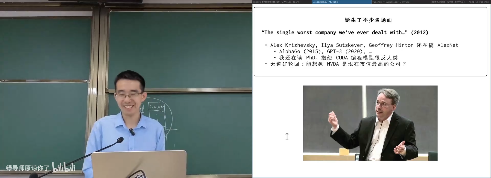

### 1.8 Tanenbaum 与 Linus 的论战

*(参考时间: 00:30)*

1992 年，Tanenbaum 在 `comp.os.minix` 上批评 Linux 采用一体化内核：

> Writing a monolithic system is a truly poor idea.

Linus 随即反驳。Ken Thompson 也参与了讨论，大意是：

- 从长远看，微内核可能是未来；
- 但一体化内核更容易实现；
- 也更容易在现实中迅速形成可用系统。

后来的 Linux 不断发展多处理器支持、锁、RCU、模块化和子系统重构。它不是最初那个“hobby kernel”，而是在现实压力下持续演化成了现代大型系统。

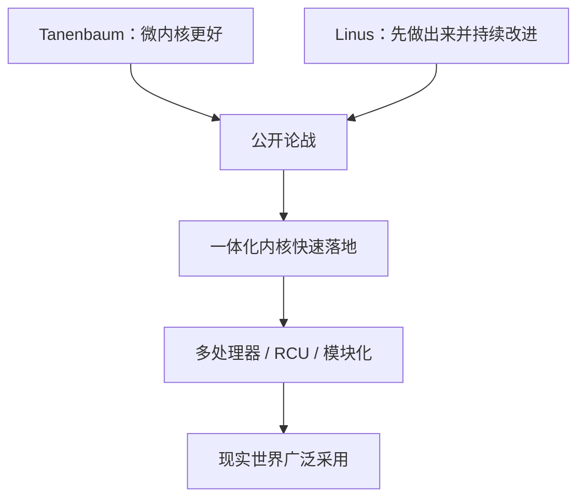
```mermaid
flowchart TD
    A["Tanenbaum：微内核更好"] --> C["公开论战"]
    B["Linus：先做出来并持续改进"] --> C
    C --> D["一体化内核快速落地"]
    D --> E["多处理器 / RCU / 模块化"]
    E --> F["现实世界广泛采用"]
```

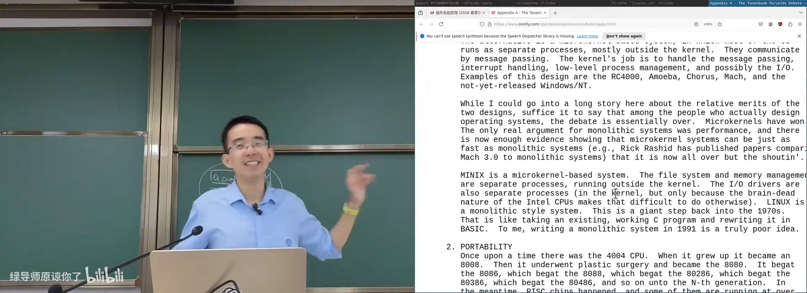

### 1.9 Linux 内核规模的长期变化

*(参考时间: 00:34)*

Linux 从很小的项目成长为千万行级内核：

- Linux 2.0 引入 SMP，但内核并行能力有限；
- Linux 2.4 之后内核本身才能更好地并行运行；
- Linux 2.6 与云计算基础设施同步起飞；
- RCU 等机制让读多写少的场景获得更好的伸缩性；
- 大型子系统经历多轮重构。


```mermaid
flowchart LR
    A["Hobby kernel"] --> B["SMP 支持"]
    B --> C["内核并行"]
    C --> D["Linux 2.6 现代化"]
    D --> E["云计算与移动设备"]
    E --> F["高度模块化的大型系统"]
```

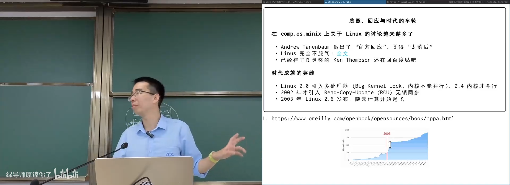

---

## 2. AI 时代的“从 0 到 0.1”

### 2.1 用 AI 建立个人知识库

*(参考时间: 00:36)*

讲师展示了如何把论文和 PDF 放入共享目录，再由后台工具：

- 逐页 OCR；
- 提取事实；
- 生成不同长度的摘要；
- 建立长期对话上下文；
- 与原文对照追问。

这种流程把过去“人肉阅读一百页博士论文”的过程压缩到几分钟。关键不再是逐字摘录，而是建立概念之间的关系，并保留验证原文的能力。

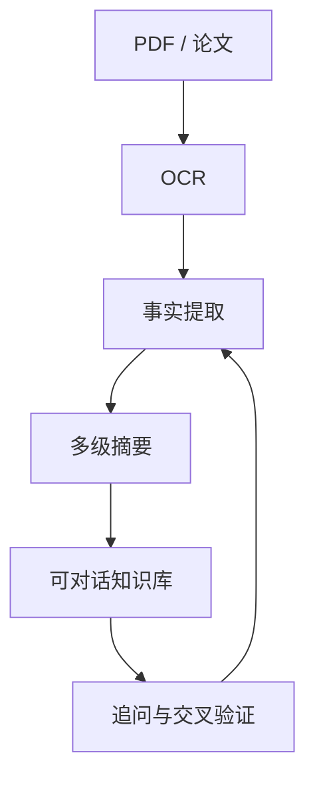
```mermaid
flowchart TD
    A["PDF / 论文"] --> B["OCR"]
    B --> C["事实提取"]
    C --> D["多级摘要"]
    D --> E["可对话知识库"]
    E --> F["追问与交叉验证"]
    F --> C
```

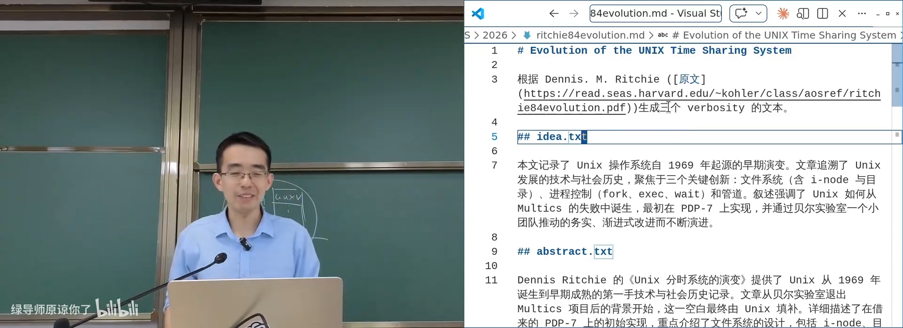

### 2.2 从零到 0.1 前所未有地容易

*(参考时间: 00:40)*

AI 时代最显著的变化是原型能力：

- CrazyOS 可以与硬件进行协同设计；
- 编译器 bug 可以通过大规模自动测试发现；
- 小模型也能在部分任务上超过早期的大模型；
- 只要方向和概念正确，原型很容易生成。

但“容易做出原型”不等于“自动完成有价值的研究”。真正重要的是问题是否重要、验证是否严格、长期演化是否有意义。

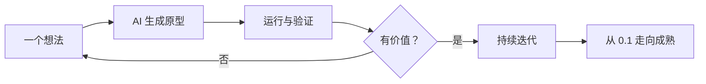
```mermaid
flowchart LR
    A["一个想法"] --> B["AI 生成原型"]
    B --> C["运行与验证"]
    C --> D{"有价值？"}
    D -- "否" --> A
    D -- "是" --> E["持续迭代"]
    E --> F["从 0.1 走向成熟"]
```

### 2.3 Caveman：压缩输出与 Agent 容错

*(参考时间: 00:42)*

课堂以 Caveman 项目为例。它用极端压缩的提示要求模型减少客套和冗长说明：

- 能短说就短说；
- 能用符号表达就不写长句；
- 允许语法不完美；
- 依赖 Agent 在失败后重试。

这利用了 Agent 的容错性：单次准确率可能略降，但只要失败能够被检测并重试，总体仍可节省大量 token。

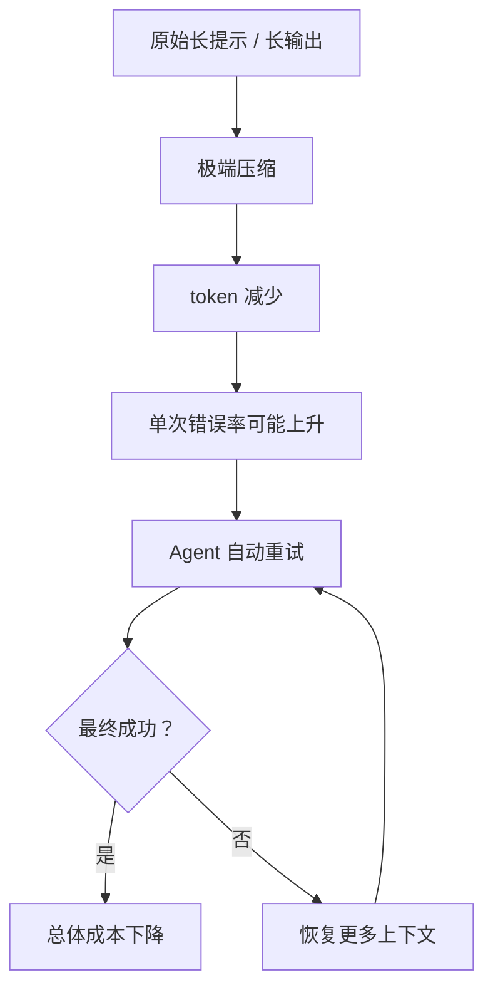
```mermaid
flowchart TD
    A["原始长提示 / 长输出"] --> B["极端压缩"]
    B --> C["token 减少"]
    C --> D["单次错误率可能上升"]
    D --> E["Agent 自动重试"]
    E --> F{"最终成功？"}
    F -- "是" --> G["总体成本下降"]
    F -- "否" --> H["恢复更多上下文"]
    H --> E
```

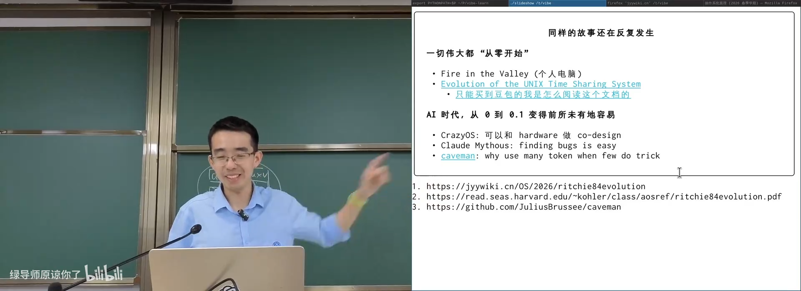

---

## 3. 操作系统从哪里开始运行

### 3.1 CPU Reset 与确定性起点

*(参考时间: 00:46)*

计算机系统有一个确定的初始状态：

1. CPU Reset 后，寄存器和 PC 进入硬件规定状态；
2. Firmware 运行；
3. Bootloader 加载操作系统；
4. 操作系统加载第一个进程；
5. 第一个进程再创建后续进程世界。

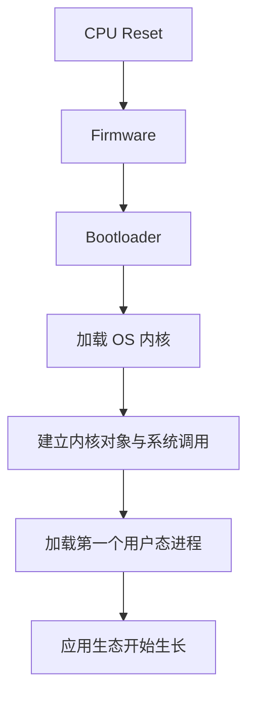
```mermaid
flowchart TD
    A["CPU Reset"] --> B["Firmware"]
    B --> C["Bootloader"]
    C --> D["加载 OS 内核"]
    D --> E["建立内核对象与系统调用"]
    E --> F["加载第一个用户态进程"]
    F --> G["应用生态开始生长"]
```

操作系统启动后，通常不再是普通意义上的“程序”，而成为持续运行的资源管理者：

- 响应系统调用；
- 响应中断；
- 维护进程与地址空间；
- 管理文件和设备；
- 在后台完成缓存回写等任务。

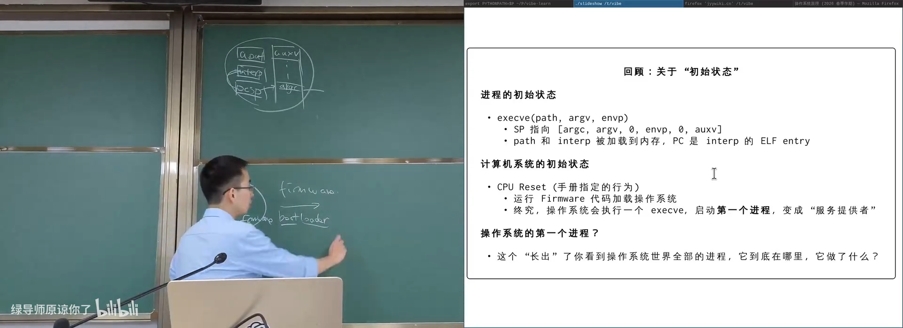

### 3.2 第一个进程是谁

*(参考时间: 00:48)*

现代 Linux 进程树常以 `systemd` 为根，但 `systemd` 通常不是内核直接执行的第一个用户态程序。

临时根文件系统会先启动一个早期的 `init`，完成：

- 加载磁盘、网卡等必要驱动；
- 挂载真实根文件系统；
- 切换根目录与控制权；
- 最终启动 `systemd`。

这引出本讲的核心问题：

> 我们能不能控制 Linux 加载的第一个进程？

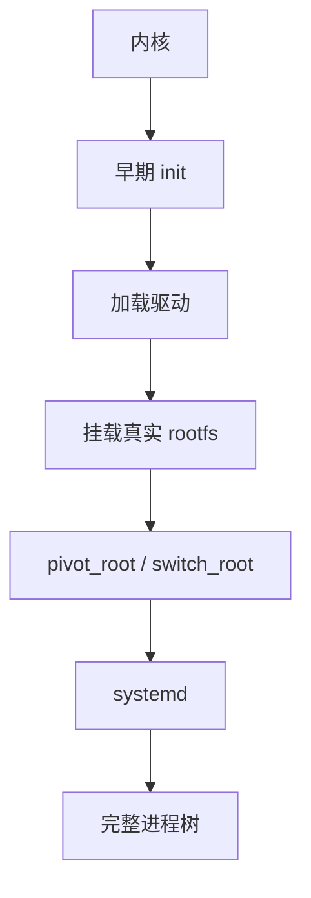
```mermaid
flowchart TD
    A["内核"] --> B["早期 init"]
    B --> C["加载驱动"]
    C --> D["挂载真实 rootfs"]
    D --> E["pivot_root / switch_root"]
    E --> F["systemd"]
    F --> G["完整进程树"]
```

---

## 4. 最小二进制与 initramfs

### 4.1 一个只有系统调用的可执行文件

*(参考时间: 00:49)*

先构造一个不链接 libc 的最小 ELF：

```asm
; 概念示意：直接 write 与 exit
mov rax, 1          ; SYS_write
mov rdi, 1          ; stdout
mov rsi, message
mov rdx, message_len
syscall

mov rax, 60         ; SYS_exit
xor rdi, rdi
syscall
```

静态编译后，这个程序只依赖系统调用。它不需要动态链接器，也不需要额外的 C 运行时。

在 ARM 主机上还可以借助 QEMU user mode 执行 x86-64 程序：用户态计算指令由模拟器翻译，系统调用则交给宿主 Linux 处理。

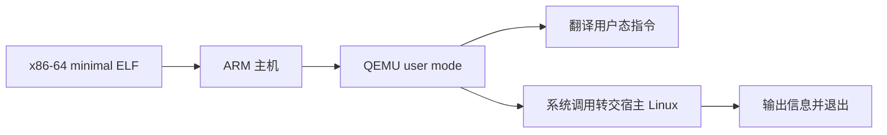
```mermaid
flowchart LR
    A["x86-64 minimal ELF"] --> B["ARM 主机"]
    B --> C["QEMU user mode"]
    C --> D["翻译用户态指令"]
    C --> E["系统调用转交宿主 Linux"]
    E --> F["输出信息并退出"]
```

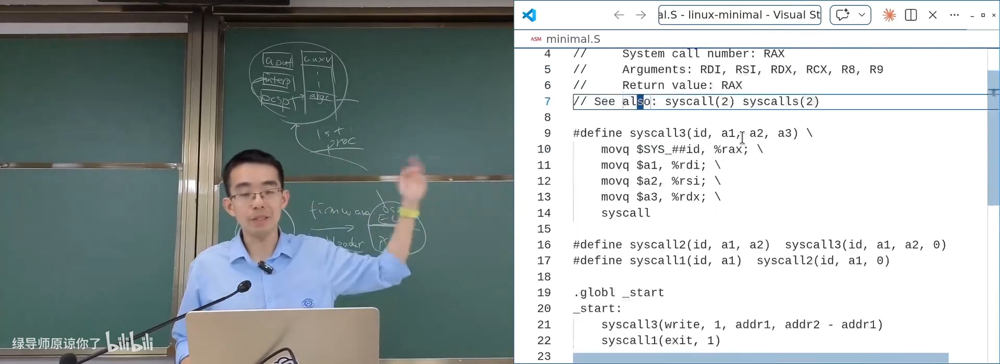

### 4.2 为什么需要 initramfs

*(参考时间: 00:51)*

`execve` 需要一个文件路径。但在内核刚启动时，系统还不知道真实根文件系统在哪里，可能来自：

- SATA / NVMe 磁盘；
- USB 存储；
- 网络；
- 加密卷；
- RAID 或逻辑卷。

内核需要一个最早的、完全由启动镜像提供的内存文件系统：

> **initramfs**：initial RAM filesystem。

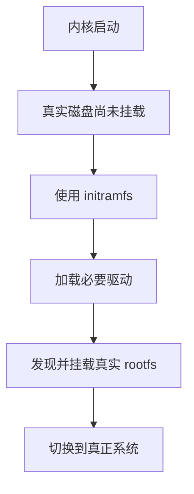
```mermaid
flowchart TD
    A["内核启动"] --> B["真实磁盘尚未挂载"]
    B --> C["使用 initramfs"]
    C --> D["加载必要驱动"]
    D --> E["发现并挂载真实 rootfs"]
    E --> F["切换到真正系统"]
```

### 4.3 内核如何寻找 `/init`

*(参考时间: 00:52)*

内核按一组候选路径寻找第一个用户态程序，例如：

```text
/sbin/init
/etc/init
/bin/init
/bin/sh
```

也可以由内核命令行指定：

```text
init=/init
rdinit=/init
```

在最小系统中，initramfs 只需要包含：

```text
/
├── init
└── bin/
    └── minimal
```

这仍然是一个完整地址空间模型中的文件系统，只是它位于内存。

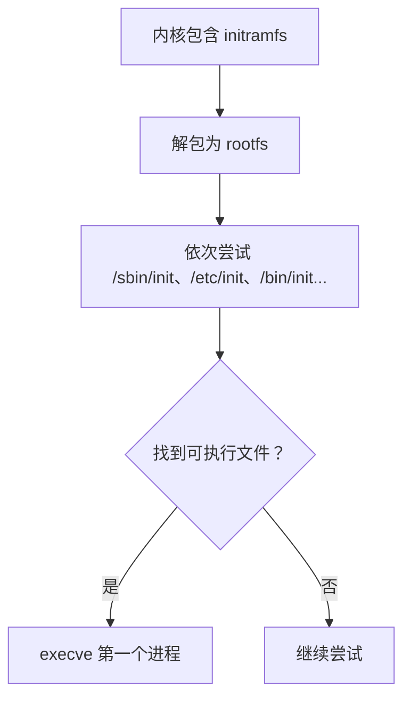
```mermaid
flowchart TD
    A["内核包含 initramfs"] --> B["解包为 rootfs"]
    B --> C["依次尝试 /sbin/init、/etc/init、/bin/init..."]
    C --> D{"找到可执行文件？"}
    D -- "是" --> E["execve 第一个进程"]
    D -- "否" --> F["继续尝试"]
```

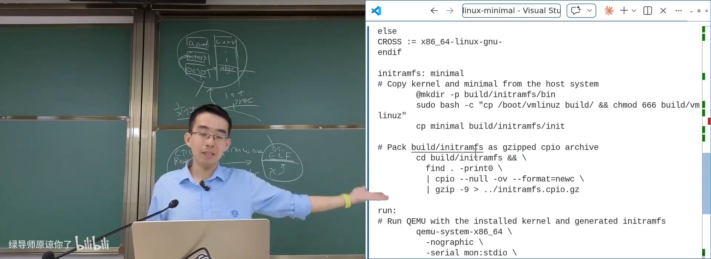

### 4.4 打包并交给 QEMU

*(参考时间: 00:53)*

目录树通常通过 CPIO 归档并压缩：

```bash
find . -print0 | cpio --null -ov --format=newc | gzip > initramfs.cpio.gz
```

QEMU 启动：

```bash
qemu-system-x86_64 \
  -kernel bzImage \
  -initrd initramfs.cpio.gz \
  -append "console=ttyS0 init=/init" \
  -nographic
```

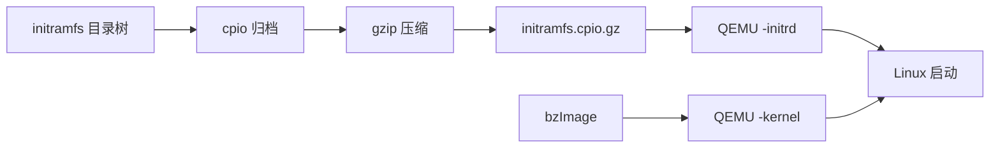
```mermaid
flowchart LR
    A["initramfs 目录树"] --> B["cpio 归档"]
    B --> C["gzip 压缩"]
    C --> D["initramfs.cpio.gz"]
    D --> E["QEMU -initrd"]
    F["bzImage"] --> G["QEMU -kernel"]
    E --> H["Linux 启动"]
    G --> H
```

### 4.5 第一个进程退出会导致内核恐慌

*(参考时间: 00:54)*

启动成功后，内核日志会显示：

```text
Run /init as init process
This is the minimal binary
```

随后最小程序调用 `exit`。如果它是系统唯一的 init，内核会报告：

```text
Kernel panic - not syncing: Attempted to kill init!
```

普通进程退出只销毁自身；init 退出则意味着用户态世界没有根，内核无法继续维持正常运行。

```mermaid
flowchart TD
    A["内核加载 /init"] --> B["minimal binary 输出"]
    B --> C["init 调用 exit"]
    C --> D{"系统还有 init 吗？"}
    D -- "否" --> E["Kernel panic：Attempted to kill init"]
    D -- "是" --> F["重新启动 init 或进入恢复流程"]
```

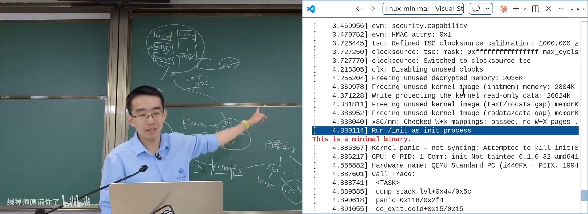

---

## 5. 打开真实系统的 initramfs

### 5.1 解包不是一条命令就结束

*(参考时间: 00:56)*

真实的 `/boot/initrd.img` 可能包含多个压缩片段。课程中 AI 首先解出了约 7.3 MB 内容，但原文件约 23 MB，二者不一致。

讲师提示 AI：

> 解出来的文件明显比原镜像小，后面一定还有未处理的数据。

AI 随后检查 CPIO trailer 后面的数据，发现了第二段 Zstandard 压缩内容。

```mermaid
flowchart TD
    A["initrd.img：约 23MB"] --> B["解出第一段：约 7.3MB"]
    B --> C{"与原始大小不一致"}
    C --> D["检查 CPIO trailer 后数据"]
    D --> E["发现 zstd 第二段"]
    E --> F["继续解包完整目录树"]
```

### 5.2 一个真实 initramfs 里有什么

*(参考时间: 00:59)*

解出的目录树类似：

```text
/
├── bin
├── etc
├── lib
├── sbin
├── usr
├── var
├── init
└── ...
```

里面通常包含：

- BusyBox 提供的精简命令；
- 启动脚本和配置文件；
- 文件系统工具；
- 键盘布局与字体配置；
- 网卡、存储控制器等内核模块；
- 固件二进制；
- 恢复 shell；
- 挂载真实根文件系统所需的一切。

```mermaid
flowchart TD
    A["真实 initramfs"] --> B["BusyBox 工具集"]
    A --> C["启动脚本 / 配置"]
    A --> D["内核模块 / 固件"]
    A --> E["文件系统与网络工具"]
    A --> F["恢复 shell"]
    B --> G["加载驱动并挂载 rootfs"]
    C --> G
    D --> G
    E --> G
```

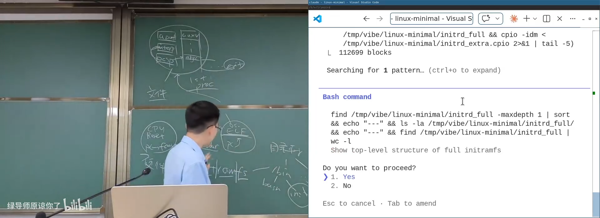

### 5.3 BusyBox：一个二进制文件，一整套命令

*(参考时间: 01:01)*

BusyBox 把大量常用工具编译成一个可执行文件。执行：

```bash
busybox --list
```

可以看到从 `cat`、`ls`、`mount` 到 `wget` 的众多命令。

系统通过符号链接让同一程序以不同名称启动：

```text
/bin/ls -> /bin/busybox
/bin/mount -> /bin/busybox
/bin/sh -> /bin/busybox
/usr/bin/wget -> /bin/busybox
```

程序根据 `argv[0]` 判断自己应该扮演哪个工具。

```mermaid
flowchart TD
    A["execve('/bin/ls', ...)"] --> B["实际加载 /bin/busybox"]
    B --> C["BusyBox 读取 argv[0] = ls"]
    C --> D["分派到 ls 实现"]
    E["execve('/bin/mount', ...)"] --> B
    E --> F["argv[0] = mount"]
    F --> G["分派到 mount 实现"]
```

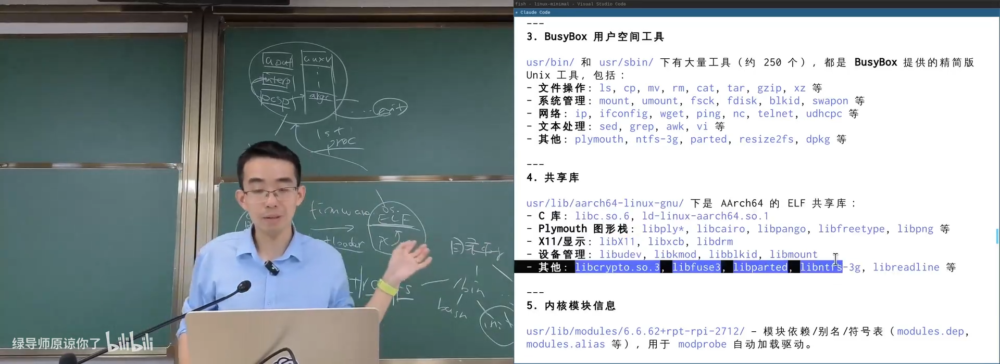

---

## 6. 从空文件系统创造一个 Linux 世界

### 6.1 initramfs 中的第一个 Shell

*(参考时间: 01:05)*

最小 initramfs 可以只包含：

```text
/
├── init
├── bin/
│   └── busybox
└── drivers/
    └── ...
```

`init` 脚本使用：

```sh
#!/bin/busybox sh
```

随后执行一系列操作：

```sh
for cmd in $(busybox --list); do
    busybox ln -s busybox "/bin/$cmd"
done

mkdir -p /proc /sys /dev
mount -t proc proc /proc
mount -t sysfs sysfs /sys
insmod /drivers/...
mknod /dev/console c 5 1
exec /bin/sh
```

```mermaid
flowchart TD
    A["内核执行 /init"] --> B["BusyBox 解释脚本"]
    B --> C["创建命令符号链接"]
    C --> D["创建 /proc /sys /dev"]
    D --> E["mount procfs / sysfs"]
    E --> F["加载驱动模块"]
    F --> G["mknod 创建设备节点"]
    G --> H["启动交互 Shell"]
```

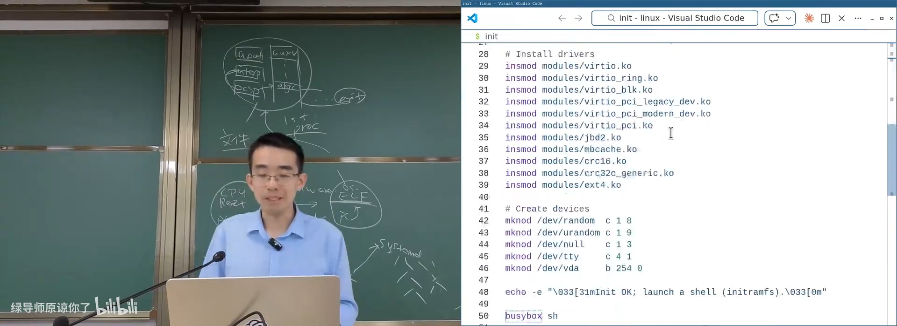

### 6.2 三行脚本创建整套命令

*(参考时间: 01:08)*

创建符号链接的思想可以压缩为：

```sh
for command in $(busybox --list); do
    busybox ln -s /bin/busybox "/bin/$command"
done
```

每创建一个符号链接，就相当于让 `/bin` 中多出一个命令。它们背后都执行同一个 BusyBox。

```mermaid
flowchart LR
    A["busybox --list"] --> B["ls / mount / sh / wget / ..."]
    B --> C["循环创建符号链接"]
    C --> D["/bin 中出现大量命令"]
    D --> E["所有入口指向同一个 BusyBox"]
```

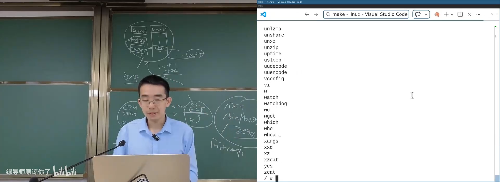

### 6.3 `procfs` 让 `ps` 成为可能

*(参考时间: 01:09)*

在空世界中，`ps` 无法工作，因为它没有可读取的进程信息。挂载 `procfs`：

```bash
mount -t proc proc /proc
```

以后就可以看到：

```bash
ps
ls /proc
cat /proc/<pid>/maps
```

此时进程树中可以看到：

- PID 1 是 initramfs 的 `init`；
- 当前 Shell 是它的子进程；
- `ps` 本身也是临时创建的子进程。

```mermaid
flowchart TD
    A["空 `/proc`"] --> B["mount -t proc proc /proc"]
    B --> C["内核动态生成进程目录"]
    C --> D["/proc/1"]
    C --> E["/proc/<pid>"]
    D --> F["ps 读取进程信息"]
    E --> F
```


### 6.4 设备节点与主次设备号

*(参考时间: 01:11)*

设备文件不是普通数据文件，而由主设备号和次设备号定位：

```bash
mknod /dev/zero c 1 5
mknod /dev/random c 1 8
mknod /dev/urandom c 1 9
mknod /dev/tty c 5 0
mknod /dev/vda b 254 0
```

```mermaid
flowchart TD
    A["用户访问 /dev/random"] --> B["VFS 识别字符设备"]
    B --> C["根据 major/minor 找驱动"]
    C --> D["驱动读取硬件或内核熵池"]
    D --> E["返回字节给用户"]
```

课程现场创建 Verio 虚拟磁盘 `/dev/vda`，再用它挂载真实 ext4 文件系统。`mount`、`mknod`、`insmod` 等命令背后全部是系统调用。

```mermaid
flowchart LR
    A["mknod /dev/vda b ..."] --> B["创建块设备节点"]
    B --> C["mount -t ext4 /dev/vda /mnt"]
    C --> D["VFS 调用块设备与 ext4 驱动"]
    D --> E["真实文件系统挂载到 /mnt"]
```

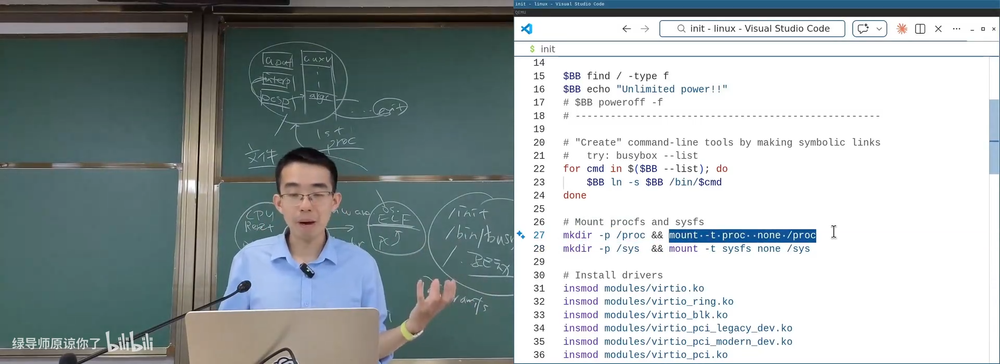

---

## 7. `pivot_root`：切换到真正的 Linux

### 7.1 从临时根到真实根

*(参考时间: 01:13)*

initramfs 只是启动阶段的临时世界。真实磁盘挂载后，系统需要调用：

```c
int pivot_root(const char *new_root, const char *put_old);
```

它改变调用进程所在 mount namespace 的根挂载。随后旧根可以卸载或放到过渡目录中。

```mermaid
flowchart TD
    A["内存 rootfs"] --> B["挂载真实磁盘到 /mnt"]
    B --> C["pivot_root('/mnt', '/mnt/oldroot')"]
    C --> D["新根变为真实文件系统"]
    D --> E["umount /oldroot"]
    E --> F["执行新根中的 init"]
```

### 7.2 第二阶段的 `init`

*(参考时间: 01:14)*

课程准备了另一份 `fsroot`：

```text
fsroot/
├── init
└── drivers/
    └── e1000.ko
```

切换到新根后，重新建立：

- BusyBox 命令；
- `/proc` 与 `/sys`；
- `/dev` 设备节点；
- 网卡驱动；
- 网络地址；
- 一个简单的 HTTP 服务。

```mermaid
flowchart TD
    A["pivot_root 成功"] --> B["执行真实 rootfs 的 init"]
    B --> C["重建 BusyBox 链接"]
    C --> D["重新挂载 procfs / sysfs"]
    D --> E["重新创建设备"]
    E --> F["加载 e1000 网卡驱动"]
    F --> G["配置网络"]
    G --> H["启动 httpd"]
```

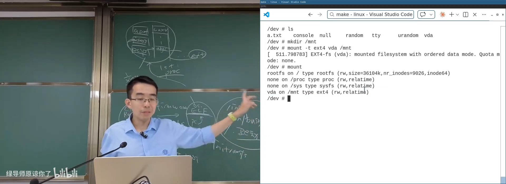

### 7.3 从串口控制台到 VGA 控制台

*(参考时间: 01:16)*

早期启动阶段使用串口：

```text
/dev/console
```

切换后，系统可以使用 QEMU 模拟的 VGA 与终端设备：

```bash
echo hello > /dev/tty
```

字符不仅经过串口传输，而是由内核显示驱动在一个个像素上绘制。终端看似平常的字符输出，背后已经是完整设备驱动和图形显示链路。

```mermaid
flowchart LR
    A["Shell write /dev/tty"] --> B["TTY 驱动"]
    B --> C["控制台 / 显示驱动"]
    C --> D["VGA 帧缓冲"]
    D --> E["屏幕像素"]
```

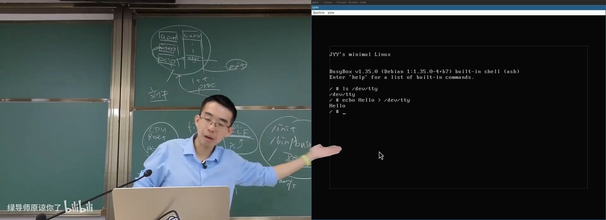

### 7.4 网络、HTTP 与端口映射

*(参考时间: 01:17)*

加载 `e1000.ko` 后，虚拟网卡变为可用。配置地址并启动服务：

```bash
ip addr add 10.0.2.15/24 dev eth0
ip link set eth0 up
httpd -p 8080 -h /
```

QEMU 把虚拟机的 8080 端口映射到宿主机：

```text
host:8080 -> guest:8080
```

浏览器访问：

```text
http://localhost:8080/
http://localhost:8080/init
```

如果没有 `index.html`，根路径返回 404；但 `/init` 可以读出虚拟机文件系统中的 init 脚本。

```mermaid
flowchart LR
    A["宿主浏览器"] --> B["localhost:8080"]
    B --> C["QEMU 端口转发"]
    C --> D["虚拟机 httpd"]
    D --> E["读取 guest rootfs"]
    E --> F["返回 /init 文件内容"]
```

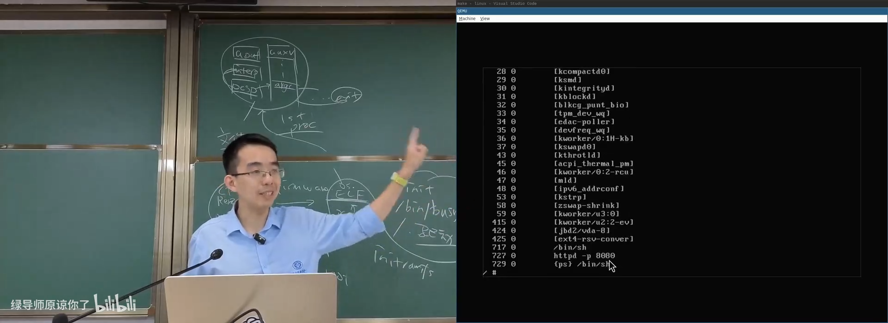


### 7.5 系统调用真正厉害的地方

*(参考时间: 01:19)*

从第一个 init 到浏览器显示文件内容，整个过程只使用了操作系统对象与 API：

| 用户看到的操作 | 背后的系统调用 |
| --- | --- |
| 创建命令 | `symlink`、`execve` |
| 创建目录 | `mkdir` |
| 挂载文件系统 | `mount` |
| 创建设备 | `mknod` |
| 加载驱动 | `init_module` / `finit_module` |
| 切换根 | `pivot_root` |
| 配置网络 | `socket`、`ioctl`、`bind` 等 |
| HTTP 服务 | `socket`、`bind`、`listen`、`accept`、`read`、`write` |
| 终端显示 | `open`、`write`、`ioctl` |

```mermaid
flowchart TD
    A["第一个 init"] --> B["进程管理 API"]
    B --> C["文件与目录 API"]
    C --> D["设备与 mount API"]
    D --> E["网络 socket API"]
    E --> F["HTTP 服务"]
    F --> G["浏览器看到文件内容"]
```

---

## 8. 应用视角的操作系统

### 8.1 确定的初始状态

*(参考时间: 01:20)*

从硬件到应用可以总结为：

1. CPU Reset 提供确定状态；
2. Firmware 和 Bootloader 加载内核；
3. 内核建立系统调用与对象模型；
4. initramfs 提供早期文件系统；
5. 内核 `execve` 第一个用户态进程；
6. 进程通过系统调用创建后续全部世界。

```mermaid
flowchart LR
    A["CPU Reset"] --> B["Firmware"]
    B --> C["Bootloader"]
    C --> D["Kernel"]
    D --> E["initramfs"]
    E --> F["First Process"]
    F --> G["Objects + API"]
    G --> H["Applications"]
```

### 8.2 操作系统 = 对象 + API

*(参考时间: 01:20)*

应用视角下，操作系统提供的一切都可以归入：

- **对象**：进程、线程、文件、目录、管道、socket、设备、内存映射；
- **API**：创建、访问、组合、删除和同步这些对象的系统调用；
- **事件**：信号、异常、I/O 就绪、进程退出；
- **权限与命名空间**：用户、组、mount namespace、网络 namespace。

```mermaid
flowchart TD
    A["操作系统"] --> B["对象"]
    A --> C["API"]
    A --> D["事件"]
    A --> E["权限与命名空间"]
    B --> F["进程 / 文件 / 设备 / socket"]
    C --> G["open / read / write / mmap / mount"]
    D --> H["signal / wait / poll / epoll"]
    E --> I["user / mount / net / pid namespace"]
```

从 Android 手机上的应用，到云服务器、数据库和 AI 服务，最终都可以还原到这些对象与调用之上。

---

## 9. 应用生态与软件包管理

### 9.1 生态成就操作系统

*(参考时间: 01:21)*

内核 API 只是底座。真正让操作系统繁荣的是：

- 语言运行时和标准库；
- 图形、网络、压缩、加密等基础库；
- Shell 与 coreutils；
- 安装、升级和配置工具；
- 开发、调试和构建工具；
- 厂商与开源社区持续发布的应用。

```mermaid
flowchart BT
    A["内核：对象与系统调用"] --> B["libc / 运行时"]
    B --> C["Shell / coreutils / 基础库"]
    C --> D["包管理器与系统工具"]
    D --> E["开发工具与应用软件"]
    E --> F["开发者社区与用户"]
```

### 9.2 从软盘、光盘到在线分发

*(参考时间: 01:23)*

前互联网时代：

- 软盘和光盘发布；
- 手动运行安装程序；
- CD-Key 容易泄漏和破解。

互联网时代：

- Debian APT；
- RPM；
- App Store；
- PyPI、npm；
- Hugging Face、Ollama；
- 容器与模型仓库。

```mermaid
flowchart LR
    A["软盘 / 光盘"] --> B["互联网下载"]
    B --> C["集中式应用商店"]
    C --> D["发行版包管理"]
    D --> E["语言包仓库"]
    E --> F["容器 / 模型 / Agent 平台"]
```

### 9.3 Debian：2026 年仍在运行的自由系统

*(参考时间: 01:24)*

课程中的树莓派运行 Debian。Debian 的使命强调：

> free software 指软件自由，而不是仅仅免费。

APT 在 1998 年提供：

```bash
apt-get install firefox
```

它已经是一个完整的供应链管理系统，覆盖从开发仓库到测试分支、再到稳定发布的过程。

```mermaid
flowchart TD
    A["上游源码 / GitHub"] --> B["Unstable"]
    B --> C["Testing"]
    C --> D["Stable"]
    D --> E["apt-get install"]
    F["维护者 / 自动测试 / 用户反馈"] --> B
    F --> C
    F --> D
```

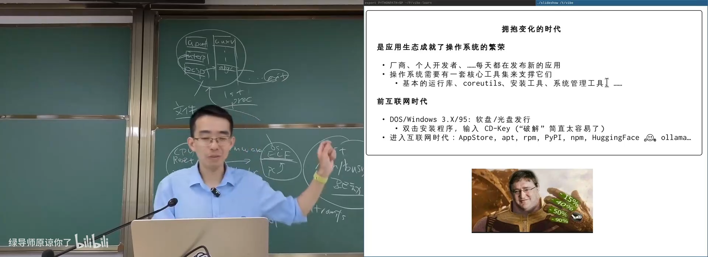

### 9.4 从一个 `.deb` 理解应用生态

*(参考时间: 01:25)*

软件包可以交给 AI 解包并解释。一个 Debian 包通常包含：

```text
package.deb
├── control.tar.xz
│   ├── control
│   ├── preinst
│   ├── postinst
│   └── ...
└── data.tar.xz
    └── 实际安装文件
```

安装流程大致为：

```text
Preinstall → Unpack → Configure → Triggers → Postinstall
```

`control` 文件描述包名、版本、架构、维护者、依赖和描述；`data.tar.xz` 包含最终文件。

```mermaid
flowchart TD
    A["下载 .deb"] --> B["读取 control"]
    B --> C["检查依赖与冲突"]
    C --> D["preinst"]
    D --> E["解包 data.tar.xz"]
    E --> F["configure"]
    F --> G["triggers"]
    G --> H["postinst"]
    H --> I["安装完成"]
```

> **安全提醒**：`postinst` 等维护脚本可以执行任意代码，因此软件包仓库和依赖链是供应链攻击的重要目标。下载和构建未知包时应使用隔离环境，并检查来源与脚本。

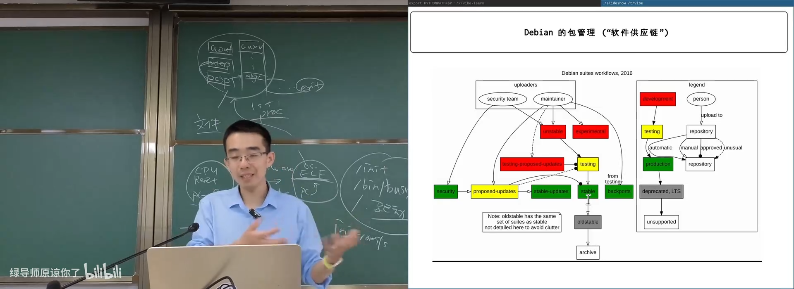

---

## 10. 讲义延伸：AI 时代的应用生态

> **编者说明**：本节来自官方讲义在视频结束后的继续讨论，单独标注，不与课堂原话混同。

### 10.1 建设生态的关键是人

应用生态的关键不只是代码，而是能理解系统、维护设计并持续交付的开发者。过去许多大型系统的复杂度来自：

- 接口设计不合理；
- 抽象边界模糊；
- 错误处理分散；
- 版本与依赖失控；
- 缺少可观察性；
- 新人难以进入和维护。

课程的意义之一是让人“见识”不同设计，理解它们为什么好、为什么坏，以及如何演化。

### 10.2 应用程序会退化为工具与服务吗

官方讲义提出一个开放问题：

- Agent 时代，应用是否只剩工具与服务？
- GUI 是否会消失，或变成由 Agent 驱动的界面协议？
- A2UI 一类协议是否会让 Agent 直接构造界面？
- 手机与桌面应用的交互模式会如何变化？

```mermaid
flowchart TD
    A["传统 GUI 应用"] --> B["Agent 调用工具"]
    A --> C["服务化 API"]
    B --> D["Agent 驱动的界面"]
    C --> D
    D --> E["用户描述目标"]
    E --> F["Agent 组合工具、服务与界面"]
```

延伸阅读：

- [A2UI：Agent-Driven Interfaces](https://a2ui.org/)
- [CrazyOS 与 CrazyOS 单台机器](https://jyywiki.cn/OS/demos/)
- [Caveman](https://github.com/JuliusBrussee/caveman)

---

## 11. 总结：从第一个进程到完整应用世界

这一讲把历史、内核启动与发行版生态连接起来：

- 早期 UNIX 从极简 Shell 和缺少 `fork` 的状态一路演化；
- MINIX 用完整源代码展示了可教学、可自举的 UNIX；
- Linux 从一个人的 hobby kernel 成长为现代基础设施；
- 微内核与一体化内核的争论直到今天仍在影响系统设计；
- Linux 启动存在确定的状态链条：CPU Reset → Firmware → Bootloader → Kernel → First Process；
- 内核通过 initramfs 获得第一个可执行文件；
- BusyBox 用一个二进制文件构建完整命令集；
- `mount`、`mknod`、`insmod` 等工具都由系统调用实现；
- `pivot_root` 把临时 rootfs 切换为真实根文件系统；
- 设备、网络、HTTP 服务都可以从第一个 init 逐步构建；
- 应用生态建立在系统调用、库、核心工具和包管理器之上；
- Debian 与 APT 展示了开源软件供应链的长期演化；
- Agent 时代可能继续改变应用、GUI 和包分发的形态。

```mermaid
flowchart LR
    A["UNIX"] --> B["MINIX"]
    B --> C["Linux Kernel"]
    C --> D["initramfs + init"]
    D --> E["Objects + System Calls"]
    E --> F["Shell / BusyBox / Drivers"]
    F --> G["Debian / APT / Packages"]
    G --> H["Applications + Agents"]
```

最终，操作系统给应用世界提供的东西可以浓缩为：

> **对象 + API + 事件 + 权限模型。**

从第一个进程开始，屏幕上看到的每一个文件、设备、网络连接和像素，都可以沿着系统调用找到实现路径。这就是应用视角的操作系统，也是现代应用生态能够持续生长的基础。

---

## 附：官方参考与延伸阅读

以下链接来自官方讲义第 12 讲及课堂内容：

- [Evolution of the UNIX Time-Sharing System](https://read.seas.harvard.edu/~kohler/class/aosref/ritchie84evolution.pdf)
- [MINIX 3](http://minix3.org)
- [MINIX 1 and 2, Quick and Dirty editions](https://github.com/davidgiven/minix2)
- [Frank Rosenblatt, The Perceptron](https://homepages.math.uic.edu/~lreyzin/papers/rosenblatt58.pdf)
- [Tanenbaum–Torvalds debate](https://www.oreilly.com/openbook/opensources/book/appa.html)
- [MINIX demo](https://jyywiki.cn/OS/demos/virtualization/minix)
- [Minimal Linux demo](https://jyywiki.cn/OS/demos/virtualization/linux-minimal)
- [Linux demo](https://jyywiki.cn/OS/demos/virtualization/linux)
- [Linux kernel command-line parameters](https://www.kernel.org/doc/html/latest/admin-guide/kernel-parameters.html)
- [BusyBox](https://git.busybox.net/busybox/tree/busybox?h=1_01)
- [Debian package example](https://packages.debian.org/trixie/ffmpeg)
- [A2UI](https://a2ui.org/)
- [Caveman](https://github.com/JuliusBrussee/caveman)

官方课程资料：

- [课程主页](https://jyywiki.cn/OS/2026/)
- [第 12 讲讲义：应用程序生态](https://jyywiki.cn/OS/2026/lect12.md)
- [视频：12 - 从零开始构建 Linux 应用世界](https://www.bilibili.com/video/BV17JDWBsEMi/)

> **版权与署名**：本讲课程材料由蒋炎岩（jyy）编写。课程讲义与幻灯片采用 [Creative Commons BY-NC 4.0](http://creativecommons.org/licenses/by-nc/4.0/) 许可；本电子书保留课程出处、作者署名与许可说明。
