# 多处理器编程：从入门到放弃

> **课程**：2026 春季学期《操作系统原理》  
> **讲师**：蒋炎岩（jyy）  
> **官方课程主页**：<https://jyywiki.cn/OS/2026/>  
> **官方讲义**：<https://jyywiki.cn/OS/2026/lect13.md>  
> **视频来源**：[Bilibili BV1vgQGBREyJ](https://www.bilibili.com/video/BV1vgQGBREyJ/)  
> **版权说明**：课程讲义与幻灯片归蒋炎岩所有，采用 [Creative Commons BY-NC 4.0](http://creativecommons.org/licenses/by-nc/4.0/) 许可；本电子书是对课堂讲授的书面化重构，保留出处与许可说明。

## 导语：打开共享内存的魔鬼盒子

*(参考时间: 00:00)*

上一讲描绘了完整的应用世界：

```text
CPU Reset
  → Firmware
  → Bootloader
  → Linux Kernel
  → initramfs / init
  → systemd
  → 应用程序
```

操作系统为应用提供对象与 API，libc、语言运行时、核心工具和应用生态逐层生长。现在要进入并发部分。

表面上看，多线程只是把单线程状态机扩展为多个状态机：

- 每个线程拥有独立栈和 PC；
- 所有线程共享全局数据；
- 任意一步选择一个线程执行。

只要增加两个 API：

```c
spawn(fn);  /* 创建线程 */
join();     /* 等待线程结束 */
```

似乎就已经理解并发的全部。可是这恰恰打开了“魔鬼的盒子”：

- 状态迁移不再确定；
- 编译器会按顺序程序假设进行优化；
- 处理器还会在运行时再次重排指令；
- 缓存使内存本身不再是一个瞬时一致的共享数组。


```mermaid
flowchart LR
    A["单线程状态机"] --> B["增加独立栈"]
    B --> C["共享全局内存"]
    C --> D["spawn / join"]
    D --> E["多线程状态机"]
    E --> F["非确定性、编译优化、乱序执行"]
    F --> G["放弃简单直觉"]
```

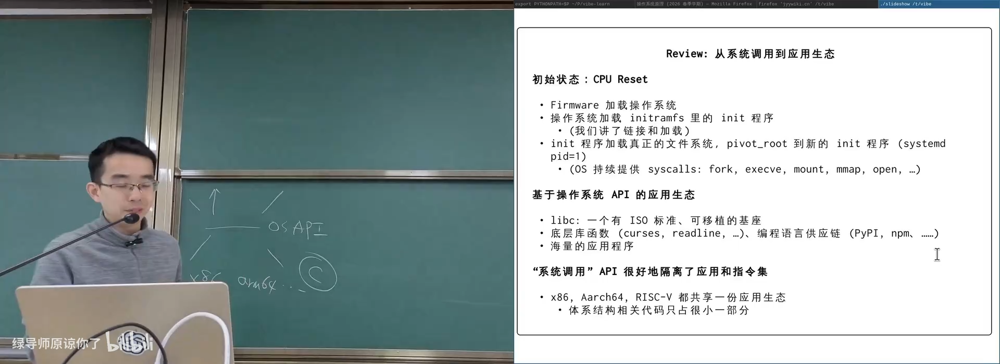

---

## 1. 为什么要共享内存并发

### 1.1 系统调用可能等待很久

*(参考时间: 00:04)*

一个顺序 HTTP 服务器可能这样写：

```c
void http_server(int fd) {
    while (1) {
        Buffer *buf = alloc_buf();
        ssize_t n = read(fd, buf, 1024);
        handle_request(buf, n);
    }
}
```

当 `read` 等待网络数据、`handle_request` 等待磁盘或其他服务时，CPU 只能停在这个执行路径上。即使进程中还有别的请求可以处理，也无法继续推进。

理想情况是：一个执行流等待 I/O 时，另一个执行流继续工作。

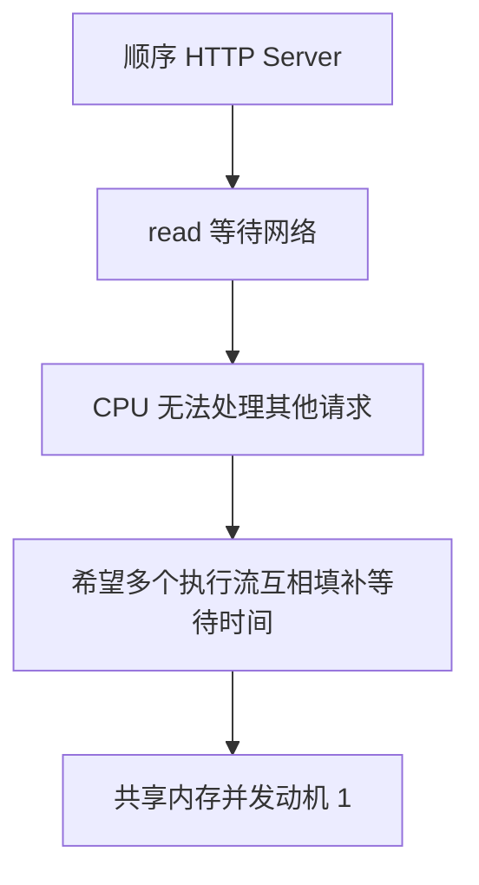
```mermaid
flowchart TD
    A["顺序 HTTP Server"] --> B["read 等待网络"]
    B --> C["CPU 无法处理其他请求"]
    C --> D["希望多个执行流互相填补等待时间"]
    D --> E["共享内存并发动机 1"]
```

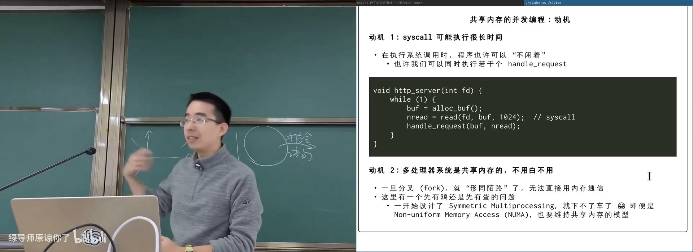

### 1.2 多处理器和共享内存

*(参考时间: 00:07)*

现代机器通常有多个逻辑处理器：

```bash
lscpu
cat /proc/cpuinfo
```

硬件模型是共享内存：

- CPU 1 写地址 `0x1234`；
- CPU 2 之后读同一地址；
- CPU 2 可以观察到 CPU 1 的写入；
- 多个 CPU 共享同一个物理内存空间。

多处理器资源不用就是浪费。可是 `fork` 后进程虽然可以通过管道或共享映射通信，但默认地址空间不再直接共享。

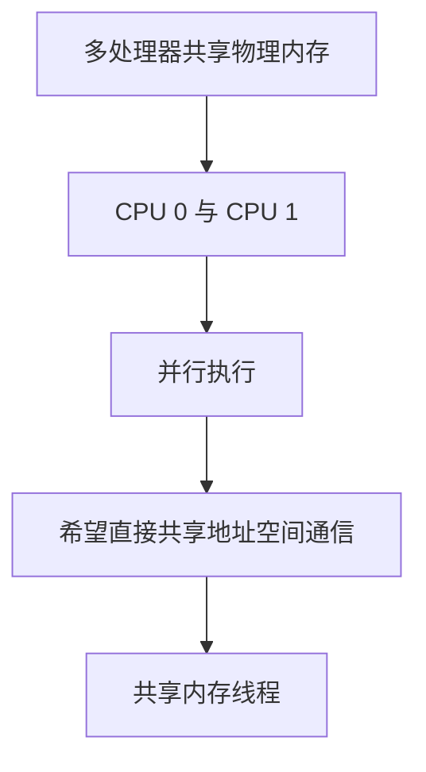
```mermaid
flowchart TD
    A["多处理器共享物理内存"] --> B["CPU 0 与 CPU 1"]
    B --> C["并行执行"]
    C --> D["希望直接共享地址空间通信"]
    D --> E["共享内存线程"]
```

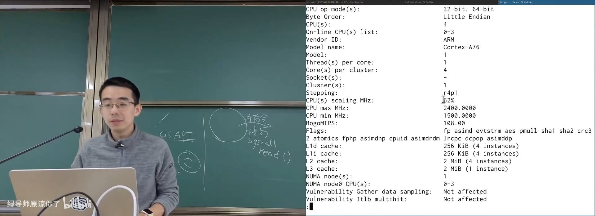

---

## 2. 线程：共享内存的进程

### 2.1 从 SimpleC 状态机扩展

*(参考时间: 00:10)*

SimpleC 中，一个程序状态由：

- 全局变量；
- 函数调用栈；
- 栈顶帧的 PC；

共同组成。函数调用就是压入新栈帧，返回就是弹出栈帧。

要让多个执行流共享全局变量，同时保持独立控制流，最自然的扩展是：

```text
Thread 1: Stack 1 + PC 1
Thread 2: Stack 2 + PC 2
Thread 3: Stack 3 + PC 3
              +
        Shared Globals
```

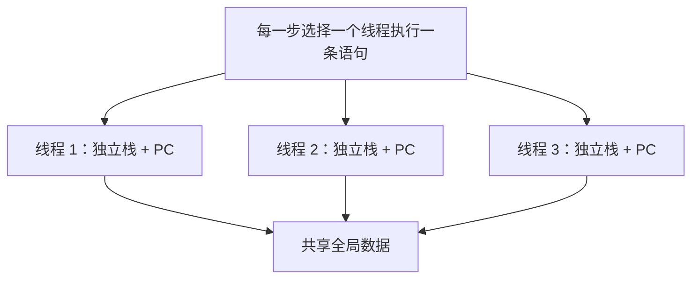
```mermaid
flowchart TD
    G["共享全局数据"]
    T1["线程 1：独立栈 + PC"] --> G
    T2["线程 2：独立栈 + PC"] --> G
    T3["线程 3：独立栈 + PC"] --> G
    S["每一步选择一个线程执行一条语句"] --> T1
    S --> T2
    S --> T3
```

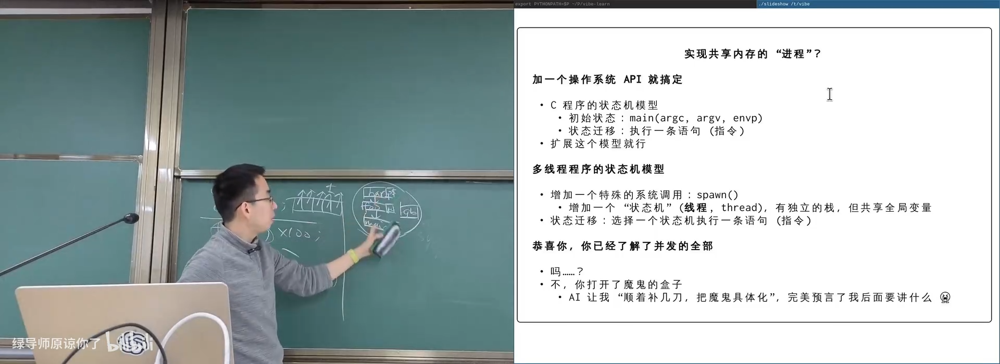

### 2.2 `spawn` 和 `join`

*(参考时间: 00:13)*

为了管理线程，可以增加两个系统调用或库函数：

```c
void spawn(void (*fn)(int tid));
void join(void);
```

`spawn(fn)`：

- 在现有线程之外创建一个新线程；
- 新线程从 `fn` 开始执行；
- 每个线程拥有独立栈；
- 全局变量保持不变并共享。

线程函数返回后，该线程消失。`join` 等待所有被创建的线程结束。

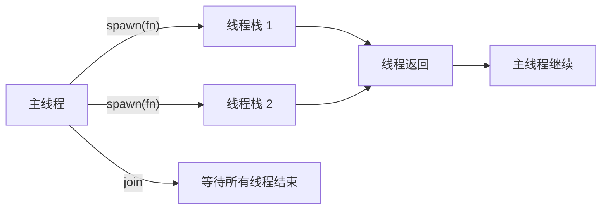
```mermaid
flowchart LR
    A["主线程"] -->|"spawn(fn)"| B["线程栈 1"]
    A -->|"spawn(fn)"| C["线程栈 2"]
    A -->|"join"| D["等待所有线程结束"]
    B --> E["线程返回"]
    C --> E
    E --> F["主线程继续"]
```


### 2.3 并发与并行

*(参考时间: 00:16)*

**并发**是逻辑上的同时执行：

- 可以在单个 CPU 上轮流执行；
- 在较长时间尺度上，两个任务都有进展；
- 由操作系统或运行时模拟。

**并行**是真正的物理同时执行：

- 多个处理器同时执行指令；
- 至少两个线程在同一时刻运行；
- 通常由共享内存多处理器提供。

并行程序一定并发，并发程序不一定并行。

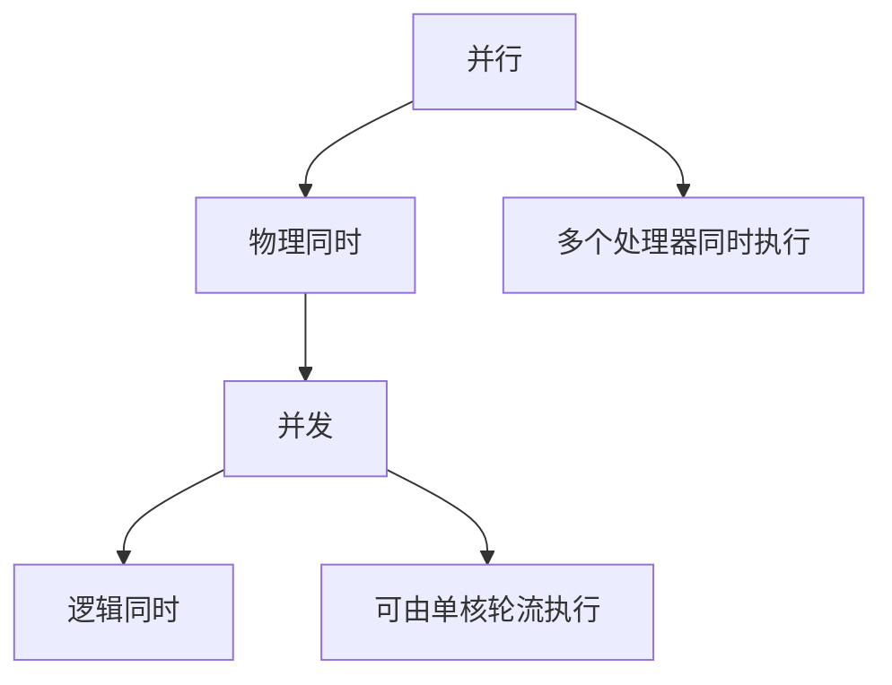
```mermaid
flowchart TD
    A["并发"] --> B["逻辑同时"]
    A --> C["可由单核轮流执行"]
    D["并行"] --> E["物理同时"]
    D --> F["多个处理器同时执行"]
    E --> A
```

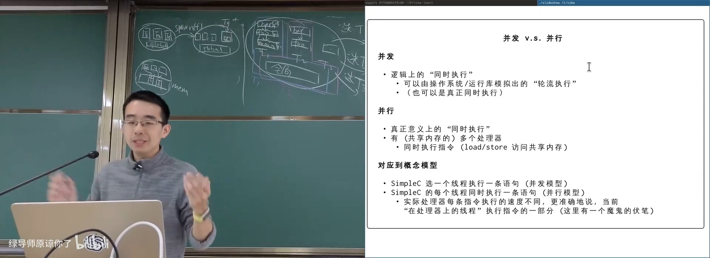

### 2.4 POSIX 线程与教学线程库

*(参考时间: 00:19)*

真实系统提供：

```text
pthreads(7)
```

课程线程库对其进行简化：

```c
spawn(worker);
join();
```

它内部仍使用 POSIX Threads。标准化接口让线程代码能够移植到 Linux、Android、鸿蒙等支持 POSIX 的平台。


```mermaid
flowchart LR
    A["课程线程库"] --> B["spawn / join"]
    B --> C["POSIX pthreads"]
    C --> D["Linux / Android / HarmonyOS / macOS"]
```

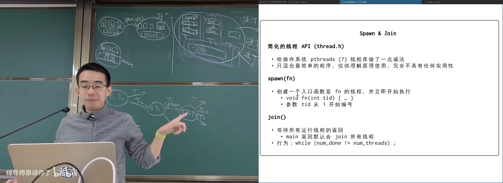

### 2.5 交替输出 A 与 B

*(参考时间: 00:22)*

两个线程分别执行：

```c
void print_a(int tid) {
    while (1) {
        putchar('A');
        fflush(stdout);
    }
}

void print_b(int tid) {
    while (1) {
        putchar('B');
        fflush(stdout);
    }
}
```

输出会交替出现 A 和 B，但顺序和连续长度不确定。原因包括：

- 操作系统何时把线程调度到 CPU 不确定；
- 两个线程所在处理器速度不同；
- 缓存状态、分支预测和其他线程都影响执行速度。

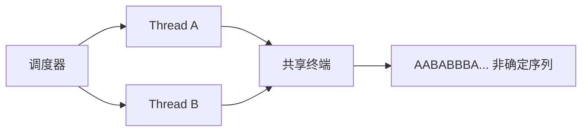
```mermaid
flowchart LR
    A["Thread A"] --> P["共享终端"]
    B["Thread B"] --> P
    S["调度器"] --> A
    S --> B
    P --> O["AABABBBA... 非确定序列"]
```

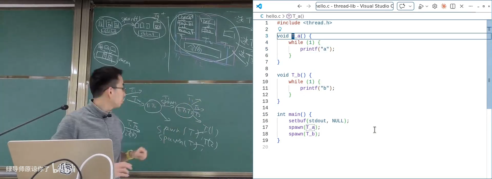

---

## 3. 验证共享内存与线程栈

### 3.1 用读写实验证明全局变量共享

*(参考时间: 00:24)*

```c
int x = 0;
int y = 0;

void inc_x(int tid) {
    while (1) {
        x++;
        sleep(1);
    }
}

void inc_y(int tid) {
    while (1) {
        y++;
        sleep(2);
    }
}
```

主线程持续打印 `x` 和 `y`。因为 `x` 增长比 `y` 快，主线程确实读到了其他线程写入的全局变量。

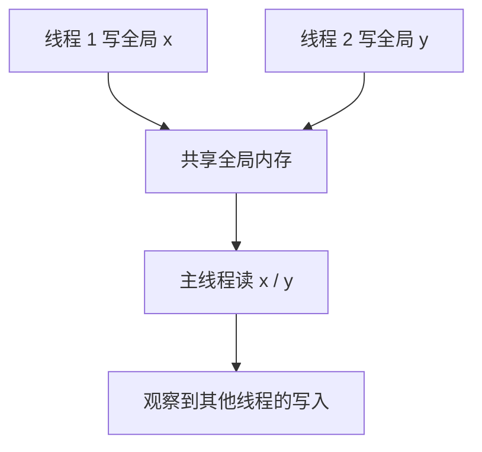
```mermaid
flowchart TD
    A["线程 1 写全局 x"] --> G["共享全局内存"]
    B["线程 2 写全局 y"] --> G
    G --> C["主线程读 x / y"]
    C --> D["观察到其他线程的写入"]
```

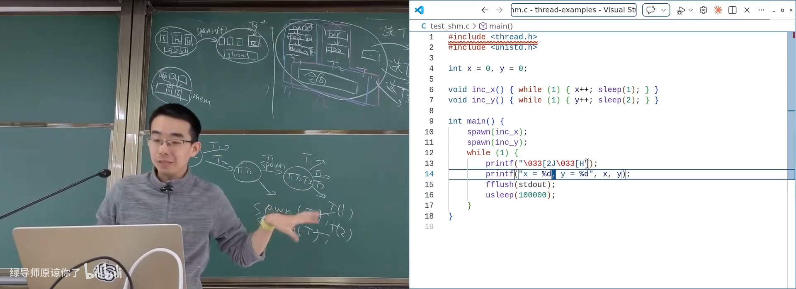

### 3.2 独立栈与 8 MiB 默认大小

*(参考时间: 00:26)*

每个线程栈位于同一个地址空间中，但占据不同区域。可以用递归探测栈范围：

```c
void probe(int depth) {
    volatile char scratch[64];
    update_range(&scratch);
    probe(depth + 1);
}
```

不断递归直到栈溢出，同时记录访问过的最高和最低地址，就能估算线程栈的大小。

Linux 默认线程栈通常约为 8 MiB：

```text
stack range ≈ 8192 KiB
```

主线程栈可以随虚拟内存增长，但额外创建的线程必须在创建时预留固定大小的栈区域。

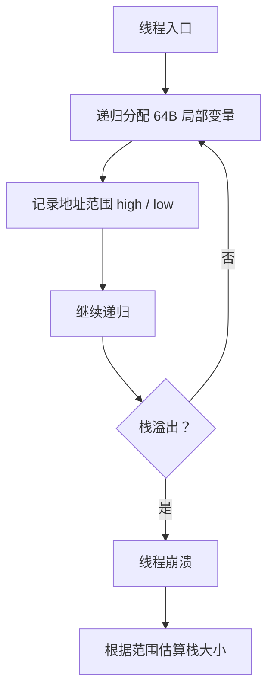
```mermaid
flowchart TD
    A["线程入口"] --> B["递归分配 64B 局部变量"]
    B --> C["记录地址范围 high / low"]
    C --> D["继续递归"]
    D --> E{"栈溢出？"}
    E -- "否" --> B
    E -- "是" --> F["线程崩溃"]
    F --> G["根据范围估算栈大小"]
```

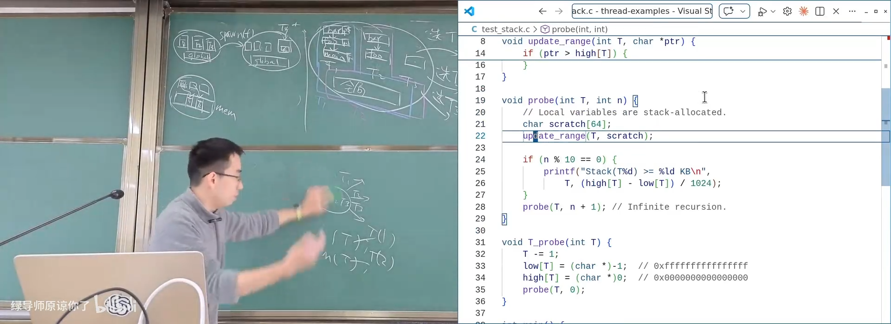

### 3.3 调试多线程程序

*(参考时间: 00:31)*

编译时带 `-g`，使用 GDB：

```gdb
break thread_fn
run
info threads
set scheduler-locking on
thread 2
step
thread 3
step
```

- `info threads` 列出所有线程；
- `thread N` 切换当前调试线程；
- `scheduler-locking on` 让其他线程在单步时暂停。

这样就能把实际多线程程序映射回课程的状态机模型：选择线程、执行一步、再选择另一个线程。

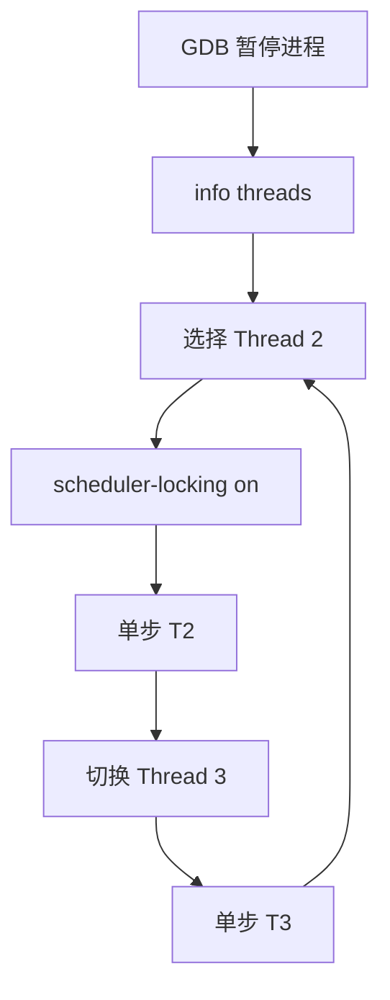
```mermaid
flowchart TD
    A["GDB 暂停进程"] --> B["info threads"]
    B --> C["选择 Thread 2"]
    C --> D["scheduler-locking on"]
    D --> E["单步 T2"]
    E --> F["切换 Thread 3"]
    F --> G["单步 T3"]
    G --> C
```

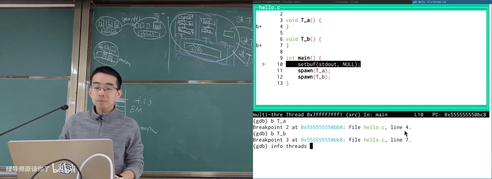

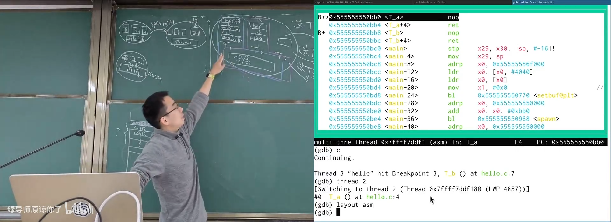

---

## 4. 放弃一：状态迁移不再确定

### 4.1 确定性与函数

*(参考时间: 00:35)*

数学函数满足确定性：

```text
f: X → Y
```

同一个输入永远产生同一个输出。

单线程程序在初始状态确定、系统调用结果确定时，也同样确定：

```text
s' = f(s)
```

每一步迁移都是一个函数，因此整个执行序列可以重复。顺序程序给开发者一种可控感：测试通过后，只要代码和输入不变，结果就不会改变。


```mermaid
flowchart LR
    S0["初始状态 s0"] --> F1["迁移 f"]
    F1 --> S1["s1"]
    S1 --> F2["迁移 f"]
    F2 --> S2["s2"]
    S2 --> S3["相同输入总是相同结果"]
```

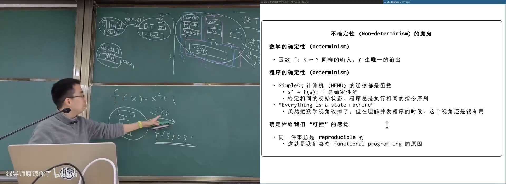

### 4.2 共享内存打破确定性

*(参考时间: 00:40)*

多线程程序每一步都可以选择不同线程：

```text
状态 s
  ├─ 选择 T1 → s1
  └─ 选择 T2 → s2
```

经过很多步以后，可能状态呈指数增长。一次 `load` 是否读到其他线程刚刚写入的值，也没有固定保证。

因此：

> 测试通过一百万次，也不代表程序正确。

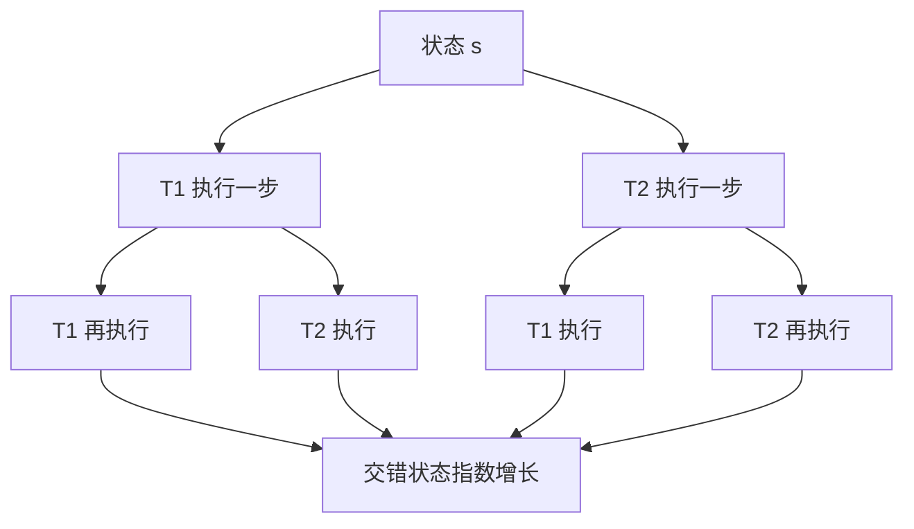
```mermaid
flowchart TD
    S["状态 s"] --> T1["T1 执行一步"]
    S --> T2["T2 执行一步"]
    T1 --> S11["T1 再执行"]
    T1 --> S12["T2 执行"]
    T2 --> S21["T1 执行"]
    T2 --> S22["T2 再执行"]
    S11 --> E["交错状态指数增长"]
    S12 --> E
    S21 --> E
    S22 --> E
```

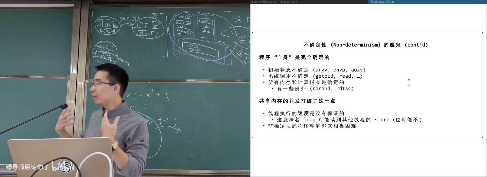

### 4.3 并发支付漏洞

*(参考时间: 00:42)*

一个看似正确的转账函数：

```c
unsigned int balance = 100;

int withdraw(unsigned int amount) {
    if (balance >= amount) {
        balance -= amount;
        return SUCCESS;
    }
    return FAIL;
}
```

如果两个线程同时：

1. 读取 `balance == 100`；
2. 都判断余额足够；
3. 各自执行 `balance -= 100`；

就会出现重复扣款或错误余额。如果 `balance` 是无符号整数，负数还可能回绕成巨大值。

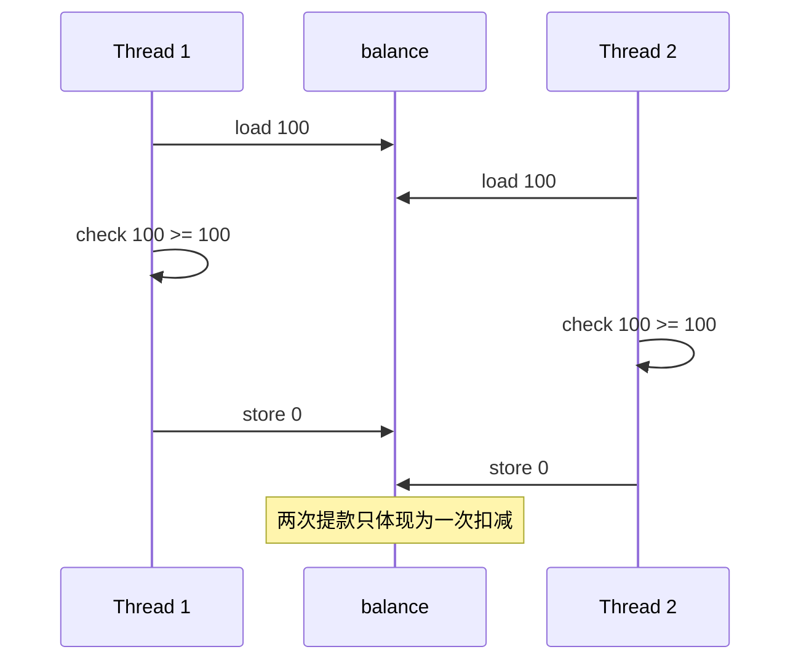
```mermaid
sequenceDiagram
    participant T1 as Thread 1
    participant M as balance
    participant T2 as Thread 2
    T1->>M: load 100
    T2->>M: load 100
    T1->>T1: check 100 >= 100
    T2->>T2: check 100 >= 100
    T1->>M: store 0
    T2->>M: store 0
    Note over M: 两次提款只体现为一次扣减
```

这类 check-then-act 问题不只是课堂玩具。课程提到 Mt. Gox 攻击造成约 650,000 BTC 损失，以及 Diablo I 物品复制等真实漏洞。

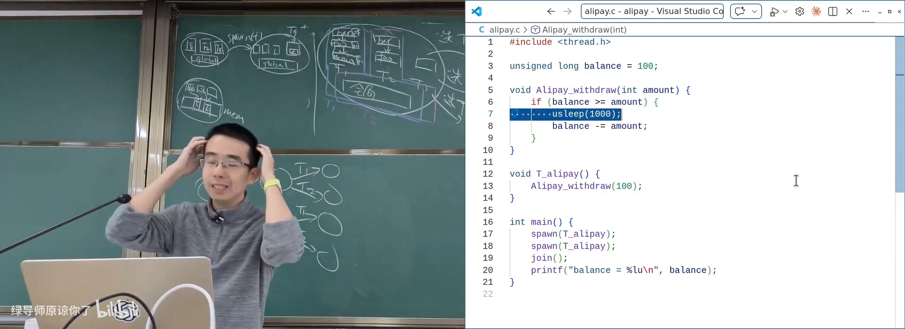

### 4.4 Diablo I 的物品复制

*(参考时间: 00:45)*

Diablo I 的复制过程依赖事件交错：

1. 玩家把要复制的物品丢到地上；
2. 角色正在执行“捡起地上物品”；
3. 玩家在角色完成动作前点击金币；
4. 两个事件竞争同一个全局“手中物品”变量；
5. 已写入的物品被金币覆盖；
6. 地上物品仍保留，于是物品被复制。

这不是传统多核并行，而是事件并发，但本质仍然是多个控制流交错修改共享状态。

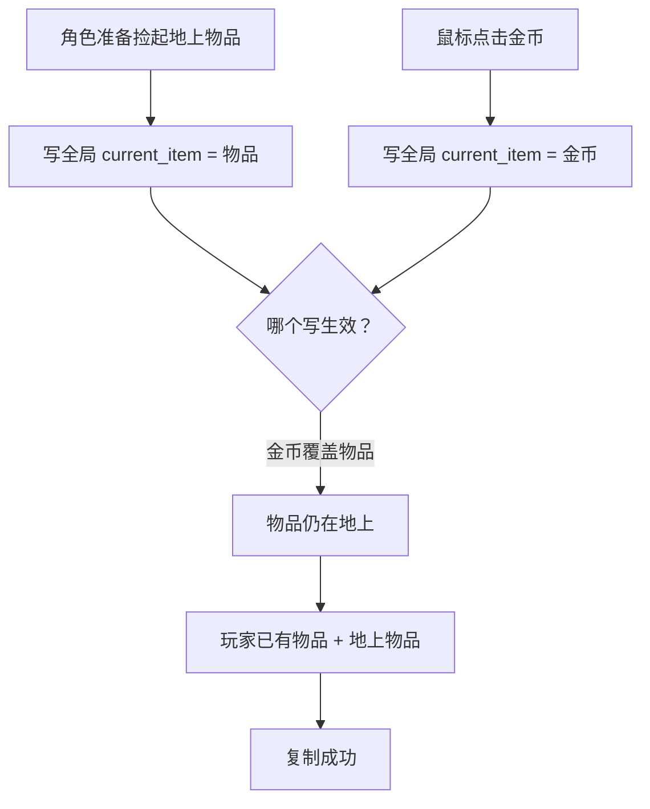
```mermaid
flowchart TD
    A["角色准备捡起地上物品"] --> B["写全局 current_item = 物品"]
    C["鼠标点击金币"] --> D["写全局 current_item = 金币"]
    B --> E{"哪个写生效？"}
    D --> E
    E -- "金币覆盖物品" --> F["物品仍在地上"]
    F --> G["玩家已有物品 + 地上物品"]
    G --> H["复制成功"]
```

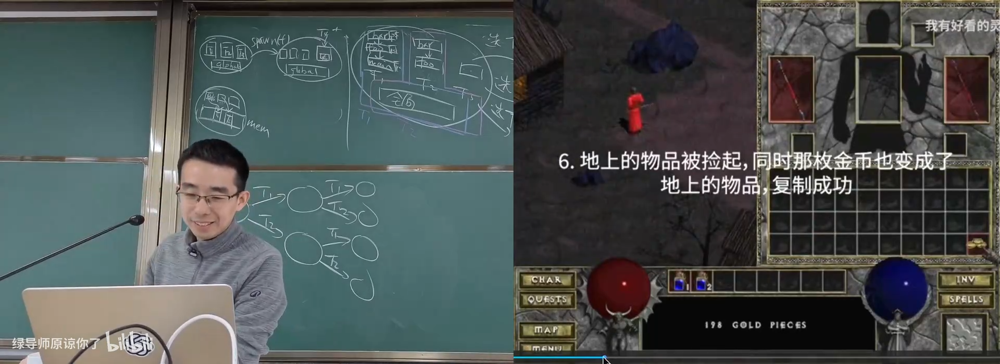

### 4.5 `sum++` 不是原子操作

*(参考时间: 00:47)*

```c
#define N 100000000

long sum = 0;

void T_sum(int tid) {
    for (int i = 0; i < N; i++) {
        sum++;
    }
}

int main(void) {
    spawn(T_sum);
    spawn(T_sum);
    join();
    printf("sum = %ld\n", sum);
}
```

`sum++` 至少包含：

```text
load sum → register
add 1
store register → sum
```

两个线程可能读同一个旧值，然后分别写回，后写者覆盖前写者。因此结果通常小于 `2N`，并且每次都不一样。

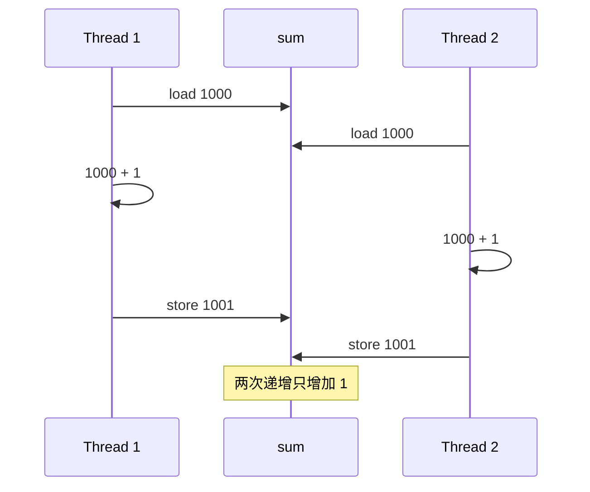
```mermaid
sequenceDiagram
    participant T1 as Thread 1
    participant M as sum
    participant T2 as Thread 2
    T1->>M: load 1000
    T2->>M: load 1000
    T1->>T1: 1000 + 1
    T2->>T2: 1000 + 1
    T1->>M: store 1001
    T2->>M: store 1001
    Note over M: 两次递增只增加 1
```

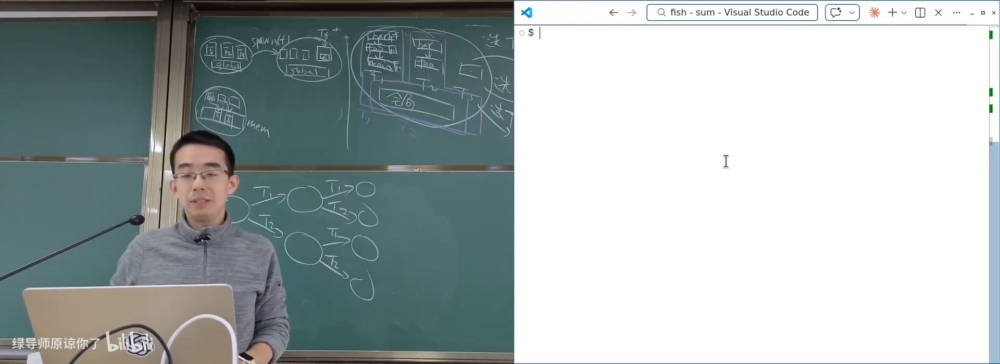

### 4.6 最小和是多少：一个 NP-hard 问题

*(参考时间: 00:49)*

把 `sum++` 拆为三条可交错语句：

```text
load R, sum
add R, 1
store sum, R
```

三个线程各执行三次。直觉会猜测最小值是 `3`，但正确最小值是 `2`。

原因可以这样构造：

- 让一个线程很晚才写回它在本轮读到的旧值；
- 期间其他线程已经完成很多递增；
- 最后再将旧值写回，覆盖掉大量增加。

课程把判断运行历史是否可映射到一个顺序一致全局顺序的问题做成小游戏。该问题的泛化版本可以归约为 NP-complete。

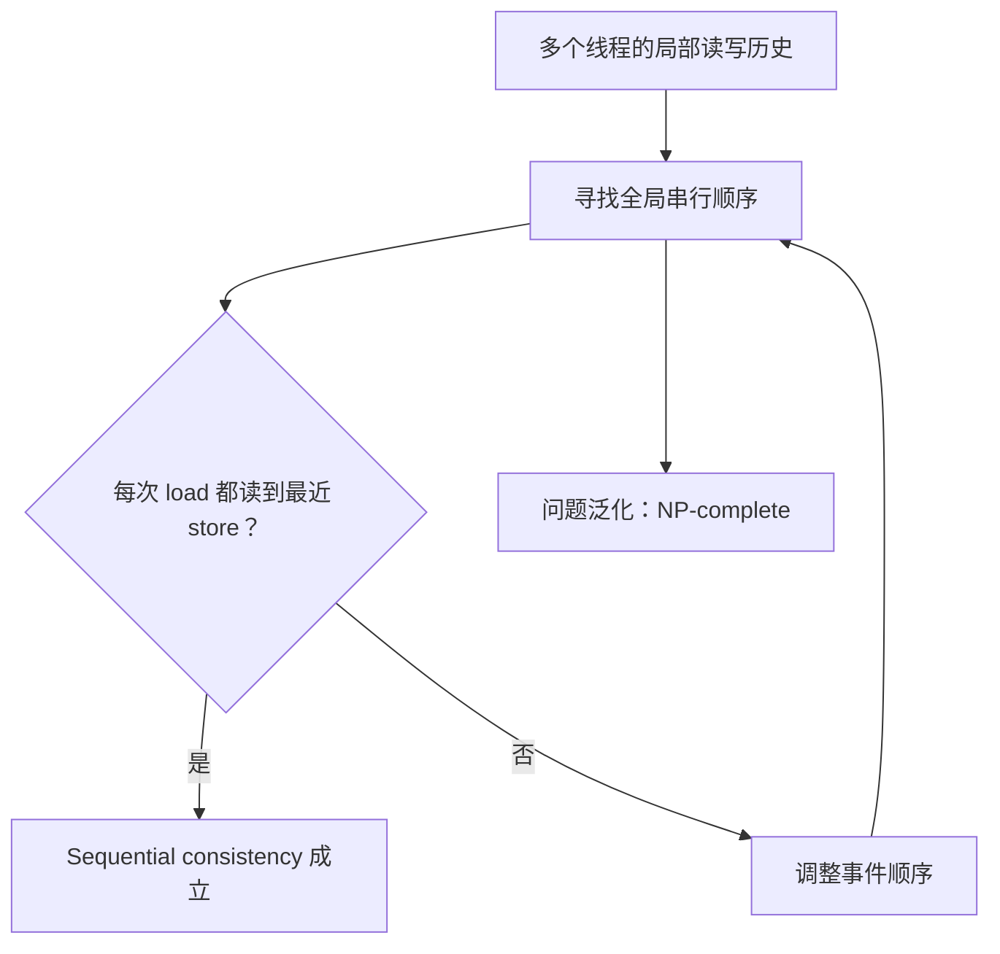
```mermaid
flowchart TD
    A["多个线程的局部读写历史"] --> B["寻找全局串行顺序"]
    B --> C{"每次 load 都读到最近 store？"}
    C -- "是" --> D["Sequential consistency 成立"]
    C -- "否" --> E["调整事件顺序"]
    E --> B
    B --> F["问题泛化：NP-complete"]
```

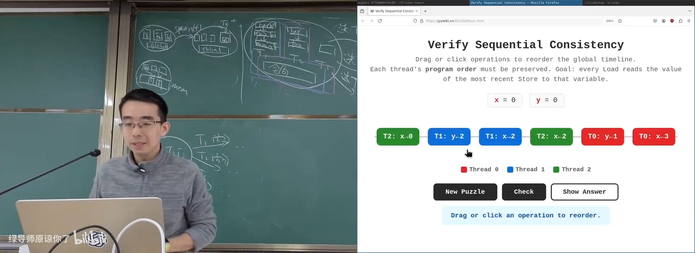

### 4.7 Dekker、Peterson 与错误算法

*(参考时间: 00:54)*

1960 年代，研究者试图在共享内存上实现原子性：

- 最早的算法只能处理两个线程；
- 很多算法被认为是正确的，后来却发现有漏洞；
- Dekker 算法是早期正确互斥算法之一；
- Peterson 的论文甚至指出，一些作者相信自己正确，其实不正确。

“写对 1 + 1” 的难度并不来自代码长度，而来自必须证明：

> 在所有线程交错和所有内存可见性结果下，互斥与进展性质都成立。

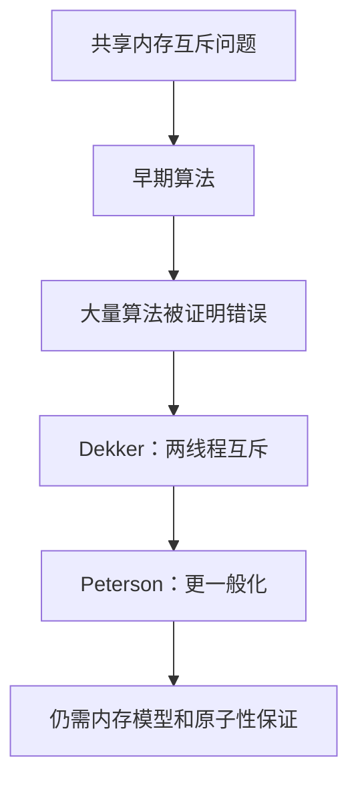
```mermaid
flowchart TD
    A["共享内存互斥问题"] --> B["早期算法"]
    B --> C["大量算法被证明错误"]
    C --> D["Dekker：两线程互斥"]
    D --> E["Peterson：更一般化"]
    E --> F["仍需内存模型和原子性保证"]
```

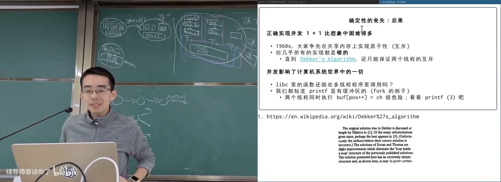

### 4.8 `printf` 缓冲区也会共享

*(参考时间: 00:56)*

`printf` 中存在共享 `FILE` 缓冲：

```c
buf->pos++;
buf->data[pos] = ch;
```

如果多个线程同时写同一个缓冲区，就可能出现覆盖、丢失和内容交错。

标准库通过锁或其他同步机制保证 `printf` 的线程安全，但“线程安全”不等于多个调用会作为一个原子组合执行。多个 API 调用之间仍然需要应用自己同步。

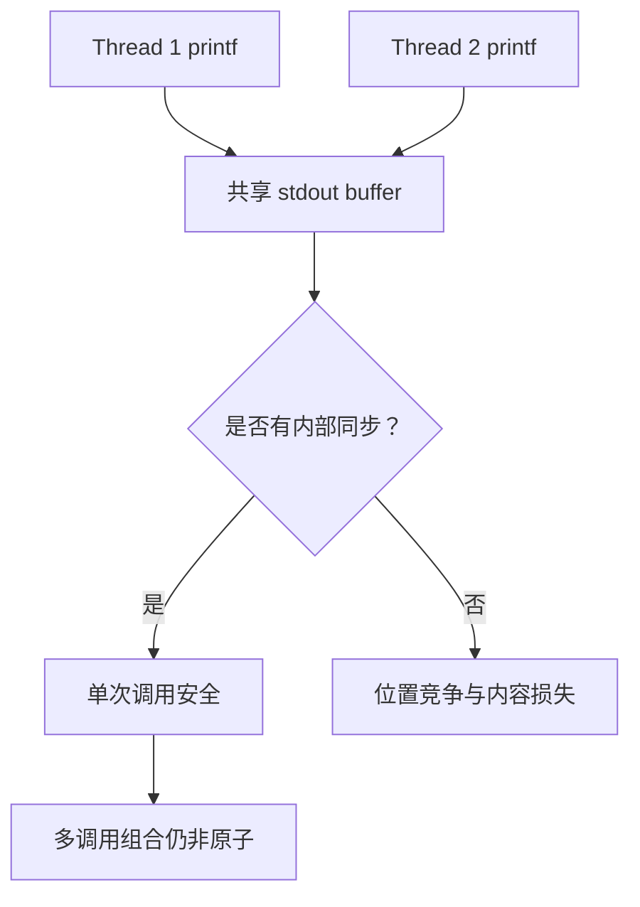
```mermaid
flowchart TD
    A["Thread 1 printf"] --> B["共享 stdout buffer"]
    C["Thread 2 printf"] --> B
    B --> D{"是否有内部同步？"}
    D -- "是" --> E["单次调用安全"]
    D -- "否" --> F["位置竞争与内容损失"]
    E --> G["多调用组合仍非原子"]
```

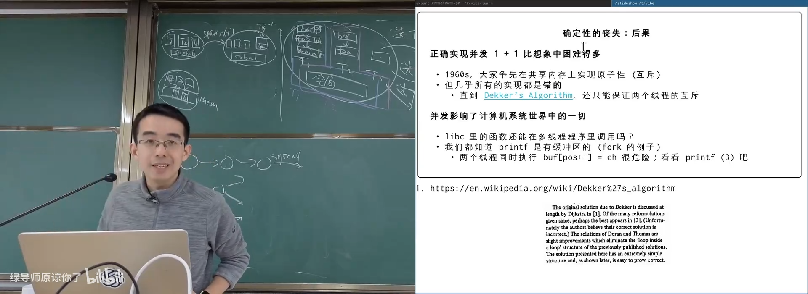

---

## 5. 放弃二：并不存在顺序执行幻想

### 5.1 编译器假设程序是确定性的

*(参考时间: 00:59)*

性能非常昂贵，而编译器是性能优化的核心。Francis Allen 因编译优化贡献获得 2006 年图灵奖。

编译器允许做：

- 内联；
- 常量传播；
- 死代码删除；
- 循环不变量外提；
- 指令重排；
- 消除重复 load / store。

这些优化以“顺序程序语义不变”为前提。可一旦其他线程能修改共享变量，这个前提就不成立。

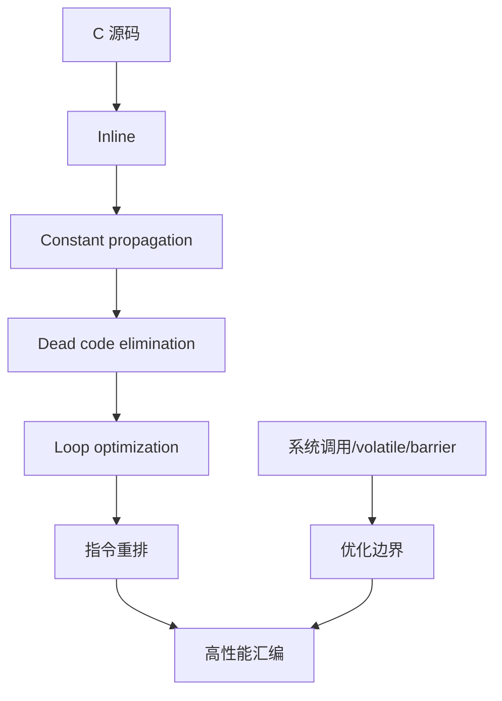
```mermaid
flowchart TD
    A["C 源码"] --> B["Inline"]
    B --> C["Constant propagation"]
    C --> D["Dead code elimination"]
    D --> E["Loop optimization"]
    E --> F["指令重排"]
    F --> G["高性能汇编"]
    H["系统调用/volatile/barrier"] --> I["优化边界"]
    I --> G
```

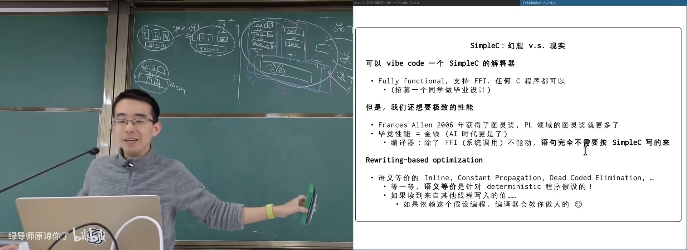

### 5.2 等待旗子的代码为何会死循环

*(参考时间: 01:03)*

两个线程像人一样共享教室空间：

- 每个线程有自己的“脑子”，也就是私有栈；
- 全局变量是教室里大家都能触碰的物体；
- 一个线程举起 `flag`，另一个线程等待旗子。

代码：

```c
while (!flag) {
    /* wait */
}
```

顺序程序里，如果循环中没有修改 `flag`，编译器可以假设 `flag` 永远不变：

```text
if (!flag) {
    while (1) { }
}
```

于是另一个线程即使真的把 `flag` 设成 1，当前线程也可能永远读不到。

```mermaid
flowchart TD
    A["while (!flag)"] --> B["编译器分析顺序语义"]
    B --> C{"循环体内修改 flag？"}
    C -- "否" --> D["假设 flag 不变化"]
    D --> E["load flag 提到循环外"]
    E --> F["另一个线程写 flag 无效"]
    F --> G["死循环"]
```

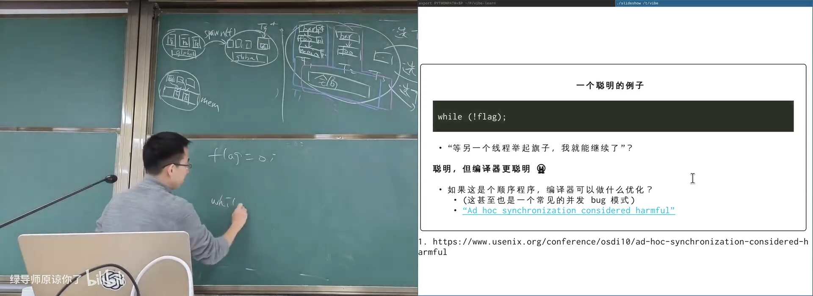

### 5.3 `-O1` 与 `-O2` 下完全不同的求和

*(参考时间: 01:07)*

同一份多线程求和代码：

- `-O1` 常得到 `N`；
- `-O2` 却可能得到看起来正确的 `2N`。

`-O1` 的汇编可能把 `sum`：

```text
load sum 一次
循环在寄存器中 N 次加一
store sum 一次
```

两个线程几乎同时加载相同旧值，最后各自写回，因此最终只增加一份 `N`。

`-O2` 可能把整个循环优化为：

```text
sum += N
```

两个加法执行只有很少几条指令，碰撞窗口非常窄，反而“经常得到正确结果”。

这正是最危险的情况：测试经常通过，但程序并没有正确同步。

```mermaid
flowchart TD
    A["同一份并发求和代码"] --> B["-O1"]
    A --> C["-O2"]
    B --> D["一件 load + 长循环 + 一件 store"]
    D --> E["两个线程覆盖彼此，结果常为 N"]
    C --> F["sum += N，仅几条指令"]
    F --> G["冲突窗口很小，结果常为 2N"]
    E --> H["两次运行行为不同"]
    G --> H
```


### 5.4 Compiler Barrier 与 `volatile`

*(参考时间: 01:09)*

可以插入空汇编阻止优化穿透：

```c
while (!flag) {
    asm volatile("" ::: "memory");
}
```

也可以让变量每次真实访问内存：

```c
volatile int flag;
```

这些技术在嵌入式内存映射寄存器和底层代码中有用，但课程明确不建议用它们来“玩共享内存”。

原因是：

- 它们只约束编译器，不约束 CPU 乱序和缓存；
- 语言级数据竞争在 C/C++ 中仍是 undefined behavior；
- 正确方案应使用语言或系统提供的原子变量、锁和内存序。

```mermaid
flowchart TD
    A["优化打破并发假设"] --> B["Compiler barrier"]
    A --> C["volatile"]
    B --> D["限制编译器移动"]
    C --> E["限制编译器合并 load/store"]
    D --> F["仍无法单独解决 CPU/缓存乱序"]
    E --> F
    F --> G["使用标准原子与同步原语"]
```

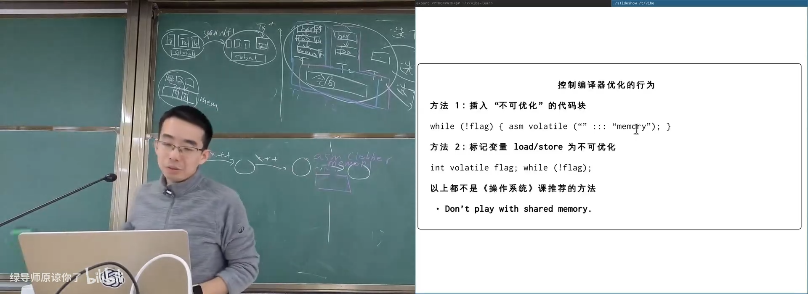

---

## 6. 放弃三：处理器也不是顺序执行

### 6.1 CPU 也是一层编译器

*(参考时间: 01:12)*

程序经历两层“编译”：

```text
.c → .s：软件编译器优化
.s → CPU 内部状态：处理器再次分析、重排和并行执行
```

现代 CPU：

- 同时取入、译码多条指令；
- 分析数据依赖；
- 将互不依赖的指令并行执行；
- 让慢速 load/store 后续的指令继续推进；
- 使用分支预测提前执行可能路径。

```mermaid
flowchart TD
    A["C 源码"] --> B["编译器优化"]
    B --> C["汇编指令"]
    C --> D["CPU 取指 / 译码"]
    D --> E["动态数据流分析"]
    E --> F["乱序执行"]
    F --> G["结果按架构规则提交"]
```

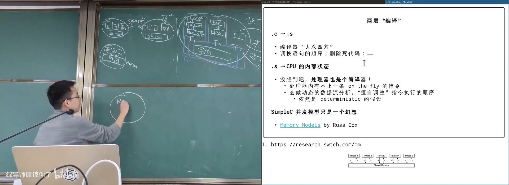

### 6.2 超标量与乱序执行

*(参考时间: 01:15)*

两条彼此独立的指令可以被调换：

```asm
mov 1, x
mov 2, y
```

最终结果等价，但中间状态和内存可见顺序可能不同。现代处理器还可能在同一个时钟周期内执行多条指令。

对单线程来说，硬件只需保证“可观察结果”等价；对多线程来说，其他处理器何时看到某个写，就变成了程序行为的一部分。

```mermaid
flowchart LR
    A["指令 1: mov 1, x"] --> C["重排窗口"]
    B["指令 2: mov 2, y"] --> C
    C --> D["并行执行"]
    D --> E["各自写入缓存 / store buffer"]
    E --> F["其他 CPU 可见顺序不确定"]
```

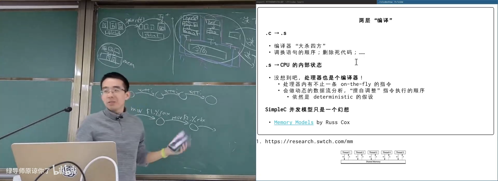

### 6.3 宽松内存模型

*(参考时间: 01:16)*

真实共享内存更像每 CPU 有一份本地缓存副本：

- store 先写本地缓存或 store buffer；
- 稍后再同步给其他处理器；
- load 可能先看到本地旧值；
- 所有内存最终收敛，但中间可见顺序没有统一瞬时视图。

这与课程模型中的“每一步选择一个线程写全局内存”完全不同。

```mermaid
flowchart LR
    A["CPU 0 store x=1"] --> B["CPU 0 local cache"]
    B --> C["cache coherence / memory order"]
    C --> D["CPU 1 cache"]
    E["CPU 1 load x"] --> D
    F["CPU 1 load y"] --> G["CPU 1 store y=1"]
    G --> D
    D --> H["最终一致，但观察顺序可不同"]
```

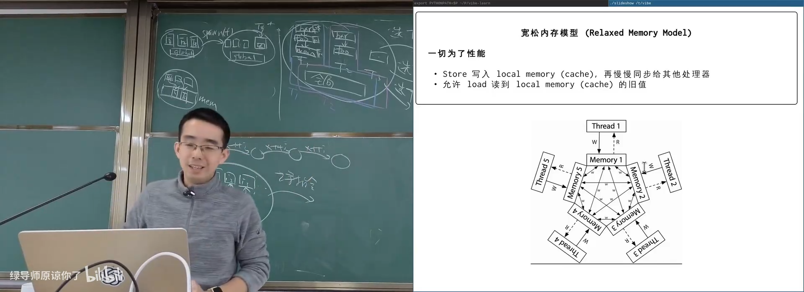

### 6.4 Litmus Test：理论上不可能出现的 0, 0

*(参考时间: 01:18)*

考虑两个线程：

```c
int x = 0, y = 0;

void T1(void) {
    x = 1;
    int r1 = y;
}

void T2(void) {
    y = 1;
    int r2 = x;
}
```

在顺序一致模型中：

- 至少有一个 store 先发生；
- 因此不可能两个 load 都读到 0；
- 可能结果包括 `(1,0)`、`(0,1)`、`(1,1)`；
- 不可能出现 `(0,0)`。

在宽松内存模型下，`(0,0)` 可能出现：

1. CPU 0 把 `x=1` 写入本地 store buffer；
2. CPU 1 把 `y=1` 写入本地 store buffer；
3. CPU 0 还没有看到 `y=1`，读到 `y=0`；
4. CPU 1 还没有看到 `x=1`，读到 `x=0`；
5. 最终两个 store 再传播。

```mermaid
sequenceDiagram
    participant C0 as CPU 0 / T1
    participant B0 as Store Buffer 0
    participant B1 as Store Buffer 1
    participant C1 as CPU 1 / T2
    C0->>B0: x = 1
    C1->>B1: y = 1
    C0->>C0: load y → 0
    C1->>C1: load x → 0
    B0-->>C1: x = 1 later
    B1-->>C0: y = 1 later
```

```mermaid
flowchart TD
    A["顺序一致模型"] --> B["(0,0) 不可能"]
    C["宽松内存模型"] --> D["(0,0) 可能出现"]
    D --> E["两个 store 都仍在本地缓冲区"]
    E --> F["两个 load 都读到旧值"]
```

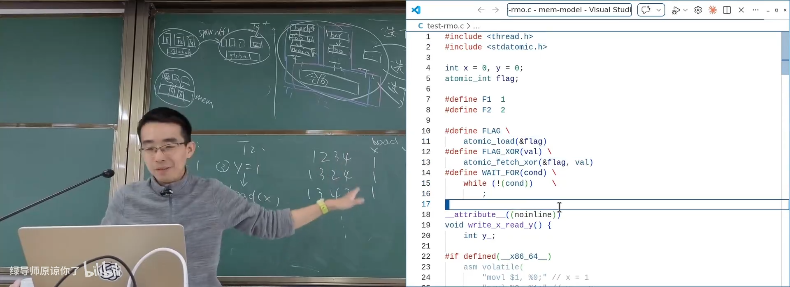

### 6.5 用 Unix 管道做大量实验

*(参考时间: 01:20)*

课程反复运行 litmus test，再通过管道处理结果：

```bash
./litmus | head -n 100000 | sort | uniq -c
```

实验可能观察到：

```text
0 0   6xxxx times
0 1   3xxxx times
1 0   少量
1 1   少量或不可见
```

具体数量会随机器、负载、打印和同步方式变化，但它证明 `(0,0)` 的确在现实中发生。

```mermaid
flowchart LR
    A["litmus test"] --> B["Head 限制次数"]
    B --> C["sort"]
    C --> D["uniq -c"]
    D --> E["统计每种观察结果"]
    E --> F["观察到违反顺序一致的结果"]
```

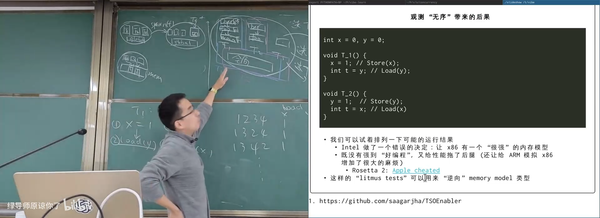

---

## 7. 总结：要放弃的是什么

### 7.1 放弃简化直觉，而不是并发编程

*(参考时间: 01:22)*

“从入门到放弃”不是不再并发，而是放弃以下幻想：

- 认为线程按源码语句逐条顺序执行；
- 认为一次测试通过就代表程序正确；
- 认为编译器不会重排共享内存访问；
- 认为 CPU 会按程序顺序让其他处理器看到 store；
- 认为 `sum++` 是一条不可分割的语句。

```mermaid
flowchart TD
    A["需要放弃的幻想"] --> B["状态迁移确定"]
    A --> C["顺序执行"]
    A --> D["指令顺序对全局可见"]
    B --> E["使用同步与原子操作"]
    C --> E
    D --> E
    E --> F["理解并发、控制并发"]
```

### 7.2 正确工程的防线

后续课程会引入互斥、同步和并发控制：

- mutex / lock；
- condition variable；
- atomic operations；
- memory ordering；
- lock-free data structure 及其正确性证明。

操作系统需要为线程提供稳定的同步原语，而不是把裸共享内存和宽松内存模型直接交给应用开发者。

```mermaid
flowchart TD
    A["裸共享内存"] --> B["Mutex"]
    A --> C["Condition Variable"]
    A --> D["Atomic"]
    A --> E["Memory Ordering"]
    B --> F["先保证互斥"]
    C --> G["等待与唤醒"]
    D --> H["不可分割读改写"]
    E --> I["限定可见顺序"]
    F --> J["可控的并发程序"]
    G --> J
    H --> J
    I --> J
```

### 7.3 AI 时代的思考

*(参考时间: 01:22)*

如果把 AI 看作“核动力牛马”，人类不需要为了操作方便获得一把没有保护措施的刀。更合理的方向是：

- 默认接口安全、可组合；
- 只在 extreme hot path 上开放最低层机制；
- 让 AI 处理复杂细节和验证；
- 人类保留概念、目标和 critical thinking。

```mermaid
flowchart LR
    A["AI 处理大量重复与低层细节"] --> B["默认使用安全抽象"]
    B --> C["关键路径开放极致性能接口"]
    C --> D["工具验证并发正确性"]
    D --> E["人类控制目标、边界与风险"]
```

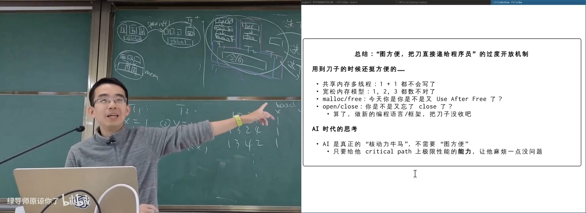

---

## 8. 讲义延伸：并发程序的状态模型

> **编者说明**：以下是对官方讲义中状态机模型的归纳，用于连接本章概念。

单线程程序：

```text
Program State = Globals + Stack + PC
NextState = f(ProgramState)
```

共享内存线程：

```text
Program State =
    Globals
  + [Stack1 + PC1]
  + [Stack2 + PC2]
  + ...

Next(State) =
    choose(thread_i)
    execute_one_step(thread_i, shared_globals)
```

概念模型非常简单，难点是：

- `choose` 没有固定规则；
- `execute_one_step` 中的 load/store 不一定直接访问全局内存；
- 编译器和 CPU 会改变真实执行顺序；
- C/C++ 数据竞争本身进入 undefined behavior。

```mermaid
flowchart TD
    A["概念模型：选择线程执行一步"] --> B["规范层：Sequential Consistency"]
    B --> C["编译器实现层"]
    C --> D["CPU 乱序执行层"]
    D --> E["缓存与内存一致性层"]
    E --> F["语言内存模型"]
    F --> G["应用同步原语"]
    G --> H["真正可推理的并发行为"]
```

---

## 9. 总结：现代计算机系统中最危险的抽象漏洞

这一讲从最容易理解的地方出发，却逐步拆掉了三个基础假设：

1. **确定性**：多线程执行不再只有一条状态迁移轨迹；
2. **顺序执行**：编译器会按单线程语义重写程序；
3. **指令顺序**：CPU 和缓存会让 store 对不同处理器以不同顺序可见。

同时，课程用大量例子展示了后果：

- 并发提款；
- Diablo 物品复制；
- `sum++` 丢失更新；
- NP-complete 的执行历史重建；
- `while (!flag)` 被优化成死循环；
- `-O1` / `-O2` 下结果完全不同；
- `(0,0)` 在 litmus test 中出现；
- `printf` 的缓存也依赖线程安全实现。

```mermaid
flowchart LR
    A["线程模型"] --> B["非确定性"]
    B --> C["数据竞争"]
    C --> D["编译器优化"]
    D --> E["CPU 乱序"]
    E --> F["放宽内存模型"]
    F --> G["需要同步原语"]
    G --> H["从入门到放弃，再从控制中重建"]
```

课程的核心结论是：

> 不要直接玩弄共享内存。

并不是永远不用并发，而是要使用明确的同步机制，把不确定的交错限制在可推理的边界内。接下来的课程将正式进入互斥和同步，学习怎样把“魔鬼”重新装回盒子里。

---

## 附：官方参考与延伸阅读

以下链接来自官方讲义第 13 讲及课堂内容：

- [Mini thread library](https://jyywiki.cn/OS/demos/concurrency/thread-lib)
- [Thread behavior examples](https://jyywiki.cn/OS/demos/concurrency/thread-examples)
- [Fake Alipay demo](https://jyywiki.cn/OS/demos/concurrency/alipay)
- [Diablo item clone video](https://jyywiki.cn/OS/img/diablo-item-clone.mp4)
- [Sum with mutex API](https://jyywiki.cn/OS/demos/concurrency/sum-mutexapi)
- [Trace Recovery is NP-Complete](https://epubs.siam.org/doi/10.1137/S0097539794279614)
- [VSC concurrency puzzle](https://jyywiki.cn/OS/2026/vsc.html)
- [Dekker’s Algorithm](https://en.wikipedia.org/wiki/Dekker%27s_algorithm)
- [Ad Hoc Synchronization Considered Harmful](https://www.usenix.org/conference/osdi10/ad-hoc-synchronization-considered-harmful)
- [Relaxed memory model demo](https://jyywiki.cn/OS/demos/concurrency/mem-model)
- [Russ Cox, Memory Models](https://research.swtch.com/mm)
- [GDB Threads](https://sourceware.org/gdb/onlinedocs/gdb/Threads.html)

阅读材料：

- *Operating Systems: Three Easy Pieces* 第 25 章，Dialogue on Concurrency；
- 第 26 章，Concurrency and Threads；
- 第 27 章，Thread API；
- Russ Cox, Memory Models。

官方课程资料：

- [课程主页](https://jyywiki.cn/OS/2026/)
- [第 13 讲讲义：多处理器编程](https://jyywiki.cn/OS/2026/lect13.md)
- [视频：13 - 多处理器编程：从入门到放弃](https://www.bilibili.com/video/BV1vgQGBREyJ/)

> **版权与署名**：本讲课程材料由蒋炎岩（jyy）编写。课程讲义与幻灯片采用 [Creative Commons BY-NC 4.0](http://creativecommons.org/licenses/by-nc/4.0/) 许可；本电子书保留课程出处、作者署名与许可说明。
