# 并发控制：互斥

> **课程**：2026 春季学期《操作系统原理》  
> **讲师**：蒋炎岩（jyy）  
> **官方课程主页**：<https://jyywiki.cn/OS/2026/>  
> **官方讲义**：<https://jyywiki.cn/OS/2026/lect14.md>  
> **视频来源**：[Bilibili BV1hNdhB1Efe](https://www.bilibili.com/video/BV1hNdhB1Efe/)  
> **版权说明**：课程讲义与幻灯片归蒋炎岩所有，采用 [Creative Commons BY-NC 4.0](http://creativecommons.org/licenses/by-nc/4.0/) 许可；本电子书是对课堂讲授的书面化重构，保留出处与许可说明。

## 导语：把并发重新装回可控的盒子里

*(参考时间: 00:00)*

上一讲已经证明：共享内存并发会打破确定性、顺序执行和指令顺序三个直觉。

这一讲不再继续“玩火”，而是尝试把并发限制在明确边界内：

```text
make_it_work {
    sum++;
}
```

如果一段代码在任何执行交错下都表现为“不与其他同类代码块并发执行”，就能把这段临界区退化成顺序代码。

这个机制称为：

> **互斥（mutual exclusion / mutex）**


```mermaid
flowchart LR
    A["共享内存并发"] --> B["非确定性与数据竞争"]
    B --> C["找出必须串行的代码"]
    C --> D["互斥：同一时间只允许一个线程"]
    D --> E["临界区重新获得顺序语义"]
```

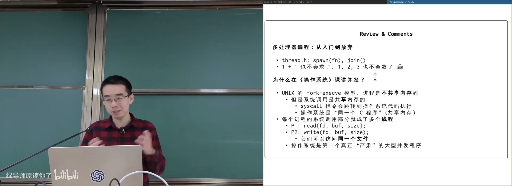

---

## 1. 为什么操作系统必须处理并发

### 1.1 `fork` 不共享内存，系统调用却共享内核

*(参考时间: 00:01)*

早期 UNIX 中：

- 一个进程执行 `fork` 后，父子进程是独立地址空间；
- `execve` 也不默认共享用户态内存；
- 可是系统调用会从用户态跳入同一份内核代码。

因此：

```c
P1: read(fd, buf, size);
P2: write(fd, buf, size);
```

两个进程在内核中可以被视为两个线程：

- 用户态地址空间不同；
- 内核对象与内核数据结构相同；
- 中断或另一个 CPU 可能随时打断当前内核路径。

所以操作系统是第一个真正严肃的大型并发程序，很多早期并发研究也来自操作系统。

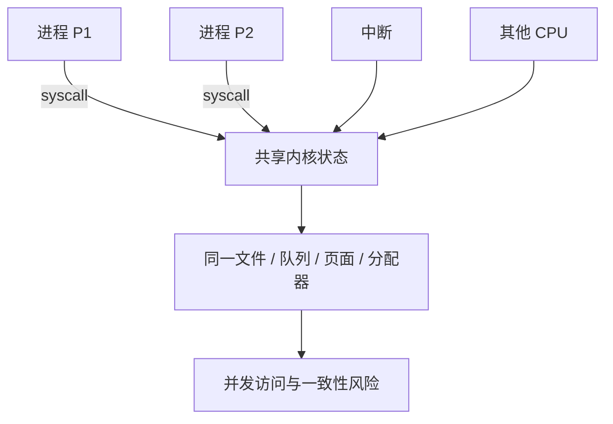
```mermaid
flowchart TD
    P1["进程 P1"] -->|"syscall"| K["共享内核状态"]
    P2["进程 P2"] -->|"syscall"| K
    I["中断"] --> K
    C["其他 CPU"] --> K
    K --> D["同一文件 / 队列 / 页面 / 分配器"]
    D --> R["并发访问与一致性风险"]
```

### 1.2 “make it work” 的历史方案

*(参考时间: 00:04)*

我们希望有一个语言或系统机制，让一段代码：

```c
make_it_work {
    sum++;
    update_tree();
    append_log();
}
```

表现为统一的原子操作：

- 要么全部完成；
- 要么像从未执行；
- 中间状态不对其他线程或事务可见。

这接近 **Transactional Memory**。Intel 曾通过 `xbegin` / `xend` 提供 TSX，ARM 也有过类似事务扩展。但这类指令影响几乎全部指令语义，实现和维护复杂度极高，并曾牵涉安全问题。

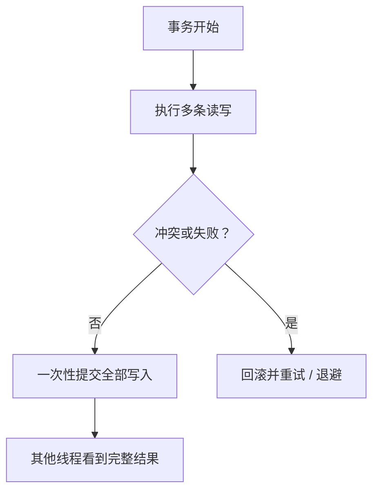
```mermaid
flowchart TD
    A["事务开始"] --> B["执行多条读写"]
    B --> C{"冲突或失败？"}
    C -- "否" --> D["一次性提交全部写入"]
    C -- "是" --> E["回滚并重试 / 退避"]
    D --> F["其他线程看到完整结果"]
```

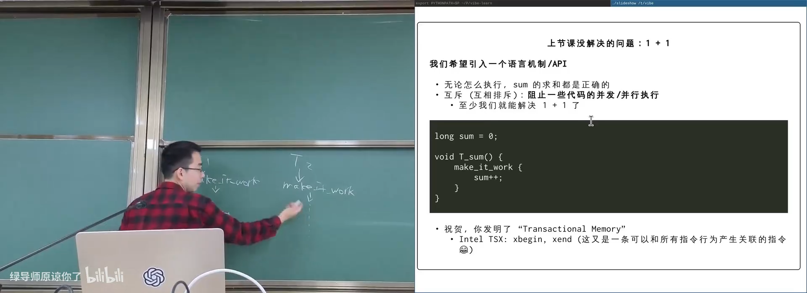

---

## 2. 最简单的起点：单处理器关闭中断

### 2.1 内核中的 stop the world

*(参考时间: 00:06)*

在单处理器内核中，可以在很短的关键区内关闭中断：

```c
disable_interrupt();
sum++;
enable_interrupt();
```

关闭中断后：

- CPU 不再接收其他设备中断；
- 不会发生中断驱动的线程切换；
- 当前处理器上的执行暂时变成确定顺序。

但这是操作系统内核的能力，而且必须很短。如果关闭中断后进入死循环，整台机器会失去响应。

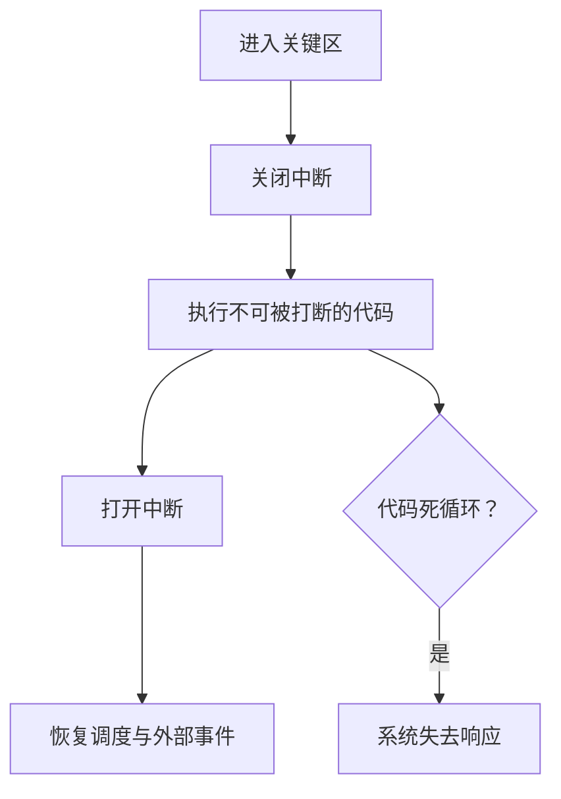
```mermaid
flowchart TD
    A["进入关键区"] --> B["关闭中断"]
    B --> C["执行不可被打断的代码"]
    C --> D["打开中断"]
    D --> E["恢复调度与外部事件"]
    C --> F{"代码死循环？"}
    F -- "是" --> G["系统失去响应"]
```


```mermaid
flowchart LR
    U["用户态程序"] --> A["尝试执行 cli / MSR 中断控制"]
    A --> B["特权级检查失败"]
    B --> C["Illegal instruction / Segfault / Protection fault"]
    C --> D["用户程序无权关闭中断"]
```

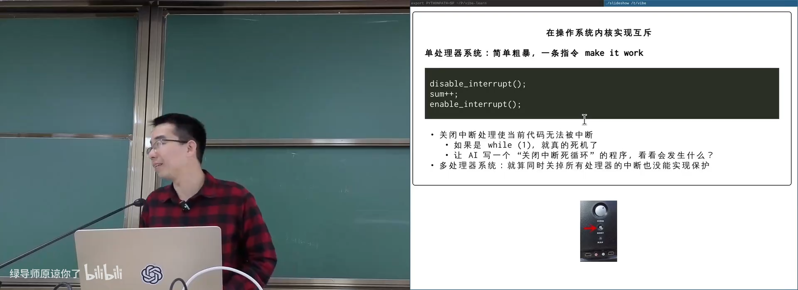

### 2.2 用户态执行特权指令会失败

*(参考时间: 00:09)*

在用户态尝试关闭中断：

```asm
cli
```

或通过 MSR 清除中断位，会被处理器拒绝。不同平台分别可能表现为：

```text
Illegal instruction
SIGSEGV
Protection fault
```

这体现了操作系统与应用程序的权限边界：共享资源保护机制可以借助硬件特权，但不能让任意用户代码破坏整个系统。

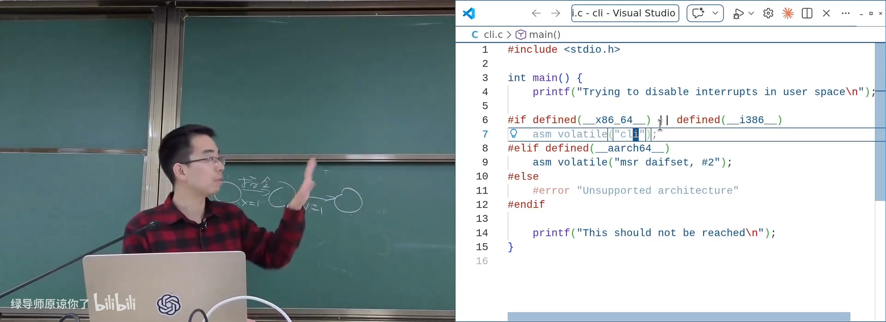

---

## 3. 互斥 API

### 3.1 `lock` / `unlock`

*(参考时间: 00:10)*

标准形式：

```c
mutex_lock(&lock);
sum++;
mutex_unlock(&lock);
```

语义是：

- `lock` 成功返回后，当前线程进入临界区；
- 同一把锁保护的临界区不会同时执行；
- `unlock` 释放锁，并保证临界区内的写在后续获取同一把锁的线程中可见；
- 其他线程若有冲突访问，也必须使用同一把锁。

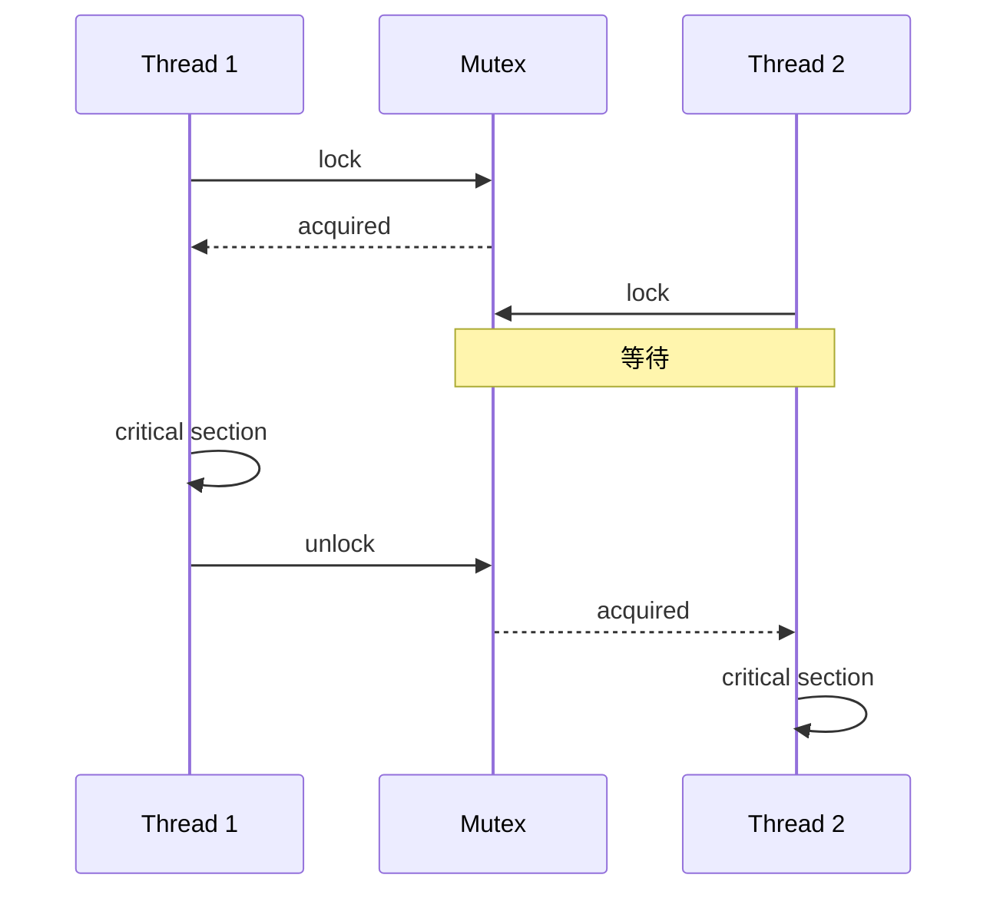
```mermaid
sequenceDiagram
    participant T1 as Thread 1
    participant L as Mutex
    participant T2 as Thread 2
    T1->>L: lock
    L-->>T1: acquired
    T2->>L: lock
    Note over T2,L: 等待
    T1->>T1: critical section
    T1->>L: unlock
    L-->>T2: acquired
    T2->>T2: critical section
```

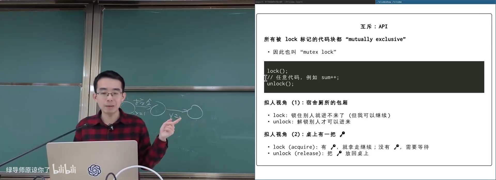

### 3.2 两种拟人视角

*(参考时间: 00:13)*

**房间视角**：

- `lock`：进入只能容纳一人的房间并锁门；
- `unlock`：离开房间，其他人可以进入。

**钥匙视角**：

- 桌上只有一把钥匙；
- `lock` / `acquire`：拿走钥匙才能继续；
- `unlock` / `release`：把钥匙放回。

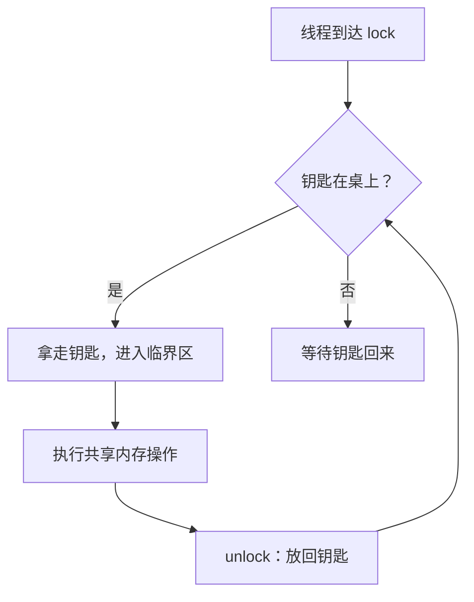
```mermaid
flowchart TD
    A["线程到达 lock"] --> B{"钥匙在桌上？"}
    B -- "是" --> C["拿走钥匙，进入临界区"]
    B -- "否" --> D["等待钥匙回来"]
    C --> E["执行共享内存操作"]
    E --> F["unlock：放回钥匙"]
    F --> B
```

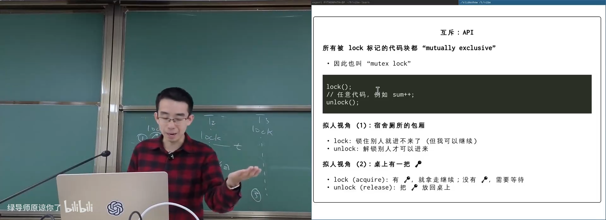

### 3.3 Acquire / Release 的内存语义

*(参考时间: 00:14)*

锁不仅是“只允许一个线程进入”，它还必须提供可见性保证：

- **release** 之前的写，在之后的 **acquire** 中可见；
- acquire 不能被重排到临界区读之后；
- release 不能被重排到临界区写之前；
- 这建立了线程之间的同步关系。

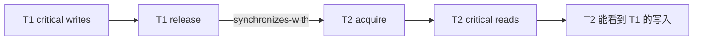
```mermaid
flowchart LR
    A["T1 critical writes"] --> B["T1 release"]
    B -->|"synchronizes-with"| C["T2 acquire"]
    C --> D["T2 critical reads"]
    D --> E["T2 能看到 T1 的写入"]
```

### 3.4 多把锁

*(参考时间: 00:16)*

不同共享对象可以使用不同锁：

```c
mutex_t lock_x = MUTEX_INIT();
mutex_t lock_y = MUTEX_INIT();

mutex_lock(&lock_x);
x++;
mutex_unlock(&lock_x);

mutex_lock(&lock_y);
y++;
mutex_unlock(&lock_y);
```

只要访问同一对象的代码都使用同一把锁，`x` 与 `y` 就可以独立并发。

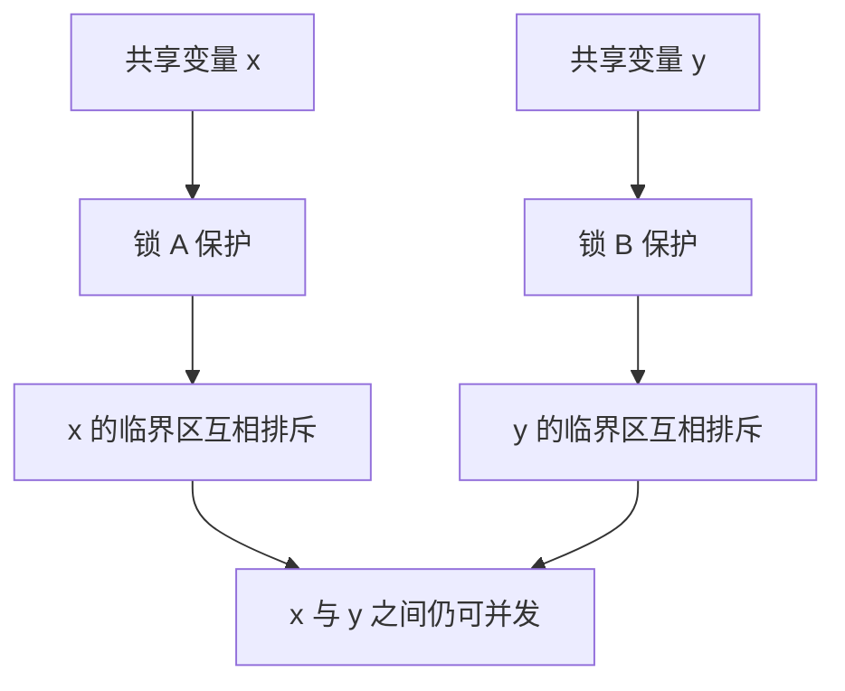
```mermaid
flowchart TD
    A["共享变量 x"] --> LA["锁 A 保护"]
    B["共享变量 y"] --> LB["锁 B 保护"]
    LA --> C["x 的临界区互相排斥"]
    LB --> D["y 的临界区互相排斥"]
    C --> E["x 与 y 之间仍可并发"]
    D --> E
```

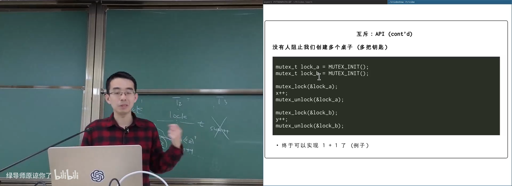

### 3.5 用锁正确求和

*(参考时间: 00:17)*

```c
#define N 1000000
long sum = 0;
mutex_t lock = MUTEX_INIT();

void T_sum(int tid) {
    for (int i = 0; i < N / 2; i++) {
        mutex_lock(&lock);
        for (int j = 0; j < 10; j++) {
            sum++;
            asm volatile("" ::: "memory");
        }
        mutex_unlock(&lock);
    }
}
```

编译器屏障防止十条 `sum++` 被合并成 `sum += 10`，使临界区足够长，也便于观察锁是否正确。

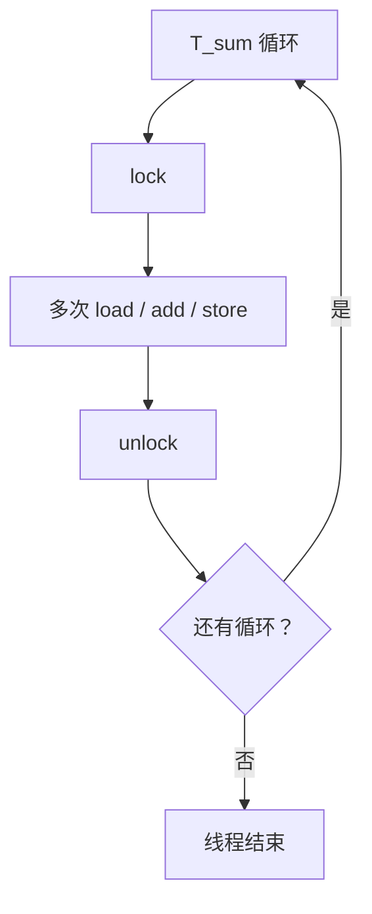
```mermaid
flowchart TD
    A["T_sum 循环"] --> B["lock"]
    B --> C["多次 load / add / store"]
    C --> D["unlock"]
    D --> E{"还有循环？"}
    E -- "是" --> A
    E -- "否" --> F["线程结束"]
```

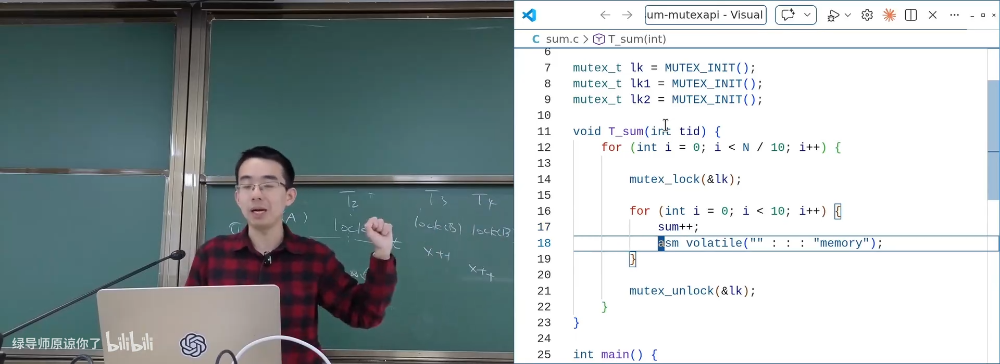

---

## 4. 正确使用锁并不容易

### 4.1 Stop-the-world 只是正确使用时的抽象

*(参考时间: 00:20)*

如果所有共享数据都被同一套锁正确保护，就可以把 `lock ... unlock` 理解为：

```text
stop_the_world();
critical_section();
resume_the_world();
```

其他线程即使真的在并行，它们的执行效果也可以被理解为前后重排，不会插入当前临界区。

所以使用锁后，程序的局部理解又回到顺序执行：

- 编译器优化假设重新成立；
- 临界区内不会看到并发写入；
- 人类可以用顺序思维处理复杂代码。


```mermaid
flowchart LR
    A["并行执行时间线"] --> B["正确 lock / unlock"]
    B --> C["冲突临界区被串行化"]
    C --> D["可按顺序语义理解"]
    D --> E["旧有的编译器与程序直觉恢复"]
```

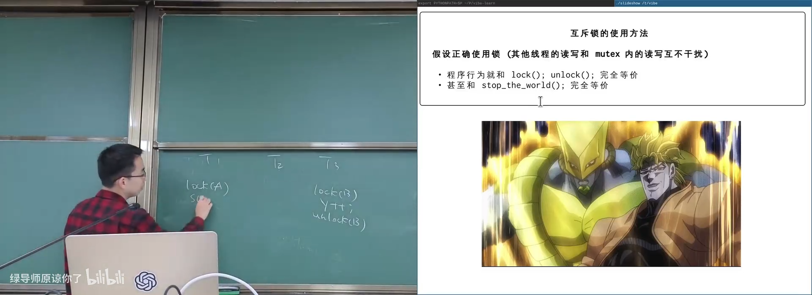

### 4.2 忘解锁、提前返回、用错锁

*(参考时间: 00:24)*

锁的问题与 `malloc` / `free` 相似：

> 一旦引入显式 acquire / release，程序员就必须在所有路径上维持配对关系。

常见错误：

```c
void f(void) {
    lock(&l);
    if (error) {
        return;   /* 漏掉 unlock */
    }
    unlock(&l);
}
```

另一种错误是用不同的锁保护同一变量：

```c
T1: lock(&l); sum++; unlock(&l);
T2: lock(&i); sum++; unlock(&i);
```

两段看似都加锁，但 `l` 和 `i` 不是同一个互斥域，保护完全失效。

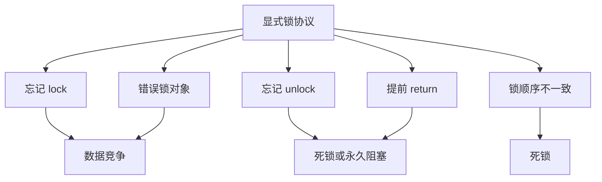
```mermaid
flowchart TD
    A["显式锁协议"] --> B["忘记 lock"]
    A --> C["忘记 unlock"]
    A --> D["提前 return"]
    A --> E["错误锁对象"]
    A --> F["锁顺序不一致"]
    B --> G["数据竞争"]
    C --> H["死锁或永久阻塞"]
    D --> H
    E --> G
    F --> I["死锁"]
```

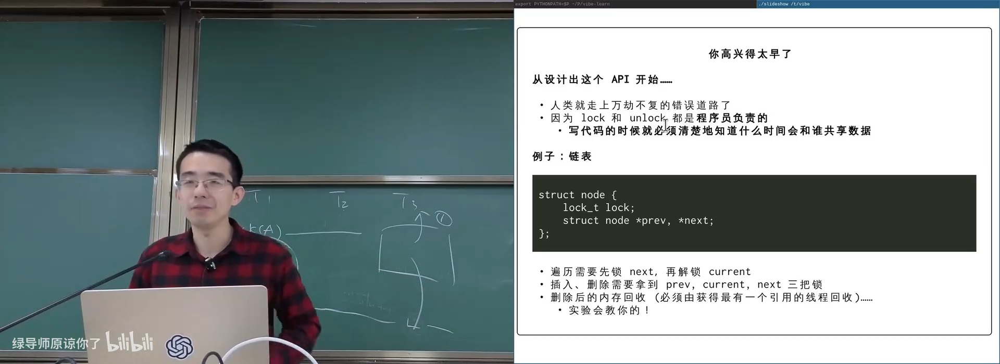

### 4.3 细粒度链表锁非常复杂

*(参考时间: 00:25)*

双向链表节点可能各自带锁：

```c
struct node {
    lock_t lock;
    struct node *prev, *next;
};
```

遍历时必须：

1. 持有当前节点锁；
2. 获取下一节点锁；
3. 确认链接关系；
4. 释放当前节点锁；
5. 继续向前。

插入和删除需要同时持有：

```text
prev.lock
current.lock
next.lock
```

删除后还要安全回收内存，不能有线程仍持有指向该节点的引用。

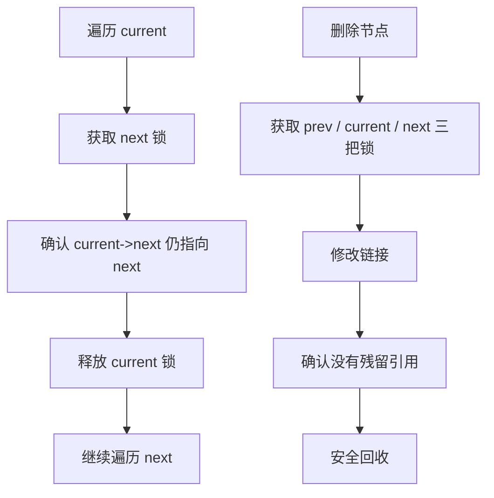
```mermaid
flowchart TD
    A["遍历 current"] --> B["获取 next 锁"]
    B --> C["确认 current->next 仍指向 next"]
    C --> D["释放 current 锁"]
    D --> E["继续遍历 next"]
    F["删除节点"] --> G["获取 prev / current / next 三把锁"]
    G --> H["修改链接"]
    H --> I["确认没有残留引用"]
    I --> J["安全回收"]
```

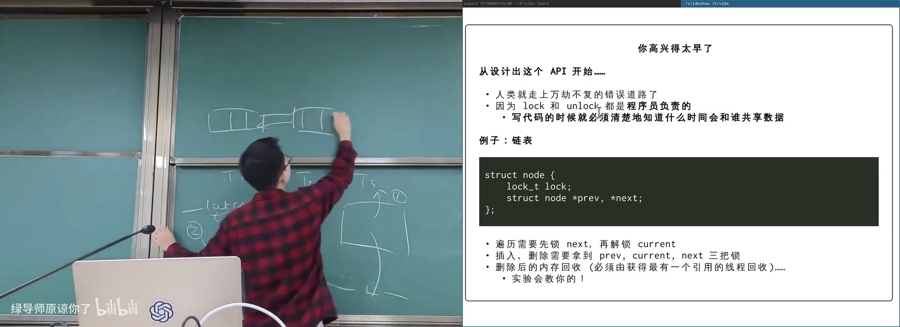

### 4.4 一把大锁保平安

*(参考时间: 00:28)*

课程建议初次实现并发数据结构时，从一把大锁开始：

- 所有共享访问都使用同一把锁；
- 先保证正确性；
- 充分压力测试；
- 只有确认瓶颈后再拆锁。

Linux 从单处理器迁移到 SMP 时，也长期依赖 **Big Kernel Lock**：

- 一把大锁保证整体一致性；
- 先完成从单核到多核的安全过渡；
- 再逐步拆分关键子系统。


```mermaid
flowchart LR
    A["单处理器：关中断"] --> B["多处理器：一把大锁"]
    B --> C["正确但扩展性有限"]
    C --> D["识别热点路径"]
    D --> E["逐步拆成细粒度锁"]
    E --> F["压力测试与修复竞态"]
```

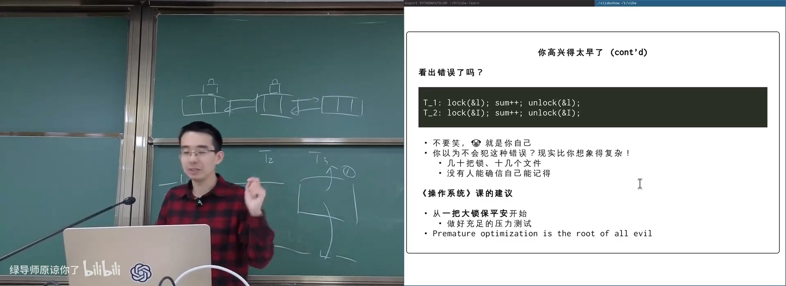

### 4.5 “都不并发了，为什么还要线程”

*(参考时间: 00:32)*

**Amdahl’s Law**：

如果 `1/k` 的代码必须串行，即使并行部分无限快：

```text
T_∞ ≥ T_1 / k
```

悲观地看，串行比例会限制最大加速。

更细致的 **Gustafson’s Law** 强调：

```text
T_p < T_∞ + T_1 / p
```

只要可并行部分非常大，需要串行的关键区只占很小比例，增加处理器仍然可以获得接近线性的扩展。

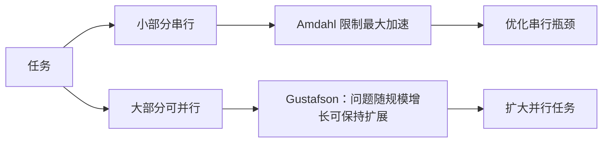
```mermaid
flowchart LR
    A["任务"] --> B["小部分串行"]
    A --> C["大部分可并行"]
    B --> D["Amdahl 限制最大加速"]
    C --> E["Gustafson：问题随规模增长可保持扩展"]
    D --> F["优化串行瓶颈"]
    E --> G["扩大并行任务"]
```

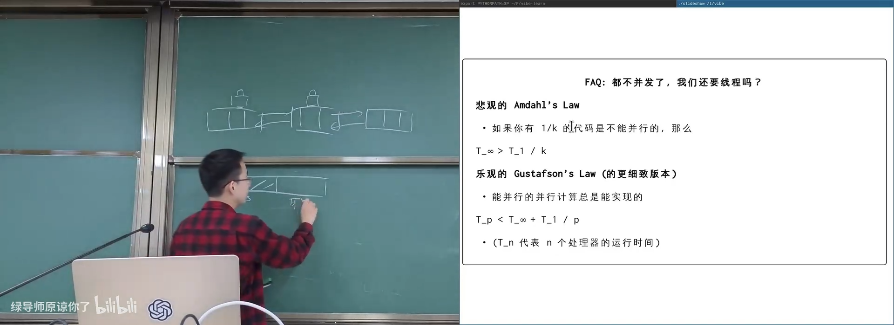

### 4.6 局部性让世界天然可并行

*(参考时间: 00:35)*

物理世界具有局部性：

- 物体主要影响相邻区域；
- 无法瞬移到宇宙任意位置；
- 大部分计算只需访问本地数据；
- 只有边界需要同步。

典型 embarrassingly parallel 场景：

- 图书馆借书：抢书时同步，读书时独立；
- 分布式数据存储；
- 天气预报与网格模拟；
- 深度神经网络；
- NP-hard 搜索的不同分支；
- `fork`-based DFS。

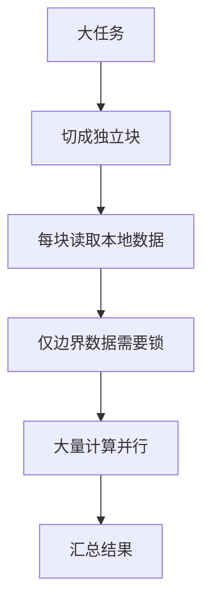
```mermaid
flowchart TD
    A["大任务"] --> B["切成独立块"]
    B --> C["每块读取本地数据"]
    C --> D["仅边界数据需要锁"]
    D --> E["大量计算并行"]
    E --> F["汇总结果"]
```

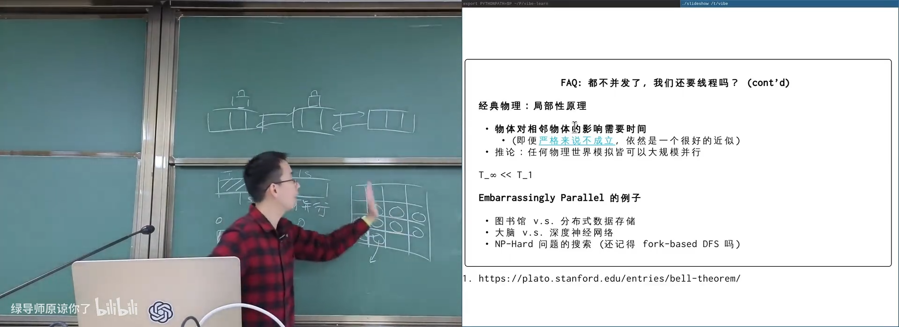

---

## 5. 纯软件互斥：Dekker 与 Peterson

### 5.1 Dekker 算法

*(参考时间: 00:39)*

1965 年，Dekker 提出第一个公开正确的两进程互斥算法。

直观描述：

> 一个进程可以在对方不想进入临界区时进入；否则，只有在轮到它时才能进入。

它的状态空间有限，可以画出完整迁移图，但文字描述像绕口令，直接理解非常困难。

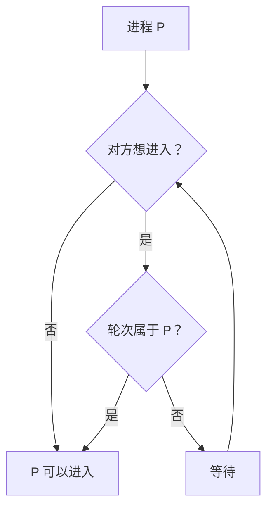
```mermaid
flowchart TD
    A["进程 P"] --> B{"对方想进入？"}
    B -- "否" --> C["P 可以进入"]
    B -- "是" --> D{"轮次属于 P？"}
    D -- "是" --> C
    D -- "否" --> E["等待"]
    E --> B
```

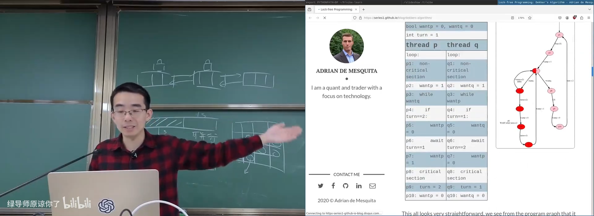

### 5.2 Peterson 算法：宿舍厕所协议

*(参考时间: 00:41)*

Peterson 算法用三个变量：

```text
flagA / flagB：两个人是否举手
turn：门上的名字纸条
```

希望进入临界区：

1. 举起自己的旗子；
2. 把对方的名字贴到门上；
3. 观察对方是否举旗；
4. 如果对方没举旗，或者门上是自己的名字，就进入；
5. 否则继续观察；
6. 离开时放下自己的旗子。

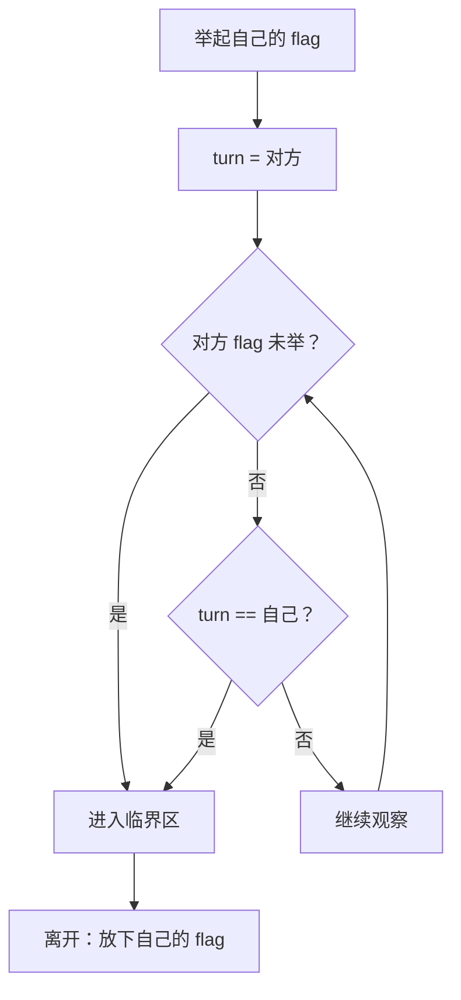
```mermaid
flowchart TD
    A["举起自己的 flag"] --> B["turn = 对方"]
    B --> C{"对方 flag 未举？"}
    C -- "是" --> F["进入临界区"]
    C -- "否" --> D{"turn == 自己？"}
    D -- "是" --> F
    D -- "否" --> E["继续观察"]
    E --> C
    F --> G["离开：放下自己的 flag"]
```

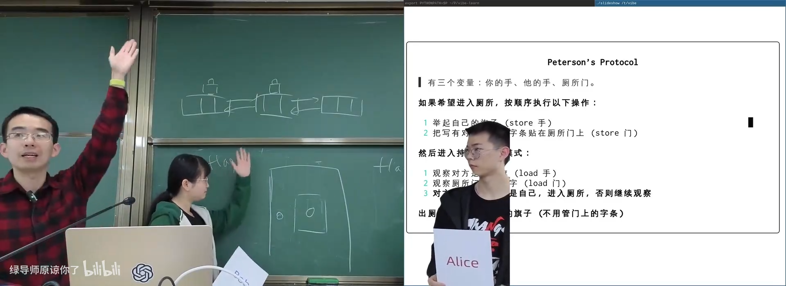

### 5.3 两人同时想进入时谁赢

*(参考时间: 00:43)*

如果 Alice 和 Bob 同时举旗：

- 两人都会把对方名字写到 `turn`；
- 后写的人覆盖先写的人；
- 最终 `turn` 只保留一个名字；
- 名字对应的线程进入，另一个等待。

看似谦让，实际上是“手快有、手慢无”的优先级选择。

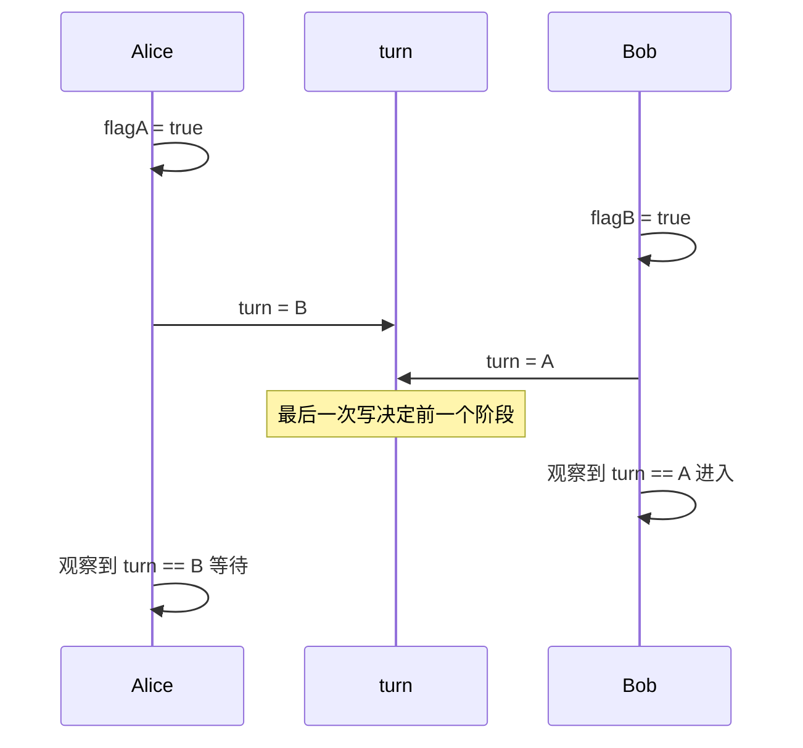
```mermaid
sequenceDiagram
    participant A as Alice
    participant X as turn
    participant B as Bob
    A->>A: flagA = true
    B->>B: flagB = true
    A->>X: turn = B
    B->>X: turn = A
    Note over X: 最后一次写决定前一个阶段
    B->>B: 观察到 turn == A 进入
    A->>A: 观察到 turn == B 等待
```

### 5.4 模型检查器

*(参考时间: 00:46)*

Peter 算法状态有限：

```text
(flagA, flagB, turn, PC1, PC2)
```

可以在黑板上逐个状态推演，也可以在 Python 中实现状态机和模型检查器：

```python
def step(state, thread):
    ...

frontier = {initial_state}
while frontier:
    state = frontier.pop()
    for thread in threads:
        next_state = step(state, thread)
        check_invariant(next_state)
        frontier.add(next_state)
```

程序可以验证：

- 不会两个线程同时进入临界区；
- 不会出现双方都永久无法进入；
- 修改协议顺序后会触发反例。

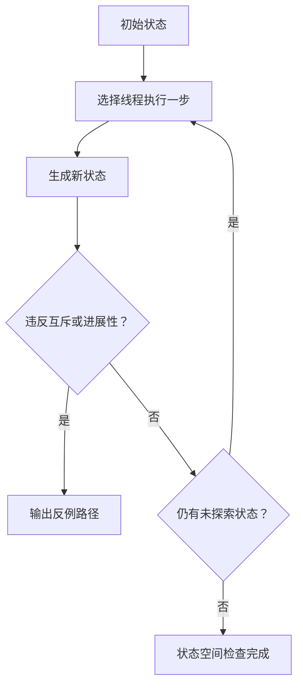
```mermaid
flowchart TD
    A["初始状态"] --> B["选择线程执行一步"]
    B --> C["生成新状态"]
    C --> D{"违反互斥或进展性？"}
    D -- "是" --> E["输出反例路径"]
    D -- "否" --> F{"仍有未探索状态？"}
    F -- "是" --> B
    F -- "否" --> G["状态空间检查完成"]
```

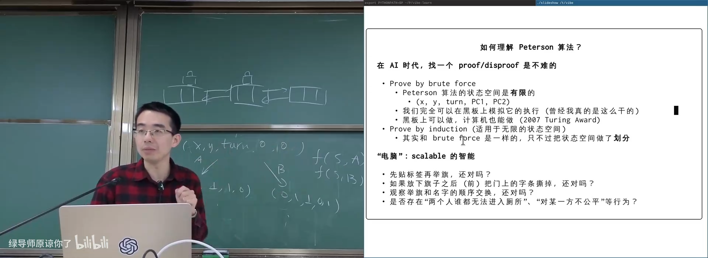

### 5.5 修改协议就会出错

*(参考时间: 00:49)*

可以测试许多变体：

- 先写 `turn` 再举旗，是否正确；
- 离开后擦掉 `turn`，是否正确；
- 交换观察顺序，是否正确；
- 是否可能出现双方都进不去；
- 是否对某个线程不公平。

直觉上很小的改动，可能破坏整套协议。

```mermaid
flowchart TD
    A["原始 Peterson 协议"] --> B["正确"]
    A --> C["交换发起操作顺序"]
    A --> D["离开时清空 turn"]
    A --> E["交换观察顺序"]
    C --> F["模型检查"]
    D --> F
    E --> F
    F --> G["发现死锁 / 同时进入 / 不公平反例"]
```

### 5.6 Peterson 的时代假设已经不成立

*(参考时间: 00:53)*

Peterson 算法证明了：

- 只靠 load/store 也能逻辑上实现两个线程互斥；
- 状态空间可以形式化验证；
- 但互斥证明依赖两个关键假设。

当时的假设：

```text
load/store 瞬间完成并生效
指令按程序顺序执行
```

现代系统违反了它们：

- 编译器和 CPU 会重排；
- store 可能进入缓冲区后才传播；
- load 可能看到旧缓存；
- 内存屏障需要额外指令；
- C/C++ 数据竞争是 undefined behavior。

```mermaid
flowchart LR
    A["Peterson 的逻辑证明"] --> B["假设：顺序一致"]
    B --> C["现代编译器重排"]
    B --> D["现代 CPU 乱序"]
    B --> E["缓存与 store buffer"]
    C --> F["需要 compiler barrier"]
    D --> G["需要 memory barrier"]
    E --> G
    F --> H["实现复杂且低效"]
    G --> H
```

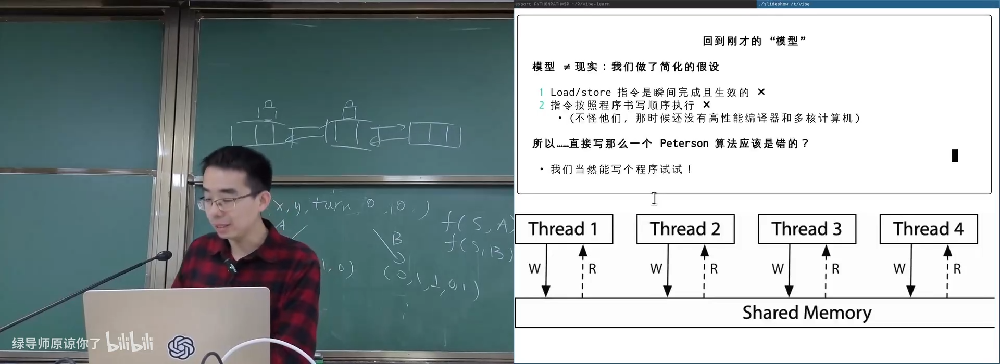

### 5.7 错误实现为何可能长期看似正确

*(参考时间: 00:54)*

去掉所有 barrier 后，程序理论上错误，但可能在特定机器上长时间无法复现。

错误运行需要非常窄的窗口：

- 两个线程同时看到内存中的空闲状态；
- store 的传播顺序恰好违反预期；
- 两次进入被原子计数器观察到。

这种“看似通过”是最危险的状态，因为压力测试通过不代表协议正确。

```mermaid
flowchart TD
    A["错误 Peterson 实现"] --> B["触发窗口非常窄"]
    B --> C["测试 1 万次未复现"]
    C --> D["误以为正确"]
    D --> E["换机器 / 换编译器 / 换负载"]
    E --> F["突然失败"]
```

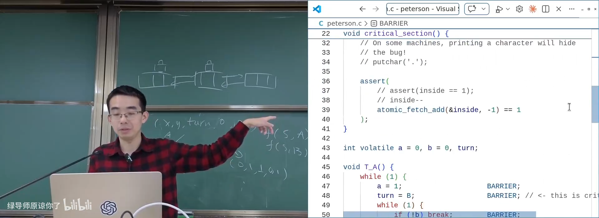

### 5.8 两线程限制与“智力体操”

*(参考时间: 00:57)*

Peterson 只适用于已知的两个线程：

- 需要知道“对方是谁”；
- 动态创建和退出的线程数量使协议不再直接适用；
- 扩展到多线程更多是智力体操。

课程真正需要的是绝对正确、可工程化的机制。

```mermaid
flowchart TD
    A["Peterson 两线程协议"] --> B["需要固定对手身份"]
    B --> C["动态产生 100 个线程"]
    C --> D["协议无法直接适用"]
    D --> E["需要硬件与操作系统帮助"]
```

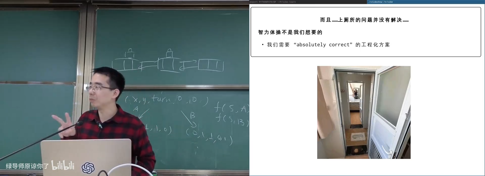

---

## 6. 原子指令：把 load + store 变成不可分割操作

### 6.1 错误锁的问题

*(参考时间: 01:00)*

一个朴素的锁：

```c
void lock(void) {
retry:
    if (table[key] == FREE) {
        table[key] = TAKEN;
        return;
    }
    goto retry;
}

void unlock(void) {
    table[key] = FREE;
}
```

问题与并发支付完全相同：

1. 线程看到 `FREE`；
2. 还没写 `TAKEN` 时被切换；
3. 另一个线程也看到 `FREE`；
4. 两个线程都拿走钥匙。

需要将“检查并拿走”变成一个不可分割操作。

```mermaid
flowchart TD
    A["T1 load: FREE"] --> B["T2 load: FREE"]
    B --> C["T1 判断可获取"]
    C --> D["T2 判断可获取"]
    D --> E["T1 store TAKEN"]
    E --> F["T2 store TAKEN"]
    F --> G["双方都认为自己获得锁"]
```

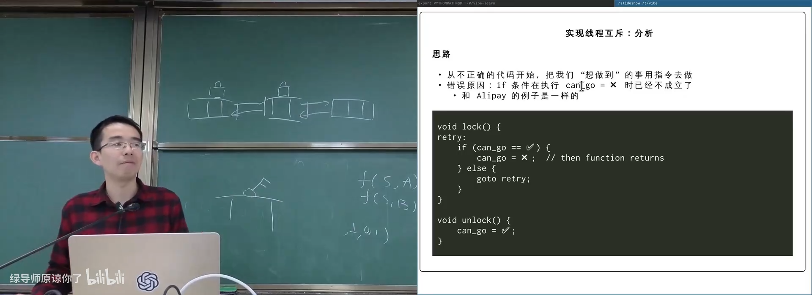

### 6.2 原子交换与 Compare-and-Swap

*(参考时间: 01:03)*

硬件提供两种典型原语：

**Atomic exchange**

```c
old = atomic_exchange(&lock, TAKEN);
if (old == FREE) {
    /* acquired */
}
```

**Compare-and-swap**

```c
int expected = FREE;
if (atomic_compare_exchange(&lock, &expected, TAKEN)) {
    /* acquired */
}
```

CAS 只有在当前值等于 `expected` 时才写入：

- 成功：完成比较和交换；
- 失败：返回当前值，通常不写入；
- 整个过程对系统其他处理器表现为原子。

```mermaid
flowchart TD
    A["CAS(lock, expected=FREE, desired=TAKEN)"] --> B{"lock == FREE？"}
    B -- "是" --> C["lock = TAKEN"]
    C --> D["返回成功"]
    B -- "否" --> E["返回失败和当前值"]
```


### 6.3 硬件如何提供原子性

不同体系结构有不同方法：

- x86：`lock` 前缀、总线锁或缓存锁、`lock cmpxchg`；
- ARM：`ldxr` / `stxr`、原子算术扩展；
- RISC-V：LR / SC；
- C/C++：`atomic_compare_exchange_*`、`atomic_exchange_*`。

```mermaid
flowchart TD
    A["需要原子读改写"] --> B["x86: locked instruction"]
    A --> C["ARM: exclusive load/store"]
    A --> D["RISC-V: LR / SC"]
    A --> E["C/C++ 原子库"]
    B --> F["编译器生成平台指令"]
    C --> F
    D --> F
    E --> F
```

---

## 7. 自旋锁：正确但有性能问题

### 7.1 自旋锁实现

*(参考时间: 01:06)*

```c
void spin_lock(spinlock_t *lk) {
    int expected = FREE;
    while (!atomic_compare_exchange_weak(&lk->value,
                                         &expected, TAKEN)) {
        expected = FREE;
    }
    atomic_thread_fence(memory_order_acquire);
}

void spin_unlock(spinlock_t *lk) {
    atomic_thread_fence(memory_order_release);
    atomic_store(&lk->value, FREE);
}
```

自旋锁与 mutex 的使用方法相同，但失败线程不会睡眠，而是在 CPU 上不断重试。

```mermaid
flowchart TD
    A["spin_lock"] --> B["CAS FREE → TAKEN"]
    B --> C{"成功？"}
    C -- "是" --> D["获得锁"]
    C -- "否" --> E["重置 expected"]
    E --> B
    D --> F["critical section"]
    F --> G["release fence"]
    G --> H["store FREE"]
```

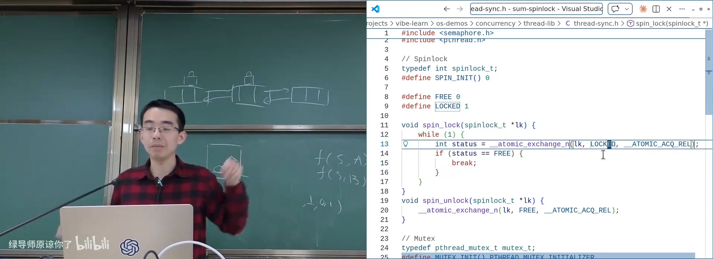

### 7.2 “一核有难，八核围观”

*(参考时间: 01:08)*

只有获得锁的线程能推进，其他线程在 CPU 上空转：

- 消耗核心；
- 产生大量缓存一致性流量；
- 不执行有效计算；
- 如果临界区较长，浪费尤其严重。

```mermaid
flowchart LR
    A["CPU 0：持锁执行"] --> C["共享锁缓存行"]
    B1["CPU 1：CAS 自旋"] --> C
    B2["CPU 2：CAS 自旋"] --> C
    B3["CPU 3：CAS 自旋"] --> C
    C --> D["大量无效流量与空转"]
```

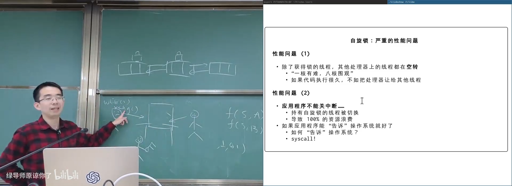

### 7.3 持锁线程被调度出去

*(参考时间: 01:09)*

更严重的问题：

1. 线程 A 获得自旋锁；
2. 时间片到期，A 被操作系统切换出去；
3. 同一 CPU 上运行线程 B；
4. B 尝试获取锁，开始自旋；
5. A 得不到 CPU，无法释放锁；
6. 全部计算资源都被浪费。

用户态程序不能关闭中断，无法阻止自己被调度，也无法直接告诉内核“我在等这把锁”。

```mermaid
flowchart TD
    A["T1 获得锁"] --> B["T1 被操作系统抢占"]
    B --> C["T2 在同一 CPU 运行"]
    C --> D["T2 自旋等待锁"]
    D --> E["T1 无法运行"]
    E --> F["T1 无法释放锁"]
    F --> D
```

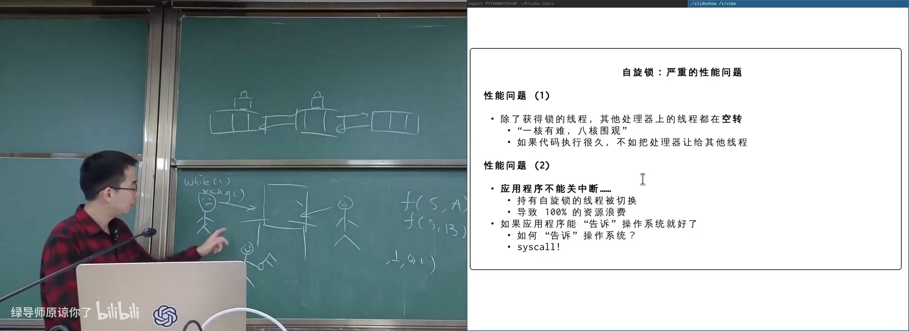

---

## 8. 内核协助与 `futex`

### 8.1 把锁的实现交给操作系统

*(参考时间: 01:11)*

理想接口：

```c
syscall(SYSCALL_acquire, &lock);
syscall(SYSCALL_release, &lock);
```

- acquire 成功：返回用户态；
- acquire 失败：内核把线程设为阻塞；
- release：内核唤醒等待该锁的线程；
- 内核内部可以用关中断和短自旋锁保护自己的数据结构。

```mermaid
flowchart TD
    A["用户线程 acquire"] --> B["进入内核"]
    B --> C{"锁空闲？"}
    C -- "是" --> D["获得锁，返回用户态"]
    C -- "否" --> E["标记等待该锁"]
    E --> F["线程睡眠，调度别的线程"]
    G["持锁线程 release"] --> H["进入内核"]
    H --> I["唤醒等待者"]
    I --> J["被唤醒线程重新竞争锁"]
```

### 8.2 `futex`：Fast Userspace Mutex

*(参考时间: 01:12)*

Linux 没有为每个等待都无条件执行两个系统调用，而是使用 **futex**：

- **Fast path**：无竞争时完全在用户态原子操作，不进入内核；
- **Slow path**：发生竞争时执行 futex 系统调用，让等待线程睡眠；
- 内核只在确实需要睡眠或唤醒时介入。

概念上的状态：

```text
FREE
LOCKED_NO_WAITERS
LOCKED_WITH_WAITERS
```

```mermaid
flowchart TD
    A["futex_lock"] --> B["原子 CAS FREE → LOCKED"]
    B --> C{"成功？"}
    C -- "是" --> D["Fast path：直接进入临界区"]
    C -- "否" --> E["设置 WAITERS 标志"]
    E --> F["FUTEX_WAIT 睡眠"]
    G["futex_unlock"] --> H{"有 WAITERS？"}
    H -- "否" --> I["直接 store FREE"]
    H -- "是" --> J["FUTEX_WAKE"]
    J --> K["唤醒等待者"]
```

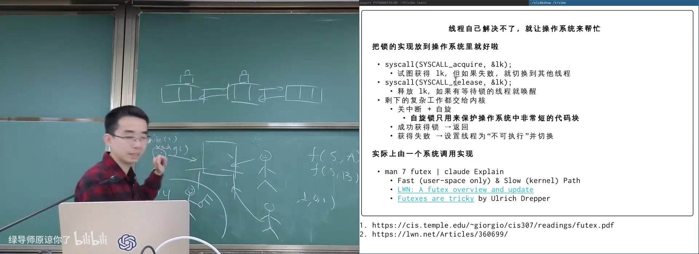

### 8.3 “Futexes are tricky”

*(参考时间: 01:13)*

`futex` 的难点在于：

- 用户态和内核态共享一个整数的状态；
- acquire 与 release 都可能需要避免不必要的系统调用；
- 等待者可能在状态变化窗口内重新睡眠；
- 唤醒、丢失唤醒和虚假唤醒都要正确处理；
- 不同内存序与原子状态转换必须匹配。

这类代码极为微妙，连有经验的系统开发者也可能第一次写错。

```mermaid
flowchart TD
    A["futex 状态"] --> B["用户态原子操作"]
    A --> C["内核等待队列"]
    B --> D["状态变化"]
    D --> E["FUTEX_WAIT / FUTEX_WAKE"]
    E --> F["缺少状态检查可能丢唤醒"]
    E --> G["检查与睡眠之间必须原子化"]
    G --> H["Futexes are tricky"]
```

---

## 9. 定量比较不同互斥实现

### 9.1 控制变量实验

*(参考时间: 01:15)*

比较三种实现：

- 原子指令直接 `sum++`；
- mutex；
- 自旋锁；
- 每次都进入内核的 naive futex。

控制变量：

```text
总 sum++ 次数固定
线程数 T = 1, 2, 4, 8, 16
每种配置重复 5 次
记录每次操作的纳秒数和每秒操作数
```

```mermaid
flowchart TD
    A["固定总 sum++ 次数"] --> B["分配线程 1 / 2 / 4 / 8 / 16"]
    B --> C["运行 atomic / mutex / spin / futex"]
    C --> D["每种组合重复 5 次"]
    D --> E["记录原始 CSV"]
    E --> F["计算平均值与误差"]
    F --> G["生成带 error bar 的图"]
```

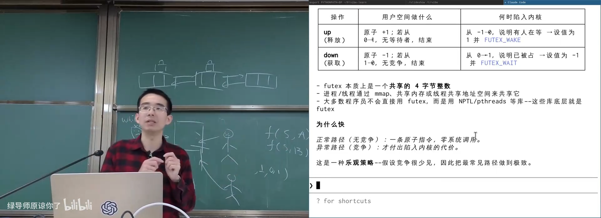

### 9.2 单线程与系统调用成本

*(参考时间: 01:18)*

单线程最快，因为没有原子竞争和锁等待。但在不同实现之间：

- 普通原子指令只增加少量开销；
- mutex 无竞争时主要在用户态快速完成；
- 自旋锁在无竞争时也很快；
- 每次都进入内核的 futex 慢几百纳秒。

```mermaid
flowchart LR
    A["单线程 sum++"] --> B["最快基线"]
    B --> C["atomic：少量额外开销"]
    B --> D["uncontended mutex：用户态 fast path"]
    B --> E["spinlock：原子交换"]
    B --> F["forced futex syscall：数百 ns 内核成本"]
```

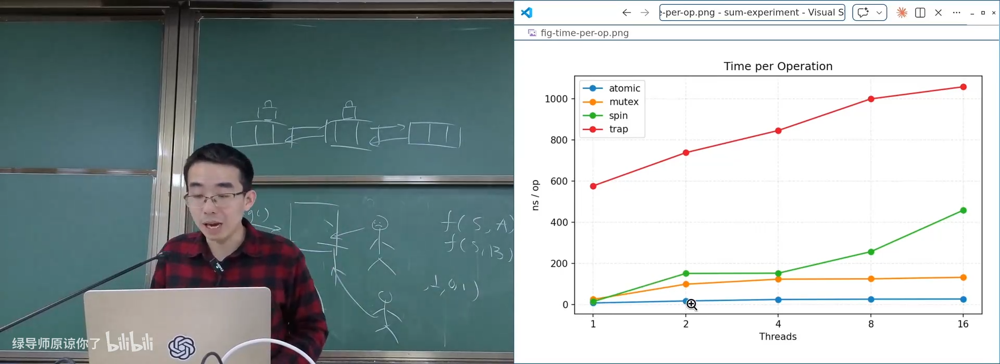

### 9.3 扩展性

*(参考时间: 01:20)*

线程数超过 CPU 数量后：

- mutex 可以让等待者睡眠，平台扩展性明显优于自旋锁；
- 自旋锁因线程被抢占而急剧变差；
- 原子指令在低竞争时最快，但高竞争仍有缓存流量问题；
- 强制每次 `futex` 系统调用的版本始终受内核切换成本限制。

```mermaid
flowchart TD
    A["线程数 ≤ CPU 数"] --> B["自旋锁表现尚可"]
    C["线程数 > CPU 数"] --> D["持锁线程被抢占概率增加"]
    D --> E["自旋线程浪费 CPU"]
    E --> F["spinlock 扩展性急剧下降"]
    C --> G["mutex 将等待者睡眠"]
    G --> H["扩展性更稳定"]
```

### 9.4 Benchmarking Crimes

*(参考时间: 01:22)*

课程要求先阅读：

- [Systems Benchmarking Crimes](https://gernot-heiser.org/benchmarking-crimes.html)

常见错误：

- selective data：只展示有利数据；
- 隐藏缺陷：只在有利配置下测试；
- 混淆启动、编译和运行时间；
- 不做重复实验；
- 不报告误差和原始数据；
- 用不可复现的环境比较；
- cherry-picking 最好的一次结果。

系统研究需要：

- 明确控制变量；
- 保存原始数据；
- 多次重复；
- 报告分布与误差；
- 让实验可复现。

```mermaid
flowchart TD
    A["Benchmarking Crime"] --> B["精选数据"]
    A --> C["隐藏不利结果"]
    A --> D["不重复实验"]
    A --> E["隐藏环境差异"]
    A --> F["只报告最好一次"]
    B --> G["错误结论"]
    C --> G
    D --> G
    E --> G
    F --> G
    G --> H["可复现实验与原始数据"]
    H --> I["可信性能结论"]
```

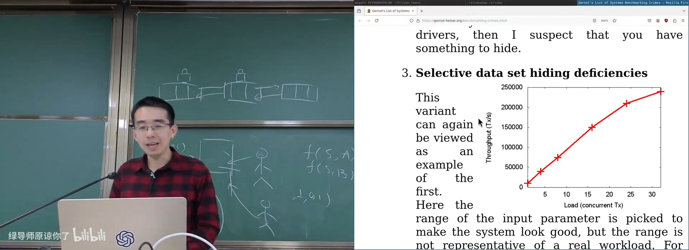

---

## 10. 总结：互斥让复杂并发退回顺序世界

这一讲从未解决的 `sum++` 出发，逐步建立完整路线：

- 操作系统系统调用是共享内核状态上的多线程程序；
- 单处理器内核可以用关中断实现极短互斥；
- 用户态无权关中断；
- mutex 通过 `lock` / `unlock` 定义临界区；
- acquire / release 同时提供互斥与内存可见性；
- 锁的求值、配对所有路径、多把锁和细粒度结构都很难；
- 工程上先从一把大锁保证正确，再逐步优化；
- Amdahl 与 Gustafson 说明串行部分必须足够小；
- 局部性和 embarrassingly parallel 任务仍然可以大规模并行；
- Peterson 用纯 load/store 实现两线程互斥，但依赖顺序一致；
- 模型检查可以穷举有限状态并验证协议；
- 原子 CAS / exchange 提供硬件级不可分割读改写；
- 自旋锁正确但空转，且会因持锁线程被抢占而灾难性退化；
- futex 用用户态快路径和内核慢路径实现可睡眠 mutex；
- 定量实验可以帮助理解不同实现的成本与扩展性。

```mermaid
flowchart LR
    A["共享内存并发"] --> B["定义临界区"]
    B --> C["互斥 API"]
    C --> D["Peterson / 纯软件尝试"]
    D --> E["原子指令"]
    E --> F["自旋锁"]
    F --> G["内核协助 / futex"]
    G --> H["可扩展、可睡眠的互斥"]
```

最终的核心思想是：

> 互斥不消灭多线程，而是把必须串行的一小部分明确隔离出来，让其余绝大部分代码继续安全并行。

从下一讲开始，互斥将扩展为条件同步、信号量、读写锁以及更复杂的并发控制原语。

---

## 附：官方参考与延伸阅读

以下链接来自官方讲义第 14 讲及课堂内容：

- [尝试关闭中断 demo](https://jyywiki.cn/OS/demos/concurrency/cli)
- [Mutex API 求和](https://jyywiki.cn/OS/demos/concurrency/sum-mutexapi)
- [Peterson paper, Myths about the mutual exclusion problem](https://zoo.cs.yale.edu/classes/cs323/doc/Peterson.pdf)
- [Moore 状态机检查器](https://jyywiki.cn/OS/demos/mosaic)
- [Peterson 算法 demo](https://jyywiki.cn/OS/demos/concurrency/peterson)
- [Spinlock 求和](https://jyywiki.cn/OS/demos/concurrency/sum-spinlock)
- [`futex(7)`](https://man7.org/linux/man-pages/man7/futex.7.html)
- [LWN: A futex overview and update](https://lwn.net/Articles/360699/)
- [Futexes Are Tricky](https://cis.temple.edu/~giorgio/cis307/readings/futex.pdf)
- [不同方式的并发求和实验](https://jyywiki.cn/OS/demos/concurrency/sum-experiment)
- [Systems Benchmarking Crimes](https://gernot-heiser.org/benchmarking-crimes.html)

阅读材料：

- *Operating Systems: Three Easy Pieces* 第 29 章，Locked Data Structures。

官方课程资料：

- [课程主页](https://jyywiki.cn/OS/2026/)
- [第 14 讲讲义：并发控制：互斥](https://jyywiki.cn/OS/2026/lect14.md)
- [视频：14 - 并发控制：互斥](https://www.bilibili.com/video/BV1hNdhB1Efe/)

> **版权与署名**：本讲课程材料由蒋炎岩（jyy）编写。课程讲义与幻灯片采用 [Creative Commons BY-NC 4.0](http://creativecommons.org/licenses/by-nc/4.0/) 许可；本电子书保留课程出处、作者署名与许可说明。
