# 并发控制：条件变量和万能同步方法

> **课程**：2026 春季学期《操作系统原理》  
> **讲师**：蒋炎岩（jyy）  
> **官方课程主页**：<https://jyywiki.cn/OS/2026/>  
> **官方讲义**：<https://jyywiki.cn/OS/2026/lect15.md>  
> **视频来源**：[Bilibili BV1t3dQBAEzd](https://www.bilibili.com/video/BV1t3dQBAEzd/)  
> **版权说明**：课程讲义与幻灯片归蒋炎岩所有，采用 [Creative Commons BY-NC 4.0](http://creativecommons.org/licenses/by-nc/4.0/) 许可；本电子书是对课堂讲授的书面化重构，保留出处与许可说明。

## 导语：从“不能同时做”到“必须按顺序做”

*(参考时间: 00:00)*

前面的并发路线已经建立了两块基础：

1. `spawn` / `join` 创建和等待线程；
2. `mutex_lock` / `mutex_unlock` 保护临界区，解决 `sum++` 丢失更新。

互斥给出的保证是：

```text
要么 A → B
要么 B → A
```

但很多问题需要更强、更确定的顺序：

```text
必须 A → B
```

例如：

- 所有计算线程结束后，`join` 才能返回；
- 指挥给出下一拍后，乐手才能演奏；
- 生产者先放入对象，消费者之后才能取出；
- 计算图中所有前驱节点完成后，当前节点才能开始。

这就是 **同步（synchronization）**。它通过等待条件、实现握手，建立确定的 **happens-before** 关系。


```mermaid
flowchart LR
    A["异步：各自向前执行"] --> B["约定同步条件"]
    B --> C["先到达者等待"]
    C --> D["条件满足，形成同步点"]
    D --> E["建立 happens-before"]
    E --> F["再各自分叉执行"]
```

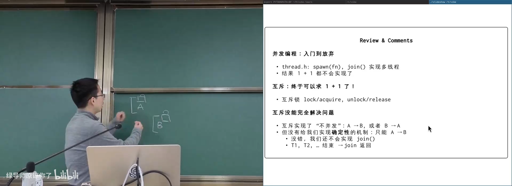

---

## 1. 同步的本质

### 1.1 `join` 就是一个同步机制

*(参考时间: 00:03)*

创建线程：

```c
spawn(T1);
spawn(T2);
spawn(T3);

join();
printf("sum = %ld\n", sum);
```

`join` 返回时满足：

- 所有被等待线程已结束；
- 这些线程对共享内存的写对当前线程可见；
- `join` 之后的代码 happens-after 所有目标线程。

所以库函数 `join` 本身也可以由同步原语实现。它的同步条件是：

```text
仍在运行的线程数量 == 0
```

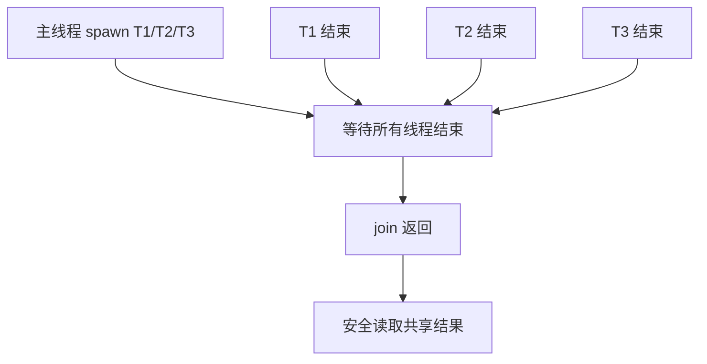
```mermaid
flowchart TD
    M["主线程 spawn T1/T2/T3"] --> W["等待所有线程结束"]
    T1["T1 结束"] --> W
    T2["T2 结束"] --> W
    T3["T3 结束"] --> W
    W --> R["join 返回"]
    R --> P["安全读取共享结果"]
```


### 1.2 异步与同步

*(参考时间: 00:04)*

把线程想象成人，把共享内存想象成物理空间：

- **异步**：每个人各自行动，不知道彼此进度；
- **同步**：多个变化过程在某个时刻保持确定关系。

现实中的同步方式：

- 同步电机：磁场锁定；
- 同步电路：时钟上升沿；
- 人：约定 wall-clock time；
- 外卖：送达通知；
- 不见不散：双方在指定位置握手。

物理世界可以用时间和空间实现同步，但线程内部没有自然时间概念。等待同步条件时，也不能让 CPU 一直空转。

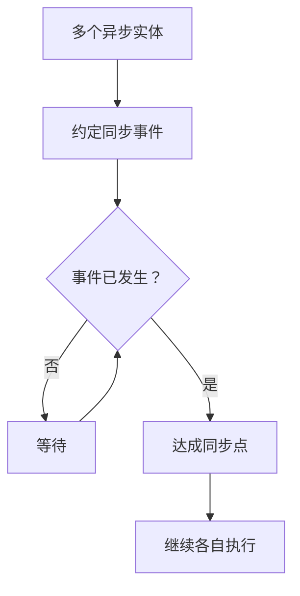
```mermaid
flowchart TD
    A["多个异步实体"] --> B["约定同步事件"]
    B --> C{"事件已发生？"}
    C -- "否" --> D["等待"]
    D --> C
    C -- "是" --> E["达成同步点"]
    E --> F["继续各自执行"]
```

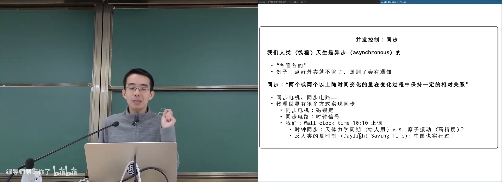

### 1.3 同步电路与乐团

*(参考时间: 00:06)*

同步电路的触发器等待时钟上升沿：

```c
while (!posedge(clk)) {
    /* await */
}
ff_out = ff_in;
```

乐团演奏则等待指挥给出的下一拍：

```c
wait_for_beat();
play_note();
```

人耳对节奏不同步的容忍大约只有 20 到 30 毫秒。对现代 CPU，这已经是上亿条指令的时间，因此软件线程之间无法依赖“感觉同时发生”。


```mermaid
flowchart LR
    A["指挥挥拍"] --> B["发出同步信号"]
    B --> C["所有演奏线程条件成立"]
    C --> D["同时进入下一拍"]
    D --> E["各自演奏音符"]
```

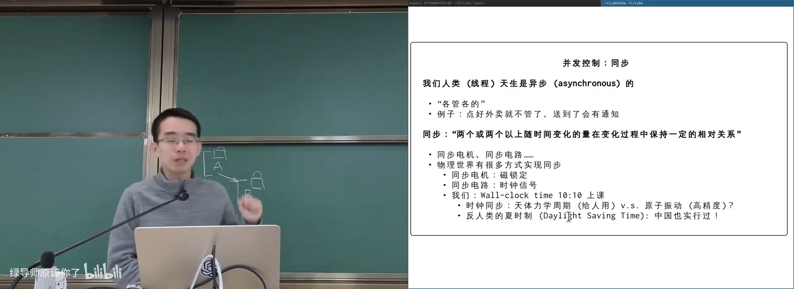

### 1.4 所有例子都在实现握手

*(参考时间: 00:09)*

几个看似不同的场景都遵循同一模式：

```text
等待某个条件发生
如果现在没有发生，就等待
一定有另一个操作会使它发生
条件满足后继续
```

| 场景 | 同步条件 |
| --- | --- |
| 同步电路 | 时钟上升沿到来 |
| `join` | 所有线程结束 |
| 不见不散 | 对方到达 |
| 乐团 | 指挥发出下一拍 |
| 生产者消费者 | 有对象 / 有空位 |

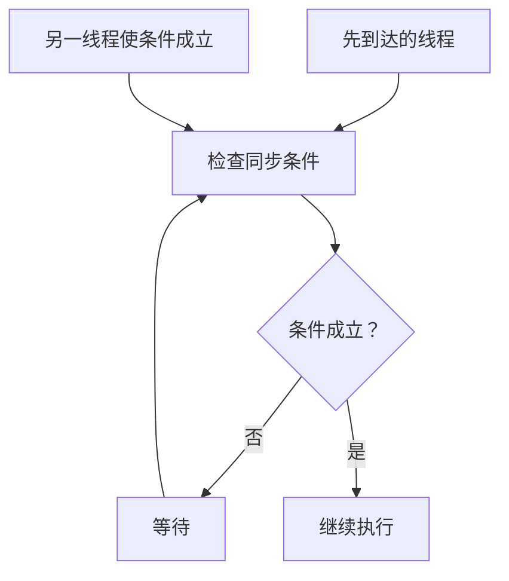
```mermaid
flowchart TD
    A["先到达的线程"] --> B["检查同步条件"]
    B --> C{"条件成立？"}
    C -- "否" --> D["等待"]
    D --> B
    E["另一线程使条件成立"] --> B
    C -- "是" --> F["继续执行"]
```

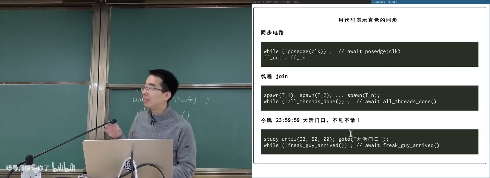

### 1.5 Happens-before

*(参考时间: 00:14)*

同步点给程序建立了一个确定的全局状态：

```text
条件发生 → 后续代码
```

例如：

- 时钟上升沿 happens-before 触发器更新；
- 最后一个线程结束 happens-before `join` 返回；
- 生产者放入对象 happens-before 消费者取出；
- 所有前驱节点完成 happens-before 当前 DAG 节点开始。

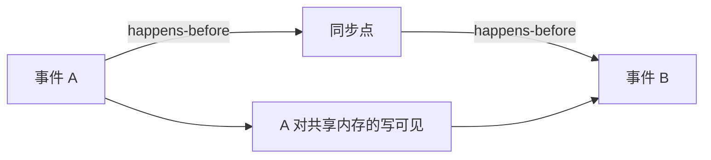
```mermaid
flowchart LR
    A["事件 A"] -->|"happens-before"| S["同步点"]
    S -->|"happens-before"| B["事件 B"]
    A --> M["A 对共享内存的写可见"]
    M --> B
```

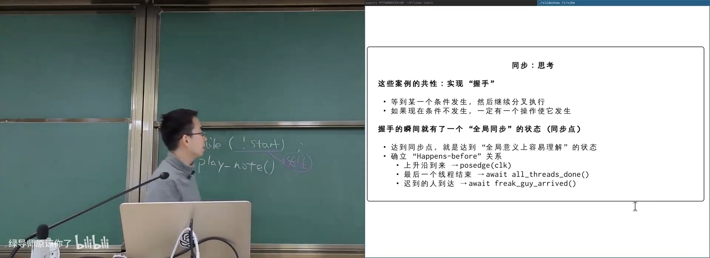

---

## 2. 用自旋等待实现同步

### 2.1 乐团版本

*(参考时间: 00:17)*

可以用共享变量表示当前节拍：

```c
int beat = 0;
mutex_t lk = MUTEX_INIT();

void player(int tid) {
    while (1) {
        int my_beat;

        mutex_lock(&lk);
        while (beat == last_played) {
            mutex_unlock(&lk);
            mutex_lock(&lk);
        }
        my_beat = beat;
        mutex_unlock(&lk);

        play_note(tid, my_beat);
    }
}
```

这实现了同步，但等待线程不断获得、检查、释放锁，本质是 **自旋等待**。

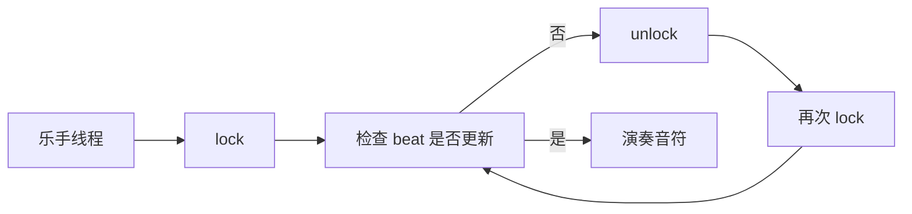
```mermaid
flowchart LR
    A["乐手线程"] --> B["lock"]
    B --> C["检查 beat 是否更新"]
    C -- "否" --> D["unlock"]
    D --> E["再次 lock"]
    E --> C
    C -- "是" --> F["演奏音符"]
```

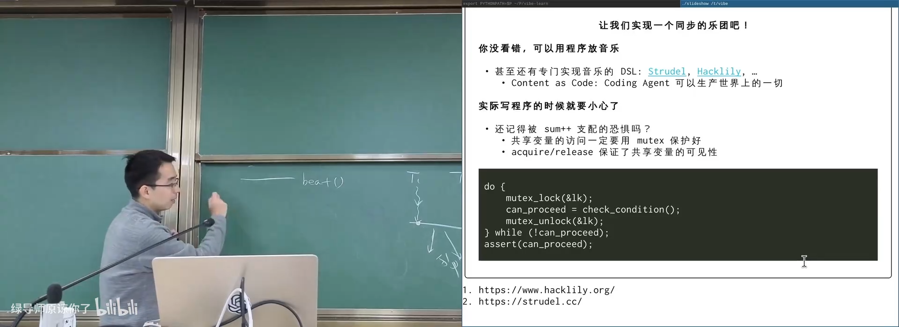

### 2.2 自旋等待的问题

*(参考时间: 00:23)*

如果同步条件可能几分钟甚至几天后才成立，不断检查就是浪费 CPU：

- 占着处理器但无有效工作；
- 产生缓存一致性和调度开销；
- 无法把 CPU 让给真正需要运行的线程。

理想行为是：

1. 条件不成立；
2. 原子地释放锁；
3. 让线程睡眠；
4. 条件可能成立时唤醒。

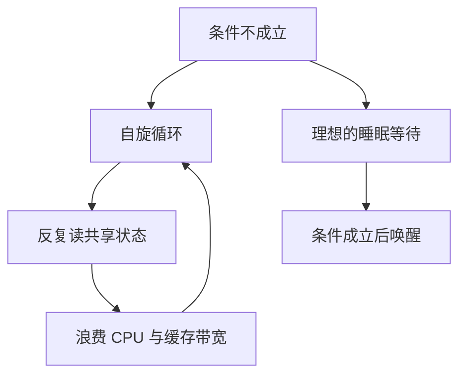
```mermaid
flowchart TD
    A["条件不成立"] --> B["自旋循环"]
    B --> C["反复读共享状态"]
    C --> D["浪费 CPU 与缓存带宽"]
    D --> B
    A --> E["理想的睡眠等待"]
    E --> F["条件成立后唤醒"]
```

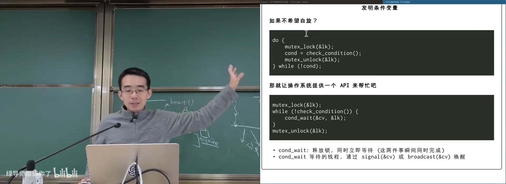

---

## 3. 条件变量

### 3.1 `cond_wait` 的核心思想

*(参考时间: 00:26)*

标准模板：

```c
mutex_lock(&lk);
while (!sync_condition()) {
    cond_wait(&cv, &lk);
}
assert(sync_condition());
mutex_unlock(&lk);
```

`cond_wait(cv, lk)` 原子地完成：

1. 释放 `lk`；
2. 把当前线程放入 `cv` 的等待队列并睡眠。

当线程被唤醒时，`cond_wait` 返回前必须重新获得 `lk`。

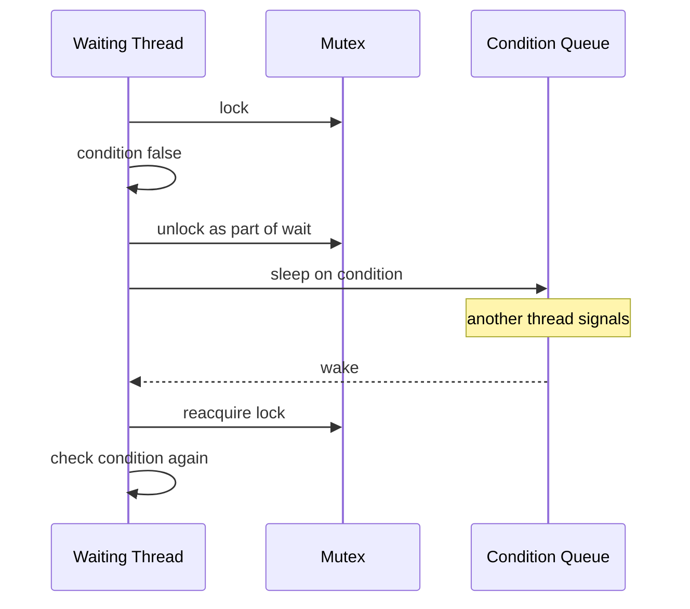
```mermaid
sequenceDiagram
    participant W as Waiting Thread
    participant M as Mutex
    participant Q as Condition Queue
    W->>M: lock
    W->>W: condition false
    W->>M: unlock as part of wait
    W->>Q: sleep on condition
    Note over Q: another thread signals
    Q-->>W: wake
    W->>M: reacquire lock
    W->>W: check condition again
```

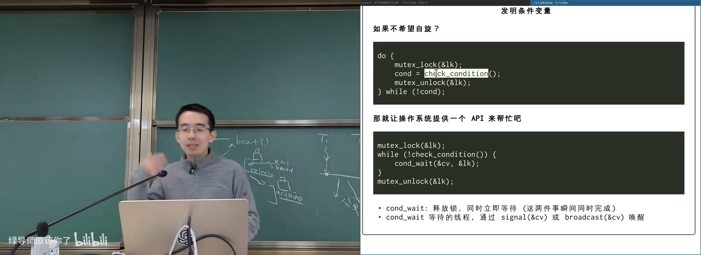

### 3.2 `wait` 释放锁与睡眠必须原子

*(参考时间: 00:28)*

如果“释放锁”和“进入睡眠”之间能被插入：

1. 等待线程释放锁；
2. 另一个线程修改条件并发出唤醒；
3. 唤醒丢失；
4. 原线程才真正睡下；
5. 它可能永远不再被唤醒。

因此条件变量实现必须保证这两个动作对同步协议来说是原子的。

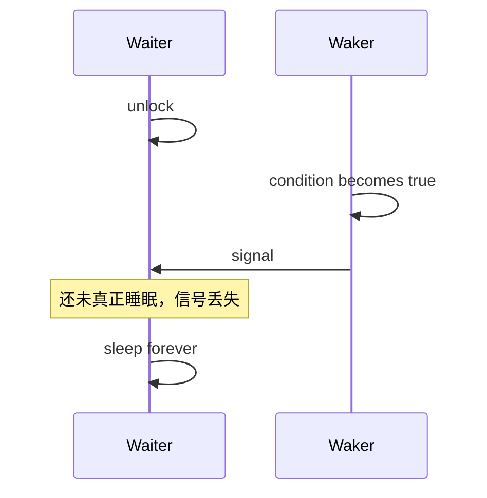
```mermaid
sequenceDiagram
    participant W as Waiter
    participant R as Waker
    W->>W: unlock
    R->>R: condition becomes true
    R->>W: signal
    Note over W: 还未真正睡眠，信号丢失
    W->>W: sleep forever
```


### 3.3 Signal 与 Broadcast

*(参考时间: 00:29)*

唤醒操作：

- `cond_signal(cv)`：唤醒等待队列中的一个线程；
- `cond_broadcast(cv)`：唤醒等待队列中的所有线程。

`broadcast` 可能唤醒条件仍不满足的线程，但它们会重新检查 `while` 条件并再次睡眠。

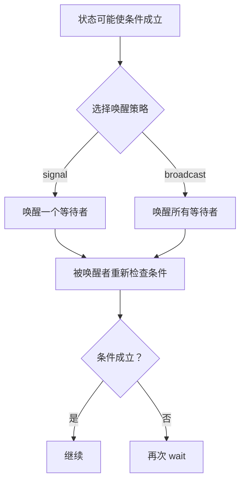
```mermaid
flowchart TD
    A["状态可能使条件成立"] --> B{"选择唤醒策略"}
    B -- "signal" --> C["唤醒一个等待者"]
    B -- "broadcast" --> D["唤醒所有等待者"]
    C --> E["被唤醒者重新检查条件"]
    D --> E
    E --> F{"条件成立？"}
    F -- "是" --> G["继续"]
    F -- "否" --> H["再次 wait"]
```


### 3.4 万能模板

*(参考时间: 00:31)*

**修改共享状态并唤醒：**

```c
mutex_lock(&lk);
/* 修改可能使 sync_condition() 成立的共享状态 */
cond_broadcast(&cv);
mutex_unlock(&lk);
```

**等待条件：**

```c
mutex_lock(&lk);
while (!sync_condition()) {
    cond_wait(&cv, &lk);
}
assert(sync_condition());
mutex_unlock(&lk);
```

这套模板被称为“万能”，因为它适用于任意复杂的同步条件。

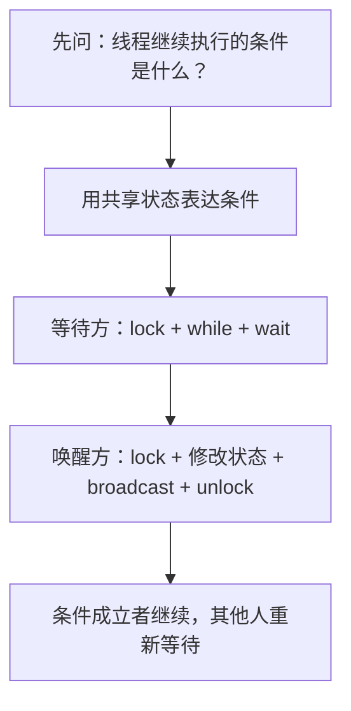
```mermaid
flowchart TD
    A["先问：线程继续执行的条件是什么？"] --> B["用共享状态表达条件"]
    B --> C["等待方：lock + while + wait"]
    C --> D["唤醒方：lock + 修改状态 + broadcast + unlock"]
    D --> E["条件成立者继续，其他人重新等待"]
```

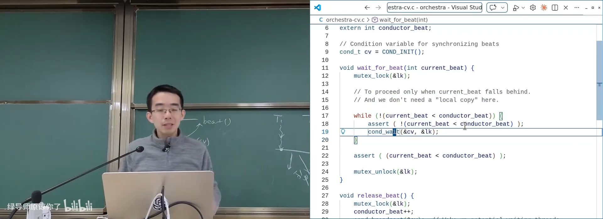

### 3.5 为什么必须是 `while`，不能是 `if`

*(参考时间: 00:32)*

被唤醒不等于条件一定成立：

- `broadcast` 会唤醒不满足条件的线程；
- 多个等待者可能在竞争同一对象；
- 另一个线程可能先抢到锁并消耗条件；
- 可能出现虚假唤醒。

`while` 的语义保证：

> 退出循环时持有锁，且条件在持有锁的状态下成立。

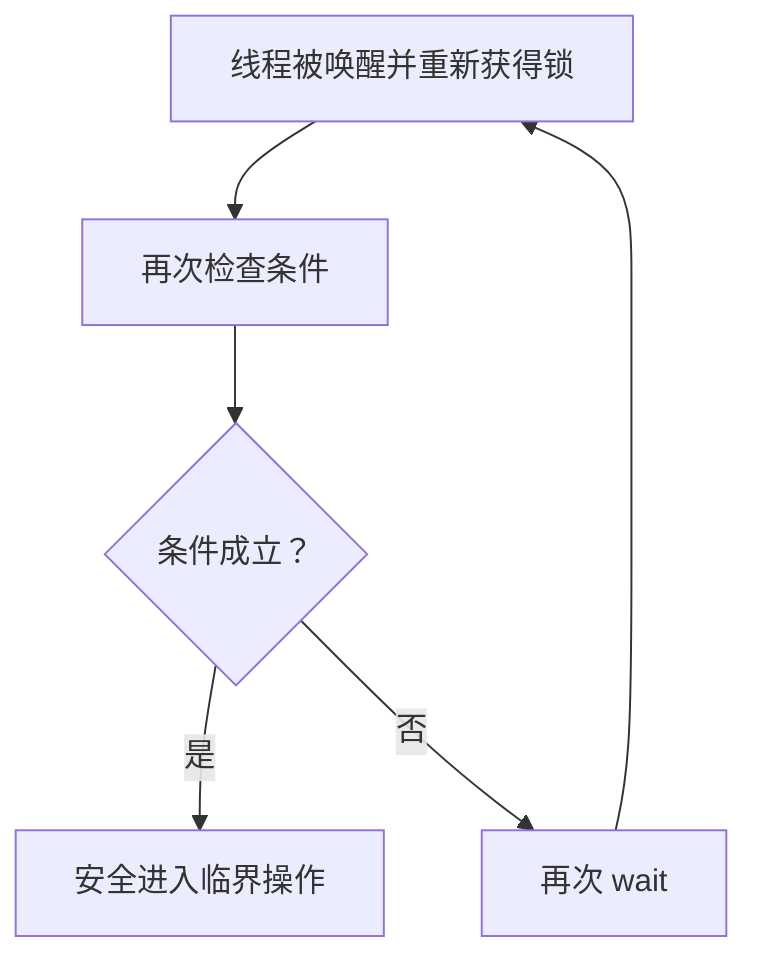
```mermaid
flowchart TD
    A["线程被唤醒并重新获得锁"] --> B["再次检查条件"]
    B --> C{"条件成立？"}
    C -- "是" --> D["安全进入临界操作"]
    C -- "否" --> E["再次 wait"]
    E --> A
```


### 3.6 用条件变量实现 `join`

*(参考时间: 00:34)*

共享状态：

```c
int running_threads = 0;
mutex_t lk = MUTEX_INIT();
cond_t cv = COND_INIT();
```

创建线程时：

```c
mutex_lock(&lk);
running_threads++;
mutex_unlock(&lk);
```

线程退出时：

```c
mutex_lock(&lk);
running_threads--;
cond_broadcast(&cv);
mutex_unlock(&lk);
```

等待线程：

```c
mutex_lock(&lk);
while (running_threads != 0) {
    cond_wait(&cv, &lk);
}
mutex_unlock(&lk);
```

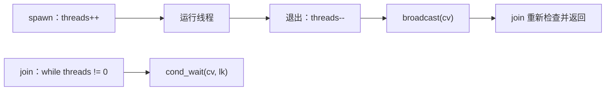
```mermaid
flowchart LR
    A["spawn：threads++"] --> B["运行线程"]
    B --> C["退出：threads--"]
    C --> D["broadcast(cv)"]
    E["join：while threads != 0"] --> F["cond_wait(cv, lk)"]
    D --> G["join 重新检查并返回"]
```


---

## 4. 生产者消费者

### 4.1 经典模型

*(参考时间: 00:38)*

共享一个有界缓冲区：

```c
void produce(Object obj);
Object consume(void);
```

生产者：

- 缓冲区有空位时放入对象；
- 缓冲区满时等待。

消费者：

- 缓冲区有对象时取走；
- 缓冲区空时等待。

该模型可以表示 scheduler–worker、HTTP gateway–backend、任务队列等大量系统。

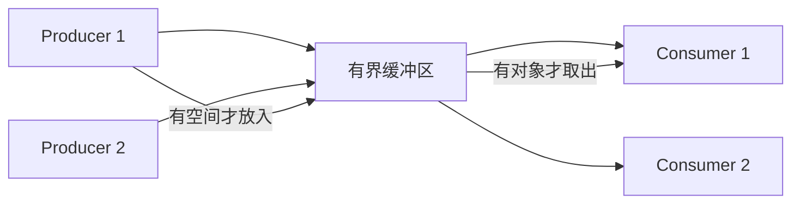
```mermaid
flowchart LR
    P1["Producer 1"] --> Q["有界缓冲区"]
    P2["Producer 2"] --> Q
    Q --> C1["Consumer 1"]
    Q --> C2["Consumer 2"]
    P1 -->|"有空间才放入"| Q
    Q -->|"有对象才取出"| C1
```

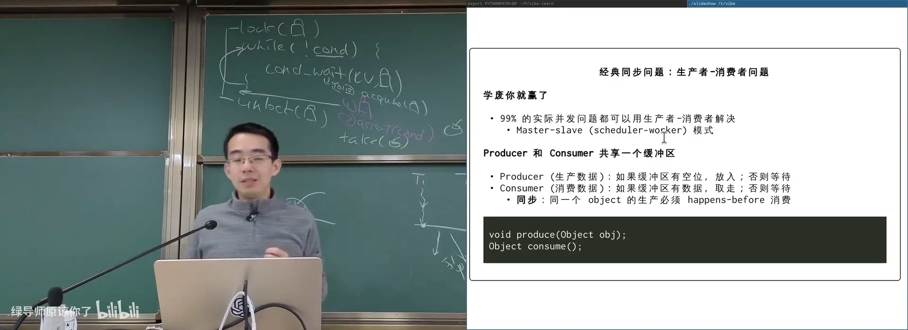

### 4.2 简化为括号序列

*(参考时间: 00:42)*

可以把生产对象看作打印左括号，消费对象看作打印右括号：

```c
void producer(int tid) {
    printf("(");
}

void consumer(int tid) {
    printf(")");
}
```

约束：

- 任意前缀中，右括号不能多于左括号；
- 当前嵌套深度不能超过缓冲区大小 `n`；
- 最终括号应当配对。

例如 `n = 3`：

```text
((())())(((   ✅
(((()))), (())) ❌
```

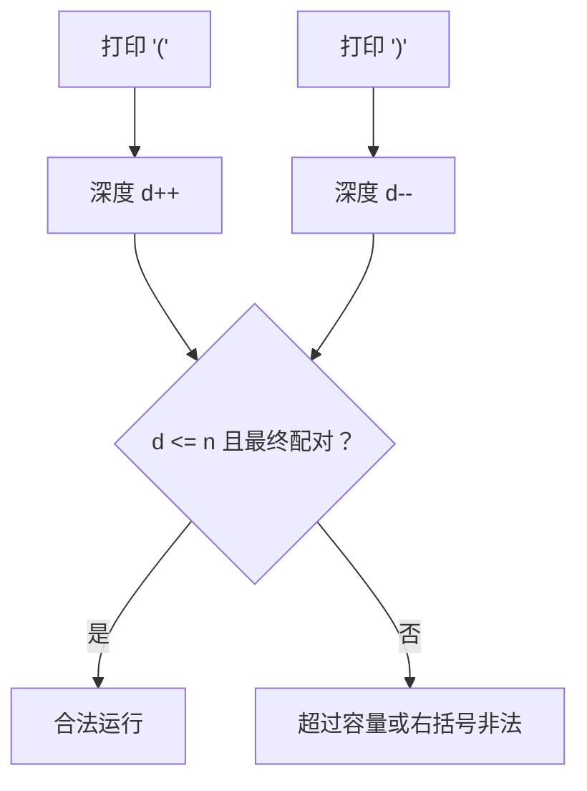
```mermaid
flowchart TD
    A["打印 '('"] --> B["深度 d++"]
    C["打印 ')'"] --> D["深度 d--"]
    B --> E{"d <= n 且最终配对？"}
    D --> E
    E -- "是" --> F["合法运行"]
    E -- "否" --> G["超过容量或右括号非法"]
```

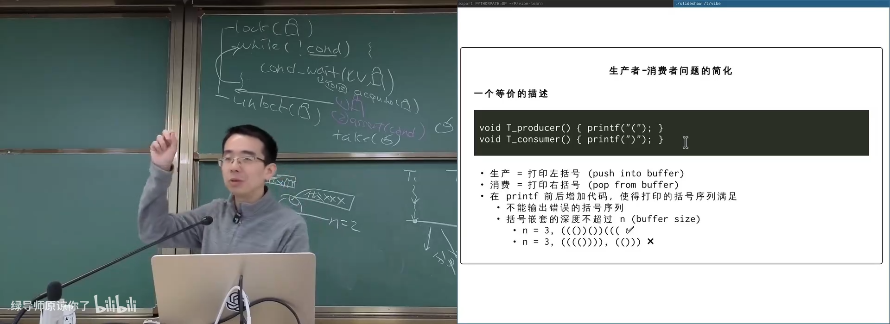

### 4.3 同步条件

*(参考时间: 00:43)*

生产者可以继续的条件：

```text
depth < n
```

消费者可以继续的条件：

```text
depth > 0
```

生产者更新共享状态：

```c
mutex_lock(&lk);
while (!(depth < n)) {
    cond_wait(&cv, &lk);
}
assert(depth < n);
depth++;
printf("(");
cond_broadcast(&cv);
mutex_unlock(&lk);
```

消费者：

```c
mutex_lock(&lk);
while (!(depth > 0)) {
    cond_wait(&cv, &lk);
}
assert(depth > 0);
depth--;
printf(")");
cond_broadcast(&cv);
mutex_unlock(&lk);
```

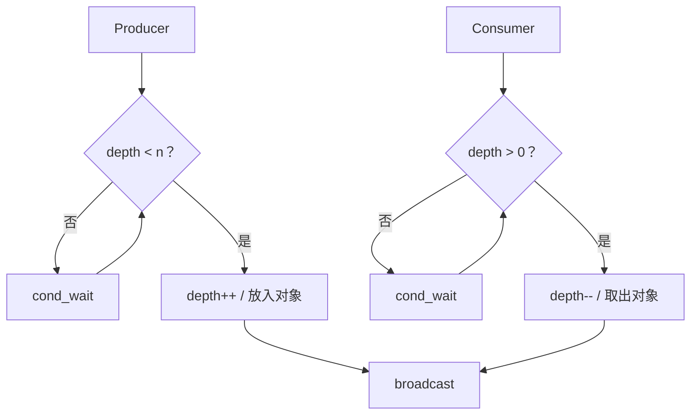
```mermaid
flowchart TD
    P["Producer"] --> PC{"depth < n？"}
    PC -- "否" --> PW["cond_wait"]
    PW --> PC
    PC -- "是" --> PI["depth++ / 放入对象"]
    C["Consumer"] --> CC{"depth > 0？"}
    CC -- "否" --> CW["cond_wait"]
    CW --> CC
    CC -- "是" --> CI["depth-- / 取出对象"]
    PI --> BC["broadcast"]
    CI --> BC
```

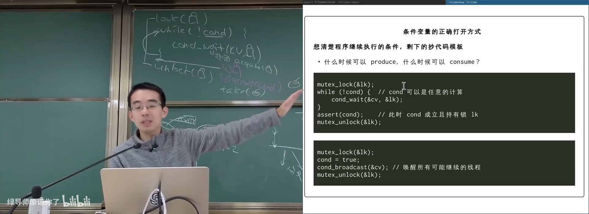

### 4.4 检查器验证

*(参考时间: 00:47)*

打印序列可以通过简单检查器验证：

```python
depth = 0
for ch in sys.stdin.read():
    if ch == "(":
        depth += 1
    elif ch == ")":
        depth -= 1
    assert 0 <= depth <= n
```

运行程序并长期检查输出，可以辅助发现明显协议错误。但它不能替代形式化证明，也不能保证所有执行交错都被覆盖。

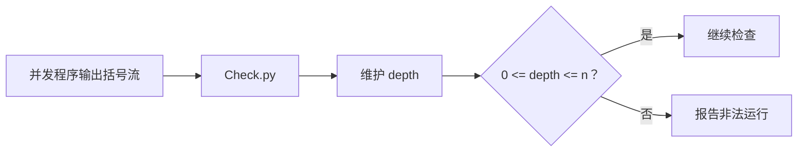
```mermaid
flowchart LR
    A["并发程序输出括号流"] --> B["Check.py"]
    B --> C["维护 depth"]
    C --> D{"0 <= depth <= n？"}
    D -- "是" --> E["继续检查"]
    D -- "否" --> F["报告非法运行"]
```

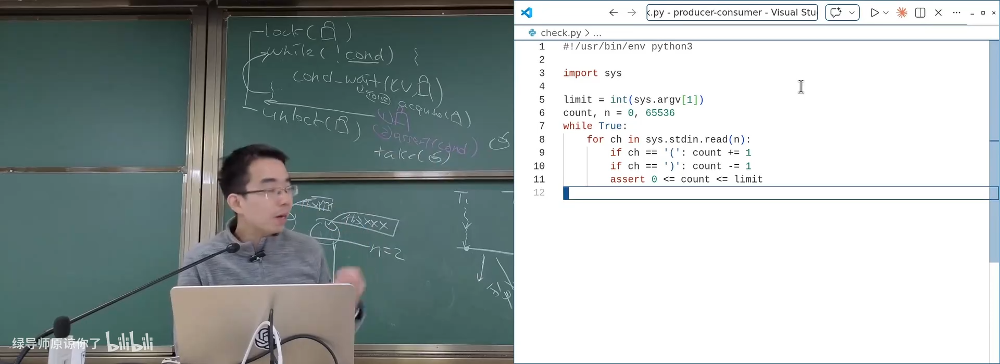

### 4.5 把 `broadcast` 改成 `signal` 的危险

*(参考时间: 00:49)*

一个生产者唤醒等待者时，若使用 `cond_signal`：

- 可能唤醒生产者，而不是消费者；
- 被唤醒的生产者发现缓冲区仍满，重新睡眠；
- 真正可以继续的消费者仍在等待；
- 系统可能停滞。

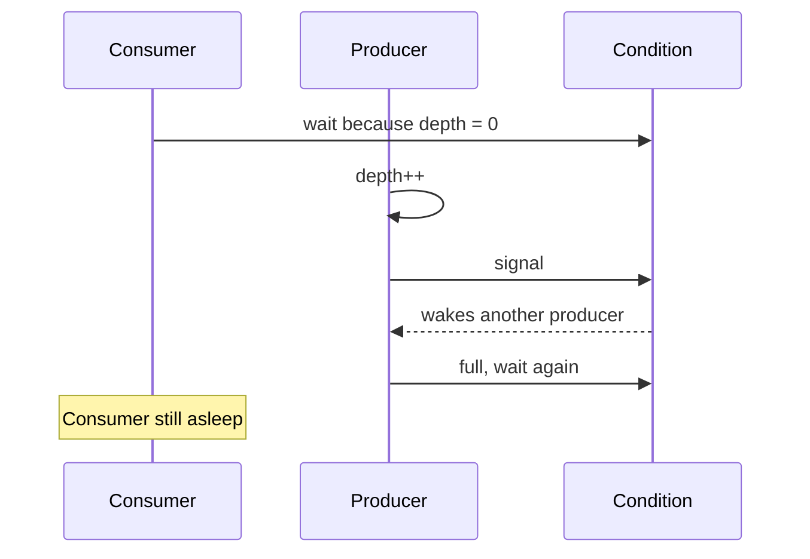
```mermaid
sequenceDiagram
    participant C as Consumer
    participant P as Producer
    participant CV as Condition
    C->>CV: wait because depth = 0
    P->>P: depth++
    P->>CV: signal
    CV-->>P: wakes another producer
    P->>CV: full, wait again
    Note over C: Consumer still asleep
```

课堂建议先用 `broadcast` 建立绝对正确性；确认性能瓶颈后，再考虑更精确的唤醒策略。


### 4.6 `while` + `broadcast` 是安全起步

*(参考时间: 00:51)*

两个基础动作：

1. 所有等待使用 `while (!condition)`；
2. 任何可能使条件成立的共享状态变更后使用 `broadcast`。

可能多唤醒一些线程，但正确性容易保证。性能优化应建立在正确实现和测量之上。

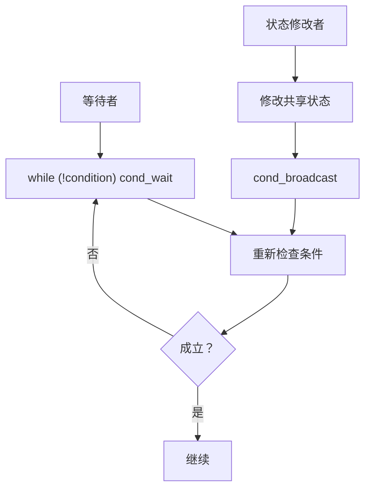
```mermaid
flowchart TD
    A["等待者"] --> W["while (!condition) cond_wait"]
    B["状态修改者"] --> M["修改共享状态"]
    M --> C["cond_broadcast"]
    W --> R["重新检查条件"]
    C --> R
    R --> S{"成立？"}
    S -- "是" --> T["继续"]
    S -- "否" --> W
```


---

## 5. 更奇怪的同步问题：括号鱼

### 5.1 水分子问题

*(参考时间: 00:52)*

类似生成水分子的同步问题：

- 两个氢线程、一个氧线程组成一个水分子；
- 任意时刻不能出现超过两个氢或超过一个氧等待；
- 分子完整后一起继续。

这比普通生产者消费者有更复杂的全局条件。

```mermaid
flowchart TD
    H1["H thread"] --> S["水分子同步状态"]
    H2["H thread"] --> S
    O["O thread"] --> S
    S --> R{"H=2 且 O=1？"}
    R -- "否" --> W["等待"]
    R -- "是" --> G["组成水分子并继续"]
```

### 5.2 用字符打印两条“鱼”

*(参考时间: 00:52)*

三种线程分别打印：

```text
<
>
_
```

任务要求输出始终由两种合法模式组成：

```text
<><_
><>_
```

即两个方向的鱼形图案。

```mermaid
stateDiagram-v2
    [*] --> A
    A --> B: print "<"
    B --> C: print ">"
    C --> D: print "<"
    D --> A: print "_"

    A --> E: print ">"
    E --> F: print "<"
    F --> D: print ">"
```

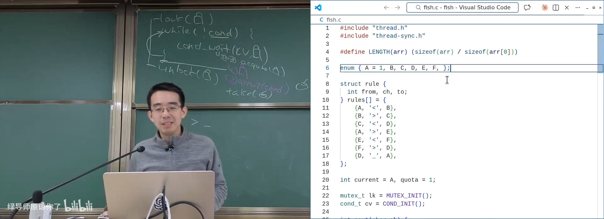

### 5.3 条件变量解决方案

*(参考时间: 00:55)*

共享：

```c
char current_state = 'A';
int printing = 0;
```

线程能继续的条件是：

```text
当前允许打印该字符
且没有其他线程正在打印
```

每个线程等待自己对应状态：

```c
mutex_lock(&lk);
while (!(can_print(my_char, current_state) && !printing)) {
    cond_wait(&cv, &lk);
}

printing = 1;
printf("%c", my_char);
current_state = next_state(current_state, my_char);
printing = 0;

cond_broadcast(&cv);
mutex_unlock(&lk);
```

```mermaid
flowchart TD
    A["线程持有锁"] --> B{"当前状态允许我打印？"}
    B -- "否" --> C["cond_wait"]
    C --> B
    B -- "是" --> D{"没有其他打印者？"}
    D -- "否" --> C
    D -- "是" --> E["打印字符"]
    E --> F["更新状态机"]
    F --> G["broadcast"]
    G --> H["unlock"]
```

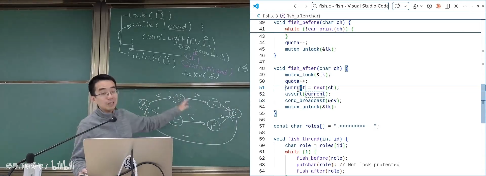

### 5.4 “万能”的含义

条件变量并没有为每种问题提供专用 API。通用步骤只有：

1. 找到共享状态；
2. 写出线程继续所需的条件；
3. 用 `while + wait` 等待；
4. 改变状态后 `broadcast`；
5. 被唤醒后持有锁重新检查。

```mermaid
flowchart LR
    A["识别共享状态"] --> B["定义同步条件"]
    B --> C["等待：while + wait"]
    B --> D["唤醒：修改状态 + broadcast"]
    C --> E["条件成立，持有锁继续"]
    D --> E
```

---

## 6. 计算图：通用并行模型

### 6.1 有向无环图

*(参考时间: 00:58)*

计算图 `G(V, E)`：

- 节点表示计算任务；
- 边 `u → v` 表示 `v` 依赖 `u` 的结果；
- 必须是 DAG，不能有依赖环；
- 边同时代表 happens-before 关系。

节点完成时，它对共享内存的写必须对后继节点可见。

```mermaid
flowchart LR
    A["节点 u"] -->|"依赖"| B["节点 v"]
    A -->|"共享结果可见"| M["共享内存"]
    M --> B
    B --> C["节点 w"]
```

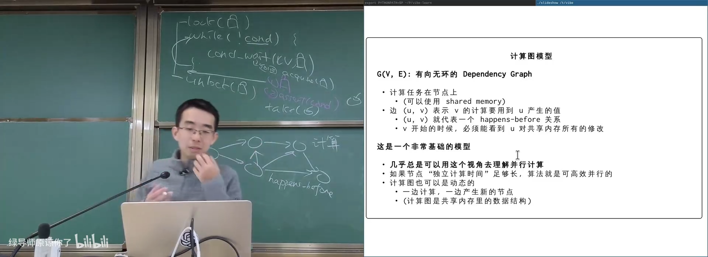

### 6.2 无处不在

*(参考时间: 01:00)*

计算图模型可以描述：

- 神经网络的数据流与 autograd；
- Makefile 的编译依赖；
- 电路模拟；
- 动态规划；
- 任务的动态生成；
- 编译、构建、工作流和数据流水线。

如果每个节点的独立计算时间足够长，图管理开销可以忽略。

```mermaid
flowchart TD
    A["DAG 计算模型"] --> B["神经网络"]
    A --> C["Makefile"]
    A --> D["电路仿真"]
    A --> E["动态规划"]
    A --> F["任务工作流"]
    A --> G["动态任务生成"]
```

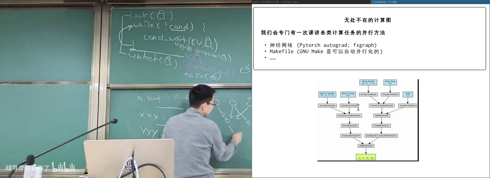

### 6.3 最长公共子序列

*(参考时间: 01:03)*

动态规划 `dp[i][j]` 的每个状态依赖：

```text
dp[i-1][j]
dp[i][j-1]
dp[i-1][j-1]
```

因此二维表格可以看成 DAG：

- 节点是 `dp[i][j]`；
- 边表示计算依赖；
- 同一对角线上的状态可能互相独立；
- 可以按层次并行计算。

```mermaid
flowchart TD
    A["dp[i-1][j-1]"] --> D["dp[i][j]"]
    B["dp[i-1][j]"] --> D
    C["dp[i][j-1]"] --> D
    D --> E["下一层状态"]
```

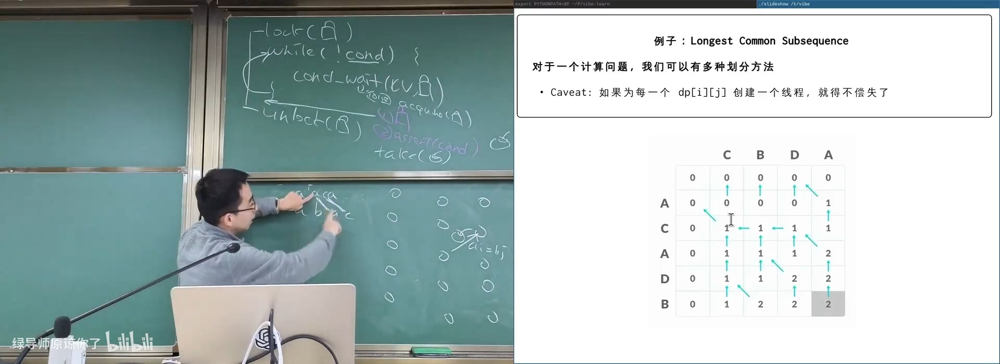

---

## 7. 实现任意计算图

### 7.1 方法一：每个节点一个线程和条件变量

*(参考时间: 01:06)*

```c
struct node {
    int pending;
    mutex_t lk;
    cond_t cv;
};
```

完成节点 `u` 后，通知所有后继：

```c
for (v in successors(u)) {
    mutex_lock(&v->lk);
    v->pending--;
    cond_signal(&v->cv);
    mutex_unlock(&v->lk);
}
```

节点 `v` 等待所有前驱：

```c
mutex_lock(&v->lk);
while (v->pending != 0) {
    cond_wait(&v->cv, &v->lk);
}
mutex_unlock(&v->lk);

compute(v);
```

```mermaid
flowchart TD
    U["u 完成"] --> V["v.pending--"]
    W["w 完成"] --> V
    V --> C{"v.pending == 0？"}
    C -- "否" --> X["继续等待"]
    C -- "是" --> S["signal(v.cv)"]
    S --> Y["v 开始计算"]
```

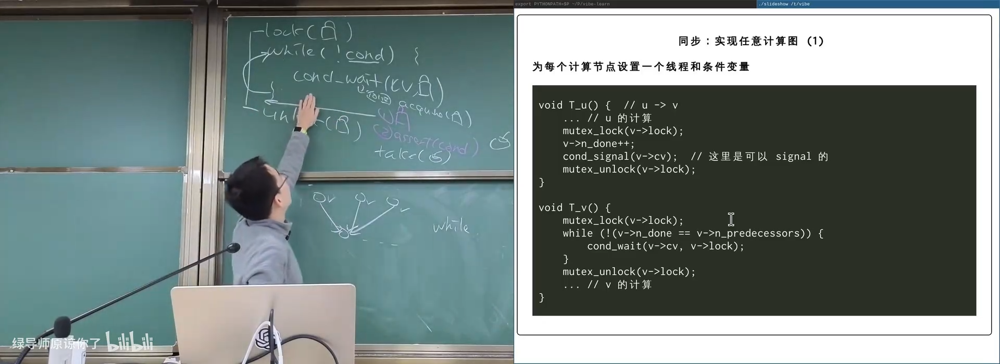

### 7.2 边完成标志或前驱计数

*(参考时间: 01:08)*

每条边可以维护一个布尔值：

```text
done(e1) && done(e2) && done(e3)
```

更常见的是为每个节点保存“尚未完成的入边数量”：

```text
pending[v] = number of incoming edges
```

前驱完成时递减；减到零时唤醒节点。

```mermaid
flowchart LR
    A["u1"] --> P["pending[v]"]
    B["u2"] --> P
    C["u3"] --> P
    P --> D{"pending[v] == 0？"}
    D -- "是" --> E["v ready"]
    D -- "否" --> F["继续等待"]
```

### 7.3 方法二：Executor Pool

*(参考时间: 01:09)*

如果节点有数百万个，为每个节点创建线程成本过高。可以使用：

- 一个 ready queue；
- 固定数量的 worker 线程；
- scheduler 或 worker 将新就绪节点放回队列。

worker 的同步条件：

```text
队列非空，或者所有任务已经完成
```

```mermaid
flowchart TD
    S["Scheduler / Ready Nodes"] --> Q["Ready Queue"]
    Q --> W1["Worker 1"]
    Q --> W2["Worker 2"]
    Q --> W3["Worker 3"]
    W1 --> R["完成节点，更新后继"]
    W2 --> R
    W3 --> R
    R --> Q
```

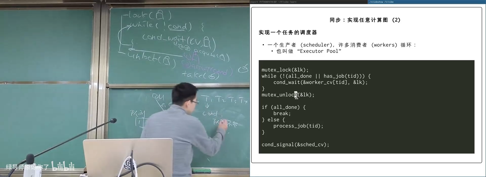

### 7.4 Worker 的等待模板

```c
mutex_lock(&lk);
while (!(all_done || has_job(tid))) {
    cond_wait(&worker_cv[tid], &lk);
}
mutex_unlock(&lk);

if (all_done) {
    return;
}

process_job(tid);
```

任务完成后再加锁更新依赖，并把可能的就绪任务放回队列。

```mermaid
flowchart TD
    A["Worker 循环"] --> B["lock"]
    B --> C{"有任务或全部完成？"}
    C -- "否" --> D["cond_wait"]
    D --> C
    C -- "有任务" --> E["unlock + 执行任务"]
    C -- "全部完成" --> F["退出"]
    E --> G["lock 更新 DAG"]
    G --> H["向后继队列添加就绪任务"]
    H --> I["signal / broadcast"]
    I --> A
```

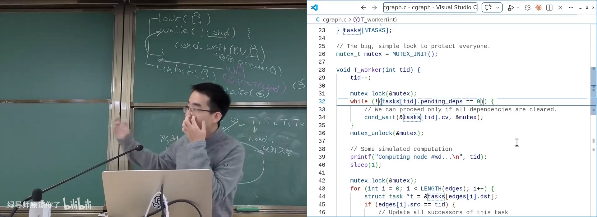

### 7.5 锁的范围

*(参考时间: 01:13)*

真实 DAG 调度中：

- 从队列取任务、更新依赖时持锁；
- 真正计算任务时不持全局锁；
- 每个任务拥有自己的私有数据；
- 只对共享依赖图进行受保护访问。

这样既保证正确性，也保留多处理器并行度。

```mermaid
flowchart LR
    A["lock：取任务"] --> B["unlock"]
    B --> C["并行执行计算"]
    C --> D["lock：更新依赖"]
    D --> E["unlock"]
    E --> F["继续循环"]
```

---

## 8. 总结：同步是并发的另一半

这一讲从互斥的局限出发，建立了完整同步机制：

- 互斥只保证 A、B 不并发，不能强制 A happens-before B；
- 同步通过等待条件建立确定的 happens-before；
- `join`、同步电路、乐团和约定见面都是“条件握手”；
- 自旋等待实现简单，但长期等待会浪费 CPU；
- 条件变量让线程在条件不成立时睡眠；
- `cond_wait` 原子地释放锁并睡眠，唤醒后重新获得锁；
- 万能模板是 `lock + while + wait` 与 `lock + update + broadcast + unlock`；
- 生产者消费者是绝大多数实际同步问题的基础模型；
- 有界缓冲区的条件分别是“有空位”和“有对象”；
- `signal` 可能唤醒错误线程，安全起步应使用 `broadcast`；
- 水分子、括号鱼等奇怪问题只需写清同步条件；
- DAG 是理解并行计算的通用模型；
- DAG 可以用“每节点线程 + 条件变量”或 Executor Pool 实现。

```mermaid
flowchart LR
    A["互斥：解决数据竞争"] --> B["同步：控制事件顺序"]
    B --> C["条件变量"]
    C --> D["生产者消费者"]
    C --> E["任意复杂同步条件"]
    C --> F["DAG / 计算图"]
    F --> G["节点线程模型"]
    F --> H["Executor Pool"]
```

最终可以记住一句话：

> 无论同步问题多奇怪，先写出“当前线程继续执行的条件”，然后套用条件变量模板。

---

## 附：官方参考与延伸阅读

以下链接来自官方讲义第 15 讲及课堂内容：

- [同步乐团 demo](https://jyywiki.cn/OS/demos/concurrency/orchestra)
- [生产者消费者 demo](https://jyywiki.cn/OS/demos/concurrency/producer-consumer)
- [括号鱼同步问题](https://jyywiki.cn/OS/demos/concurrency/fish)
- [使用互斥锁实现计算图](https://jyywiki.cn/OS/demos/concurrency/cgraph-mutex)
- [Strudel live coding music](https://strudel.cc/)
- [Hacklily](https://www.hacklily.org/)

阅读材料：

- *Operating Systems: Three Easy Pieces* 第 30 章，Condition Variables。

官方课程资料：

- [课程主页](https://jyywiki.cn/OS/2026/)
- [第 15 讲讲义：并发控制：同步 (1)](https://jyywiki.cn/OS/2026/lect15.md)
- [视频：15 - 并发控制：条件变量和万能同步方法](https://www.bilibili.com/video/BV1t3dQBAEzd/)

> **版权与署名**：本讲课程材料由蒋炎岩（jyy）编写。课程讲义与幻灯片采用 [Creative Commons BY-NC 4.0](http://creativecommons.org/licenses/by-nc/4.0/) 许可；本电子书保留课程出处、作者署名与许可说明。
