# 并发控制：信号量

> **课程**：2026 春季学期《操作系统原理》  
> **讲师**：蒋炎岩（jyy）  
> **官方课程主页**：<https://jyywiki.cn/OS/2026/>  
> **官方讲义**：<https://jyywiki.cn/OS/2026/lect16.md>  
> **视频来源**：[Bilibili BV1yQogB2Esf](https://www.bilibili.com/video/BV1yQogB2Esf/)  
> **版权说明**：课程讲义与幻灯片归蒋炎岩所有，采用 [Creative Commons BY-NC 4.0](http://creativecommons.org/licenses/by-nc/4.0/) 许可；本电子书是对课堂讲授的书面化重构，保留出处与许可说明。

## 导语：从“一把钥匙”到“多把钥匙”

*(参考时间: 00:00)*

上一讲已经建立了同步的基本方法：

```c
mutex_lock(&lk);
while (!condition()) {
    cond_wait(&cv, &lk);
}
mutex_unlock(&lk);
```

以及：

```c
mutex_lock(&lk);
/* 改变共享状态 */
cond_broadcast(&cv);
mutex_unlock(&lk);
```

这是“万能同步模板”，但代码看起来总包含一个显式等待循环。

这一讲从一个非常自然的问题出发：

> 互斥锁通常只有一把钥匙。桌上有多个车位、多个手环或多个许可时，会发生什么？

答案就是 **信号量（Semaphore）**：

- 内部保存一个整数计数；
- `P` / `acquire` / `down` / `wait` 消耗一个 token；
- `V` / `release` / `up` / `post` 产生一个 token；
- token 可以表示钥匙、车位、手环、任务完成次数或可用数据数。

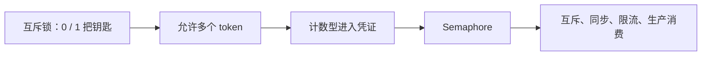
```mermaid
flowchart LR
    A["互斥锁：0 / 1 把钥匙"] --> B["允许多个 token"]
    B --> C["计数型进入凭证"]
    C --> D["Semaphore"]
    D --> E["互斥、同步、限流、生产消费"]
```

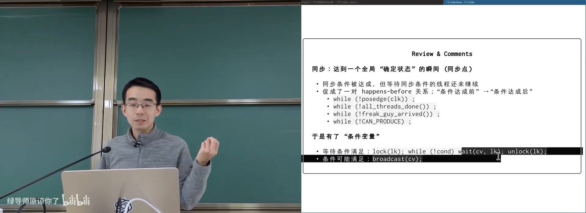

---

## 1. 从计算图想到跨线程传递锁

### 1.1 DAG 的同步条件

*(参考时间: 00:04)*

有向无环图 `G(V, E)` 中：

- 节点表示计算；
- 边 `u → v` 表示 `v` 依赖 `u`；
- 节点 `v` 必须等所有前驱完成。

最直接的实现是给每个节点维护：

```text
pending[v] = 尚未完成的前驱数量
```

前驱完成时递减，减到零时唤醒 `v`。

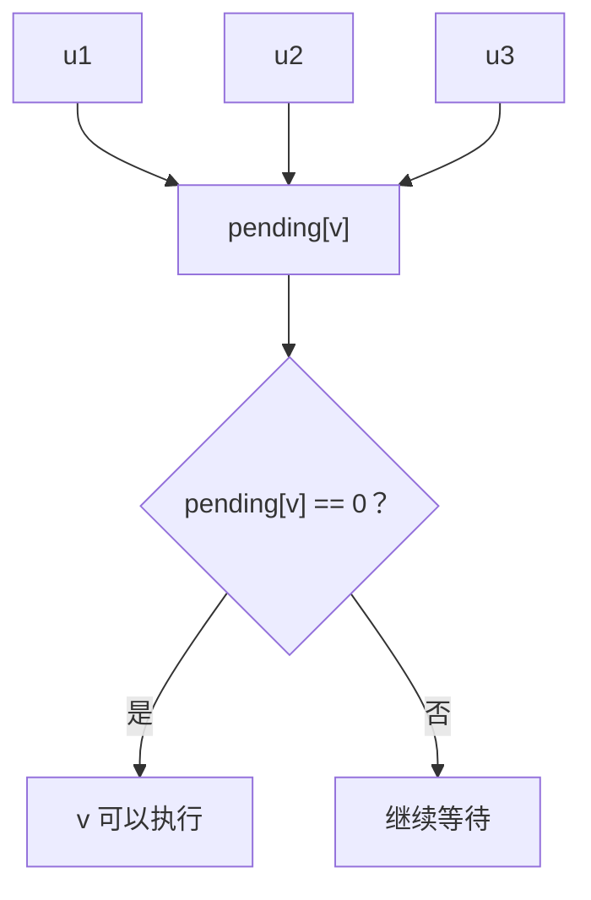
```mermaid
flowchart TD
    A["u1"] --> P["pending[v]"]
    B["u2"] --> P
    C["u3"] --> P
    P --> D{"pending[v] == 0？"}
    D -- "是" --> E["v 可以执行"]
    D -- "否" --> F["继续等待"]
```

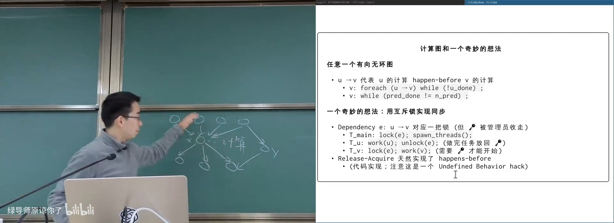

### 1.2 用互斥锁实现 happens-before

*(参考时间: 00:07)*

一个聪明的做法：

- 为每条边 `e: u → v` 创建一个互斥锁；
- 主线程先 `lock(e)`，把钥匙收走；
- `u` 完成后 `unlock(e)`，把钥匙放回；
- `v` 开始时 `lock(e)`，拿走钥匙后继续。

由于 lock acquire/release 本身具有同步语义，这自然形成了：

```text
u 完成 → unlock(e) → lock(e) → v 开始
```

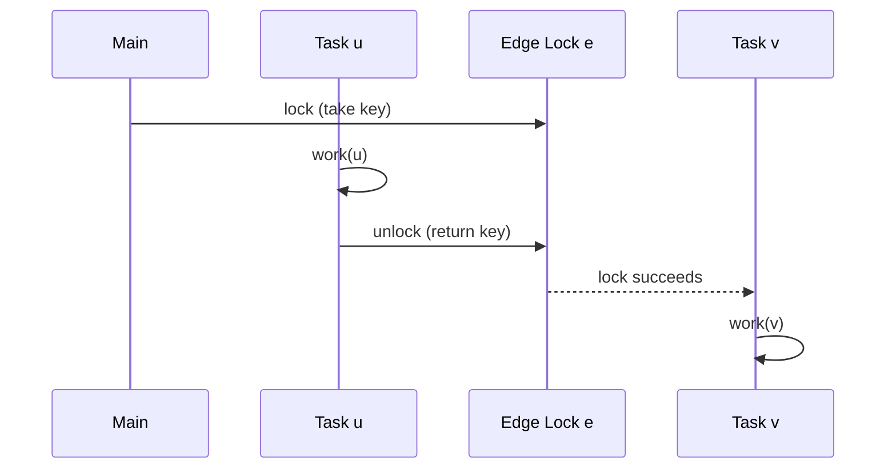
```mermaid
sequenceDiagram
    participant M as Main
    participant U as Task u
    participant L as Edge Lock e
    participant V as Task v
    M->>L: lock (take key)
    U->>U: work(u)
    U->>L: unlock (return key)
    L-->>V: lock succeeds
    V->>V: work(v)
```

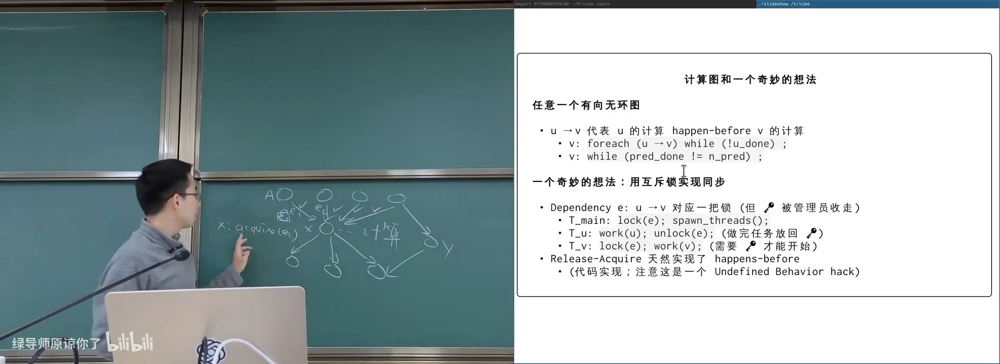

### 1.3 逻辑正确，但属于 undefined behavior

*(参考时间: 00:09)*

同一把 mutex 的上锁和解锁发生在不同线程：

```c
main: lock(&edge);
u:    work(u);
u:    unlock(&edge);
v:    lock(&edge);
```

逻辑上能建立 happens-before，但 POSIX mutex 不允许跨线程按这种方式“传钥匙”。线程库的 fast path 和所有权检查可能假设 lock/unlock 配对在同一个线程中。

因此这是有趣的思路，却不是可依赖的实现。

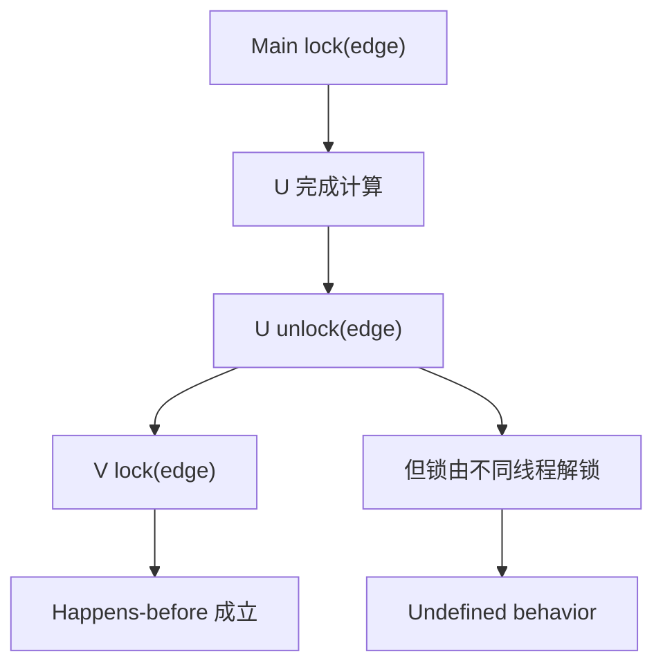
```mermaid
flowchart TD
    A["Main lock(edge)"] --> B["U 完成计算"]
    B --> C["U unlock(edge)"]
    C --> D["V lock(edge)"]
    D --> E["Happens-before 成立"]
    C --> F["但锁由不同线程解锁"]
    F --> G["Undefined behavior"]
```

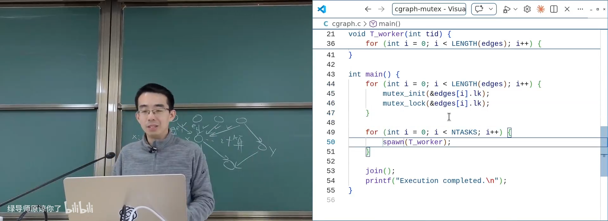

### 1.4 Token 才是本质

*(参考时间: 00:12)*

真正需要传递的不是“锁对象”，而是一个 token：

- 有 token 才能继续；
- release 产生 token；
- acquire 消耗 token。

这种 token 可以理解为：

- 桌上的钥匙；
- 停车场剩余车位；
- 游泳馆手环；
- 餐厅空桌；
- 任务完成通知。


```mermaid
flowchart LR
    A["Release：产生 token"] --> Table["共享 token 池"]
    Table --> B["Acquire：消耗 token"]
    B --> C["允许后续操作"]
```

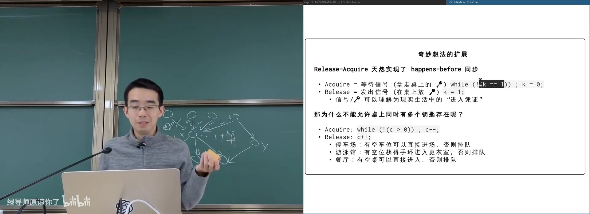

### 1.5 为什么不能有多个 token

*(参考时间: 00:15)*

现实世界天然存在计数资源：

| 场景 | 资源计数 |
| --- | --- |
| 停车场 | 剩余车位 |
| 游泳馆 | 剩余名额 |
| 餐厅 | 空桌数量 |
| token 桶 | 可用凭证数量 |

只要有空位，就可以直接进入；没有空位，就等待别人释放。

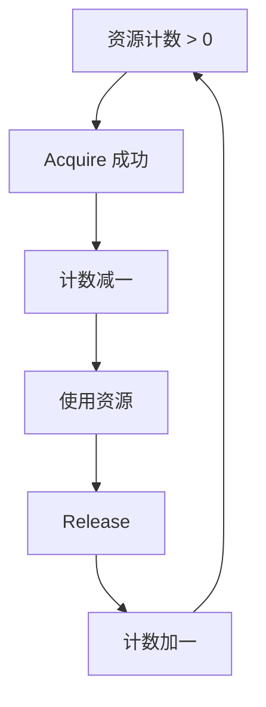
```mermaid
flowchart TD
    A["资源计数 > 0"] --> B["Acquire 成功"]
    B --> C["计数减一"]
    C --> D["使用资源"]
    D --> E["Release"]
    E --> F["计数加一"]
    F --> A
```

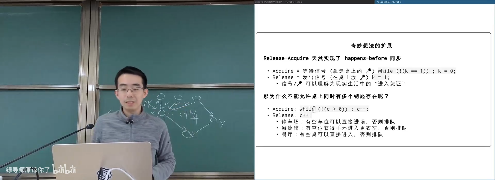

---

## 2. 信号量 API

### 2.1 P / V 操作

*(参考时间: 00:17)*

信号量包含一个整数 `count`：

```c
void P(sem_t *sem);  /* try + decrease */
void V(sem_t *sem);  /* increase */
```

历史名称：

- `P`：Prolaag，尝试递减；
- `V`：Verhoog，递增；
- 现代别名：down/up、wait/post、acquire/release。

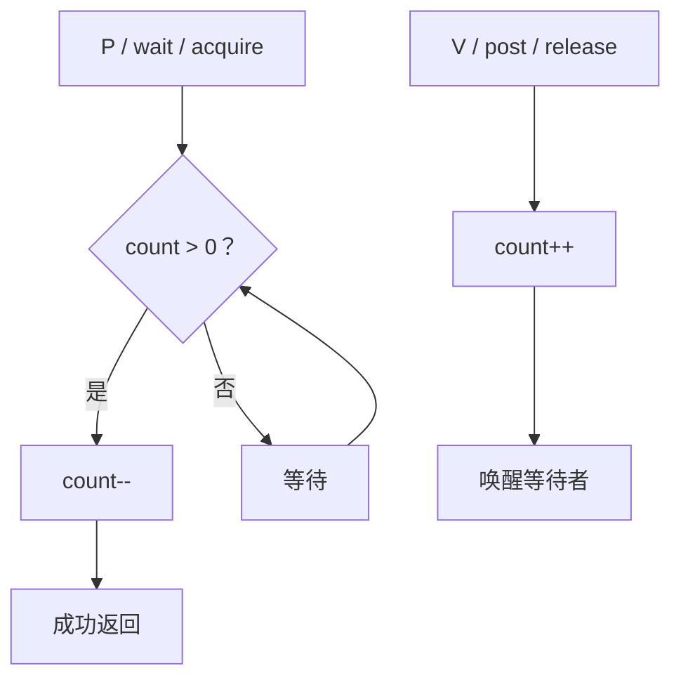
```mermaid
flowchart TD
    A["P / wait / acquire"] --> B{"count > 0？"}
    B -- "是" --> C["count--"]
    C --> D["成功返回"]
    B -- "否" --> E["等待"]
    E --> B
    F["V / post / release"] --> G["count++"]
    G --> H["唤醒等待者"]
```

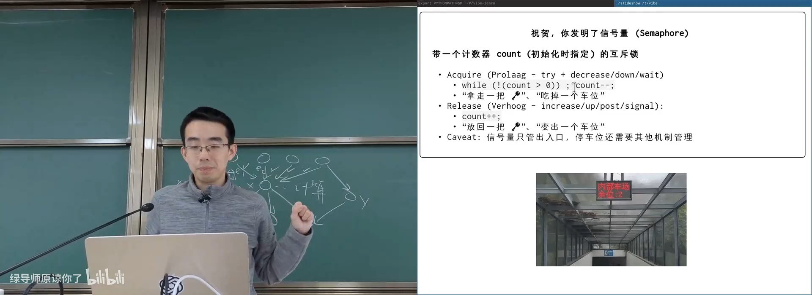

### 2.2 用条件变量实现信号量

*(参考时间: 00:21)*

```c
void P(sem_t *sem) {
    mutex_lock(&sem->lk);
    while (!(sem->count > 0)) {
        cond_wait(&sem->cv, &sem->lk);
    }
    sem->count--;
    mutex_unlock(&sem->lk);
}

void V(sem_t *sem) {
    mutex_lock(&sem->lk);
    sem->count++;
    cond_broadcast(&sem->cv);
    mutex_unlock(&sem->lk);
}
```

这体现了信号量与条件变量的关系：

> 信号量可以看作一个只等待 `count > 0` 这一种条件的特殊同步对象。

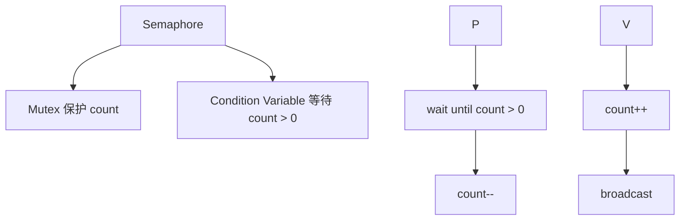
```mermaid
flowchart TD
    A["Semaphore"] --> B["Mutex 保护 count"]
    A --> C["Condition Variable 等待 count > 0"]
    D["P"] --> E["wait until count > 0"]
    E --> F["count--"]
    G["V"] --> H["count++"]
    H --> I["broadcast"]
```

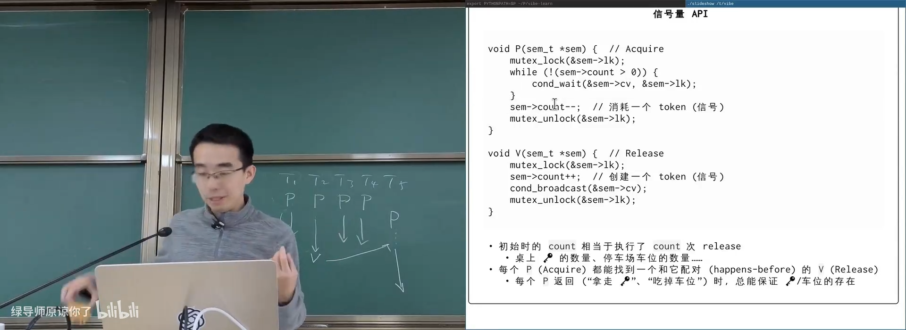

### 2.3 只有 n 个容量的资源

*(参考时间: 00:18)*

以 `count = 4` 为例：

```text
初始：4
P1：3
P2：2
P3：1
P4：0
P5：等待
```

任何线程执行 `V` 后计数加一，等待中的 `P5` 才能继续。

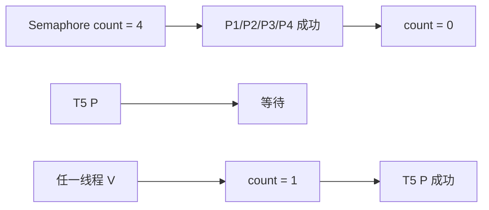
```mermaid
flowchart LR
    A["Semaphore count = 4"] --> B["P1/P2/P3/P4 成功"]
    B --> C["count = 0"]
    D["T5 P"] --> E["等待"]
    F["任一线程 V"] --> G["count = 1"]
    G --> H["T5 P 成功"]
```

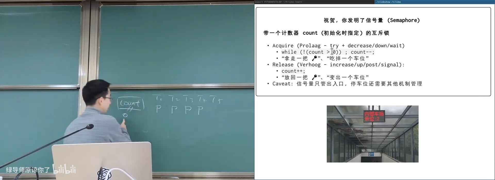

### 2.4 互斥锁是信号量的特例

*(参考时间: 00:23)*

初始化：

```c
sem_t mutex = SEM_INIT(1);
```

然后：

```c
void lock(void) {
    P(&mutex);
}

void unlock(void) {
    V(&mutex);
}
```

只有一把钥匙时，信号量退化为互斥锁。

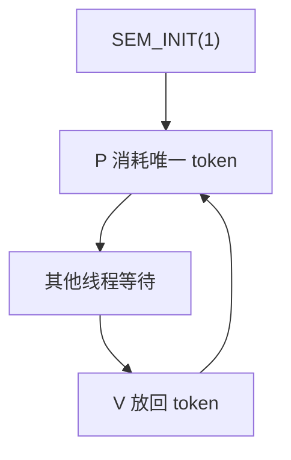
```mermaid
flowchart TD
    A["SEM_INIT(1)"] --> B["P 消耗唯一 token"]
    B --> C["其他线程等待"]
    C --> D["V 放回 token"]
    D --> B
```


---

## 3. 用信号量实现同步

### 3.1 一次性 happens-before

*(参考时间: 00:25)*

```c
sem_t ready = SEM_INIT(0);

void T_A(void) {
    work_a();
    V(&ready);
}

void T_B(void) {
    P(&ready);
    work_b();
}
```

`P` 会等待 `V` 产生 token。因此 `work_a()` happens-before `work_b()`。

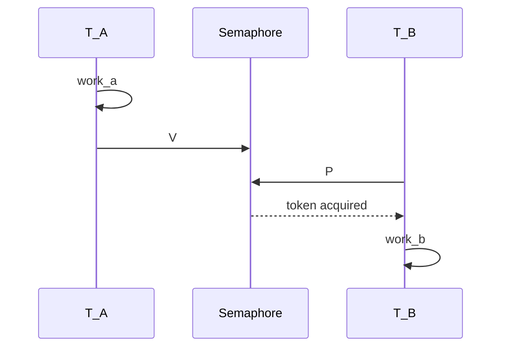
```mermaid
sequenceDiagram
    participant A as T_A
    participant S as Semaphore
    participant B as T_B
    A->>A: work_a
    A->>S: V
    B->>S: P
    S-->>B: token acquired
    B->>B: work_b
```

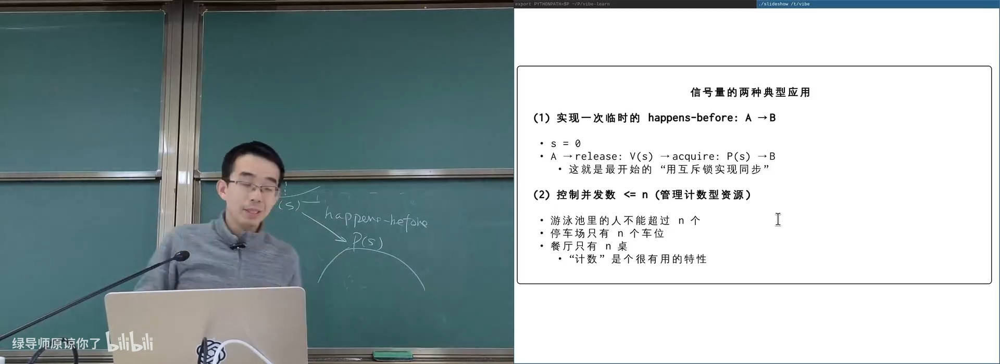

### 3.2 实现 `join`

*(参考时间: 00:27)*

两种等价方式。

**每个线程一个信号量：**

```c
void worker(int tid) {
    do_work(tid);
    V(&done[tid]);
}

void join(void) {
    for (int i = 0; i < n; i++) {
        P(&done[i]);
    }
}
```

**共用一个计数信号量：**

```c
void worker(int tid) {
    do_work(tid);
    V(&done);
}

void join(void) {
    for (int i = 0; i < n; i++) {
        P(&done);
    }
}
```

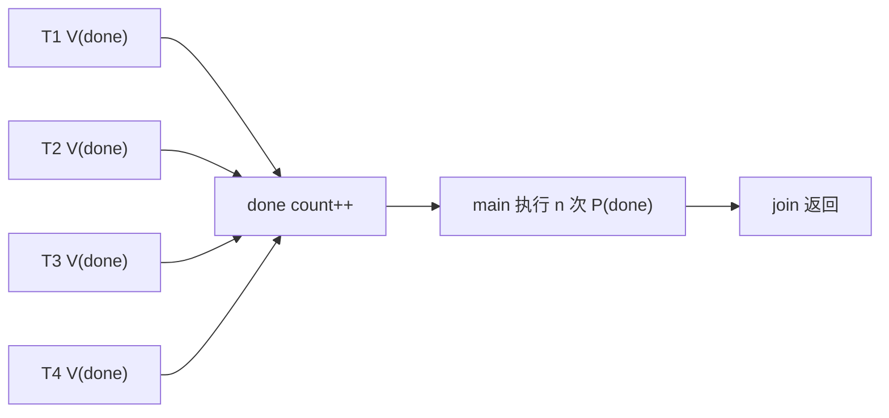
```mermaid
flowchart LR
    T1["T1 V(done)"] --> S["done count++"]
    T2["T2 V(done)"] --> S
    T3["T3 V(done)"] --> S
    T4["T4 V(done)"] --> S
    S --> M["main 执行 n 次 P(done)"]
    M --> J["join 返回"]
```

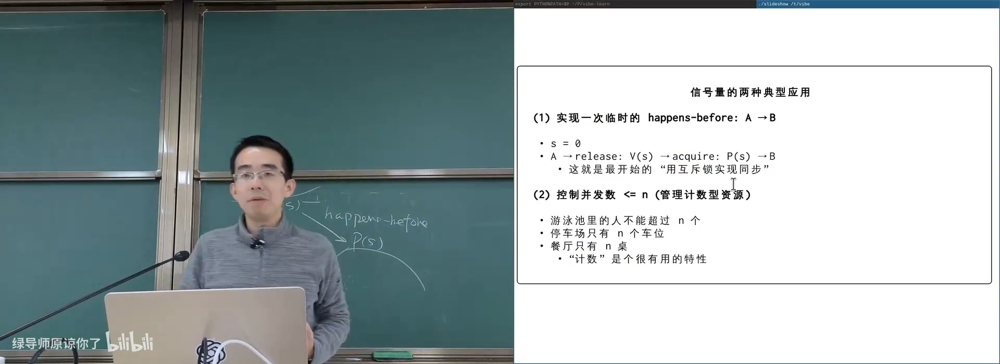

### 3.3 实现任意 DAG

*(参考时间: 00:30)*

为每个节点 `v` 创建一个信号量 `sem[v]`，初始值为 `0`：

```c
void T_v(void) {
    for (int i = 0; i < n_predecessors(v); i++) {
        P(&sem[v]);
    }

    work(v);

    for (u in successors(v)) {
        V(&sem[u]);
    }
}
```

节点 `v` 收到等于入边数量的 token 后开始计算。

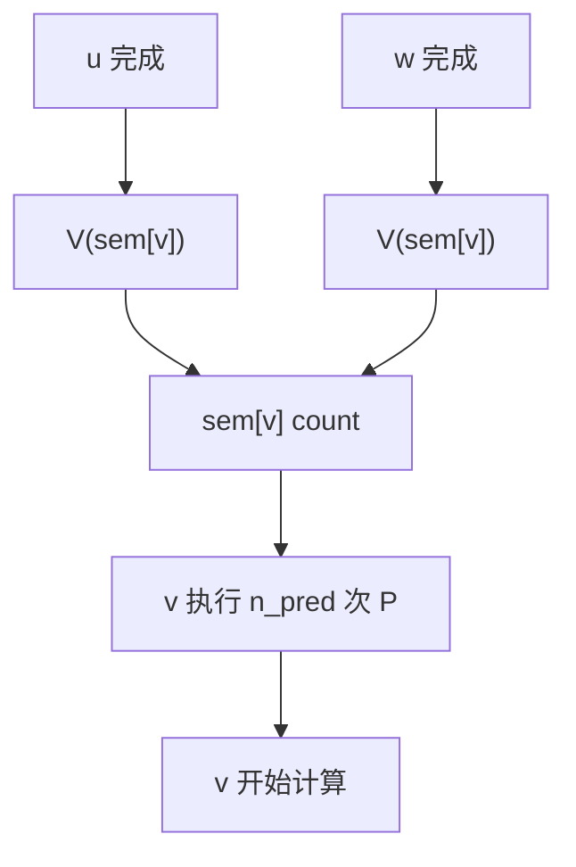
```mermaid
flowchart TD
    U["u 完成"] --> SU["V(sem[v])"]
    W["w 完成"] --> SV["V(sem[v])"]
    SU --> S["sem[v] count"]
    SV --> S
    S --> P["v 执行 n_pred 次 P"]
    P --> R["v 开始计算"]
```

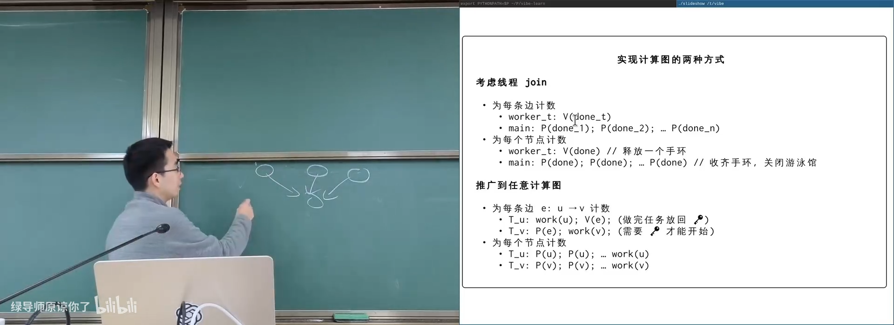

---

## 4. 生产者消费者：信号量的代表作

### 4.1 两个计数表

*(参考时间: 00:34)*

```c
sem_t empty = SEM_INIT(depth);
sem_t fill  = SEM_INIT(0);

void producer(int tid) {
    P(&empty);
    produce_one();
    V(&fill);
}

void consumer(int tid) {
    P(&fill);
    consume_one();
    V(&empty);
}
```

含义：

- `empty` 中的 token 表示空槽位；
- `fill` 中的 token 表示已填入的数据；
- 生产者从 `empty` 拿 token，生产后向 `fill` 放入 token；
- 消费者从 `fill` 拿 token，消费后向 `empty` 放入 token。

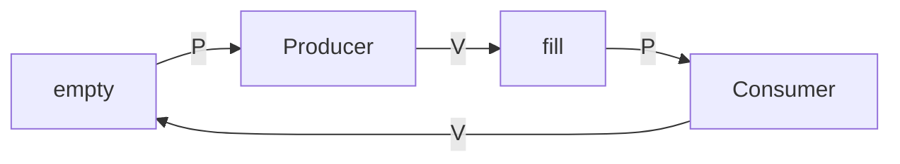
```mermaid
flowchart LR
    E["empty"] -->|"P"| P["Producer"]
    P -->|"V"| F["fill"]
    F -->|"P"| C["Consumer"]
    C -->|"V"| E
```

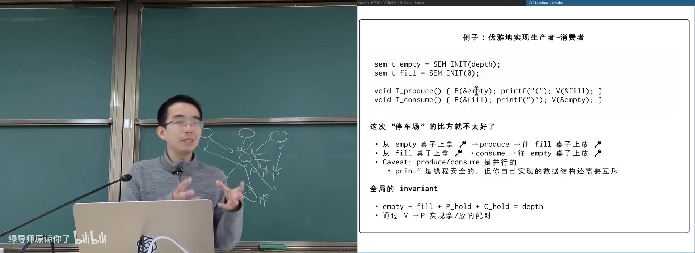

### 4.2 全局不变量

*(参考时间: 00:38)*

缓冲区大小为 `depth`，始终满足：

```text
empty
+ fill
+ producer_holding_token
+ consumer_holding_token
= depth
```

每次 `P` 消耗一个 token，每次 `V` 产生一个 token，因此总数保持守恒。

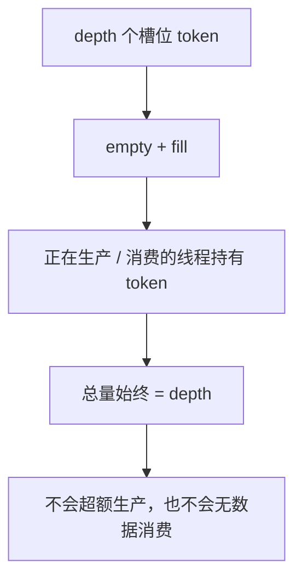
```mermaid
flowchart TD
    A["depth 个槽位 token"] --> B["empty + fill"]
    B --> C["正在生产 / 消费的线程持有 token"]
    C --> D["总量始终 = depth"]
    D --> E["不会超额生产，也不会无数据消费"]
```

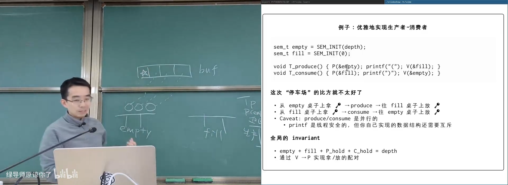

### 4.3 生产者与消费者完全对称

*(参考时间: 00:41)*

生产者：

```text
从 empty 取走一个球
→ 填充一个槽位
→ 向 fill 放入一个球
```

消费者：

```text
从 fill 取走一个球
→ 清空一个槽位
→ 向 empty 放入一个球
```

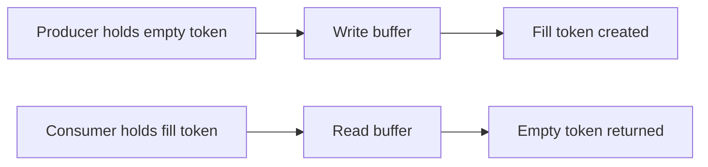
```mermaid
flowchart LR
    A["Producer holds empty token"] --> B["Write buffer"]
    B --> C["Fill token created"]
    D["Consumer holds fill token"] --> E["Read buffer"]
    E --> F["Empty token returned"]
```

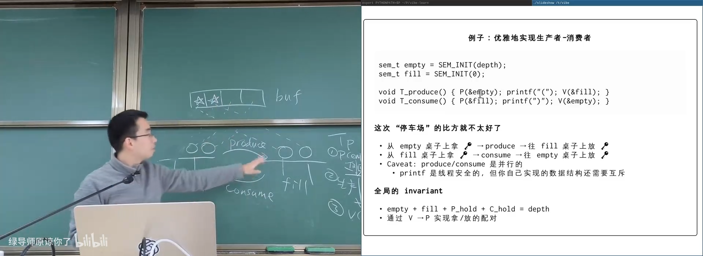

---

## 5. 信号量的边界

### 5.1 计数不总能表达同步条件

*(参考时间: 00:45)*

上一讲“括号鱼”问题要求：

```text
<><_
><>_
```

合法状态有“或”条件：

```text
当前可以打印 < 或 >
```

单个信号量的计数无法自然表达这种全局状态条件。

可以用多个信号量并配合随机选择模拟，但代码会逐渐变成协议技巧，而不是清晰的全局条件。

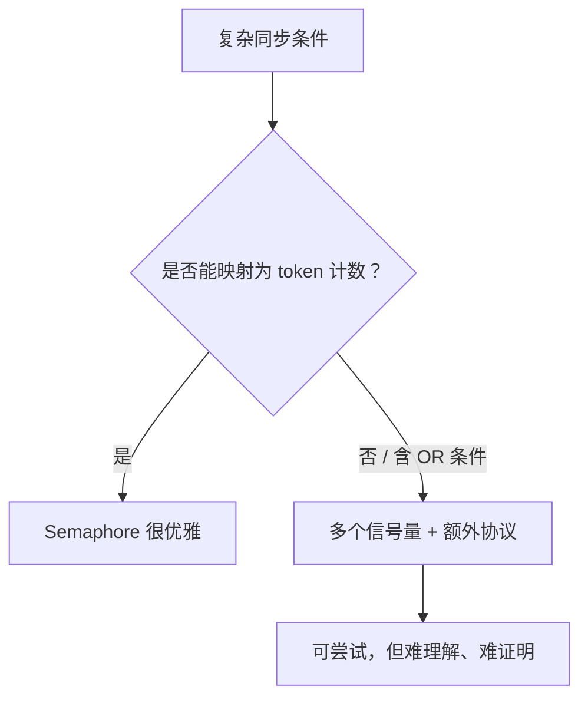
```mermaid
flowchart TD
    A["复杂同步条件"] --> B{"是否能映射为 token 计数？"}
    B -- "是" --> C["Semaphore 很优雅"]
    B -- "否 / 含 OR 条件" --> D["多个信号量 + 额外协议"]
    D --> E["可尝试，但难理解、难证明"]
```

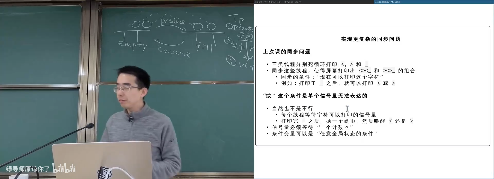

### 5.2 close / open 让生产者消费者变复杂

*(参考时间: 01:06)*

给生产者消费者增加：

- `close()`：禁止新的生产消费，等待正在执行的请求结束；
- `open()`：重新允许生产消费。

条件变量写法可以扩展共享状态：

```c
bool closing;
int active;
```

等待条件变为：

```text
not closing && has_space / has_item
```

信号量实现则需要额外协议协调 close、open 与现有 token，复杂度大幅增加。

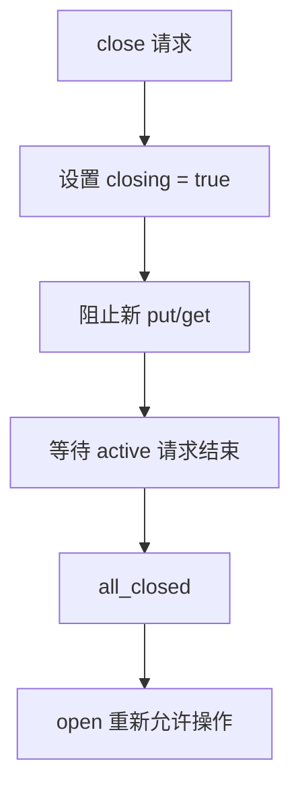
```mermaid
flowchart TD
    A["close 请求"] --> B["设置 closing = true"]
    B --> C["阻止新 put/get"]
    C --> D["等待 active 请求结束"]
    D --> E["all_closed"]
    E --> F["open 重新允许操作"]
```

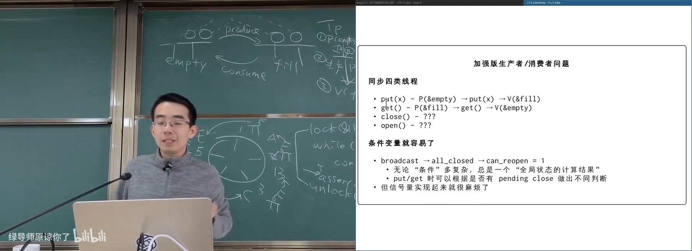

### 5.3 用信号量实现条件变量很困难

*(参考时间: 01:10)*

教科书式伪实现：

```c
void wait(cond_t *cv, mutex_t *mutex) {
    cv->nwait++;
    mutex_unlock(mutex);
    P(&cv->sleep);
    mutex_lock(mutex);
}

void broadcast(cond_t *cv) {
    for (int i = 0; i < cv->nwait; i++) {
        V(&cv->sleep);
    }
    cv->nwait = 0;
}
```

问题在于：

> `unlock(mutex)` 和 `P(cv->sleep)` 之间不是不可分割的。

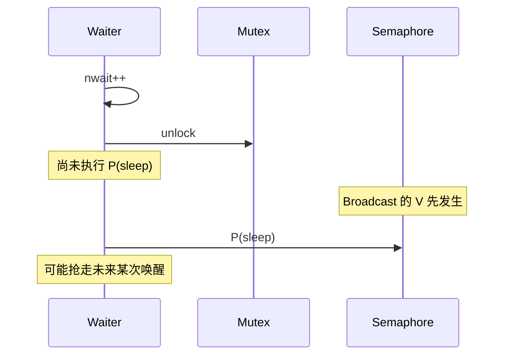
```mermaid
sequenceDiagram
    participant W as Waiter
    participant M as Mutex
    participant S as Semaphore
    W->>W: nwait++
    W->>M: unlock
    Note over W: 尚未执行 P(sleep)
    Note over S: Broadcast 的 V 先发生
    W->>S: P(sleep)
    Note over W: 可能抢走未来某次唤醒
```

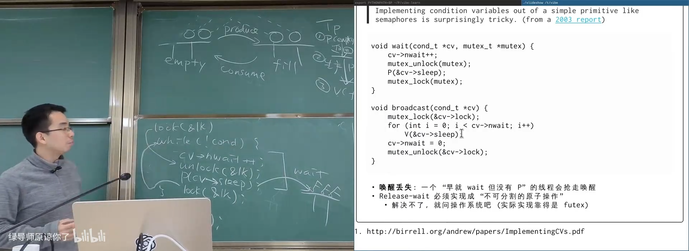

### 5.4 实际实现依赖 futex

条件变量要求：

```text
释放锁 + 睡眠
```

必须原子完成。用户态纯信号量无法保证这一点，操作系统通过 futex 或等价原语提供原子等待。

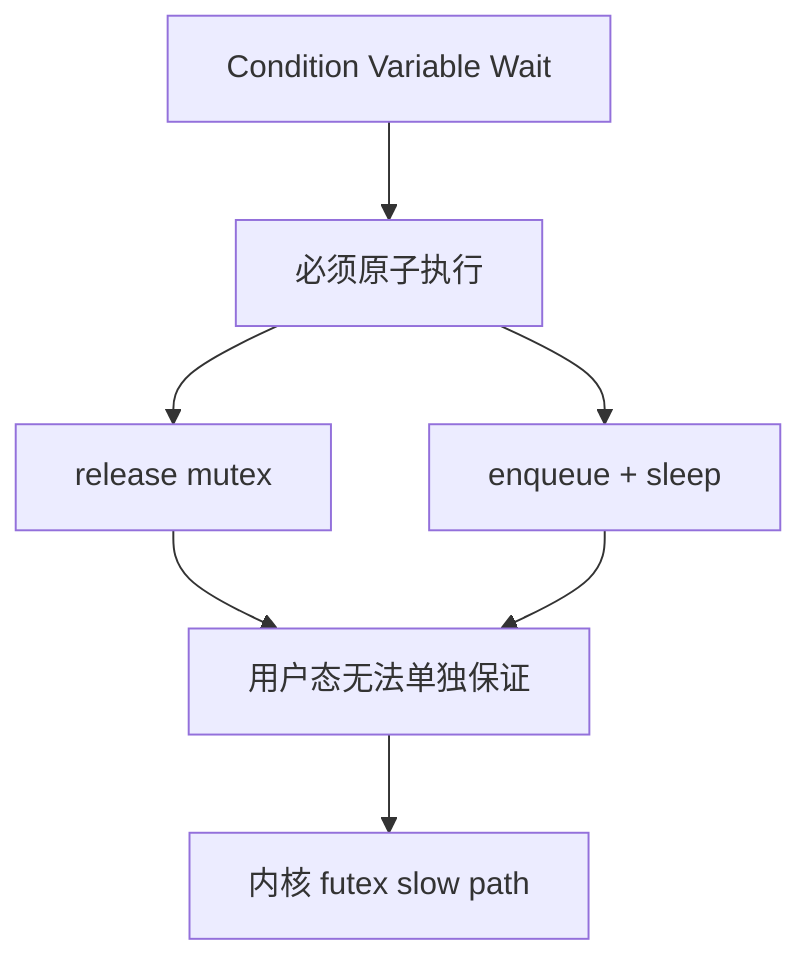
```mermaid
flowchart TD
    A["Condition Variable Wait"] --> B["必须原子执行"]
    B --> C["release mutex"]
    B --> D["enqueue + sleep"]
    C --> E["用户态无法单独保证"]
    D --> E
    E --> F["内核 futex slow path"]
```

---

## 6. 哲学家吃饭问题

### 6.1 问题定义

*(参考时间: 00:48)*

五位哲学家围桌而坐，每人需要同时拿到左右两把叉子才能吃饭。

每个线程：

```c
while (1) {
    think();
    acquire(left);
    acquire(right);
    eat();
    release(right);
    release(left);
}
```

```mermaid
flowchart TD
    P0["Philosopher 0"] --> F0["Fork 0"]
    P0 --> F1["Fork 1"]
    P1["Philosopher 1"] --> F1
    P1 --> F2["Fork 2"]
    P2["Philosopher 2"] --> F2
    P2 --> F3["Fork 3"]
    P3["Philosopher 3"] --> F3
    P3 --> F4["Fork 4"]
    P4["Philosopher 4"] --> F4
    P4 --> F0
```

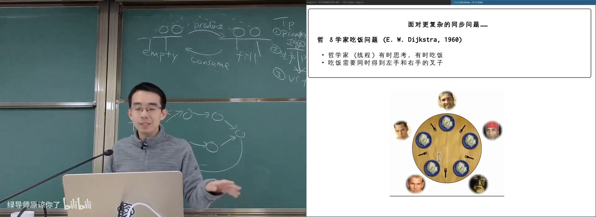

### 6.2 条件变量直接解决

*(参考时间: 00:52)*

每把叉子有可用状态：

```c
bool avail[N];
```

吃饭条件：

```text
avail[left] && avail[right]
```

模板化实现：

```c
mutex_lock(&lk);
while (!(avail[left] && avail[right])) {
    cond_wait(&cv, &lk);
}

avail[left] = false;
avail[right] = false;
mutex_unlock(&lk);

eat();

mutex_lock(&lk);
avail[left] = true;
avail[right] = true;
cond_broadcast(&cv);
mutex_unlock(&lk);
```

```mermaid
flowchart TD
    A["lock 全局状态"] --> B{"左右叉子都可用？"}
    B -- "否" --> C["cond_wait"]
    C --> B
    B -- "是" --> D["同时占用两把叉子"]
    D --> E["吃饭"]
    E --> F["释放两把叉子"]
    F --> G["broadcast"]
    G --> H["unlock"]
```

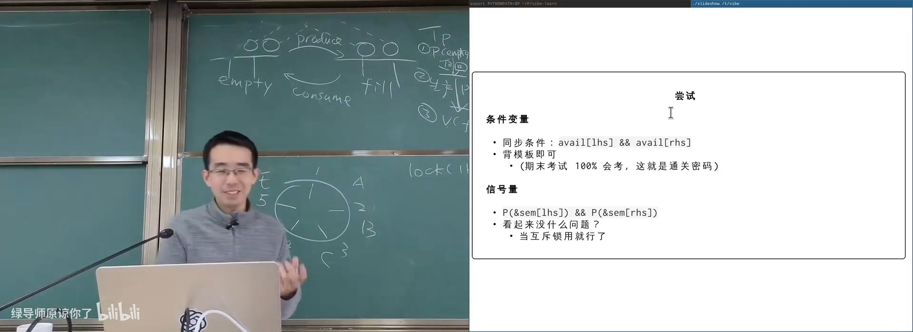

### 6.3 最直接的信号量尝试会死锁

*(参考时间: 00:55)*

把每把叉子建模为一个 `SEM_INIT(1)`：

```c
P(&fork[left]);
P(&fork[right]);
eat();
V(&fork[right]);
V(&fork[left]);
```

如果所有人都先拿左手叉子：

```text
P(left) 全部成功
P(right) 全部等待
```

形成循环等待，系统死锁。

```mermaid
sequenceDiagram
    participant P0
    participant P1
    participant P2
    participant P3
    participant P4
    P0->>P0: take left
    P1->>P1: take left
    P2->>P2: take left
    P3->>P3: take left
    P4->>P4: take left
    Note over P0,P4: 所有人等待右手叉子
```

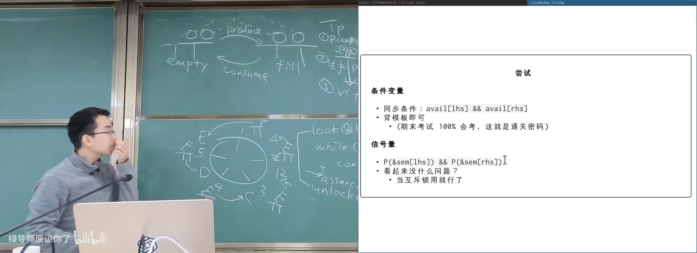

### 6.4 从桌上赶走一个人

*(参考时间: 01:00)*

增加一个初始值为 `N - 1` 的信号量：

```c
sem_t table = SEM_INIT(N - 1);
```

哲学家先 `P(table)` 才能上桌，吃完 `V(table)`。

五人中最多四人同时竞争叉子。四个人最多只可能持有四把左手叉子，剩下至少一把叉子可供某人完成左右配对。

```mermaid
flowchart TD
    A["P(table)：最多 4 人上桌"] --> B["P(left)"]
    B --> C["P(right)"]
    C --> D["吃饭"]
    D --> E["V(right)"]
    E --> F["V(left)"]
    F --> G["V(table)：离桌"]
```


### 6.5 Lock Ordering

*(参考时间: 01:02)*

给叉子编号，所有哲学家总是先拿编号较小的叉子：

```c
int first = min(left, right);
int second = max(left, right);

P(&fork[first]);
P(&fork[second]);
```

这样不会出现所有人沿同一个环方向各持一把叉子的循环。

```mermaid
flowchart LR
    A["Fork 0"] --> B["Fork 1"]
    B --> C["Fork 2"]
    C --> D["Fork 3"]
    D --> E["Fork 4"]
    E --> F["全局顺序"]
    F --> G["所有线程按相同顺序申请"]
    G --> H["避免循环等待"]
```

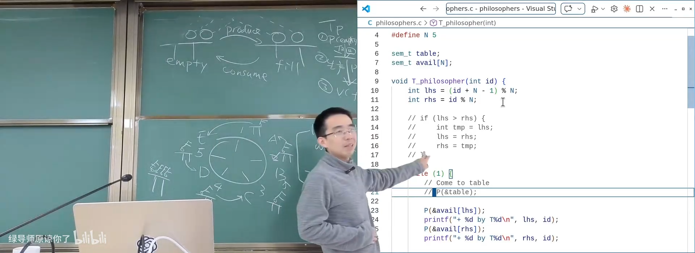

### 6.6 Workaround 不是通用同步

*(参考时间: 01:04)*

两种解决方式都可用，但正确性依赖额外证明：

- 桌上最多四人；
- 叉子全序和 lock ordering。

如果需求变成“哲学家可以申请任意一组叉子”，计数技巧就不再直接适用。条件变量仍只需写出：

```text
所有需要的叉子都 available
```

```mermaid
flowchart TD
    A["固定左右叉子"] --> B["计数 workaround 可用"]
    C["任意叉子集合"] --> D["计数方案失去通用性"]
    D --> E["条件变量仍可直接检查全局条件"]
```

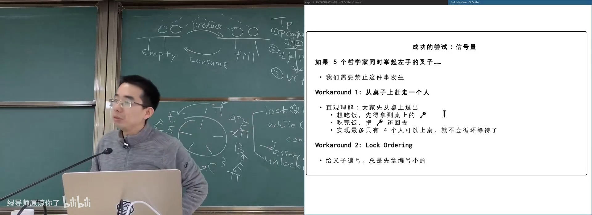

---

## 7. 用 waiter 线程统一管理复杂同步

### 7.1 把所有请求集中给一个调度者

*(参考时间: 01:17)*

如果多个信号量互相协调很难，可以引入一个 **waiter / scheduler** 线程：

- 所有哲学家只向 waiter 发请求；
- 叉子等全局资源由 waiter 持有；
- waiter 串行检查全局状态并决定谁可以继续；
- 请求队列本身是生产者消费者问题。

```mermaid
flowchart TD
    P0["Philosopher 0"] --> Q["Request Queue"]
    P1["Philosopher 1"] --> Q
    P2["Philosopher 2"] --> Q
    Q --> W["Waiter Thread"]
    W --> S["串行检查全局叉子状态"]
    S --> G0["Reply / Permission 0"]
    S --> G1["Reply / Permission 1"]
    S --> G2["Reply / Permission 2"]
```

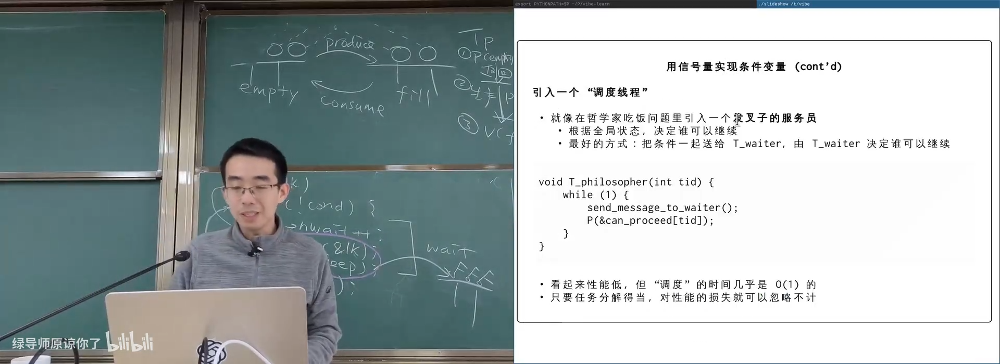

### 7.2 请求与许可仍然是信号量

哲学家发送请求后：

```c
send_request(tid, needed_forks);
P(&permission[tid]);
```

waiter 处理完：

```c
if (can_grant(request)) {
    grant_forks(request);
    V(&permission[request.tid]);
}
```

```mermaid
sequenceDiagram
    participant P as Philosopher
    participant Q as Queue
    participant W as Waiter
    P->>Q: request forks
    W->>Q: consume request
    W->>W: check global state
    W->>P: V(permission)
    P->>P: continue eating
```

### 7.3 集中调度可以加入策略

*(参考时间: 01:21)*

waiter 拥有全局信息，因此可以实现：

- 公平性；
- 防止饥饿；
- 控制每个哲学家的吃饭频率；
- load balancing；
- 超时与优先级。

```mermaid
flowchart TD
    A["Waiter 全局状态"] --> B["记录请求时间"]
    A --> C["记录持有资源"]
    A --> D["记录历史授予次数"]
    B --> E["公平策略"]
    C --> E
    D --> E
    E --> F["选择下一个可继续线程"]
```

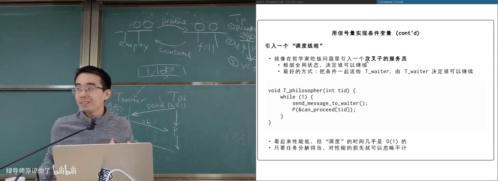

### 7.4 性能开销

调度决策通常是对哈希表或小数据结构的 O(1) 检查，只需几纳秒到很短时间；而真实任务可能执行数毫秒到数秒。

如果单 waiter 成为瓶颈，可以：

- 使用多个 waiter；
- 按资源分片；
- 将任务切得更细；
- 只把复杂同步交给全局调度者。

```mermaid
flowchart LR
    A["复杂同步"] --> B["集中 waiter"]
    B --> C["逻辑串行、易证明"]
    C --> D["任务粒度足够大"]
    D --> E["调度开销可忽略"]
    E --> F["必要时分片多个 waiter"]
```

---

## 8. 信号量与条件变量的选择

### 8.1 信号量适合的场景

*(参考时间: 01:24)*

信号量非常适合：

- 互斥锁；
- 一次性的 `A → B`；
- 计数型资源上限；
- `join`；
- DAG 依赖计数；
- 标准生产者消费者；
- 固定协议的请求 / 许可。

```mermaid
flowchart TD
    A["Semaphore 适合"] --> B["Mutex"]
    A --> C["One-shot happens-before"]
    A --> D["Counted resource"]
    A --> E["Join / DAG"]
    A --> F["Producer-Consumer"]
```

### 8.2 条件变量适合的场景

*(参考时间: 01:06)*

条件变量适合：

- 任意全局状态条件；
- 包含 AND / OR 的复杂布尔表达式；
- close/open 等生命周期；
- 任意资源集合请求；
- 无法用单一计数表示的问题。

```mermaid
flowchart TD
    A["Condition Variable 适合"] --> B["任意布尔条件"]
    A --> C["OR 条件"]
    A --> D["close / open"]
    A --> E["任意资源集合"]
    A --> F["动态复杂状态"]
```

### 8.3 优先保证正确性

*(参考时间: 01:24)*

系统实现先要正确，再优化：

1. 先写清同步条件；
2. 条件变量模板直接给出可证明实现；
3. 如果问题天然符合计数模型，再换成信号量；
4. 只有确认瓶颈后再降低唤醒范围和优化调度。

```mermaid
flowchart LR
    A["写清同步条件"] --> B["用万能条件变量保证正确"]
    B --> C{"存在自然计数模型？"}
    C -- "是" --> D["改写为信号量，简化代码"]
    C -- "否" --> E["保留条件变量或 waiter"]
    D --> F["压力测试与性能分析"]
    E --> F
```

---

## 9. 总结：信号量是计数资源的漂亮抽象

这一讲从计算图出发，得到了完整信号量知识体系：

- 跨线程传递 token 可以建立 happens-before；
- 互斥锁是计数为 1 的信号量；
- 信号量计数表示剩余车位、手环或许可；
- `P` 消耗 token，`V` 产生 token；
- 一次 `A → B` 可以用 `SEM_INIT(0)` 实现；
- `join` 可以用每线程一个信号量，也可以共用一个计数信号量；
- DAG 可以为每条边或每个节点维护计数；
- 生产者消费者用 `empty` / `fill` 两表搬运 token；
- token 总量满足缓冲区不变量；
- 复杂 OR 条件、close/open 和任意资源集合更难用信号量表达；
- 哲学家吃饭问题暴露了循环等待与死锁；
- 可增加 `table` 计数或使用 lock ordering 解决，但缺少通用性；
- 用信号量实现条件变量会遇到释放锁与睡眠之间的唤醒丢失；
- 实际条件变量依赖 futex 等原子等待；
- waiter / scheduler 线程可以把任意复杂同步转化为请求-许可的生产者消费者；
- 最终应优先保证正确性，再根据 workload 优化。

```mermaid
flowchart LR
    A["一把钥匙"] --> B["多个 token"]
    B --> C["Semaphore"]
    C --> D["互斥 / 同步 / 限流"]
    D --> E["Producer-Consumer"]
    E --> F["Complex limits"]
    F --> G["Condition Variable / Waiter"]
```

最重要的结论是：

> 信号量很优雅，但不是万能同步原语。真正关键的是理解线程继续执行的全局条件；条件变量可以表达任意条件，信号量则适合其中的计数型特例。

---

## 附：官方参考与延伸阅读

以下链接来自官方讲义第 16 讲及课堂内容：

- [使用互斥锁实现计算图](https://jyywiki.cn/OS/demos/concurrency/cgraph-mutex)
- [使用信号量实现 join](https://jyywiki.cn/OS/demos/concurrency/join-sem)
- [使用信号量实现计算图](https://jyywiki.cn/OS/demos/concurrency/cgraph-sem)
- [使用信号量实现生产者消费者](https://jyywiki.cn/OS/demos/concurrency/pc-sem)
- [哲学家吃饭问题](https://jyywiki.cn/OS/demos/concurrency/philosophers)
- [Implementing Condition Variables with Semaphores](http://birrell.org/andrew/papers/ImplementingCVs.pdf)

阅读材料：

- *Operating Systems: Three Easy Pieces* 第 31 章，Semaphores。

官方课程资料：

- [课程主页](https://jyywiki.cn/OS/2026/)
- [第 16 讲讲义：并发控制：同步 (2)](https://jyywiki.cn/OS/2026/lect16.md)
- [视频：16 - 并发控制：信号量](https://www.bilibili.com/video/BV1yQogB2Esf/)

> **版权与署名**：本讲课程材料由蒋炎岩（jyy）编写。课程讲义与幻灯片采用 [Creative Commons BY-NC 4.0](http://creativecommons.org/licenses/by-nc/4.0/) 许可；本电子书保留课程出处、作者署名与许可说明。
