# 并发 Bugs 和应对：从死锁到原子性与顺序违反

> **课程**：2026 春季学期《操作系统原理》  
> **讲师**：蒋炎岩（jyy）  
> **官方课程主页**：<https://jyywiki.cn/OS/2026/>  
> **官方讲义**：<https://jyywiki.cn/OS/2026/lect17.md>  
> **视频来源**：[Bilibili BV1Jg96BjE68](https://www.bilibili.com/video/BV1Jg96BjE68/)  
> **版权说明**：课程讲义与幻灯片归蒋炎岩所有，采用 [Creative Commons BY-NC 4.0](http://creativecommons.org/licenses/by-nc/4.0/) 许可；本电子书是对课堂讲授的书面化重构，保留出处与许可说明。

## 导语：人类是顺序的生物

*(参考时间: 00:00)*

并发编程真正困难的地方，不只在于语法，而在于我们理解世界的方式：

- 人生活在物理世界，只能直接观察自己的局部视角；
- 编程语言最初教给我们的也是顺序执行；
- 函数调用天然带有“交给它，最终会完整返回”的直觉；
- 于是我们很容易把并发程序误当成多个顺序程序简单拼接。

但并发执行的状态空间是指数级的。理解一个并发程序的全部行为，可能等价于枚举数量庞大的线程交错。

这一讲采用“从错误中学习”的方法，系统归纳真实世界中的并发 bug：

- 死锁；
- 数据竞争；
- 原子性违反；
- 顺序违反；
- 检查时刻与使用时刻不一致；
- 并发释放后使用；
- 投机执行引发的新型安全问题。

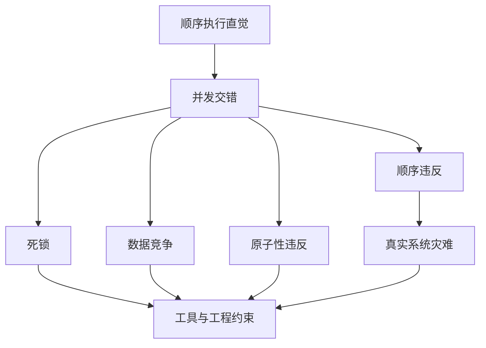
```mermaid
flowchart TD
    A["顺序执行直觉"] --> B["并发交错"]
    B --> C["死锁"]
    B --> D["数据竞争"]
    B --> E["原子性违反"]
    B --> F["顺序违反"]
    F --> G["真实系统灾难"]
    C --> H["工具与工程约束"]
    D --> H
    E --> H
    G --> H
```

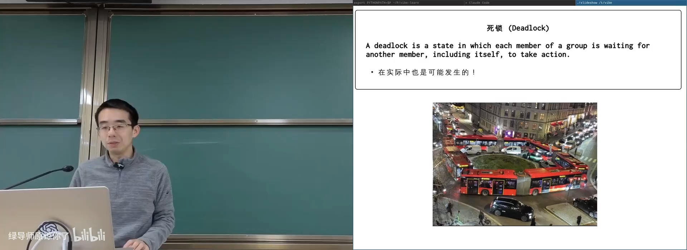

---

## 1. 死锁：互相等待

### 1.1 定义

*(参考时间: 00:03)*

死锁是：

> 一组执行者中的每一个都在等待另一个成员采取行动，甚至可能等待自己。

现实世界也可能发生：

- 车辆首尾相连围成环，所有车都无法前进；
- 两个人分别要求对方先让路；
- 线程 A 等待线程 B，B 又等待 A。

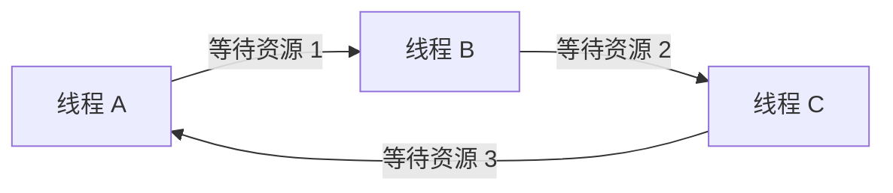
```mermaid
flowchart LR
    A["线程 A"] -->|"等待资源 1"| B["线程 B"]
    B -->|"等待资源 2"| C["线程 C"]
    C -->|"等待资源 3"| A
```

### 1.2 AA 型死锁

*(参考时间: 00:04)*

同一线程对不可重入 mutex 连续上锁两次：

```c
mutex_lock(&A);
mutex_lock(&A);  /* 永久阻塞 */
sum++;
mutex_unlock(&A);
mutex_unlock(&A);
```

POSIX mutex 默认不是递归锁：

```c
lock(A)
lock(A)   /* 等待自己释放 A */
```

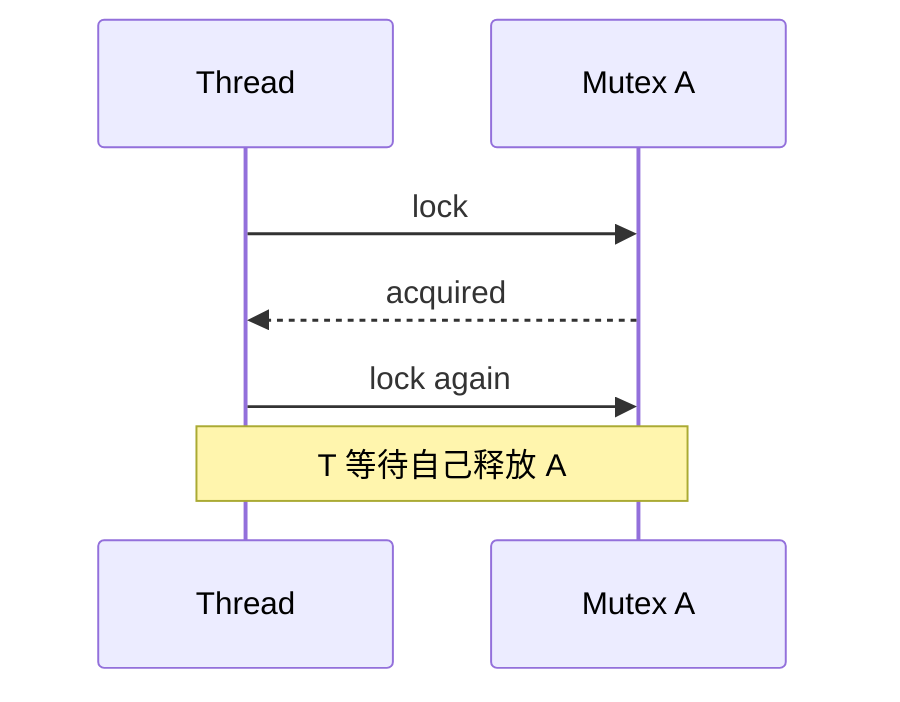
```mermaid
sequenceDiagram
    participant T as Thread
    participant L as Mutex A
    T->>L: lock
    L-->>T: acquired
    T->>L: lock again
    Note over T,L: T 等待自己释放 A
```

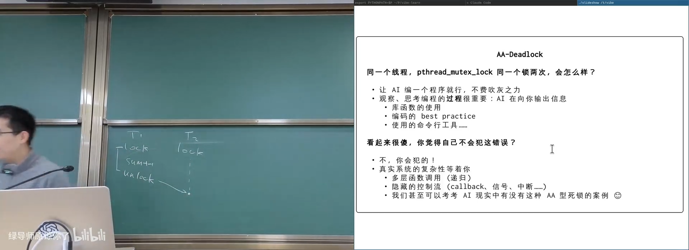

### 1.3 AA 死锁为什么在真实系统里很常见

*(参考时间: 00:05)*

看似简单的错误，在大型系统中可能通过以下方式发生：

- 多层函数调用；
- 递归；
- callback；
- 信号处理；
- 中断处理；
- 异步事件；
- 某个函数被复用时带上隐藏的锁假设。

例如：

```c
void cb(void) {
    lock(&A);
    /* callback 中调用了另一个同样 lock(A) 的函数 */
}
```

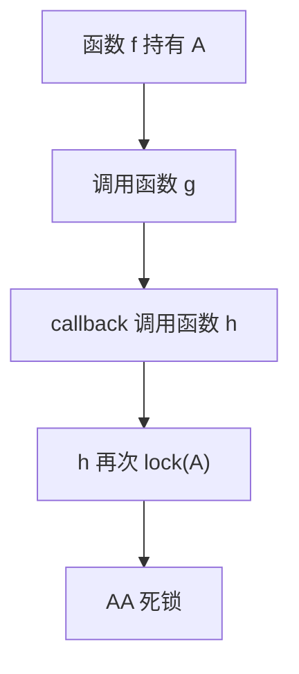
```mermaid
flowchart TD
    A["函数 f 持有 A"] --> B["调用函数 g"]
    B --> C["callback 调用函数 h"]
    C --> D["h 再次 lock(A)"]
    D --> E["AA 死锁"]
```

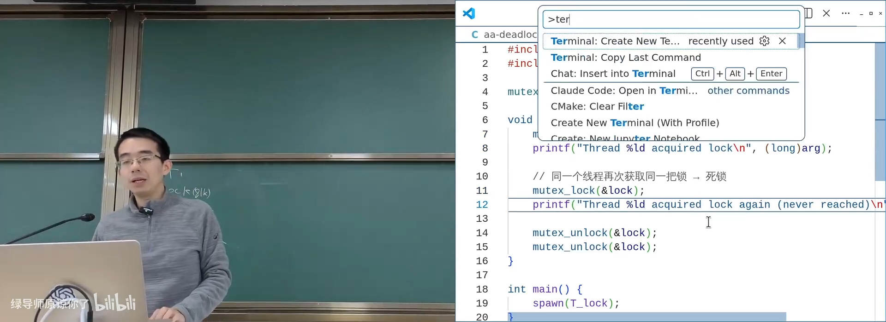

### 1.4 ABBA 死锁

*(参考时间: 00:10)*

线程 1：

```c
lock(A);
lock(B);
```

线程 2：

```c
lock(B);
lock(A);
```

若两个线程各拿到第一把锁，就形成循环等待：

```text
T1 持有 A，等待 B
T2 持有 B，等待 A
```

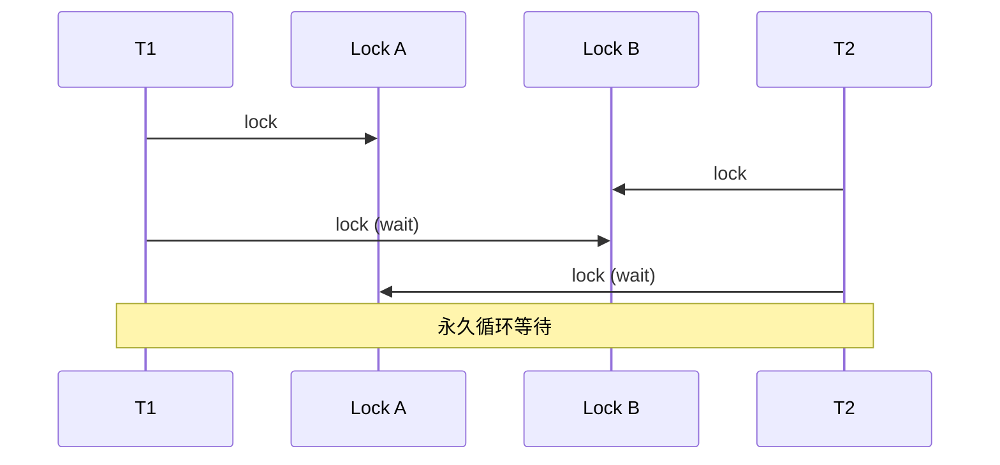
```mermaid
sequenceDiagram
    participant T1
    participant A as Lock A
    participant B as Lock B
    participant T2
    T1->>A: lock
    T2->>B: lock
    T1->>B: lock (wait)
    T2->>A: lock (wait)
    Note over T1,T2: 永久循环等待
```

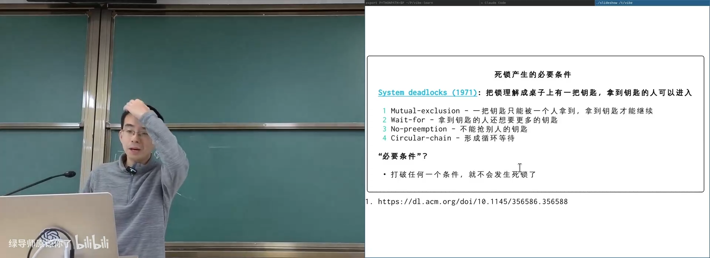

### 1.5 死锁较容易观察

*(参考时间: 00:11)*

死锁的症状通常很明显：

- 程序原应持续输出，却突然完全静止；
- GDB 可以附加并查看所有阻塞线程；
- 每个线程的调用栈都停在某个锁等待位置；
- 不退出、不消费 CPU、也不完成工作。

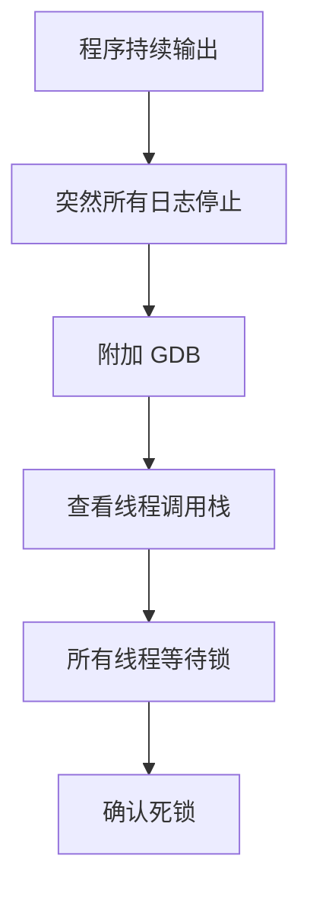
```mermaid
flowchart TD
    A["程序持续输出"] --> B["突然所有日志停止"]
    B --> C["附加 GDB"]
    C --> D["查看线程调用栈"]
    D --> E["所有线程等待锁"]
    E --> F["确认死锁"]
```

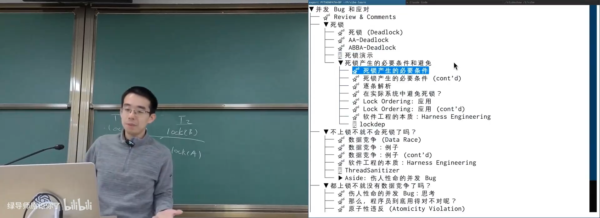

---

## 2. 死锁的四个必要条件

### 2.1 1971 年的经典分析

*(参考时间: 00:13)*

经典论文 [System Deadlocks](https://dl.acm.org/doi/10.1145/356586.356588) 把锁建模成桌上的钥匙。

死锁的四个必要条件：

1. **Mutual Exclusion**：一把钥匙同时只能被一个执行者持有；
2. **Wait-For**：持钥匙的人还想要更多钥匙；
3. **No Preemption**：不能强行夺走别人手中的钥匙；
4. **Circular Chain**：形成循环等待。

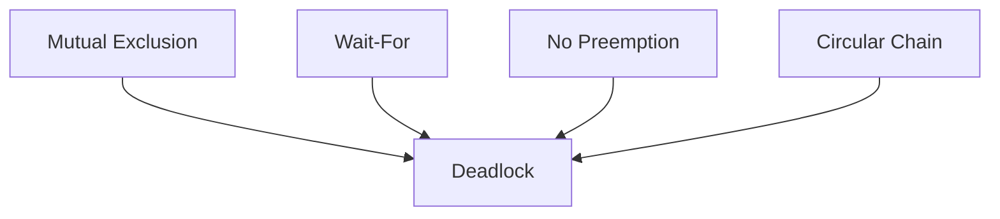
```mermaid
flowchart TD
    A["Mutual Exclusion"] --> D["Deadlock"]
    B["Wait-For"] --> D
    C["No Preemption"] --> D
    E["Circular Chain"] --> D
```

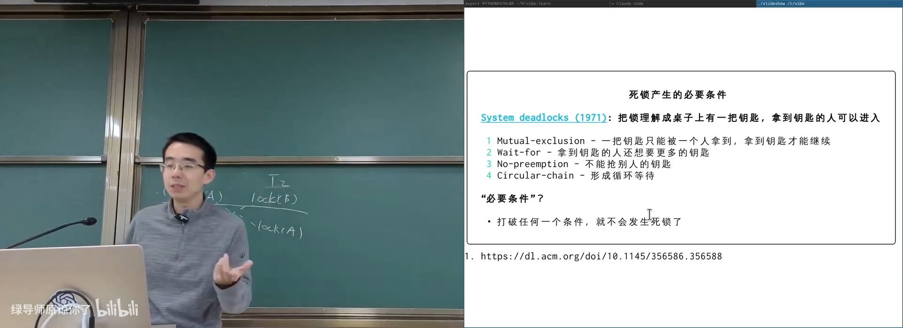

### 2.2 打破互斥

*(参考时间: 00:18)*

打破互斥意味着不再使用“一把钥匙只给一个线程”的锁模型。

替代方案：

- `send` / `receive` 消息；
- waiter / scheduler；
- actor 或 master-worker；
- 把共享资源集中到单一管理者。

但这需要架构级重构，因为锁语义本身就是互斥。


```mermaid
flowchart LR
    A["共享锁模型"] --> B["send / receive"]
    B --> C["集中式 waiter"]
    C --> D["不再由所有线程直接竞争锁"]
    D --> E["避免循环持锁"]
```

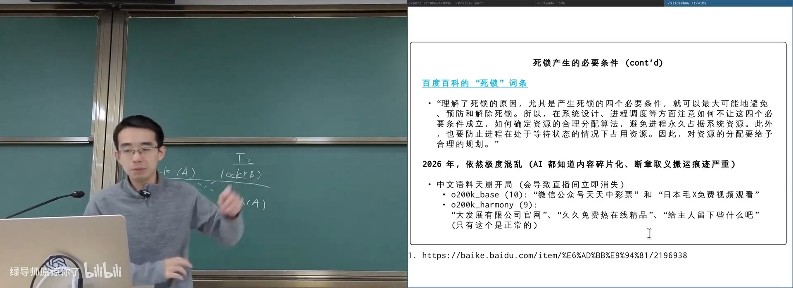

### 2.3 打破 Wait-For

*(参考时间: 00:19)*

常见方案是“一把大锁保平安”：

- 线程最多只持有一把全局锁；
- 不再持有锁后申请另一把锁；
- 因此不会形成多锁依赖环。

代价是并发度大幅下降。

更理想的方案是硬件事务内存：

```text
atomic {
    check condition;
    modify multiple objects;
}
```

但系统调用无法轻易回滚，事务内存实现极其困难。

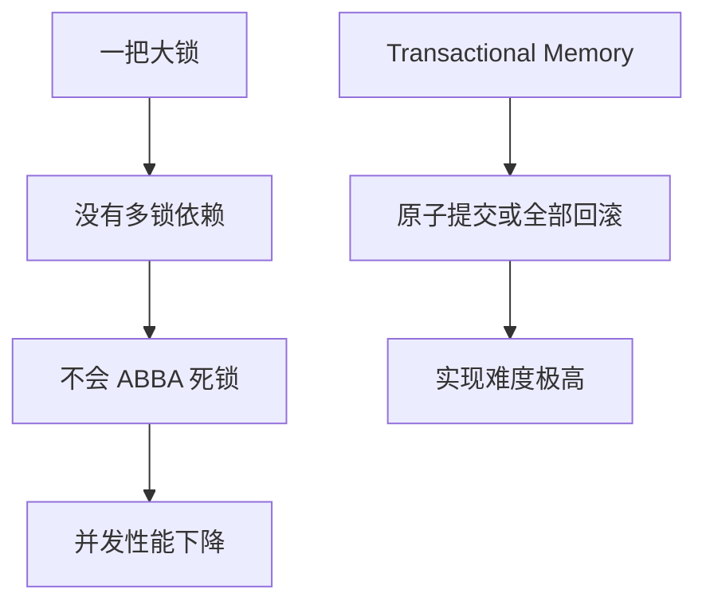
```mermaid
flowchart TD
    A["一把大锁"] --> B["没有多锁依赖"]
    B --> C["不会 ABBA 死锁"]
    C --> D["并发性能下降"]
    E["Transactional Memory"] --> F["原子提交或全部回滚"]
    F --> G["实现难度极高"]
```

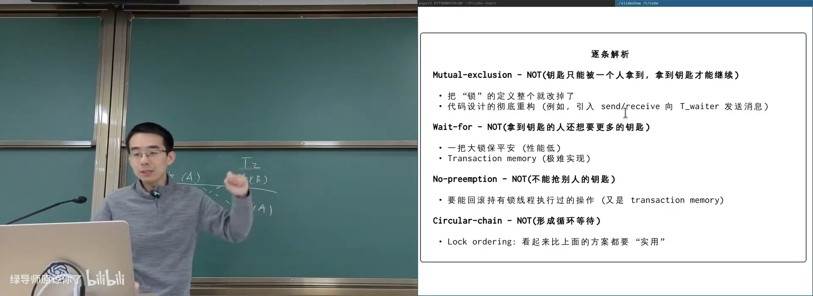

### 2.4 打破 No Preemption

*(参考时间: 00:22)*

若要抢占别人已持有的锁，必须能回滚该线程已经产生的副作用：

- 已修改的内存；
- 已写入的文件；
- 已发送的消息；
- 已执行的外部系统调用。

这又回到事务内存问题，且外部副作用往往不可逆。

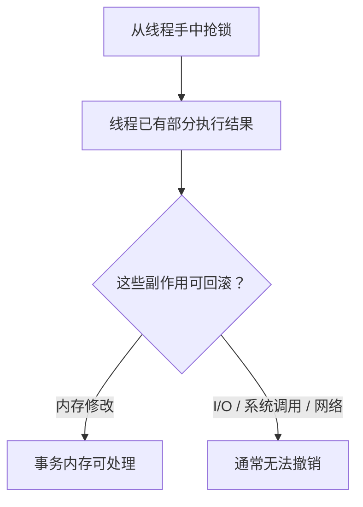
```mermaid
flowchart TD
    A["从线程手中抢锁"] --> B["线程已有部分执行结果"]
    B --> C{"这些副作用可回滚？"}
    C -- "内存修改" --> D["事务内存可处理"]
    C -- "I/O / 系统调用 / 网络" --> E["通常无法撤销"]
```

### 2.5 打破循环等待：Lock Ordering

*(参考时间: 00:24)*

最实用的方案是给所有锁编号：

> 任意线程只能按锁编号从小到大获取锁。

证明思路：

- 任意时刻至少有一个线程持有当前最大编号的锁；
- 该线程之后只会申请更大编号的锁；
- 但已经没有更大的锁被其他线程持有；
- 因此它总能继续并最终释放锁；
- 系统不会所有线程都相互等待。

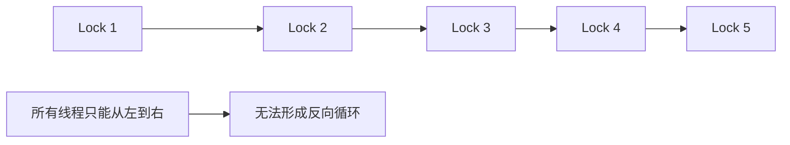
```mermaid
flowchart LR
    A["Lock 1"] --> B["Lock 2"]
    B --> C["Lock 3"]
    C --> D["Lock 4"]
    D --> E["Lock 5"]
    F["所有线程只能从左到右"] --> G["无法形成反向循环"]
```

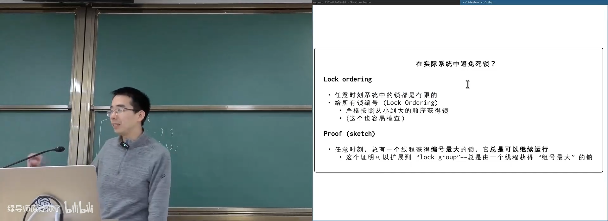

### 2.6 Lock Group

*(参考时间: 00:26)*

如果一组锁必须一起获取，可以把整组视为更大粒度的锁：

```text
group 1 → group 2 → group 3
```

组内可以获得多次锁，但组与组之间仍按编号顺序。

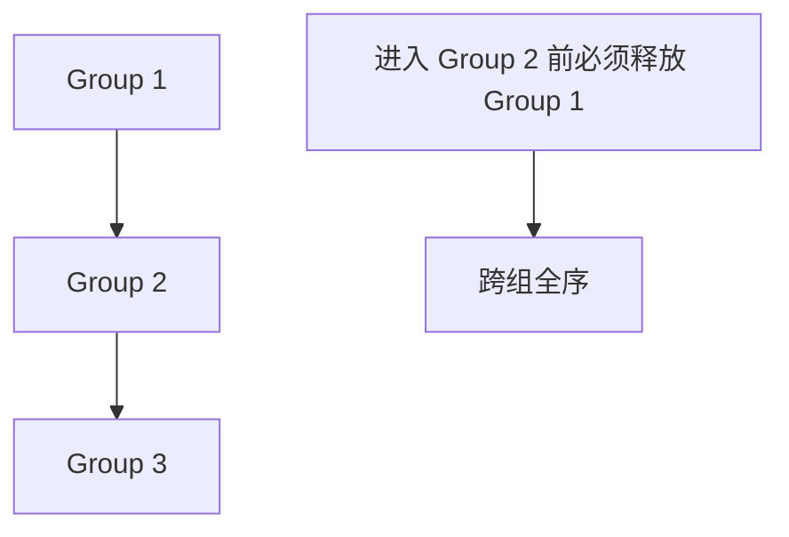
```mermaid
flowchart TD
    A["Group 1"] --> B["Group 2"]
    B --> C["Group 3"]
    D["进入 Group 2 前必须释放 Group 1"] --> E["跨组全序"]
```

---

## 3. Lock Ordering 的工程现实

### 3.1 Linux 内核锁顺序文档

*(参考时间: 00:27)*

Linux 内核在复杂子系统，例如内存管理中，会明确写出锁的获取顺序。

```text
lock A
  → lock B
    → lock C
```

违反顺序通常意味着潜在死锁。

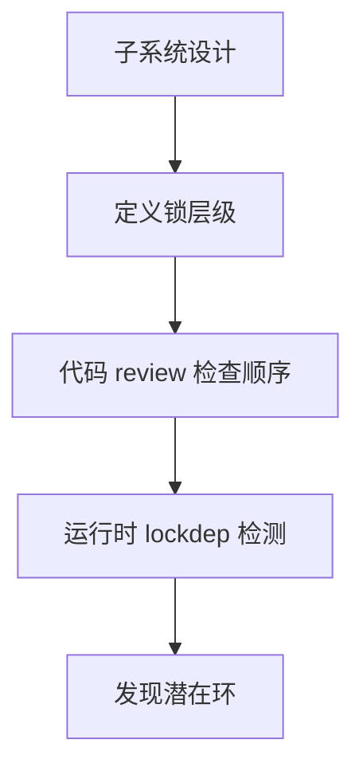
```mermaid
flowchart TD
    A["子系统设计"] --> B["定义锁层级"]
    B --> C["代码 review 检查顺序"]
    C --> D["运行时 lockdep 检测"]
    D --> E["发现潜在环"]
```

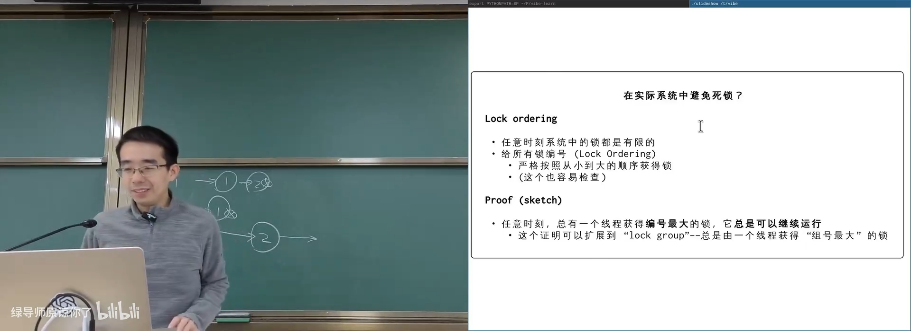

### 3.2 为什么“按顺序上锁”依然难

*(参考时间: 00:28)*

内核文档指出：

- 新锁很难插进已有数千个锁的层级；
- 锁暴露给太多模块时，顺序约束非常脆弱；
- 最好的锁应当被封装，只在自己文件内使用；
- 持锁时不要调用不熟悉的复杂函数。

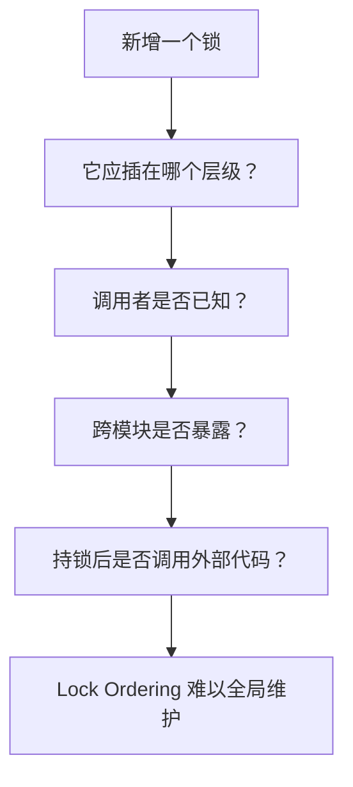
```mermaid
flowchart TD
    A["新增一个锁"] --> B["它应插在哪个层级？"]
    B --> C["调用者是否已知？"]
    C --> D["跨模块是否暴露？"]
    D --> E["持锁后是否调用外部代码？"]
    E --> F["Lock Ordering 难以全局维护"]
```

### 3.3 文档常常与实现不一致

*(参考时间: 00:29)*

实证研究发现，只有约 53% 有文档锁规则的变量，在所有访问点都真正遵守了规则。

原因：

- 程序员上下文有限；
- 修改代码后忘记同步注释；
- 锁规则散落在多个文件；
- 模块间接口不断演进。

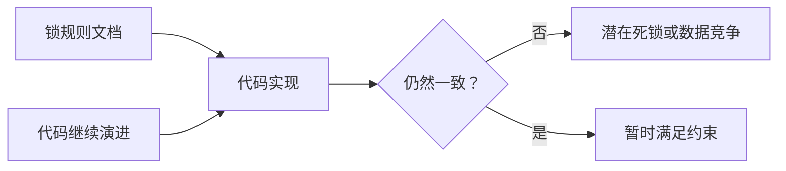
```mermaid
flowchart LR
    A["锁规则文档"] --> B["代码实现"]
    B --> C{"仍然一致？"}
    C -- "否" --> D["潜在死锁或数据竞争"]
    C -- "是" --> E["暂时满足约束"]
    F["代码继续演进"] --> B
```

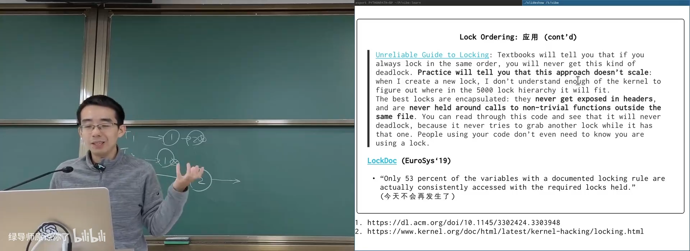

### 3.4 Harness Engineering

*(参考时间: 00:30)*

软件工程应当“做最坏的假设”：

- 假设程序员会忘了解锁；
- 假设罕见路径会写错；
- 假设旧文档已经过时；
- 假设测试无法覆盖全部交错；
- 假设 AI 也可能生成错误并发代码。

对策是工程约束、运行时检查与自动化审计。

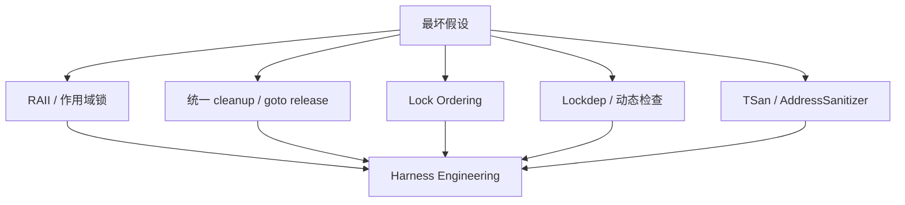
```mermaid
flowchart TD
    A["最坏假设"] --> B["RAII / 作用域锁"]
    A --> C["统一 cleanup / goto release"]
    A --> D["Lock Ordering"]
    A --> E["Lockdep / 动态检查"]
    A --> F["TSan / AddressSanitizer"]
    B --> G["Harness Engineering"]
    C --> G
    D --> G
    E --> G
    F --> G
```

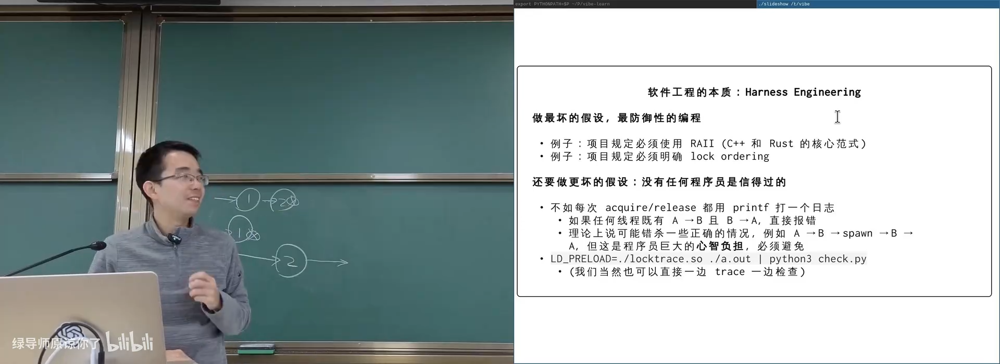

### 3.5 RAII 与 goto cleanup

*(参考时间: 00:32)*

C++ / Rust 可以用作用域对象保证释放：

```cpp
{
    std::lock_guard<std::mutex> guard(lock);
    /* leaving scope unlocks automatically */
}
```

C 中常见：

```c
int f(void) {
    Resource *r = acquire();
    if (!r) {
        goto cleanup;
    }

    if (operation_failed(r)) {
        goto cleanup;
    }

cleanup:
    release(r);
    return result;
}
```

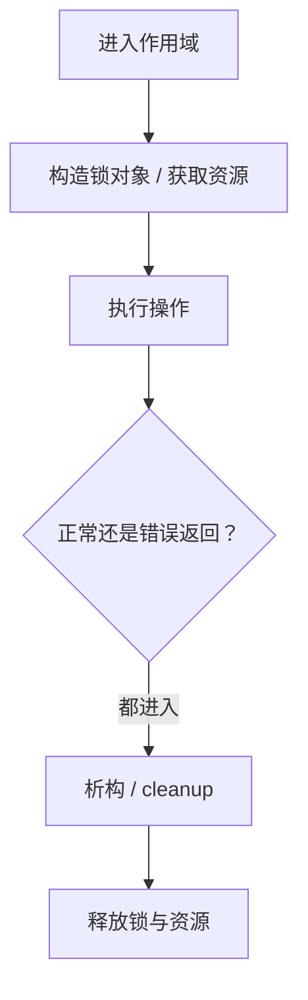
```mermaid
flowchart TD
    A["进入作用域"] --> B["构造锁对象 / 获取资源"]
    B --> C["执行操作"]
    C --> D{"正常还是错误返回？"}
    D -- "都进入" --> E["析构 / cleanup"]
    E --> F["释放锁与资源"]
```

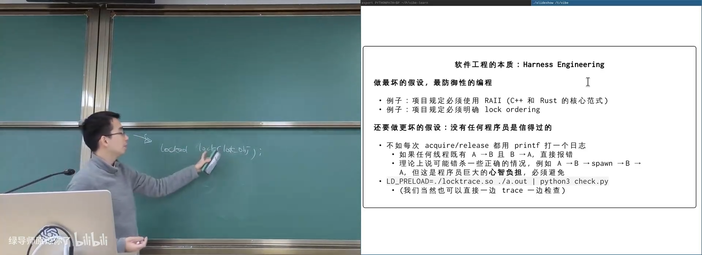

---

## 4. Lockdep：用动态依赖图发现潜在死锁

### 4.1 记录锁依赖

*(参考时间: 00:37)*

每当一个线程已持有某些锁，再申请新锁时，记录有向边：

```text
X → Y
```

表示存在“先拿 X，再拿 Y”的路径。

如果新增边让锁依赖图形成环，就报告潜在 ABBA 死锁。

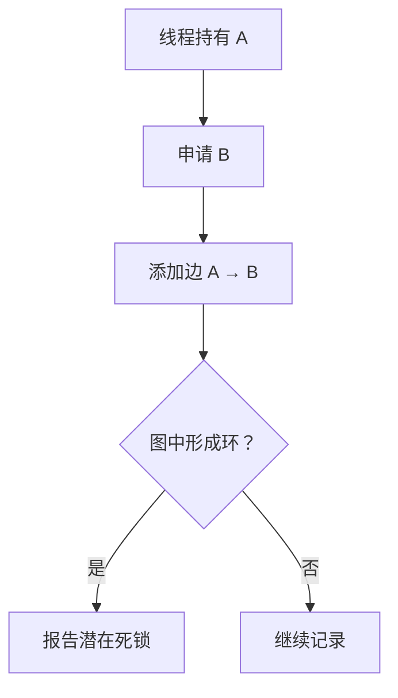
```mermaid
flowchart TD
    A["线程持有 A"] --> B["申请 B"]
    B --> C["添加边 A → B"]
    C --> D{"图中形成环？"}
    D -- "是" --> E["报告潜在死锁"]
    D -- "否" --> F["继续记录"]
```

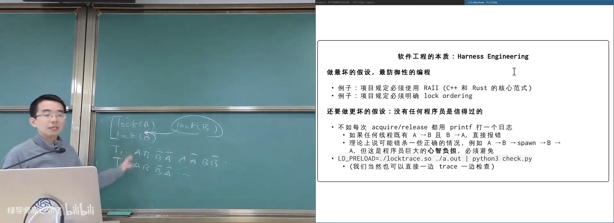

### 4.2 `LD_PRELOAD` 拦截

*(参考时间: 00:38)*

可以通过 `LD_PRELOAD` 覆盖：

```c
pthread_mutex_lock
pthread_mutex_unlock
```

记录调用并更新依赖图：

```bash
LD_PRELOAD=./locktrace.so ./a.out
```

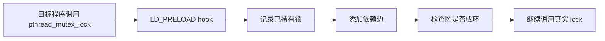
```mermaid
flowchart LR
    A["目标程序调用 pthread_mutex_lock"] --> B["LD_PRELOAD hook"]
    B --> C["记录已持有锁"]
    C --> D["添加依赖边"]
    D --> E["检查图是否成环"]
    E --> F["继续调用真实 lock"]
```


### 4.3 罕见路径也能被发现

*(参考时间: 00:40)*

传统压力测试可能运行百万次仍未触发死锁，因为某条锁顺序只在极罕见路径出现。

Lockdep 关注的是“锁顺序关系”，而不是必须真的发生阻塞。因此可以更早报告潜在环。

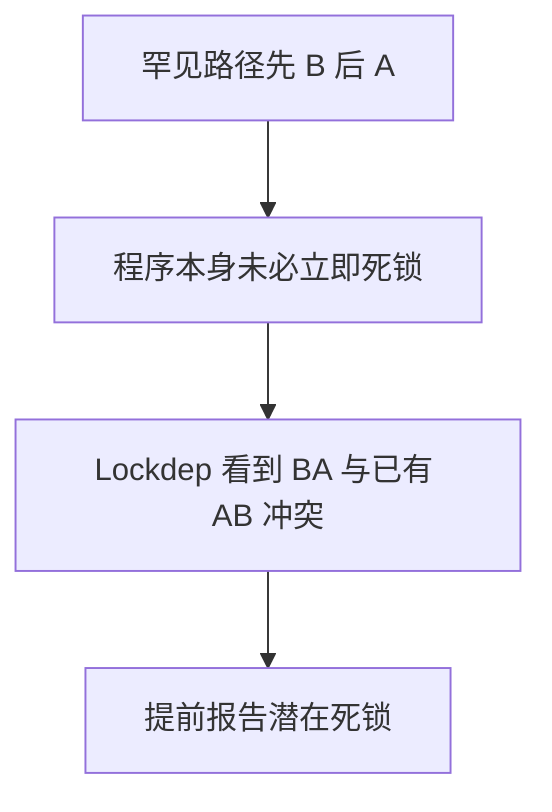
```mermaid
flowchart TD
    A["罕见路径先 B 后 A"] --> B["程序本身未必立即死锁"]
    B --> C["Lockdep 看到 BA 与已有 AB 冲突"]
    C --> D["提前报告潜在死锁"]
```

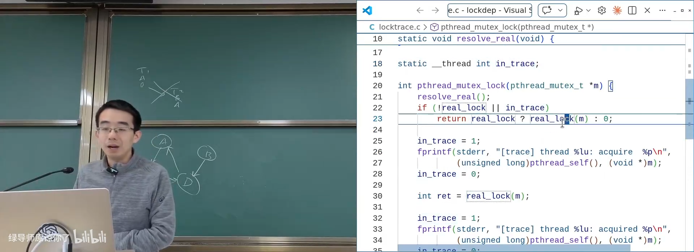

---

## 5. 数据竞争

### 5.1 定义

*(参考时间: 00:42)*

数据竞争指：

> 两个不同线程访问同一内存位置，至少一个访问是写，而且两个访问之间没有 happens-before 关系。

```mermaid
flowchart TD
    A["两个线程"] --> B["同一内存"]
    B --> C{"至少一个是写？"}
    C -- "否" --> D["只读，没有数据竞争"]
    C -- "是" --> E{"存在 happens-before？"}
    E -- "是" --> F["同步正确，无竞争"]
    E -- "否" --> G["Data Race"]
```


### 5.2 为什么至少需要一个写

*(参考时间: 00:43)*

两个纯读之间：

```text
T1: read X
T2: read X
```

如果此前没有写，二者读到相同结果，不产生新状态。

加入写以后：

```text
T1: write X
T2: read X
```

读取到新值还是旧值取决于线程速度，程序变得非确定。

```mermaid
sequenceDiagram
    participant T1
    participant X
    participant T2
    T1->>X: store 1
    T2->>X: load
    Note over T2: 可能读到 0，也可能读到 1
```

### 5.3 C/C++ 中数据竞争是 undefined behavior

*(参考时间: 00:44)*

这不是“结果不确定”这么简单。

在 C/C++ 中，发生 data race 的程序整体进入 undefined behavior：

- 编译器优化不再有义务保持预期语义；
- 内存可能损坏；
- 控制流可能被劫持；
- 安全边界可能被突破；
- 理论上可产生任意后果。

Java 等语言尝试通过内存模型给竞争行为定义最低保证。

```mermaid
flowchart LR
    A["C/C++ Data Race"] --> B["Undefined Behavior"]
    B --> C["编译器自由优化"]
    B --> D["内存损坏"]
    B --> E["控制流劫持"]
    B --> F["安全漏洞"]
```

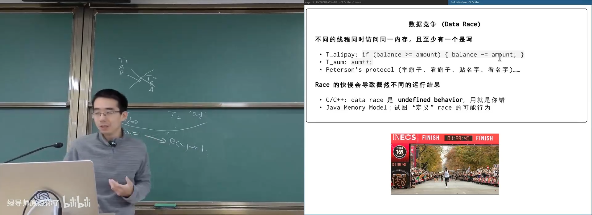

### 5.4 最常见的两种错误

*(参考时间: 00:47)*

**上错锁：**

```c
T1: lock(A); sum++; unlock(A);
T2: lock(B); sum++; unlock(B);
```

**漏上锁：**

```c
T1: lock(A); sum++; unlock(A);
T2:          sum++;
```

```mermaid
flowchart TD
    A["共享数据保护错误"] --> B["不同锁保护同一变量"]
    A --> C["某条路径忘记加锁"]
    B --> D["无共同 happens-before"]
    C --> D
    D --> E["Data Race"]
```

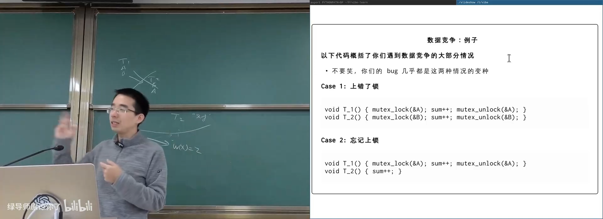

### 5.5 数据竞争比看起来复杂

*(参考时间: 00:49)*

“内存”可以是：

- 全局变量；
- 堆对象；
- 栈；
- 内核结构；
- 库函数内部状态。

“访问”可能发生在：

- 自己写的 C 代码；
- 汇编；
- 库函数；
- 操作系统；
- 一条 `ret` 指令间接访问的栈。

课程曾出现一个经典栈竞争：线程已被调度到另一个 CPU，但原 CPU 仍借用它的栈执行中断返回，导致两个 CPU 同时访问同一栈。

该问题最终推动了 Read-Copy-Update（RCU）相关思路的发展。

```mermaid
flowchart TD
    A["线程迁移到 CPU 2"] --> B["线程可在 CPU 2 使用栈"]
    C["CPU 1 仍执行中断返回"] --> D["CPU 1 借用同一线程栈"]
    B --> E["同一栈发生并发访问"]
    D --> E
    E --> F["神秘重启 / 数据竞争"]
```

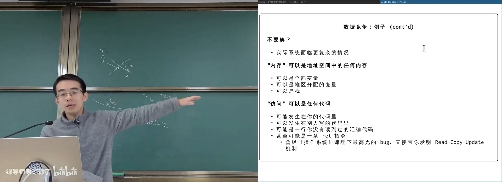

---

## 6. ThreadSanitizer：寻找 happens-before race

### 6.1 事件图

*(参考时间: 00:54)*

为了检测数据竞争，需要记录：

- 每个线程内部的程序顺序；
- `lock` / `unlock`；
- 每次读和写；
- 锁释放与下一次获取之间的同步关系。

如果两个访问：

- 访问同一内存；
- 属于不同线程；
- 至少一个是写；
- 在 happens-before 图中没有先后关系；

那么就是数据竞争。

```mermaid
flowchart TD
    A["线程程序顺序"] --> D["Happens-before 图"]
    B["unlock → 下一次 lock"] --> D
    C["线程创建 / join"] --> D
    D --> E["比较同地址读写事件"]
    E --> F{"存在 HB 路径？"}
    F -- "否" --> G["报告 Data Race"]
```

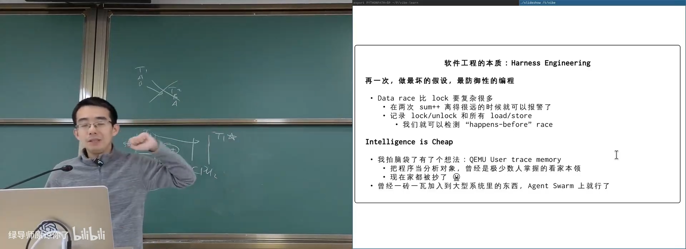

### 6.2 只露出一条路径的竞争

*(参考时间: 00:55)*

示例：

```c
if (rand() % 10 == 0) {
    sum++;          /* 未加锁 */
} else {
    lock(&lk);
    sum++;
    unlock(&lk);
}
```

该错误只在十分之一概率出现，普通测试可能偶尔看到错误，也可能长期侥幸通过。

```mermaid
flowchart TD
    A["运行 sum++ 路径"] --> B{"随机走哪条？"}
    B -- "90%" --> C["正确加锁"]
    B -- "10%" --> D["忘记加锁"]
    C --> E["测试可能通过"]
    D --> F["偶发数据竞争"]
    E --> G["错误被隐藏"]
```

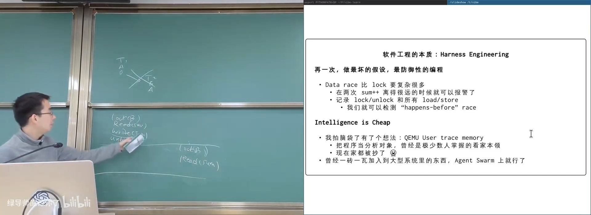

### 6.3 使用 ThreadSanitizer

*(参考时间: 00:57)*

```bash
cc -fsanitize=thread -g race.c -o race
./race
```

TSan 会报告：

- 冲突的读写位置；
- 两个线程各自的调用栈；
- 是否存在同步边；
- 冲突发生在哪一行源码。

```mermaid
flowchart LR
    A["编译时插桩"] --> B["记录读写与同步"]
    B --> C["运行程序"]
    C --> D["建立 happens-before 关系"]
    D --> E["发现无同步并发访问"]
    E --> F["打印竞争报告"]
```

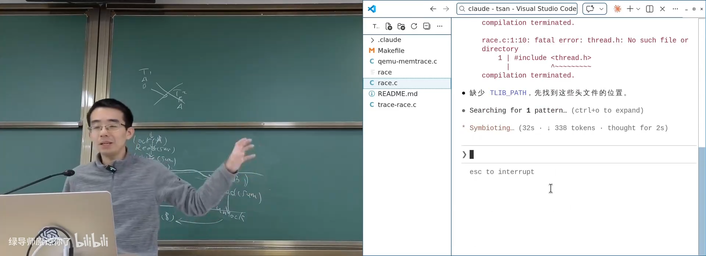

### 6.4 TSan 也不是万能

*(参考时间: 01:00)*

- 仅覆盖实际执行到的路径；
- 某些平台或运行时支持有限；
- 可能产生误报或漏报；
- 报告竞争并不等于已经发生错误结果；
- 没有报告也不代表程序正确。

```mermaid
flowchart TD
    A["TSan 运行"] --> B["覆盖本次执行路径"]
    B --> C{"触发竞争路径？"}
    C -- "是" --> D["通常可检测"]
    C -- "否" --> E["本次无报告"]
    E --> F["不代表程序没有竞争"]
```

---

## 7. Therac-25：会致命的并发 Bug

### 7.1 事故背景

*(参考时间: 01:02)*

Therac-25 是放射治疗设备。1985–1987 年间，其事件驱动并发 Bug 导致至少 6 人死亡。

设备有两种模式：

- Electron 低能量模式；
- X-ray 高能量模式。

高能量模式需要 `beam flattener` 机械装置移动到指定位置，以控制辐射剂量。

```mermaid
flowchart LR
    A["Electron 低能量"] --> C["治疗控制系统"]
    B["X-ray 高能量"] --> C
    C --> D["Beam Flattener"]
    D --> E["患者"]
```

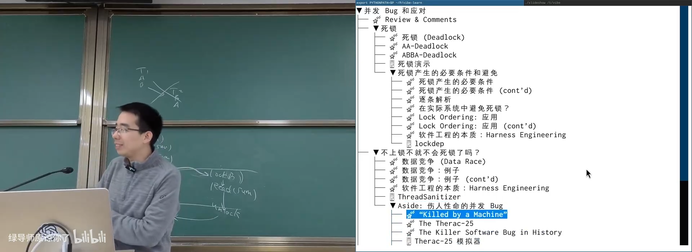

### 7.2 并发事件交错

*(参考时间: 01:05)*

危险顺序：

1. 操作员选择 X-ray 高能量模式；
2. 软件启动 beam flattener 移动，但机械动作需要数秒；
3. 操作员迅速切回 Electron 低能量模式；
4. 再快速切回 X-ray 高能量模式；
5. 软件中的模式变量已经是高能量；
6. 但机械装置仍未处在正确位置；
7. 系统产生 Malfunction 54 错误；
8. 操作员习惯性按 Continue；
9. 高能电子束在缺少过滤装置时照射患者。

```mermaid
sequenceDiagram
    participant O as Operator
    participant S as Software
    participant M as Mechanical Flattener
    O->>S: select X-Ray High
    S->>M: start moving flattener
    O->>S: switch Electron Low
    O->>S: switch X-ray High
    Note over M: flattener 还未到位
    S->>O: Malfunction 54
    O->>S: Continue
    S->>M: beam on
    Note over M: 错误剂量照射
```

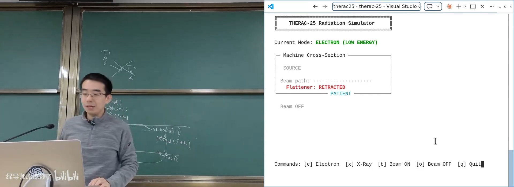

### 7.3 软件状态没有完整描述物理状态

*(参考时间: 01:07)*

软件中有“模式”和“flattener 状态”变量，但没有完整描述：

- 硬件当前移动到哪里；
- 移动是否已经完成；
- 下一步开启射线时装置是否确实到位；
- 操作员 Continue 是否安全。

软件是现实过程的投影，而投影是有损的。忽略物理状态和异步延迟就会产生原子性违反。

```mermaid
flowchart TD
    A["真实物理状态"] --> B["软件变量投影"]
    B --> C["模式 = X-ray"]
    B --> D["Flattener 状态 = moving"]
    C --> E{"是否强制等待动作完成？"}
    D --> E
    E -- "否" --> F["错误允许 beam on"]
```

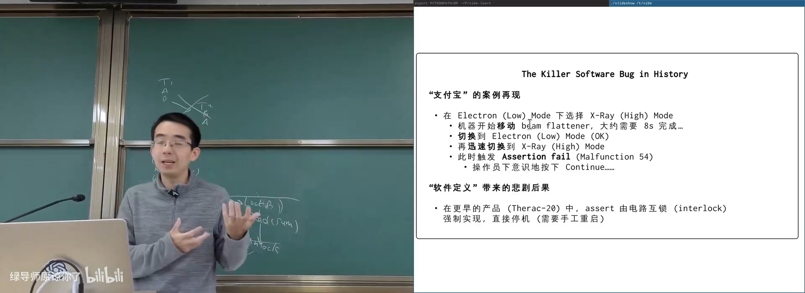

### 7.4 旧产品为何安全

*(参考时间: 01:08)*

Therac-20 用硬件互锁电路强制禁止危险组合：

```text
assert not (X-ray High && Flattener Off)
```

若危险组合出现，机器直接停机，必须人工重启。

Therac-25 把安全检查移到软件中，但错误只产生警告，操作员可以 Continue，安全边界因此失效。

```mermaid
flowchart LR
    A["Therac-20 硬件互锁"] --> B["危险组合直接停机"]
    C["Therac-25 软件检查"] --> D["产生错误"]
    D --> E["操作员可以 Continue"]
    E --> F["危险组合被执行"]
```

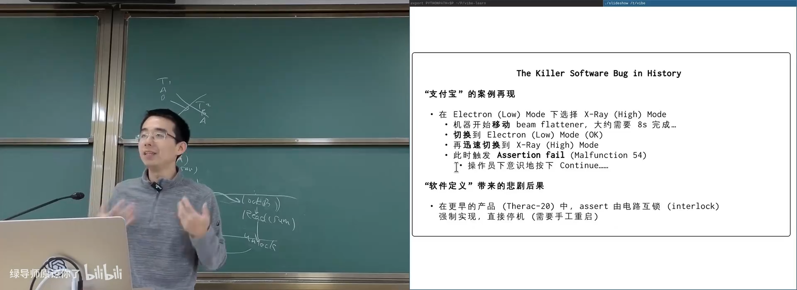

---

## 8. 原子性违反与顺序违反

### 8.1 即使每个内存访问都加锁也不够

*(参考时间: 01:10)*

一个更高层的逻辑块可能需要整体原子性：

```c
lock(A);
sum++;
unlock(A);

lock(A);
sum++;
unlock(A);
```

如果别的线程希望观察到 `sum` 永远为偶数，这两个单独的锁区间仍可能被插入，形成：

```text
本应原子完成的一段逻辑，被拆开执行
```

```mermaid
sequenceDiagram
    participant T1
    participant S as sum
    participant T2
    T1->>S: sum++ (0→1)
    T2->>T2: observe odd sum
    T1->>S: sum++ (1→2)
    Note over T2: T1 期望两步原子，但被观察者插入
```

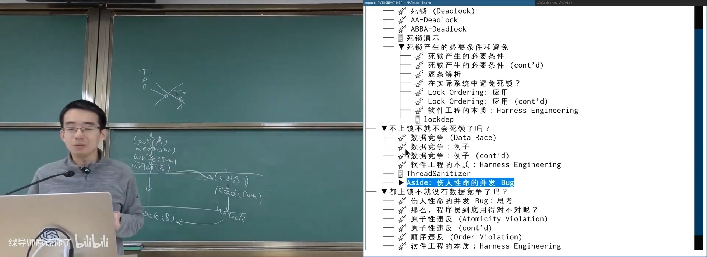

### 8.2 原子性违反（AV）

*(参考时间: 01:11)*

模式：

```text
A B A
```

本应连续完成的 `A` 被 `B` 插入。

例子：

- check-then-act；
- 使用指针前检查空；
- 创建临时对象后再写回；
- 更新多个对象但未持有同一把锁。

```mermaid
flowchart LR
    A["逻辑操作 A"] --> B["预期原子完成"]
    C["另一线程 B"] --> D["插入 A 的两部分之间"]
    D --> E["Atomicity Violation"]
```

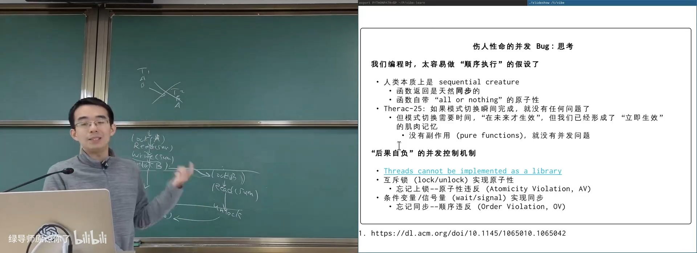

### 8.3 实证研究：97% 非死锁 bug 属于 AV 或 OV

*(参考时间: 01:14)*

2008 年 ASPLOS 论文
[Learning from Mistakes](https://dl.acm.org/doi/10.1145/1346281.1346323)
收集了 105 个真实并发 bug：

- MySQL；
- Apache；
- Mozilla；
- OpenOffice。

结论：97% 的非死锁并发 bug 可以归为：

- **Atomicity Violation（AV）**；
- **Order Violation（OV）**。

```mermaid
flowchart TD
    A["105 个真实并发 Bug"] --> B["死锁"]
    A --> C["非死锁"]
    C --> D["97% 原子性或顺序问题"]
    D --> E["Atomicity Violation"]
    D --> F["Order Violation"]
```

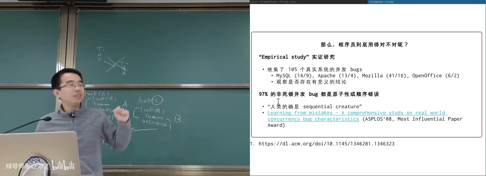

### 8.4 顺序违反（OV）

*(参考时间: 01:21)*

模式：

```text
B A
```

但程序假设顺序应是 `A B`。

例子：

- 在初始化完成前使用对象；
- `free` 发生在最后一次使用之前；
- 条件变量信号丢失；
- 线程创建后才建立其依赖状态；
- 并发 use-after-free。

```mermaid
sequenceDiagram
    participant U as User Thread
    participant F as Free Thread
    U->>U: intend to access object
    F->>F: free object
    U->>F: use after free
    Note over U,F: 顺序应为 use → free
```

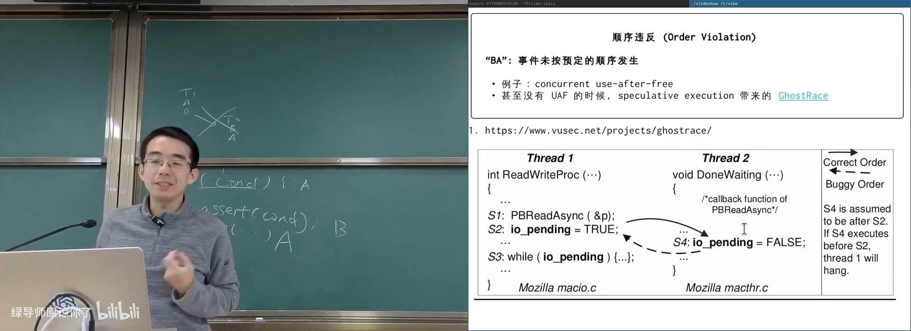

---

## 9. TOCTTOU 与并发 use-after-free

### 9.1 检查时刻与使用时刻

*(参考时间: 01:17)*

TOCTTOU = Time-of-Check to Time-of-Use。

传统 `sendmail` 曾检查邮箱路径是否为符号链接，然后打开并写入：

1. 检查路径是普通文件；
2. 攻击者把路径替换为指向 `/etc/passwd` 的符号链接；
3. 高权限程序打开并写入目标；
4. 普通用户借高权限程序破坏系统文件。

```mermaid
sequenceDiagram
    participant M as Mail Program
    participant P as Path
    participant A as Attacker
    M->>P: check: is regular file?
    P-->>M: yes
    A->>P: replace with symlink to /etc/passwd
    M->>P: open and write mailbox
    Note over P: 实际写入敏感文件
```

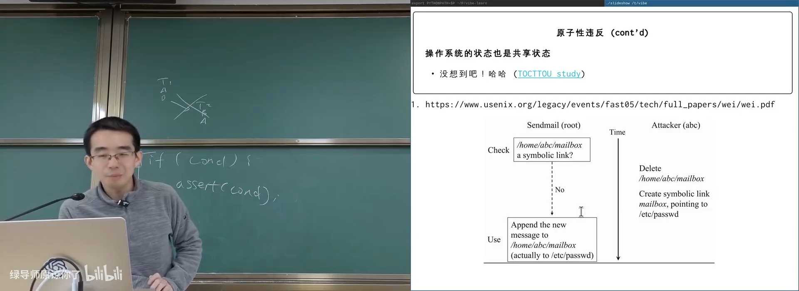

### 9.2 为什么会成为并发 bug

这不是两个用户线程访问同一内存，而是：

- 检查时资源状态安全；
- 使用前资源状态变化；
- 操作者仍按旧判断继续执行；
- 系统对象发生了逻辑 ABA。

根本问题是“检查 + 使用”没有形成一个不可分割操作。

```mermaid
flowchart TD
    A["check 条件成立"] --> B["时间窗口"]
    B --> C["资源被修改"]
    C --> D["use 仍按旧条件执行"]
    D --> E["逻辑 ABA / 安全漏洞"]
```

### 9.3 并发 use-after-free

*(参考时间: 01:21:45)*

正确释放必须等待所有可能引用对象的线程结束访问。

```c
user_thread: read object
free_thread: free object
```

若同步顺序错误：

```text
free → later use
```

就产生并发 use-after-free。

```mermaid
flowchart TD
    A["对象被多个线程引用"] --> B["一个线程决定 free"]
    B --> C{"所有 reader 都结束？"}
    C -- "否" --> D["其他线程 later use"]
    D --> E["Use-After-Free"]
    C -- "是" --> F["安全释放"]
```

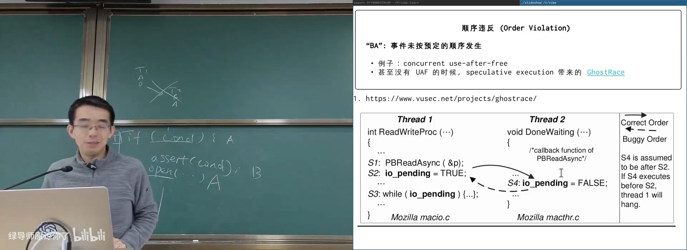

### 9.4 GhostRace：投机执行中的竞争

*(参考时间: 01:23)*

即使程序逻辑中没有实际的 use-after-free，CPU 也可能投机执行“锁尚未获得”的路径：

- 分支预测错误；
- 投机读取；
- 留下 cache footprint；
- 通过侧信道泄漏信息。

这就是 GhostRace 一类问题的基础。

```mermaid
flowchart TD
    A["自旋锁等待"] --> B["分支预测选择未来路径"]
    B --> C["投机读取指针"]
    C --> D["投机访问对象"]
    D --> E["留下缓存副作用"]
    E --> F["侧信道观察"]
```

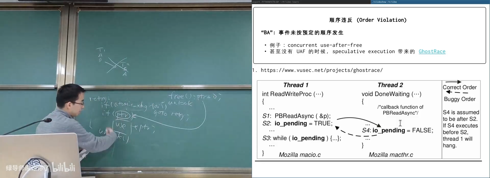

---

## 10. Harness Engineering：用系统性工具驾驭并发复杂性

### 10.1 做最坏的假设

*(参考时间: 01:25)*

软件工程的根本策略不是相信程序员，而是假定所有人都会犯错：

- 锁定资源必须成对获取和释放；
- 所有共享访问必须满足统一锁规则；
- 锁顺序必须全局一致；
- 检查和使用必须由同一同步协议保护；
- 罕见的异步路径也必须纳入分析。

```mermaid
flowchart TD
    A["假设代码一定存在错误"] --> B["静态规则"]
    A --> C["运行时拦截"]
    A --> D["动态分析"]
    A --> E["自动审计"]
    B --> F["减少并发 Bug"]
    C --> F
    D --> F
    E --> F
```

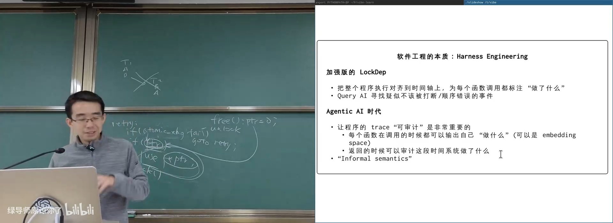

### 10.2 时间轴与可审计 Trace

*(参考时间: 01:27)*

可以把程序执行对齐到全局时间轴：

- 每条指令；
- 每次 lock / unlock；
- 每次内存读写；
- 每次函数调用；
- 每个线程的阻塞与唤醒。

如果每个函数还能报告它“做了什么”的语义，就得到更高级的 **informal semantics**：

```text
function begin: acquire object
function end: release object
```

AI 可以在此基础上检查：

- 原子区间是否被插入；
- 顺序是否错误；
- 资源是否释放过早；
- TOCTTOU 窗口是否存在。

```mermaid
flowchart LR
    A["指令与锁事件"] --> B["统一时间轴"]
    C["函数 informal semantics"] --> B
    B --> D["AI 审计"]
    D --> E["发现 AV / OV / TOCTTOU"]
    E --> F["修复或拦截"]
```

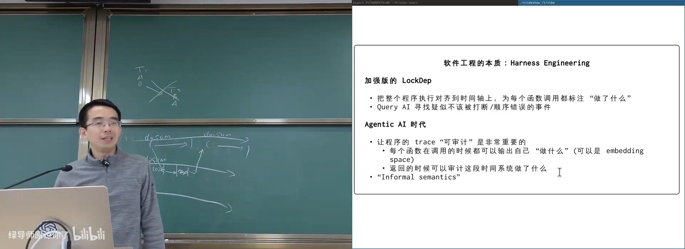

---

## 11. 总结：并发 bug 是顺序直觉与真实并发的碰撞

这一讲把真实并发错误归纳为清晰的类别：

- 人类是顺序生物，容易把并发程序误当作顺序程序；
- AA 死锁：同一线程重复持有不可重入锁；
- ABBA 死锁：多把锁形成循环等待；
- 死锁四条件：Mutual Exclusion、Wait-For、No Preemption、Circular Chain；
- 打破互斥、等待和不可抢占通常需要消息系统或事务内存；
- Lock Ordering 是最实用的工程方案；
- 即使顺序规则存在，文档和实现也可能长期不一致；
- RAII、统一 cleanup 和 Lockdep 可以降低锁错误；
- 数据竞争指无 happens-before 的并发访问，且至少一个为写；
- C/C++ 数据竞争是 undefined behavior；
- 数据竞争可能发生在全局、堆、栈、库函数甚至返回指令；
- ThreadSanitizer 通过事件图和 happens-before 检测竞争；
- Therac-25 展示异步机械状态未被正确同步的致命后果；
- 非死锁并发 bug 中，绝大多数是 Atomicity Violation 或 Order Violation；
- TOCTTOU、并发 UAF 和 GhostRace 都体现检查、使用、投机与顺序之间的不一致；
- Harness Engineering 要求自动工具而不是信任人；
- AI 时代的重要方向，是生成可审计、带 informal semantics 的程序轨迹。

```mermaid
flowchart LR
    A["顺序执行直觉"] --> B["死锁"]
    A --> C["数据竞争"]
    A --> D["原子性违反"]
    A --> E["顺序违反"]
    B --> F["Lock Ordering / Lockdep"]
    C --> G["TSan / ASan"]
    D --> H["统一同步域"]
    E --> I["条件变量 / 生命周期协议"]
    F --> J["Harness Engineering"]
    G --> J
    H --> J
    I --> J
```

最终的安全策略不是“相信程序员会写对”，而是：

> 用类型系统、作用域资源、统一锁规则、动态检测和 AI 审计，把并发错误变成可以被提前发现、可以回滚、可以拦截的问题。

---

## 附：官方参考与延伸阅读

以下链接来自官方讲义第 17 讲及课堂内容：

- [System Deadlocks, 1971](https://dl.acm.org/doi/10.1145/356586.356588)
- [死锁演示](https://jyywiki.cn/OS/demos/concurrency/deadlock)
- [Linux `mm/rmap.c` lock ordering](https://elixir.bootlin.com/linux/latest/source/mm/rmap.c)
- [Unreliable Guide to Locking](https://www.kernel.org/doc/html/latest/kernel-hacking/locking.html)
- [LockDoc, EuroSys 2019](https://dl.acm.org/doi/10.1145/3302424.3303948)
- [lockdep demo](https://jyywiki.cn/OS/demos/concurrency/lockdep)
- [ThreadSanitizer demo](https://jyywiki.cn/OS/demos/concurrency/tsan)
- [Threads Cannot Be Implemented as a Library](https://dl.acm.org/doi/10.1145/1065010.1065042)
- [Learning from Mistakes, ASPLOS 2008](https://dl.acm.org/doi/10.1145/1346281.1346323)
- [TOCTTOU study](https://www.usenix.org/legacy/events/fast05/tech/full_papers/wei/wei.pdf)
- [GhostRace](https://www.vusec.net/projects/ghostrace/)
- [Therac-25 simulator](https://jyywiki.cn/OS/demos/concurrency/therac-25)

阅读材料：

- *Operating Systems: Three Easy Pieces* 第 32 章，Concurrency Bugs。

官方课程资料：

- [课程主页](https://jyywiki.cn/OS/2026/)
- [第 17 讲讲义：并发 Bug 和应对](https://jyywiki.cn/OS/2026/lect17.md)
- [视频：17 - 并发 Bugs 和应对](https://www.bilibili.com/video/BV1Jg96BjE68/)

> **版权与署名**：本讲课程材料由蒋炎岩（jyy）编写。课程讲义与幻灯片采用 [Creative Commons BY-NC 4.0](http://creativecommons.org/licenses/by-nc/4.0/) 许可；本电子书保留课程出处、作者署名与许可说明。
