# 并行算法和数据结构：从正确性走向可扩展性

> **课程**：2026 春季学期《操作系统原理》  
> **讲师**：蒋炎岩（jyy）  
> **官方课程主页**：<https://jyywiki.cn/OS/2026/>  
> **官方讲义**：<https://jyywiki.cn/OS/2026/lect18.md>  
> **视频来源**：[Bilibili BV1WqdTBiEkN](https://www.bilibili.com/video/BV1WqdTBiEkN/)  
> **版权说明**：课程讲义与幻灯片归蒋炎岩所有，采用 [Creative Commons BY-NC 4.0](http://creativecommons.org/licenses/by-nc/4.0/) 许可；本电子书是对课堂讲授的书面化重构，保留出处与许可说明。

## 导语：锁保证了正确，却不保证扩展

*(参考时间: 00:00)*

前几讲解决了并发程序“怎么才能正确”的问题：

- 互斥锁阻止数据竞争；
- 条件变量实现任意同步条件；
- 信号量管理计数型资源；
- 并发 bug 的工具与工程约束帮助发现问题。

这一讲转向性能：

> 当程序已经正确后，如何让性能随线程、CPU 和机器数量增长？

两个关键概念：

- **Scale Up**：在同一台机器上增加线程 / CPU，性能继续增长；
- **Scale Out**：增加机器节点，性能继续增长。

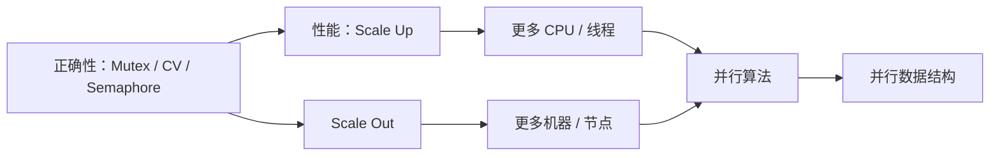
```mermaid
flowchart LR
    A["正确性：Mutex / CV / Semaphore"] --> B["性能：Scale Up"]
    B --> C["更多 CPU / 线程"]
    A --> D["Scale Out"]
    D --> E["更多机器 / 节点"]
    C --> F["并行算法"]
    E --> F
    F --> G["并行数据结构"]
```

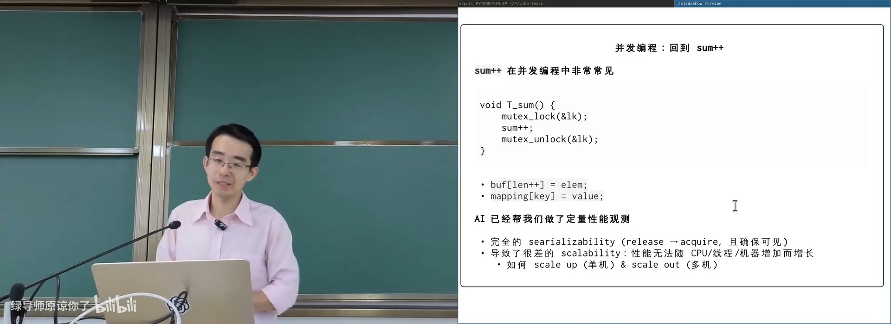

---

## 1. `sum++` 为什么无法扩展

### 1.1 完全串行化

*(参考时间: 00:14)*

```c
void T_sum(void) {
    mutex_lock(&lk);
    sum++;
    mutex_unlock(&lk);
}
```

锁确保正确，但也把每次 `sum++` 完全串行化。

如果总操作次数为 `N`，临界区每步耗时 `t`：

```text
大量线程下，T ≈ N × t
```

增加 CPU 并不能减少串行部分，只增加等待和竞争。

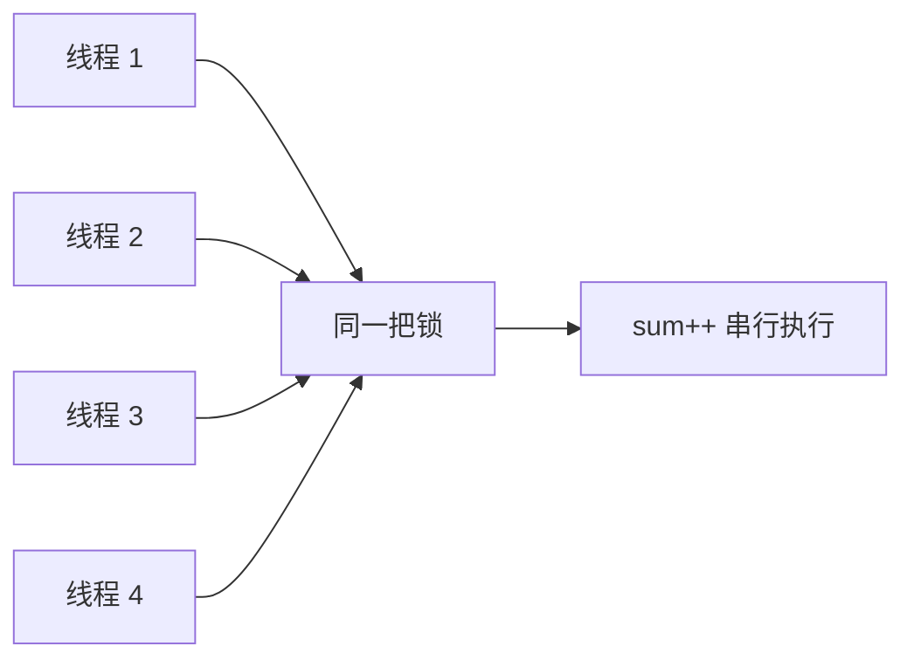
```mermaid
flowchart LR
    T1["线程 1"] --> L["同一把锁"]
    T2["线程 2"] --> L
    T3["线程 3"] --> L
    T4["线程 4"] --> L
    L --> S["sum++ 串行执行"]
```

### 1.2 实测扩展性

*(参考时间: 00:16)*

实验比较：

- atomic；
- mutex；
- spinlock；
- 每次进入内核的 naive futex。

现象：

1. 单线程最快；
2. 多线程竞争后，每次操作成本上升；
3. mutex 与 atomic 最终趋于平台；
4. spinlock 在线程超过 CPU 数后显著退化；
5. 强制系统调用版本始终受几百纳秒的内核切换成本限制。

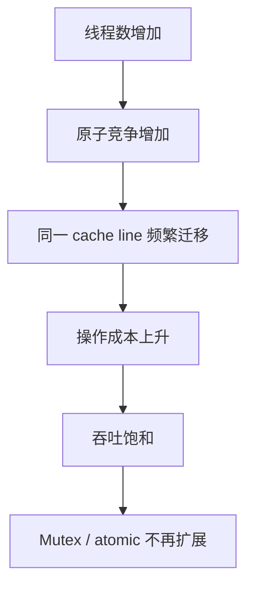
```mermaid
flowchart TD
    A["线程数增加"] --> B["原子竞争增加"]
    B --> C["同一 cache line 频繁迁移"]
    C --> D["操作成本上升"]
    D --> E["吞吐饱和"]
    E --> F["Mutex / atomic 不再扩展"]
```

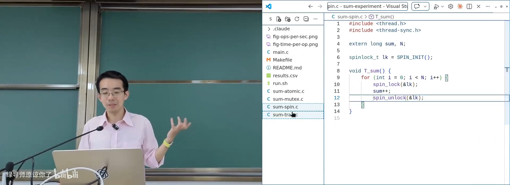

### 1.3 Scale Up 与 Scale Out

*(参考时间: 00:20)*

**Scale Up**：

- 单机增加核心与线程；
- 共享内存；
- 同步成本低但 cache coherence 开销高。

**Scale Out**：

- 增加机器节点；
- 通过消息通信；
- 节点内共享内存，节点间网络；
- 真正瓶颈变成网络、容错、功耗和调度。

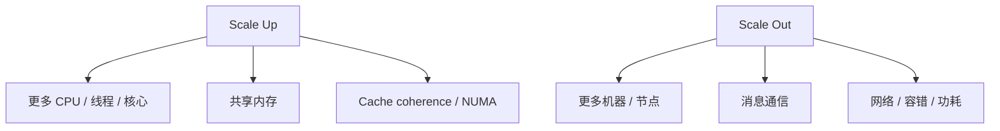
```mermaid
flowchart TD
    A["Scale Up"] --> B["更多 CPU / 线程 / 核心"]
    A --> C["共享内存"]
    A --> D["Cache coherence / NUMA"]
    E["Scale Out"] --> F["更多机器 / 节点"]
    E --> G["消息通信"]
    E --> H["网络 / 容错 / 功耗"]
```

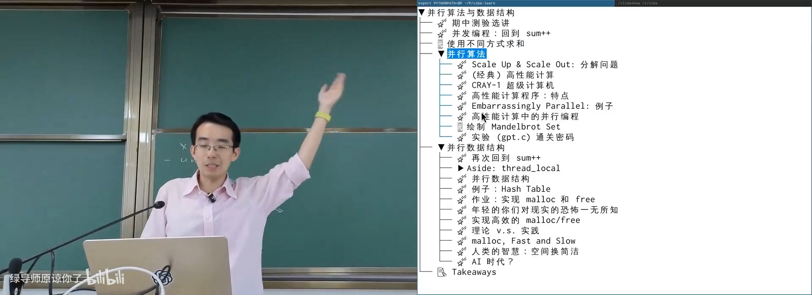

---

## 2. 用计算图分解问题

### 2.1 任意并行问题都是计算图

*(参考时间: 00:21)*

节点表示计算，边表示依赖：

```text
u → v
```

表示 `u` 的结果必须先行产生。

如果每个节点的本地计算远多于同步开销，程序就可以扩展。

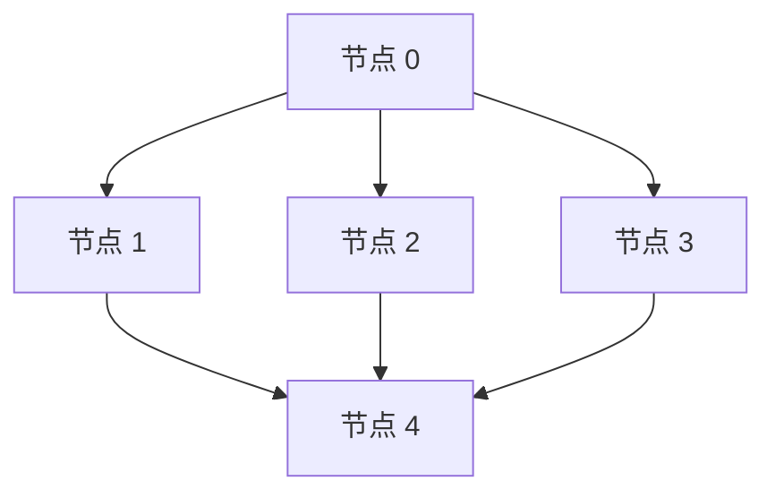
```mermaid
flowchart TD
    A["节点 0"] --> B["节点 1"]
    A --> C["节点 2"]
    A --> D["节点 3"]
    B --> E["节点 4"]
    C --> E
    D --> E
```

### 2.2 太细的任务划分反而糟糕

*(参考时间: 00:22)*

例如动态规划：

```text
dp[i][j] = f(dp[i-1][j], dp[i][j-1], dp[i-1][j-1])
```

为每个 `dp[i][j]` 创建线程和条件变量：

- 每个节点只有几条算术运算；
- 同步和唤醒开销远大于计算；
- 并行度大不等于性能好。


```mermaid
flowchart LR
    A["每个 dp[i][j] 一个节点"] --> B["极小计算量"]
    B --> C["大量锁 / 条件变量 / 唤醒"]
    C --> D["同步开销主导"]
    D --> E["扩展性反而下降"]
```

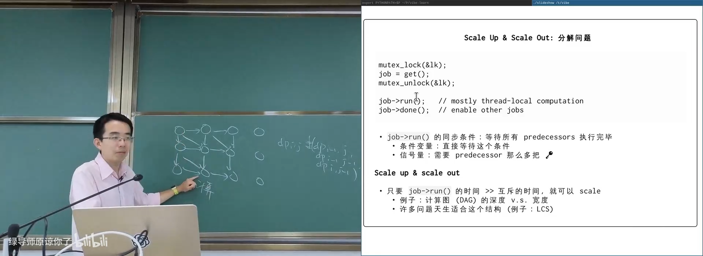

### 2.3 分块、斜切与流水线

*(参考时间: 00:23)*

更好的划分方式：

- 初始小三角整体串行计算；
- 中间按对角线分块；
- 并行度增大后再切成更多块；
- 块内独立计算，块间按层同步。

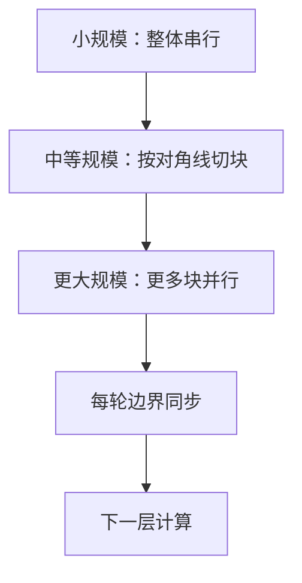
```mermaid
flowchart TD
    A["小规模：整体串行"] --> B["中等规模：按对角线切块"]
    B --> C["更大规模：更多块并行"]
    C --> D["每轮边界同步"]
    D --> E["下一层计算"]
```

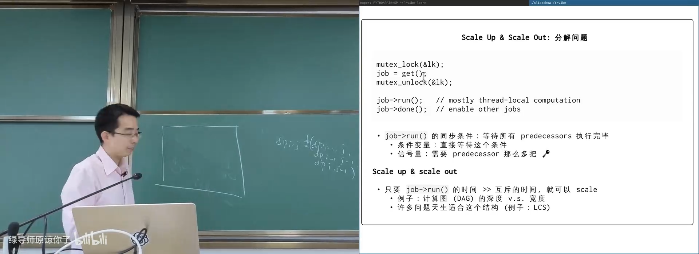

---

## 3. 高性能计算

### 3.1 从数值模拟开始

*(参考时间: 00:25)*

高性能计算（HPC）最初服务于数值密集型科学任务：

- 物理系统模拟；
- 核爆炸和有限元；
- 天气预报；
- 航天、制造、能源和制药；
- 区块链 proof-of-work；
- AI 推理与训练。


```mermaid
flowchart LR
    A["物理模型"] --> B["网格离散化"]
    B --> C["大规模数值计算"]
    C --> D["超级计算机 / 集群"]
    D --> E["更高精度模拟"]
```

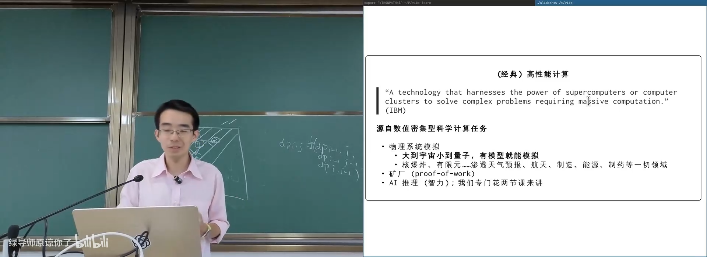

### 3.2 Cray-1：超级计算机的历史

*(参考时间: 00:28)*

Cray-1（1976）被称为“世界上最昂贵的沙发”：

- 138 MFLOPS；
- 功耗约 115 kW；
- 底座造型甚至被戏称为可以坐人。

对比今天：

- 移动端 SoC 可达数 TFLOPS；
- 专用 AI ASIC 可达到数百 TOPS；
- 中国超算榜单使用 PFLOPs 计量。

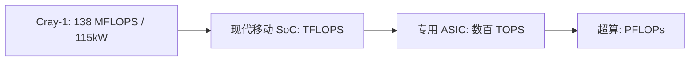
```mermaid
flowchart LR
    A["Cray-1: 138 MFLOPS / 115kW"] --> B["现代移动 SoC: TFLOPS"]
    B --> C["专用 ASIC: 数百 TOPS"]
    C --> D["超算: PFLOPs"]
```

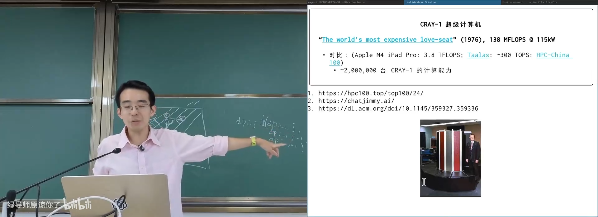

### 3.3 空间局部性与网格计算

*(参考时间: 00:33)*

物理世界具有空间局部性：

- 大系统可切分为网格；
- 网格内部独立计算；
- 只有边界与其他网格交互；
- 计算量远大于边界同步。

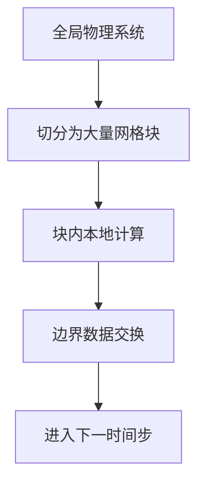
```mermaid
flowchart TD
    A["全局物理系统"] --> B["切分为大量网格块"]
    B --> C["块内本地计算"]
    C --> D["边界数据交换"]
    D --> E["进入下一时间步"]
```

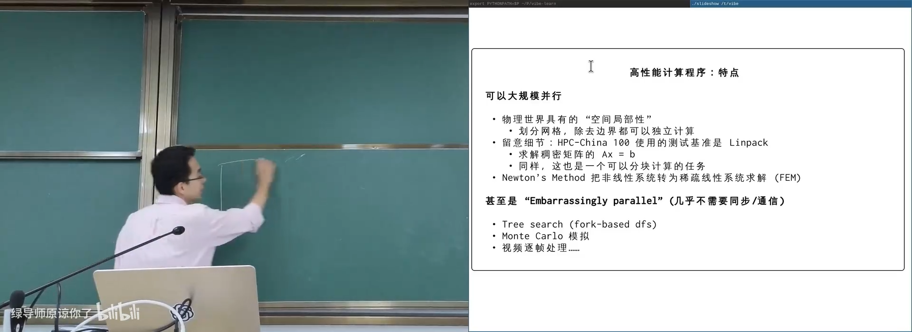

### 3.4 Linpack 与线性方程组

*(参考时间: 00:34)*

HPC 基准 Linpack 求解稠密线性方程组：

```text
Ax = b
```

线性方程组重要，是因为很多非线性系统可以通过 Newton 方法离散化为线性系统：

```text
nonlinear system
  → Newton iteration
  → sparse linear system
  → dense local blocks
```


```mermaid
flowchart LR
    A["非线性物理系统"] --> B["Newton 法"]
    B --> C["稀疏线性系统"]
    C --> D["分块求解"]
    D --> E["稠密线性代数计算"]
```

### 3.5 Embarrassingly Parallel

*(参考时间: 00:36)*

有些任务几乎不需要同步：

- fork-based DFS；
- Monte Carlo 采样；
- 视频逐帧处理；
- 图像的每个像素计算。

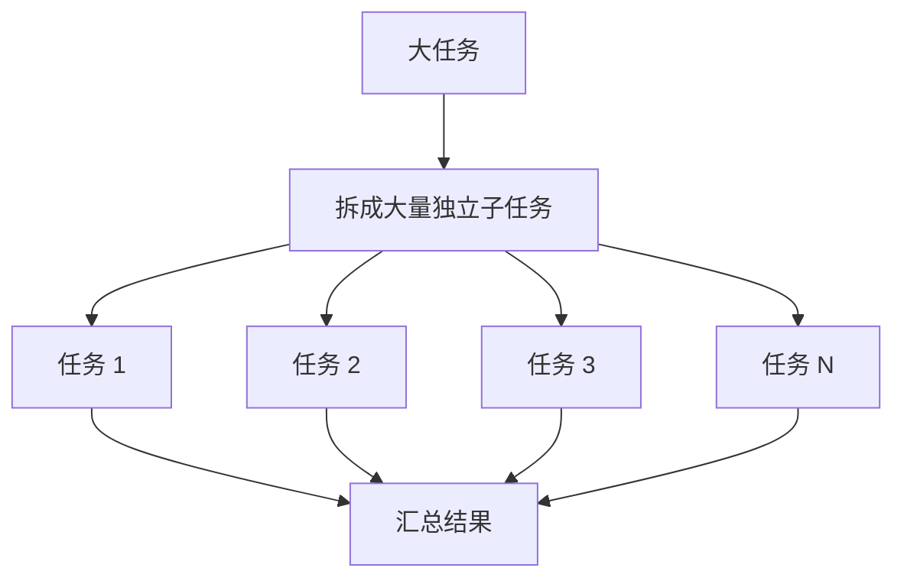
```mermaid
flowchart TD
    A["大任务"] --> B["拆成大量独立子任务"]
    B --> C1["任务 1"]
    B --> C2["任务 2"]
    B --> C3["任务 3"]
    B --> CN["任务 N"]
    C1 --> D["汇总结果"]
    C2 --> D
    C3 --> D
    CN --> D
```

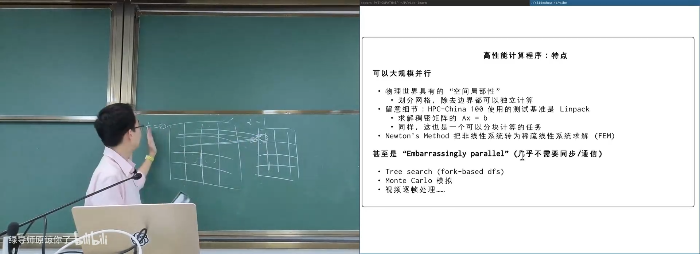

### 3.6 并行树搜索

*(参考时间: 00:39)*

以围棋搜索为例：

1. 先串行展开若干层；
2. 得到数百万个搜索节点；
3. 将节点公平分配到线程或机器；
4. 独立搜索；
5. 合并最优结果。

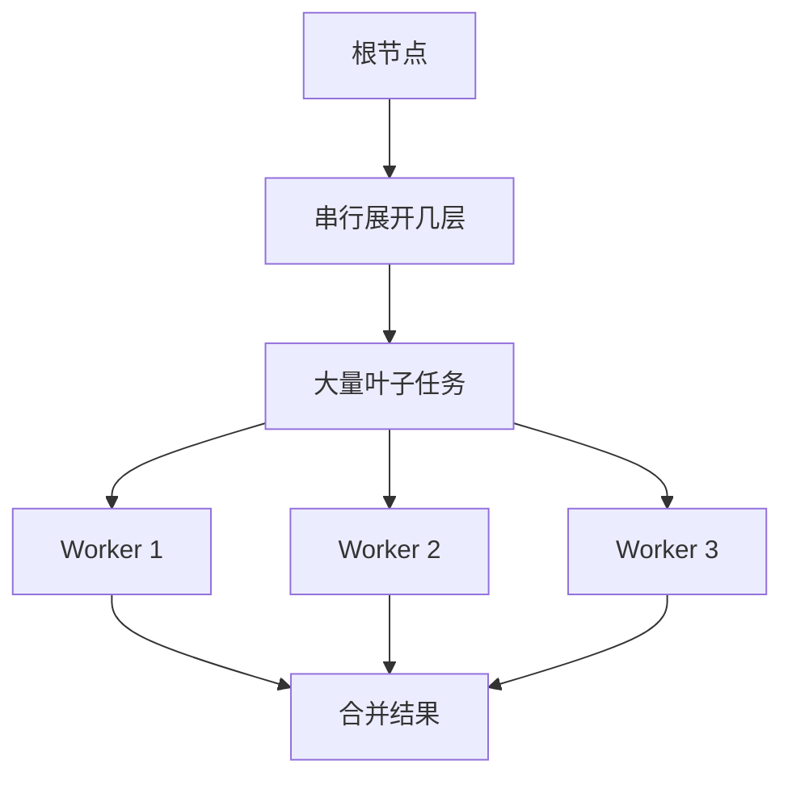
```mermaid
flowchart TD
    A["根节点"] --> B["串行展开几层"]
    B --> C["大量叶子任务"]
    C --> D1["Worker 1"]
    C --> D2["Worker 2"]
    C --> D3["Worker 3"]
    D1 --> E["合并结果"]
    D2 --> E
    D3 --> E
```

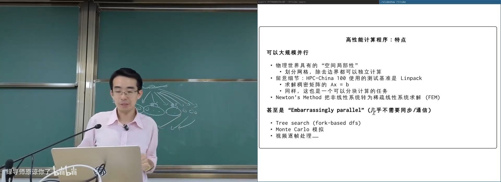

---

## 4. Mandelbrot 与 OpenMP

### 4.1 每个像素独立

*(参考时间: 00:42)*

Mandelbrot 集合研究复迭代：

```text
z_{n+1} = z_n^2 + c
```

对复平面上每个 `c` 判断轨迹是否有界。

每个像素完全独立，因此可以：

- 按像素分配；
- 按行列块分配；
- 动态任务调度。

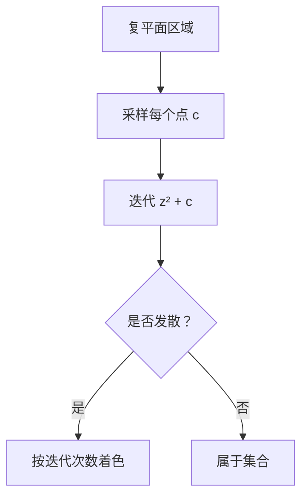
```mermaid
flowchart TD
    A["复平面区域"] --> B["采样每个点 c"]
    B --> C["迭代 z² + c"]
    C --> D{"是否发散？"}
    D -- "是" --> E["按迭代次数着色"]
    D -- "否" --> F["属于集合"]
```

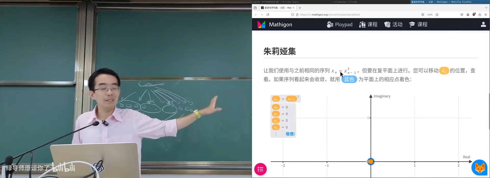

### 4.2 分形边界与可视化

*(参考时间: 00:45)*

分形边界不断放大仍能出现精细结构。可视化有助于重新走一遍数学概念形成的过程，而不是只记公式。


```mermaid
flowchart LR
    A["数学定义"] --> B["交互式可视化"]
    B --> C["观察分形结构"]
    C --> D["形成直觉"]
    D --> E["回到计算 / 推导"]
```

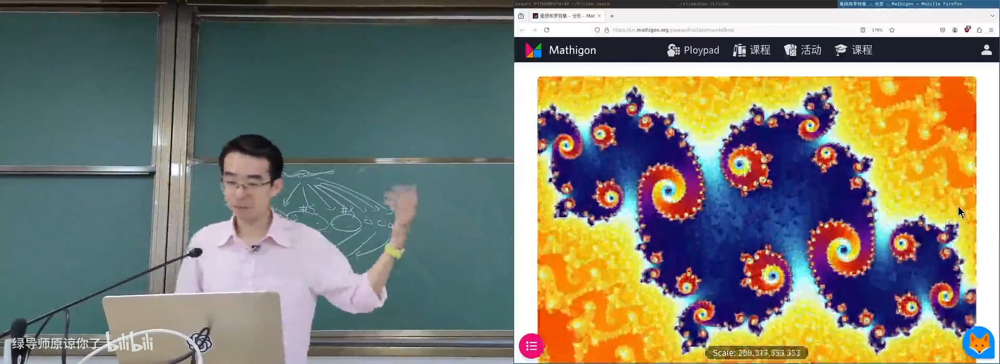

### 4.3 OpenMP 的最小并行化

*(参考时间: 00:48)*

原本是顺序循环：

```c
for (int i = 0; i < width; i++) {
    render_column(i);
}
```

加入：

```c
#pragma omp parallel for
for (int i = 0; i < width; i++) {
    render_column(i);
}
```

程序自动并行。

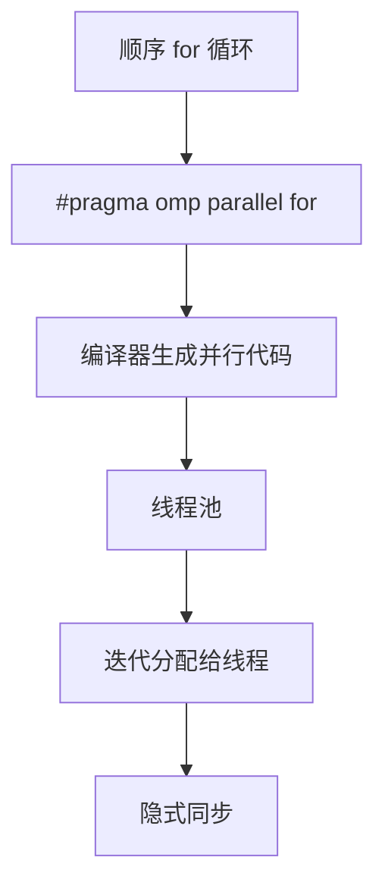
```mermaid
flowchart TD
    A["顺序 for 循环"] --> B["#pragma omp parallel for"]
    B --> C["编译器生成并行代码"]
    C --> D["线程池"]
    D --> E["迭代分配给线程"]
    E --> F["隐式同步"]
```

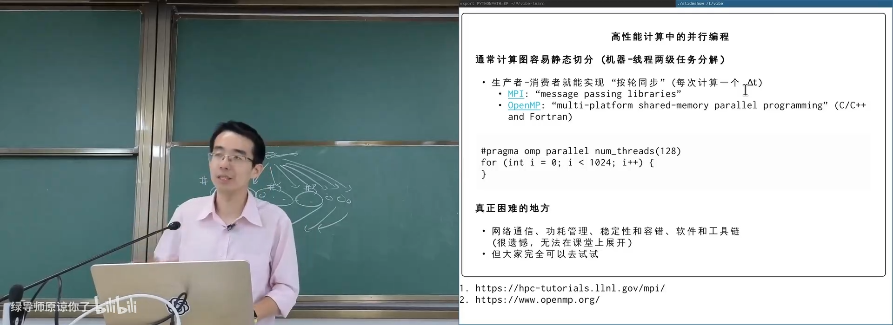

### 4.4 单线程与 16 线程

*(参考时间: 00:51)*

6400×6400 图像：

- 单线程约 18 秒；
- 16 线程约 3 秒；
- 未达到理想 16 倍，但已有显著提升。


```mermaid
flowchart LR
    A["单线程：约 18s"] --> B["16 线程：约 3s"]
    B --> C["接近 6x 加速"]
    C --> D["受启动 / 内存 / 调度限制"]
```

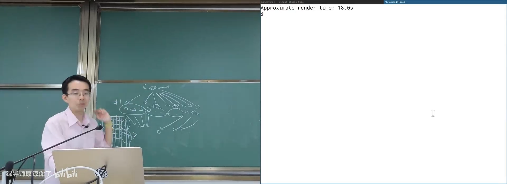

### 4.5 HPC 真正的困难

*(参考时间: 00:55)*

并行循环只是表面。实际 HPC 还包含：

- 高速网络；
- 机柜内 / 机柜间带宽不对称；
- NUMA 延迟；
- 通信不可靠；
- 功耗和散热；
- 节点故障；
- 存储与容错；
- 工具链与部署。

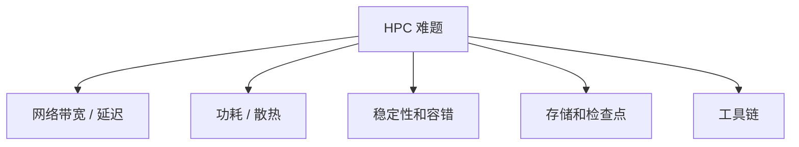
```mermaid
flowchart TD
    A["HPC 难题"] --> B["网络带宽 / 延迟"]
    A --> C["功耗 / 散热"]
    A --> D["稳定性和容错"]
    A --> E["存储和检查点"]
    A --> F["工具链"]
```

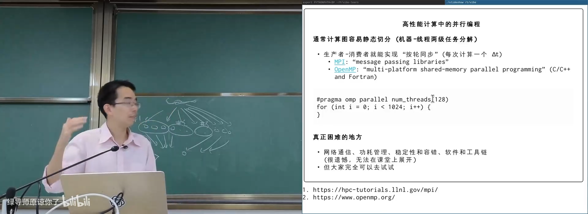

### 4.6 实验：并行 GPT 推理

*(参考时间: 00:56)*

实验给出一个顺序 GPT 推理程序。并行化相关部分很少：

```c
#ifdef OMP
#include <omp.h>
#endif

#pragma omp parallel for
...

#pragma omp parallel for collapse(2)
...
```

关键是识别计算图中最顶层、最可并行化的循环，而不是盲目给所有循环加 pragma。

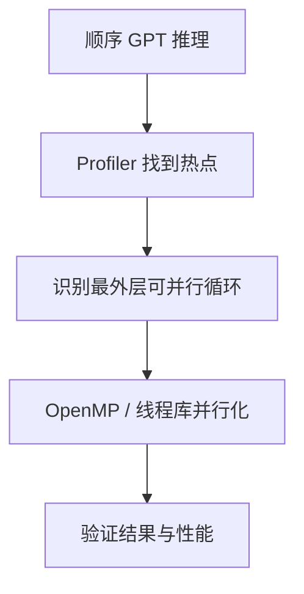
```mermaid
flowchart TD
    A["顺序 GPT 推理"] --> B["Profiler 找到热点"]
    B --> C["识别最外层可并行循环"]
    C --> D["OpenMP / 线程库并行化"]
    D --> E["验证结果与性能"]
```

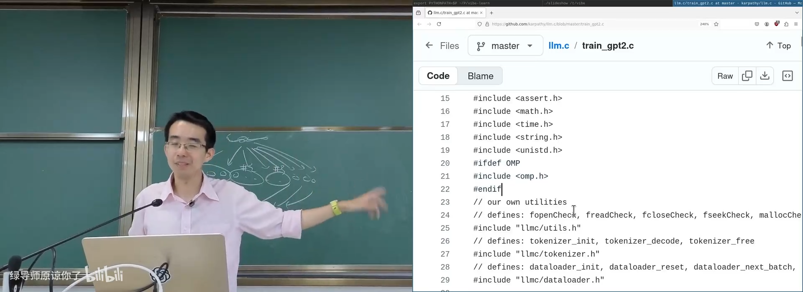

### 4.7 Profiler 驱动优化

*(参考时间: 00:58)*

性能优化必须先测量：

1. Profiler 找热点；
2. 构造计算图；
3. 识别独立子任务；
4. 减少同步；
5. 比较加速比；
6. 检查瓶颈是否转移到 memory / I/O。

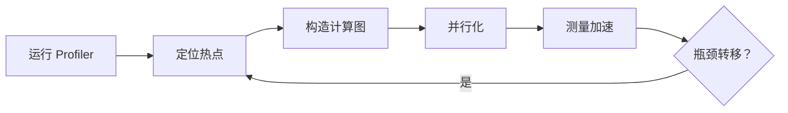
```mermaid
flowchart LR
    A["运行 Profiler"] --> B["定位热点"]
    B --> C["构造计算图"]
    C --> D["并行化"]
    D --> E["测量加速"]
    E --> F{"瓶颈转移？"}
    F -- "是" --> B
```

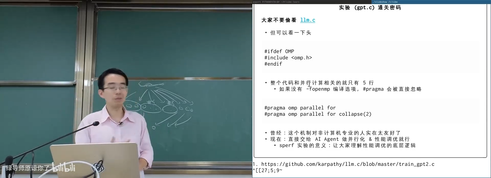

---

## 5. 并行数据结构：从大锁到局部锁

### 5.1 `sum++` 不只是数字

*(参考时间: 01:00)*

大量实际系统频繁执行类似操作：

- 操作系统对象计数；
- 数据库索引；
- 点赞和热点统计；
- 游戏服务器位置更新；
- HFT 订单状态。

```mermaid
flowchart TD
    A["锁保护的共享更新"] --> B["操作系统内核"]
    A --> C["数据库"]
    A --> D["社交平台计数器"]
    A --> E["游戏服务器"]
    A --> F["交易系统"]
```

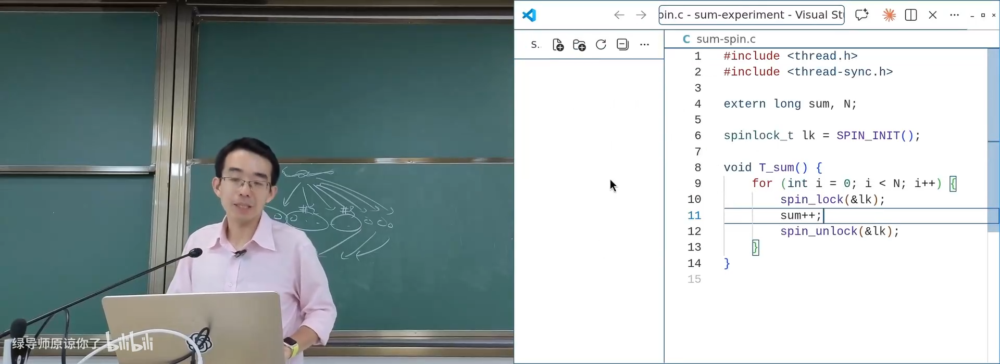

### 5.2 可见性代价

*(参考时间: 01:02)*

一次 store 要传播到其他 CPU：

- cache coherence 协议；
- 缓存行所有权迁移；
- 总线或互连网络流量；
- 内存屏障。

严格可见性很贵。

```mermaid
flowchart LR
    A["CPU 0 store"] --> B["L1 cache"]
    B --> C["Coherence / Directory"]
    C --> D["CPU 1 cache"]
    C --> E["CPU 2 cache"]
    D --> F["可见"]
    E --> F
```

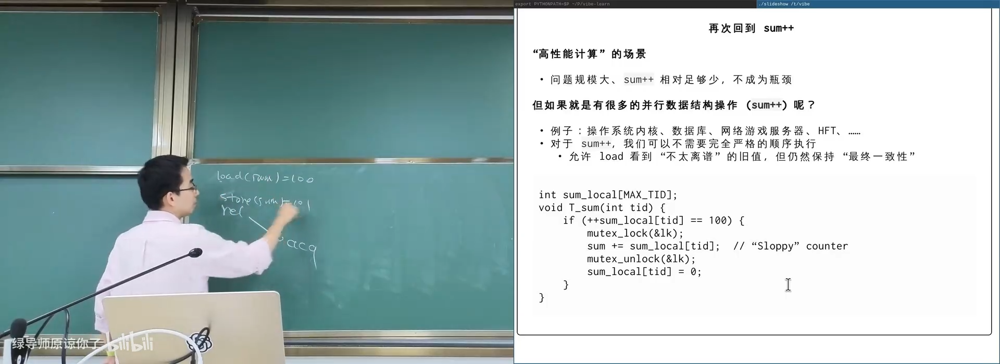

### 5.3 Sloppy Counter

*(参考时间: 01:04)*

线程本地累计：

```c
thread_local int sum_local;

void T_sum(void) {
    if (++sum_local == 100) {
        mutex_lock(&lk);
        sum += sum_local;
        mutex_unlock(&lk);
        sum_local = 0;
    }
}
```

绝大多数更新只写线程本地缓存，只有每 100 次才同步一次全局值。

```mermaid
flowchart TD
    A["线程本地 sum_local++"] --> B{"达到阈值？"}
    B -- "否" --> A
    B -- "是" --> C["锁全局 sum"]
    C --> D["sum += local"]
    D --> E["local = 0"]
    E --> A
```

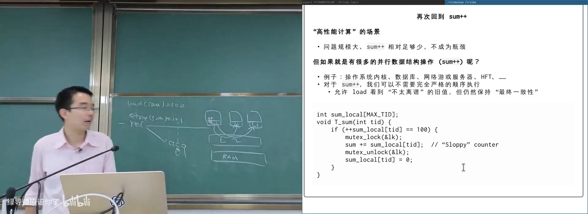

### 5.4 用时间上限保证旧值不会太旧

*(参考时间: 01:06)*

只按阈值刷新，在流量低时可能长时间不更新。可以增加超时：

```text
if local >= 100 or elapsed >= 1ms:
    flush local to global
```

这样任何读者看到的值最多落后约 1 毫秒。

```mermaid
flowchart TD
    A["本地更新"] --> B{"达到 100 次？"}
    B -- "是" --> E["Flush"]
    B -- "否" --> C{"超过 1ms？"}
    C -- "是" --> E
    C -- "否" --> A
    E --> F["全局 sum 更新"]
```

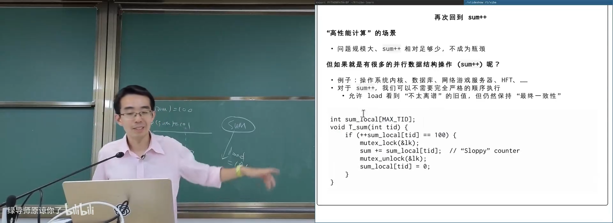

---

## 6. Thread-Local Storage

### 6.1 `thread_local`

*(参考时间: 01:07)*

C++11 / C23：

```c
thread_local int sum_local;

thread_local int x = 42;
```

每个线程得到独立副本。

局部作用域中不能定义 `thread_local`，因为“每次函数调用的栈变量”和“每线程一份”语义冲突。

```mermaid
flowchart TD
    A["thread_local int x"] --> B["Thread 1 独立 x"]
    A --> C["Thread 2 独立 x"]
    A --> D["Thread 3 独立 x"]
    B --> E["地址互不相同"]
    C --> E
    D --> E
```


### 6.2 TLS 地址

*(参考时间: 01:08)*

访问方式：

```text
global x   → RIP-relative
local y    → RSP-relative
thread_local z → TLS base + offset
```

x86-64 利用 `fs` 段寄存器保存当前线程的 TLS base。

```mermaid
flowchart LR
    A["全局变量"] --> B["RIP / 数据区"]
    C["栈变量"] --> D["RSP + offset"]
    E["thread_local"] --> F["FS base + TLS offset"]
```

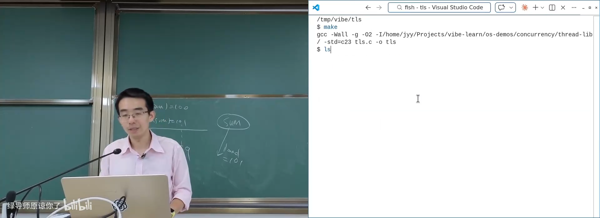

### 6.3 汇编与 `.tdata`

*(参考时间: 01:09)*

线程局部变量存放在：

- `.tdata`：有初值的模板数据；
- `.tbss`：零初始化数据；
- TLS 区域大小在编译时确定。

```mermaid
flowchart TD
    A[".tdata"] --> B["有初值的 TLS 模板"]
    C[".tbss"] --> D["零初始化 TLS"]
    B --> E["线程创建时复制 / 初始化"]
    D --> E
    E --> F["线程私有 TLS 区域"]
```


### 6.4 初始值由谁设置

*(参考时间: 01:11)*

`thread_local int x = 42` 的 42 首先位于 ELF 的 TLS 模板中。

线程创建时，运行时或 libc：

1. 分配线程控制块；
2. 分配栈和 TLS 区域；
3. 把 `.tdata` 模板复制到新线程 TLS；
4. 设置 `fs` base；
5. 再启动线程函数。

```mermaid
flowchart TD
    A["创建线程"] --> B["分配栈 / TCB / TLS"]
    B --> C["复制 .tdata 初值"]
    C --> D["设置 FS / TLS base"]
    D --> E["启动线程函数"]
    E --> F["thread_local x 初始为 42"]
```

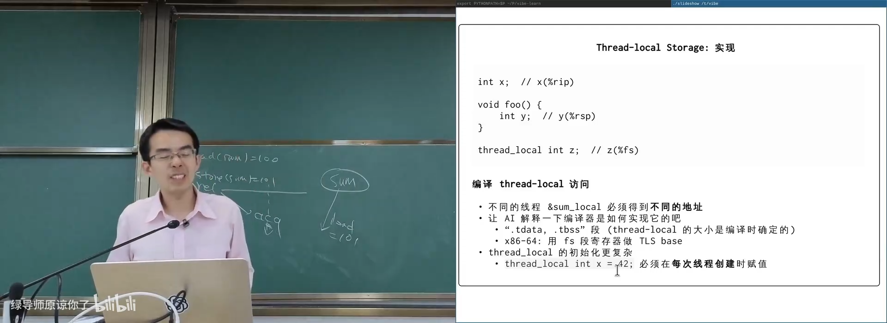

---

## 7. 细分锁

### 7.1 数据结构天生具有局部性

*(参考时间: 01:16)*

数据结构以分散方式存储：

- 数组；
- 链表；
- 平衡树；
- 图；
- 哈希表。

访问不同元素往往互不冲突。

```mermaid
flowchart LR
    A["整个数据结构一把大锁"] --> B["所有访问排队"]
    B --> C["扩展性差"]
    D["按元素 / 分段上锁"] --> E["不同部分并行"]
    E --> F["冲突时才排队"]
```

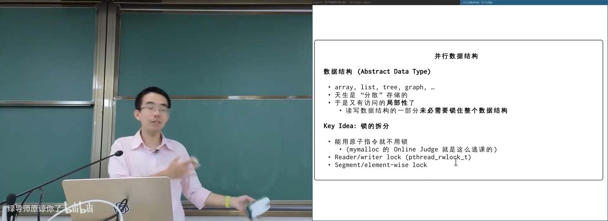

### 7.2 三种常见锁拆分方式

*(参考时间: 01:19)*

1. 能用原子指令，就不用锁；
2. 区分读锁与写锁；
3. 按分段 / 元素加锁。

```mermaid
flowchart TD
    A["锁拆分"] --> B["Atomic"]
    A --> C["Reader / Writer Lock"]
    A --> D["Segment / Element Lock"]
    B --> E["最常见数值更新"]
    C --> F["多读少写"]
    D --> G["哈希表 / 数组 / 树"]
```

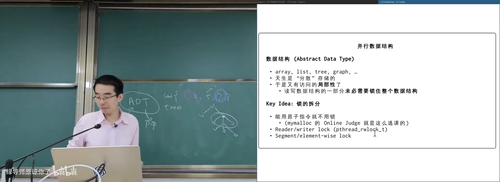

### 7.3 在线评测的原子日志

*(参考时间: 01:21)*

课程 Online Judge 使用大日志数组记录并发操作：

```c
size_t slot = atomic_fetch_add(&tail, 1);
log[slot] = event;
```

- 原子计数器负责分配唯一槽位；
- 每个线程写入自己的槽位；
- 读者按顺序分析日志。

```mermaid
flowchart LR
    A["T1 分配 slot"] --> D["大日志数组"]
    B["T2 分配 slot"] --> D
    C["T3 分配 slot"] --> D
    E["原子 tail++"] --> A
    E --> B
    E --> C
    D --> F["顺序分析日志"]
```

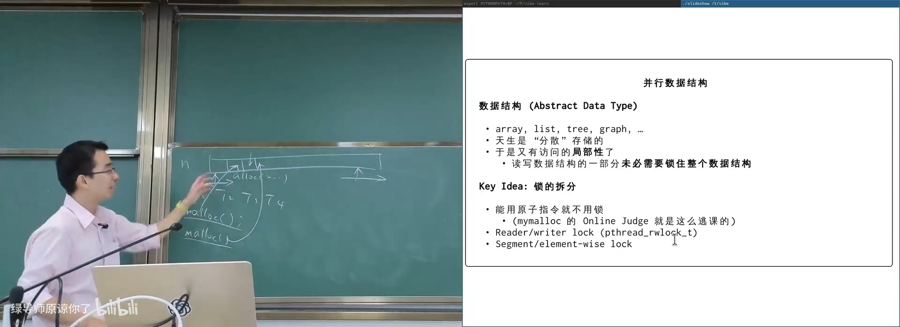

### 7.4 哈希表按 bucket 加锁

*(参考时间: 01:22)*

```c
size_t b = hash(key) % nbuckets;
lock(buckets[b].lock);
/* lookup / insert */
unlock(buckets[b].lock);
```

不同 bucket 可并行。

```mermaid
flowchart TD
    A["key"] --> B["hash(key) % N"]
    B --> C["bucket index"]
    C --> D["bucket lock"]
    D --> E["查找 / 插入 / 删除"]
```

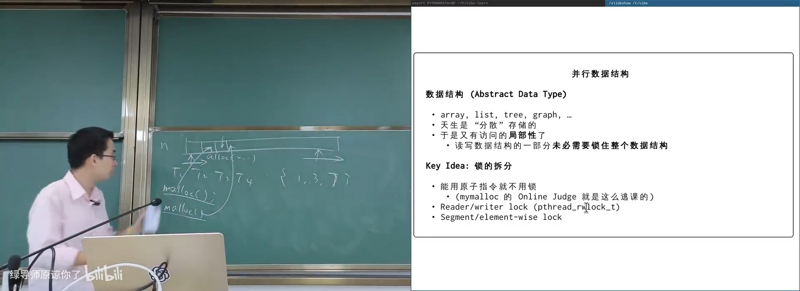

### 7.5 Open Addressing 的 Tombstone

*(参考时间: 01:24)*

开放寻址中，冲突元素会沿探测序列放置：

```text
X at h(X)
Z at next(h(X))
W at next(next(h(X)))
```

删除 Z 不能直接清空，否则查找 W 的路径断裂。

必须写入 tombstone，表示“此处曾占用，仍需继续探测”。

```mermaid
flowchart LR
    A["h(X)"] --> B["X"]
    B --> C["Z"]
    C --> D["W"]
    C -->|"直接删除"| E["查找 W 提前终止"]
    C -->|"Tombstone"| F["查找继续到 W"]
```

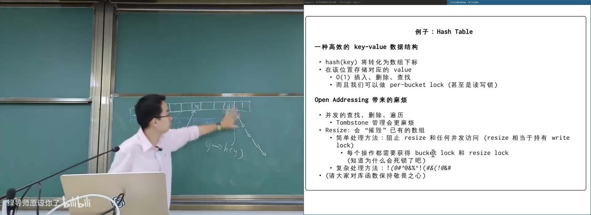

### 7.6 Resize：并发哈希表最难的时刻

*(参考时间: 01:25)*

扩容时：

- 分配新表；
- 迁移所有旧元素；
- 同时处理并发查找、插入和删除；
- 不能长时间冻结整个数据结构；
- 需要细粒度锁或渐进式迁移。

```mermaid
flowchart TD
    A["触发 resize"] --> B["分配 1.5x 新表"]
    B --> C["逐 bucket 迁移"]
    C --> D{"迁移期间仍有操作？"}
    D -- "大锁" --> E["全表暂停，简单但慢"]
    D -- "细粒度" --> F["允许并发，复杂且易错"]
```

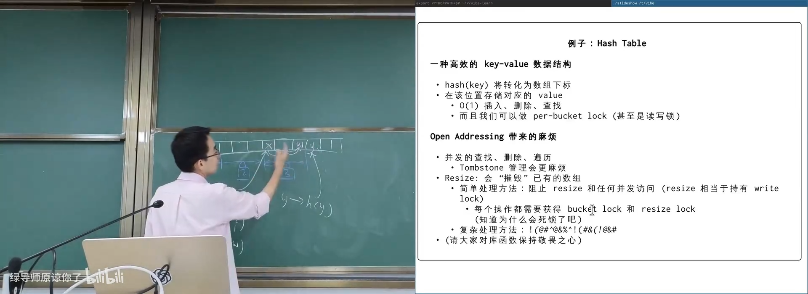

---

## 8. 总结：减少同步，而不是消灭同步

这一讲从 `sum++` 的扩展性出发，建立了完整优化路线：

- 完全 serializability 保证正确，但限制 scalability；
- Scale Up 增加单机 CPU / 线程，Scale Out 增加机器；
- 并行问题的本质是计算图；
- 任务划分不能过细，否则同步开销主导；
- HPC 利用空间局部性、网格和循环级并行；
- OpenMP 通过 pragma 简洁并行化独立循环；
- Mandelbrot 是可按照像素和块划分的 embarrassingly parallel 任务；
- HPC 真正的瓶颈包括网络、功耗、散热和容错；
- 并行数据结构的目标是减少共享写；
- Sloppy Counter 用线程本地累计降低全局锁频率；
- 超时可给松可见性提供延迟上限；
- `thread_local` 为每个线程提供独立变量；
- TLS 通过 `.tdata`、`.tbss` 和线程基址实现；
- 锁拆分包括 atomic、reader-writer lock、segment lock；
- 哈希表可按 bucket 加锁；
- Open Addressing 需要 Tombstone；
- Resize 是并发哈希表最复杂的路径。

```mermaid
flowchart LR
    A["完全串行化"] --> B["识别局部性"]
    B --> C["计算图分块"]
    C --> D["线程本地状态"]
    D --> E["松可见性 / 延迟合并"]
    E --> F["细粒度锁 / 原子操作"]
    F --> G["Scale Up / Scale Out"]
```

性能优化的核心原则可以概括为：

> 把绝大部分工作留在本地，只在真正必要的共享边界上同步；始终依据真实 workload 测量，而不是凭直觉承诺 scalability。

---

## 附：官方参考与延伸阅读

以下链接来自官方讲义第 18 讲及课堂内容：

- [不同方式求和实验](https://jyywiki.cn/OS/demos/concurrency/sum-experiment)
- [Cray-1: The World's Most Expensive Love Seat](https://dl.acm.org/doi/10.1145/359327.359336)
- [MPI Tutorials](https://hpc-tutorials.llnl.gov/mpi/)
- [OpenMP](https://www.openmp.org/)
- [HPC China TOP100](https://hpc100.top/top100/24/)
- [Mandelbrot Set Walkthrough](https://cn.mathigon.org/course/fractals/mandelbrot)
- [Mandelbrot demo](https://jyywiki.cn/OS/demos/concurrency/mandelbrot)
- [Andrej Karpathy, llm.c](https://github.com/karpathy/llm.c/blob/master/train_gpt2.c)
- [Thread-local Storage demo](https://jyywiki.cn/OS/demos/concurrency/tls)

官方课程资料：

- [课程主页](https://jyywiki.cn/OS/2026/)
- [第 18 讲讲义：并行算法与数据结构](https://jyywiki.cn/OS/2026/lect18.md)
- [视频：18 - 并行算法和数据结构](https://www.bilibili.com/video/BV1WqdTBiEkN/)

> **版权与署名**：本讲课程材料由蒋炎岩（jyy）编写。课程讲义与幻灯片采用 [Creative Commons BY-NC 4.0](http://creativecommons.org/licenses/by-nc/4.0/) 许可；本电子书保留课程出处、作者署名与许可说明。
