# 协程、Goroutine 与异步编程：用不同抽象描述计算图

> **课程**：2026 春季学期《操作系统原理》  
> **讲师**：蒋炎岩（jyy）  
> **官方课程主页**：<https://jyywiki.cn/OS/2026/>  
> **官方讲义**：<https://jyywiki.cn/OS/2026/lect19.md>  
> **视频来源**：[Bilibili BV1dVRdBpEze](https://www.bilibili.com/video/BV1dVRdBpEze/)  
> **版权说明**：课程讲义与幻灯片归蒋炎岩所有，采用 [Creative Commons BY-NC 4.0](http://creativecommons.org/licenses/by-nc/4.0/) 许可；本电子书是对课堂讲授的书面化重构，保留出处与许可说明。

## 导语：并行编程真正要描述的是计算图

*(参考时间: 00:00)*

前几讲逐步引入了并发程序、互斥、同步、并发 bug 和并行数据结构。贯穿这些内容的核心概念一直是**计算图**：

- 节点表示计算；
- 有向边表示依赖；
- 独立节点可以并行；
- 有依赖的节点必须满足先后顺序。

这一讲进一步追问：

> 能否让“创建一个计算节点”的代价接近一次函数调用，同时保留线程编程的直觉？

课程从两个方向给出答案：

1. **轻量化线程**：协程与 goroutine，把创建、切换和同步成本降下来；
2. **在语言中描述计算图**：Promise、Future、`async/await`，让程序直接表达异步依赖。

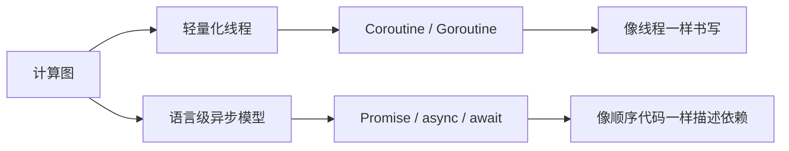
```mermaid
flowchart LR
    A["计算图"] --> B["轻量化线程"]
    A --> C["语言级异步模型"]
    B --> D["Coroutine / Goroutine"]
    C --> E["Promise / async / await"]
    D --> F["像线程一样书写"]
    E --> G["像顺序代码一样描述依赖"]
```

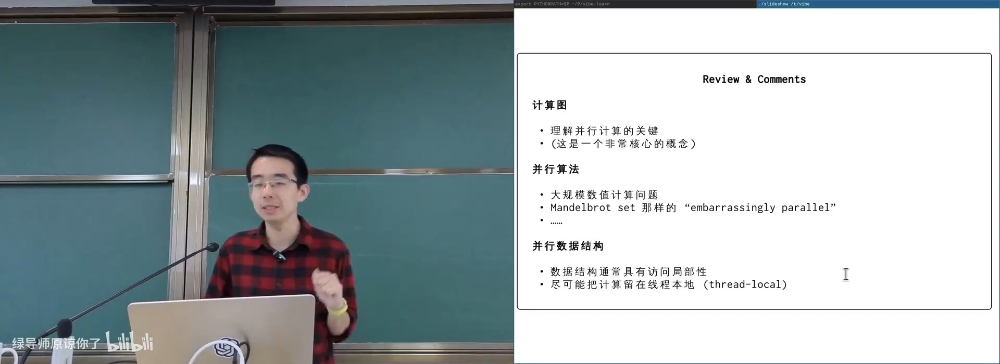

---

## 1. 性能优化必须从真实 workload 出发

### 1.1 不要做脱离 workload 的优化

*(参考时间: 00:01)*

讲师首先回顾上节课的 `malloc/free`：

- 一把大锁可以保证正确性，并轻松通过功能测试；
- 但高并发测试会暴露扩展性问题；
- 优化不能凭直觉，必须先理解真实请求的分布。

> Premature optimization is the root of all evil.
>
> —— D. E. Knuth

算法课通常关心人为构造的最坏情况，而实际系统更关心真实 workload 下的整体表现。讲师提到，攻击者也可能故意制造最坏输入。例如，精心构造一批哈希键，让它们映射到同一个 bucket，就能让服务退化，这是复杂性攻击的一种形式。

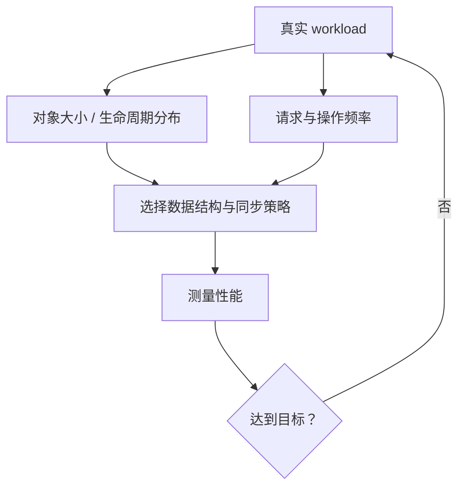
```mermaid
flowchart TD
    A["真实 workload"] --> B["对象大小 / 生命周期分布"]
    A --> C["请求与操作频率"]
    B --> D["选择数据结构与同步策略"]
    C --> D
    D --> E["测量性能"]
    E --> F{"达到目标？"}
    F -- "否" --> A
```

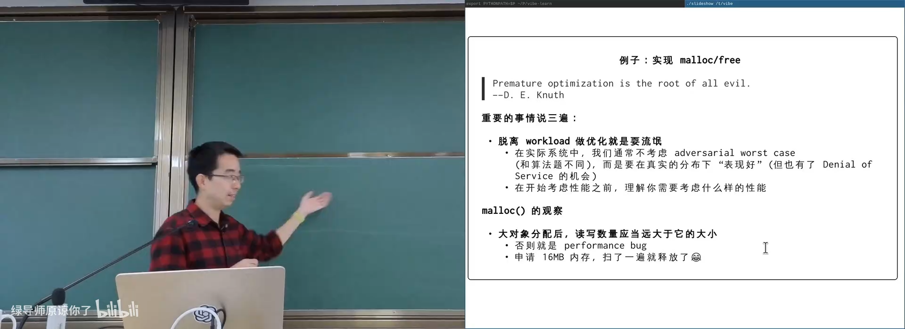

### 1.2 大对象与小对象的行为完全不同

*(参考时间: 00:04)*

对 `malloc/free` 的第一个观察是：

- 大对象通常会被反复读写；
- 如果申请 100 MB，却只访问几个字节就释放，这通常是 performance bug；
- 小对象创建频繁、生命周期短；
- 大对象数量少、生命周期长，往往服务于全局状态或长期缓冲区。

因此，真正需要优化的是**小对象分配与回收的扩展性**。

讲师用“桌子上的钥匙”作类比：如果某个 slab 主要由当前线程使用，那么线程拿自己桌上的钥匙几乎没有竞争；只有对象跨线程传递时，其他线程才可能来抢这把钥匙。

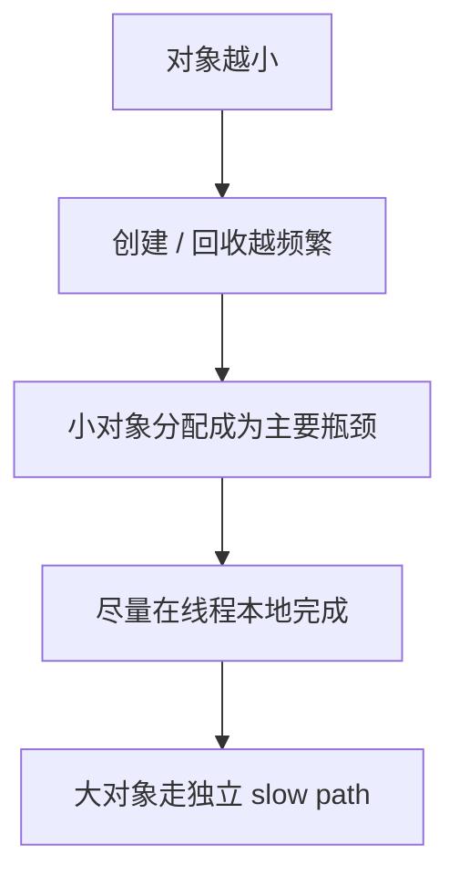
```mermaid
flowchart TD
    A["对象越小"] --> B["创建 / 回收越频繁"]
    B --> C["小对象分配成为主要瓶颈"]
    C --> D["尽量在线程本地完成"]
    D --> E["大对象走独立 slow path"]
```

### 1.3 Segregated Lists 与 slab

*(参考时间: 00:08)*

每个线程可以持有若干 slab。一个 slab 内部再切成大小相等的对象：

```text
thread-local slab
  16B free list:  [ ] -> [ ] -> [ ] -> ...
  32B free list:  [ ] -> [ ] -> [ ] -> ...
  64B free list:  [ ] -> [ ] -> [ ] -> ...
```

分配 17 字节时，选择不小于 17 字节的桶，从对应 free list 弹出一个块；释放时再插回链表。

- Fast path：线程本地完成，近似 O(1)；
- Slow path：本地 slab 用完，再向全局分配器或 `mmap()` 申请新的 slab。

这种按大小分类的空闲链表就是 **segregated free lists**。讲师借此提醒：现有研究远多于教科书中的几种算法，真正重要的问题往往会吸引大量工程与学术优化。

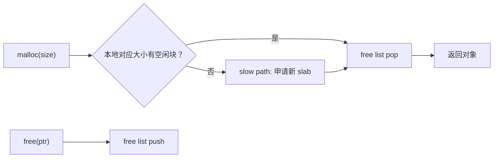
```mermaid
flowchart LR
    A["malloc(size)"] --> B{"本地对应大小有空闲块？"}
    B -- "是" --> C["free list pop"]
    C --> D["返回对象"]
    B -- "否" --> E["slow path: 申请新 slab"]
    E --> C
    F["free(ptr)"] --> G["free list push"]
```

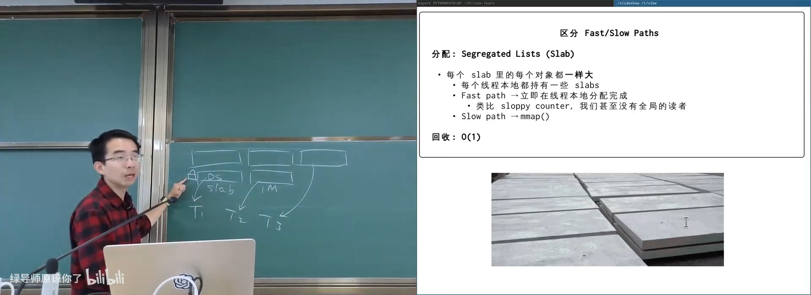

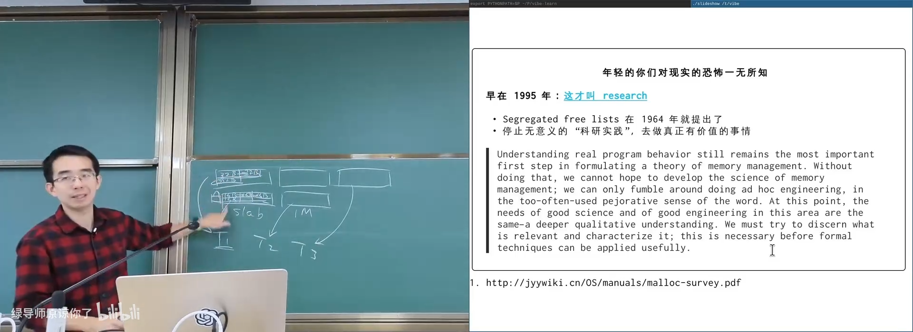

---

## 2. 线程不是免费的

### 2.1 线程消耗看不见的资源

*(参考时间: 00:13)*

线程至少需要：

- 用户态线程栈；
- 内核中的线程、调度与统计结构；
- 线程号或其他标识资源；
- 上下文切换时保存和恢复寄存器的成本。

Linux 中线程默认可能有 8 MB 虚拟栈，但栈页按需分配，所以不会在创建时一次性占满 8 MB 物理内存。

讲师进一步回到 `/proc/[pid]/`：

> 这些文件不是“凭空存在”的，而是操作系统内部数据结构的投影。

### 2.2 实测一个线程的成本

*(参考时间: 00:16)*

可以通过一个实验估算线程成本：

1. 在线程创建前记录系统资源；
2. 创建大量只做少量工作的线程；
3. 再记录资源变化；
4. 用差值除以线程数量。

课程演示得到约 **16.9 KB/线程**，该数值包含内核数据结构的增长，不只是用户栈。具体数值会随内核版本和系统状态变化，但结论明确：线程有不可忽略的固定开销。

线程切换也必须进入内核：

```text
保存当前线程寄存器
   ↓
选择另一个线程
   ↓
恢复目标线程寄存器
   ↓
返回用户态继续执行
```

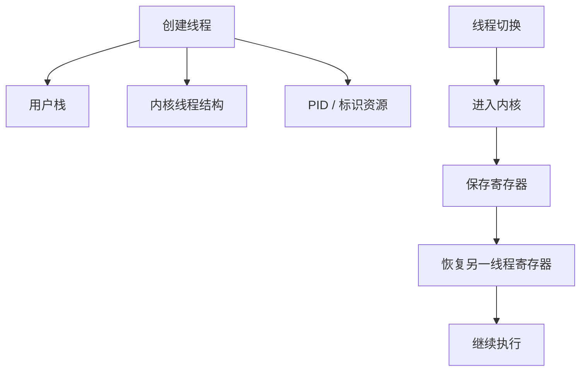
```mermaid
flowchart TD
    A["创建线程"] --> B["用户栈"]
    A --> C["内核线程结构"]
    A --> D["PID / 标识资源"]
    E["线程切换"] --> F["进入内核"]
    F --> G["保存寄存器"]
    G --> H["恢复另一线程寄存器"]
    H --> I["继续执行"]
```

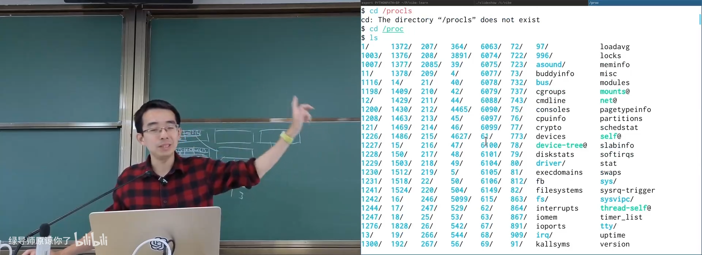

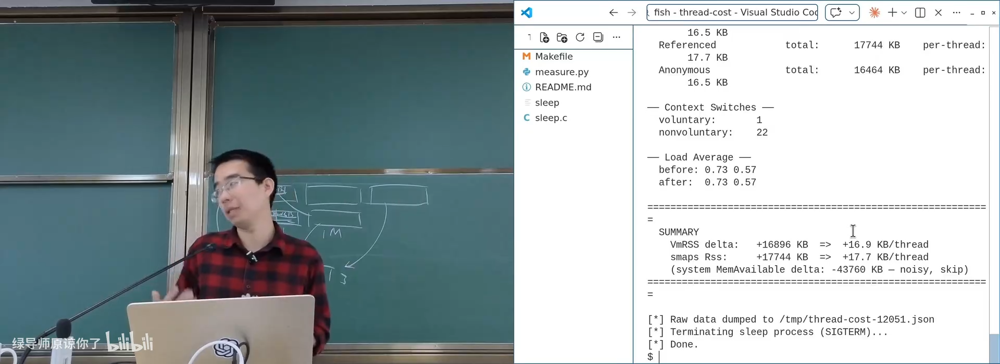

### 2.3 问题：线程创建远远贵于函数调用

*(参考时间: 00:20)*

计算图中的每个节点本质上是一个计算，而编程语言对计算的抽象是函数。于是矛盾出现了：

- 描述计算：一次函数调用；
- 并行执行计算：创建一个线程；
- 两者成本相差巨大。

如果计算图有 100 万个细粒度节点，直接创建 100 万个线程并不可行。

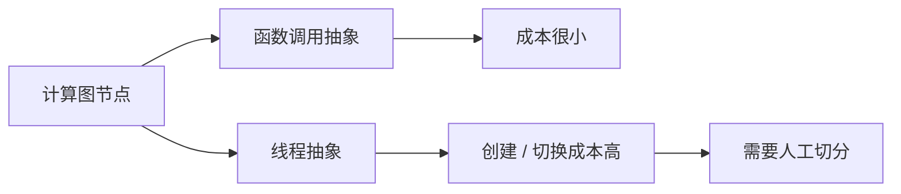
```mermaid
flowchart LR
    A["计算图节点"] --> B["函数调用抽象"]
    B --> C["成本很小"]
    A --> D["线程抽象"]
    D --> E["创建 / 切换成本高"]
    E --> F["需要人工切分"]
```

讲师给出两条路线：

1. 让 `spawn/join` 接近函数调用：协程、goroutine；
2. 改变语言执行模型，直接描述异步计算图：Promise、Future、`async/await`。

```c
t1 = spawn(f);
t2 = spawn(g);
t3 = spawn(h);
join(t1); join(t2); join(t3);
```

```c
j1 = enqueue_job(f);
j2 = enqueue_job(g);
j3 = enqueue_job(h);
wait_job_complete(j1);
wait_job_complete(j2);
wait_job_complete(j3);
```

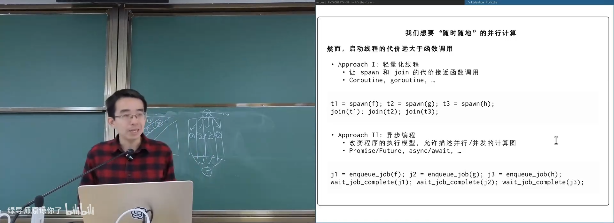

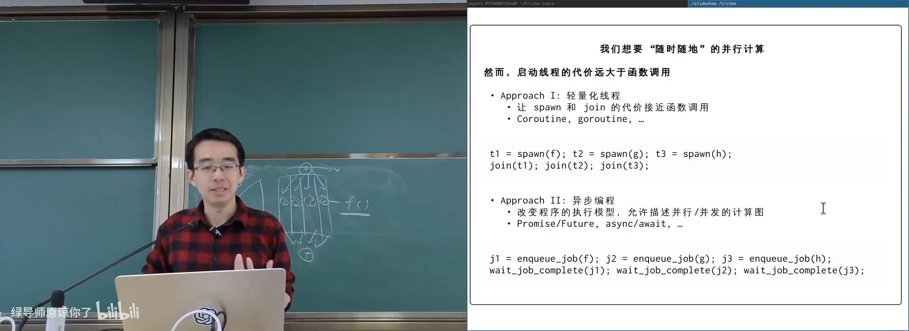

---

## 3. 方案一：在用户空间实现协程

### 3.1 从 Python generator 看栈式线程

*(参考时间: 00:25)*

Python generator 可以在不创建新的操作系统线程时维护多个执行流：

```python
def T_worker(i):
    j = 0
    while True:
        yield (i, j)
        j += 1

threads = [T_worker(i) for i in range(1000000)]
while True:
    t = random.choice(threads)
    t.send(None)
```

`yield` 会保存当前函数的执行状态，并把控制权返回给调度者；下一次 `send()` 再从暂停点继续。

结合 SimpleC 模型：

- 每个函数调用对应一个栈帧；
- 每个栈帧保存局部变量和程序计数器；
- 多线程程序可以看成多个独立栈；
- `yield` 相当于主动切换当前执行栈。

这和操作系统线程的行为相似，但切换完全发生在用户空间。

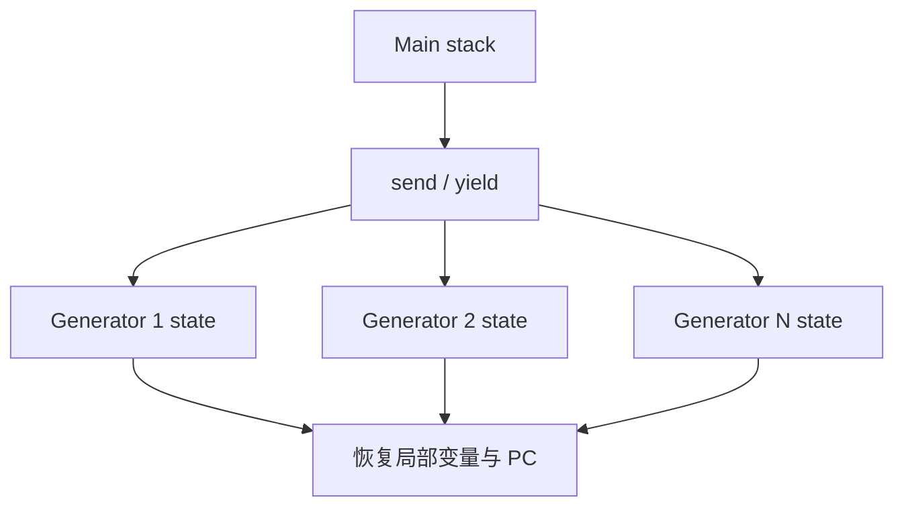
```mermaid
flowchart TD
    A["Main stack"] --> B["send / yield"]
    B --> C["Generator 1 state"]
    B --> D["Generator 2 state"]
    B --> E["Generator N state"]
    C --> F["恢复局部变量与 PC"]
    D --> F
    E --> F
```

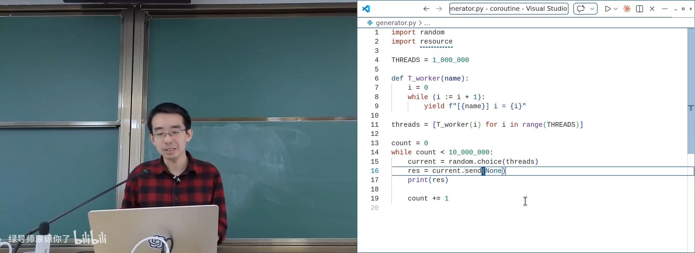

### 3.2 C 中的栈切换

*(参考时间: 00:30)*

如果在 C 中手工实现协程，可以：

1. 用 `malloc` 为每个协程分配独立栈；
2. 用汇编修改栈指针；
3. 用 `setjmp` 保存寄存器现场；
4. 用 `longjmp` 恢复另一个协程的现场。

```c
void coroutine_create(...);
void coroutine_entry(...);

// local work
coroutine_yield();
```

只要语言支持一级函数或能够捕获局部状态，通常就能够实现无栈协程；C++20 coroutine、Python generator 都可能采用这种思路。


```mermaid
flowchart LR
    A["Coroutine A"] -->|"yield"| B["保存寄存器与栈"]
    B --> C["调度器"]
    C --> D["恢复 Coroutine B"]
    D -->|"yield"| B
```

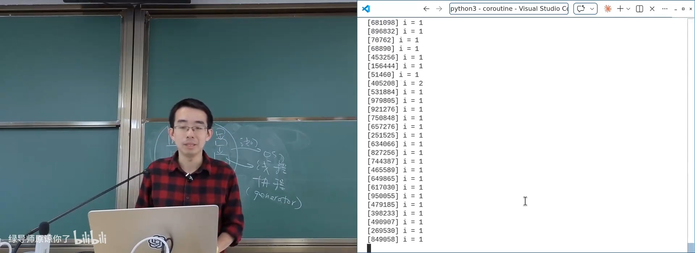

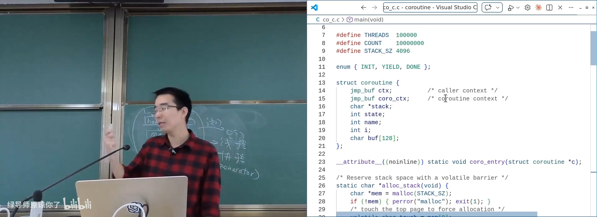

### 3.3 协程的两个致命问题

*(参考时间: 00:35)*

用户态协程虽然轻量，但存在两个限制。

第一，阻塞系统调用会阻塞整个进程：

```text
协程 T1 执行 read(fd)
    ↓
fd 暂时没有数据
    ↓
操作系统让进程睡眠
    ↓
T2、T3…… 全部无法运行
```

第二，不能直接用普通 mutex 做协程间同步：

```text
T1: mutex_lock(&lk)
T1: yield()
T2: mutex_lock(&lk)  // 阻塞整个 OS 线程
    ↓
T1 没有机会继续运行并 unlock
    ↓
AA 型死锁
```

问题的根源是：协程共享一个操作系统线程，而 mutex 是操作系统为线程设计的同步原语。

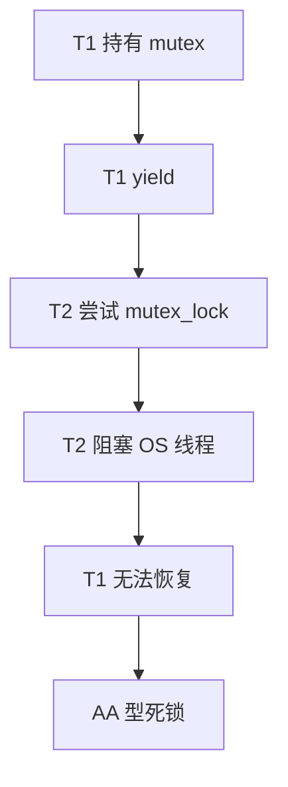
```mermaid
flowchart TD
    A["T1 持有 mutex"] --> B["T1 yield"]
    B --> C["T2 尝试 mutex_lock"]
    C --> D["T2 阻塞 OS 线程"]
    D --> E["T1 无法恢复"]
    E --> F["AA 型死锁"]
```

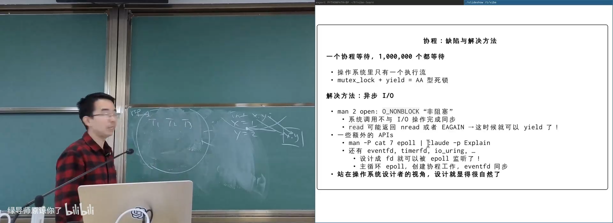

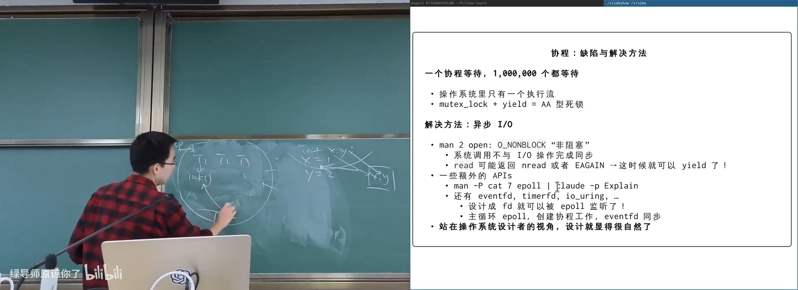

---

## 4. 异步 I/O：让等待变成可调度的状态

### 4.1 `O_NONBLOCK` 与 `EAGAIN`

*(参考时间: 00:39)*

解决阻塞问题的关键是把 I/O 放入非阻塞模式：

```c
int fd = open(path, O_NONBLOCK);

ssize_t n = read(fd, buf, size);
if (n == -1 && errno == EAGAIN) {
    coroutine_yield();
}
```

当数据尚未准备好：

- 普通阻塞 `read` 会让当前线程睡眠；
- 非阻塞 `read` 立即返回 `-1/EAGAIN`；
- 协程可以主动让出 CPU；
- 数据准备好后再回来重试。

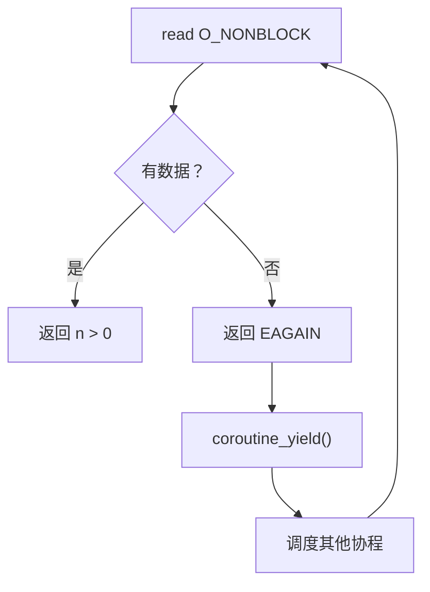
```mermaid
flowchart TD
    A["read O_NONBLOCK"] --> B{"有数据？"}
    B -- "是" --> C["返回 n > 0"]
    B -- "否" --> D["返回 EAGAIN"]
    D --> E["coroutine_yield()"]
    E --> F["调度其他协程"]
    F --> A
```

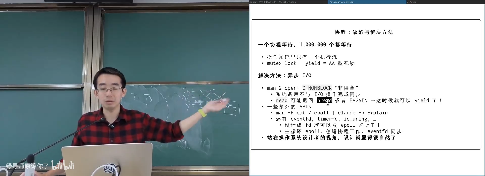

### 4.2 epoll：同时监听大量文件描述符

*(参考时间: 00:41)*

`epoll` 允许一个事件循环同时等待大量文件描述符。任意一个 fd 可读、可写或出现错误，事件循环都能得到通知。

这和信号量有相似之处：

- 可以同时等待多个事件；
- 任何事件就绪都能唤醒调度器；
- 但等待对象是操作系统对象，而不是某个线程私有的 mutex。

其他对象也可以被设计成 fd：

- `eventfd`；
- `timerfd`；
- `signalfd`；
- `io_uring`。

一旦它们都能进入 `epoll`，协程调度器就能统一等待 I/O、定时器和线程间通知。

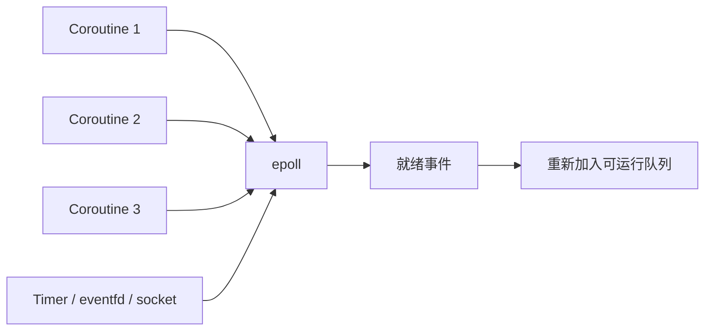
```mermaid
flowchart LR
    A["Coroutine 1"] --> E["epoll"]
    B["Coroutine 2"] --> E
    C["Coroutine 3"] --> E
    D["Timer / eventfd / socket"] --> E
    E --> F["就绪事件"]
    F --> G["重新加入可运行队列"]
```

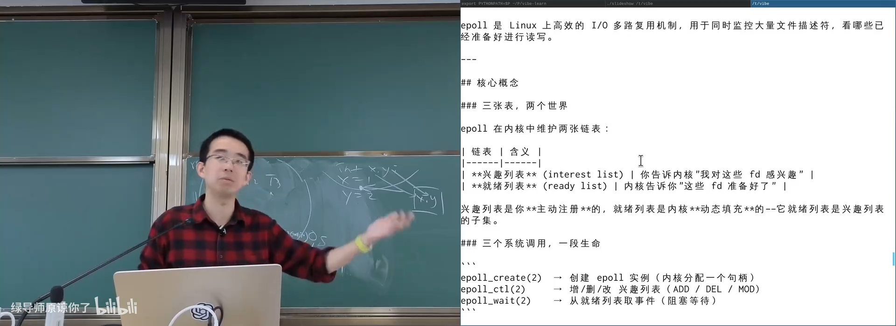

### 4.3 让编译器隐藏异步复杂性

*(参考时间: 00:43)*

程序员希望继续写：

```c
sleep(1);
read(fd, buf, size);
```

但编译器可以把它重写成：

```c
put_my_self_into_sleep(1);
yield();

while (read_async(fd, buf, size) == -EAGAIN) {
    yield();
}
```

也就是说：

> 保留同步的书写体验，把异步调度交给编译器和运行时。

这正是 goroutine 的核心思路。

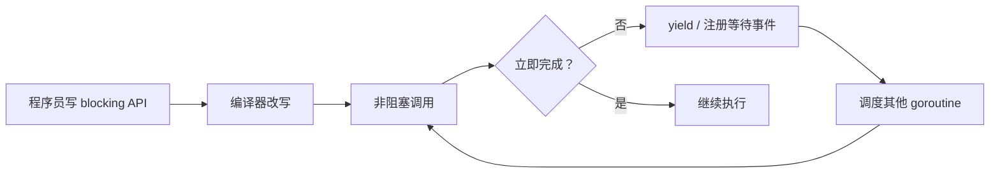
```mermaid
flowchart LR
    A["程序员写 blocking API"] --> B["编译器改写"]
    B --> C["非阻塞调用"]
    C --> D{"立即完成？"}
    D -- "否" --> E["yield / 注册等待事件"]
    E --> F["调度其他 goroutine"]
    D -- "是" --> G["继续执行"]
    F --> C
```

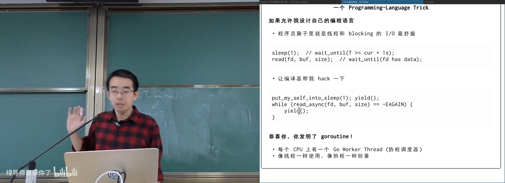

---

## 5. Goroutine：像线程一样使用，像协程一样轻量

### 5.1 Go 运行时像一个小小的操作系统

*(参考时间: 00:46)*

一个 Go 程序可以有多个操作系统线程，每个线程运行一个 worker loop：

1. 从可运行队列取 goroutine；
2. 执行一段代码；
3. 遇到阻塞 I/O 或同步点时登记等待；
4. 把当前 goroutine 移出运行队列；
5. 继续执行其他 goroutine。

标准库中的阻塞 API 会被运行时接管，转换为非阻塞操作并注册到事件循环。这样：

- goroutine 的创建和切换很轻量；
- 多个 goroutine 可以真正分布到多个 CPU 上并行；
- 编程模型仍然接近普通线程。

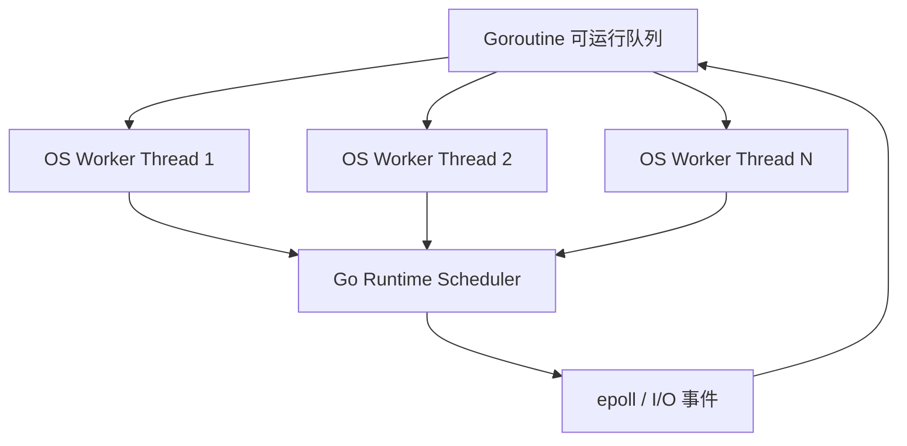
```mermaid
flowchart TD
    Q["Goroutine 可运行队列"] --> W1["OS Worker Thread 1"]
    Q --> W2["OS Worker Thread 2"]
    Q --> W3["OS Worker Thread N"]
    W1 --> R["Go Runtime Scheduler"]
    W2 --> R
    W3 --> R
    R --> E["epoll / I/O 事件"]
    E --> Q
```

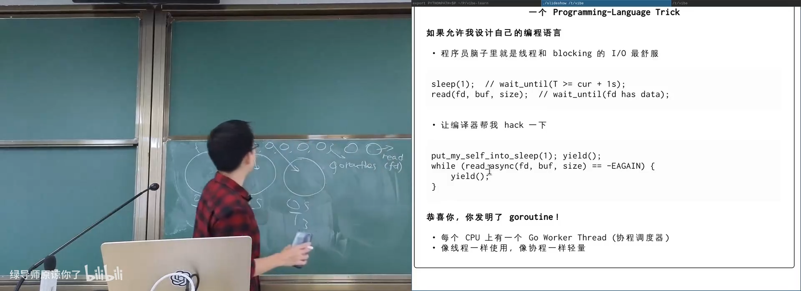

### 5.2 通过 channel 同时完成同步与通信

*(参考时间: 00:48)*

Effective Go 中有一句著名原则：

> Do not communicate by sharing memory; instead, share memory by communicating.

传统互斥锁、信号量和条件变量解决了同步，但数据传递仍要依赖共享内存。生产者必须先获得 buffer，再手工保护和维护 buffer。

UNIX 管道则天然表达了生产者-消费者计算图：

```bash
(cat *.txt; cat *.cpp) | wc -l
```

- 两个 `cat` 产生数据；
- `wc -l` 消费数据；
- 管道负责数据传递；
- 阻塞和唤醒由内核完成。

Go 把这种思想引入 goroutine：

```go
ch := make(chan int)

go func() {
    ch <- 42
}()

value := <-ch
```

channel 既可以传递数据，也可以表达“生产完成后消费者才能继续”的依赖边。

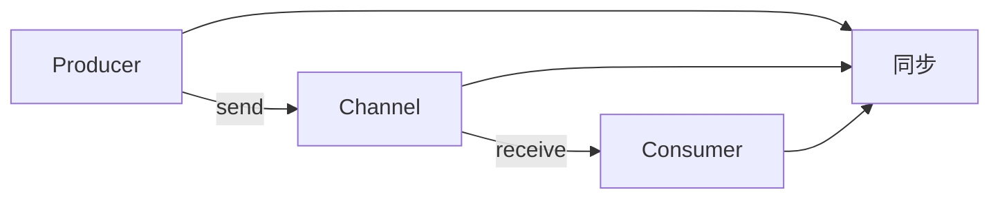
```mermaid
flowchart LR
    A["Producer"] -->|"send"| C["Channel"]
    C -->|"receive"| B["Consumer"]
    A --> D["同步"]
    C --> D
    B --> D
```

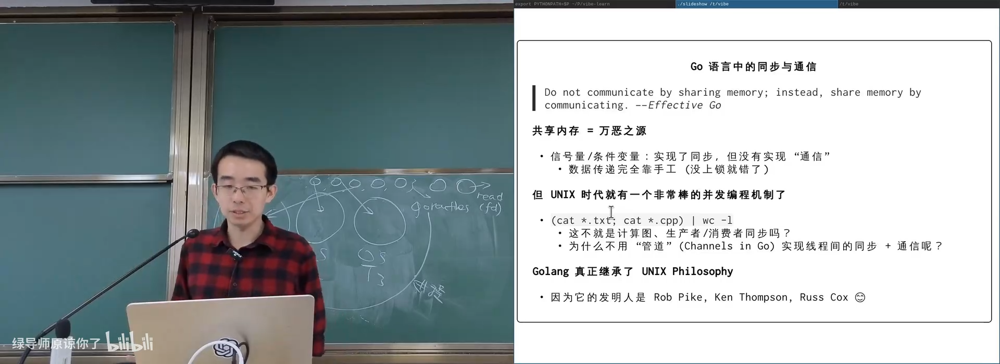

### 5.3 Mandelbrot-Go：goroutine 与 channel 的配合

*(参考时间: 00:51)*

课程给出一个 Go 版 Mandelbrot：

- 按图像横向条带切分工作；
- 每个 worker goroutine 计算一个区域；
- worker 完成后向 `done` channel 汇报；
- monitor goroutine 用 `select` 同时监听完成消息和定时 tick；
- 全部完成后再写出 PNG 文件。

示意结构：

```go
for i := 0; i < stripes; i++ {
    go worker(low[i], high[i], done)
}

go monitor(done, tick, finish)
```

讲师强调，goroutine 的创建成本足够低，因此代码可以更自然地把计算图直接写成 `go ...`。

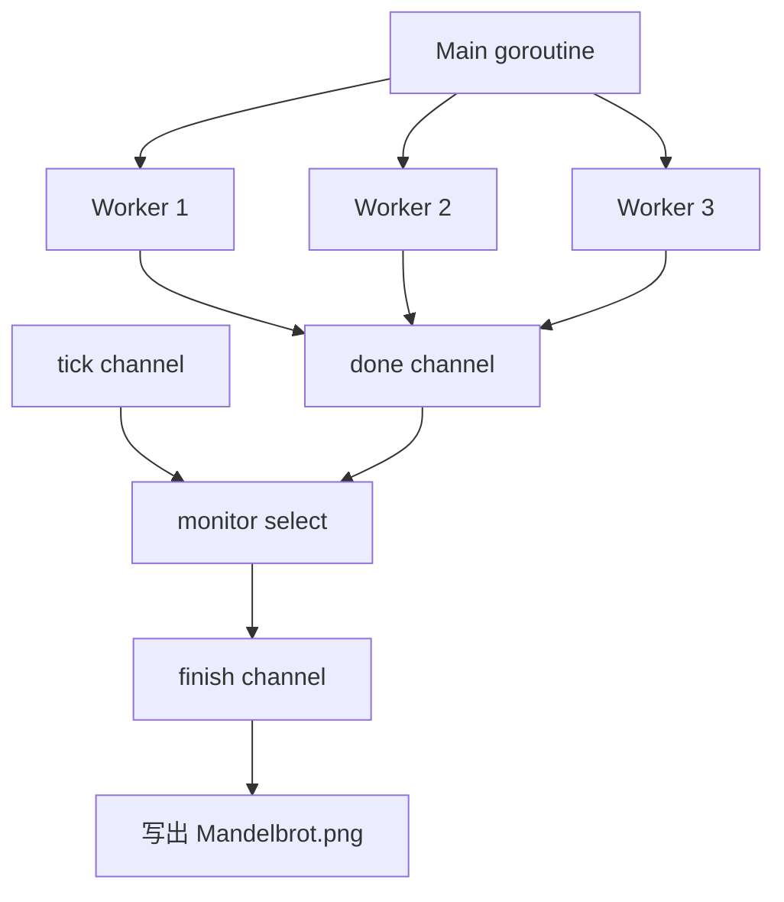
```mermaid
flowchart TD
    M["Main goroutine"] --> W1["Worker 1"]
    M --> W2["Worker 2"]
    M --> W3["Worker 3"]
    W1 --> D["done channel"]
    W2 --> D
    W3 --> D
    T["tick channel"] --> S["monitor select"]
    D --> S
    S --> F["finish channel"]
    F --> P["写出 Mandelbrot.png"]
```

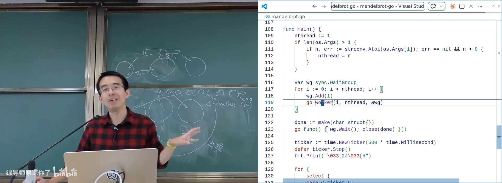

---

## 6. 另一条世界线：JavaScript、Web 与异步编程

### 6.1 十天诞生的语言

*(参考时间: 00:54)*

1995 年，Brendan Eich 加入 Netscape，被要求设计一种嵌入网页的脚本语言。他在很短时间内融合了 C、Java、Scheme、Self 等语言的特征。

由于他本人更关注函数式编程，JavaScript 很早就拥有了**一等函数**。这成为后来回调、事件处理和 Promise 的基础。

早期 JavaScript 也留下了许多糟糕设计：

- `this` 是动态绑定的；
- 宽松相等规则复杂；
- 同一个值在不同上下文中可能表现不同；
- 容易写出“看起来正确、换一个输入就出错”的代码。

但动态类型、函数作为参数等特性，也使它能够快速适应 Web 的交互需求。

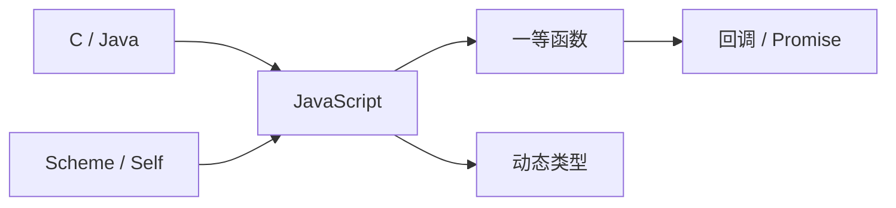
```mermaid
flowchart LR
    A["C / Java"] --> D["JavaScript"]
    B["Scheme / Self"] --> D
    D --> E["一等函数"]
    D --> F["动态类型"]
    E --> G["回调 / Promise"]
```

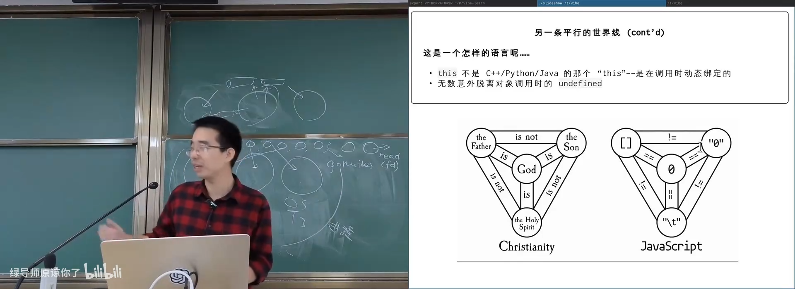

### 6.2 Web 1.0：简单到可以直接手写请求

*(参考时间: 00:57)*

早期 HTTP 很朴素：

```http
GET /index.html HTTP/1.0
Host: example.com
```

服务器的主要工作就是找到文件并返回文本。网页通常由 HTML、`<table>` 和图片拼出来，布局经常依赖切图工程师精确计算像素位置。

讲师用一个“土味页面”复刻了那个时代：

- 没有现代 CSS 布局；
- 浮动窗口和表格承担界面组织；
- 页面刷新意味着重新加载完整文档。


```mermaid
flowchart LR
    A["浏览器发送 HTTP 文本请求"] --> B["Web Server"]
    B --> C["读取 HTML 文件"]
    C --> D["返回 HTML 文本"]
    D --> E["浏览器渲染页面"]
```

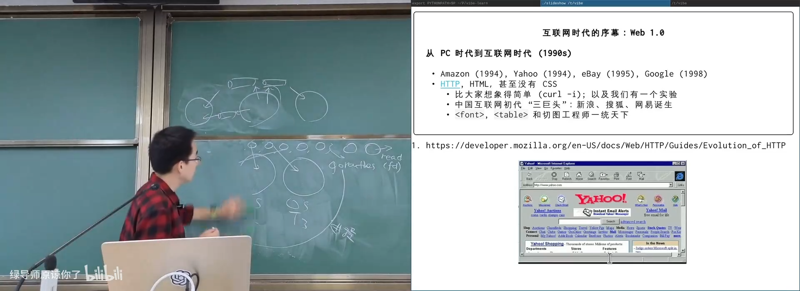

### 6.3 XMLHttpRequest 与后台刷新

*(参考时间: 00:59)*

1999 年前后，`XMLHttpRequest` 出现。JavaScript 可以在页面不重新加载的情况下，请求服务器并把新数据写回 DOM。

这项技术后来被称为 AJAX：Asynchronous JavaScript and XML。当时后端 Java 生态大量使用 XML，所以名字中出现了 XML，而不是今天的 JSON。

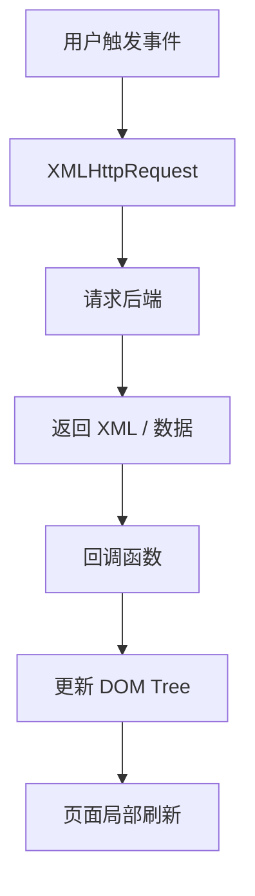
```mermaid
flowchart TD
    A["用户触发事件"] --> B["XMLHttpRequest"]
    B --> C["请求后端"]
    C --> D["返回 XML / 数据"]
    D --> E["回调函数"]
    E --> F["更新 DOM Tree"]
    F --> G["页面局部刷新"]
```

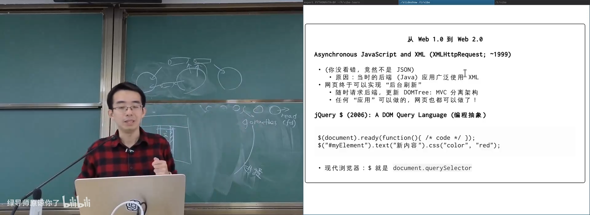

### 6.4 jQuery 与 DOM 查询抽象

*(参考时间: 01:01)*

jQuery 提供了简洁的 DOM 查询与修改接口：

```javascript
$(document).ready(function () {
    $("#myElement")
        .text("新内容")
        .css("color", "red");
});
```

现代浏览器中，`$` 的能力通常可以由 `document.querySelector` 完成。DOM 是一棵树，CSS selector 可以在其中查询节点，再修改文本、样式或插入新的 HTML。

课程演示把一个 1990 年代风格的页面注入新样式：

```text
页面内容不变
    ↓
注入现代 CSS 与少量 JavaScript
    ↓
圆角、输入框、按钮动画全部出现
```

讲师形容为“天亮了”：内容是原来的，但交互和视觉已经现代化。

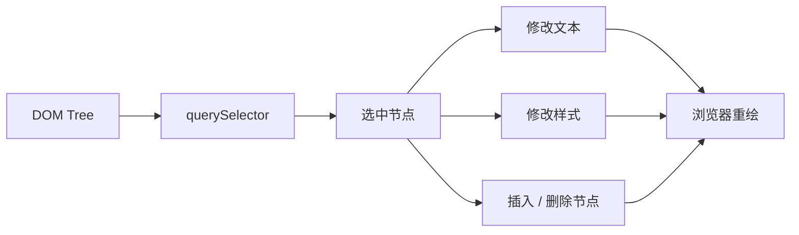
```mermaid
flowchart LR
    A["DOM Tree"] --> B["querySelector"]
    B --> C["选中节点"]
    C --> D["修改文本"]
    C --> E["修改样式"]
    C --> F["插入 / 删除节点"]
    D --> G["浏览器重绘"]
    E --> G
    F --> G
```


---

## 7. JavaScript 的事件并发模型

### 7.1 Run to Completion

*(参考时间: 01:05)*

JavaScript 面向大量普通 Web 开发者，所以不能要求大家掌握 data race、原子性和复杂同步。它选择了一套更简单的并发模型：

- 不允许多个 JavaScript 计算节点真正并行执行；
- 没有 blocking I/O；
- 所有事件处理器按顺序进入队列；
- 一个事件一旦开始，就必须运行到完成。

事件来源包括：

- 页面加载；
- 鼠标点击；
- 键盘输入；
- 网络请求完成；
- 定时器触发。

这使每个事件处理器近似原子执行，避免了多线程共享内存中的数据竞争。但如果事件处理器死循环或计算过久，整个页面都会失去响应。

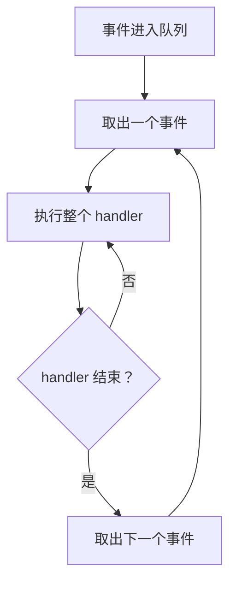
```mermaid
flowchart TD
    A["事件进入队列"] --> B["取出一个事件"]
    B --> C["执行整个 handler"]
    C --> D{"handler 结束？"}
    D -- "否" --> C
    D -- "是" --> E["取出下一个事件"]
    E --> B
```

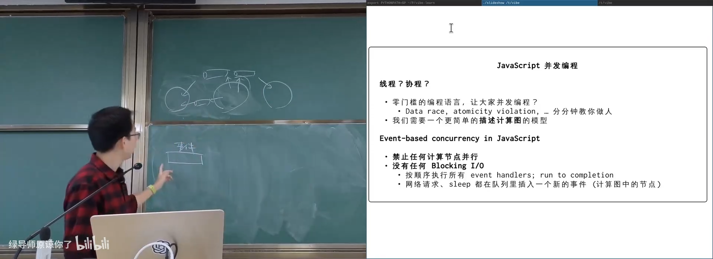

### 7.2 回调创建动态计算图

*(参考时间: 01:08)*

异步请求完成后，浏览器创建一个新事件，调用 `success` 或 `error` 回调：

```javascript
$.ajax({
    url: "/api/user",
    success: function (user) {
        $.ajax({
            url: `/api/user/${user.id}/friends`,
            success: function (friends) {
                $.ajax({
                    url: `/api/friend/${friends[0].id}`,
                    success: function (feed) {
                        render(feed);
                    }
                });
            }
        });
    }
});
```

回调相当于在运行时动态创建计算图节点：

```mermaid
flowchart LR
    A["请求 user"] --> B["success(user)"]
    B --> C["请求 friends"]
    C --> D["success(friends)"]
    D --> E["请求 feed"]
    E --> F["success(feed)"]
    B --> G["error"]
    D --> H["error"]
    F --> I["error"]
```

### 7.3 回调地狱

*(参考时间: 01:10)*

问题不在于回调本身，而在于它破坏了顺序控制结构：

```text
先请求 A
等 A 成功
再请求 B
等 B 成功
再请求 C
```

明明是一个顺序流程，却被拆成多层嵌套函数：

```javascript
requestA(function (a) {
    requestB(a, function (b) {
        requestC(b, function (c) {
            //...
        });
    });
});
```

每增加一步，缩进就加深一层。错误处理和局部变量也越来越难追踪。

> 一个顺序的计算图，被硬生生拆成了多层回调。

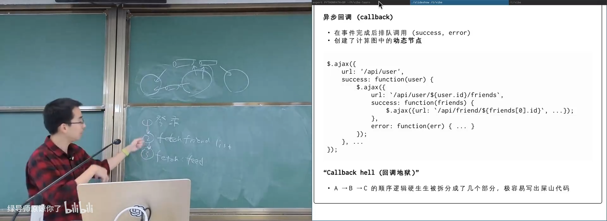

---

## 8. Promise：在语言中直接描述计算图

### 8.1 立即返回的未来结果

*(参考时间: 01:12)*

`fetch` 不会阻塞等待网络：

```javascript
const promise = fetch(url);
```

它立即返回一个 Promise，表示“未来完成的结果”。状态会经历：

```mermaid
stateDiagram-v2
    [*] --> Pending
    Pending --> Fulfilled: 成功
    Pending --> Rejected: 失败
    Fulfilled --> [*]
    Rejected --> [*]
```

Promise 可以继续组合：

```javascript
fetch(url)
    .then(response => response.json())
    .then(data => render(data))
    .catch(error => showError(error));
```

```mermaid
flowchart LR
    A["fetch(url)"] --> B["Promise pending"]
    B --> C["response"]
    C --> D["json()"]
    D --> E["data"]
    E --> F["render(data)"]
    B --> G["catch(error)"]
    C --> G
    D --> G
    E --> G
```

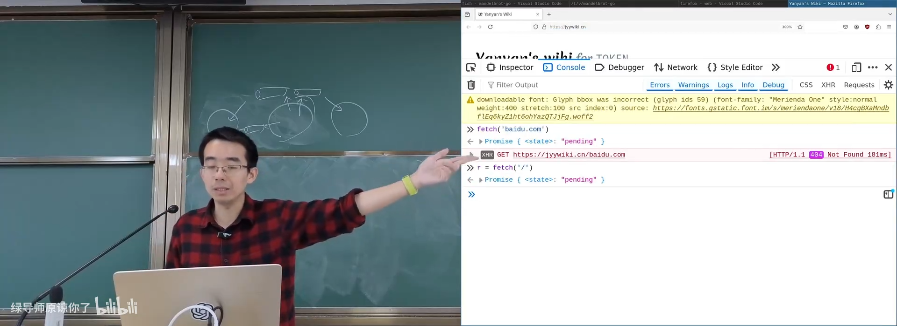

### 8.2 `Promise.all`：语言级 join

*(参考时间: 01:14)*

Promise 可以组合成计算图：

```javascript
Promise.all([
    fetch("/api/a").then(r => r.json()),
    fetch("/api/b").then(r => r.json()),
    fetch("/api/c").then(r => r.json())
])
.then(results => renderAll(results))
.catch(error => showError(error));
```

`Promise.all()` 会：

1. 立即返回一个新的 Promise；
2. 同时启动多个异步任务；
3. 等待全部成功，或在任一失败时进入错误路径。

这和线程中的 `join` 非常相似：

```mermaid
flowchart TD
    A["Promise.all"] --> B1["fetch A"]
    A --> B2["fetch B"]
    A --> B3["fetch C"]
    B1 --> C["全部完成"]
    B2 --> C
    B3 --> C
    C --> D["then(results)"]
    B1 --> E["catch(error)"]
    B2 --> E
    B3 --> E
```

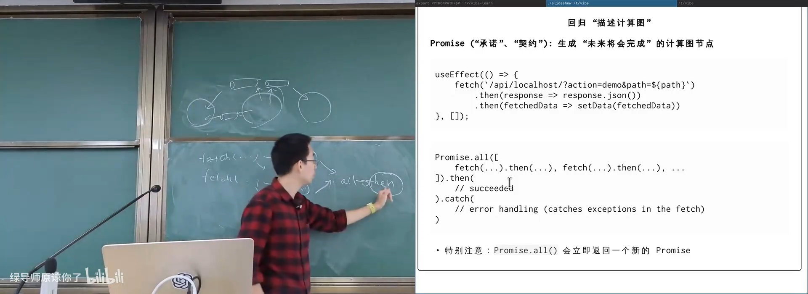

---

## 9. Async/Await：保留顺序直觉

### 9.1 让程序员继续写同步风格

*(参考时间: 01:15)*

Promise 仍然要求把顺序逻辑拆成 `.then()` 链。更自然的方式是：

```javascript
async function fetchData(token) {
    const response = await fetch(
        `/api/submissions/?token=${token}`
    );
    return response.json();
}
```

调用多个异步任务：

```javascript
await Promise.all([
    fetchData("1234"),
    fetchData("5678")
]);
```

关键语义：

- `async function f()` 相当于返回一个 Promise；
- `await promise` 等待 Promise 完成并取出值；
- `await 1` 会得到 `1`，非 Promise 值会被包装后再解析；
- 编译器把顺序逻辑改写成 Promise 链。

```mermaid
flowchart LR
    A["async function"] --> B["返回 Promise"]
    C["await value"] --> D{"value 是 Promise？"}
    D -- "是" --> E["等待 settlement"]
    D -- "否" --> F["Promise.resolve(value)"]
    E --> G["继续顺序代码"]
    F --> G
```

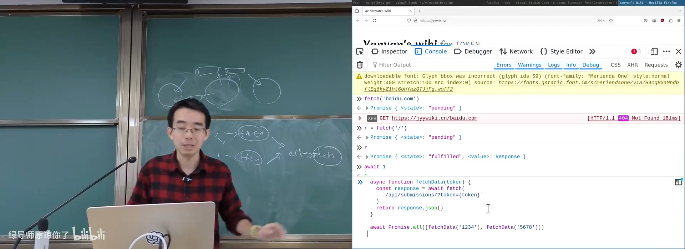

### 9.2 编译器把 await 翻译成动态回调链

*(参考时间: 01:17)*

源代码：

```javascript
let a = await f();
let b = await g(a);
let c = await h(b);
```

概念上可以改写为：

```javascript
Promise.resolve(f())
    .then(a => Promise.resolve(g(a)))
    .then(b => Promise.resolve(h(b)))
    .then(c => finish(c));
```

编译器生成的代码可能仍然是复杂的回调链，但程序员看到的始终是顺序结构：

```text
写下：A -> await B -> await C
生成：A.then(B).then(C)
```

> 同步的写法表达异步流程，剩下的让编译器处理。

```mermaid
flowchart TD
    A["let a = await f()"] --> B["f().then(a => ...)"]
    B --> C["let b = await g(a)"]
    C --> D["g(a).then(b => ...)"]
    D --> E["let c = await h(b)"]
    E --> F["h(b).then(c => ...)"]
```

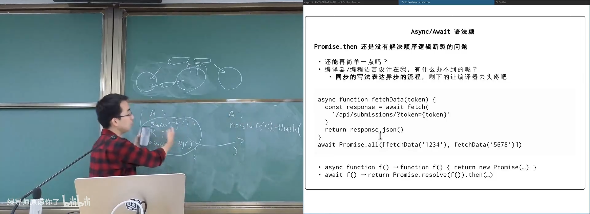

---

## 10. 从浏览器到完整应用生态

*(参考时间: 01:19)*

JavaScript 逐渐从“十天设计的网页脚本”成长为完整应用平台：

- ES6 / ECMAScript 2015 统一了大量库和语法；
- Angular、React、Vue 形成现代前端框架；
- Express、Next、Nest 扩展到服务端；
- Electron 把网页封装成桌面应用，Visual Studio Code 是典型例子；
- Ink 允许用 React 风格构建终端界面；
- WebAssembly 把高性能代码带入浏览器；
- Mermaid、TensorFlow.js、Three.js 扩展了可视化、AI 与 3D 能力。

```mermaid
flowchart TD
    A["HTML / CSS / DOM"] --> B["JavaScript"]
    B --> C["浏览器应用"]
    B --> D["Electron 桌面应用"]
    B --> E["Node.js 服务端"]
    B --> F["WebAssembly"]
    C --> G["React / Vue / Angular"]
    D --> H["VS Code"]
    E --> I["Express / Next / Nest"]
    F --> J["C / C++ 高性能模块"]
```

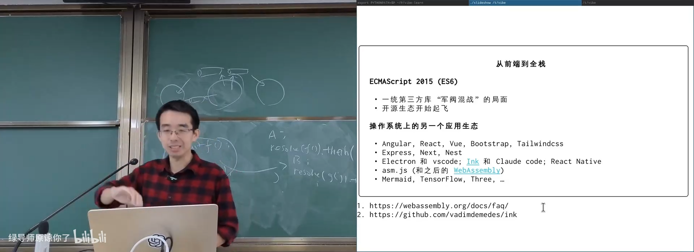

---

## 11. 总结：两条路线，同一个计算图

这一讲从线程成本出发，比较了两条描述计算图的路线。

**路线一：轻量化线程**

- 用户态协程避免每次创建都进入内核；
- `yield` 主动切换执行流；
- 阻塞 I/O 必须改造成非阻塞 + 事件等待；
- `epoll`、`eventfd`、`timerfd` 统一异步事件；
- goroutine 把用户态协程调度到多个 OS worker thread；
- channel 同时完成同步与通信。

**路线二：在语言中描述计算图**

- 回调把异步结果变成动态计算图节点；
- 嵌套回调导致 callback hell；
- Promise 让程序直接组合未来值；
- `Promise.all` 相当于 join；
- `async/await` 保留顺序结构，由编译器生成 Promise 链。

```mermaid
flowchart LR
    A["线程创建成本高"] --> B{"选择路线"}
    B --> C["轻量化线程"]
    C --> D["Coroutine"]
    D --> E["非阻塞 I/O + epoll"]
    E --> F["Goroutine + Channel"]
    B --> G["语言级异步"]
    G --> H["Callback"]
    H --> I["Promise"]
    I --> J["Async / Await"]
    F --> K["计算图"]
    J --> K
```

两条路线的目标一致：

> 让程序员用接近函数调用和顺序代码的方式描述计算图，同时把昂贵的调度、等待与资源管理隐藏在运行时和语言实现中。

---

## 附：官方参考与延伸阅读

- [malloc survey](http://jyywiki.cn/OS/manuals/malloc-survey.pdf)
- [线程成本实验](https://jyywiki.cn/OS/demos/concurrency/thread-cost)
- [用户态协程实现](https://jyywiki.cn/OS/demos/concurrency/coroutine)
- [Mandelbrot-Go](https://jyywiki.cn/OS/demos/concurrency/mandelbrot-go)
- [Web 和事件编程](https://jyywiki.cn/OS/demos/concurrency/web)
- [HTTP 的演化](https://developer.mozilla.org/en-US/docs/Web/HTTP/Guides/Evolution_of_HTTP)
- [WebAssembly FAQ](https://webassembly.org/docs/faq/)
- [Ink](https://github.com/vadimdemedes/ink)

官方课程资料：

- [课程主页](https://jyywiki.cn/OS/2026/)
- [第 19 讲讲义：异步编程模型](https://jyywiki.cn/OS/2026/lect19.md)
- [视频：19 - 协程、Goroutine、异步编程](https://www.bilibili.com/video/BV1dVRdBpEze/)

> **版权与署名**：本讲课程材料由蒋炎岩（jyy）编写。课程讲义与幻灯片采用 [Creative Commons BY-NC 4.0](http://creativecommons.org/licenses/by-nc/4.0/) 许可；本电子书保留课程出处、作者署名与许可说明。
