# CPU、GPU 和 SIMT 编程模型：从指令级并行到海量线程

> **课程**：2026 春季学期《操作系统原理》  
> **讲师**：蒋炎岩（jyy）  
> **官方课程主页**：<https://jyywiki.cn/OS/2026/>  
> **官方讲义**：<https://jyywiki.cn/OS/2026/lect20.md>  
> **视频来源**：[Bilibili BV1df536aEMk](https://www.bilibili.com/video/BV1df536aEMk/)  
> **版权说明**：课程讲义与幻灯片归蒋炎岩所有，采用 [Creative Commons BY-NC 4.0](http://creativecommons.org/licenses/by-nc/4.0/) 许可；本电子书是对课堂讲授的书面化重构，保留出处与许可说明。

## 导语：从 CPU 上的并发走向另一种计算模型

*(参考时间: 00:00)*

前几讲的主题都可以由同一个核心概念统一起来：**计算图**。

- 互斥和同步控制节点之间的依赖；
- 协程与 goroutine 降低轻量节点的创建成本；
- Promise 与 `async/await` 在语言层描述动态计算图；
- 这些机制仍然运行在 CPU 上。

这一讲要推翻“计算只能由通用 CPU 完成”的默认假设：

> 如果 CPU 的动态调度和指令控制已经消耗了太多能量，能否通过 SIMD 或大量更简单的执行单元，提高单位功耗的计算能力？

课程沿着两条历史线展开：

1. CPU 内部的指令级并行与 SIMD 扩展；
2. 从游戏机图形处理器、Shader、GPGPU 到 CUDA/SIMT。

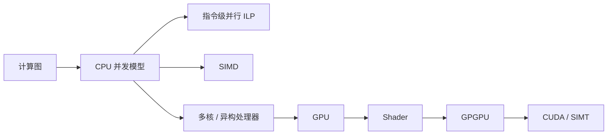
```mermaid
flowchart LR
    A["计算图"] --> B["CPU 并发模型"]
    B --> C["指令级并行 ILP"]
    B --> D["SIMD"]
    B --> E["多核 / 异构处理器"]
    E --> F["GPU"]
    F --> G["Shader"]
    G --> H["GPGPU"]
    H --> I["CUDA / SIMT"]
```

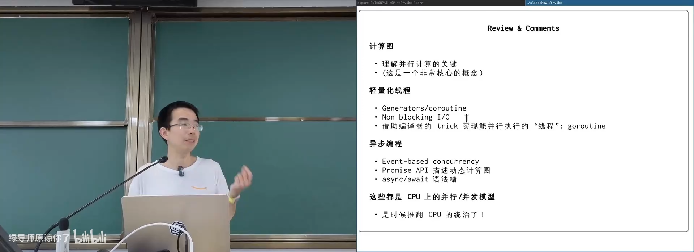

---

## 1. CPU 的顺序执行只是精心维护的假象

### 1.1 逻辑门天然并行

*(参考时间: 00:02)*

从寄存器-指令模型看，CPU 执行 `rv32ima_step` 时像是一步一步顺序执行。但底层电路并不是串行状态机：

- 信号从输入传播到输出时，不同逻辑门可以同时翻转；
- 多条指令可以同时进入取指和译码阶段；
- 两条指令如果没有数据依赖，理论上可以同时执行；
- 双端口寄存器文件允许同一周期写入两个结果。

现代 CPU 内部有一个很长的指令窗口，并持续进行依赖分析、动态调度、寄存器重命名和乱序执行：

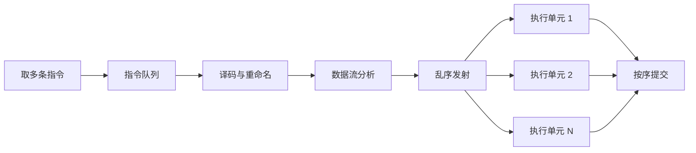
```mermaid
flowchart LR
    A["取多条指令"] --> Q["指令队列"]
    Q --> D["译码与重命名"]
    D --> S["数据流分析"]
    S --> R["乱序发射"]
    R --> E1["执行单元 1"]
    R --> E2["执行单元 2"]
    R --> E3["执行单元 N"]
    E1 --> C["按序提交"]
    E2 --> C
    E3 --> C
```

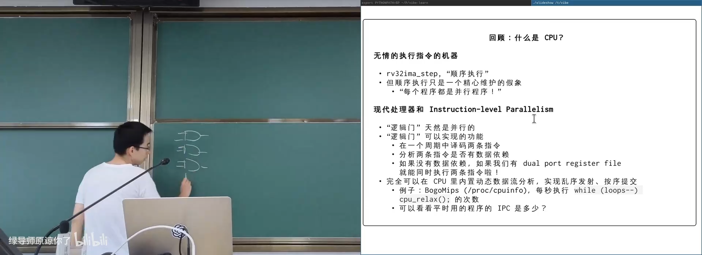

### 1.2 用 IPC 和 BogoMIPS 观察指令级并行

*(参考时间: 00:05)*

要证明一个 CPU 可以每周期执行超过一条指令，可以结合三类信息：

1. 从 `/proc/cpuinfo` 获取处理器型号、频率和 BogoMIPS；
2. 用汇编构造不同依赖关系的指令序列；
3. 用 `perf stat` 统计指令数与周期数，计算 IPC。

```text
IPC = instructions / cycles
```

实验比较多种序列：

- 连续 `add` 到同一个寄存器，形成长依赖链；
- 使用不同寄存器，允许并行发射；
- 整数与浮点混合；
- 使用 NEON / SIMD 指令；
- 独立乘法与加法混合。

BogoMIPS 来自校准循环，数值高于 CPU 标称频率时，往往暗示一个周期内执行了多条简单指令。

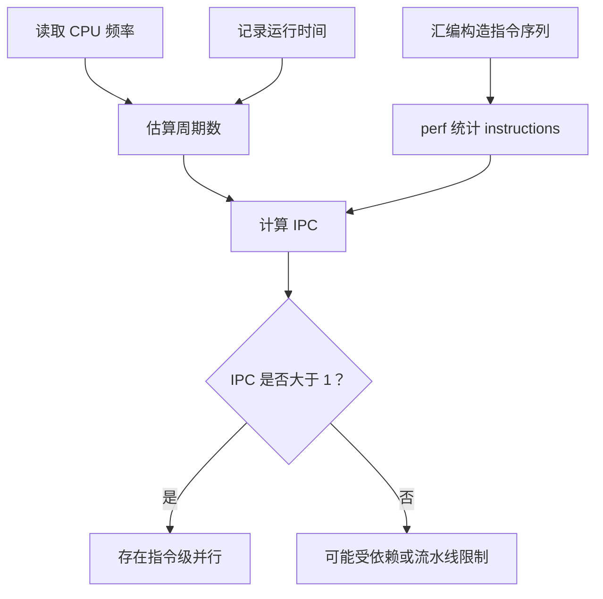
```mermaid
flowchart TD
    A["读取 CPU 频率"] --> D["估算周期数"]
    B["汇编构造指令序列"] --> E["perf 统计 instructions"]
    C["记录运行时间"] --> D
    D --> F["计算 IPC"]
    E --> F
    F --> G{"IPC 是否大于 1？"}
    G -- "是" --> H["存在指令级并行"]
    G -- "否" --> I["可能受依赖或流水线限制"]
```

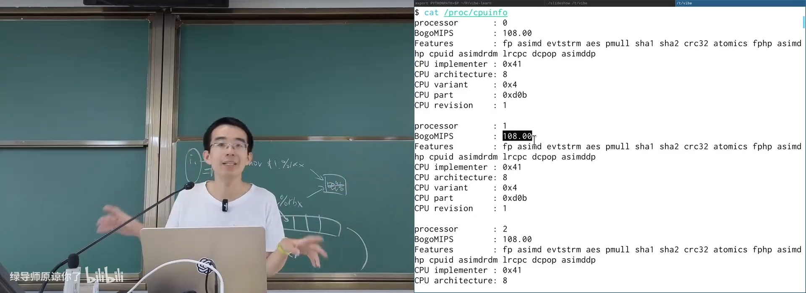

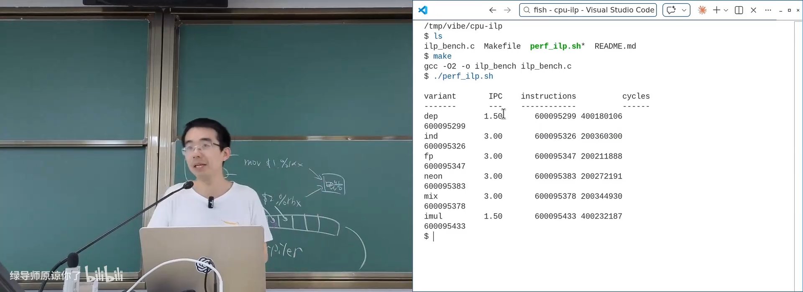

### 1.3 为“更快完成”付出的能量税

*(参考时间: 00:13)*

动态调度非常昂贵。CPU 中必须维护：

- 很长的指令队列；
- 每条指令的数据流信息；
- 寄存器重命名表；
- 乱序发射和按序提交逻辑；
- 分支预测与恢复机制。

这些电路会占用面积，也会持续翻转逻辑门。执行一条简单加法所需的运算电路，可能远小于“决定它何时可以执行”的调度电路。

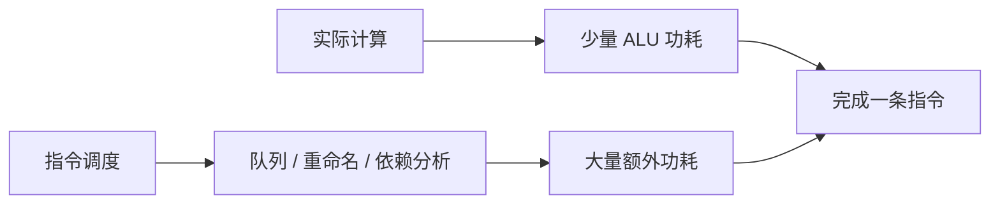
```mermaid
flowchart LR
    A["实际计算"] --> B["少量 ALU 功耗"]
    C["指令调度"] --> D["队列 / 重命名 / 依赖分析"]
    D --> E["大量额外功耗"]
    B --> F["完成一条指令"]
    E --> F
```

单线程性能的代价可以理解为：

> 为了尽快完成计算，处理器浪费了部分能量；真正用于计算结果的门翻转只是其中一部分。

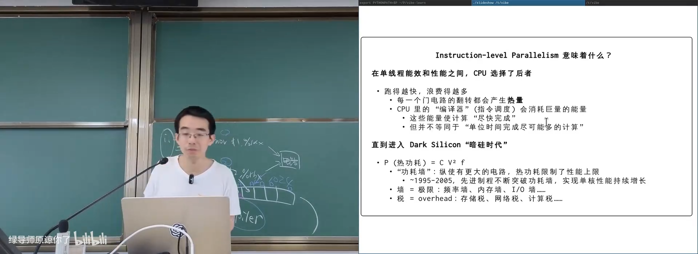

---

## 2. 功耗墙与两条优化路线

### 2.1 热功耗公式

*(参考时间: 00:17)*

数字电路动态功耗近似为：

```text
P = C × V² × f
```

其中：

- `C`：与制程和电路结构相关的等效电容；
- `V`：供电电压；
- `f`：时钟频率。

在 1995 至 2005 年左右，制程持续进步，晶体管变小，电压降低，频率提高，单核性能快速增长。

当制程红利放缓，`C` 和 `V²` 很难继续显著下降，而散热能力有限，处理器就撞上**功耗墙**。类似的极限还包括：

- 频率墙；
- 内存墙；
- I/O 墙；
- 各种协议、抽象和存储带来的“性能税”。

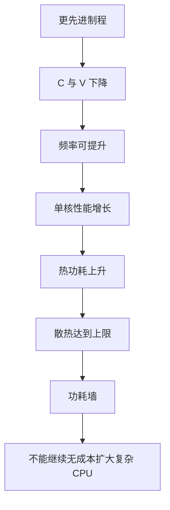
```mermaid
flowchart TD
    A["更先进制程"] --> B["C 与 V 下降"]
    B --> C["频率可提升"]
    C --> D["单核性能增长"]
    D --> E["热功耗上升"]
    E --> F["散热达到上限"]
    F --> G["功耗墙"]
    G --> H["不能继续无成本扩大复杂 CPU"]
```

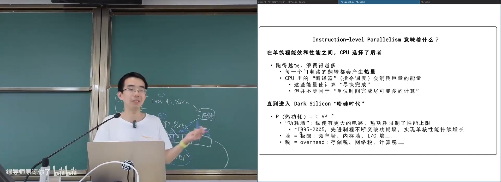

### 2.2 策略一与策略二

*(参考时间: 00:21)*

面对功耗墙，有两条主要路线：

**策略一：让一条指令处理更多数据。**

- 调度一条指令的固定成本被多个数据元素分摊；
- 这就是 SIMD，Single Instruction Multiple Data。

**策略二：使用更多更简单的处理器。**

- 同等面积可以放更多小核心；
- 单核性能下降，但总并行吞吐提高；
- 异构处理器把大核与小核组合，如 ARM big.LITTLE、Intel P-core/E-core。

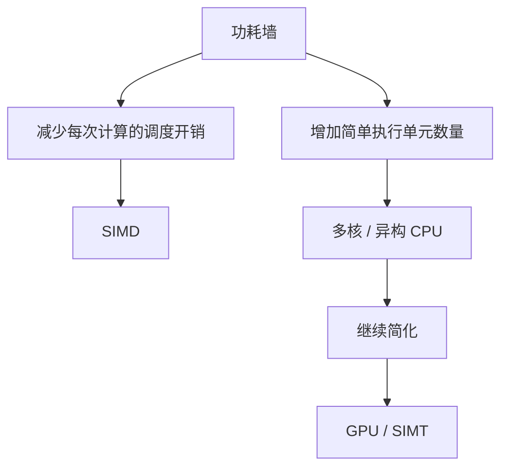
```mermaid
flowchart TD
    A["功耗墙"] --> B["减少每次计算的调度开销"]
    A --> C["增加简单执行单元数量"]
    B --> D["SIMD"]
    C --> E["多核 / 异构 CPU"]
    E --> F["继续简化"]
    F --> G["GPU / SIMT"]
```

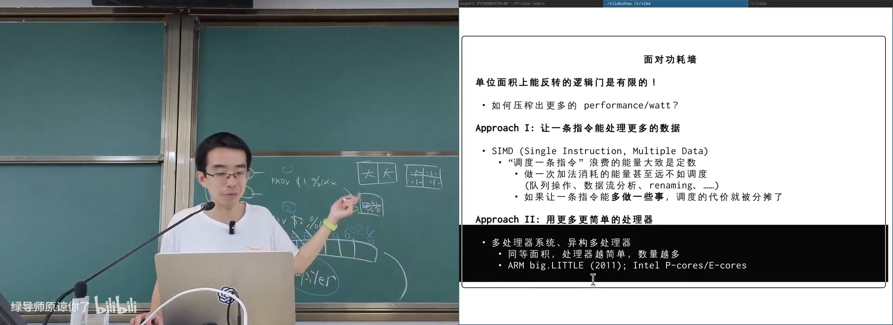

---

## 3. SIMD：一条指令操作多个数据

### 3.1 Packed register

*(参考时间: 00:25)*

Intel 在 1997 年推出 MMX：MultiMedia eXtension。

32 位机器新增一组 64 位寄存器，一个寄存器可以看作：

- 2 个 32 位整数；
- 4 个 16 位整数；
- 8 个 8 位整数。

对两个 packed register 做加法，可以同时完成多个小整数的加法：

```text
[a3 a2 a1 a0] + [b3 b2 b1 b0]
    = [a3+b3, a2+b2, a1+b1, a0+b0]
```

这种加法和一个 64 位普通整数加法不同：

- 每个 lane 独立计算；
- lane 之间通常不传播进位；
- 某些指令使用饱和运算，溢出时保留最大或最小值。

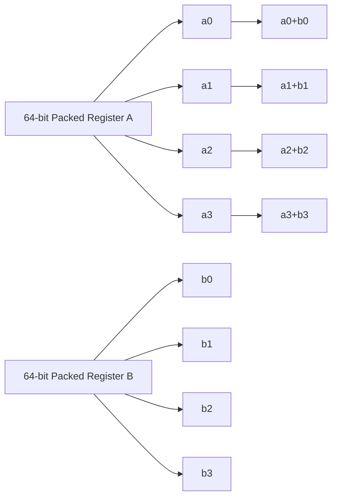
```mermaid
flowchart LR
    A["64-bit Packed Register A"] --> A0["a0"]
    A --> A1["a1"]
    A --> A2["a2"]
    A --> A3["a3"]
    B["64-bit Packed Register B"] --> B0["b0"]
    B --> B1["b1"]
    B --> B2["b2"]
    B --> B3["b3"]
    A0 --> C0["a0+b0"]
    A1 --> C1["a1+b1"]
    A2 --> C2["a2+b2"]
    A3 --> C3["a3+b3"]
```

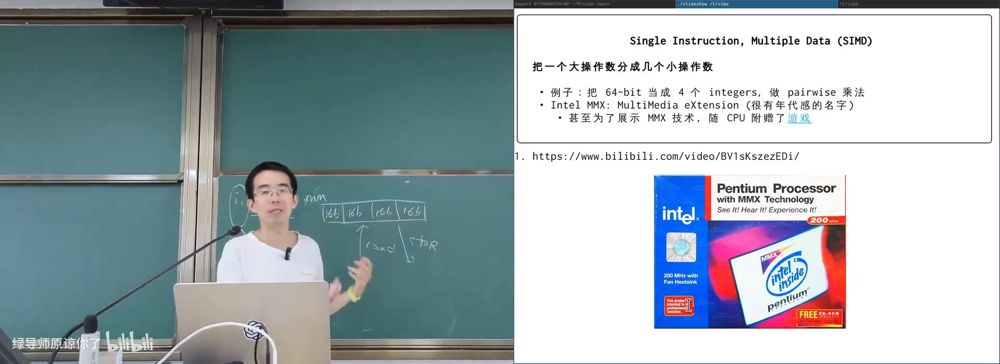

### 3.2 编程中已经在使用 SIMD 思想

*(参考时间: 00:28)*

Bit set 用一个整数的多个 bit 表示集合：

```c
int present(uint32_t set, int x) {
    return (set >> x) & 1;
}
```

数组版本：

```c
int present(const unsigned char *arr, int x) {
    return (arr[x / 8] >> (x % 8)) & 1;
}
```

另一个经典例子是 `popcount`：

```c
inline int popcount(uint32_t x) {
    x = (x & 0x55555555) + ((x & 0xaaaaaaaa) >> 1);
    x = (x & 0x33333333) + ((x & 0xcccccccc) >> 2);
    x = (x & 0x0f0f0f0f) + ((x & 0xf0f0f0f0) >> 4);
    x = (x & 0x00ff00ff) + ((x & 0xff00ff00) >> 8);
    x = (x & 0x0000ffff) + (x >> 16);
    return x;
}
```

它把相邻 bit 的计数逐层合并。但在现代处理器上，这种方法形成的依赖链并不一定比查表更快：

1. 把 32 位拆成 4 个 8 位；
2. 分别查 256 项表；
3. 四个 load 在缓存命中时可并行；
4. 最后相加。

> “聪明的位运算”不一定比直接查表更适合现代流水线。

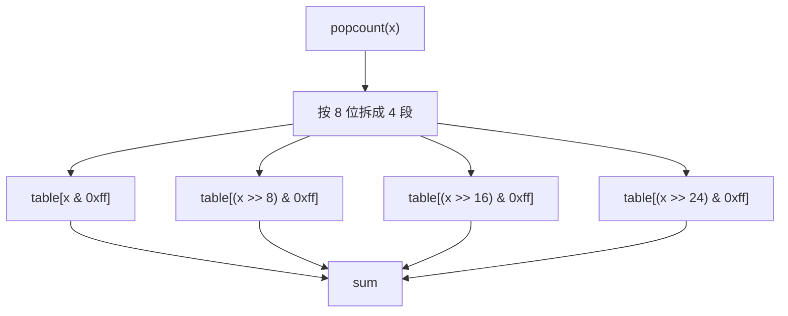
```mermaid
flowchart TD
    A["popcount(x)"] --> B["按 8 位拆成 4 段"]
    B --> C1["table[x & 0xff]"]
    B --> C2["table[(x >> 8) & 0xff]"]
    B --> C3["table[(x >> 16) & 0xff]"]
    B --> C4["table[(x >> 24) & 0xff]"]
    C1 --> D["sum"]
    C2 --> D
    C3 --> D
    C4 --> D
```

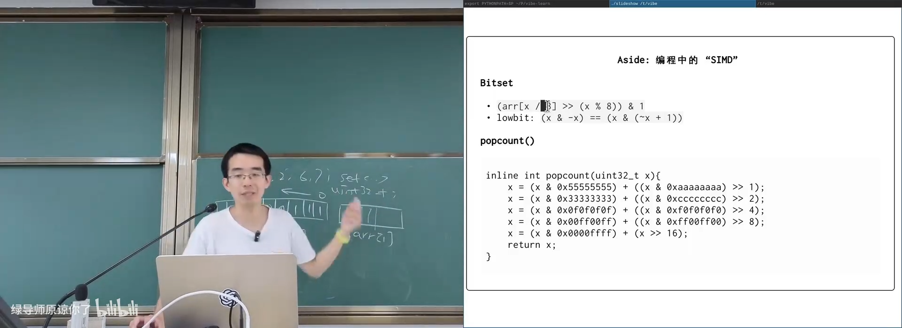

### 3.3 从 MMX 到 AVX-512

*(参考时间: 00:33)*

寄存器宽度持续增长：

```text
64-bit   %mm     MMX
128-bit  %xmm    SSE
256-bit  %ymm    AVX
512-bit  %zmm    AVX-512
```

同时增加数据类型和运算：

- 整数与浮点数；
- 三操作数模式；
- shuffle：`c[i] = a[b[i]]`；
- FMA：`a * b + c` 一条指令完成。

寄存器越宽，每次动态调度的固定成本就被摊得越薄。但 AVX-512 已接近热密度极限，开启宽向量单元时处理器可能被迫降频。

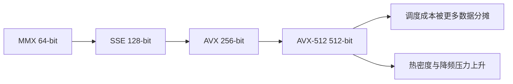
```mermaid
flowchart LR
    A["MMX 64-bit"] --> B["SSE 128-bit"]
    B --> C["AVX 256-bit"]
    C --> D["AVX-512 512-bit"]
    D --> E["调度成本被更多数据分摊"]
    D --> F["热密度与降频压力上升"]
```

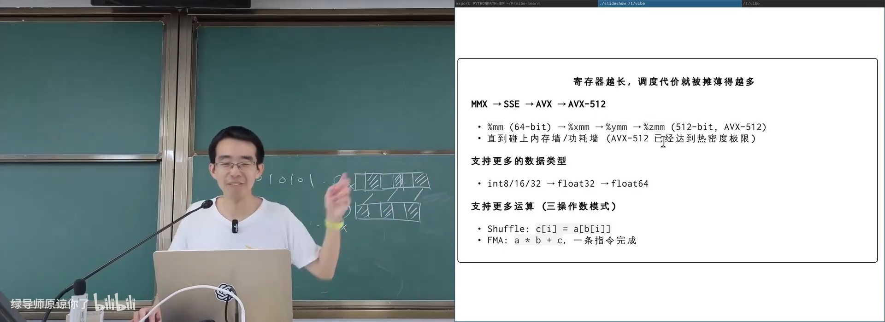

### 3.4 SIMD 仍然没有消灭调度成本

*(参考时间: 00:36)*

SIMD 指令依然：

- 经过缓存层次；
- 参与动态流水线；
- 与其他指令竞争发射槽和功耗；
- 在宽向量执行时产生更高热密度。

真正极端的目标是：

> 让指令调度的代价接近零。

历史上有一个激进尝试：**VLIW，Very Long Instruction Word**。

编译器把多条互不依赖的指令打包到一条很宽的超长指令中，硬件只负责执行，不再做复杂动态调度。

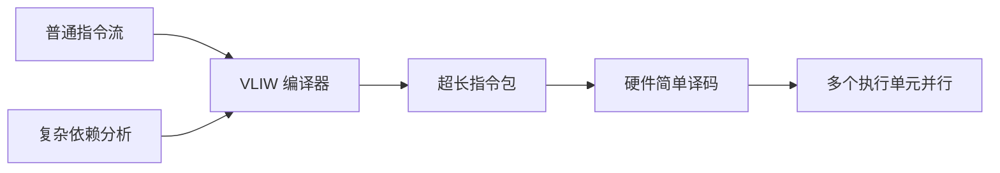
```mermaid
flowchart LR
    A["普通指令流"] --> B["VLIW 编译器"]
    B --> C["超长指令包"]
    C --> D["硬件简单译码"]
    D --> E["多个执行单元并行"]
    F["复杂依赖分析"] --> B
```

Intel 曾尝试 IA-64，但没有取得市场成功。讲师认为，在编译器和 LLM 能力增强后，VLIW 思想可能在特定加速器上重新变得有吸引力。

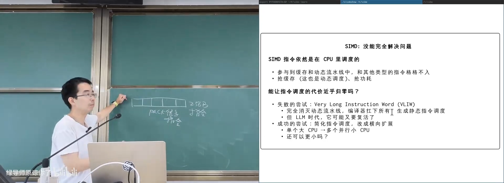

---

## 4. 改变人类命运的另一条时间线：图形处理器

### 4.1 图形计算天然适合并行

*(参考时间: 00:41)*

Magnavox Odyssey（1972）是早期游戏主机。到 1983 年，NES 已经能提供流畅动画和丰富场景。

NES 使用 MOS 6502，主频约 1.79 MHz，IPC 约 0.43。屏幕为 `256 × 240`，共约 61K 像素，目标 60 FPS。

直接为每个像素计算颜色需要极多指令：

```c
for (int y = 0; y < H; ++y) {
    for (int x = 0; x < W; ++x) {
        putchar(f(x, y) ? '*' : ' ');
    }
    putchar('\n');
}
```

`f(x, y)` 对每个像素相互独立，是 embarrassingly parallel 任务。但早期 CPU 没有足够并行能力。

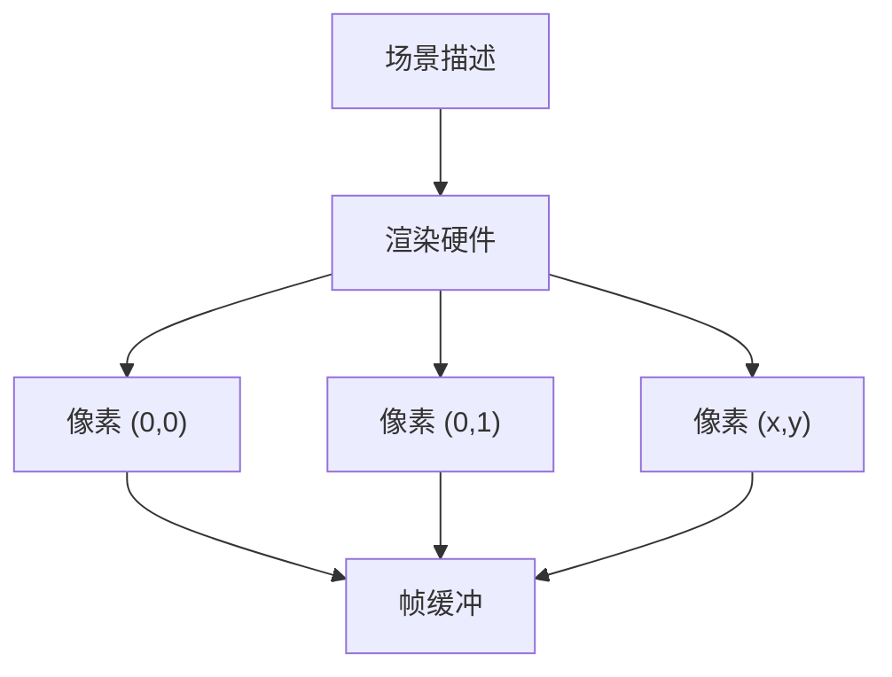
```mermaid
flowchart TD
    A["场景描述"] --> B["渲染硬件"]
    B --> C1["像素 (0,0)"]
    B --> C2["像素 (0,1)"]
    B --> C3["像素 (x,y)"]
    C1 --> D["帧缓冲"]
    C2 --> D
    C3 --> D
```

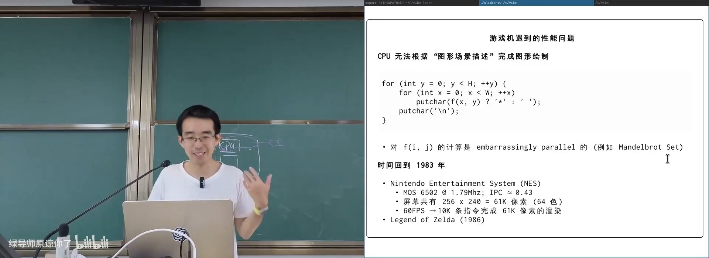

### 4.2 NES 的场景描述数据结构

*(参考时间: 00:44)*

NES 不要求 CPU 逐像素绘制，而是让 CPU 生成一份“场景描述”：

- 以 `8 × 8` tile 为基本单位；
- Tile ROM 保存图形模式；
- Tile Map / Name Table 决定背景拼接；
- Attribute Table 决定调色板；
- Sprite 表示可自由移动的前景。

一个 tile 往往只有 4 种颜色，可以用 2 bit/像素表示，极大节省 ROM 和显存。

同一套 tile 可以通过不同 palette 复用。例如马里奥和路易吉可能共享像素图案，只是换调色板后变成红色或绿色。

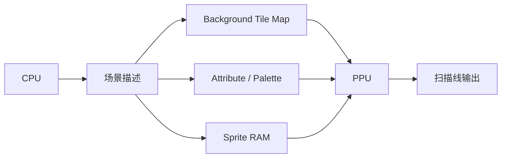
```mermaid
flowchart LR
    A["CPU"] --> B["场景描述"]
    B --> C["Background Tile Map"]
    B --> D["Attribute / Palette"]
    B --> E["Sprite RAM"]
    C --> F["PPU"]
    D --> F
    E --> F
    F --> G["扫描线输出"]
```

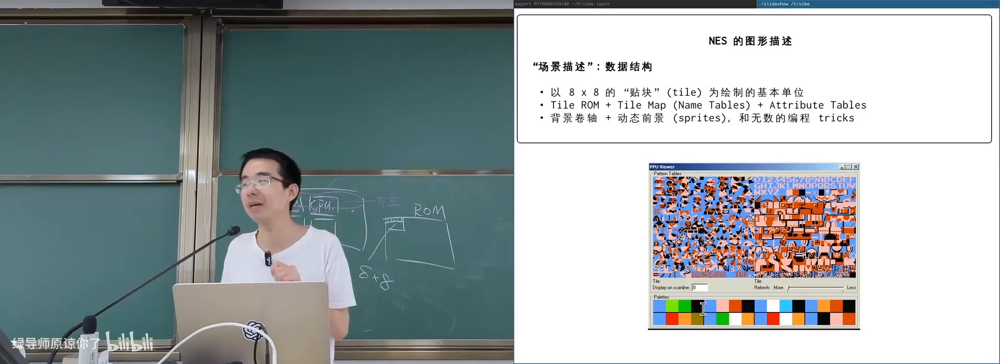

### 4.3 Sprite 与编程 trick

*(参考时间: 00:48)*

每个 Sprite 可用一条紧凑记录描述：

```text
(x, y, tile, attribute)
```

其中 attribute 包含：

- 调色板编号；
- 前后景优先级；
- 水平翻转；
- 垂直翻转。

Sprite RAM 通常只能保存 64 个 Sprite。开发者利用镜像、调色板和两次动画帧制造复杂效果：

- 一个 tile 通过水平和垂直翻转组合成圆；
- 马里奥中的敌人用两只脚交换位置形成走路动画；
- 背景滚动通过移动可显示窗口并替换新 tile 完成；
- 全屏闪烁通过替换调色板实现，而不改动 tile 数据。

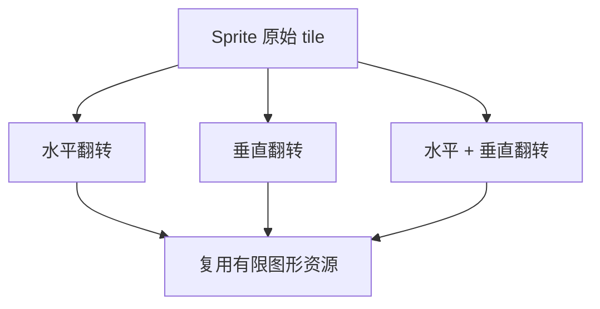
```mermaid
flowchart TD
    A["Sprite 原始 tile"] --> B["水平翻转"]
    A --> C["垂直翻转"]
    A --> D["水平 + 垂直翻转"]
    B --> E["复用有限图形资源"]
    C --> E
    D --> E
```

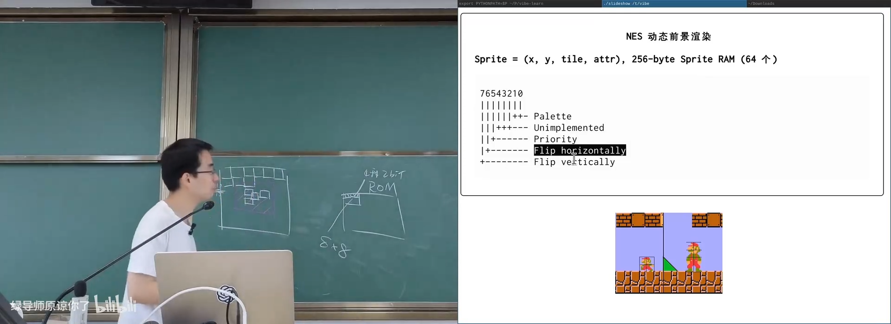

### 4.4 固定功能渲染管线

*(参考时间: 00:51)*

可以把 NES 的 PPU 理解为一台小型“GPU”：

1. 有一个线扫描计数器；
2. 对当前扫描线上的像素读取背景 tile；
3. 查询所有 Sprite 是否覆盖该像素；
4. 按优先级选择最上层的颜色；
5. 将结果送到显示输出。

这与今天的 z-buffer 思想相通：越靠前的图层覆盖越靠后的图层。

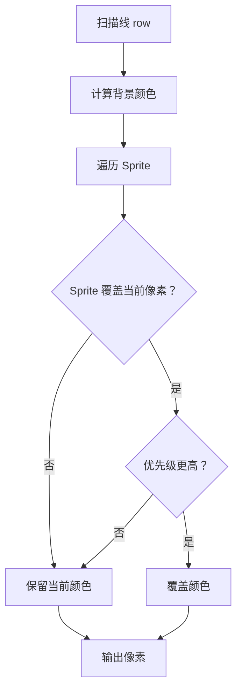
```mermaid
flowchart TD
    A["扫描线 row"] --> B["计算背景颜色"]
    B --> C["遍历 Sprite"]
    C --> D{"Sprite 覆盖当前像素？"}
    D -- "否" --> E["保留当前颜色"]
    D -- "是" --> F{"优先级更高？"}
    F -- "是" --> G["覆盖颜色"]
    F -- "否" --> E
    E --> H["输出像素"]
    G --> H
```

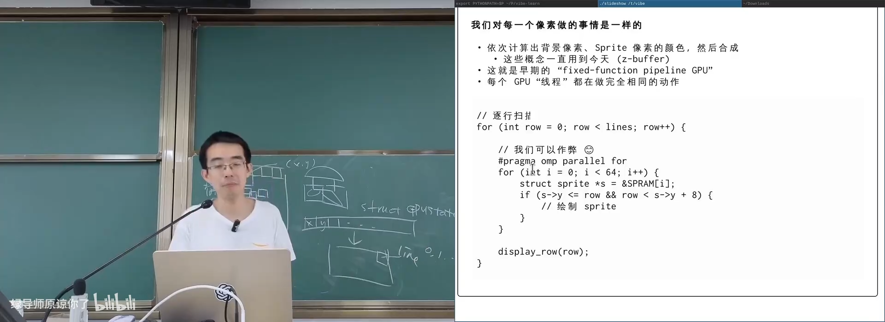

---

## 5. 从 2D 到 3D，再到可编程 Shader

### 5.1 贴图是可变形的数据块

*(参考时间: 00:54)*

随着硬件能力增强，场景描述不再局限于固定 tile。可以使用任意 bitmap：

```text
bitmap + 四个顶点位置
```

把贴图四个角移动到不同位置，就相当于拉扯一张有弹性的纸，从而完成：

- 放大；
- 缩小；
- 旋转；
- 仿射变形；
- 图层拼接。


```mermaid
flowchart LR
    A["Bitmap Texture"] --> B["移动四个顶点"]
    B --> C["仿射变换"]
    C --> D["Pixel Shader 采样"]
    D --> E["写入画布"]
```

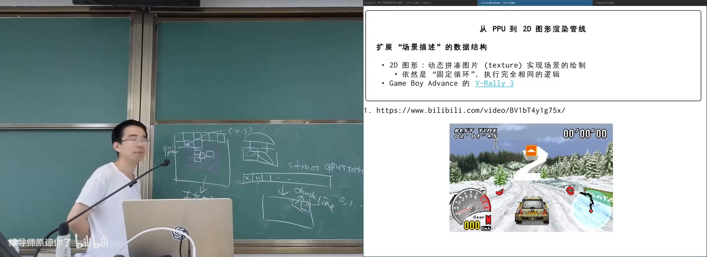

### 5.2 2D 引擎模拟 3D 的失真

*(参考时间: 00:58)*

早期掌机常用 2D 贴图模拟 3D 赛道。背景和前景根据摄像机位置缩放，就可以制造透视效果。

但如果只把矩形挤压成梯形，缺少真实的深度信息，贴图会产生 affine distortion。摄像机转动幅度过大时，失真就会暴露。

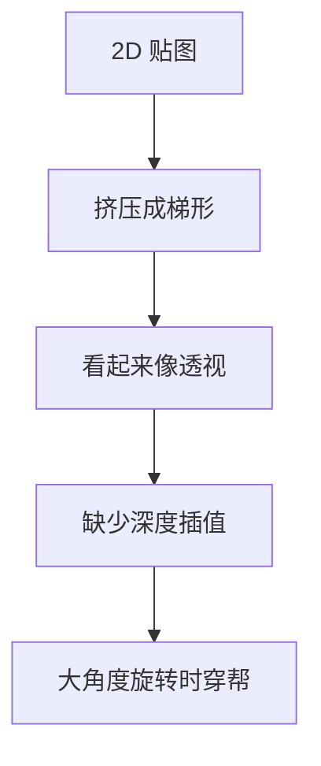
```mermaid
flowchart TD
    A["2D 贴图"] --> B["挤压成梯形"]
    B --> C["看起来像透视"]
    C --> D["缺少深度插值"]
    D --> E["大角度旋转时穿帮"]
```


### 5.3 齐次坐标把 3D 变换统一为矩阵乘法

*(参考时间: 01:00)*

3D 场景描述包含：

- Vertex；
- Face；
- Texture；
- Material；
- Light；
- Camera。

三角形是基本图元。平移、旋转、缩放和摄像机投影都可以写成 4D 齐次坐标下的矩阵乘法：

```text
[x' y' z' 1] = [x y z 1] × M
```

这样 GPU 只需要对每个顶点执行相同的矩阵运算。


```mermaid
flowchart LR
    A["3D Vertex"] --> B["Model Matrix"]
    B --> C["World Space"]
    C --> D["View Matrix"]
    D --> E["Camera Space"]
    E --> F["Projection"]
    F --> G["Screen Space"]
```

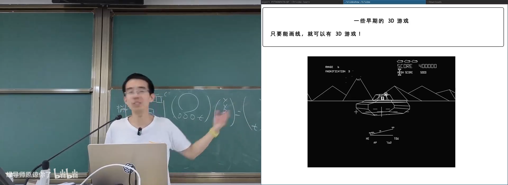

### 5.4 Vertex Shader

*(参考时间: 01:03)*

既然每个顶点执行相同步骤，就可以让程序员提供一段程序：

```glsl
void main() {
    gl_Position = transform(position);
    this.xy += wave_offset(this.xy, time);
}
```

Vertex Shader 可以修改顶点坐标、颜色和法线。典型应用包括：

- 水面波纹；
- 头发和布料摆动；
- 植被随风晃动；
- 顶点级动画。

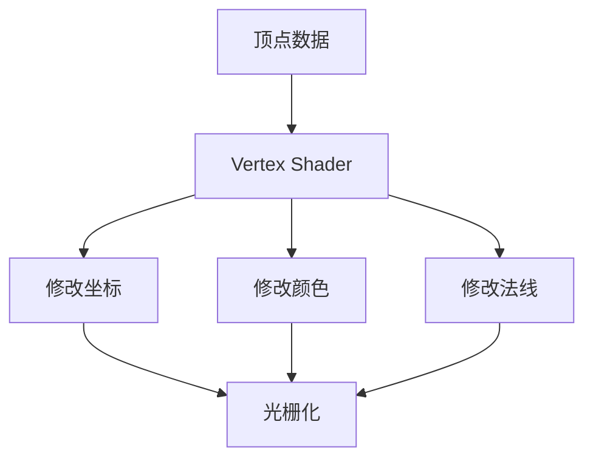
```mermaid
flowchart TD
    A["顶点数据"] --> B["Vertex Shader"]
    B --> C["修改坐标"]
    B --> D["修改颜色"]
    B --> E["修改法线"]
    C --> F["光栅化"]
    D --> F
    E --> F
```

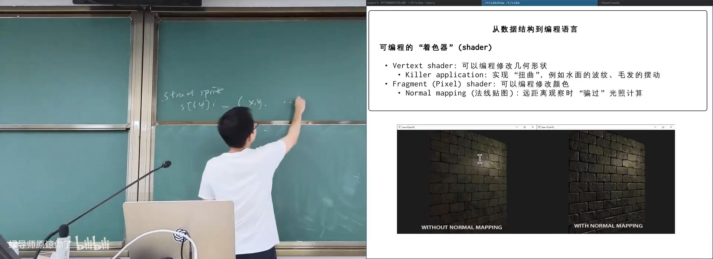

### 5.5 Fragment / Pixel Shader

*(参考时间: 01:07)*

光栅化后，每个像素会执行 Fragment Shader：

```glsl
vec3 shade(vec2 uv, vec3 color) {
    color *= 0.9;
    return color;
}
```

它本质上是对每个像素做相同的数值处理，类似照片编辑：

- 调整曝光；
- 调整亮部和暗部；
- 使用 mask 局部修改；
- 应用滤镜。

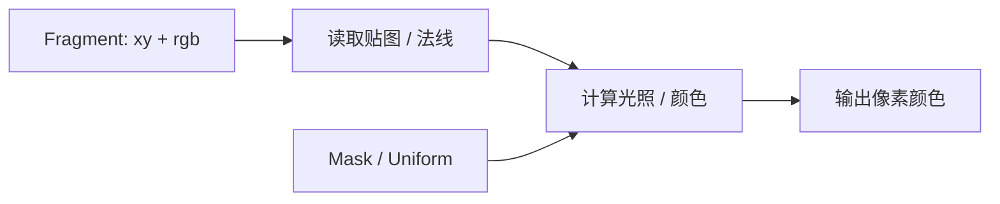
```mermaid
flowchart LR
    A["Fragment: xy + rgb"] --> B["读取贴图 / 法线"]
    B --> C["计算光照 / 颜色"]
    C --> D["输出像素颜色"]
    E["Mask / Uniform"] --> C
```

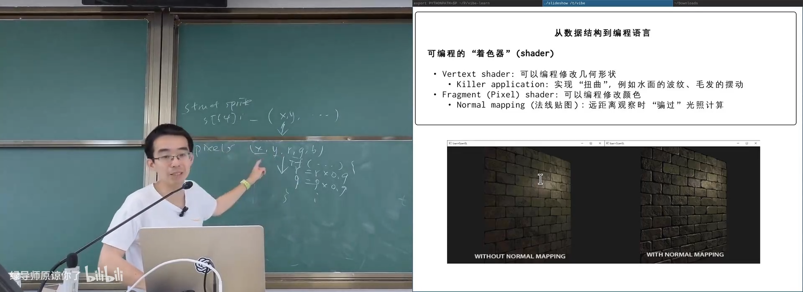

### 5.6 Normal mapping

*(参考时间: 01:09)*

真实砖墙的缝隙和凸起需要大量三角面。Normal mapping 不增加几何细节，而是为每个像素保存一个法线方向。

光照计算使用入射光与法线的内积：

```text
shade = max(0, dot(light_direction, normal))
```

当法线随砖缝起伏时，光照也会变化，从远处看就像真实凹凸表面。

它的限制是：

- 只能欺骗光照；
- 不能产生真实遮挡；
- 视角非常近时会穿帮。

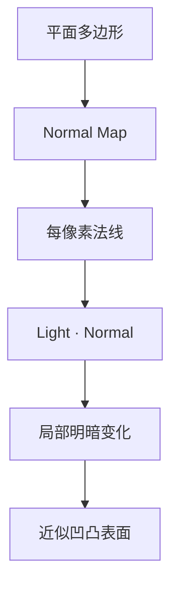
```mermaid
flowchart TD
    A["平面多边形"] --> B["Normal Map"]
    B --> C["每像素法线"]
    C --> D["Light · Normal"]
    D --> E["局部明暗变化"]
    E --> F["近似凹凸表面"]
```

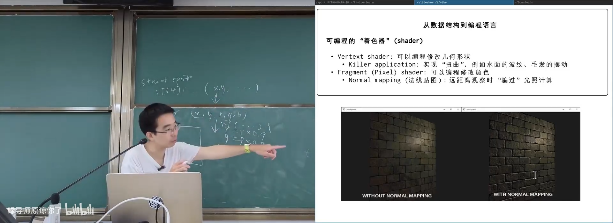

---

## 6. GPGPU：把通用计算伪装成图形

### 6.1 用图形硬件做矩阵乘法

*(参考时间: 01:11)*

2001 年的论文 *Fast matrix multiplies using graphics hardware* 提出：

> 把科学计算问题转换成图像处理问题，再交给可编程 Shader 执行。

矩阵乘法可以分解为外积之和：

```text
AB = Σ A[:,k] B[k,:]
```

每一步外积结果都是一个矩阵，可以当作一张图像；多个外积结果再用 Fragment Shader 叠加。

```mermaid
flowchart LR
    A["矩阵 A 的第 k 列"] --> C["外积"]
    B["矩阵 B 的第 k 行"] --> C
    C --> D["生成一张矩阵图像"]
    D --> E["Pixel Shader 累加"]
    E --> F["矩阵乘法结果"]
```

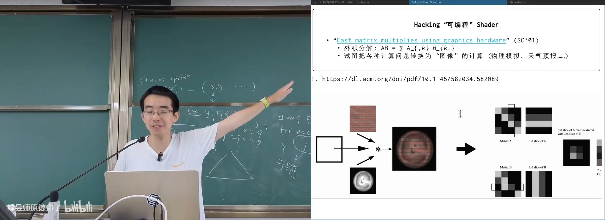

### 6.2 Shader Program 就是为大量对象执行同一段代码

*(参考时间: 01:14)*

Shader 的本质可以重新表述为：

```c
for_each(element) {
    execute_same_kernel(element);
}
```

这正是并发编程最初讲的内容：为大量节点执行相同计算。

假设要为每个像素计算 Mandelbrot 颜色：

```c
__device__ int *screen;

void T_kernel(int row, int col) {
    int color = f(row, col);
    screen[row * 1920 + col] = color;
}

for (int row = 0; row < 1080; ++row) {
    for (int col = 0; col < 1920; ++col) {
        spawn(T_kernel, row, col);
    }
}
```

如果 GPU 能启动约 200 万个轻量线程并让他们并行执行，就得到了通用 GPU 计算模型。

```mermaid
flowchart TD
    A["输入元素集合"] --> B["同一个 Kernel"]
    B --> C1["元素 0"]
    B --> C2["元素 1"]
    B --> C3["元素 N"]
    C1 --> D["设备内存结果"]
    C2 --> D
    C3 --> D
```

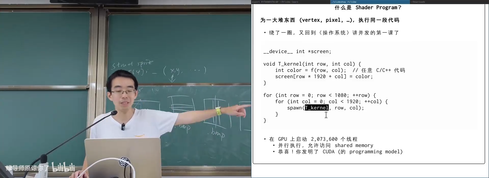

---

## 7. CUDA：为海量线程设计的执行模型

### 7.1 Kernel 与设备内存

*(参考时间: 01:16)*

CUDA 给 C/C++ 增加了一些关键字：

```cuda
__device__ int *screen;

__global__ void mandelbrot_kernel(int width) {
    int col = blockIdx.x * blockDim.x + threadIdx.x;
    int row = blockIdx.y * blockDim.y + threadIdx.y;
    if (col < width)
        screen[row * width + col] = mandelbrot(row, col);
}

mandelbrot_kernel<<<blocks, threads>>>(width);
```

看似奇怪的 `<<<...>>>` 实际上只是描述：

1. 启动多少线程；
2. 如何把线程组织成 block；
3. kernel 该如何获得自己的坐标。

```mermaid
flowchart TD
    A["CPU 准备输入"] --> B["拷贝到 Device Memory"]
    B --> C["启动 Kernel Grid"]
    C --> D["多个 Block"]
    D --> E["每个 Block 多个 Thread"]
    E --> F["Kernel 计算"]
    F --> G["结果写回 Device Memory"]
    G --> H["读取回 CPU"]
```

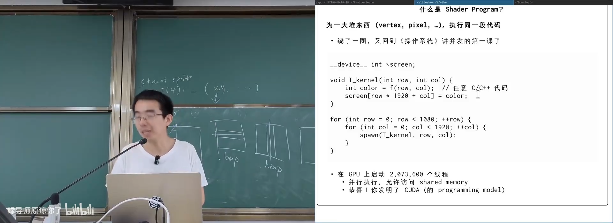

### 7.2 为什么不能直接创建两百万个普通线程

*(参考时间: 01:17)*

如果每个线程都占用用户栈、内核对象、寄存器和完整调度状态，创建 200 万线程不可接受。

GPU 仍保留每个线程的：

- 寄存器；
- ALU / 运算能力；
- 必要状态。

但可以共享：

- 程序计数器；
- 取指单元；
- 译码单元；
- 控制逻辑。

```mermaid
flowchart LR
    A["每个线程必需的 ALU"] --> D["多个执行单元"]
    B["每个线程必需的寄存器"] --> D
    C["共享 PC / 取指 / 译码"] --> D
    D --> E["SIMT 执行"]
```

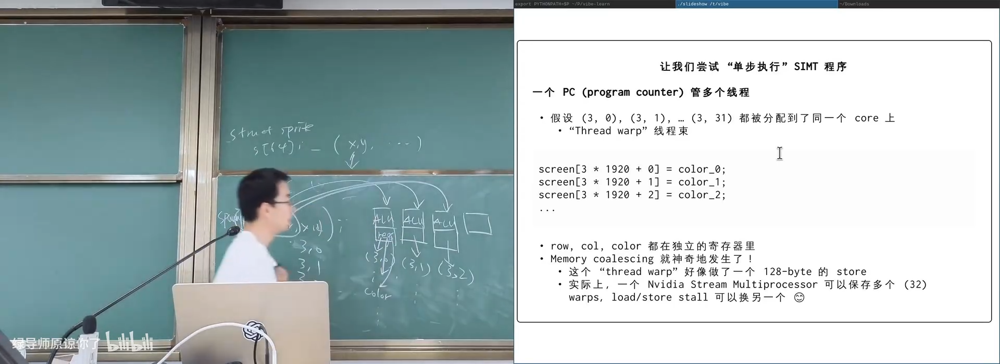

---

## 8. SIMT：单指令多线程

### 8.1 Thread warp

*(参考时间: 01:20)*

NVIDIA GPU 把 32 个线程组成一个 **warp**：

```text
Thread warp = 32 threads
```

同一个 warp 中的线程：

- 执行同一条指令；
- 共享一个 Program Counter；
- 拥有独立寄存器；
- 可以拥有不同的坐标与数据。

例如线程 `(3,0)`、`(3,1)` 一直到 `(3,31)` 被分到同一个 warp：

```text
screen[3 * 1920 + 0]  = color_0;
screen[3 * 1920 + 1]  = color_1;
...
screen[3 * 1920 + 31] = color_31;
```

对硬件来说，这像是一条跨 32 个连续地址的宽 store。

```mermaid
flowchart LR
    PC["单个 Program Counter"] --> I["同一条指令"]
    I --> R0["Thread 0 寄存器"]
    I --> R1["Thread 1 寄存器"]
    I --> R31["Thread 31 寄存器"]
    R0 --> S["连续宽 Store"]
    R1 --> S
    R31 --> S
```

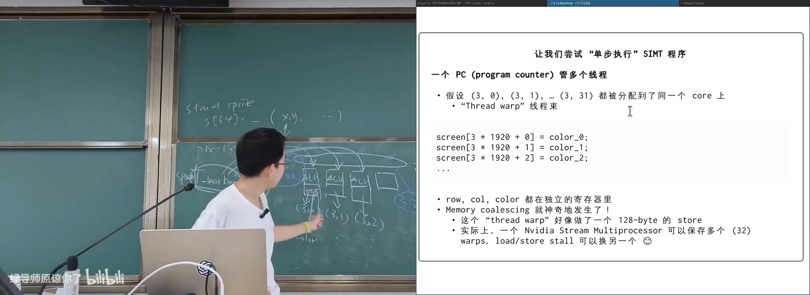

### 8.2 Memory coalescing

*(参考时间: 01:24)*

假设 32 个线程分别写：

```c
screen[row * 1920 + col] = color;
```

如果 `col` 连续，32 个 4 字节写可以组成一次 128 字节连续访问，内存控制器能高效完成。

如果把索引改成转置形式：

```c
screen[row + col * 1080] = color;
```

每个线程访问的地址就会跳跃，硬件不得不发出大量零散事务，性能可能大幅下降。

```mermaid
flowchart TD
    A["32 threads"] --> B{"地址是否连续？"}
    B -- "是" --> C["合并为 128-byte transaction"]
    C --> D["高带宽"]
    B -- "否" --> E["32 个分散地址"]
    E --> F["多次内存事务"]
    F --> G["性能显著下降"]
```

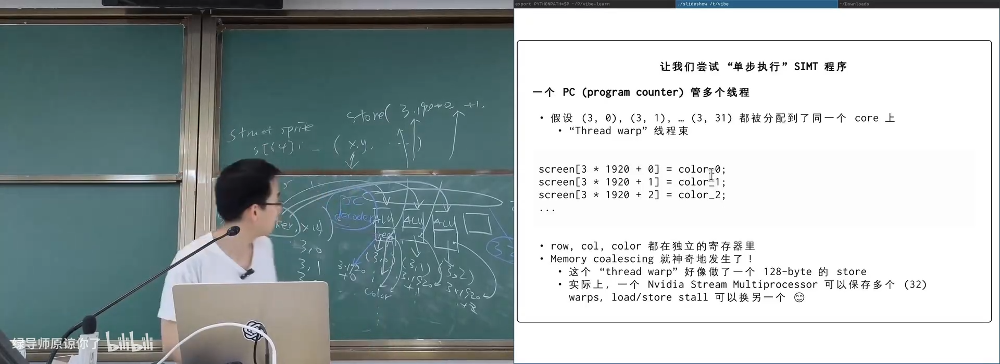

### 8.3 用更多 warp 隐藏延迟

*(参考时间: 01:26)*

一个 Stream Multiprocessor 可以保存多个 warp。当某个 warp 等待全局内存时，调度器切换到另一个可运行 warp。

它不是用复杂的乱序执行隐藏延迟，而是用大量线程提供并行度：

```mermaid
flowchart LR
    W1["Warp 1: load stall"] --> S["Warp Scheduler"]
    W2["Warp 2: ready"] --> S
    W3["Warp 3: ready"] --> S
    S --> E["执行可运行 warp"]
    E --> W1
```

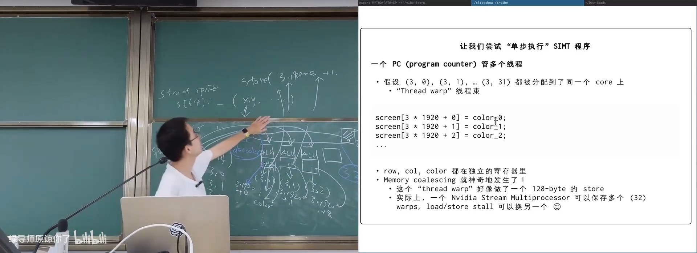

### 8.4 分支分歧

*(参考时间: 01:27)*

一个 warp 只有一个 Program Counter，那么 `if/else` 如何执行？

真实硬件通常使用谓词或 lane mask：

```cuda
if (condition)
    A();
else
    B();
```

编译结果近似：

```text
计算 condition
禁用 condition == false 的 lanes
执行 A
禁用 condition == true 的 lanes
执行 B
重新启用全部 lanes
```

如果 warp 中线程走向不同分支，两条路径都要串行执行。这叫 **branch divergence**。

```mermaid
flowchart TD
    A["warp 计算 condition"] --> B["mask lane A"]
    B --> C["执行 if 分支"]
    C --> D["mask lane B"]
    D --> E["执行 else 分支"]
    E --> F["合并 lanes"]
```

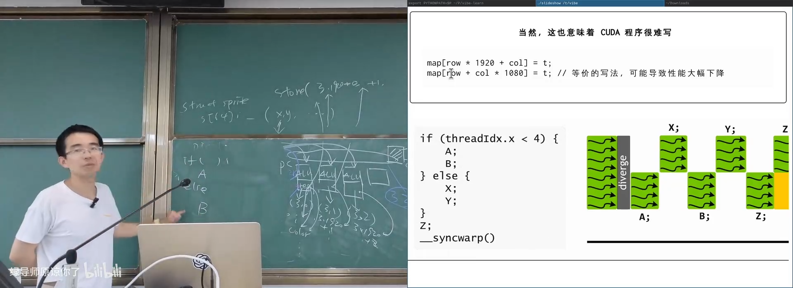

---

## 9. GPU 性能案例：Mandelbrot Set

*(参考时间: 01:29)*

课程比较了 `25600 × 25600` 的 Mandelbrot 渲染：

- Ryzen 5 9600X：约 25.1 s，65 W；
- RTX 4060 Ti 16 GB：约 6.1 s，42 W。

即使 Mandelbrot 的迭代次数不固定，导致同一个 warp 中可能产生分支分歧，GPU 仍然显著领先。

```mermaid
flowchart LR
    A["CPU: 25.1 s / 65 W"] --> C["相同图像"]
    B["GPU: 6.1 s / 42 W"] --> C
    C --> D["GPU 更适合高并行数值计算"]
    E["不固定 while 循环"] --> F["branch divergence"]
    F --> B
```

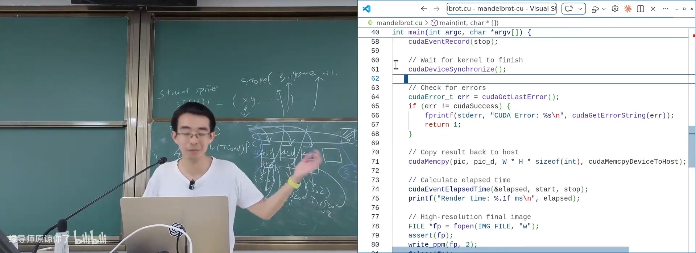

CUDA 代码在原 C 版本基础上，主要只需要：

- 给计算函数增加 `__device__` / `__global__`；
- 用 `blockIdx`、`blockDim`、`threadIdx` 计算像素坐标；
- 把循环拆成线程网格。

这说明 CUDA 的核心并不是神秘语言，而是：

> 另一种启动几十万到数百万轻量级线程的机制。

---

## 10. 总结：用架构选择换取单位功耗的算力

CPU 通过复杂的动态调度获得单线程性能，但需要付出面积和功耗。功耗墙出现后，芯片设计走向两类变化：

1. 让一条指令处理更多数据，即 SIMD；
2. 使用更多更简单的执行单元，最终发展为 GPU/SIMT。

图形计算的历史推动了这一转变：

- 早期游戏机使用固定场景描述和专用渲染硬件；
- 2D 引擎逐步扩展为 texture 和 3D 变换；
- Shader 把渲染流程变成可编程程序；
- GPGPU 把通用计算映射为图像计算；
- CUDA 把 GPU 抽象成可启动海量线程的通用计算平台；
- SIMT warp 共享 PC 和译码，保留独立寄存器，取得极高能效；
- 连续内存访问与分支行为决定 CUDA 程序性能。

```mermaid
flowchart LR
    A["复杂 CPU"] --> B["功耗墙"]
    B --> C["SIMD"]
    B --> D["更多简单核心"]
    D --> E["固定功能 GPU"]
    E --> F["可编程 Shader"]
    F --> G["GPGPU"]
    G --> H["CUDA / SIMT"]
    H --> I["海量线程与高能效并行"]
```

人类需求持续推动技术演进：从游戏图形到科学计算，再到人工智能。GPU 从领域加速器逐渐变得通用，而 CUDA 最终在 AI 时代获得了远超最初预期的成功。

---

## 附：官方参考与延伸阅读

- [mini-rv32ima 模拟器](https://jyywiki.cn/OS/demos/intro/mini-rv32ima)
- [mini-rv32ima 项目](https://github.com/cnlohr/mini-rv32ima)
- [指令级并行实验](https://jyywiki.cn/OS/demos/concurrency/cpu-ilp)
- [MMX 手册](https://jyywiki.cn/OS/manuals/mmx.pdf)
- [MMX 游戏演示](https://www.bilibili.com/video/BV1sKszezEDi/)
- [Fast matrix multiplies using graphics hardware](https://dl.acm.org/doi/pdf/10.1145/582034.582089)
- [OpenGL Shader 实验](https://jyywiki.cn/OS/demos/concurrency/gl-shader)
- [NVIDIA Fermi 白皮书](https://www.nvidia.com/content/PDF/fermi_white_papers/NVIDIA_Fermi_Compute_Architecture_Whitepaper.pdf)
- [CUDA Mandelbrot Set](https://jyywiki.cn/OS/demos/concurrency/mandelbrot-cu)
- [V-Rally 3 图形技术演示](https://www.bilibili.com/video/BV1bT4y1g75x/)

官方课程资料：

- [课程主页](https://jyywiki.cn/OS/2026/)
- [第 20 讲讲义：CPU、GPU 和 SIMT 编程模型](https://jyywiki.cn/OS/2026/lect20.md)
- [视频：20 - CPU、SIMD 和 GPU](https://www.bilibili.com/video/BV1df536aEMk/)

> **版权与署名**：本讲课程材料由蒋炎岩（jyy）编写。课程讲义与幻灯片采用 [Creative Commons BY-NC 4.0](http://creativecommons.org/licenses/by-nc/4.0/) 许可；本电子书保留课程出处、作者署名与许可说明。
