# 一个 Token 的旅程：从 HTTP 请求到数据中心与 GPU

> **课程**：2026 春季学期《操作系统原理》  
> **讲师**：蒋炎岩（jyy）  
> **官方课程主页**：<https://jyywiki.cn/OS/2026/>  
> **官方讲义**：<https://jyywiki.cn/OS/2026/lect21.md>  
> **视频来源**：[Bilibili BV1zS5R6tEWZ](https://www.bilibili.com/video/BV1zS5R6tEWZ/)  
> **版权说明**：课程讲义与幻灯片归蒋炎岩所有，采用 [Creative Commons BY-NC 4.0](http://creativecommons.org/licenses/by-nc/4.0/) 许可；本电子书是对课堂讲授的书面化重构，保留出处与许可说明。

## 导语：把整个计算机系统栈串起来

*(参考时间: 00:00)*

并发部分走到最后一课，课程不再单独讨论某一个同步原语，而是追问：

> 当用户在浏览器或命令行里向大模型发送一句话，并最终收到一个 Token，中间究竟发生了什么？

这条旅程会经过：

- HTTP 请求与进程系统调用；
- DNS、路由、负载均衡和 API 网关；
- 数据中心中的 CRUD、缓存、计费和审计；
- CAP 定理、分布式文件系统、数据库和 MapReduce；
- Serverless 与幂等函数；
- GPU 上的矩阵乘法、Attention、KV Cache 和推理集群。

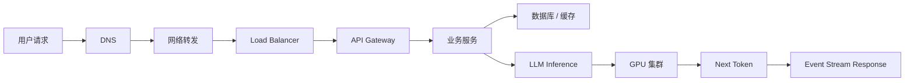
```mermaid
flowchart LR
    A["用户请求"] --> B["DNS"]
    B --> C["网络转发"]
    C --> D["Load Balancer"]
    D --> E["API Gateway"]
    E --> F["业务服务"]
    F --> G["数据库 / 缓存"]
    F --> H["LLM Inference"]
    H --> I["GPU 集群"]
    I --> J["Next Token"]
    J --> K["Event Stream Response"]
```

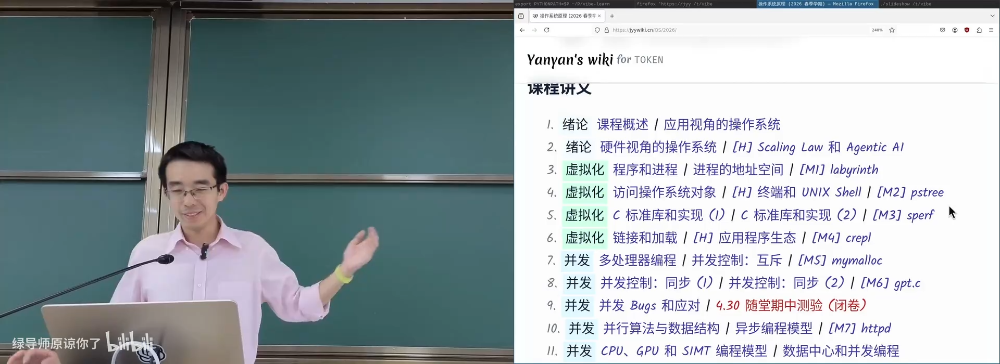

---

## 1. 并发知识如何进入真实系统

### 1.1 从 `spawn/join` 到异构任务与同构任务

*(参考时间: 00:01)*

前面学过的并发机制可以分成几类：

**通用计算图**

- `spawn/join`；
- 共享内存；
- mutex、条件变量、信号量。

**复杂异构任务**

- Coroutine、goroutine；
- non-blocking I/O；
- Promise、`async/await`。

**大量同构小任务**

- SIMD 数据并行；
- GPU Shader、CUDA、SIMT。

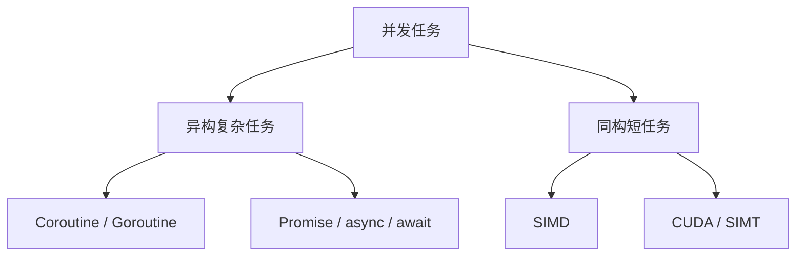
```mermaid
flowchart TD
    A["并发任务"] --> B["异构复杂任务"]
    A --> C["同构短任务"]
    B --> D["Coroutine / Goroutine"]
    B --> E["Promise / async / await"]
    C --> F["SIMD"]
    C --> G["CUDA / SIMT"]
```

### 1.2 数据中心的性能与能效目标

现代 CPU 通过动态调度提高单线程性能，但调度本身消耗面积和能量。SIMD 与 SIMT 则通过共享译码、扩大向量寄存器等方式提高能效。

到了数据中心规模，优化目标不再只是单机性能，而是：

- 每瓦性能；
- 低延迟与高吞吐；
- 弹性扩展；
- 容错与数据正确性。

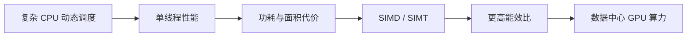
```mermaid
flowchart LR
    A["复杂 CPU 动态调度"] --> B["单线程性能"]
    B --> C["功耗与面积代价"]
    C --> D["SIMD / SIMT"]
    D --> E["更高能效比"]
    E --> F["数据中心 GPU 算力"]
```

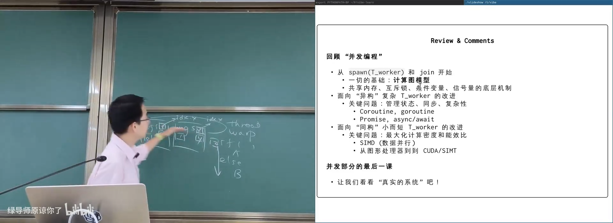

---

## 2. 用户的视角：一次 LLM API 请求

### 2.1 官方 API 只是一个 HTTP 请求

*(参考时间: 00:06)*

DeepSeek API 的典型调用形式：

```bash
curl https://api.deepseek.com/chat/completions \
  -H "Content-Type: application/json" \
  -H "Authorization: Bearer ${DEEPSEEK_API_KEY}" \
  -d '{
        "model": "deepseek-v4-flash",
        "messages": [
          {"role": "user", "content": "Hooo."}
        ],
        "stream": true
      }'
```

也可以使用 Python `requests` 或课程提供的脚本。命令行友好的原因之一是环境变量会由 shell 传给子进程：

```text
export DEEPSEEK_API_KEY=...
    ↓
python chat.py
    ↓
requests 读取环境变量
    ↓
发送 HTTPS POST
```

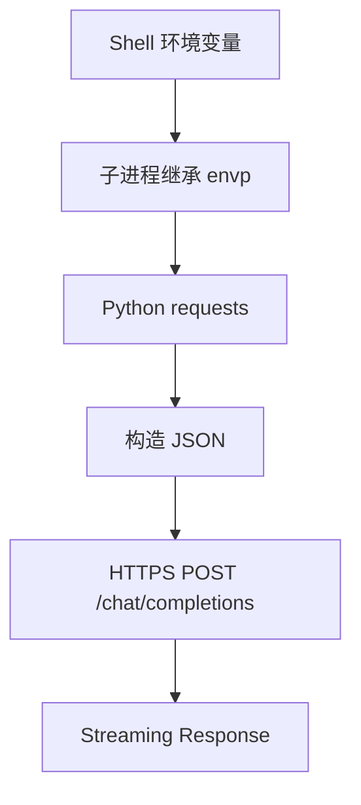
```mermaid
flowchart TD
    A["Shell 环境变量"] --> B["子进程继承 envp"]
    B --> C["Python requests"]
    C --> D["构造 JSON"]
    D --> E["HTTPS POST /chat/completions"]
    E --> F["Streaming Response"]
```

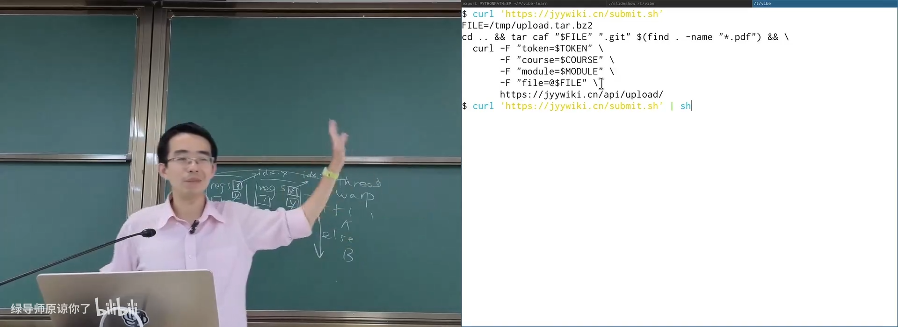

### 2.2 用 `strace` 打开网络请求

*(参考时间: 00:10)*

从操作系统视角看，网络请求仍然是文件描述符和系统调用：

```text
socket()
connect()
sendto()/write()
recvfrom()/read()
close()
```

`strace` 可以展示：

- DNS 查询；
- TCP 连接建立；
- 向远端地址和端口发送数据；
- 从 socket 读取响应；
- 流式响应如何逐段到达。

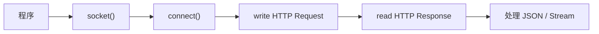
```mermaid
flowchart LR
    A["程序"] --> B["socket()"]
    B --> C["connect()"]
    C --> D["write HTTP Request"]
    D --> E["read HTTP Response"]
    E --> F["处理 JSON / Stream"]
```

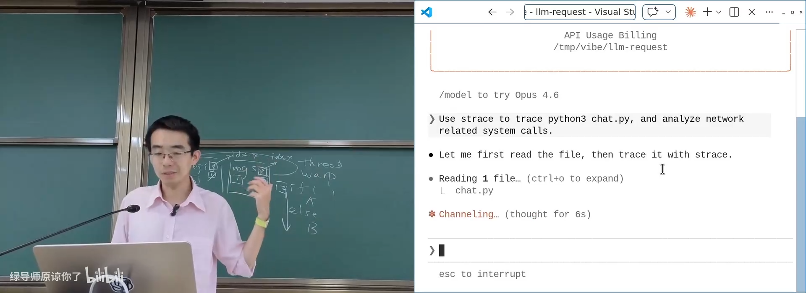

### 2.3 DNS 已经开始负载均衡

*(参考时间: 00:12)*

第一步是把域名解析为 IP：

```bash
dig api.deepseek.com +short
```

大型服务通常返回多个 IP，并且不同地区可能得到不同结果。这本身就是一种负载均衡和流量调度。

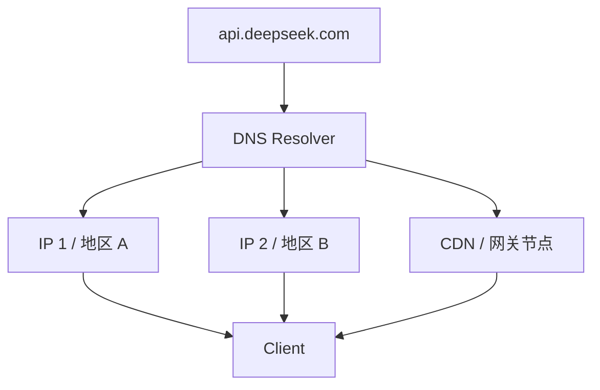
```mermaid
flowchart TD
    A["api.deepseek.com"] --> B["DNS Resolver"]
    B --> C1["IP 1 / 地区 A"]
    B --> C2["IP 2 / 地区 B"]
    B --> C3["CDN / 网关节点"]
    C1 --> D["Client"]
    C2 --> D
    C3 --> D
```

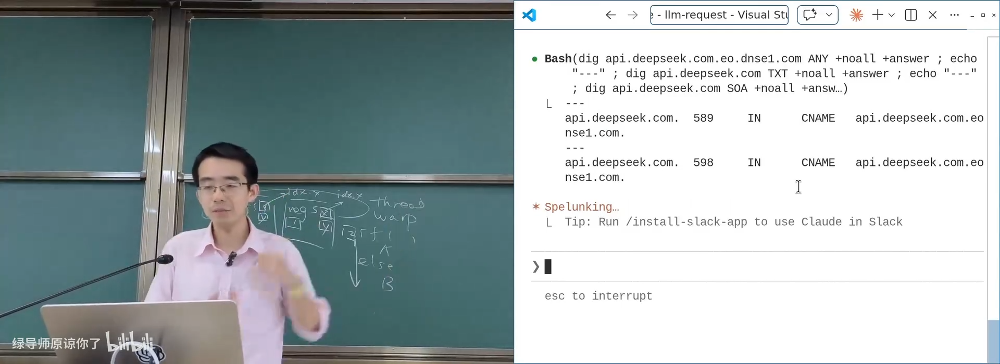

### 2.4 TTL 与逐跳转发

*(参考时间: 00:14)*

`traceroute` 通过逐次增加 TTL，让路径上的路由器返回 ICMP Time Exceeded：

```text
TTL = 1  → 第一跳超时
TTL = 2  → 第二跳超时
TTL = 3  → 第三跳超时
```

典型延迟：

- 局域网：小于 1 ms；
- 同城：几毫秒；
- 跨国：可能约 200 ms。

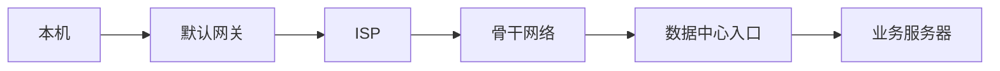
```mermaid
flowchart LR
    A["本机"] --> B["默认网关"]
    B --> C["ISP"]
    C --> D["骨干网络"]
    D --> E["数据中心入口"]
    E --> F["业务服务器"]
```

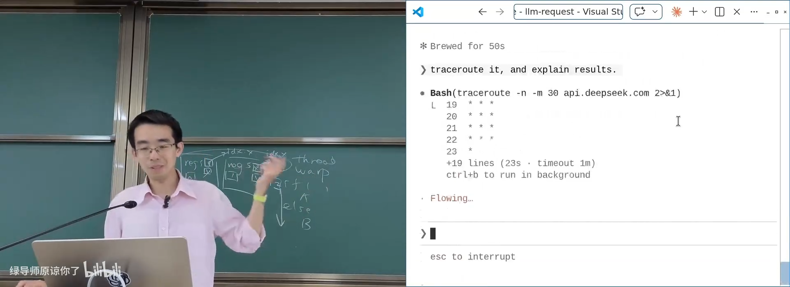

### 2.5 到达的往往先是负载均衡器

*(参考时间: 00:16)*

请求最终到达的机器未必是业务服务器，而可能先抵达负载均衡器或 API 网关。

响应头可能显示：

```http
HTTP/2 200
server: openresty
content-type: text/event-stream
cache-control: no-cache
connection: keep-alive
```

负载均衡器本身只做转发和路由，真正昂贵的模型推理留给后面的 worker。

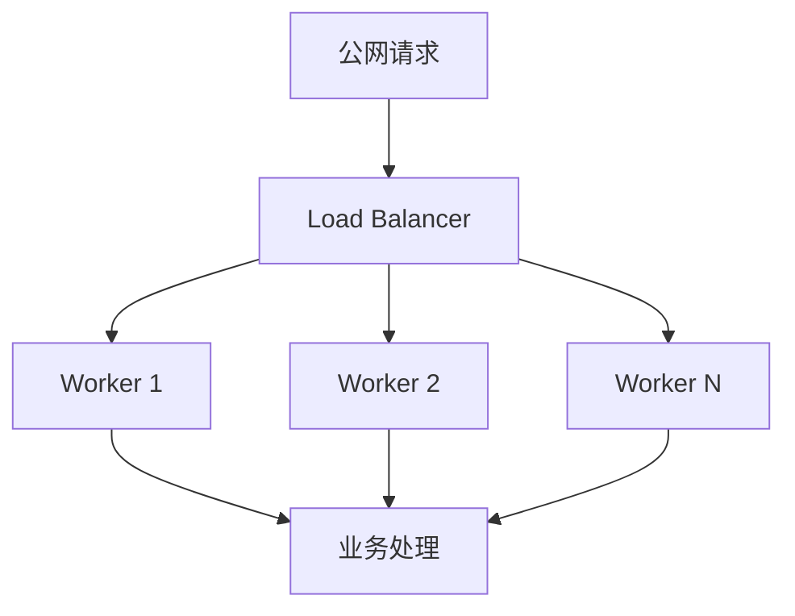
```mermaid
flowchart TD
    A["公网请求"] --> B["Load Balancer"]
    B --> C1["Worker 1"]
    B --> C2["Worker 2"]
    B --> C3["Worker N"]
    C1 --> D["业务处理"]
    C2 --> D
    C3 --> D
```

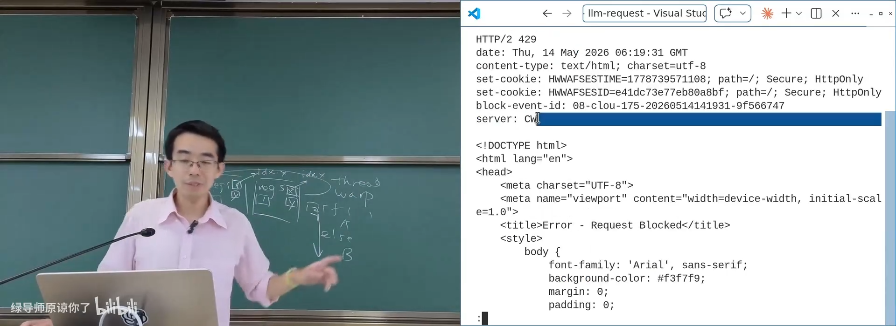

---

## 3. 进入数据中心

### 3.1 上半场：应用后端

*(参考时间: 00:20)*

数据中心可以定义为：

> A network of computing and storage resources that enable the delivery of shared applications and data.

第一波浪潮从 1990 年代持续至今：

- 静态网页；
- Web 2.0；
- 移动互联网；
- 云端账号与个性化数据。

云端保存了用户完整的“personality”，也意味着服务商掌握大量数据。法律限制了数据的使用方式，但技术上这些数据客观存在。

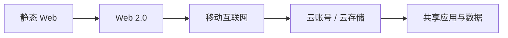
```mermaid
flowchart LR
    A["静态 Web"] --> B["Web 2.0"]
    B --> C["移动互联网"]
    C --> D["云账号 / 云存储"]
    D --> E["共享应用与数据"]
```

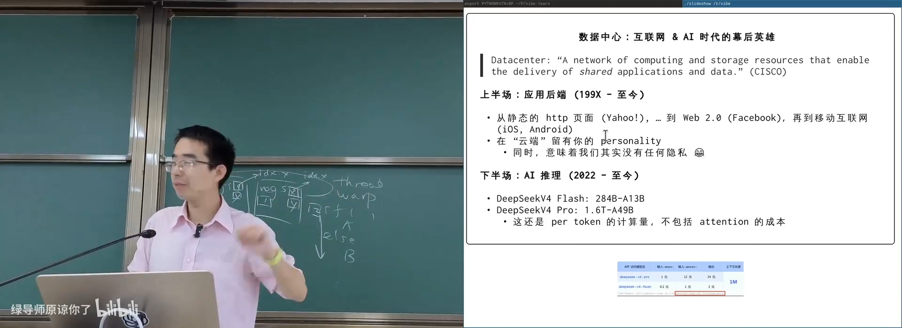

### 3.2 下半场：AI 推理

*(参考时间: 00:22)*

第二波浪潮从生成式 AI 开始。课程举例：

- DeepSeekV4 Flash：`284B-A13B`；
- DeepSeekV4 Pro：`1.6T-A49B`；
- 上述数字还只描述每个 Token 的部分计算，不包含 Attention 的全部成本。

模型规模和推理需求把数据中心从“互联网后端”推进到“AI 基础设施”。

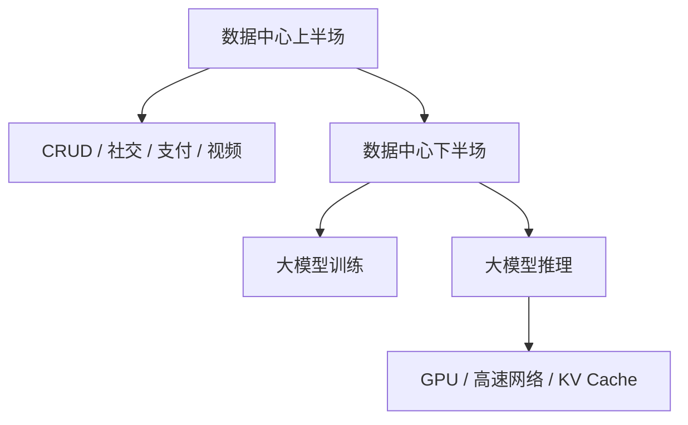
```mermaid
flowchart TD
    A["数据中心上半场"] --> B["CRUD / 社交 / 支付 / 视频"]
    A --> C["数据中心下半场"]
    C --> D["大模型训练"]
    C --> E["大模型推理"]
    E --> F["GPU / 高速网络 / KV Cache"]
```

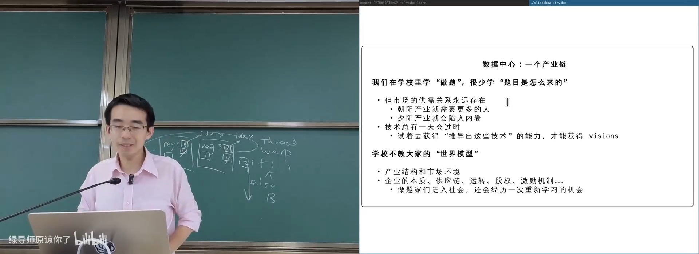

### 3.3 学校之外的世界模型

*(参考时间: 00:24)*

技术本身会过时，但推导技术、理解需求来源的能力不会轻易过时。数据中心背后是完整产业链：

- 土地；
- 电力；
- 水资源与散热；
- 网络；
- 硬件供应链；
- 软件生态；
- 运维、销售与资本市场。

课程提醒：不要只会做题，还要理解题目从哪里来、产业结构如何运转、未来需求会如何变化。

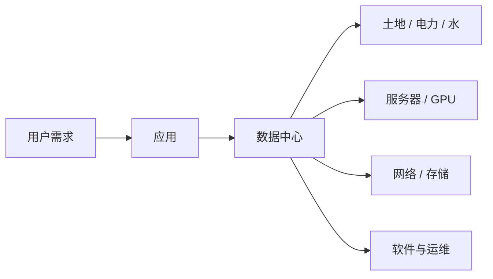
```mermaid
flowchart LR
    A["用户需求"] --> B["应用"]
    B --> C["数据中心"]
    C --> D["土地 / 电力 / 水"]
    C --> E["服务器 / GPU"]
    C --> F["网络 / 存储"]
    C --> G["软件与运维"]
```

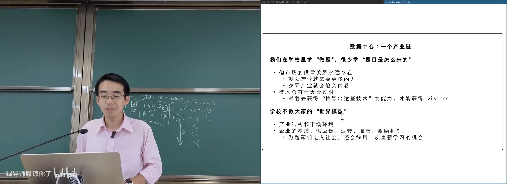

---

## 4. 数据中心中的并发编程

### 4.1 CRUD 仍然是主体

*(参考时间: 00:27)*

实时请求大多属于增删改查：

- 用户鉴权；
- 订单事务；
- 消息与聊天记录；
- 弹幕；
- 点赞与收藏；
- API 计费；
- 内容缓存。

大模型请求之前，也要先完成 API Key 校验、用户状态查询、限流和计费。

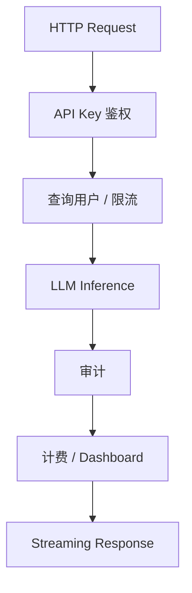
```mermaid
flowchart TD
    A["HTTP Request"] --> B["API Key 鉴权"]
    B --> C["查询用户 / 限流"]
    C --> D["LLM Inference"]
    D --> E["审计"]
    E --> F["计费 / Dashboard"]
    F --> G["Streaming Response"]
```

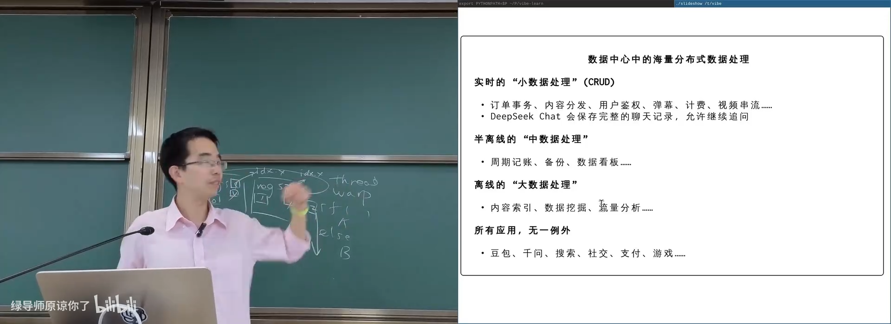

### 4.2 小数据、中数据和大数据

*(参考时间: 00:29)*

数据中心处理的任务可以分成层次：

**实时小数据**

- 订单；
- 鉴权；
- 弹幕；
- 计费。

**半离线中数据**

- 周期记账；
- 日账单、月账单；
- 备份；
- 数据看板。

**离线大数据**

- 内容索引；
- 数据挖掘；
- 流量分析；
- 神经网络训练。

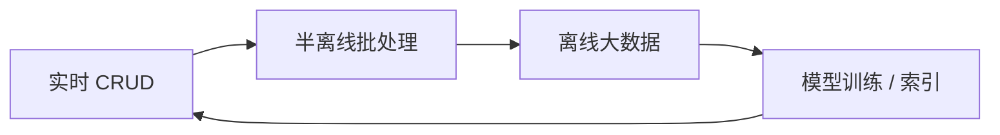
```mermaid
flowchart LR
    A["实时 CRUD"] --> B["半离线批处理"]
    B --> C["离线大数据"]
    C --> D["模型训练 / 索引"]
    D --> A
```

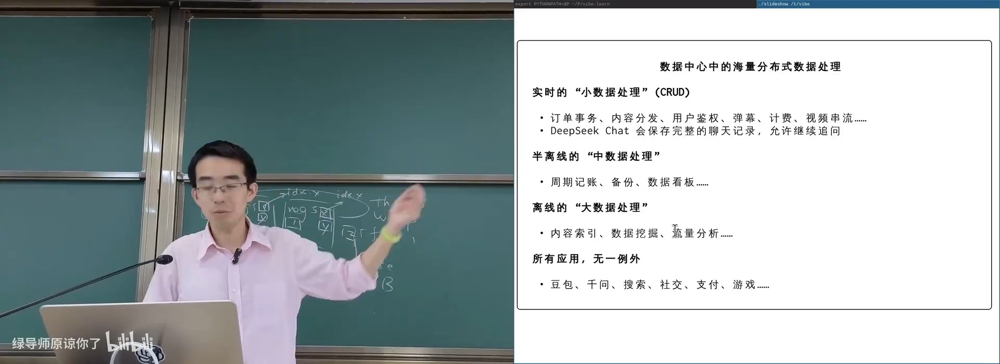

### 4.3 C10K 与线程模型

*(参考时间: 00:30)*

1999 年，Dan Kegel 提出 C10K 问题：能否让 Web 服务器同时处理 10,000 个客户端？

如果每个请求都创建一个线程：

```c
while (true) {
    Request *rq = get_request();
    pthread_create(&tid, NULL, handle_request, rq);
}
```

请求规模和线程资源会迅速失控。

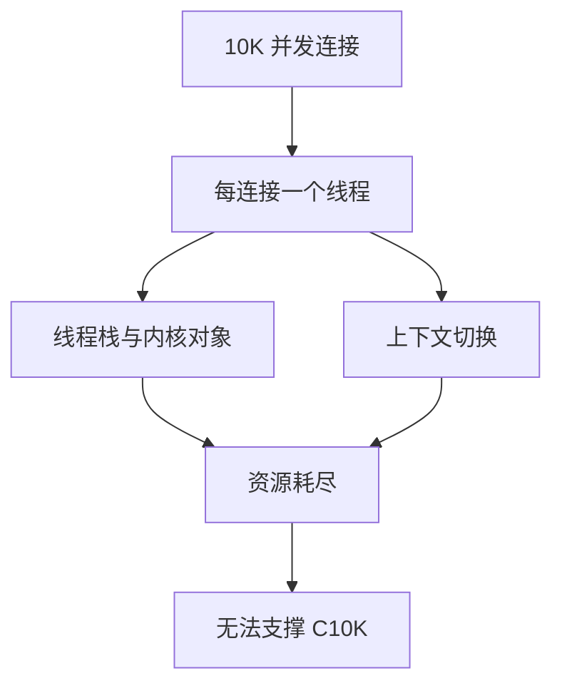
```mermaid
flowchart TD
    A["10K 并发连接"] --> B["每连接一个线程"]
    B --> C["线程栈与内核对象"]
    B --> D["上下文切换"]
    C --> E["资源耗尽"]
    D --> E
    E --> F["无法支撑 C10K"]
```

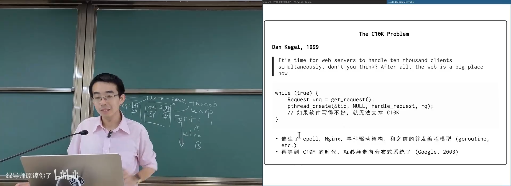

### 4.4 C10K 催生的事件驱动技术

*(参考时间: 00:32)*

C10K 推动了一系列技术出现：

- `select` / `poll`；
- `epoll`；
- Nginx 等事件驱动服务器；
- goroutine 与异步运行时。

从 C10K 到 C10M，单机并发模型不再足够，系统走向分布式架构。

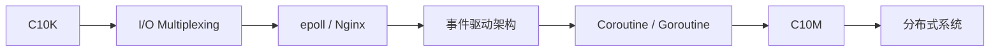
```mermaid
flowchart LR
    A["C10K"] --> B["I/O Multiplexing"]
    B --> C["epoll / Nginx"]
    C --> D["事件驱动架构"]
    D --> E["Coroutine / Goroutine"]
    E --> F["C10M"]
    F --> G["分布式系统"]
```

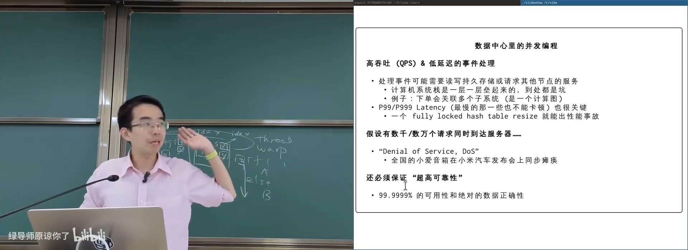

### 4.5 P99 延迟与服务体验

*(参考时间: 00:34)*

数据中心关注的不只是平均延迟，还包括 P99、P999 等尾部延迟。一个全表暂停的并发哈希表 resize 就可能造成事故：

1. 分配几十 MB 新表；
2. 迁移全部 bucket；
3. 暂停期间所有请求等待；
4. 延迟从微秒上升到几十毫秒甚至上百毫秒。

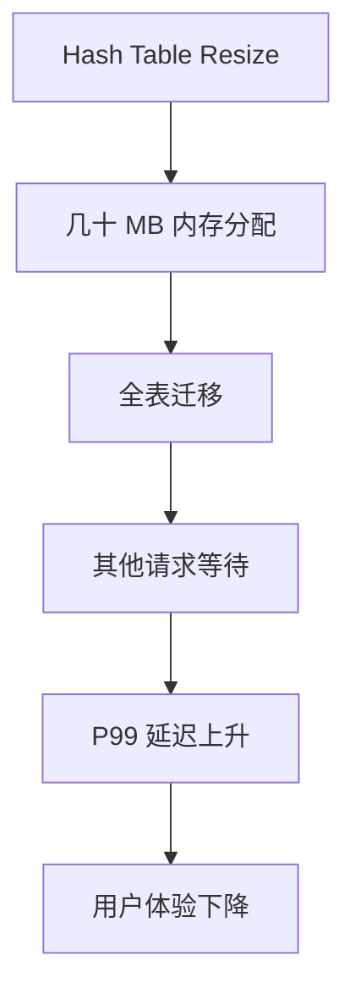
```mermaid
flowchart TD
    A["Hash Table Resize"] --> B["几十 MB 内存分配"]
    B --> C["全表迁移"]
    C --> D["其他请求等待"]
    D --> E["P99 延迟上升"]
    E --> F["用户体验下降"]
```

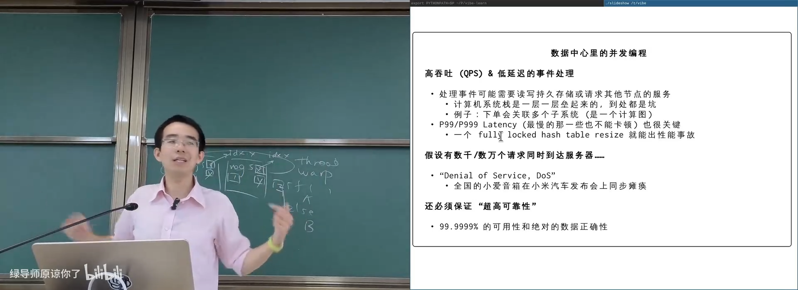

### 4.6 意外的拒绝服务

*(参考时间: 00:36)*

海量请求同时到来，可能形成类似 DoS 的效果。课程提到小米发布会场景：

> 发布会上的“小爱同学”唤醒词，同时触发了全国大量设备，导致服务短时间瘫痪。

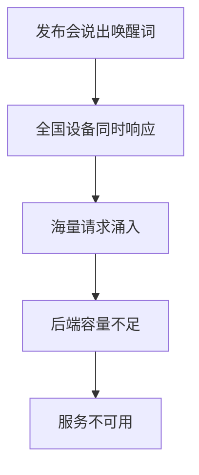
```mermaid
flowchart TD
    A["发布会说出唤醒词"] --> B["全国设备同时响应"]
    B --> C["海量请求涌入"]
    C --> D["后端容量不足"]
    D --> E["服务不可用"]
```

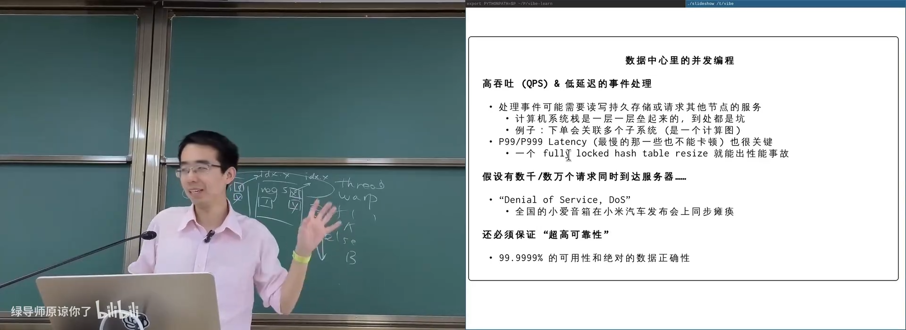

---

## 5. CAP 定理与分布式系统难题

### 5.1 三个目标不能同时满足

*(参考时间: 00:37)*

CAP Theorem：

- **Consistency**：所有节点看到一致的顺序与结果；
- **Availability**：每个请求都能及时得到响应；
- **Partition tolerance**：网络分区或机器失联时系统仍能继续运行。

三者不可兼得。单机系统更容易获得一致性和可用性，但无法扩展为全球分布式系统。

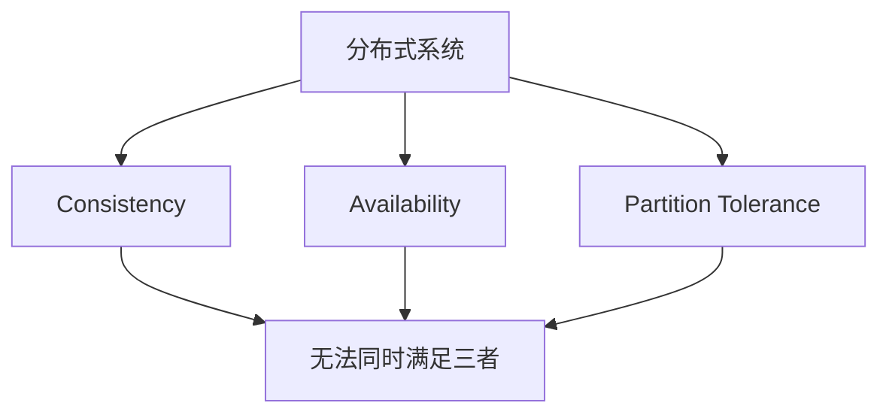
```mermaid
flowchart TD
    A["分布式系统"] --> B["Consistency"]
    A --> C["Availability"]
    A --> D["Partition Tolerance"]
    B --> E["无法同时满足三者"]
    C --> E
    D --> E
```

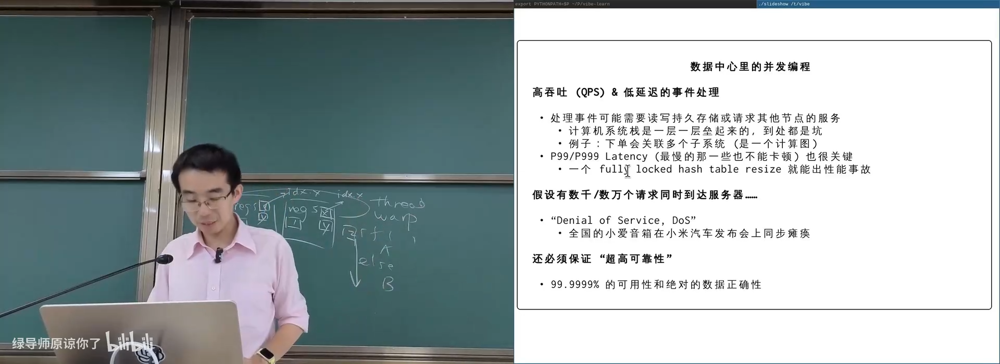

### 5.2 拉黑好友与朋友圈

*(参考时间: 00:38)*

讲师用一个生活例子解释 CAP：

1. 用户先拉黑某人；
2. 随后发布朋友圈；
3. 用户以为两个请求有先后顺序；
4. 但两个请求可能落在不同数据中心；
5. 拉黑状态尚未同步时，另一数据中心仍可能显示朋友圈。

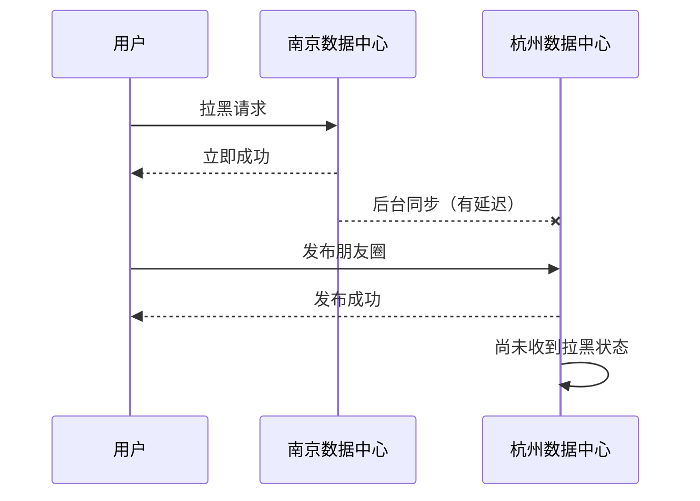
```mermaid
sequenceDiagram
    participant U as 用户
    participant A as 南京数据中心
    participant B as 杭州数据中心
    U->>A: 拉黑请求
    A-->>U: 立即成功
    A--xB: 后台同步（有延迟）
    U->>B: 发布朋友圈
    B-->>U: 发布成功
    B->>B: 尚未收到拉黑状态
```

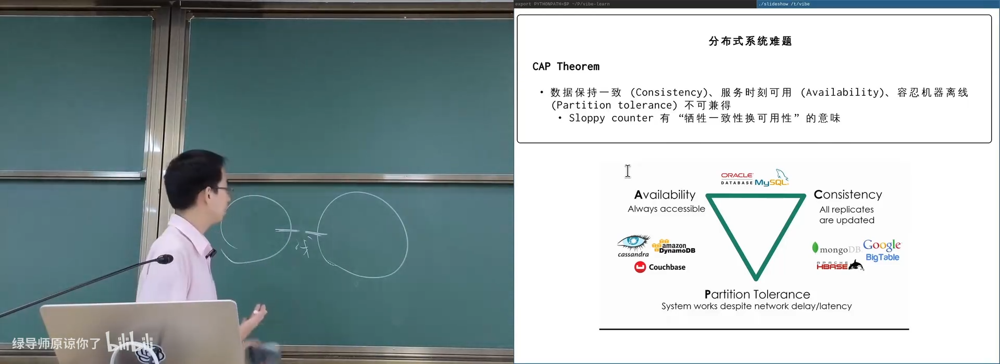

### 5.3 API Key 也撞上 CAP

*(参考时间: 00:43)*

API Key 需要：

- 鉴权；
- 计费；
- 审计；
- 限流；
- 随时禁用。

同一个 Key 可以被多个机器使用，因此 Key 的状态是跨机器的共享数据。禁用操作和并发请求之间同样面临 CAP 问题。

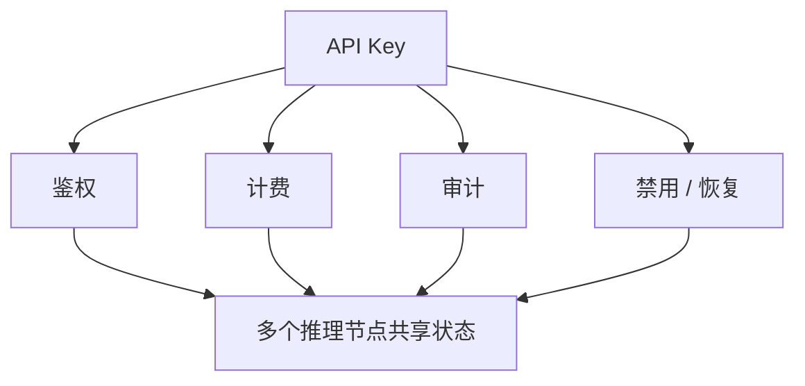
```mermaid
flowchart TD
    A["API Key"] --> B["鉴权"]
    A --> C["计费"]
    A --> D["审计"]
    A --> E["禁用 / 恢复"]
    B --> F["多个推理节点共享状态"]
    C --> F
    D --> F
    E --> F
```

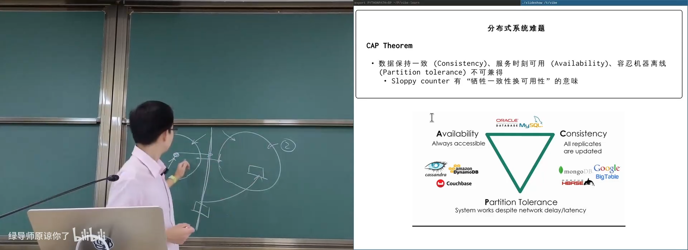

### 5.4 机器随时会消失

*(参考时间: 00:45)*

分布式程序把单机并发难度进一步放大：

- 共享内存操作从纳秒级变成网络毫秒级；
- 网络可能延迟、丢包或分区；
- 机器可能随时断电或离线；
- 程序执行到一半时进程可能消失。

```mermaid
flowchart TD
    A["单机多线程"] --> B["数据竞争 / 死锁"]
    A --> C["共享内存"]
    D["分布式系统"] --> E["网络延迟"]
    D --> F["网络分区"]
    D --> G["机器崩溃"]
    D --> H["请求可能重试"]
```

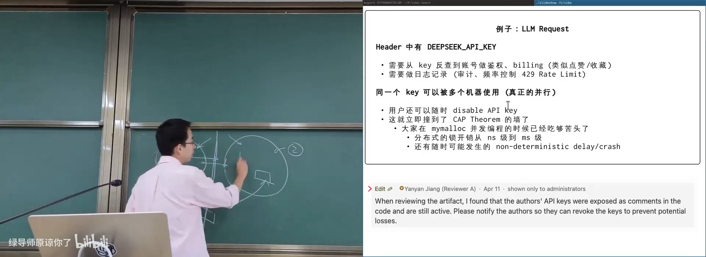

---

## 6. 用新抽象重新设计系统

### 6.1 从“把数据带到计算”到“把计算带到数据”

*(参考时间: 00:47)*

UNIX 以程序为中心，通过管道组合：

```bash
cat input.txt | grep pattern | sort | uniq -c
```

分布式系统则要面对程序随时消失的问题，因此转向以数据为中心：

- 数据被分片；
- 计算被调度到数据附近；
- 失败时重新执行计算；
- 机器和分片对程序员透明。

```mermaid
flowchart LR
    A["UNIX: 数据带到程序"] --> B["程序为核心"]
    C["分布式: 计算带到数据"] --> D["数据 / 分片为核心"]
    D --> E["失败后重算"]
    D --> F["位置透明"]
```

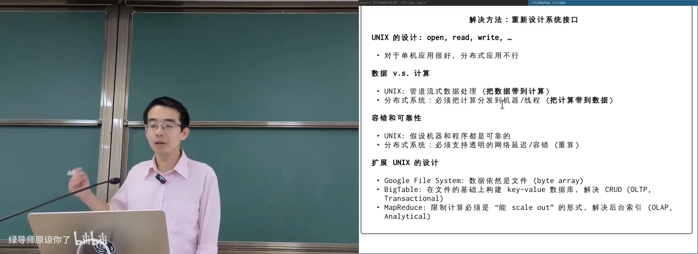

### 6.2 Google File System

*(参考时间: 00:48)*

第一层抽象仍然是文件：

```text
File = Byte Array
```

GFS 把大文件切分并复制到多台机器上，但向应用隐藏机器、分片和副本的存在。

```mermaid
flowchart TD
    A["逻辑文件"] --> B1["Chunk 1"]
    A --> B2["Chunk 2"]
    A --> B3["Chunk 3"]
    B1 --> C1["Machine A"]
    B1 --> C2["Machine B"]
    B2 --> C3["Machine C"]
    B3 --> C4["Machine D"]
```

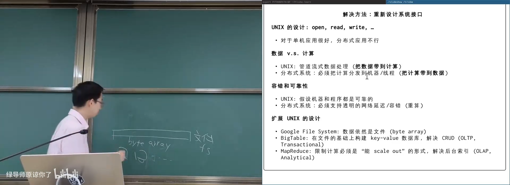

### 6.3 BigTable 与 MapReduce

*(参考时间: 00:50)*

在文件系统之上，Google 构建了更高层抽象：

- **BigTable**：分布式 Key-Value 数据库，解决 OLTP/CRUD；
- **MapReduce**：限制计算形式，使任务可以自动 Scale Out，解决离线索引和 OLAP。

```mermaid
flowchart TD
    A["GFS: 分布式文件"] --> B["BigTable: Key-Value DB"]
    A --> C["MapReduce: 批量计算"]
    B --> D["实时 CRUD"]
    C --> E["离线索引 / 分析"]
```

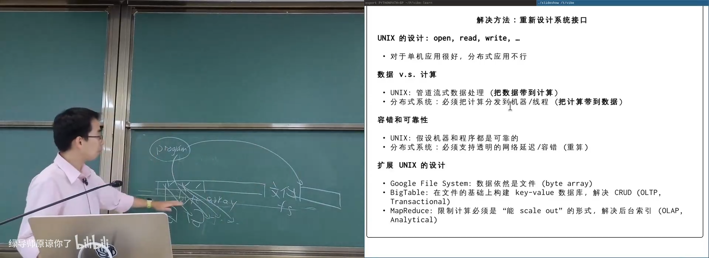

---

## 7. Serverless：描述计算图，把基础设施交给平台

### 7.1 Function as a Service

*(参考时间: 00:52)*

Serverless 的核心思想：

> 编写函数来描述事件驱动的计算图，基础设施、扩容和容错交给云平台。

一个典型事件处理器：

```javascript
const dynamo = new AWS.DynamoDB.DocumentClient();

exports.handler = async (event) => {
    const apiKey = event.headers['Authorization']
        ?.replace('Bearer ', '');

    const user = await dynamo.send(new GetCommand({
        TableName: 'APIKeys',
        Key: { apiKey }
    })).Item;

    if (!user || user.disabled) {
        return { statusCode: 401, body: 'Unauthorized' };
    }

    return {
        statusCode: 200,
        body: await do_llm_inference(event.body)
    };
};
```

```mermaid
flowchart TD
    A["HTTP Event"] --> B["Function Handler"]
    B --> C["读取 API Key"]
    C --> D["查询 Distributed DB"]
    D --> E{"合法且启用？"}
    E -- "否" --> F["401"]
    E -- "是" --> G["LLM Inference"]
    G --> H["200 / Stream"]
```

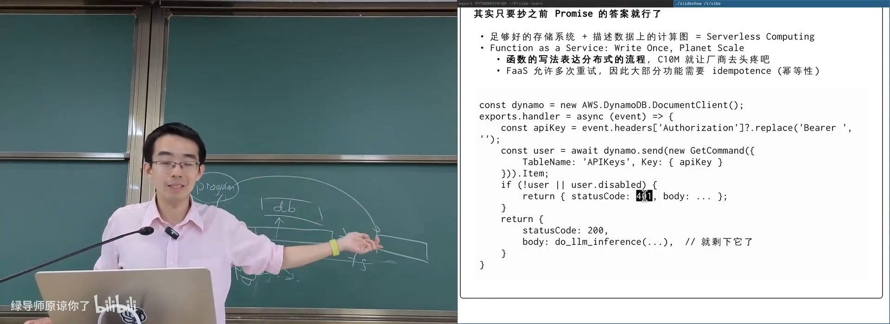

### 7.2 幂等性

*(参考时间: 00:56)*

Serverless 函数可能执行到一半崩溃，平台随后重试。如果简单执行：

```text
load sum
sum++
store sum
```

同一次请求可能被计费两次。

更安全的方式是在函数入口生成唯一事件 ID，并把操作表达为集合插入：

```text
id = unique_request_id()
insert(set, id)
sum = size(set)
```

重复执行只会插入同一个 ID，结果保持一致，这就是**幂等性**。

```mermaid
flowchart TD
    A["函数开始"] --> B["生成唯一 Request ID"]
    B --> C["向 Set 插入 ID"]
    C --> D{"ID 已存在？"}
    D -- "是" --> E["结果不变"]
    D -- "否" --> F["集合大小增加 1"]
    E --> G["安全重试"]
    F --> G
```

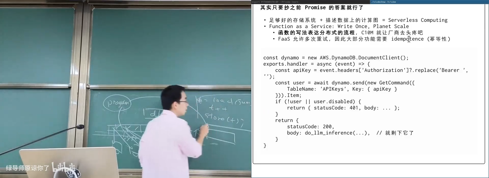

### 7.3 存储与计算分离

*(参考时间: 00:58)*

云环境中的计算节点通过高速网络连接 SSD 集群。应用看似只写一份文件，底层存储系统可能：

- 保存 2 到 3 个副本；
- 自动压缩；
- 对相同内容做去重；
- 用引用计数共享公共文件；
- 在压缩去重后降低实际存储成本。

```mermaid
flowchart LR
    A["计算节点"] --> B["高速网络"]
    B --> C["分布式 SSD / 存储集群"]
    C --> D1["副本 1"]
    C --> D2["副本 2"]
    C --> D3["副本 3"]
    C --> E["压缩 / 去重"]
```

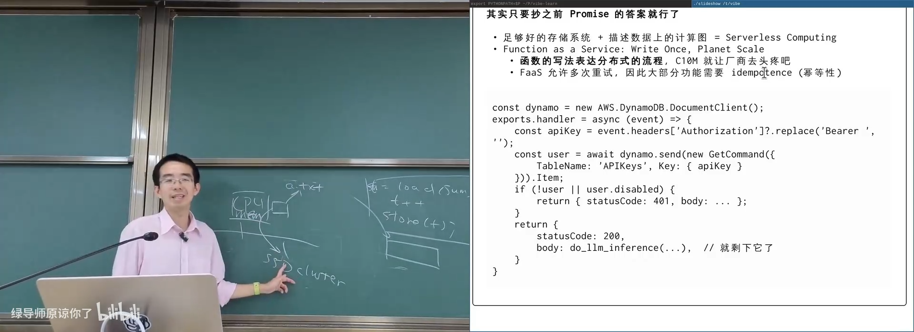

---

## 8. 从 Token 到 Tensor

### 8.1 LLM Forward Pass 是一个巨大的计算图

*(参考时间: 01:00)*

`do_llm_inference()` 做的是 next-token prediction。模型本质上是一个训练得到的超大函数：

```text
input tokens
    ↓
Transformer layers
    ↓
logits
    ↓
sample next token
```

GPT 类模型的核心是重复执行标准矩阵计算和 Attention。`gpt.c` 中存在一个很短的 generator，能够展开为巨大计算图。

```mermaid
flowchart TD
    A["Input Tokens"] --> B["Embedding"]
    B --> C1["Transformer Layer 1"]
    C1 --> C2["Transformer Layer 2"]
    C2 --> C3["..."]
    C3 --> D["Logits"]
    D --> E["Sample Next Token"]
```

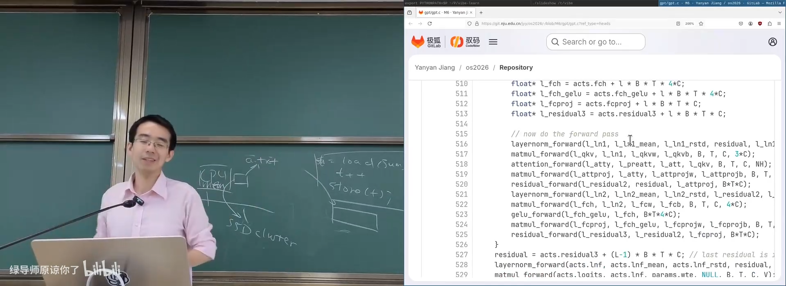

### 8.2 Matmul 与 Attention

*(参考时间: 01:02)*

`matmul_forward` 与 `attention_forward` 是主要热点。CUDA 版本：

```cuda
void matmul_forward(float* out, ..., int B, int T, int C, int OC) {
    int sqrt_block_size = 16;
    dim3 gridDim(
        CEIL_DIV(B * T, 8 * sqrt_block_size),
        CEIL_DIV(OC, 8 * sqrt_block_size)
    );
    dim3 blockDim(sqrt_block_size, sqrt_block_size);

    matmul_forward_kernel4<<<gridDim, blockDim>>>(
        out, inp, weight, bias, C, OC
    );
}
```

结构和 Mandelbrot 这样的逐元素任务很像，只是每个 GPU 线程处理的是矩阵元素或 Attention 内积。

```mermaid
flowchart TD
    A["Batch B"] --> D["Matmul / Attention"]
    B["Sequence T"] --> D
    C["Channels C"] --> D
    D --> E1["Thread (b,t,oc)"]
    D --> E2["Thread (b,t+1,oc)"]
    D --> E3["Thread ..."]
    E1 --> F["Output Tensor"]
    E2 --> F
    E3 --> F
```

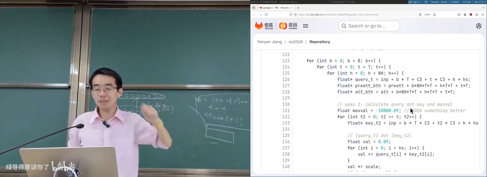

### 8.3 Scalar、Vector、Matrix 与 Tensor

*(参考时间: 01:04)*

深度学习中的数据结构逐级扩展：

- Scalar：一个数；
- Vector：一维数组；
- Matrix：二维数组；
- Tensor：更高维数组。

彩色图像天然有 RGB channel，多个 channel 又组成高维张量；Batch 进一步增加维度。

```mermaid
flowchart LR
    A["Scalar"] --> B["Vector"]
    B --> C["Matrix"]
    C --> D["Tensor"]
    D --> E["RGB Channels"]
    E --> F["Batch / Heads / Layers"]
```

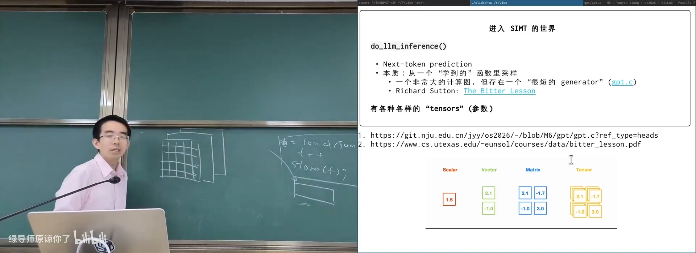

### 8.4 “Attention 是一本书”的类比

*(参考时间: 01:06)*

讲师把每一层 Transformer 比作一本书：

- **Q（Query）**：我现在要找什么，也就是需要补全的句子；
- **K（Key）**：书的目录，我有什么内容；
- **V（Value）**：书的正文，具体内容是什么。

Attention 先根据 Q 和 K 找到与当前问题相关的位置，再按权重从 V 中提取信息，形成一个“短时记忆”。

```mermaid
flowchart LR
    Q["Q: 我在找什么"] --> S["Q × Kᵀ"]
    K["K: 目录索引"] --> S
    S --> W["Softmax 权重"]
    V["V: 正文内容"] --> A["加权求和"]
    W --> A
    A --> M["短时记忆"]
```

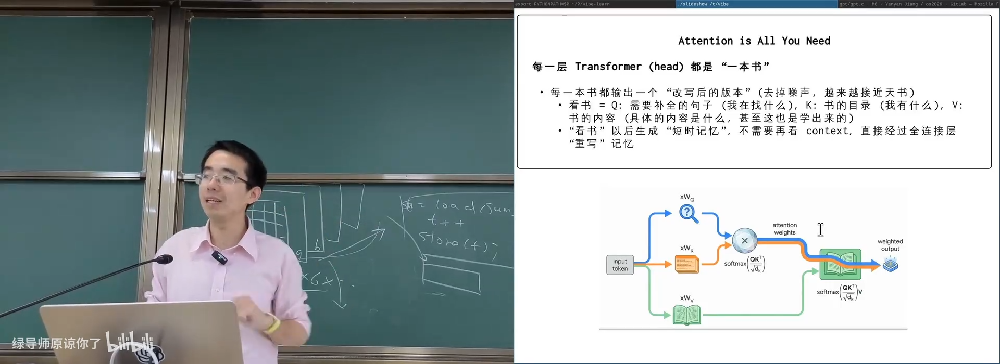

### 8.5 越接近输出，表示越抽象

*(参考时间: 01:09)*

每经过一层 Transformer：

1. 模型读取先前层产生的表示；
2. Attention 提取相关信息；
3. 全连接层重写表示；
4. 新的表示传给下一层。

前几层还容易与 Token 对应，越往后，表示越接近“下一个 Token 的分布”，也越来越难被人类直观解释。

```mermaid
flowchart TD
    A["Token-level 表示"] --> B["Attention 阅读"]
    B --> C["短时记忆"]
    C --> D["全连接重写"]
    D --> E["更高层抽象"]
    E --> F["Next-token Logits"]
```

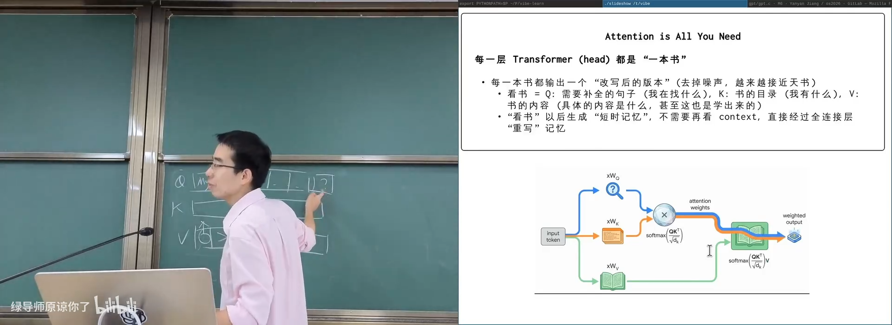

---

## 9. 在 GPU 上压榨极致性能

### 9.1 Kernel 队列也是计算图

*(参考时间: 01:10)*

CUDA Kernel 启动后 CPU 立即返回，GPU 按提交顺序执行。多个 Kernel 形成串行计算图：

```text
Kernel 1
   ↓
Kernel 2
   ↓
Kernel 3
```

每个 Kernel 内部可以拥有极高并行度，但 Kernel 之间往往要等待同步。

```mermaid
flowchart LR
    A["CPU 提交 Kernel"] --> B["Kernel 1"]
    B --> C["Kernel 2"]
    C --> D["Kernel 3"]
    D --> E["返回结果"]
```

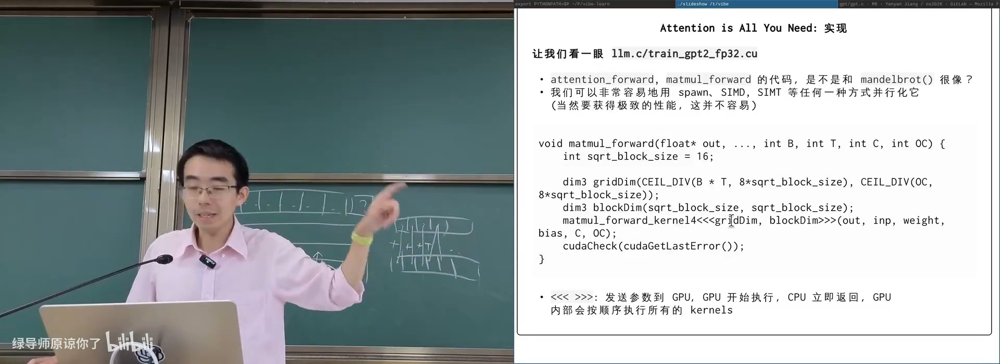

### 9.2 Kernel Fusion 与 FlashAttention

*(参考时间: 01:12)*

如果每个 Kernel 末尾只剩少量线程，GPU 利用率会下降。于是可以把多个算子融合成一个计算图，减少中间读写和同步：

```text
单独 Kernel:
QK → Softmax → PV → Output

Fusion:
在一个 Kernel 中按块完成 Attention
```

这类融合优化推动了 FlashAttention 等技术。

```mermaid
flowchart TD
    A["多个小 Kernel"] --> B["频繁同步"]
    B --> C["利用率下降"]
    C --> D["Kernel Fusion"]
    D --> E["减少中间内存"]
    D --> F["减少同步"]
    E --> G["FlashAttention"]
    F --> G
```

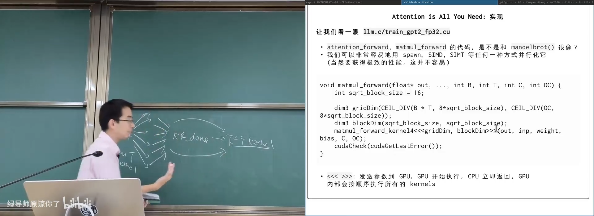

### 9.3 Tensor Core

*(参考时间: 01:14)*

SIMT 已经摊薄了译码成本。进一步把 SIMD 引入 PTX，就可以让一条指令直接完成小矩阵乘法累加：

```text
D(m × n) += A(m × k) × B(k × n)
```

这就是 Tensor Core 的核心运算。

```mermaid
flowchart LR
    A["Matrix A m×k"] --> C["Tensor Core FMA"]
    B["Matrix B k×n"] --> C
    D["Accumulator D m×n"] --> C
    C --> E["Updated D m×n"]
```

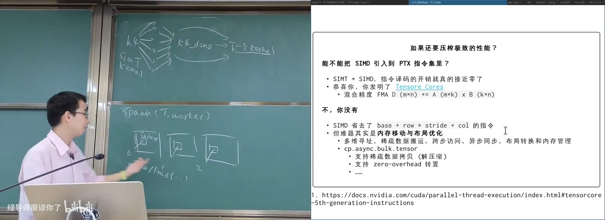

### 9.4 真正困难的是内存布局

*(参考时间: 01:17)*

矩阵乘法需要一行乘一列，但内存是线性的。无论使用行优先还是列优先，总有一个访问维度不连续。

解决方式是把大矩阵切成 tile：

```text
大矩阵乘法
    ↓
切成适合缓存的小块
    ↓
块内高密度计算
    ↓
块间继续组合
```

这会涉及：

- 多维寻址；
- 稀疏数据搬运；
- 跨步访问；
- 异步同步；
- 布局转换；
- 压缩与解压；
- 零开销转置。

```mermaid
flowchart TD
    A["大矩阵"] --> B["Tiling"]
    B --> C["缓存友好的小块"]
    C --> D["Tensor Core FMA"]
    D --> E["跨步访问优化"]
    D --> F["布局转换"]
    E --> G["高带宽"]
    F --> G
```

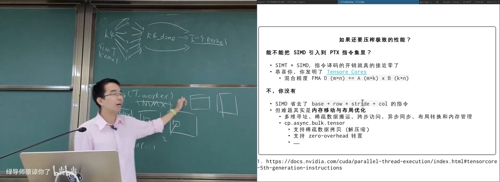

### 9.5 `cp.async.bulk.tensor`

*(参考时间: 01:19)*

新一代 GPU 提供张量拷贝指令，支持：

- 稀疏数据拷贝；
- 解压缩；
- 零开销转置；
- 异步数据搬运。

这些能力让数据以更适合计算的布局进入 Tensor Core。

```mermaid
flowchart LR
    A["Global Memory"] --> B["cp.async.bulk.tensor"]
    B --> C["转置 / 解压缩"]
    C --> D["Shared Memory"]
    D --> E["Tensor Core"]
    E --> F["结果写回"]
```

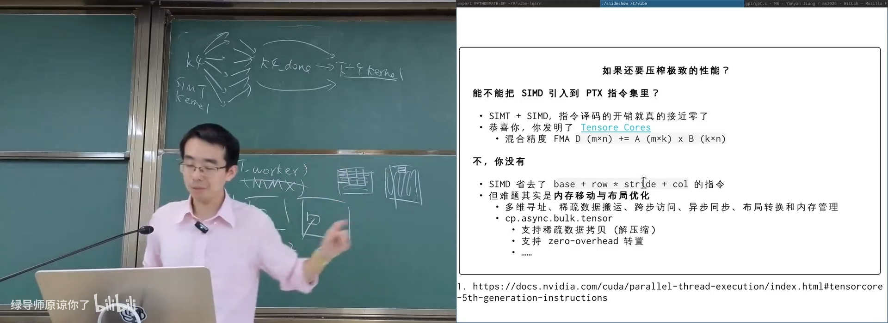

---

## 10. AI 软件栈与 UNIX 历史的相似性

*(参考时间: 01:20)*

AI 生态从底层到应用形成完整栈：

**硬件与编程模型**

- GPU；
- CUDA / PTX；
- cuBLAS、DeepGEMM、NCCL。

**编译器与框架**

- FlashAttention；
- Triton；
- PyTorch、TensorFlow；
- 训练和推理框架。

**模型与应用**

- HuggingFace；
- Ollama、OpenWebUI；
- Agent 与开发工具。

```mermaid
flowchart TD
    A["GPU / Accelerator"] --> B["CUDA / PTX"]
    B --> C["cuBLAS / DeepGEMM / NCCL"]
    C --> D["PyTorch / TensorFlow"]
    D --> E["Training / Inference Framework"]
    E --> F["Model Distribution"]
    F --> G["User Applications"]
```

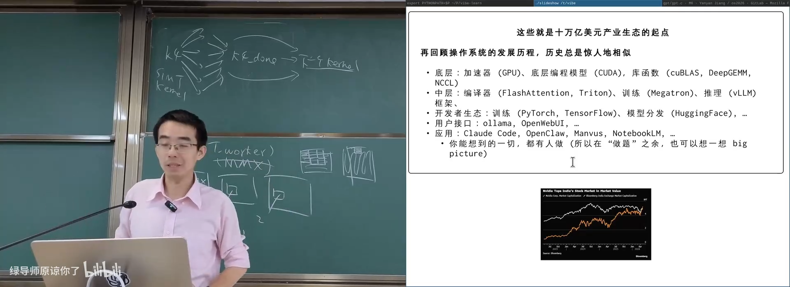

---

## 11. 生成一个 Token：Prefill 与 Decode

### 11.1 小模型与大模型的差别

*(参考时间: 01:24)*

如果模型是 GPT2-XL `1.5B`、上下文 `1K`，推理接近一次普通业务请求。

但 `1.6T` 参数、百万 Token 上下文则完全不同：

- 单张 GPU 放不下全部参数；
- Attention 计算量随上下文长度快速增长；
- 需要 Tensor Parallel、Pipeline Parallel、Expert Parallel；
- 需要 KV Cache 和分布式通信。

```mermaid
flowchart TD
    A["模型规模"] --> B{"单卡可容纳？"}
    B -- "是" --> C["单节点推理"]
    B -- "否" --> D["模型并行"]
    D --> E["Tensor Parallel"]
    D --> F["Pipeline Parallel"]
    D --> G["Expert Parallel"]
```

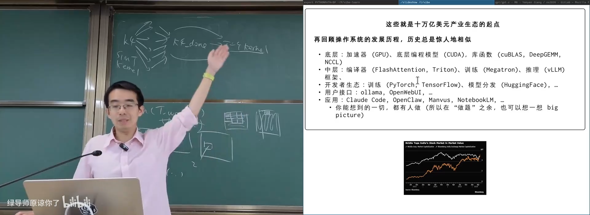

### 11.2 Prefill

*(参考时间: 01:25)*

Prefill 阶段处理输入上下文：

1. 计算每层 Attention 所需的 K 和 V；
2. 保存到 KV Cache；
3. 形成后续生成可复用的中间状态。

```mermaid
flowchart TD
    A["输入上下文"] --> B["逐层计算"]
    B --> C["生成 K"]
    B --> D["生成 V"]
    C --> E["KV Cache"]
    D --> E
```

### 11.3 Decode

*(参考时间: 01:26)*

Decode 阶段生成输出 Token：

1. 读取完整 KV Cache；
2. 用当前 Q 计算 Attention；
3. 形成短时记忆；
4. 生成下一个 Token；
5. 更新 KV Cache；
6. 重复直到结束。

```mermaid
flowchart TD
    A["当前 Q"] --> B["读取 KV Cache"]
    B --> C["Attention"]
    C --> D["短时记忆"]
    D --> E["Next Token"]
    E --> F["更新 KV Cache"]
    F --> B
```

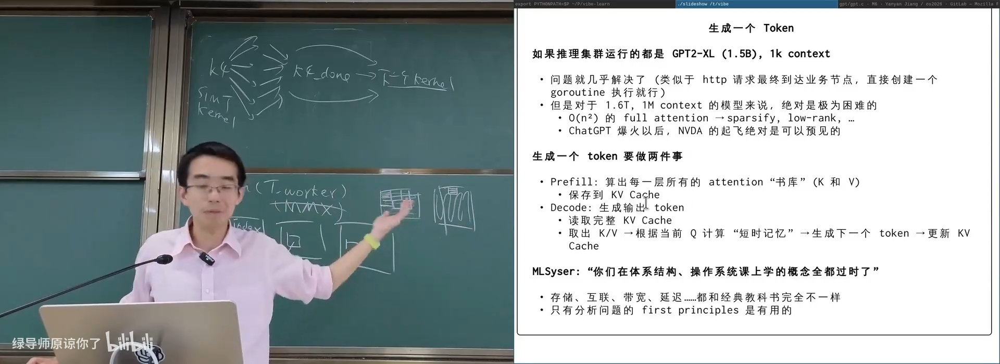

### 11.4 PD 分离

*(参考时间: 01:27)*

Prefill 和 Decode 的资源特征不同，现代推理服务常采用 PD 分离：

- Prefill 阶段计算密集、并行度高；
- Decode 阶段频繁读取 KV Cache、对带宽和延迟敏感；
- 两类任务放在不同资源池，可以提高整体利用率。

```mermaid
flowchart LR
    A["请求"] --> B["Prefill Cluster"]
    B --> C["KV Cache / Transfer"]
    C --> D["Decode Cluster"]
    D --> E1["Token 1"]
    D --> E2["Token 2"]
    D --> E3["Token N"]
```

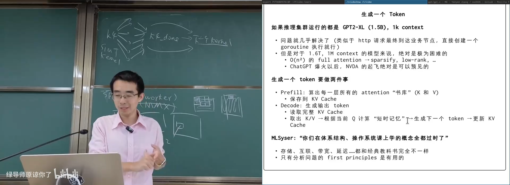

---

## 12. 旅途终点：Token 返回用户

*(参考时间: 01:28)*

生成的 Token 最终返回后，后端还要完成：

- 审计；
- 计费；
- 更新 Dashboard；
- 构造 `text/event-stream` 响应；
- 按 JSONL chunk 逐步发送。

典型响应：

```http
HTTP/2 200
content-type: text/event-stream; charset=utf-8

data: {"id":"...","object":"chat.completion.chunk",
       "model":"deepseek-v4-flash",
       "choices":[{"delta":{"role":"assistant"}}]}
```

```mermaid
flowchart TD
    A["Next Token"] --> B["审计"]
    B --> C["计费"]
    C --> D["更新 Dashboard"]
    D --> E["构造 Streaming Chunk"]
    E --> F["返回客户端"]
```

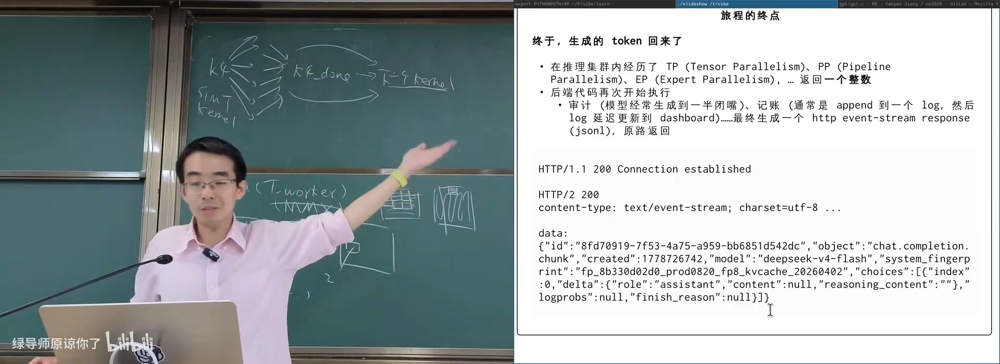

---

## 13. 总结：历史总在重复，问题从未消失

这一讲用“一个 Token 的旅程”串起了整门并发与系统课程：

- 从 HTTP 和环境变量开始；
- DNS、路由和负载均衡把请求送达数据中心；
- CRUD、缓存、鉴权和计费构成业务层；
- C10K/C10M 推动事件驱动和分布式架构；
- CAP 和机器故障迫使系统重新设计抽象；
- GFS、BigTable、MapReduce、Serverless 逐层封装复杂性；
- 模型推理最终落入 Tensor、Attention 和 GPU Kernel；
- Prefill/Decode、KV Cache、Tensor Core 和内存布局决定推理性能。

```mermaid
flowchart LR
    A["HTTP Request"] --> B["Network"]
    B --> C["Distributed CRUD"]
    C --> D["Serverless / Data"]
    D --> E["Transformer"]
    E --> F["GPU Kernel"]
    F --> G["Tensor Core"]
    G --> H["Next Token"]
    H --> I["Stream Response"]
```

课程最后指出，技术会不断过时，但分析系统的方法不会：

> 从 first principles 出发，理解每一层在做什么，才能在未知的新系统中找到自己的位置。

---

## 附：官方参考与延伸阅读

- [一个 LLM Request](https://jyywiki.cn/OS/demos/concurrency/llm-request)
- [gpt.c](https://git.nju.edu.cn/jyy/os2026/-/blob/M6/gpt/gpt.c?ref_type=heads)
- [Richard Sutton, The Bitter Lesson](https://www.cs.utexas.edu/~eunsol/courses/data/bitter_lesson.pdf)
- [NVIDIA PTX Tensor Core Instructions](https://docs.nvidia.com/cuda/parallel-thread-execution/index.html#tensorcore-5th-generation-instructions)
- [提交脚本示例](https://jyywiki.cn/submit.sh)

官方课程资料：

- [课程主页](https://jyywiki.cn/OS/2026/)
- [第 21 讲讲义：一个 Token 的旅程](https://jyywiki.cn/OS/2026/lect21.md)
- [视频：21 - 一个 Token 的旅程](https://www.bilibili.com/video/BV1zS5R6tEWZ/)

> **版权与署名**：本讲课程材料由蒋炎岩（jyy）编写。课程讲义与幻灯片采用 [Creative Commons BY-NC 4.0](http://creativecommons.org/licenses/by-nc/4.0/) 许可；本电子书保留课程出处、作者署名与许可说明。
