# 输入输出设备和驱动：从一根 GPIO 线到 file_operations

> **课程**：2026 春季学期《操作系统原理》  
> **讲师**：蒋炎岩（jyy）  
> **官方课程主页**：<https://jyywiki.cn/OS/2026/>  
> **官方讲义**：<https://jyywiki.cn/OS/2026/lect22.md>  
> **视频来源**：[Bilibili BV1dYLq6gE8W](https://www.bilibili.com/video/BV1dYLq6gE8W/)  
> **版权说明**：课程讲义与幻灯片归蒋炎岩所有，采用 [Creative Commons BY-NC 4.0](http://creativecommons.org/licenses/by-nc/4.0/) 许可；本电子书是对课堂讲授的书面化重构，保留出处与许可说明。

## 导语：计算机真正“看得见”的部分

*(参考时间: 00:00)*

操作系统课程前几部分主要在讲 CPU、地址空间、进程和并发。这些内容都是用户平时“看不见”的：

- 进程如何被虚拟化；
- 线程如何同步；
- GPU 如何执行海量线程。

而用户实际接触到的计算机，是键盘、鼠标、屏幕、摄像头、打印机、磁盘和网络：

> 输入输出设备是计算世界与物理世界之间的桥梁。

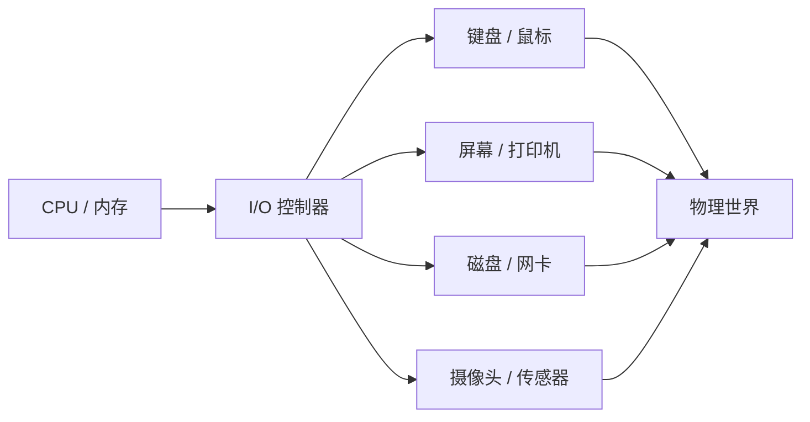
```mermaid
flowchart LR
    A["CPU / 内存"] --> B["I/O 控制器"]
    B --> C1["键盘 / 鼠标"]
    B --> C2["屏幕 / 打印机"]
    B --> C3["磁盘 / 网卡"]
    B --> C4["摄像头 / 传感器"]
    C1 --> D["物理世界"]
    C2 --> D
    C3 --> D
    C4 --> D
```

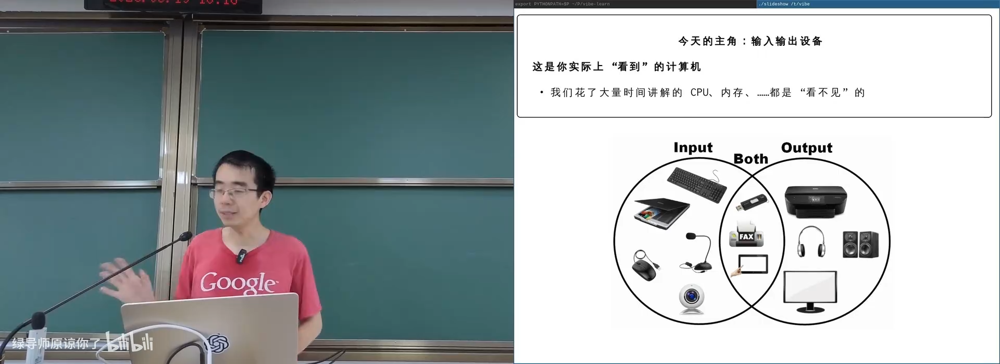

---

## 1. I/O 设备的最小模型

### 1.1 Canonical Device Model

*(参考时间: 00:04)*

一个设备在 CPU 看来可以简化成“几组约定好功能的寄存器”：

- **Status**：设备是否 ready，是否有数据，是否出错；
- **Command**：要求设备执行什么操作；
- **Data**：读写实际数据。

设备内部可能非常复杂，但 CPU 只需和这几类寄存器交互。

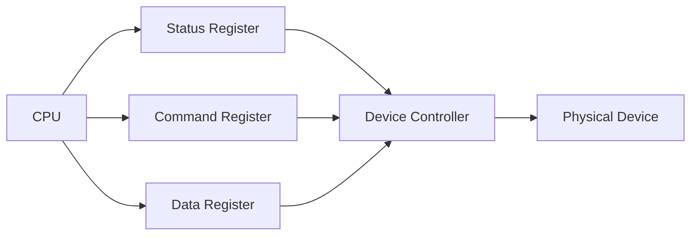
```mermaid
flowchart LR
    CPU["CPU"] --> S["Status Register"]
    CPU --> C["Command Register"]
    CPU --> D["Data Register"]
    S --> DEV["Device Controller"]
    C --> DEV
    D --> DEV
    DEV --> PHYS["Physical Device"]
```

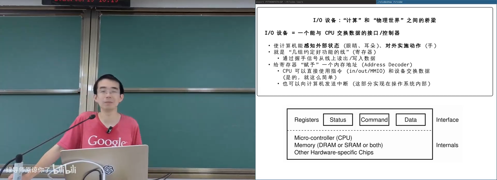

### 1.2 Port I/O、MMIO 与中断

*(参考时间: 00:06)*

寄存器可以通过两种方式映射给 CPU：

1. **Port I/O**：需要单独的 I/O 地址空间，如 x86 的 `in/out`；
2. **Memory-mapped I/O**：寄存器被映射到物理地址，直接使用 load/store 访问。

```text
x86:
  inb / outb        → I/O 地址空间

ARM / RISC-V:
  load / store      → MMIO 地址
```

设备还能通过中断通知 CPU。操作系统可以把它理解成一个等待事件的线程：

```text
device thread:
    P(semaphore)

interrupt handler:
    V(semaphore)
```

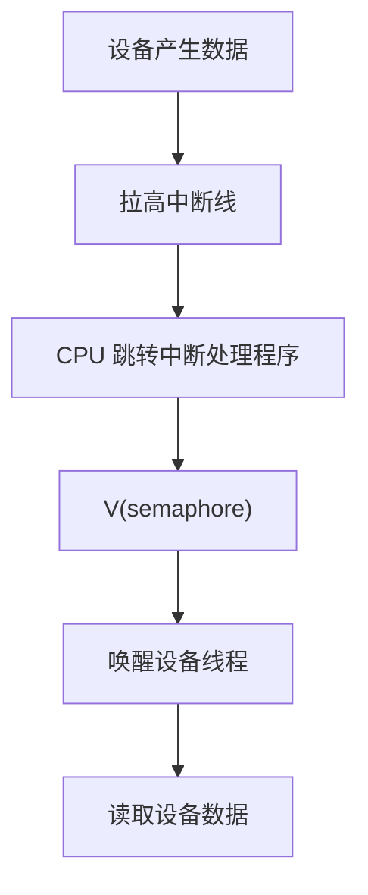
```mermaid
flowchart TD
    A["设备产生数据"] --> B["拉高中断线"]
    B --> C["CPU 跳转中断处理程序"]
    C --> D["V(semaphore)"]
    D --> E["唤醒设备线程"]
    E --> F["读取设备数据"]
```

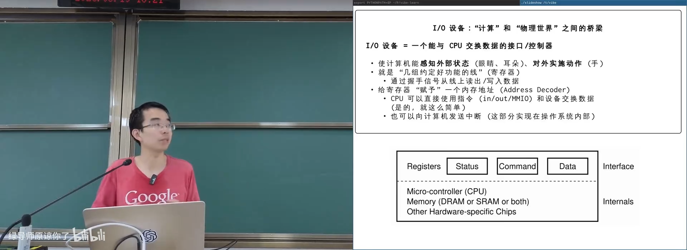

---

## 2. 从最简单的设备开始

### 2.1 GPIO LED

*(参考时间: 00:09)*

GPIO（General Purpose Input/Output）可以直接读取或写入电平：

```text
0 = 低电平
1 = 高电平（通常 3.3V）
```

在树莓派上，程序可以写出一个寄存器值来控制 LED。用户态程序则可以通过类似文件接口操作：

```c
int fd = open("/sys/class/leds/power/brightness", O_WRONLY);
write(fd, "1", 1);
```

讲师指出：

> 既然可以驱动 LED，就可以驱动继电器、马达或其他物理执行器。

理论上，从控制一个灯到控制更复杂的外部设备，接口本质没有区别。


```mermaid
flowchart LR
    A["用户程序"] --> B["write 文件"]
    B --> C["设备驱动"]
    C --> D["GPIO 寄存器"]
    D --> E["LED / 继电器"]
    E --> F["物理动作"]
```

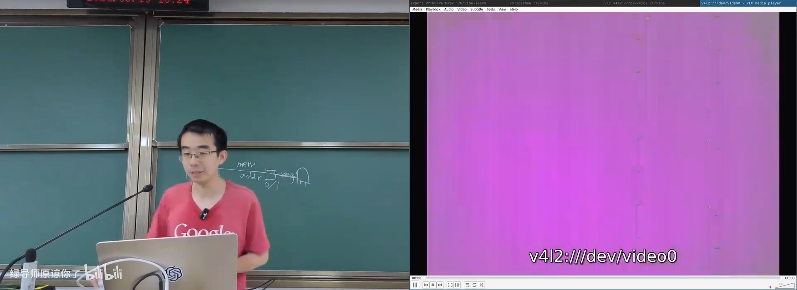

### 2.2 串口 UART

*(参考时间: 00:13)*

UART 是 Universal Asynchronous Receiver/Transmitter。x86 上的 COM1 常见基址为 `0x3F8`：

```c
#define COM1 0x3f8

static int uart_init() {
    outb(COM1 + 2, 0);
    outb(COM1 + 3, 0x80);
    outb(COM1 + 0, 115200 / 9600);
    // ...
}

static void uart_tx(AM_UART_TX_T *send) {
    outb(COM1, send->data);
}

static void uart_rx(AM_UART_RX_T *recv) {
    recv->data = (inb(COM1 + 5) & 0x1)
        ? inb(COM1)
        : -1;
}
```

Linux 中 `/dev/ttyS0` 可能就对应一个 UART。寄存器足够简单，但组合起来就能实现终端通信。

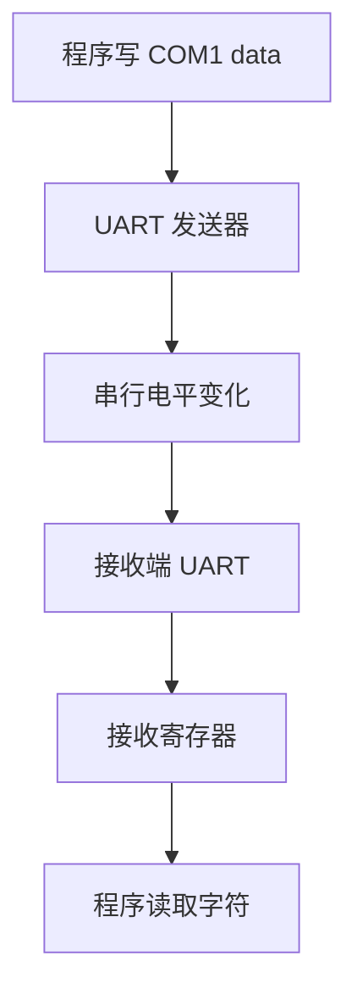
```mermaid
flowchart TD
    A["程序写 COM1 data"] --> B["UART 发送器"]
    B --> C["串行电平变化"]
    C --> D["接收端 UART"]
    D --> E["接收寄存器"]
    E --> F["程序读取字符"]
```

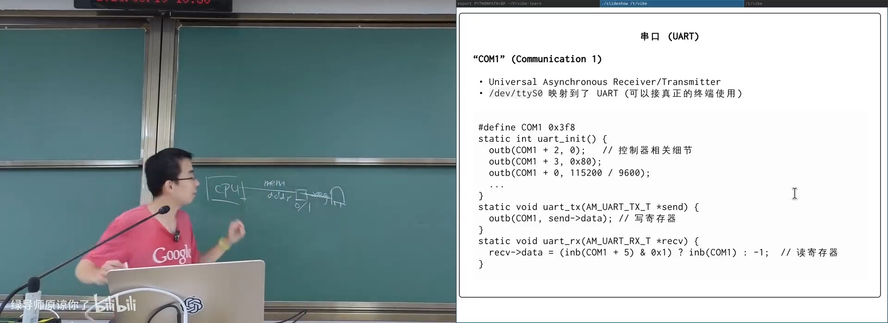

### 2.3 PS/2 键盘控制器

*(参考时间: 00:16)*

IBM PC/AT 8042 键盘控制器使用少量线：

- Data；
- Clock；
- VCC；
- GND。

常见端口：

```text
0x60 = data
0x64 = status / command
```

通过命令字节可以：

- 控制 Caps Lock 灯；
- 设置重复速度；
- 设置重复延迟。

早期键盘可以在控制器内部自动重复按键，以减少 CPU 负担。后来更多重复逻辑转移到软件。

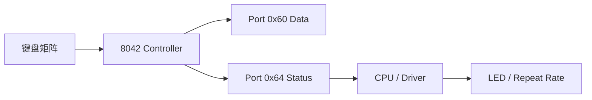
```mermaid
flowchart LR
    A["键盘矩阵"] --> B["8042 Controller"]
    B --> C["Port 0x60 Data"]
    B --> D["Port 0x64 Status"]
    D --> E["CPU / Driver"]
    E --> F["LED / Repeat Rate"]
```

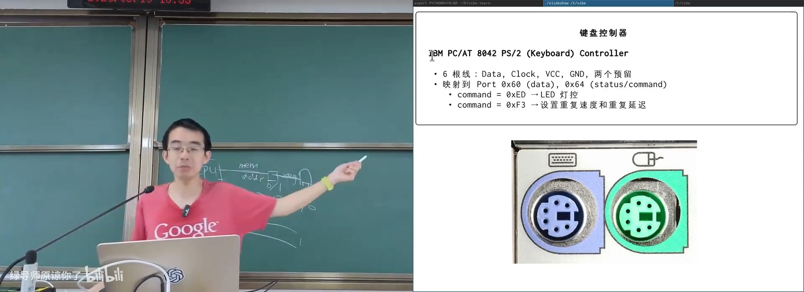

### 2.4 ATA 磁盘

*(参考时间: 00:18)*

ATA / IDE 磁盘同样暴露寄存器：

```text
primary:   0x1f0 - 0x1f7
secondary: 0x170 - 0x177
```

读取一个扇区：

```c
void readsect(void *dst, int sect) {
    waitdisk();
    out_byte(0x1f2, 1);                   // sector count
    out_byte(0x1f3, sect);                // LBA low
    out_byte(0x1f4, sect >> 8);           // LBA mid
    out_byte(0x1f5, sect >> 16);          // LBA high
    out_byte(0x1f6, (sect >> 24) | 0xe0); // drive
    out_byte(0x1f7, 0x20);                // read command
    waitdisk();

    for (int i = 0; i < SECTSIZE / 4; i++)
        ((uint32_t *)dst)[i] = in_long(0x1f0);
}
```

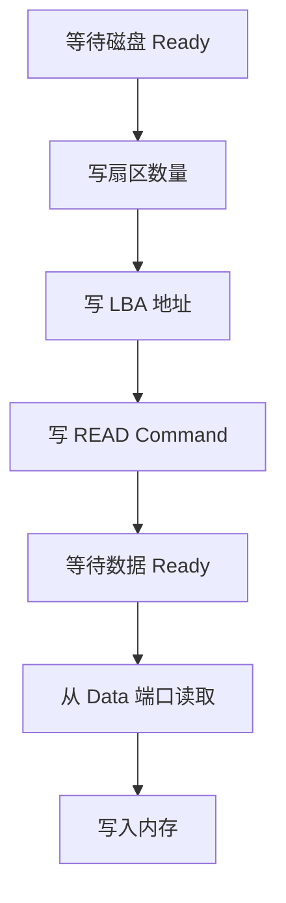
```mermaid
flowchart TD
    A["等待磁盘 Ready"] --> B["写扇区数量"]
    B --> C["写 LBA 地址"]
    C --> D["写 READ Command"]
    D --> E["等待数据 Ready"]
    E --> F["从 Data 端口读取"]
    F --> G["写入内存"]
```

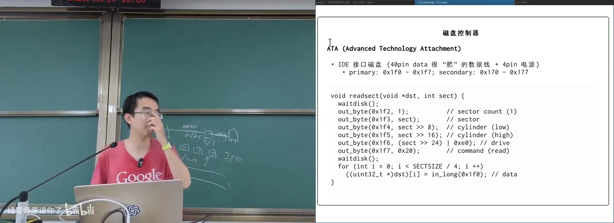

---

## 3. 打印机：设备也是一台程序解释器

### 3.1 绘图仪模型

*(参考时间: 00:21)*

早期打印机其实可以看成绘图仪：

- X 轴移动；
- Y 轴移动；
- 抬笔、落笔。

只要有直线移动和抬落笔，就能画出任意图形。

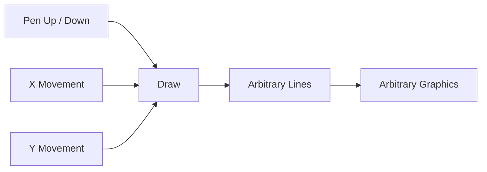
```mermaid
flowchart LR
    A["Pen Up / Down"] --> D["Draw"]
    B["X Movement"] --> D
    C["Y Movement"] --> D
    D --> E["Arbitrary Lines"]
    E --> F["Arbitrary Graphics"]
```

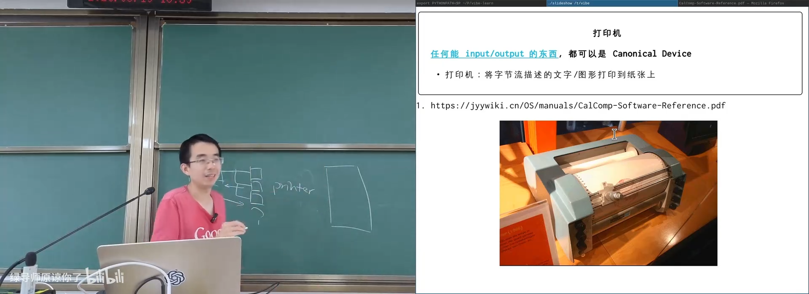

### 3.2 从低级命令到页面描述语言

*(参考时间: 00:24)*

打印机本身可以理解为一台解释器：

```text
高级页面描述
    ↓ 编译器
打印机控制指令
    ↓ Data Register
打印机解释器
    ↓
机械动作
```

当打印内容越来越复杂，就需要更高层的页面描述语言：

- PCL；
- PostScript；
- PDF；
- IPP / AirPrint。

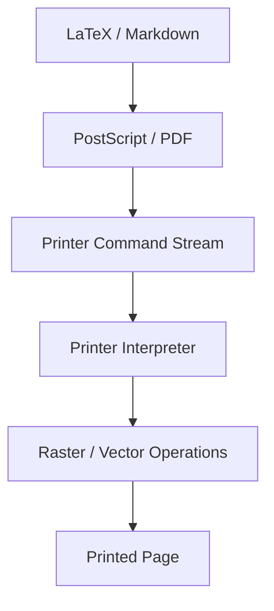
```mermaid
flowchart TD
    A["LaTeX / Markdown"] --> B["PostScript / PDF"]
    B --> C["Printer Command Stream"]
    C --> D["Printer Interpreter"]
    D --> E["Raster / Vector Operations"]
    E --> F["Printed Page"]
```

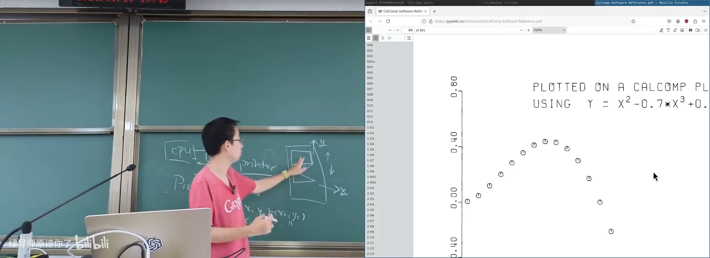

### 3.3 PCL 命令流

*(参考时间: 00:26)*

PCL 使用 ESC 前缀和命令字符：

```text
<ESC>*t300R          设置 300 DPI
<ESC>*r1A            开始光栅图形
<ESC>*b100W          设置光栅宽度
<ESC>*b0M            设置无压缩模式
<ESC>*b100V          发送 100 字节数据
<binary raster data>
<ESC>*rB             结束光栅图形
```

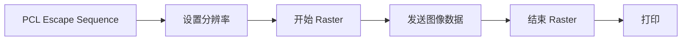
```mermaid
flowchart LR
    A["PCL Escape Sequence"] --> B["设置分辨率"]
    B --> C["开始 Raster"]
    C --> D["发送图像数据"]
    D --> E["结束 Raster"]
    E --> F["打印"]
```

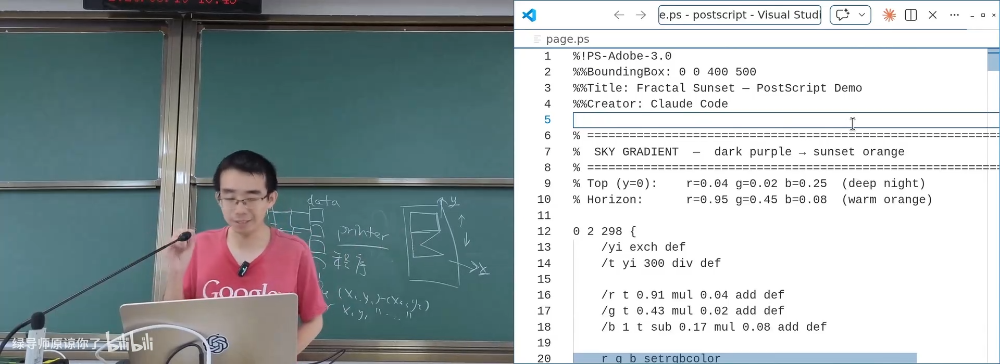

### 3.4 PostScript 与 PDF

*(参考时间: 00:28)*

PostScript 是图灵完备的页面描述语言：

- 构造路径；
- 填充路径；
- 绘制曲线；
- 设置字体；
- 渲染文本；
- 引用外部对象。

PDF 保留了页面描述能力，但去掉了 PostScript 的通用执行能力，成为更安全的容器格式。

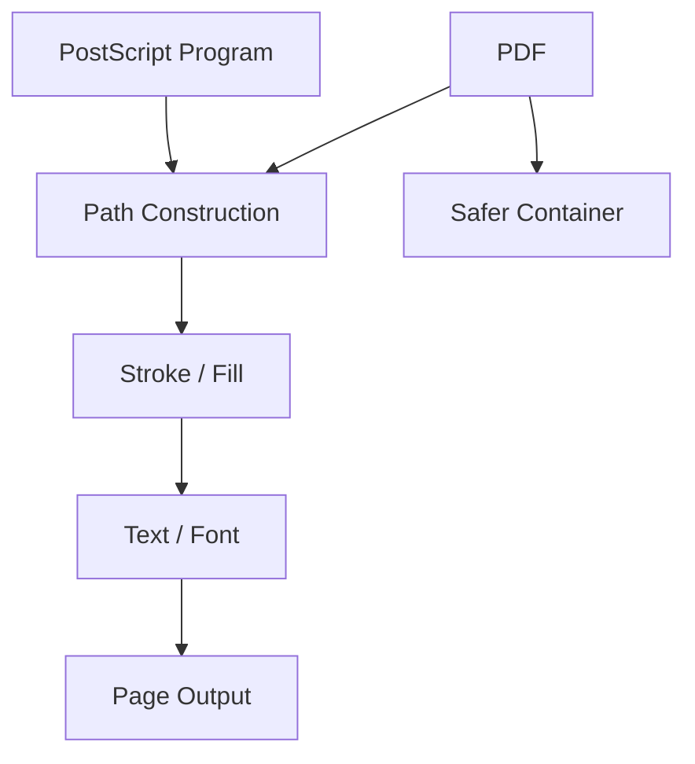
```mermaid
flowchart TD
    A["PostScript Program"] --> B["Path Construction"]
    B --> C["Stroke / Fill"]
    C --> D["Text / Font"]
    D --> E["Page Output"]
    F["PDF"] --> B
    F --> G["Safer Container"]
```

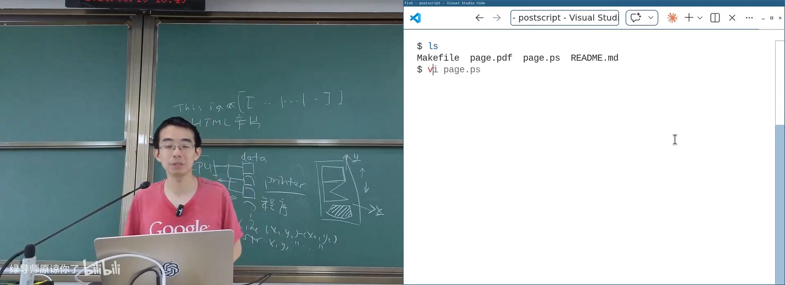

---

## 4. UVC 摄像头：标准化带来的即插即用

*(参考时间: 00:32)*

如今大量 USB 摄像头都是“免驱”的，原因是它们遵循 UVC（USB Video Class）。

UVC 协议流程包括：

1. 枚举设备；
2. 查询能力；
3. 协商格式、分辨率、帧率；
4. 分配缓冲区；
5. 开始视频流；
6. 逐帧读取 MJPEG / H.264。

虽然是 USB 设备，本质上仍然是交换字节流。

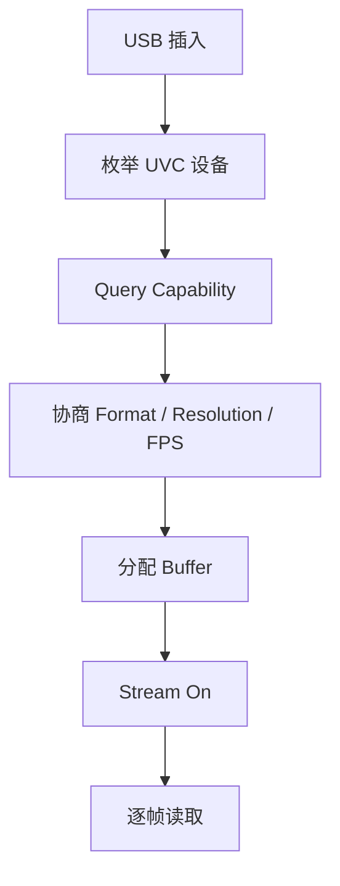
```mermaid
flowchart TD
    A["USB 插入"] --> B["枚举 UVC 设备"]
    B --> C["Query Capability"]
    C --> D["协商 Format / Resolution / FPS"]
    D --> E["分配 Buffer"]
    E --> F["Stream On"]
    F --> G["逐帧读取"]
```

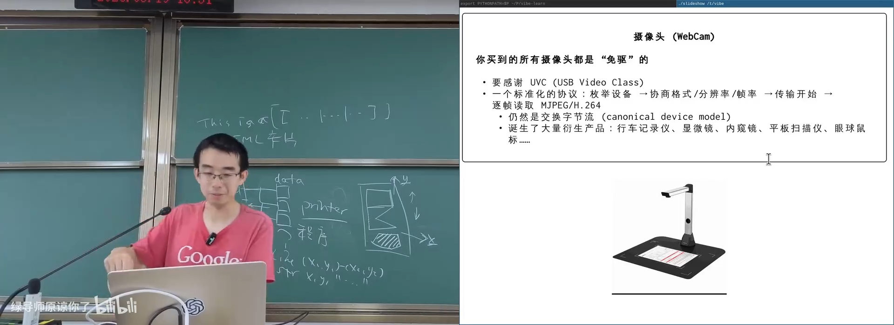

---

## 5. 协处理器与 DMA

### 5.1 DMA 是一台只会 memcpy 的小 CPU

*(参考时间: 00:35)*

DMA（Direct Memory Access）可以被理解为一台极简处理器：

- 与 CPU 共享内存；
- 可以访问部分 I/O 端口；
- 只执行固定形式的搬运；
- 不需要取指、译码和通用指令。

Intel 8237 有四个通道：

```c
void T_i8237() {
    while (1) {
        for (int i = 0; i < 4; i++) {
            struct channel_t *ch = &channels[i];
            if (ch->count-- > 0) {
                if (ch->mode == READ)
                    ch->io = ch->mem[ch->addr++];
                else
                    ch->mem[ch->addr++] = ch->io;
                break;
            }
        }
    }
}
```

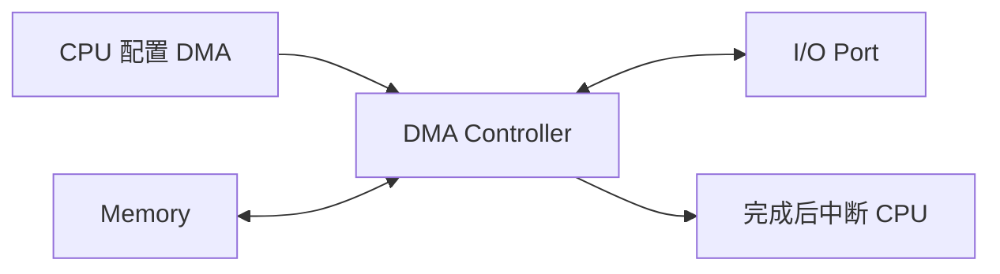
```mermaid
flowchart LR
    CPU["CPU 配置 DMA"] --> DMA["DMA Controller"]
    MEM["Memory"] <--> DMA
    DMA <--> IO["I/O Port"]
    DMA --> IRQ["完成后中断 CPU"]
```

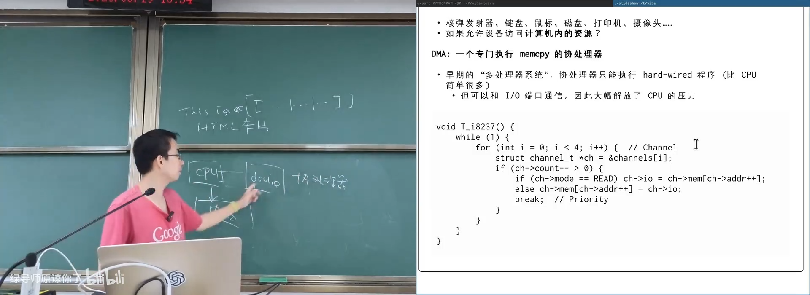

### 5.2 GPU 与 NPU 也是协处理器

*(参考时间: 00:38)*

GPU 看起来像一台完整计算机：

- CPU 配置设备寄存器；
- kernel 和数据通过 DMA 送到显存；
- CPU 发出启动命令；
- GPU 调度大量线程执行。

NPU 可能共享系统内存，但控制方式仍然类似：

```text
准备输入
    ↓
配置设备
    ↓
启动 kernel / inference
    ↓
等待完成
    ↓
读取输出
```

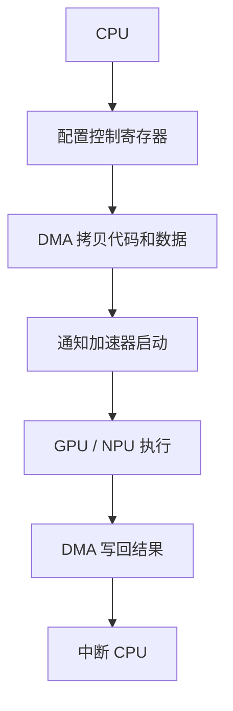
```mermaid
flowchart TD
    A["CPU"] --> B["配置控制寄存器"]
    B --> C["DMA 拷贝代码和数据"]
    C --> D["通知加速器启动"]
    D --> E["GPU / NPU 执行"]
    E --> F["DMA 写回结果"]
    F --> G["中断 CPU"]
```

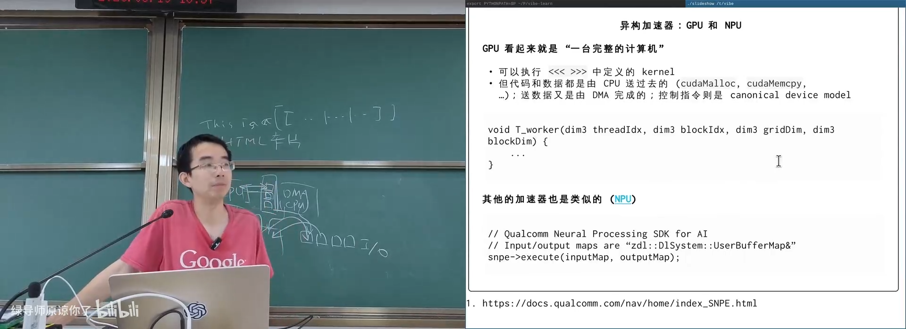

---

## 6. 总线：连接万千设备

### 6.1 总线也是特殊的 I/O 设备

*(参考时间: 00:40)*

总线负责：

- 设备注册；
- 地址和数据转发；
- 设备发现；
- 中断发送；
- DMA 配置。

CPU 只需要和总线协议交互，就能动态发现设备。

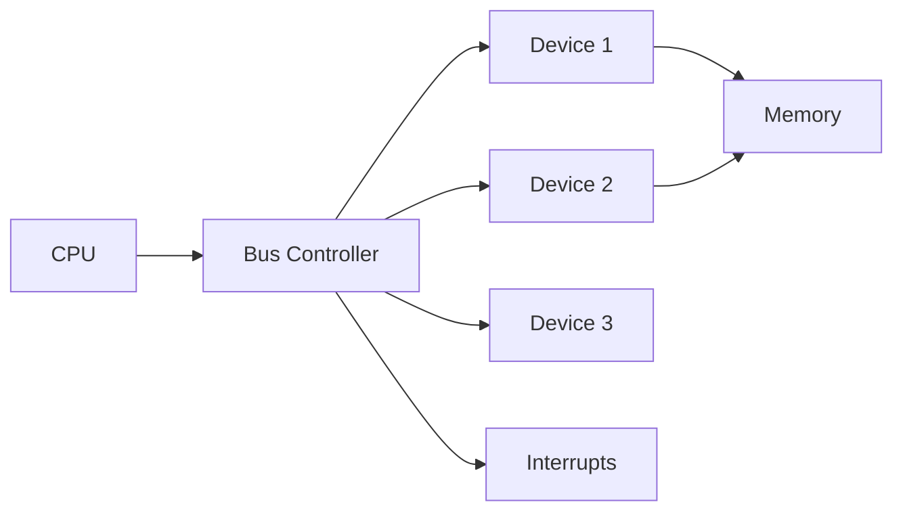
```mermaid
flowchart LR
    CPU["CPU"] --> BUS["Bus Controller"]
    BUS --> D1["Device 1"]
    BUS --> D2["Device 2"]
    BUS --> D3["Device 3"]
    D1 --> MEM["Memory"]
    D2 --> MEM
    BUS --> IRQ["Interrupts"]
```

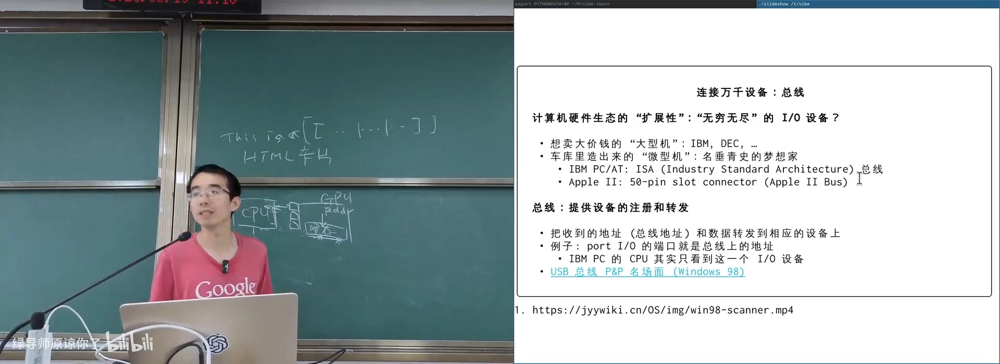

### 6.2 PCIe、USB 与设备发现

*(参考时间: 00:43)*

PCIe 设备可以插入 CPU 直连 lane：

```bash
lspci
lsusb -t
```

操作系统在发现新设备后匹配驱动。设备 ID 可以用于识别厂商和型号。

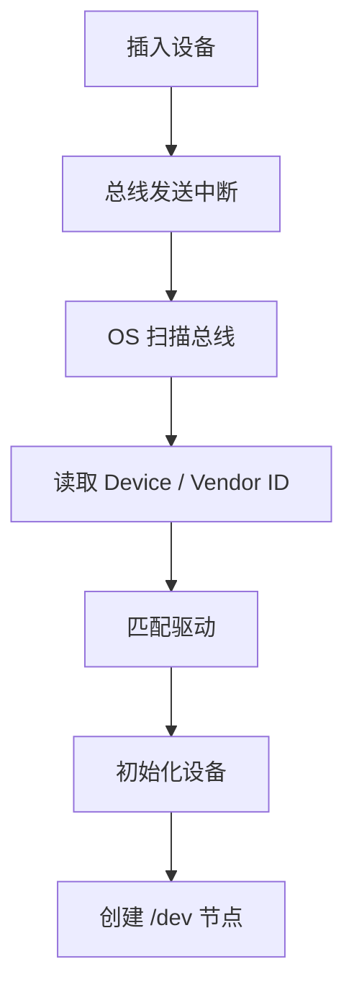
```mermaid
flowchart TD
    A["插入设备"] --> B["总线发送中断"]
    B --> C["OS 扫描总线"]
    C --> D["读取 Device / Vendor ID"]
    D --> E["匹配驱动"]
    E --> F["初始化设备"]
    F --> G["创建 /dev 节点"]
```

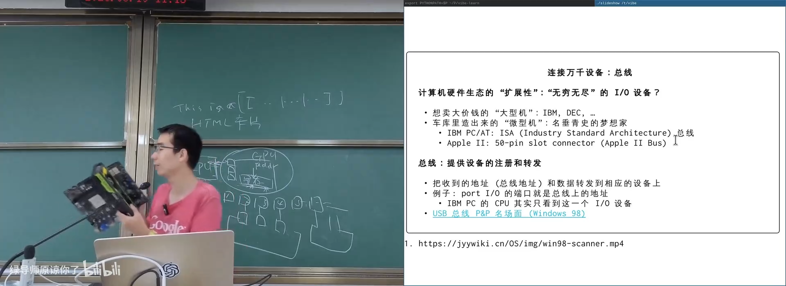

### 6.3 驱动 bug 会直接影响内核稳定性

*(参考时间: 00:46)*

早期热插拔经常出现蓝屏或卡死，因为驱动运行在内核中。Windows 后来重构了驱动子系统。

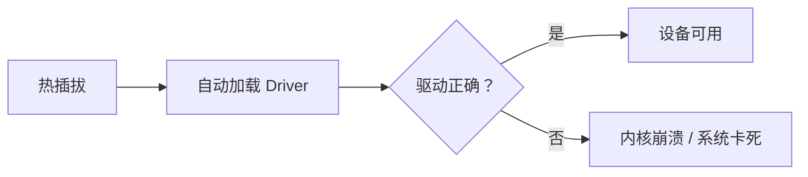
```mermaid
flowchart LR
    A["热插拔"] --> B["自动加载 Driver"]
    B --> C{"驱动正确？"}
    C -- "是" --> D["设备可用"]
    C -- "否" --> E["内核崩溃 / 系统卡死"]
```

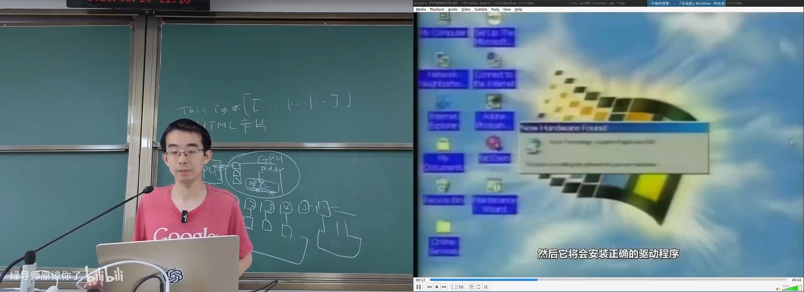

### 6.4 PCIe 的带宽、供电与一致性

*(参考时间: 00:47)*

现代高速设备大多连接 PCIe：

- GPU；
- FPGA；
- 网卡；
- NVMe SSD；
- USB Bridge。

PCIe 特性包括：

- 点对点高带宽；
- 自带 DMA；
- Message-signaled Interrupts；
- 插槽基础供电约 75 W；
- 高功耗显卡需要额外 6-pin / 8-pin 供电。

课程提到 PCIe 6.0 x16 可达约 `128 GB/s`。

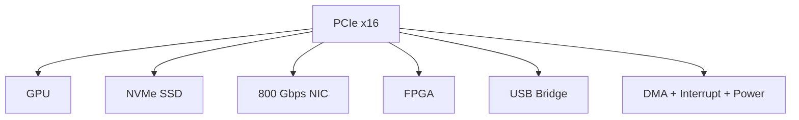
```mermaid
flowchart TD
    A["PCIe x16"] --> B["GPU"]
    A --> C["NVMe SSD"]
    A --> D["800 Gbps NIC"]
    A --> E["FPGA"]
    A --> F["USB Bridge"]
    A --> G["DMA + Interrupt + Power"]
```

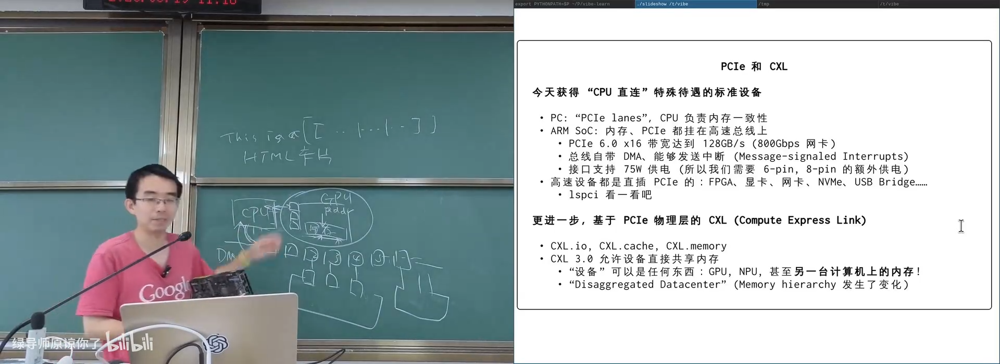

### 6.5 CXL 与远端内存

*(参考时间: 00:50)*

CXL（Compute Express Link）建立于 PCIe 物理层之上，提供：

- CXL.io；
- CXL.cache；
- CXL.memory。

它允许设备甚至另一台机器共享内存，让数据中心走向内存解耦和远端内存池。

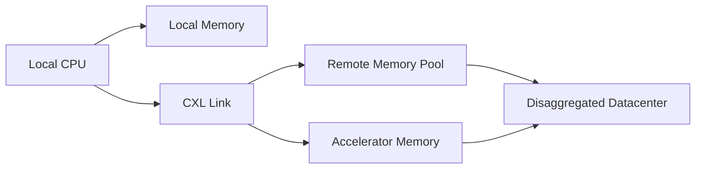
```mermaid
flowchart LR
    A["Local CPU"] --> B["Local Memory"]
    A --> C["CXL Link"]
    C --> D["Remote Memory Pool"]
    C --> E["Accelerator Memory"]
    D --> F["Disaggregated Datacenter"]
    E --> F
```

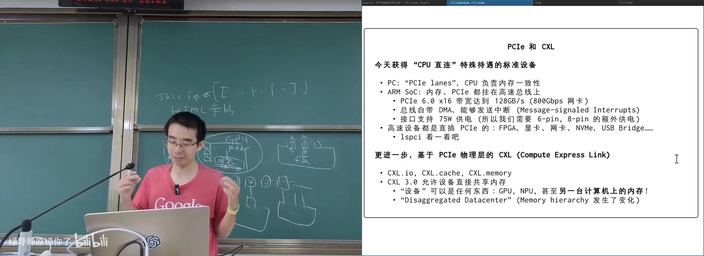

---

## 7. 应用程序如何访问设备

### 7.1 为什么不能让程序直接访问寄存器

*(参考时间: 00:53)*

如果多个进程直接操作设备：

- 设备被共享；
- 访问需要同步；
- 同步遗漏会造成 data race；
- 打印机作业、GPU 命令可能互相覆盖；
- 低层设备接口会泄漏给所有应用。

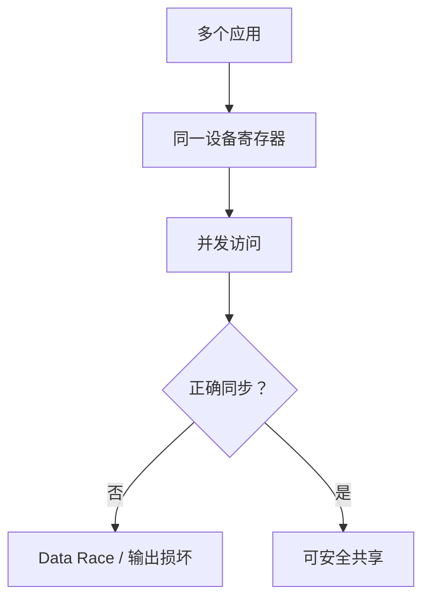
```mermaid
flowchart TD
    A["多个应用"] --> B["同一设备寄存器"]
    B --> C["并发访问"]
    C --> D{"正确同步？"}
    D -- "否" --> E["Data Race / 输出损坏"]
    D -- "是" --> F["可安全共享"]
```

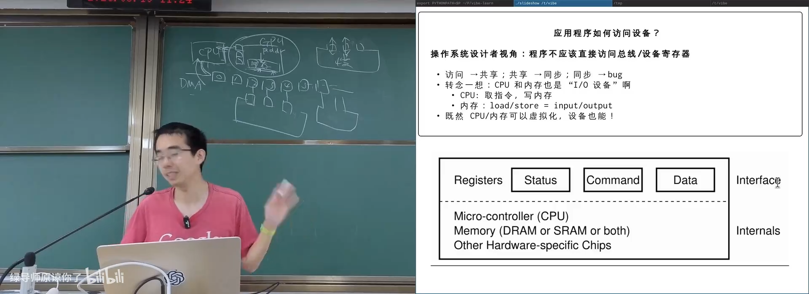

### 7.2 Everything is a File

*(参考时间: 00:55)*

操作系统把设备抽象为文件：

```c
struct file_operations {
    struct module *owner;
    loff_t (*llseek)(struct file *, loff_t, int);
    ssize_t (*read)(struct file *, char __user *, size_t, loff_t *);
    ssize_t (*write)(struct file *, const char __user *, size_t, loff_t *);
    int (*mmap)(struct file *, struct vm_area_struct *);
    long (*unlocked_ioctl)(struct file *, unsigned int, unsigned long);
    // ...
};
```

应用程序继续使用：

```c
open();
read();
write();
mmap();
ioctl();
close();
```

```mermaid
flowchart LR
    A["Application"] --> B["open/read/write"]
    B --> C["VFS"]
    C --> D["file_operations"]
    D --> E["Device Driver"]
    E --> F["Hardware Registers"]
```

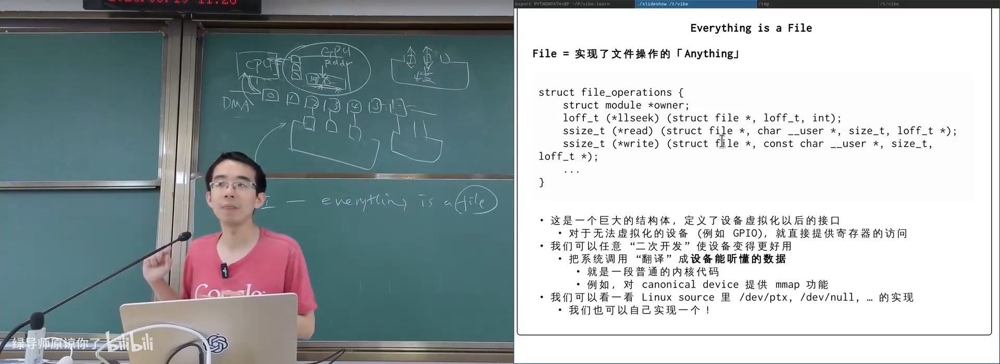

### 7.3 驱动是系统调用到设备语言的翻译器

*(参考时间: 00:58)*

设备驱动负责：

- 等待设备 ready；
- 轮询状态或等待中断；
- 把数据写入设备寄存器；
- 从设备寄存器读取数据；
- 分配和回收缓冲区；
- 处理错误与并发访问。

```mermaid
flowchart TD
    A["read(fd, buf, n)"] --> B["VFS"]
    B --> C["Driver read"]
    C --> D{"Device Ready？"}
    D -- "否" --> E["轮询 / 等待中断"]
    E --> D
    D -- "是" --> F["读取寄存器"]
    F --> G["复制到用户缓冲区"]
```

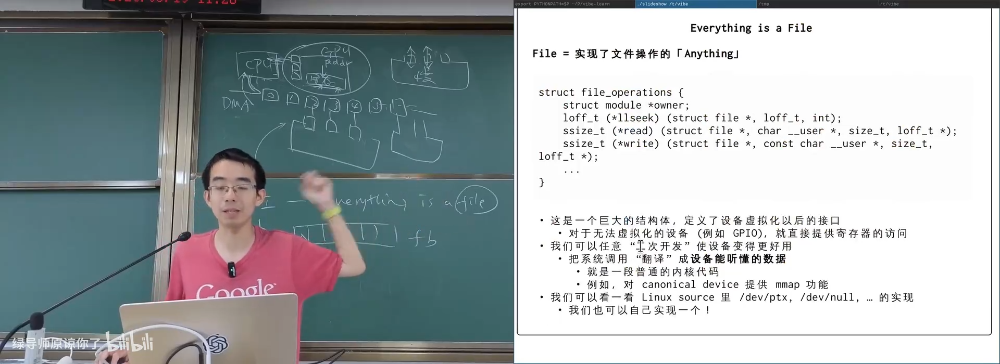

---

## 8. 实现一个设备驱动

### 8.1 `/dev/null`

*(参考时间: 00:59)*

`/dev/null` 是最简单的伪设备：

- `read` 总是返回 0；
- `write` 接收所有数据，但直接丢弃；
- 返回写入字节数，假装写入成功。

```text
read(/dev/null)  → EOF
write(/dev/null) → count, data discarded
```

```mermaid
flowchart LR
    A["read(/dev/null)"] --> B["return 0"]
    C["write(/dev/null, n)"] --> D["discard data"]
    D --> E["return n"]
```

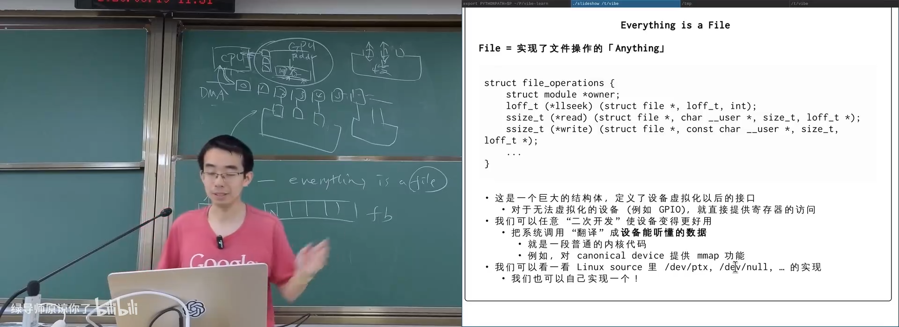

### 8.2 Launcher 设备

*(参考时间: 01:01)*

课程实现了一个名为 `launcher` 的字符设备：

```text
read(launcher)  → "this is dangerous"
write(launcher, password) → check password
```

密码正确时，驱动在 kernel log 中输出发射信息；密码错误时记录拒绝信息。

```mermaid
flowchart TD
    A["read(launcher)"] --> B["返回 this is dangerous"]
    C["write(launcher, secret)"] --> D{"密码正确？"}
    D -- "否" --> E["记录 Incorrect secret"]
    D -- "是" --> F["执行 launch 操作"]
```

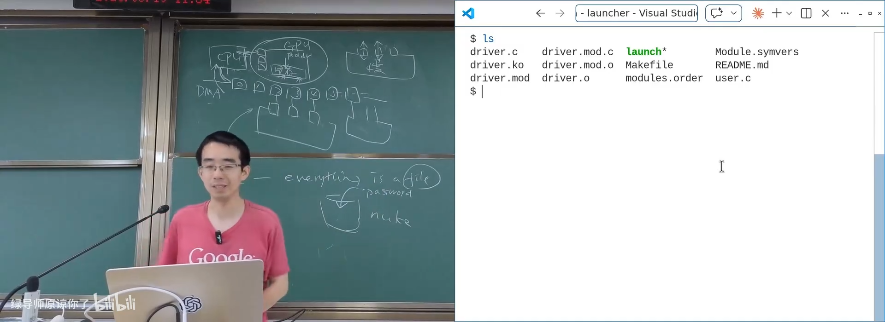

### 8.3 注册设备并加载模块

*(参考时间: 01:03)*

驱动初始化时：

1. 注册字符设备；
2. 创建设备节点；
3. 实现 `read`、`write`；
4. 模块退出时清理。

```bash
insmod launcher.ko
cat /dev/nuke0
echo wrong-secret > /dev/nuke0
echo correct-secret > /dev/nuke0
```

```mermaid
flowchart LR
    A["insmod launcher.ko"] --> B["register device"]
    B --> C["/dev/nuke0"]
    C --> D["read / write"]
    D --> E["driver callbacks"]
    E --> F["hardware side effect"]
```

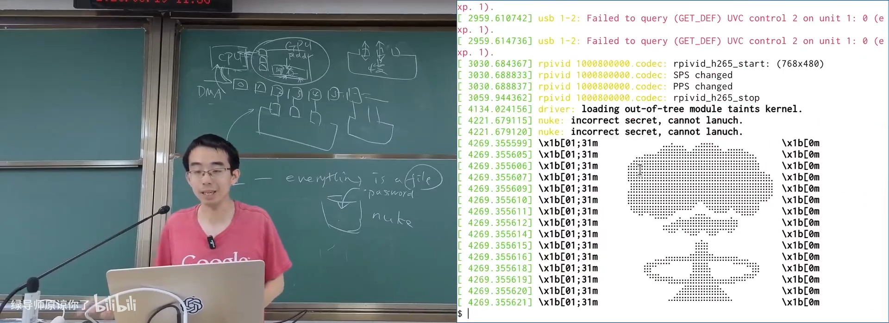

---

## 9. ioctl：控制接口的复杂性

### 9.1 数据之外还有控制

*(参考时间: 01:06)*

`read/write` 适合数据流，但设备还有大量控制功能：

- 打印机卡纸、清洁、装订；
- 键盘跑马灯、宏、重复速度；
- 终端窗口大小和行模式；
- 磁盘健康、缓存策略；
- GPU 命令提交。

这些功能通常由 `ioctl` 提供：

```c
int ioctl(int fd, unsigned long request, ...);
```

```mermaid
flowchart TD
    A["Device"] --> B["Data Path"]
    A --> C["Control Path"]
    B --> D["read / write / mmap"]
    C --> E["ioctl"]
    E --> F["Device-specific request"]
```

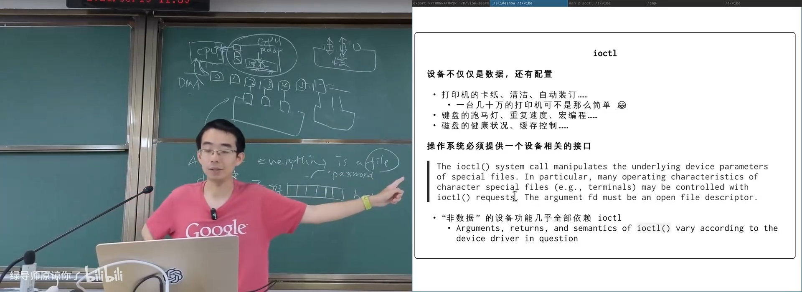

### 9.2 ioctl 参数和设备相关语义

*(参考时间: 01:09)*

`ioctl` 的 request 和参数含义完全由设备驱动定义：

```text
ioctl(fd, DEVICE_GET_STATUS, &status)
ioctl(fd, DEVICE_SET_MODE, mode)
ioctl(fd, DEVICE_SUBMIT_COMMAND, &cmd)
```

内核无法理解每个字段，只负责把请求转交驱动。

```mermaid
flowchart LR
    A["Application"] --> B["ioctl(fd, request, arg)"]
    B --> C["VFS"]
    C --> D["Driver unlocked_ioctl"]
    D --> E["解释 request / arg"]
    E --> F["配置设备"]
```

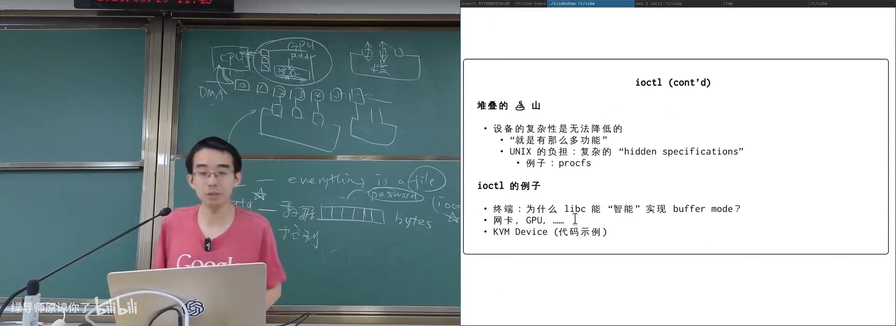

### 9.3 GPU 通过 ioctl 提交命令

*(参考时间: 01:13)*

GPU 是有独立内存的协处理器：

1. 用户通过 `mmap` 准备命令与数据；
2. 通过 `ioctl` 提交 buffer 地址；
3. 驱动启动 DMA；
4. 通过门铃寄存器通知 GPU 执行；
5. 完成后通过中断或同步对象通知。

```mermaid
flowchart TD
    A["用户准备 Command Buffer"] --> B["mmap"]
    B --> C["ioctl 提交地址"]
    C --> D["Driver 启动 DMA"]
    D --> E["写 Doorbell Register"]
    E --> F["GPU 执行"]
    F --> G["中断 / 同步"]
```

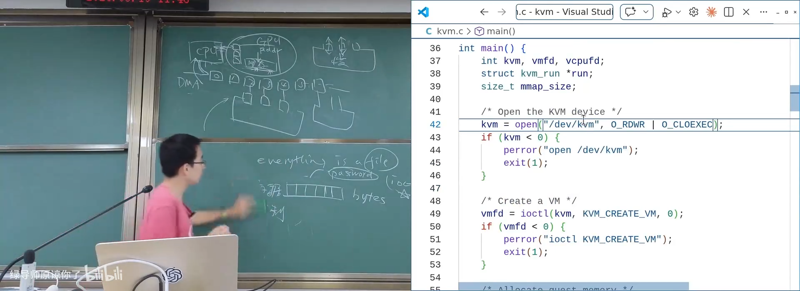

### 9.4 KVM：整个虚拟化子系统由一个设备接口控制

*(参考时间: 01:15)*

Linux 的 `/dev/kvm` 通过 `ioctl` 暴露硬件虚拟化：

- 创建 VM；
- 设置 Guest 内存区域；
- 创建 VCPU；
- 设置/读取寄存器；
- 执行 `KVM_RUN`；
- 接收 VM Exit 原因。

```mermaid
flowchart TD
    A["open(/dev/kvm)"] --> B["ioctl KVM_CREATE_VM"]
    B --> C["ioctl SET_USER_MEMORY_REGION"]
    C --> D["ioctl KVM_CREATE_VCPU"]
    D --> E["ioctl KVM_RUN"]
    E --> F{"VM Exit？"}
    F -- "是" --> G["处理 Exit Reason"]
    G --> E
```

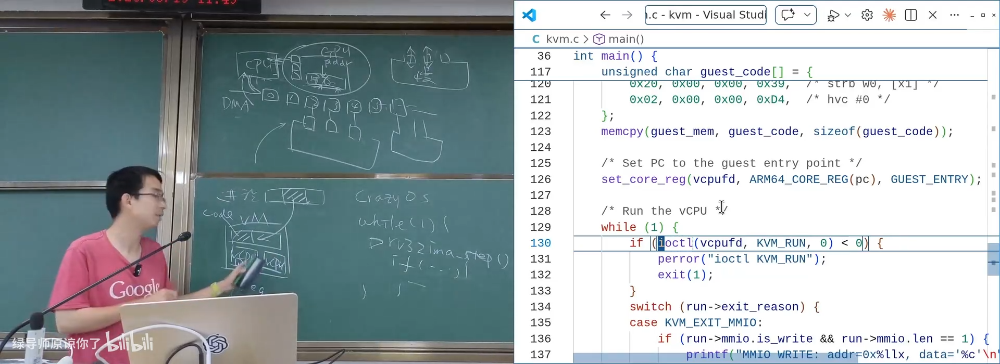

---

## 10. 完整例子：用 V4L2 读取摄像头

### 10.1 Video for Linux 2

*(参考时间: 01:20)*

Linux 把 UVC 摄像头抽象成 `/dev/videoX`，由 V4L2 子系统提供统一 `ioctl`。

典型流程：

```c
fd = open("/dev/video0", O_RDWR);

ioctl(fd, VIDIOC_QUERYCAP, &cap);
ioctl(fd, VIDIOC_ENUM_FMT, &fmt);
ioctl(fd, VIDIOC_S_FMT, &format);
ioctl(fd, VIDIOC_REQBUFS, &req);
ioctl(fd, VIDIOC_QUERYBUF, &buf);

mmap(/* buffer */);

ioctl(fd, VIDIOC_QBUF, &buf);
ioctl(fd, VIDIOC_STREAMON, &type);
ioctl(fd, VIDIOC_DQBUF, &buf);
```

```mermaid
flowchart TD
    A["open /dev/video0"] --> B["QUERYCAP"]
    B --> C["ENUM_FMT / S_FMT"]
    C --> D["REQBUFS"]
    D --> E["QUERYBUF / mmap"]
    E --> F["QBUF"]
    F --> G["STREAMON"]
    G --> H["DQBUF"]
    H --> I["处理一帧图像"]
```

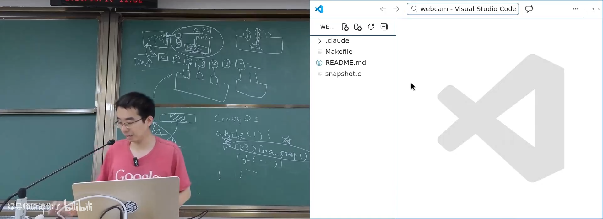

### 10.2 多缓冲区生产者-消费者

*(参考时间: 01:22)*

摄像头和应用程序的生产/消费速度不同，因此使用多个 buffer：

```text
Driver 填充 buffer
    ↓
Application 取走 buffer
    ↓
Application 处理完毕
    ↓
重新 QBUF 入队
```

```mermaid
flowchart LR
    C["Camera"] --> Q["Buffer Queue"]
    Q --> A["Application"]
    A --> P["Process Frame"]
    P --> R["Re-queue Buffer"]
    R --> Q
```

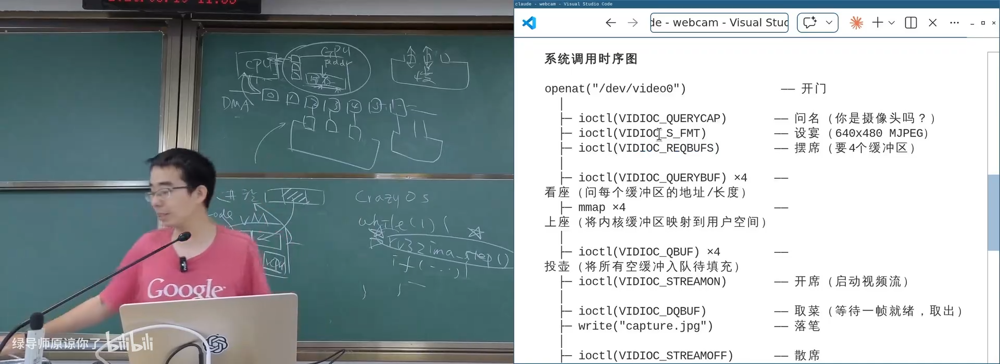

---

## 11. GPU 软件栈：驱动之上还有库和运行时

*(参考时间: 01:24)*

GPU 访问通常形成多层抽象：

```text
Application
    ↓
Mesa / Vulkan / OpenGL
    ↓
libdrm
    ↓
ioctl
    ↓
DRM Kernel Driver
    ↓
GPU
```

这和用户态系统调用、libc、应用框架的层次非常相似。

```mermaid
flowchart TD
    A["Application"] --> B["OpenGL / Vulkan"]
    B --> C["Mesa"]
    C --> D["libdrm"]
    D --> E["ioctl"]
    E --> F["DRM Driver"]
    F --> G["GPU Commands"]
```

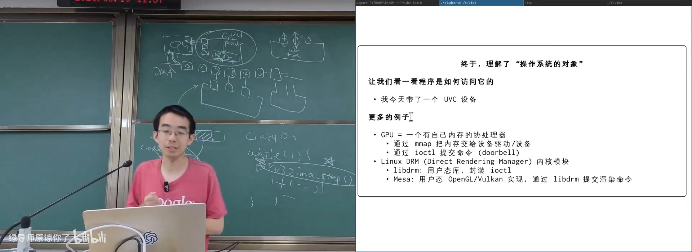

---

## 12. 总结：复杂设备最终都要落到寄存器

输入输出设备形态各异：

- GPIO LED；
- UART；
- 键盘；
- 磁盘；
- 打印机；
- 摄像头；
- DMA；
- GPU、NPU；
- PCIe、USB、CXL。

但在操作系统看来，它们最终都被抽象成实现了 `file_operations` 的对象：

```mermaid
flowchart LR
    A["Physical Device"] --> B["Controller Registers"]
    B --> C["Device Driver"]
    C --> D["file_operations"]
    D --> E["open / read / write / mmap / ioctl"]
    E --> F["Application"]
```

核心结论：

> 从最简单的 LED 到复杂的 GPU，设备接口最终都可以归结为寄存器和数据交换；操作系统通过设备驱动把底层复杂性封装成统一、可共享、可同步的文件对象。

---

## 附：官方参考与延伸阅读

- [GPIO LED](https://jyywiki.cn/OS/demos/persistence/gpio-led)
- [Canonical Device 与 CalComp 软件参考手册](https://jyywiki.cn/OS/manuals/CalComp-Software-Reference.pdf)
- [PostScript 实验](https://jyywiki.cn/OS/demos/persistence/postscript)
- [IPP 协议 RFC 8011](https://www.rfc-editor.org/rfc/rfc8011)
- [高通 SNPE / NPU SDK](https://docs.qualcomm.com/nav/home/index_SNPE.html)
- [Windows 98 USB 热插拔演示](https://jyywiki.cn/OS/img/win98-scanner.mp4)
- [Launcher 设备驱动实验](https://jyywiki.cn/OS/demos/persistence/launcher)
- [KVM Device 实验](https://jyywiki.cn/OS/demos/persistence/kvm)
- [WebCam / V4L2 实验](https://jyywiki.cn/OS/demos/persistence/webcam)
- [Operating Systems: Three Easy Pieces, Chapter 36: I/O Devices](https://pages.cs.wisc.edu/~remzi/OSTEP/file-devices.pdf)

官方课程资料：

- [课程主页](https://jyywiki.cn/OS/2026/)
- [第 22 讲讲义：设备和驱动程序](https://jyywiki.cn/OS/2026/lect22.md)
- [视频：22 - 输入输出设备和驱动](https://www.bilibili.com/video/BV1dYLq6gE8W/)

> **版权与署名**：本讲课程材料由蒋炎岩（jyy）编写。课程讲义与幻灯片采用 [Creative Commons BY-NC 4.0](http://creativecommons.org/licenses/by-nc/4.0/) 许可；本电子书保留课程出处、作者署名与许可说明。
