# 存储设备原理：一个 bit 如何跨越时间

> **课程**：2026 春季学期《操作系统原理》  
> **讲师**：蒋炎岩（jyy）  
> **官方课程主页**：<https://jyywiki.cn/OS/2026/>  
> **官方讲义**：<https://jyywiki.cn/OS/2026/lect23.md>  
> **视频来源**：[Bilibili BV1RHLh6pEqn](https://www.bilibili.com/video/BV1RHLh6pEqn/)  
> **版权说明**：课程讲义与幻灯片归蒋炎岩所有，采用 [Creative Commons BY-NC 4.0](http://creativecommons.org/licenses/by-nc/4.0/) 许可；本电子书是对课堂讲授的书面化重构，保留出处与许可说明。

## 导语：持久化就是让状态跨越时间

*(参考时间: 00:00)*

“持久化”并不神秘。只要存在一个能够反复读写、并且断电后仍能保持状态的结构，就可以记录一个 bit：

```text
可写状态 = 0
可写状态 = 1
```

真正的挑战是如何让这个状态：

- 足够小，提高密度；
- 足够快，匹配 CPU；
- 足够稳定，跨越重启和时间；
- 足够便宜，能够大规模制造。

这张时间线从磁、坑、光一直走到电荷与集成电路。

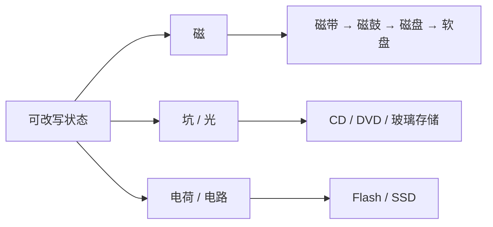
```mermaid
flowchart LR
    A["可改写状态"] --> B["磁"]
    A --> C["坑 / 光"]
    A --> D["电荷 / 电路"]
    B --> E["磁带 → 磁鼓 → 磁盘 → 软盘"]
    C --> F["CD / DVD / 玻璃存储"]
    D --> G["Flash / SSD"]
```

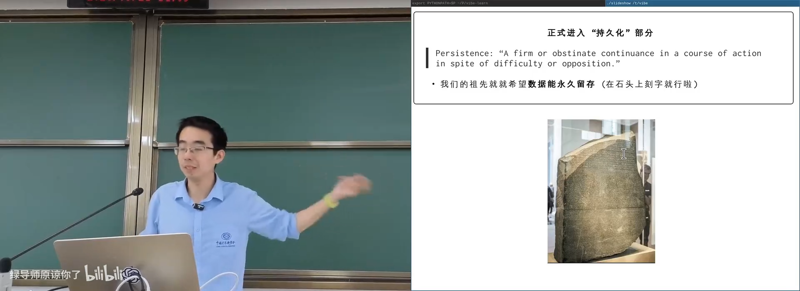

---

## 1. 从磁性画板到计算机存储

### 1.1 一个能写、能擦、能读的状态

*(参考时间: 00:05)*

磁性画板的铁粉可以被磁笔吸起，再用磁铁刷掉。人眼可以读出图案。

计算机存储的要求更高：

> 每一个 bit 必须能够被电信号写出，并被电信号读回。

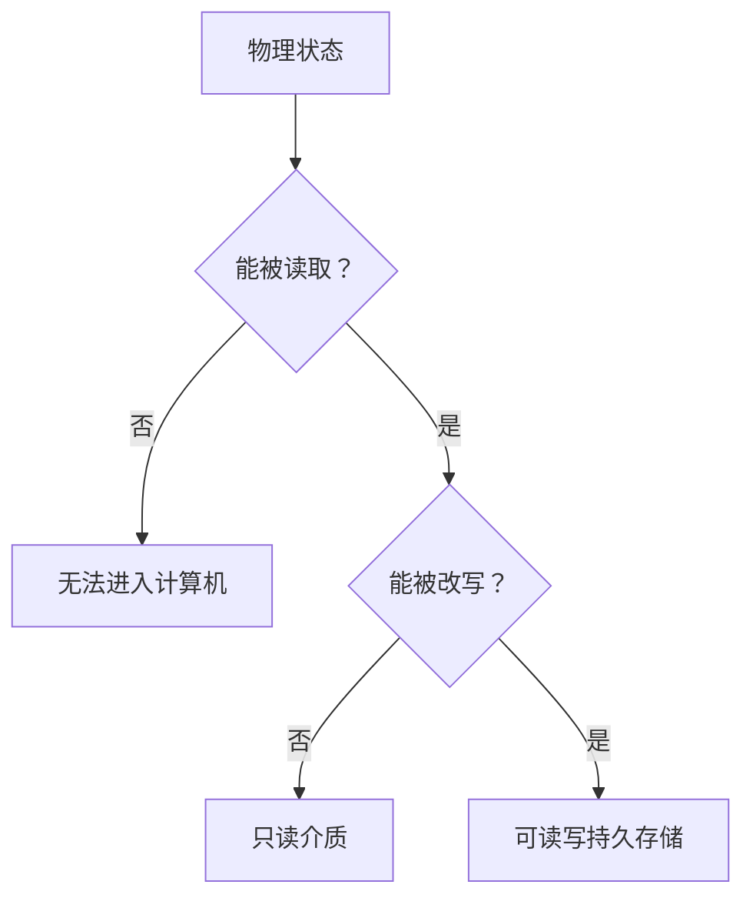
```mermaid
flowchart TD
    A["物理状态"] --> B{"能被读取？"}
    B -- "否" --> C["无法进入计算机"]
    B -- "是" --> D{"能被改写？"}
    D -- "否" --> E["只读介质"]
    D -- "是" --> F["可读写持久存储"]
```

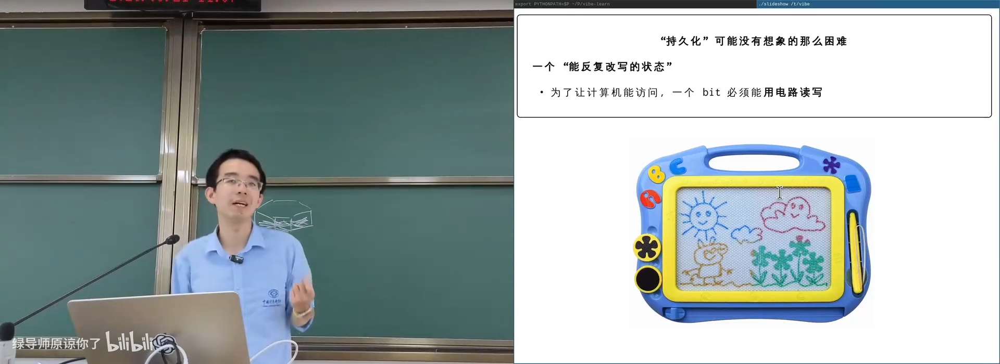

### 1.2 电磁感应连接数字与物理世界

*(参考时间: 00:07)*

沿一条介质排列许多可磁化单元：

- 磁化方向表示 0 或 1；
- 读写头经过时切割磁感线；
- 感应电流方向用于读取；
- 强磁场用于写入。

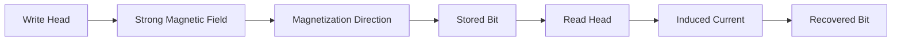
```mermaid
flowchart LR
    A["Write Head"] --> B["Strong Magnetic Field"]
    B --> C["Magnetization Direction"]
    C --> D["Stored Bit"]
    D --> E["Read Head"]
    E --> F["Induced Current"]
    F --> G["Recovered Bit"]
```

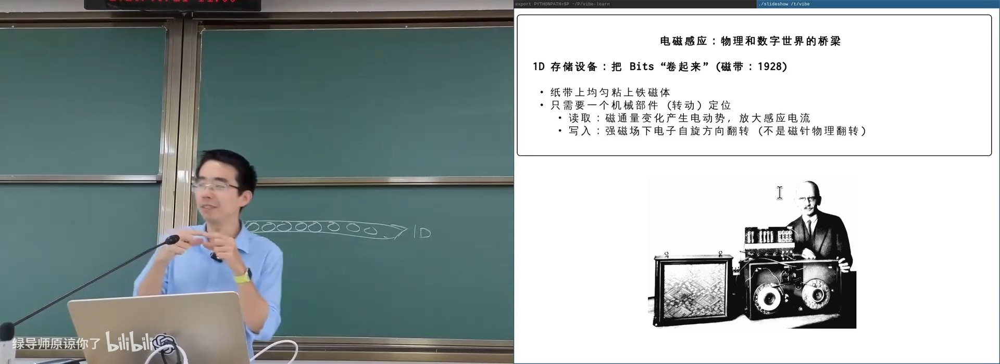

---

## 2. 磁存储：先把 bit 排成线，再把线卷起来

### 2.1 磁带：一维存储

*(参考时间: 00:09)*

磁带出现于 1928 年，介质是均匀涂覆铁磁材料的带子。

特点：

- 制造便宜；
- 容量高；
- 长时间保存可靠；
- 顺序读写尚可；
- 随机访问极慢。

现代磁带利用高密度磁畴，可达到约 `300 Gb/in²`，单盘容量可到 `30 TB`。

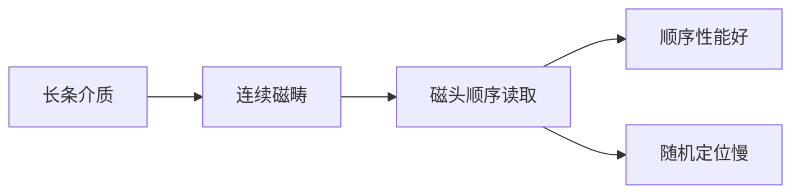
```mermaid
flowchart LR
    A["长条介质"] --> B["连续磁畴"]
    B --> C["磁头顺序读取"]
    C --> D["顺序性能好"]
    C --> E["随机定位慢"]
```

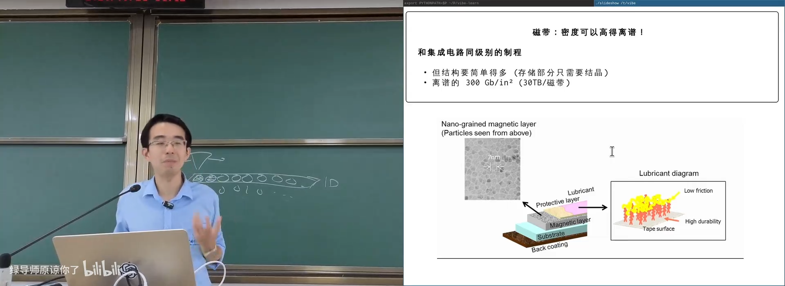

### 2.2 随机访问短板

*(参考时间: 00:12)*

如果把整个磁带当作内存映射：

```c
char *p = mmap(tape, size, ...);
p[0] = 1;
p[100000000] = 2;
```

第二次数数必须让磁带快速前进或倒带，等待时间可能非常长。

因此磁带适合：

- 冷数据归档；
- 长期备份；
- 音频、视频等顺序读写；
- 很少随机访问的场景。

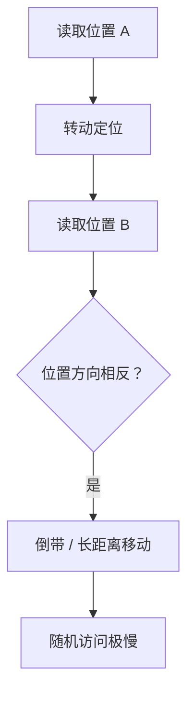
```mermaid
flowchart TD
    A["读取位置 A"] --> B["转动定位"]
    B --> C["读取位置 B"]
    C --> D{"位置方向相反？"}
    D -- "是" --> E["倒带 / 长距离移动"]
    E --> F["随机访问极慢"]
```

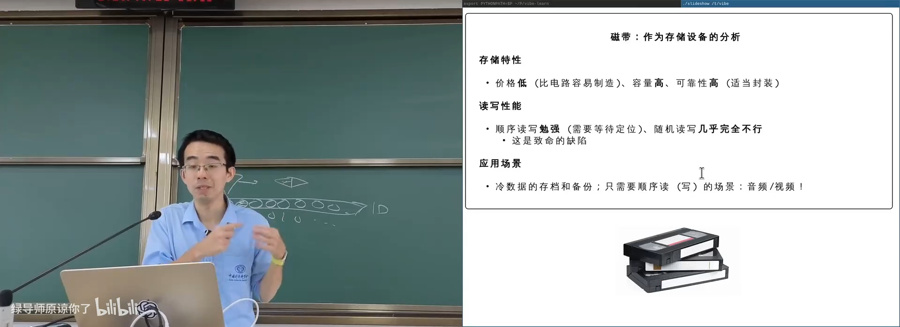

### 2.3 磁鼓：把一维介质绕成圆

*(参考时间: 00:17)*

磁鼓（1932）把一维介质绕在旋转圆柱上，并放置多个读写头：

- 随机访问延迟不超过一个旋转周期；
- 读写头可以并行；
- 容量比磁带低，但随机性能明显改善。

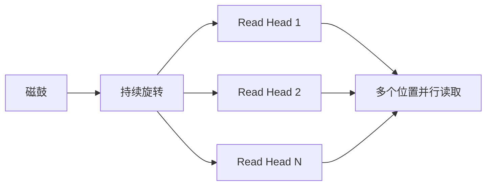
```mermaid
flowchart LR
    A["磁鼓"] --> B["持续旋转"]
    B --> C1["Read Head 1"]
    B --> C2["Read Head 2"]
    B --> C3["Read Head N"]
    C1 --> D["多个位置并行读取"]
    C2 --> D
    C3 --> D
```

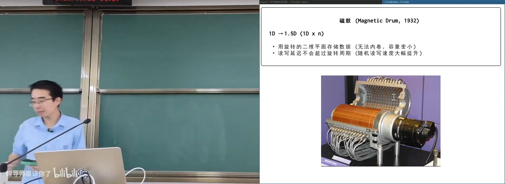

### 2.4 磁盘：二维平面上的多层磁带

*(参考时间: 00:19)*

硬盘（1956）把数据写入多个盘片的双面磁道：

- 盘片高速旋转；
- 读写头沿半径方向移动；
- 多个盘片并行读写；
- 高密度、容量大、成本低。

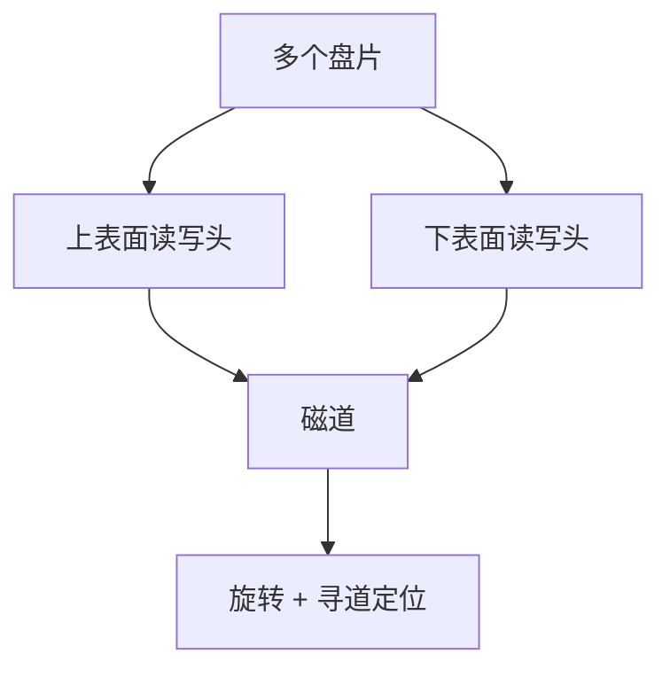
```mermaid
flowchart TD
    A["多个盘片"] --> B1["上表面读写头"]
    A --> B2["下表面读写头"]
    B1 --> C["磁道"]
    B2 --> C
    C --> D["旋转 + 寻道定位"]
```

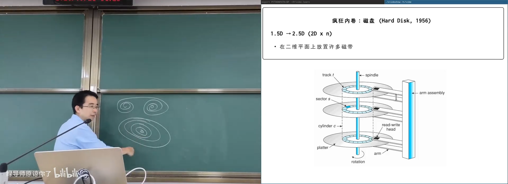

### 2.5 寻道与旋转延迟

*(参考时间: 00:22)*

随机读取一个扇区通常要：

1. 把读写头移动到目标磁道；
2. 等盘片旋转到目标扇区；
3. 读写数据。

7200 RPM 约等于每秒 120 转，平均旋转等待约 `4.17 ms`，最坏超过 `8.3 ms`。这些毫秒级延迟对 CPU 极其漫长。


```mermaid
flowchart LR
    A["请求扇区"] --> B["Seek 到目标磁道"]
    B --> C["等待旋转"]
    C --> D["读取扇区"]
    D --> E["返回上层"]
```

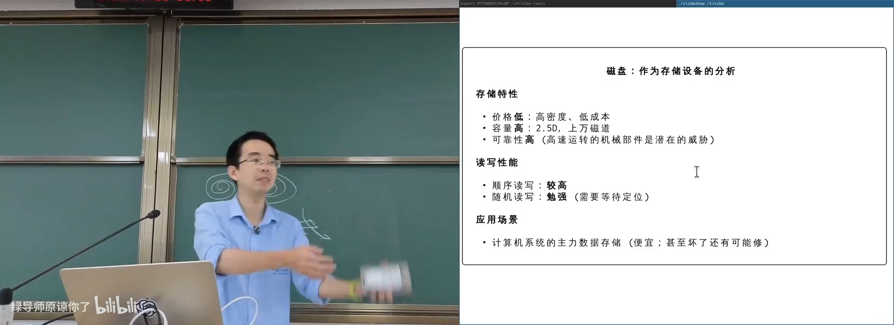

### 2.6 调度与 NCQ

*(参考时间: 00:26)*

早期操作系统实现“电梯调度”：

- 读写头只向一个方向移动；
- 沿途处理请求；
- 到端点后再反向。

后来磁盘控制器承担更多调度：

- AHCI；
- Native Command Queuing；
- 控制器根据真实机械参数排序请求。

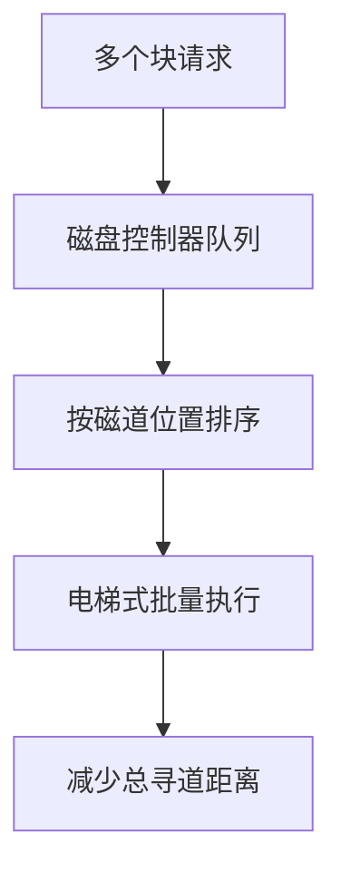
```mermaid
flowchart TD
    A["多个块请求"] --> B["磁盘控制器队列"]
    B --> C["按磁道位置排序"]
    C --> D["电梯式批量执行"]
    D --> E["减少总寻道距离"]
```

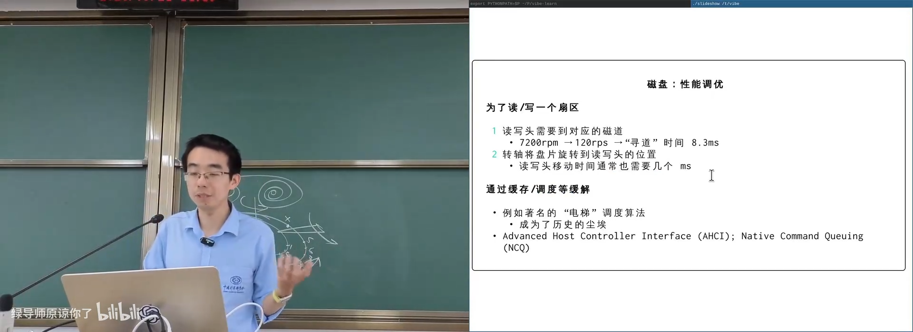

### 2.7 软盘：可移动的磁性介质

*(参考时间: 00:28)*

软盘把读写头与介质分离：

- 驱动器包含磁头与电机；
- 软盘本身只是可移动介质；
- 8 英寸、5.25 英寸、3.5 英寸是主要规格。

3.5 英寸软盘加入硬塑料外壳、滑盖和写保护开关。

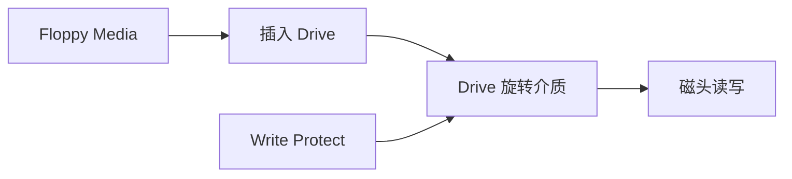
```mermaid
flowchart LR
    A["Floppy Media"] --> B["插入 Drive"]
    B --> C["Drive 旋转介质"]
    C --> D["磁头读写"]
    E["Write Protect"] --> C
```

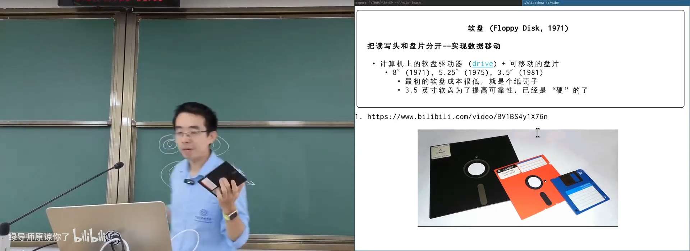

### 2.8 软盘时代的数据交换

*(参考时间: 00:33)*

1.44 MB 软盘曾能装下：

- 一个完整 DOS；
- BASIC 程序；
- 小型游戏；
- 驱动和更新程序。

大型软件被拆分成多张盘，提示用户更换软盘。今天的“保存”图标就是这段历史的遗迹。

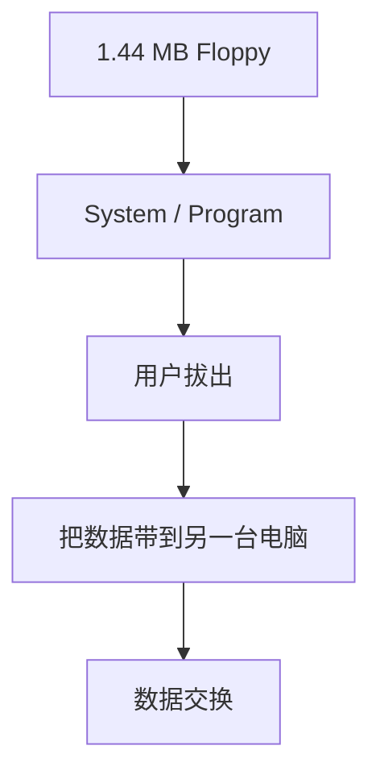
```mermaid
flowchart TD
    A["1.44 MB Floppy"] --> B["System / Program"]
    B --> C["用户拔出"]
    C --> D["把数据带到另一台电脑"]
    D --> E["数据交换"]
```

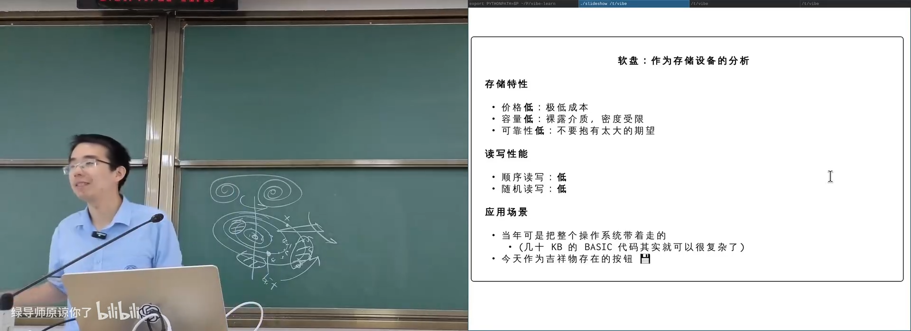

---

## 3. 挖坑存储：从石板到光盘与玻璃

### 3.1 有坑为 1，无坑为 0

*(参考时间: 00:36)*

岩石或金属上的刻痕可以跨越千年。现代工业把这种“挖坑”缩小到微米级：

- 激光沿螺旋轨道扫描；
- 有坑与无坑产生不同反射；
- 坑深造成干涉差异；
- 光信号转成 0 和 1。

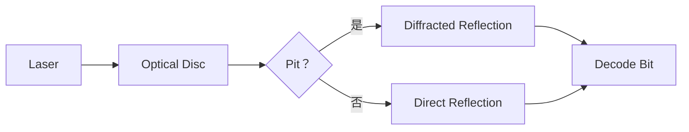
```mermaid
flowchart LR
    A["Laser"] --> B["Optical Disc"]
    B --> C{"Pit？"}
    C -- "是" --> D["Diffracted Reflection"]
    C -- "否" --> E["Direct Reflection"]
    D --> F["Decode Bit"]
    E --> F
```

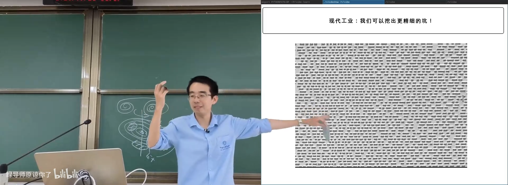

### 3.2 CD 与 EFM 编码

*(参考时间: 00:39)*

CD（1980）最初为数字音频设计，容量约 700 MB，可保存约 74 分钟音乐。

数据使用 Eight-to-Fourteen Modulation：

```text
8 bit data → 14 bit channel code
```

编码增加冗余，帮助时钟恢复和纠错。

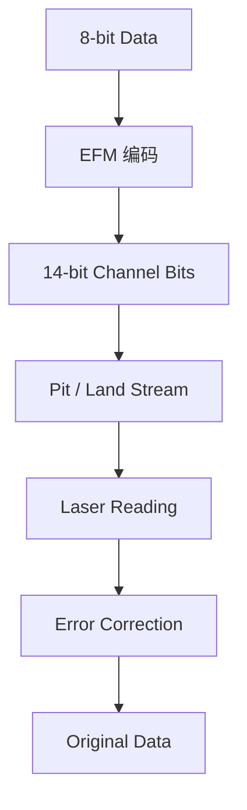
```mermaid
flowchart TD
    A["8-bit Data"] --> B["EFM 编码"]
    B --> C["14-bit Channel Bits"]
    C --> D["Pit / Land Stream"]
    D --> E["Laser Reading"]
    E --> F["Error Correction"]
    F --> G["Original Data"]
```

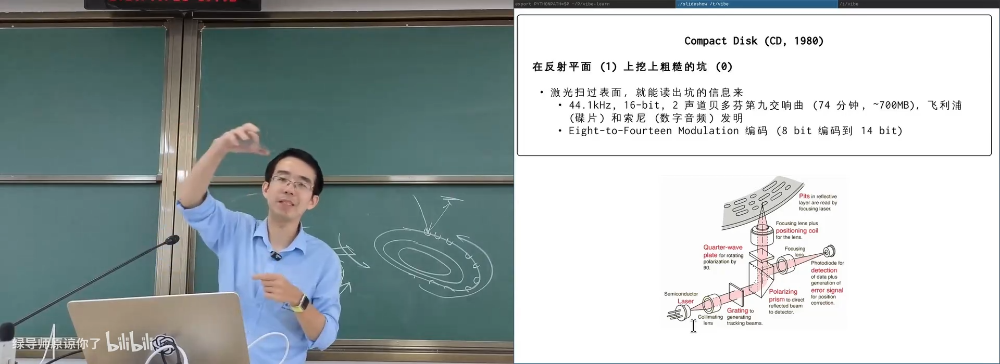

### 3.3 光盘最重要优势：复制便宜

*(参考时间: 00:41)*

母盘做出微小凸起，再用模具压制透明塑料：

- 几秒即可复制数百 MB；
- 再镀反射膜；
- 划伤透明面通常不会影响数据层。

Blu-ray 生产甚至可达到约 `33 GB/s` 的等效写入速度。极端情况下，数据中心之间“用卡车运盘”也可能比网络传输更快。

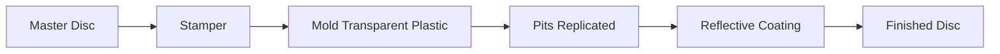
```mermaid
flowchart LR
    A["Master Disc"] --> B["Stamper"]
    B --> C["Mold Transparent Plastic"]
    C --> D["Pits Replicated"]
    D --> E["Reflective Coating"]
    E --> F["Finished Disc"]
```

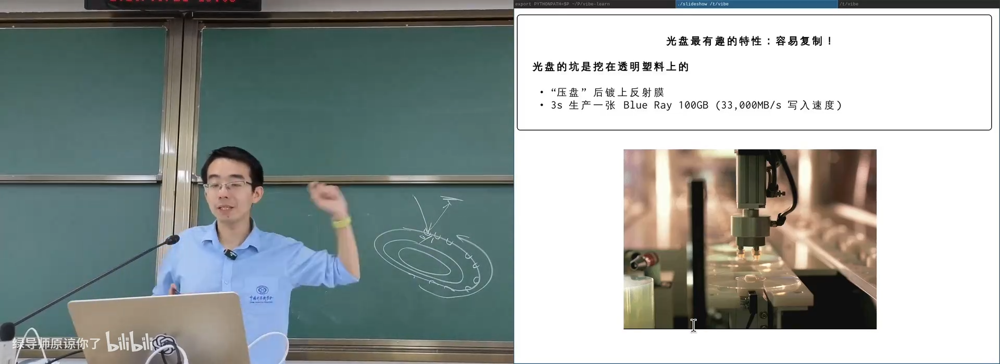

### 3.4 光盘的限制与互联网替代

*(参考时间: 00:44)*

光盘优点：

- 价格极低；
- 容量较高；
- 只读数据可靠性好。

缺点：

- 顺序读取尚可；
- 随机读取较差；
- 写入困难；
- CD-RW 等可写介质寿命和兼容性有限。

软件持续更新、内容即时分发，让互联网逐渐取代物理盘。

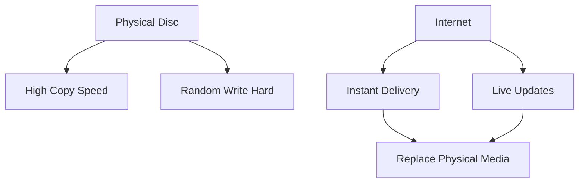
```mermaid
flowchart TD
    A["Physical Disc"] --> B["High Copy Speed"]
    A --> C["Random Write Hard"]
    D["Internet"] --> E["Instant Delivery"]
    D --> F["Live Updates"]
    E --> G["Replace Physical Media"]
    F --> G
```

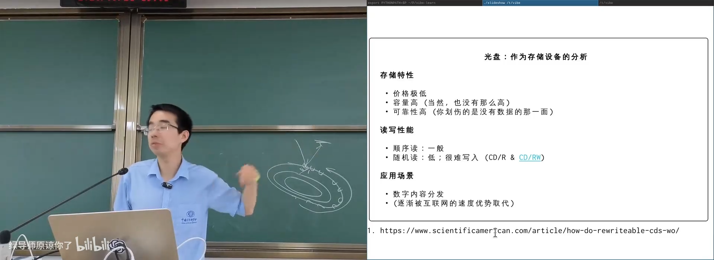

---

## 4. Random Read + Append-only Write = 任何数据结构

### 4.1 追加写也可以实现随机修改

*(参考时间: 00:46)*

假设设备支持：

- 任意位置读取；
- 只能向尾部追加写入。

仍然可以实现任何可变数据结构：

```text
read(address) → data
append(data) → new_address
```

修改数据时不覆盖旧位置，而是写入新副本，再更新指针。

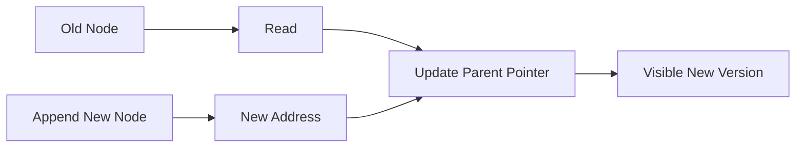
```mermaid
flowchart LR
    A["Old Node"] --> B["Read"]
    C["Append New Node"] --> D["New Address"]
    B --> E["Update Parent Pointer"]
    D --> E
    E --> F["Visible New Version"]
```

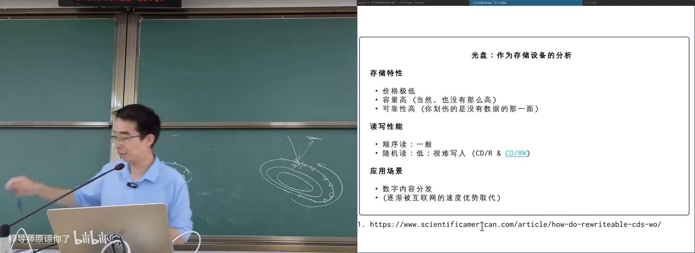

### 4.2 Persistent Data Structure

*(参考时间: 00:48)*

例如修改二叉树的一个叶子：

1. 复制从根到叶子的路径；
2. 新节点指向旧树中未修改的子树；
3. 旧根仍代表旧版本；
4. 新根代表新版本。

修改成本与树高成正比，约为 `O(log N)`。

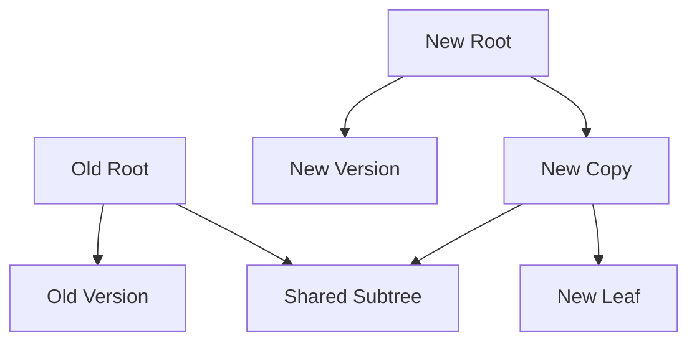
```mermaid
flowchart TD
    A["Old Root"] --> B["Shared Subtree"]
    C["New Root"] --> D["New Copy"]
    D --> E["New Leaf"]
    D --> B
    A --> F["Old Version"]
    C --> G["New Version"]
```

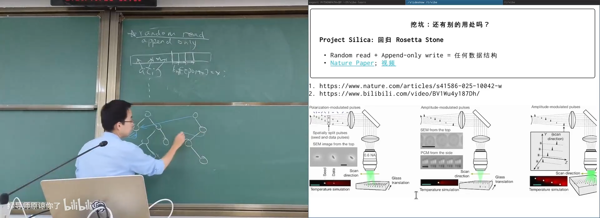

### 4.3 Project Silica

*(参考时间: 00:51)*

Project Silica 用飞秒激光在玻璃内部写入微小结构：

- 随机读取；
- 只能追加写；
- 机器人从架子上取出玻璃并定位数据；
- 长期归档。

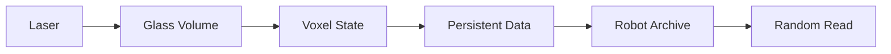
```mermaid
flowchart LR
    A["Laser"] --> B["Glass Volume"]
    B --> C["Voxel State"]
    C --> D["Persistent Data"]
    D --> E["Robot Archive"]
    E --> F["Random Read"]
```

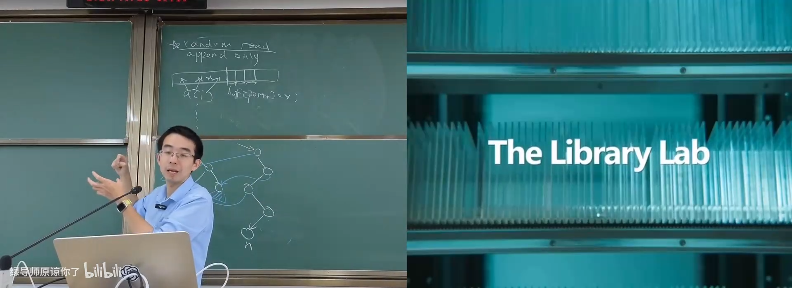

---

## 5. Flash：用电荷存储 bit

### 5.1 Floating Gate

*(参考时间: 00:54)*

Flash 在晶体管中增加 Floating Gate：

- 注入电子：一个状态；
- 放出电子：另一个状态；
- 通过阈值电压判断 bit。

通过精确控制电荷量，一个 cell 可以保存多 bit：

- SLC：1 bit；
- MLC：2 bit；
- TLC：3 bit；
- QLC：4 bit。

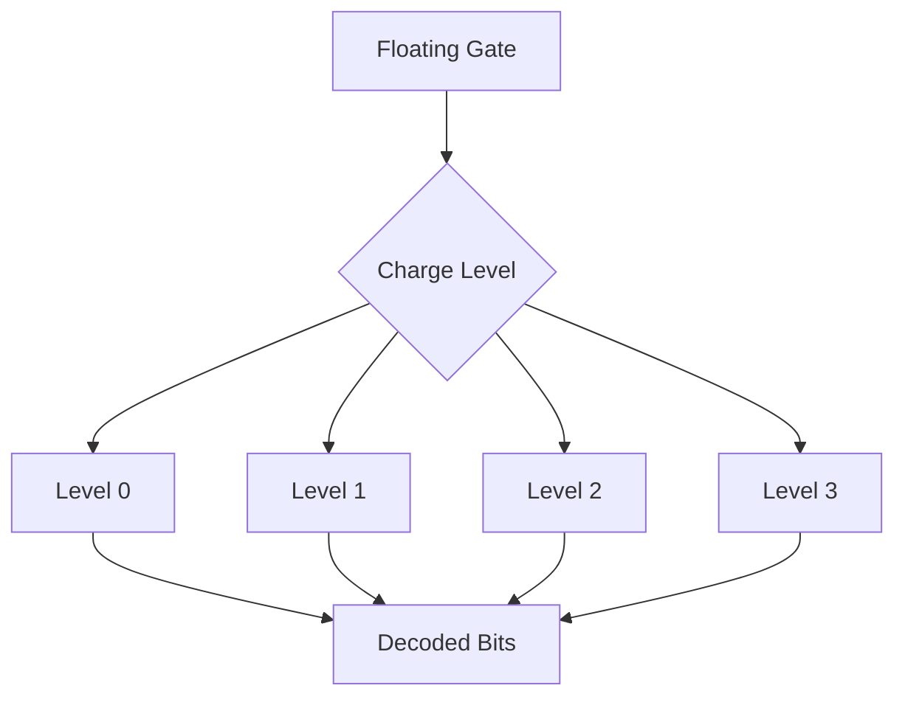
```mermaid
flowchart TD
    A["Floating Gate"] --> B{"Charge Level"}
    B --> C1["Level 0"]
    B --> C2["Level 1"]
    B --> C3["Level 2"]
    B --> C4["Level 3"]
    C1 --> D["Decoded Bits"]
    C2 --> D
    C3 --> D
    C4 --> D
```

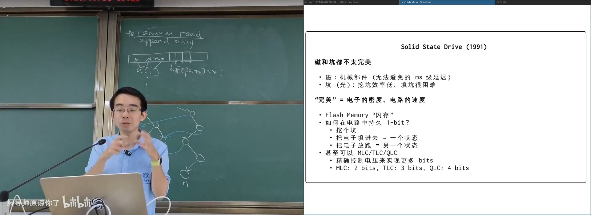

### 5.2 SSD 的“不讲道理”优势

*(参考时间: 00:57)*

Flash 的优势：

- 大规模集成电路带来低成本；
- 封装可靠，不怕摔、不怕水；
- 电路天然并行；
- 容量越大，颗粒越多，带宽越高。

Jim Gray 在 2006 年预言：

> Tape is Dead, Disk is Tape, Flash is Disk, RAM Locality is King.

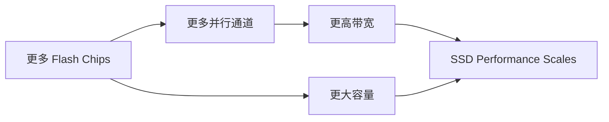
```mermaid
flowchart LR
    A["更多 Flash Chips"] --> B["更多并行通道"]
    B --> C["更高带宽"]
    A --> D["更大容量"]
    C --> E["SSD Performance Scales"]
    D --> E
```

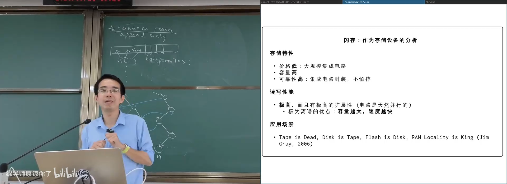

### 5.3 U 盘时代

*(参考时间: 00:59)*

USB Flash Drive 把 Flash 芯片和 USB 接口封装在同一设备中，取代软盘进行数据交换。

早期容量：

- 软盘：1.44 MB；
- 早期 U 盘：128 MB。

一个 U 盘就能携带几十到上百倍的数据。

```mermaid
flowchart LR
    A["Floppy 1.44 MB"] --> B["USB Flash Drive"]
    B --> C["128 MB / GB+"]
    C --> D["图片 / 视频 / 软件"]
    D --> E["人际数据交换"]
```

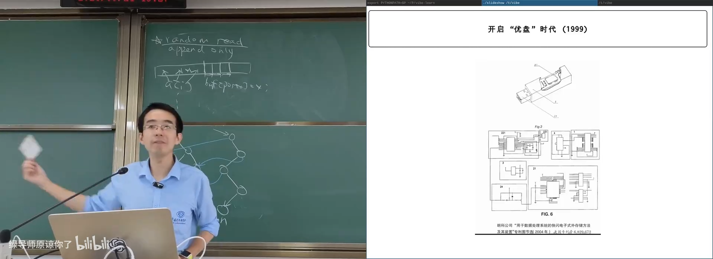

### 5.4 Erase Saturation 与写寿命

*(参考时间: 01:01)*

写入和擦除带来不可逆磨损：

- 擦除无法完全清除电子；
- 数千到数万次后，cell 接近“永远充电”状态；
- QLC 可能只有约 1000 次写入寿命。

```c
for (int i = 0; i < 1000; ++i)
    write_text("a.txt", i);
```

如果软件不做处理，一个文件反复修改就可能磨损固定 cell。

```mermaid
flowchart TD
    A["Write / Erase"] --> B["残余电子"]
    B --> C["Threshold Drift"]
    C --> D["Erase Failure"]
    D --> E["Dead Cell"]
    F["Repeated Writes"] --> A
```

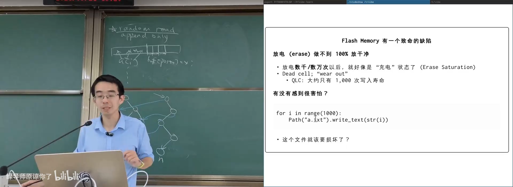

---

## 6. 软件定义磁盘：FTL 与 Wear Leveling

### 6.1 FTL 维护逻辑到物理映射

*(参考时间: 01:02)*

SSD 内部软件层称为 Flash Translation Layer：

- 操作系统看到的是连续逻辑块；
- FTL 将逻辑块映射到物理 Flash 块；
- 每次写入可以分配到不同物理块；
- 旧块延迟回收。

```mermaid
flowchart LR
    A["Logical Block 1"] --> B["L2P Table"]
    B --> C1["Physical Block 1"]
    B --> C2["Physical Block 7"]
    B --> C3["Physical Block 9"]
    C1 --> D["Flash Array"]
    C2 --> D
    C3 --> D
```

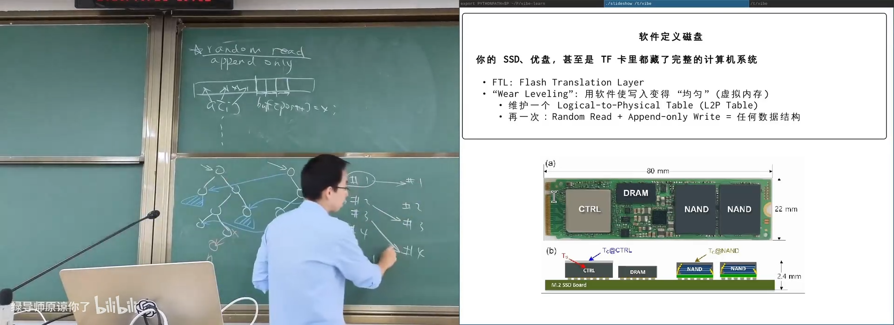

### 6.2 Wear Leveling

*(参考时间: 01:04)*

FTL 记录每个物理块的写入次数，优先使用写入较少的块：

```text
write logical block 1
    ↓
do not overwrite physical block 1
    ↓
allocate less-worn physical block 7
    ↓
update L2P table
```

这与虚拟内存很像：逻辑地址不变，物理位置变化。

```mermaid
flowchart TD
    A["Logical Write"] --> B["查看 Physical Wear Count"]
    B --> C["选择写入较少的 Block"]
    C --> D["追加写入新数据"]
    D --> E["更新 L2P Table"]
    E --> F["回收旧 Block"]
```

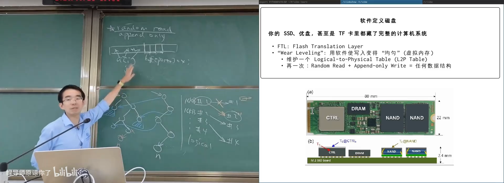

### 6.3 SSD 内部就是一台计算机

*(参考时间: 01:06)*

SSD 封装中通常包含：

- Flash 颗粒；
- 主控 CPU；
- DRAM；
- 缓存；
- Store Buffer；
- FTL 软件。

SD 卡、TF 卡同样可能包含完整嵌入式系统。

```mermaid
flowchart TD
    A["SSD Controller"] --> B["CPU"]
    A --> C["DRAM / Cache"]
    A --> D["FTL Software"]
    A --> E["NAND Flash"]
    A --> F["Host Interface"]
```

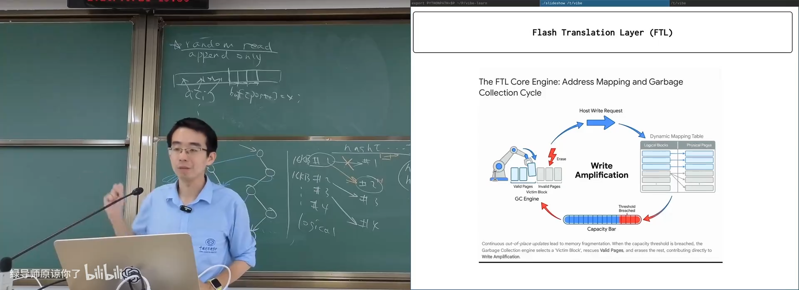

### 6.4 廉价设备可能伪造容量

*(参考时间: 01:07)*

设备和驱动通过协议交换信息。既然容量是协议返回值，就可能被伪造：

```text
真实容量 = 64 GB
主控返回 = 1 TB
超过 64 GB 的写入 = 丢弃
```

刚写入少量数据时看似正常，写满后数据会丢失。

```mermaid
flowchart TD
    A["Host 写入 1TB SSD"] --> B["Fake Controller"]
    B --> C{"地址 < 64GB？"}
    C -- "是" --> D["写入真实 Flash"]
    C -- "否" --> E["丢弃数据"]
    D --> F["短期看似正常"]
    E --> F
```

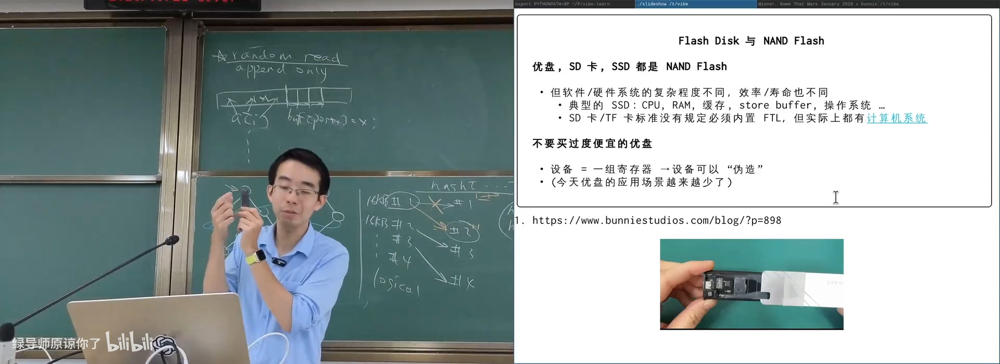

---

## 7. 操作系统视角：Block Device

### 7.1 寻址是有代价的

*(参考时间: 01:09)*

不同介质的定位方式不同：

- 磁盘：读写头寻道 + 盘片旋转；
- 光盘：激光头定位；
- Project Silica：机器人 + 光学定位；
- Flash：Die、Plane、Block、Page 选通。

```mermaid
flowchart TD
    A["存储介质"] --> B["Disk: Mechanical Seek"]
    A --> C["Optical: Laser Positioning"]
    A --> D["Glass: Robot + Optics"]
    A --> E["Flash: Die / Plane / Block / Page"]
```

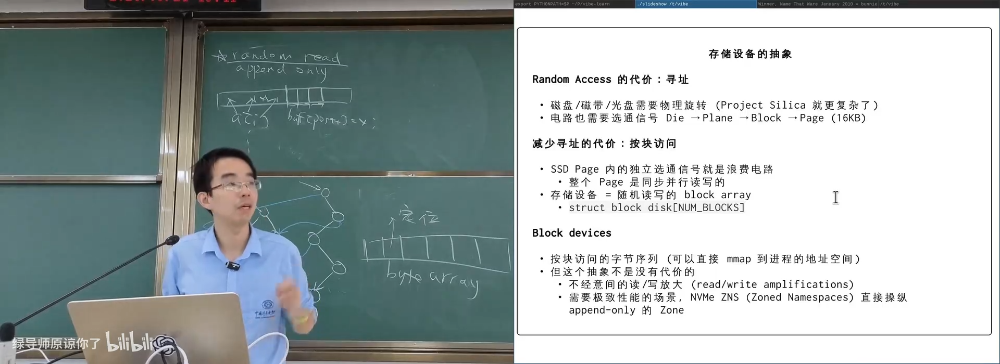

### 7.2 按块访问减少选通电路

*(参考时间: 01:10)*

让一个 Page 或 Sector 内的大量 bit 共享定位与选通电路：

- SSD Page 通常约 16 KB；
- Erase Block 可能数 MB；
- 磁盘 Sector 通常 512 B 或 4 KB。

```mermaid
flowchart LR
    A["Random Address"] --> B["Select Block / Page"]
    B --> C["Parallel Read Entire Page"]
    C --> D["Return Block Data"]
```

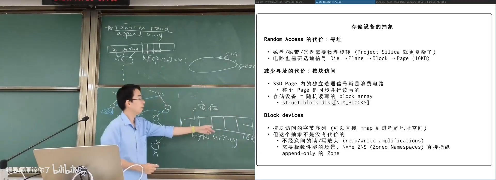

### 7.3 Block Array 抽象

*(参考时间: 01:13)*

操作系统看到：

```c
struct block disk[NUM_BLOCKS];
```

上层可以：

1. 读取第 `i` 个块；
2. 写入第 `j` 个块；
3. 一次读写连续多个块。

```mermaid
flowchart TD
    A["File System"] --> B["Block Device"]
    B --> C1["Read Block 3"]
    B --> C2["Write Block 8"]
    B --> C3["Read Blocks 10..20"]
    C1 --> D["Storage Hardware"]
    C2 --> D
    C3 --> D
```

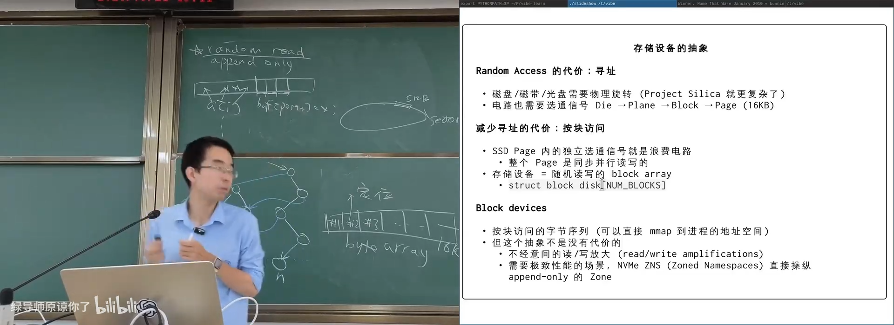

### 7.4 读写放大

*(参考时间: 01:14)*

如果只修改一个字节，但设备最小单位是 4 KB 或 16 KB：

```text
read 16 KB block
modify 1 byte
write 16 KB block back
```

这会产生：

- 读放大：读入了很多不需要的字节；
- 写放大：为了一个字节写回整块；
- Flash 额外放大：垃圾回收时搬运有效页。

```mermaid
flowchart LR
    A["Write 1 Byte"] --> B["Read 16KB Block"]
    B --> C["Modify Byte"]
    C --> D["Write 16KB Block"]
    D --> E["Read / Write Amplification"]
```

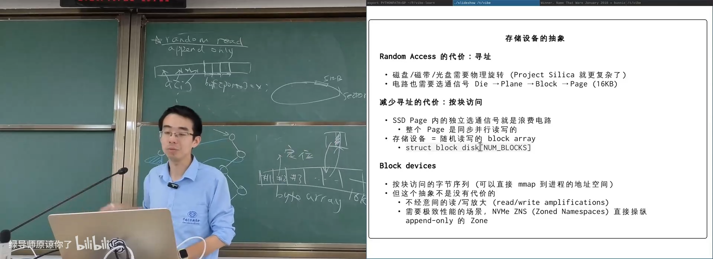

### 7.5 `block_device_operations`

*(参考时间: 01:15)*

Linux 为存储设备提供块设备接口：

```c
struct block_device_operations {
    int (*open)(struct block_device *, fmode_t);
    void (*release)(struct gendisk *, fmode_t);
    int (*ioctl)(struct block_device *, fmode_t, unsigned, unsigned long);
    // ...
};
```

驱动还需要配置 `request_queue`，负责把块请求排入设备队列。

一旦实现块读写，文件系统就可以在上面提供：

- `read`；
- `write`；
- `mmap`；
- 文件与目录。

```mermaid
flowchart LR
    A["read / write / mmap"] --> B["File System"]
    B --> C["Block Layer / request_queue"]
    C --> D["block_device_operations"]
    D --> E["Storage Device"]
```

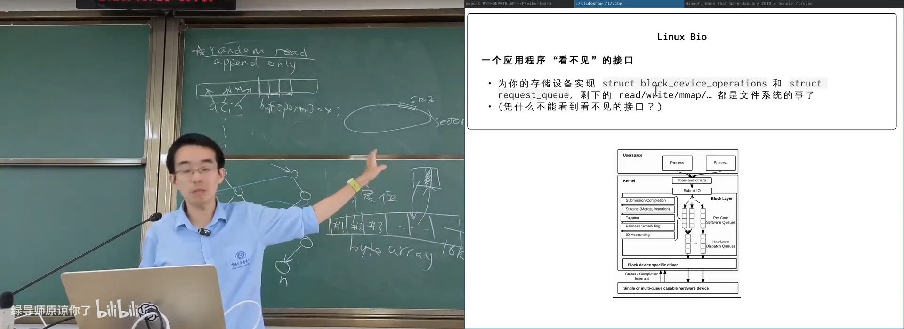

### 7.6 NVMe ZNS

*(参考时间: 01:14)*

传统块设备隐藏 Flash 内部的追加写和擦除特性，软件难以避免额外搬运。NVMe Zoned Namespaces 暴露分区顺序写模型：

- Zone 内顺序写；
- Zone 整体重置；
- 上层主动管理数据布局；
- 减少 FTL 和垃圾回收开销。

```mermaid
flowchart TD
    A["Traditional Block Device"] --> B["FTL Hides Append-only"]
    B --> C["GC / Write Amplification"]
    D["ZNS"] --> E["Expose Zones"]
    E --> F["Sequential Writes"]
    F --> G["Host Controls Layout"]
```

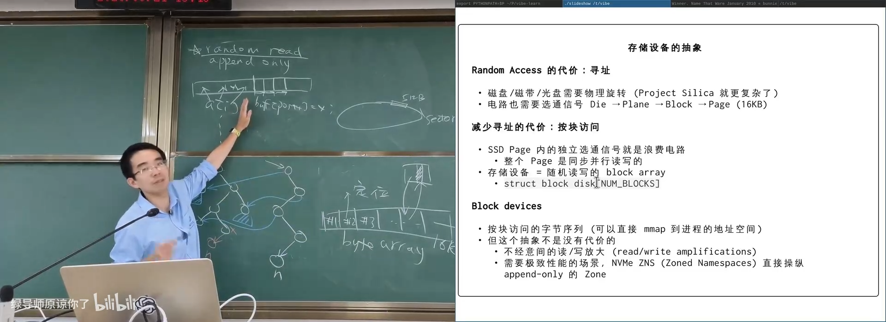

---

## 8. 打开 Linux Block I/O

### 8.1 从 first principles 观察块读写

*(参考时间: 01:15)*

操作系统本身也是程序。既然块 I/O 由内核代码执行，就可以插入探针记录：

- 谁发起 I/O；
- 读还是写；
- 读写多少块；
- 延迟是多少；
- 哪个进程产生最多 I/O。

课程借助 AI 使用 eBPF 实现了一个块 I/O 可视化工具。

```mermaid
flowchart TD
    A["Application"] --> B["File System"]
    B --> C["Block I/O"]
    C --> D["eBPF Probe"]
    D --> E["Event Stream"]
    E --> F["Visualization Tool"]
    F --> G["Read / Write / Latency"]
```

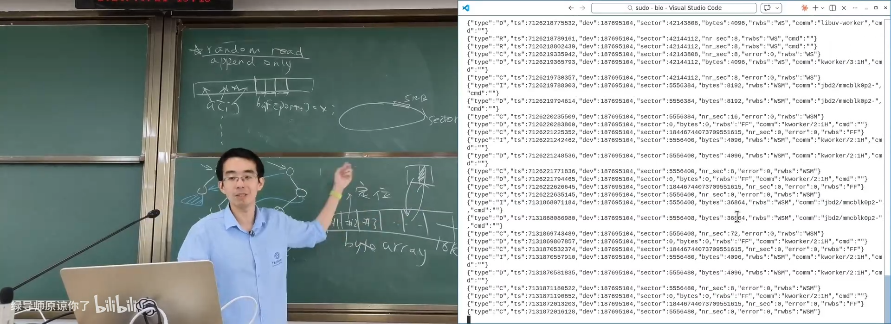

### 8.2 观察 `find` 与写文件

*(参考时间: 01:18)*

实验：

```bash
find /
dd if=/dev/zero of=a.txt bs=1M count=100
```

工具展示：

- 蓝色事件：读；
- 黄色事件：写；
- 橙色事件：同步；
- 每个进程的 I/O 延迟分布；
- 哪些进程产生最多块 I/O。

```mermaid
flowchart LR
    A["find /"] --> B["大量 Read"]
    C["dd 写文件"] --> D["大量 Write"]
    B --> E["Block I/O Events"]
    D --> E
    E --> F["Latency / Process / Type"]
```

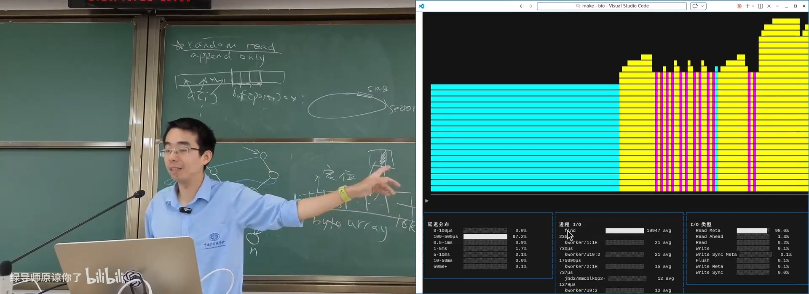

---

## 9. 总结：最终胜出的仍然是电子

从磁带、磁盘到光盘，再到 Flash：

- 磁和坑都能持久保存 bit；
- 机械定位带来毫秒级随机访问延迟；
- 光学挖坑适合低成本复制，却不适合随机写；
- Flash 的密度、速度和集成电路制造优势最终使其胜出；
- Flash 有磨损问题，需要 FTL 和 Wear Leveling；
- 所有存储设备最终向操作系统暴露为块数组；
- 文件系统再把块设备抽象成字节序列、文件和 `mmap`。

```mermaid
flowchart LR
    A["Tape"] --> B["Drum"]
    B --> C["Disk"]
    C --> D["Floppy"]
    D --> E["Optical Disc"]
    E --> F["Flash / SSD"]
    F --> G["Block Device"]
    G --> H["File System"]
```

课程的最终结论：

> 物理限制无法突破，但可以用软件重新组织数据来隐藏或分摊代价。Random Read + Append-only Write 的模式足以实现任何数据结构；理解这一原理，可以在 FTL、文件系统甚至新的非易失存储出现时推导出新的系统设计。

---

## 附：官方参考与延伸阅读

- [GPIO LED](https://jyywiki.cn/OS/demos/persistence/gpio-led)
- [磁带与磁性存储历史资料](https://jyywiki.cn/OS/manuals/CalComp-Software-Reference.pdf)
- [软盘驱动器视频](https://www.bilibili.com/video/BV1BS4y1X76n/)
- [CD-RW 原理](https://www.scientificamerican.com/article/how-do-rewriteable-cds-wo/)
- [Project Silica Nature Paper](https://www.nature.com/articles/s41586-025-10042-w)
- [Project Silica Video](https://www.bilibili.com/video/BV1Wu4y187Dh/)
- [Bunnie: SD Card Internals](https://www.bunniestudios.com/blog/?p=898)
- [Linux Block I/O 实验](https://jyywiki.cn/OS/demos/persistence/bio)
- [SSD Guide](https://github.com/mikeroyal/SSD-Guide)
- [Coding for SSDs](https://codecapsule.com/2014/02/12/coding-for-ssds-part-1-introduction-and-table-of-contents/)
- [OSTEP Chapter 37: Hard Disk Drives](https://pages.cs.wisc.edu/~remzi/OSTEP/file-disks.pdf)
- [OSTEP Chapter 44: Flash-based SSDs](https://pages.cs.wisc.edu/~remzi/OSTEP/file-ssd.pdf)

官方课程资料：

- [课程主页](https://jyywiki.cn/OS/2026/)
- [第 23 讲讲义：持久数据的存储](https://jyywiki.cn/OS/2026/lect23.md)
- [视频：23 - 存储设备原理](https://www.bilibili.com/video/BV1RHLh6pEqn/)

> **版权与署名**：本讲课程材料由蒋炎岩（jyy）编写。课程讲义与幻灯片采用 [Creative Commons BY-NC 4.0](http://creativecommons.org/licenses/by-nc/4.0/) 许可；本电子书保留课程出处、作者署名与许可说明。
