# 文件系统 API (1)：目录树、链接与元数据

> **课程**：2026 春季学期《操作系统原理》，第 24 讲  
> **讲师**：蒋炎岩（jyy）  
> **官方课程主页**：<https://jyywiki.cn/OS/2026/>  
> **官方讲义**：<https://jyywiki.cn/OS/2026/lect24.md>  
> **视频来源**：<https://www.bilibili.com/video/BV1hAGr6vEi9/>  
> **版权说明**：课程讲义与幻灯片归蒋炎岩所有，采用 [Creative Commons BY-NC 4.0](http://creativecommons.org/licenses/by-nc/4.0/) 许可；本电子书是对课堂讲授的书面化重构，保留出处与许可说明。

## 导读：从块设备到“人类可理解”的文件系统

*(参考时间: 00:00:01)*

前面几讲把存储设备抽象成了一个很简单的接口：一个块设备，主要提供 `read_block` 与 `write_block` 两种操作；如果需要确认数据是否真正落盘，还可以使用等待或检查刷新的接口。SSD、HDD、SD 卡等设备内部虽然可能有完整的控制器和复杂的固件，但暴露给操作系统的核心模型只是“按块读写”。

问题在于，**块设备并不适合直接交给普通进程使用**。如果所有进程都能打开 `/dev/...` 并直接读写整块设备，那么它们就会在同一个巨大字节序列上相互冲突。更重要的是，对人类来说，用设备号、块号和偏移量访问数据几乎不可用。

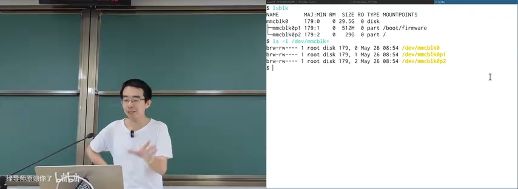

因此，操作系统需要一个中间抽象层：**文件系统**。它一方面把设备管理起来，另一方面给用户和程序提供更符合人类认知的访问方式。本讲讨论的是“人类使用的文件系统 API”；下一讲会继续讨论程序与 AI Agent 使用的文件系统 API。

本讲的主线可以从数据结构来理解：

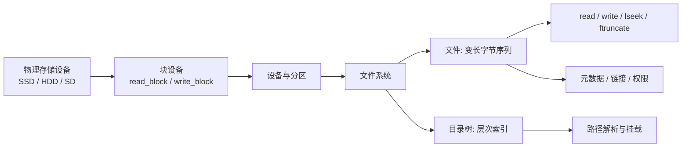

---

## 1. 从块设备到文件系统

### 1.1 块设备的抽象为什么不够

存储介质内部并不是简单的“一个 bit 存在某个位置”。SSD 有闪存转换层和垃圾回收，机械硬盘有寻道、旋转和缓存，设备上甚至可能有独立的控制器和固件。但设备最终接入总线后，操作系统驱动给上层提供的是按块访问的能力。

对于磁盘和内存，系统设计者其实已经做过一次类似的抽象：

- 物理内存被抽象成虚拟地址空间；
- 虚拟地址空间之上实现 `malloc` / `free`；
- 在 `malloc` / `free` 之上再构建链表、集合、字典等数据结构；
- 磁盘同样可以从“块设备”抽象成“虚拟磁盘”；
- 虚拟磁盘中的基本对象，就是变长的字节序列：**文件**。

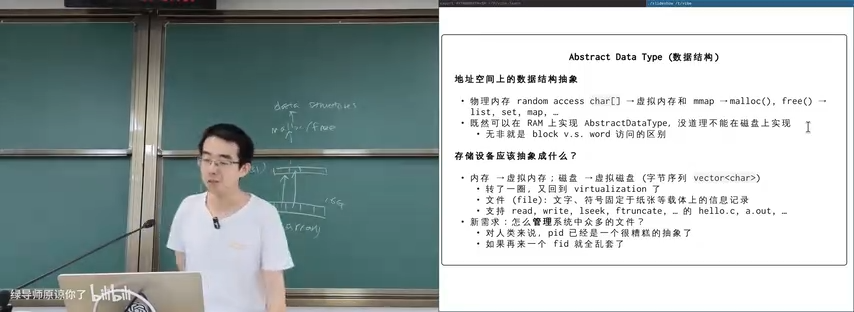

文件不同于固定大小的磁盘。一个小文件可能只有几 KB，而电影或磁盘镜像可能有几十 GB。文件还可以在中间位置改写、截断或扩展，所以它更像一个可变的 `vector<char>`，而不是固定长度的数组。

UNIX 为文件提供了大家熟悉的接口：

```c
int    fd = open(path, flags, mode);
ssize_t n = read(fd, buffer, count);
ssize_t n = write(fd, buffer, count);
off_t  off = lseek(fd, offset, whence);
int    r = ftruncate(fd, length);
```

`hello.c`、可执行文件 `a.out`、图片和设备文件都可以通过同一组文件描述符 API 访问。真正的新问题是：**如何管理系统中数量庞大的文件？**

### 1.2 文件的命名：PID 的教训

进程可以用 PID 标识，文件也可以用内部的 FID 或 inode 编号标识。但对人类而言，PID 并不是一个好的命名方式。用户看到 `1695` 这样的数字，并不知道它代表浏览器、编辑器还是某个后台线程，所以工具往往还要通过 `/proc` 和进程名反查 PID。

同理，如果所有 `open` 的第一个参数都必须写成 `176358`，文件系统也会变得难以使用。人类需要的是有语义、能分层组织的名字。

于是，文件系统借鉴了现实世界管理信息的方法：**像图书馆一样建立层次索引**。

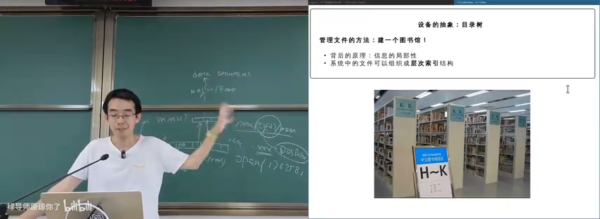

图书馆不会把所有书堆在一起，而是按照分类、书架、区域逐级组织。计算机中的目录树也是同样的思路：把相关信息放在相近层次中，利用信息的局部性快速定位。

### 1.3 目录树中的 `.` 与 `..`

在 UNIX 目录模型中，每个目录通常至少包含两个特殊入口：

- `.` 指向当前目录本身；
- `..` 指向上一级目录。

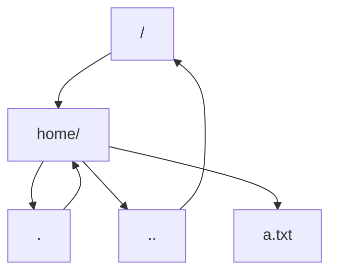

这意味着目录树在实现上并不是一棵简单的树，而是一个带有反向边和自环指针的数据结构。`ls -a` 能看到 `.` 和 `..`，普通 `ls` 则默认忽略以点开头的名字。


以点开头的“隐藏文件”并不是内核真正实现的一种复杂属性。绝大多数情况下，它只是 UNIX 留下的约定：文件系统仍然返回该目录项，而 `ls` 等命令行工具在输出时跳过它。BusyBox 的 `ls` 实现甚至只需要判断目录项名字的第一个字符是否为点，再根据 `-a` 等选项决定是否继续。


这个设计非常简单，却体现了 UNIX“快速、实用”的哲学：不需要为“隐藏”建立一个复杂的系统对象，只要工具和用户约定好命名规则即可。

---

## 2. 多个目录树与“从无到有”的挂载

### 2.1 世界上的每一块设备和每一个分区都有一棵目录树

系统中不只有一个文件系统。每个磁盘、每个分区、U 盘、光盘、网络文件系统，甚至磁盘镜像文件内部，都可能包含一棵目录树。


操作系统设计者首先要解决的问题是：这些彼此独立的目录树，如何组织到同一个系统命名空间里？

用户看到的体验通常很自然：

- 在 Windows 中插入 U 盘，文件管理器多出一个盘符，例如 E 盘；
- 在 Linux 中插入 U 盘，桌面或某个目录下会多出一个挂载点；
- 打开该目录，就进入了 U 盘文件系统内部的树。

背后发生的事情，是操作系统把一棵外部目录树接到已有目录树的某个节点上。

### 2.2 Windows 对象命名空间

Windows 的路径表面上是 `C:\`、`D:\`，但其内核还存在一个更底层的对象命名空间。例如：

```text
\Device\HarddiskVolume1
\Driver\Ntfs
\\server\share
\Device\LanmanRedirector\server\share
```

盘符是 DOS 时代遗留下来的用户层映射。在更底层的对象路径中，`C:` 可能对应类似 `\??\C:` 的每用户命名空间。`\??` 允许不同用户的同名路径解析到不同目标，这也是 Windows 为了兼容历史应用不断叠加机制的结果。

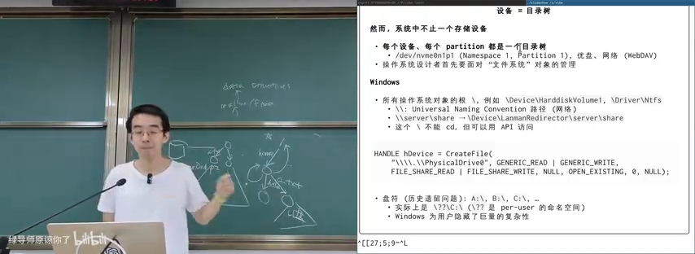

普通用户可以只看到简单盘符，而编写 Windows 程序或调试系统行为时，就需要理解这些隐藏的对象路径。

### 2.3 最小 Linux 启动时没有完整文件系统

Linux 启动早期可能只有 initramfs，以及 `/dev/console` 这样的最少设备节点。此时系统需要先找到真正的根设备，再把它的文件系统挂载到根目录，最后使用 `pivot_root` 或类似机制切换根文件系统。

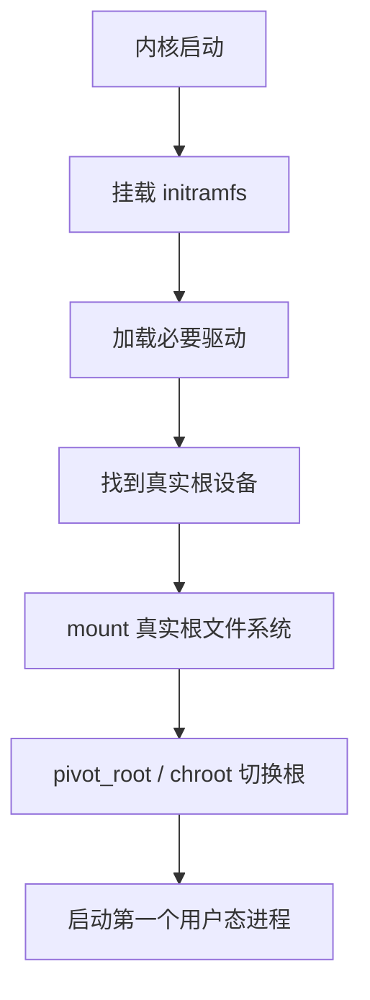

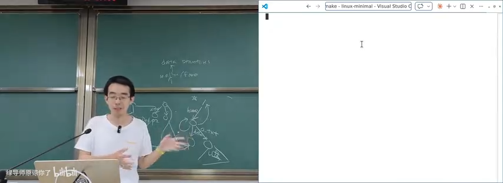

`mount` 的本质，就是把一个块设备上的目录树“贴”到当前系统命名空间的某个位置。挂载后，对挂载点下路径的读写会转到目标设备；写入也会真实反映到该设备。

### 2.4 光盘、ISO 9660 与 mount

为了演示挂载，课堂插入了一张 Windows 98 光盘。系统随之出现新的块设备，例如 `sr0`。文件系统探测程序会在设备字节序列中寻找魔数，例如 ISO 9660 的主描述符中必须出现 `CD001`。


这再次说明，文件系统本质上是在字节序列上定义的一种数据结构：给定根节点、偏移量和解析规则，驱动就能把设备内容转换成目录树。

挂载光盘时系统发现它只读，因此以 read-only 模式挂载。进入挂载点后可以看到 `AUTORUN.INF`、`README` 等文件。由于中文版 Windows 98 使用 GB2312 等旧编码，在 UTF-8 环境中直接查看会显示乱码，需要转换编码。

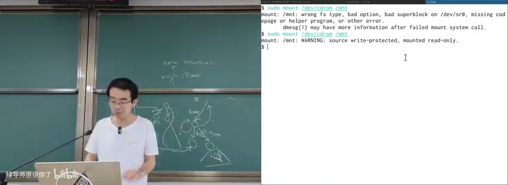

通过 `strace mount ...` 可以看到，挂载命令不仅调用 `mount` 系统调用，还会发出一系列 `ioctl`：

- 检查目标是否为块设备；
- 查询设备容量；
- 检查光驱状态；
- 尝试读取光盘；
- 根据结果继续或失败退出。

块设备最核心的操作是读和写，而大量设备控制功能都集中在 `ioctl` 中。`eject` 命令也是同一原理：打开光驱设备，然后发出“弹出光盘”的 `ioctl` 请求。

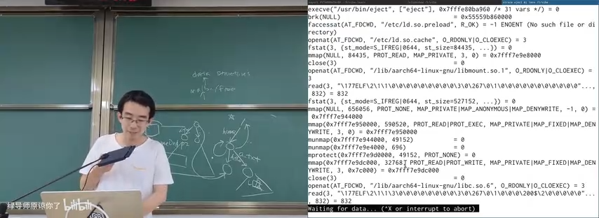

操作系统里没有神秘魔法。复杂用户体验最终仍然可以拆解为 well-defined 的 API、驱动和设备协议。

### 2.5 loopback device：给文件伪装一个块设备

`mount` 的一个经典限制是：它看起来只能挂载块设备，而磁盘镜像只是一个普通文件。那为什么 Linux 还能挂载 `.img`、`.vfat` 等镜像？

答案是通过 **loopback device**：

1. 打开镜像文件；
2. 探测镜像中的文件系统类型；
3. 打开 `/dev/loop-control`；
4. 通过 `ioctl(LOOP_CTL_GET_FREE)` 分配一个空闲 loop 设备；
5. 通过 `ioctl(LOOP_SET_FD, ...)` 把 loop 设备与镜像文件绑定；
6. 对 `/dev/loop0` 执行正常的 `mount`；
7. 此后对 `/dev/loop0` 的块读写会被转译成镜像文件的 `read` / `write`。


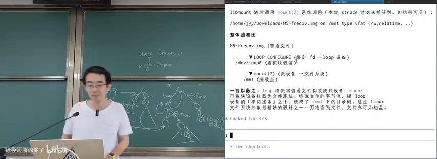

通过 `strace` 可以看到 `LOOP_CTL_GET_FREE` 返回编号 0，于是出现 `/dev/loop0`；如果没有释放，下一次会得到 1、2、3。许多系统启动后都存在大量 loop 设备，这正是容器、Snap 软件包、镜像挂载等机制的基础。

---

## 3. 文件系统层次标准 FHS

*(参考时间: 00:37:24)*

多个设备各自拥有目录树，并不意味着系统根目录可以随意设计。Linux 使用 **Filesystem Hierarchy Standard（FHS）** 约定 `/usr`、`/home`、`/mnt`、`/etc`、`/var` 等目录的用途。

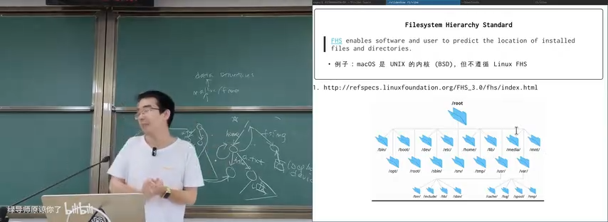

FHS 让软件、用户和管理员能够预测文件位置。虽然随着设备数量和系统复杂度增加，这个标准有时显得过时，但它仍然是 Linux 世界的重要共同语言。

macOS 的内核源于 UNIX，但它并不完全遵循 Linux FHS。这说明目录布局不是内核唯一能选择的方案，而是操作系统生态共同形成的规范。

---

## 4. 目录树 API：增删改查

### 4.1 最小 API 集合

一旦目录树建立，就需要提供增删改查接口。课堂重点介绍了三个系统调用：

```c
int mkdirat(int dirfd, const char *pathname, mode_t mode);
int unlinkat(int fd, const char *path, int flag);
ssize_t getdents64(int fd, void *dirp, size_t count);
```

- `mkdirat` 创建目录；
- `unlinkat` 删除目录项，也可删除空目录；
- `getdents64` 读取目录项，是 `readdir` 等库函数背后的系统调用。


操作系统只提供最基础的目录操作，更复杂的遍历、匹配、排序和递归通常由 C 库或用户态工具实现。

### 4.2 globbing：通配符不是系统调用

Shell 中常见的 `/etc/**/*`、`*.conf` 等模式属于 **globbing**。执行：

```bash
echo /etc/**/*
```

时，很多通配符扩展其实由 Bash 完成，然后把展开后的路径作为参数传给程序。因此直接 `strace echo` 不一定能看到文件遍历过程。若想把 globbing 行为也放进追踪范围，可以执行：

```bash
strace bash -c 'echo /etc/**/*'
```

这时会看到大量 `open`、`getdents64` 等系统调用。

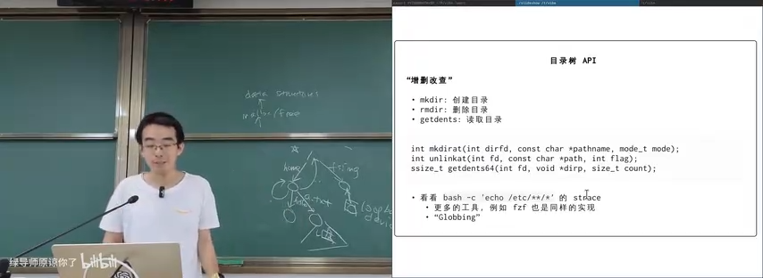

`glob()` 是 C 库对这些系统调用的封装。模糊查找工具 `fzf`、构建系统和代码编辑器也遵循类似原理。

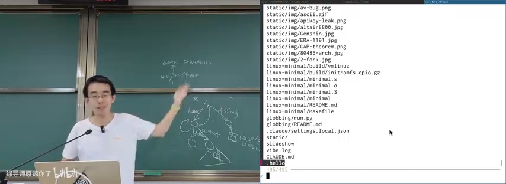

这也是现代 Agent 工具的重要组成部分。除了 Read、Write、Grep 和 Bash，Glob 也是理解与操作代码仓库的基础能力。

---

## 5. 硬链接：同一个文件，多个名字

### 5.1 文件是一个“带名字的指针”

目录项可以把名字映射到文件对象。既然 `.` 可以指向当前目录、`..` 可以指向父目录，那么同一个文件对象也可以拥有多个普通名字。

例如：

```bash
ln a.txt b.txt
```

创建硬链接后，`a.txt` 与 `b.txt` 是同一个文件的两个目录入口。修改其中一个，另一个立即可见。

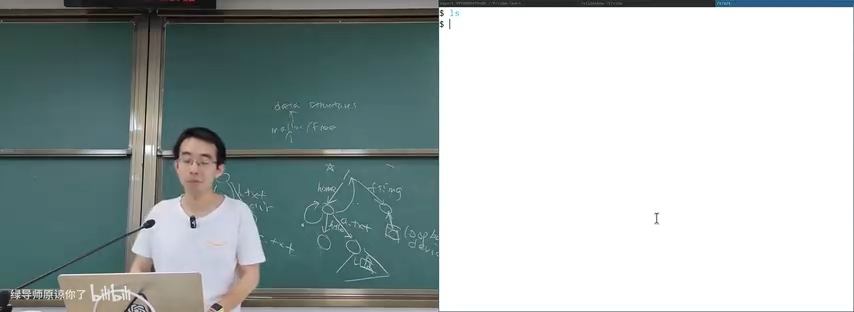

```bash
ls -li a.txt b.txt
```

两个名字拥有相同的 inode 编号，证明它们指向同一份文件数据。`ls -li c.txt` 若编号不同，则 `c.txt` 是另一个对象。

### 5.2 引用计数与 unlink

硬链接允许一个文件对象被多个目录项引用，因此文件系统必须维护**引用计数**：

- 创建硬链接时，引用计数增加；
- 删除名字时，执行的是 `unlink`，而不是立即销毁数据；
- `unlink` 删除一个目录项，并把引用计数减一；
- 只有引用计数降为零，文件数据才真正回收。

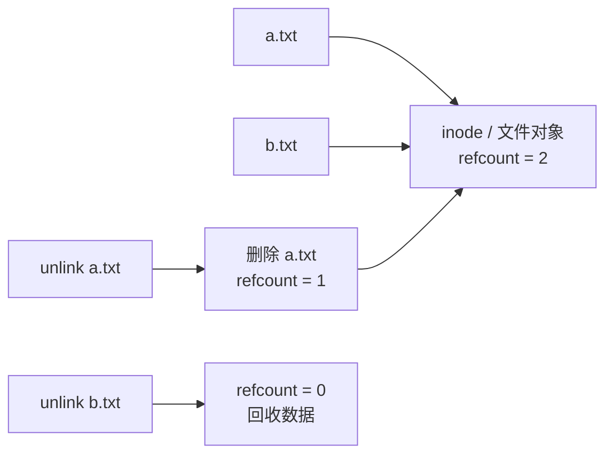

硬链接有两个重要限制：

- 通常不能链接目录；
- 不能跨文件系统。

如果允许任意链接目录，很容易形成环。引用计数无法处理循环引用：环中每个对象都“有人引用”，但整个环已经从根目录树脱离，永远无法被回收。因此普通用户不能用硬链接创建目录环，`.` 和 `..` 是由文件系统内部特殊维护的例外。

---

## 6. 符号链接：在文件里存一条路径

### 6.1 软链接是“跳转提示”

符号链接（symbolic link）本身也是一个文件，但它的内容是一段路径字符串。路径解析遇到符号链接时，会读取其中的字符串，再把解析位置切换到目标路径。

```bash
ln -s ../data/a.txt link.txt
```

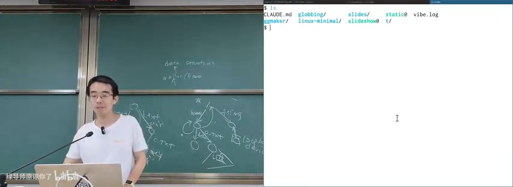

符号链接的限制比硬链接少：

- 可以跨文件系统；
- 可以链接目录；
- 可以指向不存在的位置；
- 甚至可以形成环。

如果目标文件被删除，符号链接本身仍然存在；访问它时才会因为路径解析失败而报错。如果目标路径后来又恢复，链接会自动重新生效。

Windows 快捷方式与符号链接目标相似，但实现复杂得多。Windows 快捷方式可能记录原路径、卷信息、文件 ID 等线索，因此目标文件改名或 U 盘盘符改变后，仍可能被找到。

### 6.2 用符号链接实现状态机游戏

符号链接可以形成任意图结构，因此不仅能做普通快捷方式，还能把文件系统当作状态机。

课堂演示了一个文字冒险游戏：

- 每个游戏状态是一个目录；
- 每个选项是一个符号链接；
- `cd 1`、`cd 2` 等操作实际上沿着链接进入下一个状态；
- 路径本身记录了玩家经过的历史；
- `cd ..` 可以回到上一状态，实现“时光回溯”；
- 链接可以成环，玩家能够返回此前的场景。

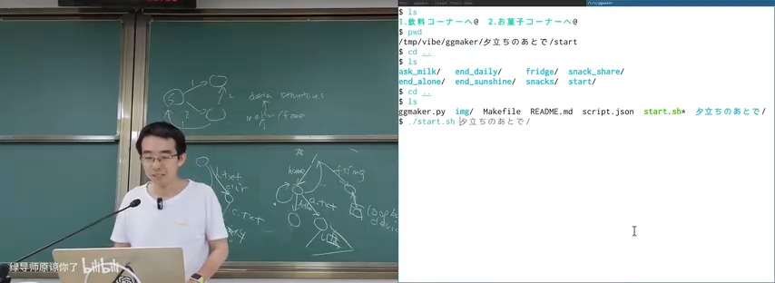

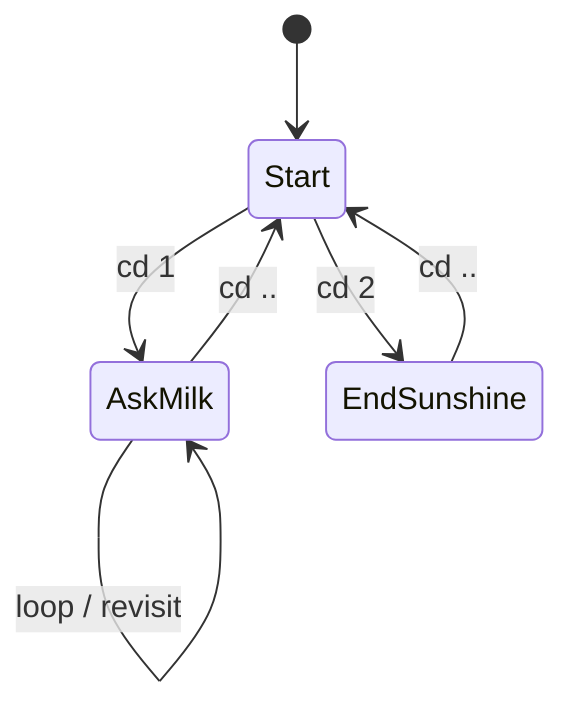

这说明操作系统的机制一旦足够通用，就可能被用于原设计者没有预料的场景。文件系统 API 不只是保存文档，也可以成为程序结构、状态机和虚拟环境的实现基础。

---

## 7. Nix：用链接构造可回滚的软件环境

*(参考时间: 00:53:00)*

硬链接和符号链接也可以用来解决软件包版本管理问题。假设 `/nix/store` 中同时保存多个 Python 版本，每个路径包含软件包的 hash：

```text
/nix/store/<hash>-python-3.11.1/
/nix/store/<hash>-python-3.14.9/
```

需要某个环境时，不复制整个软件包，而是创建一组链接，把 `/usr/bin/python`、运行库和其他依赖指向指定版本。

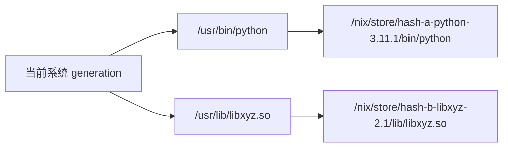

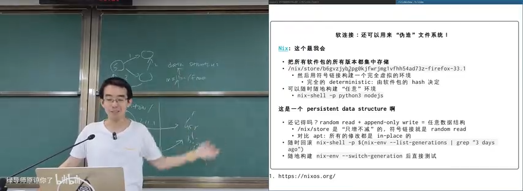

Nix 的关键特征是**只增不减**：

- 安装新版本时保留旧版本；
- 新环境通过新链接组合出来；
- 修改不会破坏已有环境；
- 系统或用户环境可以记录为一组 generation；
- 系统故障时可以快速回滚到上一代；
- 不再需要时可以整体切换或清理。

这与此前讲过的持久化数据结构相通：**随机读 + append-only 写，可以构造任意持久化数据结构**。修改树时，不原地修改所有节点，而是复制路径上的节点，再把其他子树指针共享给新根。

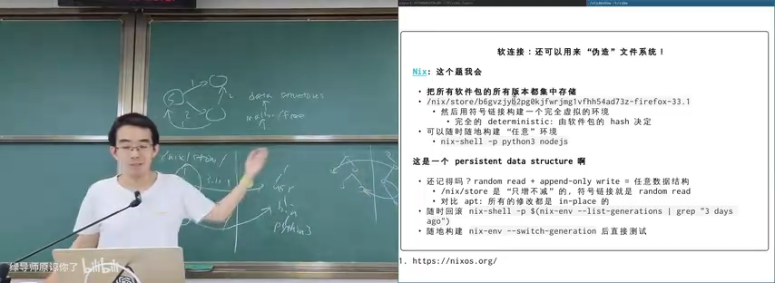

Nix 也提供了另一种启发：在现代 AI 工具的帮助下，用户可能不需要记住所有命令，只需要知道“隔离环境、版本回滚、符号链接组合”这些概念，就可以让 Agent 生成环境描述与执行脚本。

---

## 8. 文件属性与元数据

### 8.1 隐藏文件只是最小的属性

最初看起来，“隐藏”像是文件系统属性。但深入之后会发现，UNIX 中的点文件只是工具约定；Windows 才把隐藏、只读、系统、归档等作为更正式的文件属性。

文件的属性远不止这些：

- inode 编号；
- 文件类型；
- 所有者与用户组；
- 读、写、执行权限；
- 大小；
- 修改时间；
- 链接数；
- 设备号；
- 扩展属性；
- 访问控制列表。


常见文件类型包括：

| 标记 | 类型 |
|---|---|
| `d` | 目录 |
| `l` | 符号链接 |
| `p` | 管道 |
| `c` | 字符设备 |
| `b` | 块设备 |

### 8.2 权限模式

`ls -l` 输出中的 `rwx` 分成三组：

- User：文件所有者；
- Group：同组用户；
- Other：其他用户。

每一组三个位分别表示读、写、执行。例如：

```text
0o755 = rwx r-x r-x
0o644 = rw- r-- r--
0o000 = --- --- ---
```

权限会影响 `open`、`execve` 等系统调用的行为。

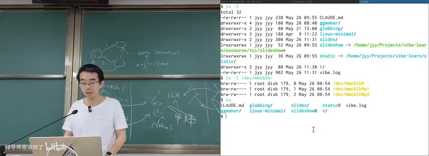

课堂中演示了以下现象：

- root 可以创建属于 root 的文件；
- 普通用户可以读、写 root 的某些文件，但不能修改元数据；
- `chmod 000` 清除所有权限后，普通用户无法打开或执行文件；
- `strace` 会显示失败发生在 `open` 等系统调用上，并返回 `EACCES`；
- root 通常可以绕过普通权限检查。

root 之所以拥有“绝对权限”，是系统设计上的安全阀。如果高权限用户也无法删除某个文件，普通进程就可能恶意占满存储空间，管理员也无法恢复系统。

### 8.3 隐藏的 policy 与 procfs

有时候，用户真正想要的并不是“始终隐藏”，而是“只有别人在旁边时隐藏”。这属于更复杂的 policy，而不是单一文件属性。现代操作系统通常不支持这种语义，但现有文件系统已经证明：**文件系统可以动态构造结果，而不仅是被动读取固定对象。**

Linux 的 `procfs` 就是典型例子。`/proc/<pid>` 看起来像普通目录，但其中大量文件并不存在固定实体。只有进程调用 `open`、`getdents64` 时，`procfs` 才遍历内核中的 `task_struct`、run queue 等数据结构，并动态生成返回结果。

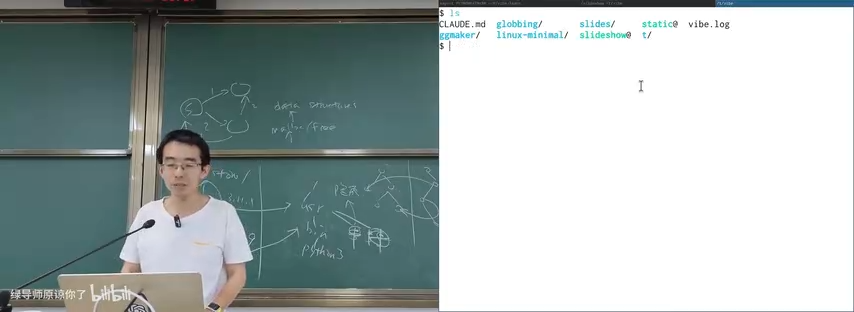

这意味着：

- 能看见什么、不能看见什么，可以由文件系统代码决定；
- 同一路径可能在不同用户或不同时间解析到不同对象；
- “目录树”是接口呈现，不必与底层对象一一对应；
- `/proc/<pid>/mem` 等特殊文件也可以在访问时动态提供内容。

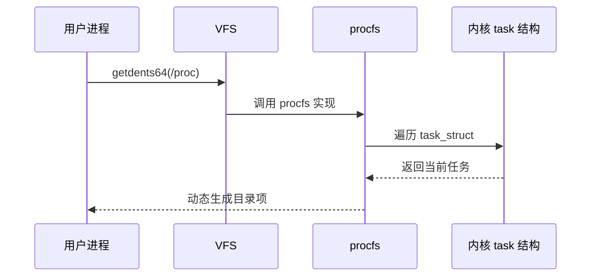

只要 API 返回的数据符合预期，底层对象是否真实存在并不重要。

---

## 9. Extended Attributes：给文件挂一个键值表

*(参考时间: 01:10:09)*

文件系统希望支持任意属性，于是有了 **Extended Attributes（xattr）**。每个文件可以维护一个 key-value 字典，用户可以添加自己的元数据。

常用接口包括：

```c
ssize_t fgetxattr(int fd, const char *name,
                  void value[.size], size_t size);
int fsetxattr(int fd, const char *name,
              const void value[.size], size_t size, int flags);
```

命令行工具通常提供 `getfattr`、`setfattr` 等封装。例如：

```bash
setfattr -n user.author -v jyy a.txt
setfattr -n user.description -v "example" a.txt
getfattr -d a.txt
```

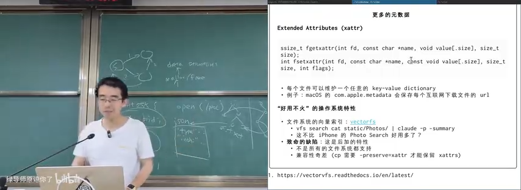

macOS 会把下载来源、隔离标记、签名信息、下载进度等保存在扩展属性中。普通 `ls` 可能看不到它们，但 Finder 等程序可以利用这些元数据改变行为。

问题在于兼容性：

- FAT 等文件系统通常不支持 xattr；
- 普通 `cp` 可能不会复制 xattr；
- `cp -a`、`--preserve=xattr`、`rsync`、`tar --xattrs` 等工具才有机会保留；
- 如果跨文件系统复制时目标不支持，属性往往只能静默丢失；
- 来回拷贝两次后，文件内容可能没变，但元数据已经消失。

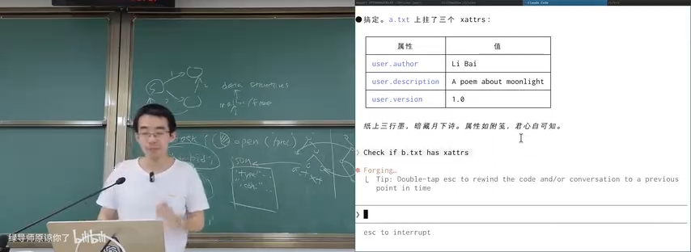

这给系统实现带来麻烦，却也蕴藏强大的可能性。例如 VectorFS 把文件的向量索引存成扩展属性，从而支持按语义搜索照片、文档等对象。

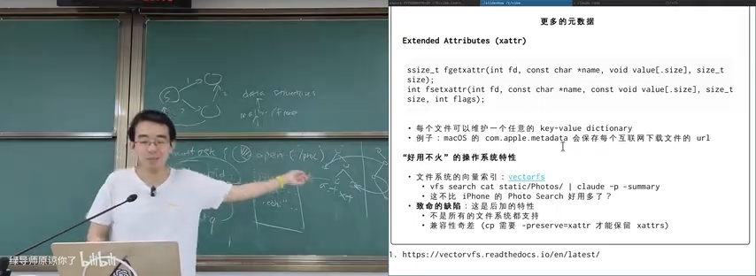

xattr 目前“知道的人不多，也不是所有文件系统都支持”，但讲师认为它是一种迟早会变得更重要的机制，因为 AI Agent 很需要一个既能保存内容、又能携带任意语义标签的文件系统。

---

## 10. Access Control List：更细粒度的权限

*(参考时间: 01:16:15)*

传统的 user / group / other 权限很简洁，但表达能力有限。例如：

- 想让大多数用户都能访问某个文件；
- 只排除某一个用户；
- 为不同用户设置不同权限；
- 又不希望专门创建一个用户组。

Linux 的 **Access Control List（ACL）** 提供了更细粒度的访问控制：

```bash
setfacl -m u:alice:rw file
setfacl -m u:bob:--- file
getfacl file
```

ACL 项可以用类似下面的格式表达：

```text
[d:]<u|g|m|o>:name:perms
```

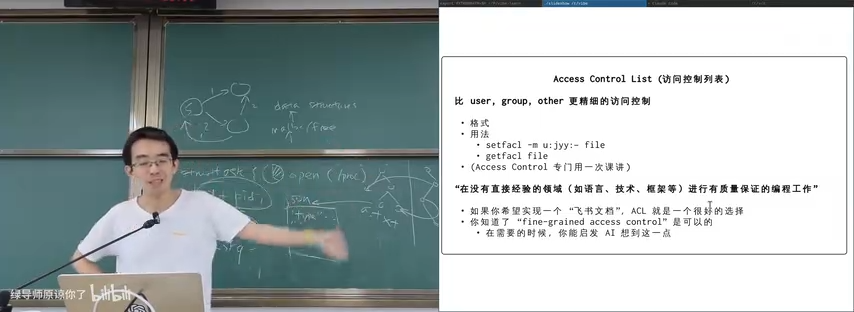

不过，root 仍然需要拥有绕过普通 ACL 的能力。否则一个用户就可以创建永远无法被管理员删除的文件，最终用存储空间拖垮系统。

课堂的演示目标不只是记住 `setfacl` 的语法，而是建立一套面对未知技术时的能力：

1. 知道存在一个合适的概念，例如 fine-grained access control；
2. 向 AI 或文档追问具体 API；
3. 通过实验验证行为；
4. 理解它提供的系统保证；
5. 在产品与系统设计中正确使用该机制。

---

## 11. 总结

本讲从块设备出发，逐层构建了人类可用的文件系统抽象：

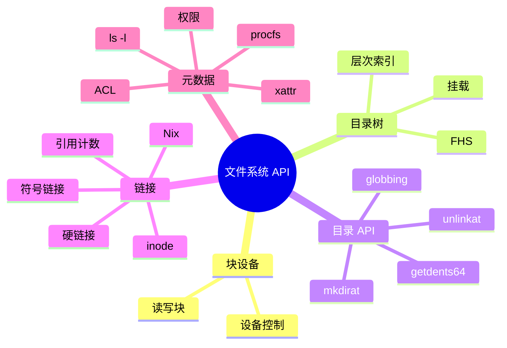

核心结论包括：

- 文件系统是在块设备字节序列上实现的数据结构；
- 目录把文件名映射到文件对象，并通过层次结构管理海量对象；
- `mount` 把多个独立目录树接入统一命名空间；
- loopback device 用普通文件模拟块设备；
- 硬链接依赖引用计数，因此通常不能链接目录、不能跨文件系统；
- 符号链接保存路径字符串，限制少，可用于构造复杂状态机和软件环境；
- 文件不只有内容，还有 inode、权限、时间、xattr、ACL 等大量元数据；
- procfs 说明文件系统可以动态生成对象，接口表现与底层实体可以分离；
- xattr 与 ACL 展示了文件系统继续扩展属性的方向。

目录树、文件、链接和元数据看起来都是“早就熟悉”的概念，但它们是操作系统最强大的抽象之一。理解它们背后的数据结构与系统调用，才能在构建文件工具、软件环境、AI Agent 和新型系统时，把已有机制组合成新的能力。

---

## 附：官方参考与延伸阅读

本讲对应的官方讲义与课程页面：

- [《操作系统原理》2026 课程主页](https://jyywiki.cn/OS/2026/)
- [第 24 讲讲义：文件系统 API (1)](https://jyywiki.cn/OS/2026/lect24.md)
- [本讲视频](https://www.bilibili.com/video/BV1hAGr6vEi9/)

课堂与讲义中出现的外部资料：

- [util-linux](https://github.com/util-linux/util-linux)：挂载、设备工具及底层系统调用示例。
- [Linux kernel loop driver](https://elixir.bootlin.com/linux/latest/source/drivers/block/loop.c)：loopback device 的块设备实现。
- [Filesystem Hierarchy Standard 3.0](http://refspecs.linuxfoundation.org/FHS_3.0/fhs/index.html)：Linux 目录层次标准。
- [globbing 与 glob()](https://www.gnu.org/software/libc/manual/html_node/Calling-Glob.html)：GNU C Library 的路径匹配接口。
- [Nix](https://nixos.org/)：基于不可变 store 与链接组合的软件环境管理。
- [VectorFS](https://vectorvfs.readthedocs.io/en/latest/)：把向量索引与文件系统元数据结合的探索。
- [Windows Shell Link 格式](https://learn.microsoft.com/en-us/openspecs/windows_protocols/ms-shllink/)：快捷方式文件格式说明。
- *Operating Systems: Three Easy Pieces*：
  - 第 37 章：Files and Directories；
  - 第 55 章：Access Control；
  - 第 53、54 章：Intro Security 与 Authentication（讲义标注不在考试范围）。

> **版权说明**：课程讲义与幻灯片的著作权归蒋炎岩所有，采用 Creative Commons BY-NC 4.0 许可。电子书正文为课堂内容的书面化重构，脚本占位符已替换为视频画面或官方资料渲染图；引用与来源链接均保留在本页。
