# 文件系统 API (2)：监控、快照、覆盖与任意数据结构

> **课程**：2026 春季学期《操作系统原理》  
> **讲师**：蒋炎岩（jyy）  
> **官方课程主页**：<https://jyywiki.cn/OS/2026/>  
> **官方讲义**：<https://jyywiki.cn/OS/2026/lect25.md>  
> **视频来源**：[Bilibili BV12gVs6SExQ](https://www.bilibili.com/video/BV12gVs6SExQ/)  
> **版权说明**：课程讲义与幻灯片归蒋炎岩所有，采用 [Creative Commons BY-NC 4.0](http://creativecommons.org/licenses/by-nc/4.0/) 许可；本电子书是对课堂讲授的书面化重构，保留出处与许可说明。

## 导语：文件系统不只是增删改查

*(参考时间: 00:00)*

上一讲学习了文件系统的 CRUD API：

- `mkdir` / `rmdir`；
- `link` / `symlink` / `unlink`；
- 文件权限、xattr、ACL；
- `mount` / `umount`。

这些都是一次修改一个对象的“一小步操作”。这一讲讨论更高级的问题：

> 文件系统作为一个 Abstract Data Type，还能提供哪些操作？

课程选择四类能力：

1. **监控**：文件改变时主动通知应用；
2. **快照**：保留并返回过去某个时间点的状态；
3. **覆盖**：把多个目录拼成一个虚拟目录；
4. **FUSE**：在用户态实现任意文件系统。

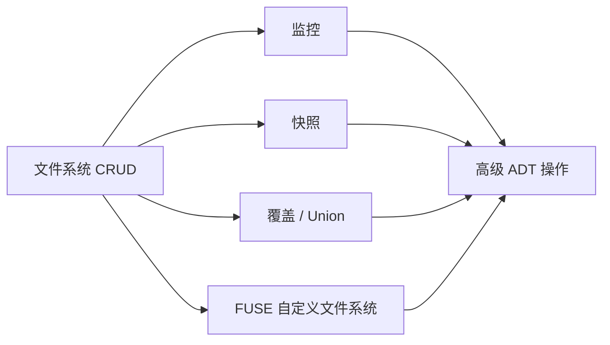
```mermaid
flowchart LR
    A["文件系统 CRUD"] --> B["监控"]
    A --> C["快照"]
    A --> D["覆盖 / Union"]
    A --> E["FUSE 自定义文件系统"]
    B --> F["高级 ADT 操作"]
    C --> F
    D --> F
    E --> F
```

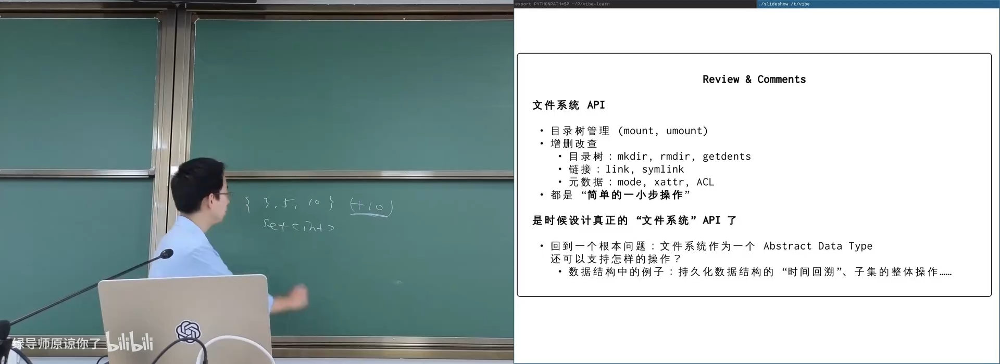

---

## 1. 文件监控：从轮询到事件

### 1.1 用 CRUD 实现监控

*(参考时间: 00:05)*

Web Server 的 debug mode、IDE、文件管理器都需要知道：

> 哪个文件什么时候改变了？

只用 CRUD 也能实现：

```bash
diff \
  <(stat -c '%n %y' **) \
  <(sleep 2; date > a.txt; stat -c '%n %y' **)
```

流程是：

1. 枚举所有文件；
2. 记录修改时间；
3. 等一段时间；
4. 再枚举并比较。

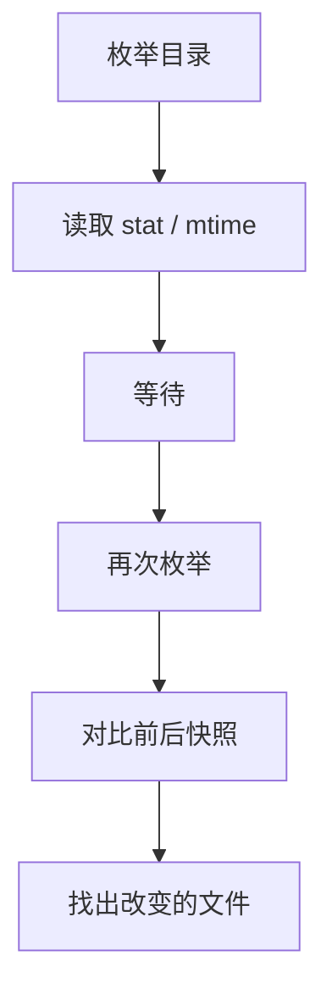
```mermaid
flowchart TD
    A["枚举目录"] --> B["读取 stat / mtime"]
    B --> C["等待"]
    C --> D["再次枚举"]
    D --> E["对比前后快照"]
    E --> F["找出改变的文件"]
```

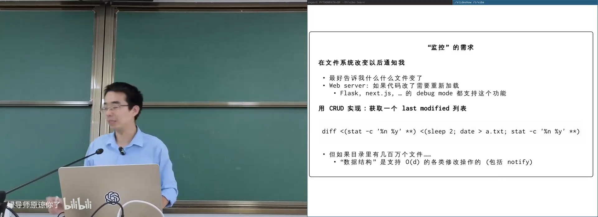

### 1.2 轮询的扩展性问题

*(参考时间: 00:08)*

如果目录里有几百万文件，每次轮询都需要数百万次元数据查询。

即使文件系统缓存让单次查询变快，这种方案仍然浪费：

- CPU；
- 内存带宽；
- 文件系统锁；
- I/O。

真正需要的是由内核主动产生事件。

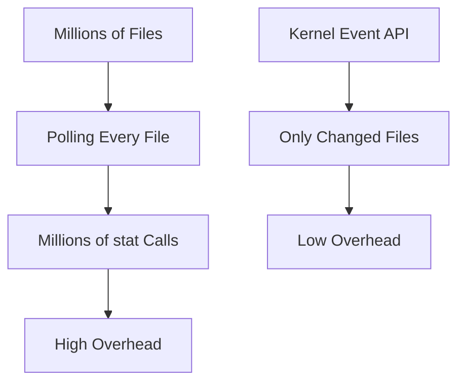
```mermaid
flowchart TD
    A["Millions of Files"] --> B["Polling Every File"]
    B --> C["Millions of stat Calls"]
    C --> D["High Overhead"]
    E["Kernel Event API"] --> F["Only Changed Files"]
    F --> G["Low Overhead"]
```

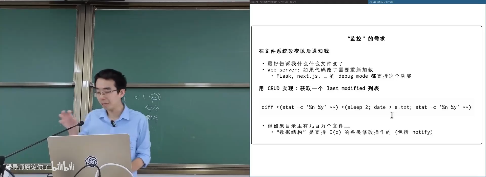

### 1.3 inotify

*(参考时间: 00:09)*

Linux 提供 inotify：

```c
int fd = inotify_init();
int wd = inotify_add_watch(
    fd,
    "/path/to/watch",
    IN_CREATE | IN_MODIFY | IN_DELETE | IN_MOVE
);

struct inotify_event event;
read(fd, &event, sizeof(event));
```

特点：

- `inotify_init()` 返回文件描述符；
- 可以与 `select`、`poll`、`epoll` 一起使用；
- 每个 watch 产生事件；
- 默认不递归监听子目录。

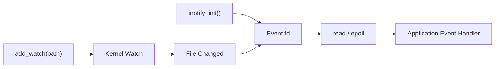
```mermaid
flowchart LR
    A["inotify_init()"] --> B["Event fd"]
    C["add_watch(path)"] --> D["Kernel Watch"]
    D --> E["File Changed"]
    E --> B
    B --> F["read / epoll"]
    F --> G["Application Event Handler"]
```

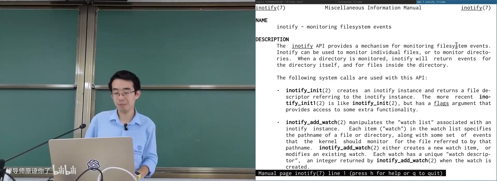

### 1.4 watchdog 实验

*(参考时间: 00:11)*

Python watchdog 封装了 inotify：

```python
observer = Observer()
observer.schedule(event_handler, ".", recursive=True)
observer.start()
```

创建文件时，可以看到多类事件：

1. 新文件 `CREATE`；
2. 新文件 `MODIFY`；
3. 父目录的 `MODIFY`。

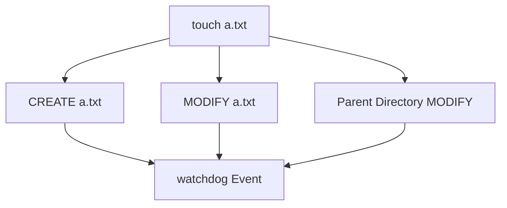
```mermaid
flowchart TD
    A["touch a.txt"] --> B["CREATE a.txt"]
    A --> C["MODIFY a.txt"]
    A --> D["Parent Directory MODIFY"]
    B --> E["watchdog Event"]
    C --> E
    D --> E
```

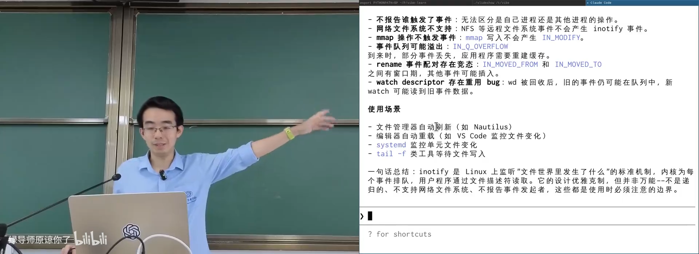

### 1.5 修改时间只向一级目录传播

*(参考时间: 00:12)*

在深层目录中修改文件：

```text
t/1/2/a.txt
```

会更新：

- `a.txt`；
- `2/` 的 mtime。

但不会继续更新：

- `1/`；
- `t/`。

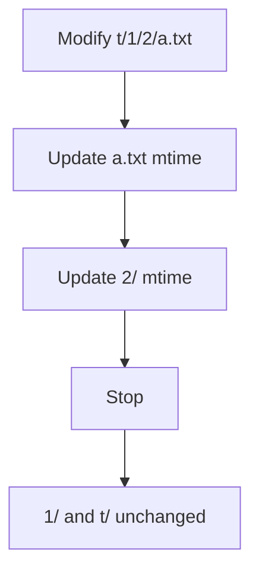
```mermaid
flowchart TD
    A["Modify t/1/2/a.txt"] --> B["Update a.txt mtime"]
    B --> C["Update 2/ mtime"]
    C --> D["Stop"]
    D --> E["1/ and t/ unchanged"]
```

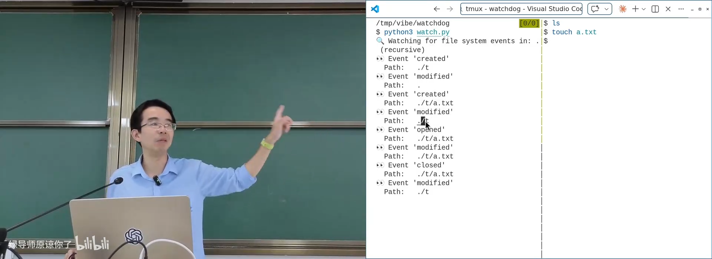

---

## 2. 从监控到可编程内核探针

### 2.1 所有监控都在提取内核执行信息

*(参考时间: 00:14)*

课程列举多种观测工具：

- `strace`：系统调用；
- `ltrace`：库函数；
- inotify：文件系统事件；
- block trace：块设备 I/O；
- profiling：CPU 与缓存行为。

它们都希望回答同一类问题：

```text
内核执行到某个位置时，发生了什么？
```

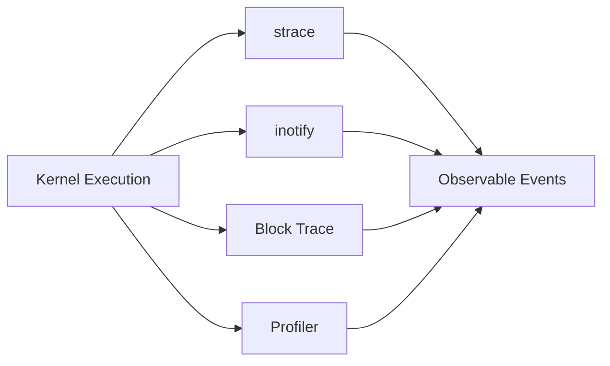
```mermaid
flowchart LR
    A["Kernel Execution"] --> B["strace"]
    A --> C["inotify"]
    A --> D["Block Trace"]
    A --> E["Profiler"]
    B --> F["Observable Events"]
    C --> F
    D --> F
    E --> F
```

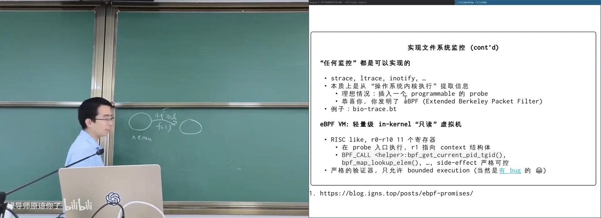

### 2.2 eBPF：可编程的只读内核虚拟机

*(参考时间: 00:16)*

如果允许用户上传一段小程序，并在内核 hook point 执行，就可以定制监控。

这就是 eBPF：

- RISC-like 指令集；
- `r0-r10` 共 11 个寄存器；
- `r0` 为返回值；
- probe 入口的 `r1` 指向 context；
- 可以调用受控 helper。

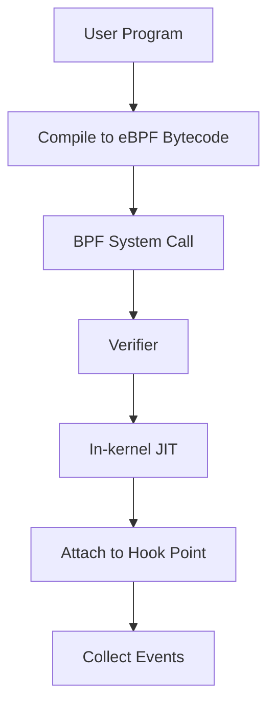
```mermaid
flowchart TD
    A["User Program"] --> B["Compile to eBPF Bytecode"]
    B --> C["BPF System Call"]
    C --> D["Verifier"]
    D --> E["In-kernel JIT"]
    E --> F["Attach to Hook Point"]
    F --> G["Collect Events"]
```

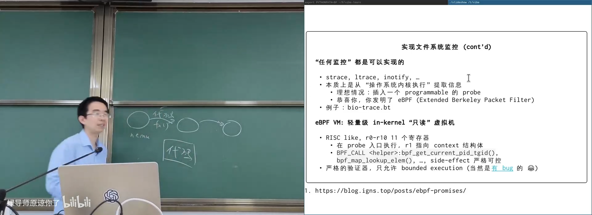

### 2.3 为什么最初为网络而设计

*(参考时间: 00:18)*

网络设备每秒可能到达数百万包，不适合每次都陷入用户态再决定是否丢弃。

防火墙只做少量判断：

```text
if source_ip in blocked_set:
    drop_packet()
```

把这类逻辑放进内核，可以避免频繁上下文切换。

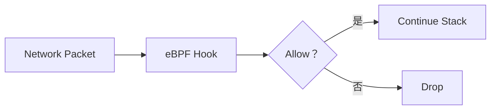
```mermaid
flowchart LR
    A["Network Packet"] --> B["eBPF Hook"]
    B --> C{"Allow？"}
    C -- "是" --> D["Continue Stack"]
    C -- "否" --> E["Drop"]
```

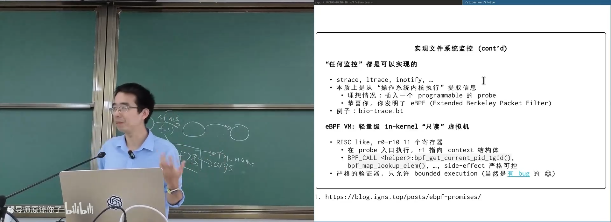

### 2.4 Helper 与 Map

*(参考时间: 00:20)*

eBPF 程序不能随意读写任意内核内存，只能使用受控接口：

```c
bpf_get_current_pid_tgid();
bpf_map_lookup_elem(map, key);
bpf_map_update_elem(map, key, value, flags);
```

需要计数器或历史记录时，使用内核提供的 BPF Map。

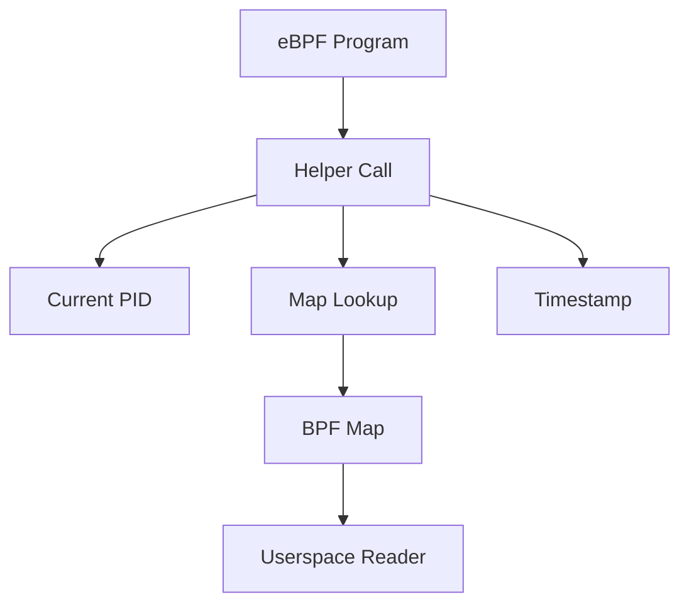
```mermaid
flowchart TD
    A["eBPF Program"] --> B["Helper Call"]
    B --> C["Current PID"]
    B --> D["Map Lookup"]
    B --> E["Timestamp"]
    D --> F["BPF Map"]
    F --> G["Userspace Reader"]
```

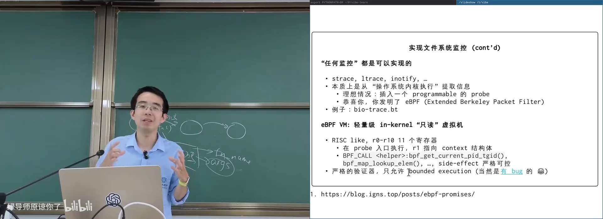

### 2.5 Verifier 与 bounded execution

*(参考时间: 00:21)*

eBPF 验证器要求：

- 程序不能无限循环；
- 访问范围必须有界；
- 类型与寄存器状态合法；
- 只能使用允许的 helper；
- 不能随意改内核数据。

但验证器与优化器本身也可能有 bug。课程提到生产环境中曾出现明确不应被删除的代码被错误优化掉。

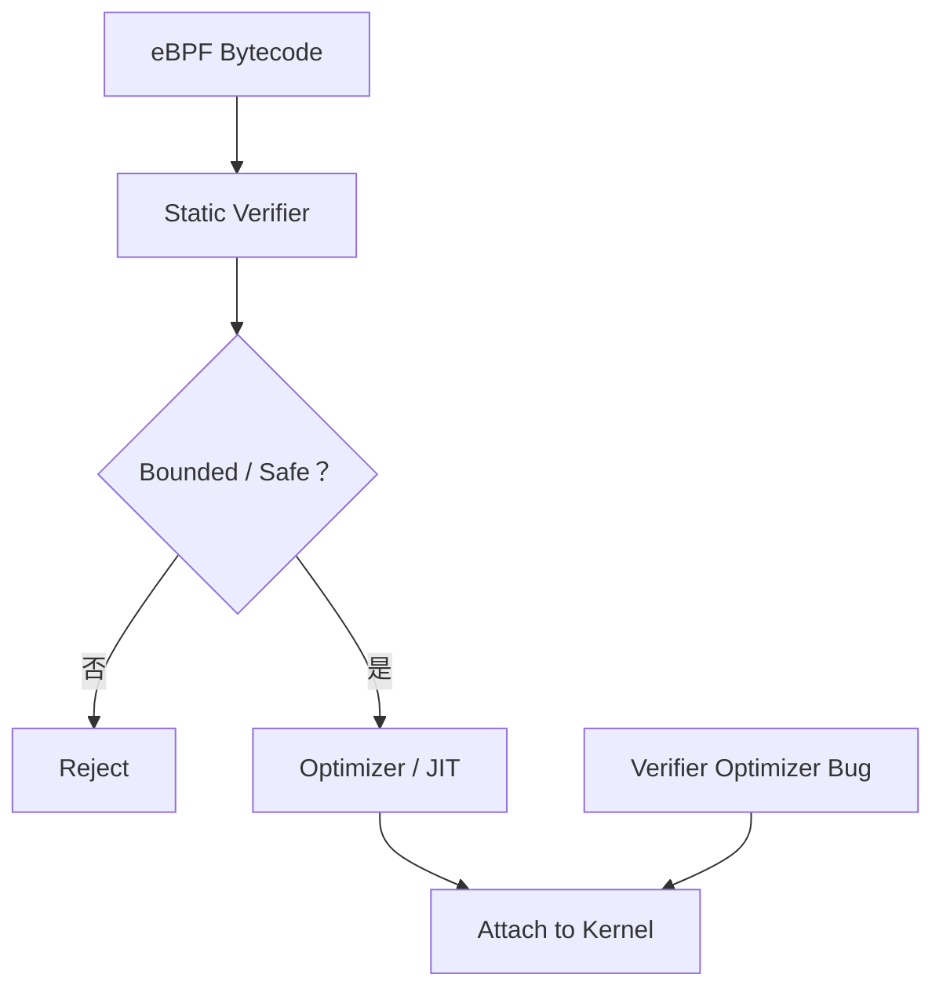
```mermaid
flowchart TD
    A["eBPF Bytecode"] --> B["Static Verifier"]
    B --> C{"Bounded / Safe？"}
    C -- "否" --> D["Reject"]
    C -- "是" --> E["Optimizer / JIT"]
    E --> F["Attach to Kernel"]
    G["Verifier Optimizer Bug"] --> F
```

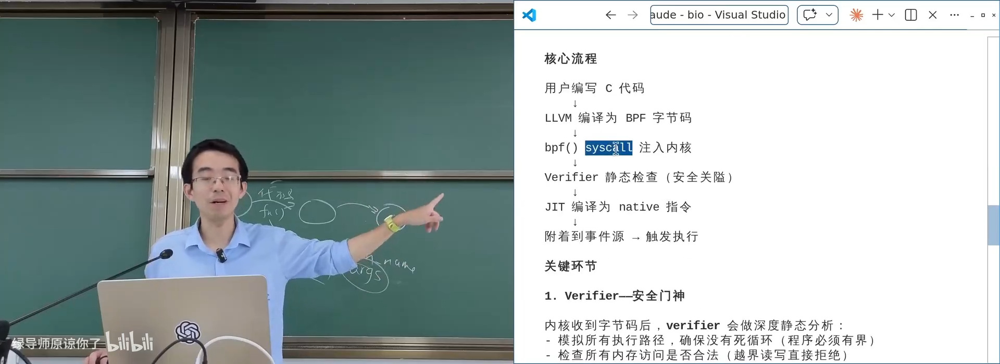

### 2.6 从文件监控到任意内核观测

*(参考时间: 00:23)*

如果 hook 点足够多，就可以组合：

- 键盘与鼠标事件；
- `execve`；
- 文件系统事件；
- 网络事件；
- 块设备 I/O；
- 调度与进程状态。

这可以形成完整行为轨迹，也能用于学习工具与系统诊断。

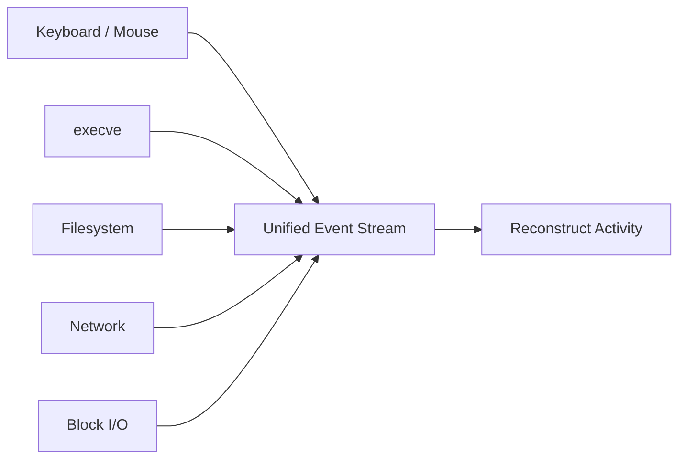
```mermaid
flowchart LR
    A["Keyboard / Mouse"] --> F["Unified Event Stream"]
    B["execve"] --> F
    C["Filesystem"] --> F
    D["Network"] --> F
    E["Block I/O"] --> F
    F --> G["Reconstruct Activity"]
```

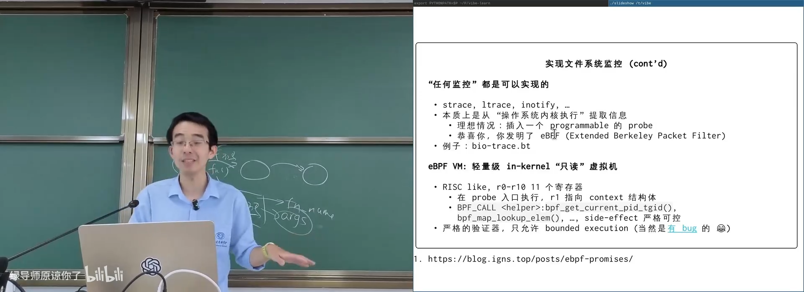

---

## 3. Spec Is All You Need

### 3.1 先写正确但不高效的实现

*(参考时间: 00:26)*

需求可以用一行高开销脚本表达：

```bash
diff <(stat ...) <(sleep 2; modify; stat ...)
```

但它的 Specification 很清楚：

> 当文件改变时，高效地告诉我改变了什么。

然后让 AI 搜索操作系统已有机制，收敛到 inotify、eBPF 或 fanotify。

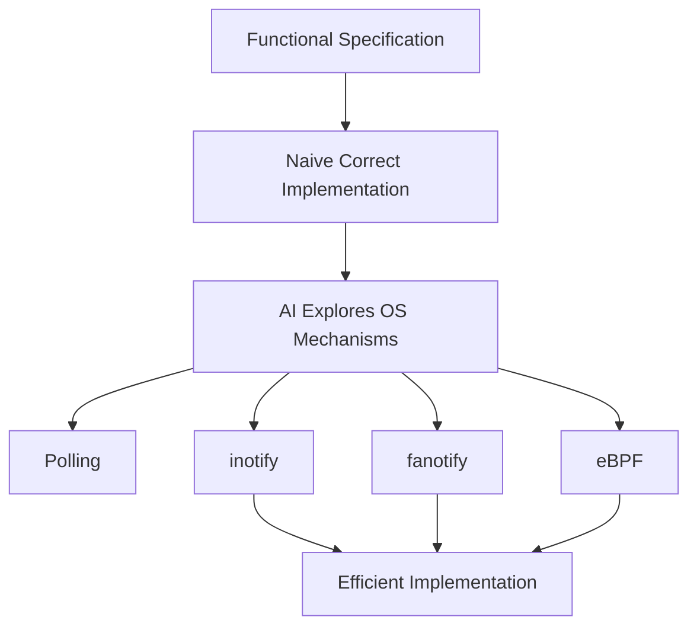
```mermaid
flowchart TD
    A["Functional Specification"] --> B["Naive Correct Implementation"]
    B --> C["AI Explores OS Mechanisms"]
    C --> D1["Polling"]
    C --> D2["inotify"]
    C --> D3["fanotify"]
    C --> D4["eBPF"]
    D2 --> E["Efficient Implementation"]
    D3 --> E
    D4 --> E
```

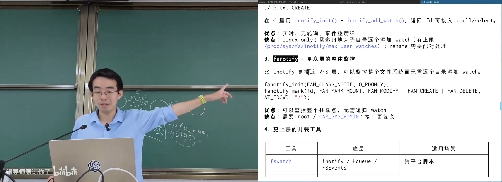

### 3.2 Just-in-Time Systems

*(参考时间: 00:29)*

课程引用 *The time is here for just-in-time systems*：

- 根据环境；
- 根据 workload；
- 根据系统性质；
- 从零合成专用系统。

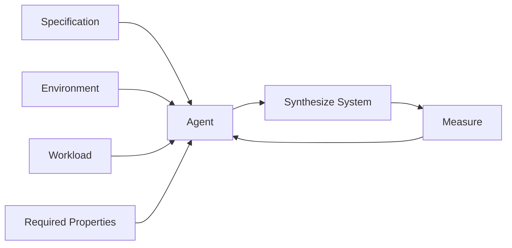
```mermaid
flowchart LR
    A["Specification"] --> B["Agent"]
    C["Environment"] --> B
    D["Workload"] --> B
    E["Required Properties"] --> B
    B --> F["Synthesize System"]
    F --> G["Measure"]
    G --> B
```

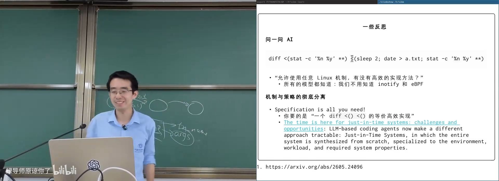

---

## 4. 从持久化数据结构到 Git

### 4.1 路径复制

*(参考时间: 00:31)*

回顾上一讲的核心：

> Random read + append-only write = 任何持久化数据结构。

修改树中一个节点时：

1. 复制从根到该节点的路径；
2. 新节点指向旧树中的共享子树；
3. 旧根保留旧版本；
4. 新根代表新版本。

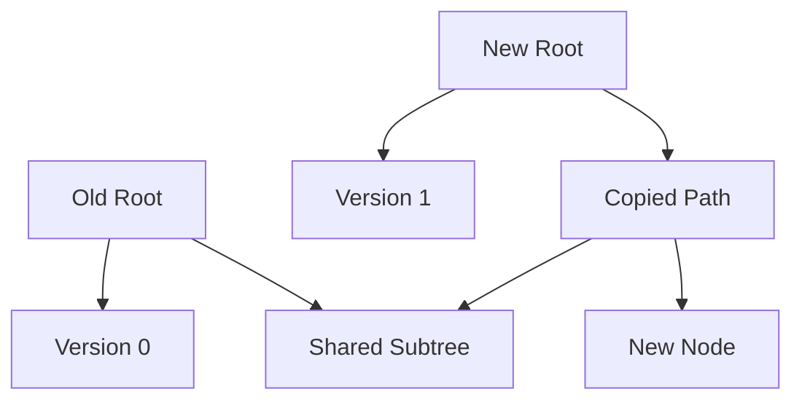
```mermaid
flowchart TD
    A["Old Root"] --> B["Shared Subtree"]
    C["New Root"] --> D["Copied Path"]
    D --> E["New Node"]
    D --> B
    A --> F["Version 0"]
    C --> G["Version 1"]
```

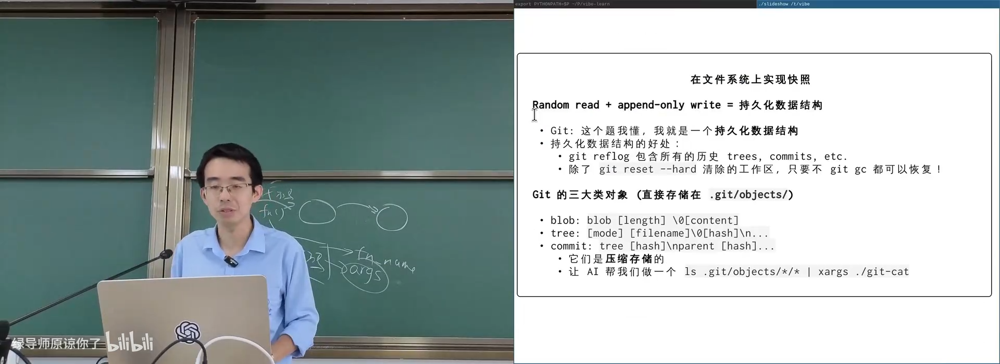

### 4.2 Git 是持久化对象图

*(参考时间: 00:32)*

Git 把自己的所有内容放在 `.git/objects/`：

- **blob**：文件内容；
- **tree**：目录结构、权限与文件名；
- **commit**：root tree、parent、作者和提交信息。

```text
blob [length]\0[content]

tree:
  100644 a.txt\0<blob-hash>
  100755 script\0<blob-hash>

commit:
  tree <hash>
  parent <hash>
  author ...
```

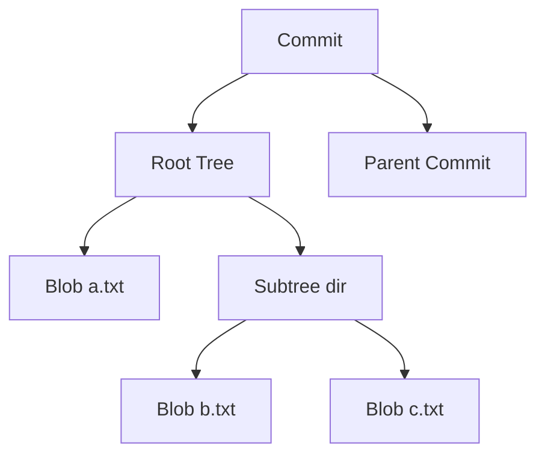
```mermaid
flowchart TD
    A["Commit"] --> B["Root Tree"]
    B --> C1["Blob a.txt"]
    B --> C2["Subtree dir"]
    C2 --> D1["Blob b.txt"]
    C2 --> D2["Blob c.txt"]
    A --> E["Parent Commit"]
```

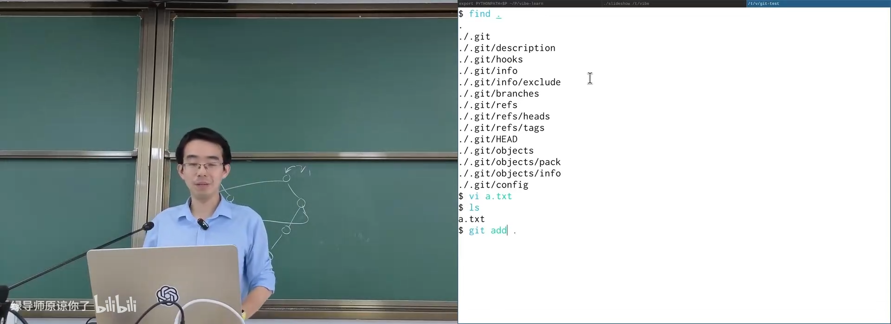

### 4.3 直接阅读 Git Object

*(参考时间: 00:36)*

对象采用压缩存储，但可以写工具解压：

```bash
find .git/objects -type f |
    xargs ./git-cat
```

旧文件与新文件会同时存在：

```text
hello
hello world
```

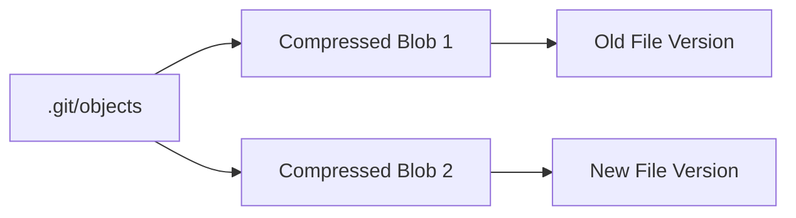
```mermaid
flowchart LR
    A[".git/objects"] --> B["Compressed Blob 1"]
    A --> C["Compressed Blob 2"]
    B --> D["Old File Version"]
    C --> E["New File Version"]
```

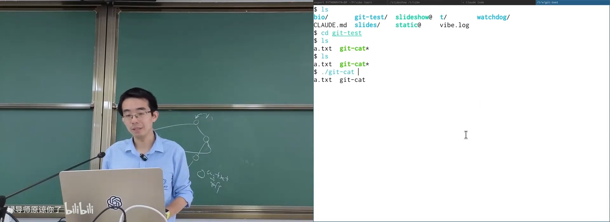

### 4.4 `refs` 与 `HEAD`

*(参考时间: 00:39)*

分支是指向 commit 的文件：

```text
.git/refs/heads/main  →  commit hash
```

`HEAD` 指向分支：

```text
.git/HEAD  →  ref: refs/heads/main
```

因此 `HEAD` 是“指针的指针”。

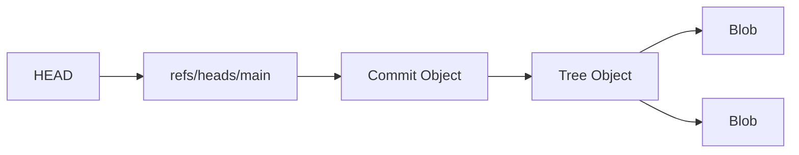
```mermaid
flowchart LR
    H["HEAD"] --> R["refs/heads/main"]
    R --> C["Commit Object"]
    C --> T["Tree Object"]
    T --> B1["Blob"]
    T --> B2["Blob"]
```

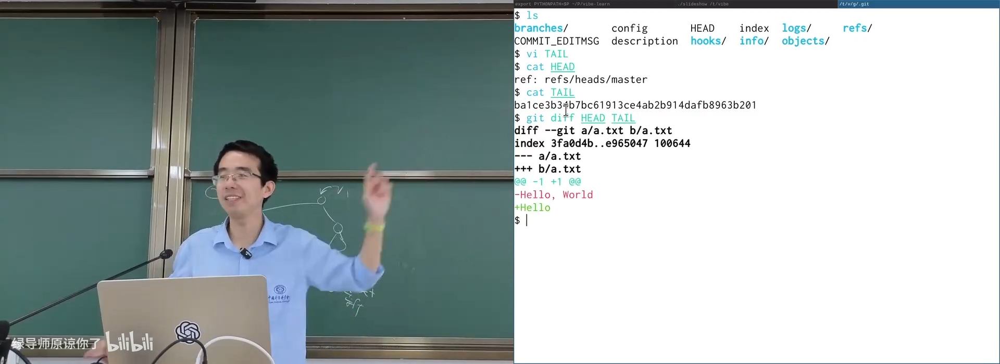

### 4.5 创建自定义 `TAIL`

*(参考时间: 00:40)*

可以手动创建一个引用：

```text
.git/refs/tail  →  old commit hash
git diff HEAD tail
```

这再一次说明 Git 没有隐藏魔法，只是文件与指针。

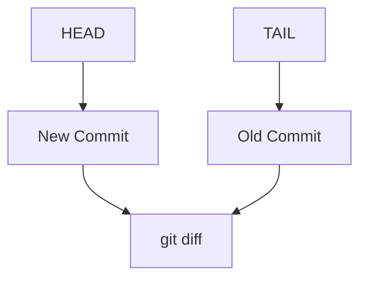
```mermaid
flowchart TD
    A["HEAD"] --> B["New Commit"]
    C["TAIL"] --> D["Old Commit"]
    B --> E["git diff"]
    D --> E
```

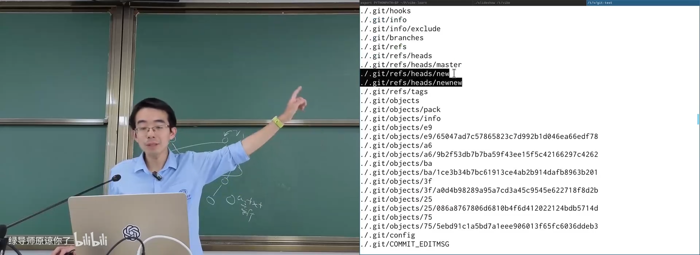

### 4.6 Stash 是带两个 parent 的 commit

*(参考时间: 00:42)*

Stash 不是特殊存储区，而是一串 commit：

```text
stash commit
├── parent 1: HEAD
└── parent 2: previous stash
```

因此可以 `push` / `pop`，形成栈结构。

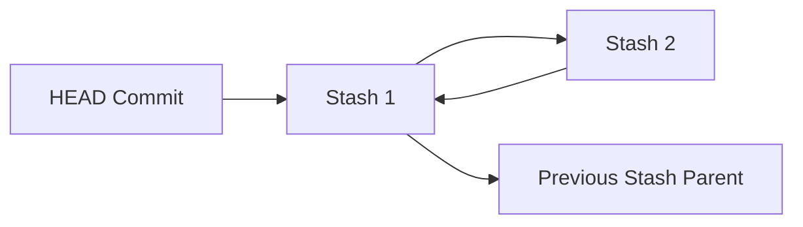
```mermaid
flowchart LR
    H["HEAD Commit"] --> S1["Stash 1"]
    S1 --> S2["Stash 2"]
    S1 --> P2["Previous Stash Parent"]
    S2 --> S1
```

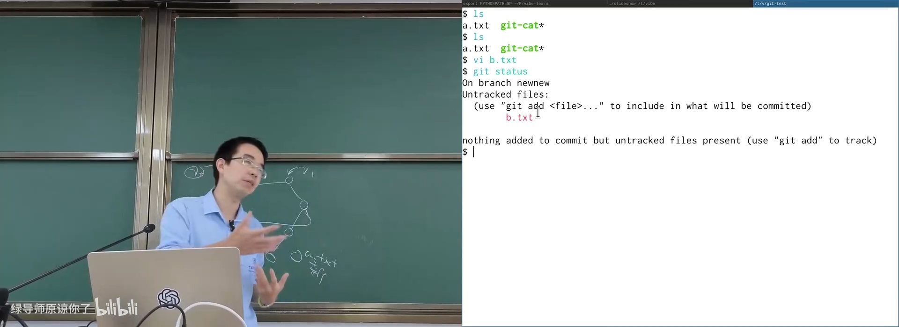

---

## 5. Merge、Cherry-pick 与 Rebase

### 5.1 Merge

*(参考时间: 00:44)*

两条历史：

```text
Local:   CA → A → B
Remote:  CA → C → D
```

普通 merge 创建 `E`：两个 parent 分别指向 `B` 与 `D`。

```mermaid
flowchart TD
    CA["Common Ancestor"] --> A
    A --> B
    CA --> C
    C --> D
    B --> E["Merge Commit"]
    D --> E
```

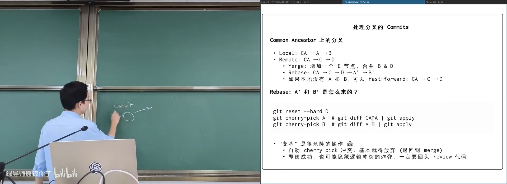

### 5.2 Fast-forward

*(参考时间: 00:47)*

如果本地没有 `A`、`B`，远端直接包含本地历史，就只需移动分支指针：

```text
CA → C → D
```

```mermaid
flowchart LR
    A["CA"] --> B["C"] --> C["D"]
    D["D"] --> E["Local Branch Pointer"]
```

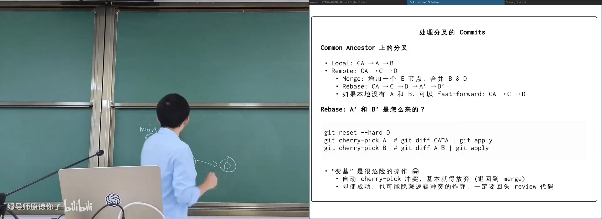

### 5.3 Cherry-pick

*(参考时间: 00:48)*

一个 commit 可以视为一个 diff：

```text
diff = tree(A) → tree(B)
```

Cherry-pick 把该 diff 应用到另一条历史，生成新的 commit，而不是复制原 commit hash。

```mermaid
flowchart LR
    A["Commit A"] --> B["Commit B"]
    A --> D["diff A→B"]
    B --> D
    D --> C["Apply to Target Branch"]
    C --> E["New Commit B'"]
```

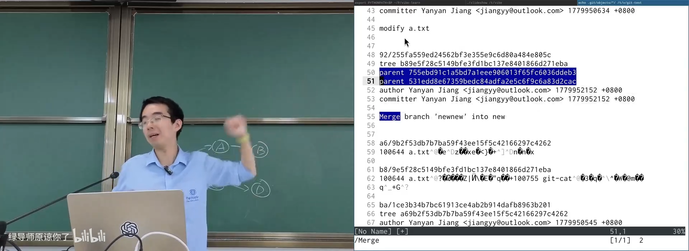

### 5.4 Rebase

*(参考时间: 00:50)*

Rebase：

1. 切换到远端 `C`、`D`；
2. 把 `CA→A` 的 diff 应用为新 `A'`；
3. 把 `A→B` 的 diff 应用为新 `B'`；
4. 丢掉旧 `A`、`B` 的引用。

```mermaid
flowchart LR
    A["Local A → B"] --> D1["diff 1: CA→A"]
    A --> D2["diff 2: A→B"]
    C["Remote C → D"] --> R1["A'"]
    D1 --> R1
    R1 --> R2["B'"]
    D2 --> R2
```

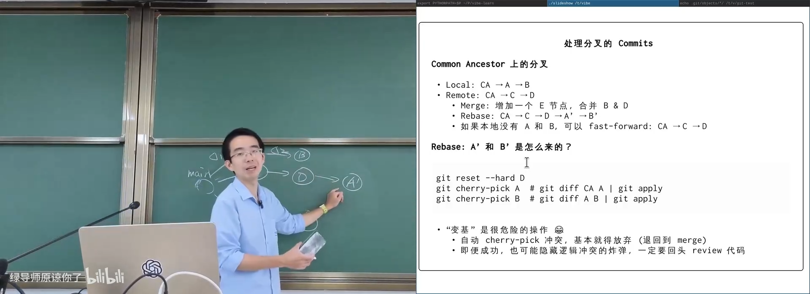

### 5.5 Rebase 的风险

*(参考时间: 00:51)*

Rebase 可能隐藏逻辑冲突：

- 文件层面没有冲突；
- 语义却已矛盾；
- 必须重新 review 每个重放后的 diff；
- 多处冲突时回退到 merge 往往更安全。

```mermaid
flowchart TD
    A["Automatic Rebase"] --> B{"Text Conflict？"}
    B -- "是" --> C["Painful Resolution"]
    B -- "否" --> D["Rewrite Succeeded"]
    D --> E{"Logical Conflict？"}
    E -- "可能" --> F["Manual Review Required"]
```

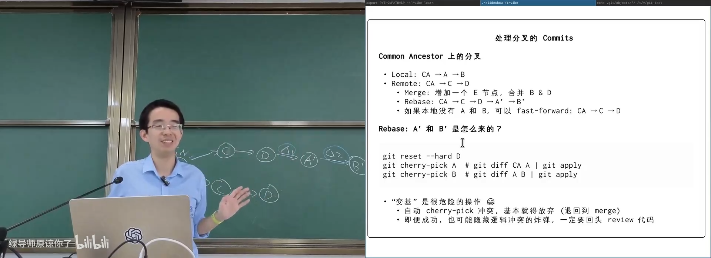

---

## 6. Git Worktree：持久化结构带来的“免费复制”

### 6.1 Git 最初是单工作区模型

*(参考时间: 00:53)*

Git 类似早期 UNIX：

- 一个 worktree；
- 一个 HEAD；
- 线性提交；
- 需要临时切换时使用 stash。

频繁、多任务切换会造成 stash 地狱。

```mermaid
flowchart TD
    A["Current Work"] --> B["stash"]
    B --> C["Checkout Hotfix"]
    C --> D["Work Halfway"]
    D --> E["stash Again"]
    E --> F["Stash Stack Grows"]
```

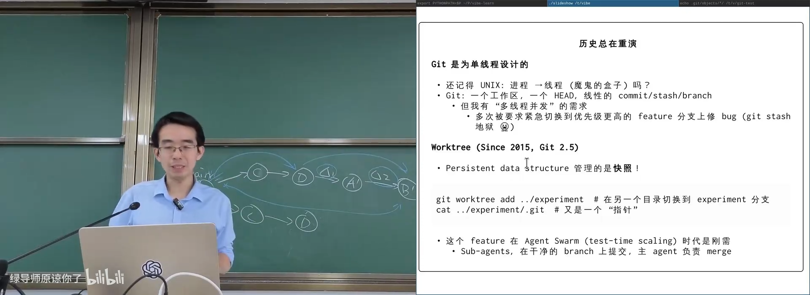

### 6.2 Worktree

*(参考时间: 00:55)*

创建第二个工作目录：

```bash
git worktree add ../hotfix hotfix
```

新目录中的 `.git` 不是完整对象库，而是一个文本指针：

```text
gitdir: /main/repo/.git/worktrees/hotfix
```

所有版本对象共享，只有工作区和引用不同。

```mermaid
flowchart LR
    O["Shared .git/objects"] --> W1["Worktree main"]
    O --> W2["Worktree hotfix"]
    O --> W3["Worktree agent-1"]
    W1 --> R1["HEAD 1"]
    W2 --> R2["HEAD 2"]
    W3 --> R3["HEAD 3"]
```

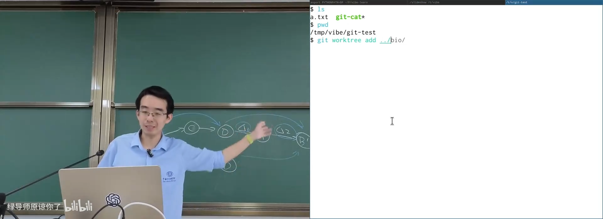

### 6.3 Agent Swarm 时代

*(参考时间: 00:57)*

多个 Agent 可以：

1. 在独立 worktree 工作；
2. 在干净分支上提交；
3. 主 Agent 负责合并；
4. 减少相互污染。

```mermaid
flowchart TD
    M["Main Agent"] --> A1["Sub-agent Worktree 1"]
    M --> A2["Sub-agent Worktree 2"]
    M --> A3["Sub-agent Worktree 3"]
    A1 --> R1["Branch 1"]
    A2 --> R2["Branch 2"]
    A3 --> R3["Branch 3"]
    R1 --> M
    R2 --> M
    R3 --> M
```

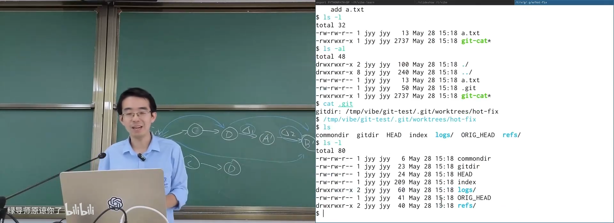

---

## 7. 文件系统级快照

### 7.1 Btrfs Copy-on-Write

*(参考时间: 00:58)*

Btrfs 使用 B-tree 和 copy-on-write：

- 修改数据不覆盖旧块；
- 新根指向新数据；
- 旧根仍指向旧数据；
- 创建快照只需记录旧根。

```mermaid
flowchart TD
    A["Current Root"] --> B["B-tree"]
    C["Snapshot Root"] --> B
    B --> D1["Shared Old Blocks"]
    A --> E["New Blocks"]
    E --> F["Updated B-tree"]
```

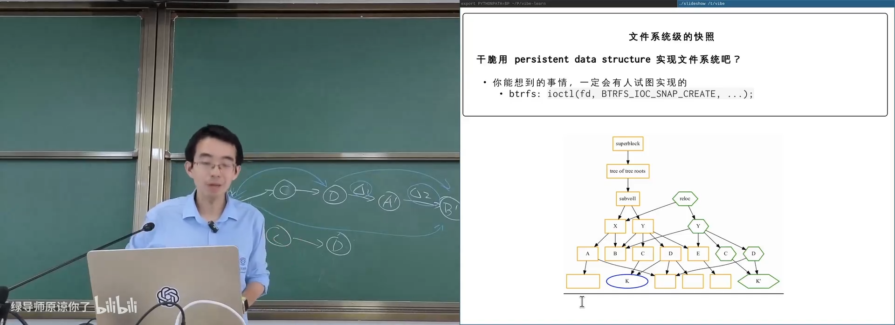

### 7.2 Snapshot ioctl

*(参考时间: 00:59)*

```c
ioctl(fd, BTRFS_IOC_SNAP_CREATE, &args);
```

创建快照本质上只是记录一个 root 指针。

```mermaid
flowchart LR
    A["Open Filesystem FD"] --> B["BTRFS_IOC_SNAP_CREATE"]
    B --> C["Record Current Root"]
    C --> D["Snapshot Visible"]
```

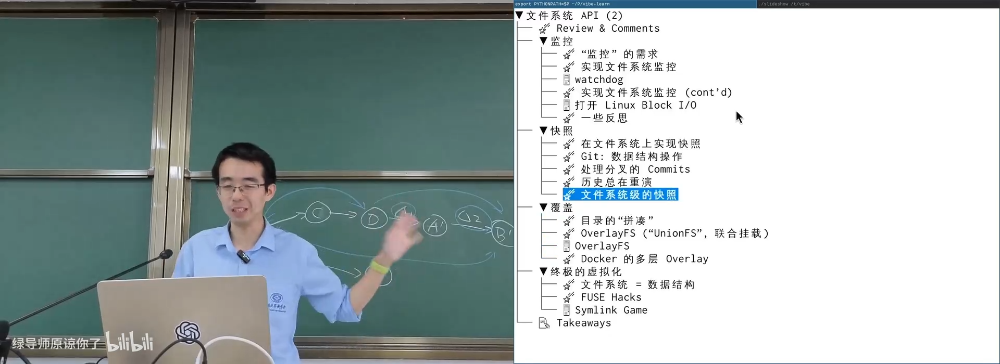

---

## 8. OverlayFS：把目录叠加起来

### 8.1 Union 的基本语义

*(参考时间: 01:01)*

OverlayFS 把：

- 一个 upper；
- 一个或多个 lower；

合并成一个虚拟目录。

查找规则：

1. 先看 upper；
2. 没有再看 lower；
3. 写入只修改 upper；
4. lower 保持不变。

```mermaid
flowchart TD
    A["lookup merged/a.txt"] --> B{"upper/a.txt exists？"}
    B -- "是" --> C["Use upper version"]
    B -- "否" --> D{"lower/a.txt exists？"}
    D -- "是" --> E["Use lower version"]
    D -- "否" --> F["Not Found"]
```

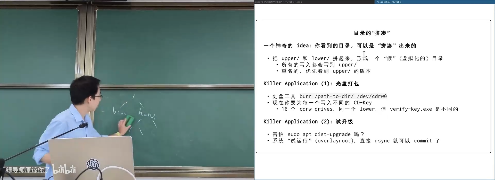

### 8.2 Killer App：并行刻盘与不同 CD Key

*(参考时间: 01:03)*

同一份 600 MB 内容需要写入 16 张盘，每张只多一个不同 CD Key：

```text
15 × lower 共享 600MB
16 × upper 各放 CDKey.exe
```

```mermaid
flowchart LR
    L["Shared Lower 600MB"] --> M1["Merged CD 1"]
    L --> M2["Merged CD 2"]
    L --> M3["Merged CD 16"]
    U1["Upper CDKey 1"] --> M1
    U2["Upper CDKey 2"] --> M2
    U3["Upper CDKey 16"] --> M3
```

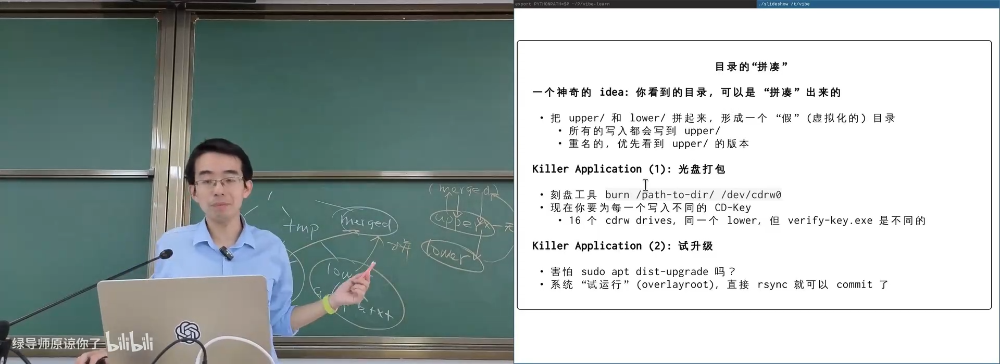

### 8.3 Killer App：试升级

*(参考时间: 01:05)*

把系统根作为 lower，在另一个磁盘创建空 upper，执行危险升级：

```text
lower = old rootfs
upper = new disk
merged = /
```

升级失败时丢弃 upper；成功时再同步到真实系统。

```mermaid
flowchart TD
    A["Old Root as Lower"] --> C["Merged Root"]
    B["Empty Upper on New Disk"] --> C
    C --> D["Run apt dist-upgrade"]
    D --> E{"Success？"}
    E -- "否" --> F["Discard Upper"]
    E -- "是" --> G["Commit Changes"]
```

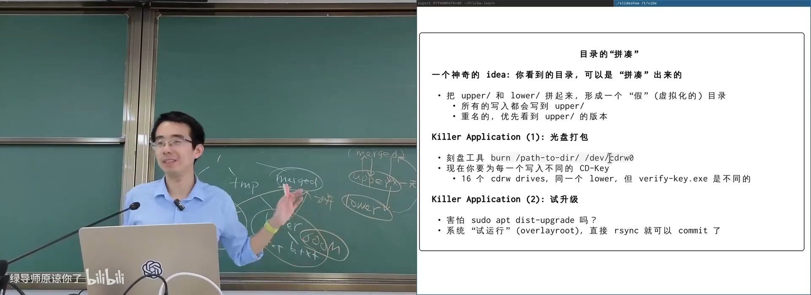

### 8.4 Mount OverlayFS

*(参考时间: 01:08)*

```bash
mount -t overlay overlay \
  -o lowerdir=L1:L2:...,upperdir=U,workdir=W \
  merged/
```

规则：

- 多个 lower；
- 只允许一个 upper；
- workdir 是内部临时空间；
- workdir 必须为空。

```mermaid
flowchart LR
    L1["Lower L1"] --> M["Merged"]
    L2["Lower L2"] --> M
    U["Upper U"] --> M
    W["Workdir W"] --> M
```

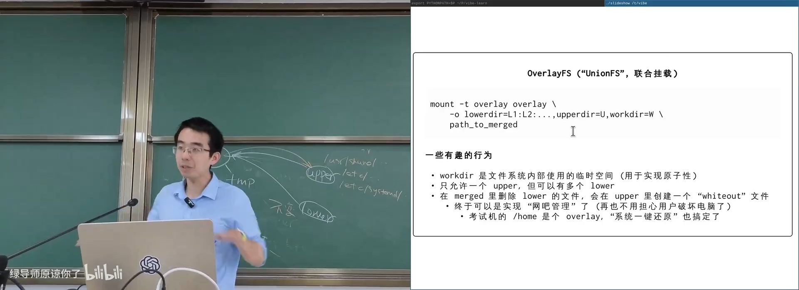

### 8.5 Whiteout

*(参考时间: 01:10)*

删除 lower 中的文件不能在 lower 中改数据，因此 upper 会创建 whiteout：

```text
lower/lower.txt
    ↓ delete in merged
upper/.wh.lower.txt
```

merged 中文件消失，但 lower 保持不变。

```mermaid
flowchart TD
    A["Delete merged/lower.txt"] --> B["Create Whiteout in Upper"]
    B --> C["Merged Hides File"]
    D["Lower File"] --> E["Still Unchanged"]
```

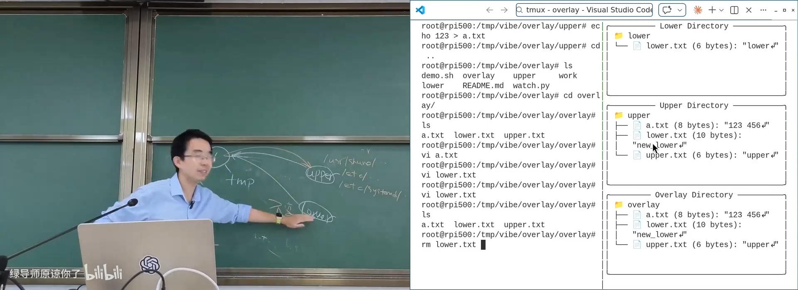

### 8.6 考试机与网吧管理

*(参考时间: 01:11)*

系统根和 home 作为 lower，每场考试或每个用户分配不同 upper：

- 用户看不到上一场的数据；
- 重启或换 upper 即恢复干净环境；
- 管理员仍保留真实 upper 用于审计。

```mermaid
flowchart TD
    S["System Lower"] --> M1["Morning Exam"]
    S --> M2["Afternoon Exam"]
    U1["Morning Upper"] --> M1
    U2["Afternoon Upper"] --> M2
    M1 --> A["Admin Audit"]
    M2 --> A
```

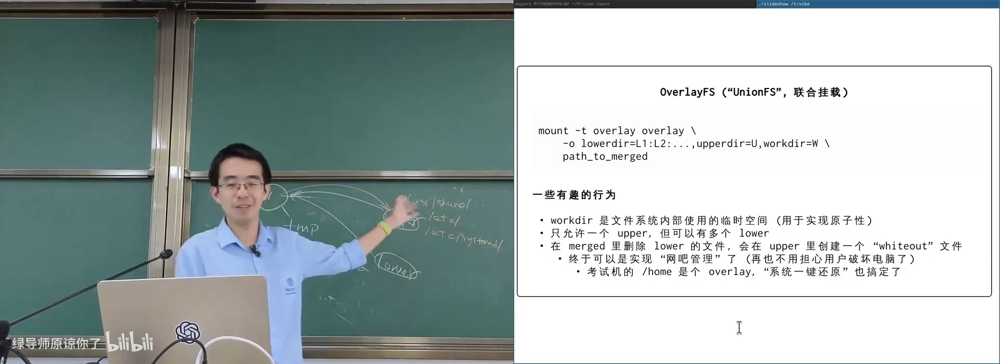

---

## 9. Docker Layer

*(参考时间: 01:12)*

Dockerfile：

```dockerfile
FROM ubuntu:22.04
RUN apt-get update
RUN apt-get install -y software-a
RUN apt-get install -y software-b
```

每个 `RUN`：

1. 把之前的镜像作为 lower；
2. 创建空 upper；
3. 在容器内执行命令；
4. 把 upper 提交成新 layer；
5. 新 layer 成为下一次构建的 lower。

```mermaid
flowchart TD
    A["Base Image Layer"] --> B["RUN apt update"]
    B --> C["Update Layer"]
    C --> D["RUN install A"]
    D --> E["Software A Layer"]
    E --> F["RUN install B"]
    F --> G["Software B Layer"]
```

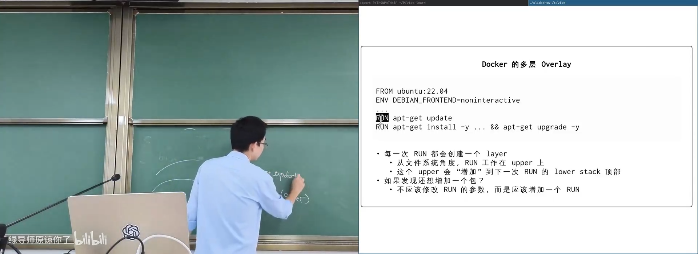

如果忘记安装软件，正确方式是在末尾增加新的 `RUN`，而不是修改早期 `RUN`，因为后者会让后续所有 layer cache 失效。

```mermaid
flowchart LR
    A["Existing Layers"] --> B["New RUN"]
    B --> C["Additional Layer"]
    C --> D["Updated Image"]
    E["Edit Old RUN"] --> F["Invalidate All Later Layers"]
```

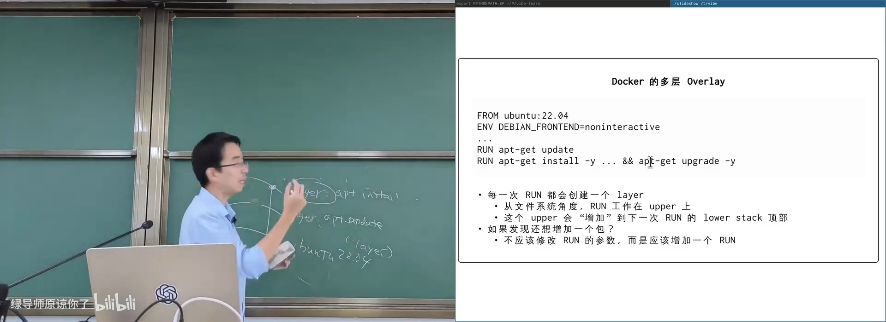

---

## 10. FUSE：在用户态实现文件系统

### 10.1 内核把操作转发给用户态

*(参考时间: 01:16)*

FUSE 提供 `struct fuse_operations`：

```c
struct fuse_operations {
    int (*getattr)(const char *, struct stat *);
    int (*readdir)(...);
    int (*open)(const char *, struct fuse_file_info *);
    int (*read)(...);
    int (*write)(...);
    int (*setxattr)(...);
    // ...
};
```

内核收到文件操作后，把请求转发到 FUSE daemon，daemon 可以返回任意计算得到的结果。

```mermaid
flowchart LR
    A["Application"] --> B["VFS"]
    B --> C["FUSE Kernel Module"]
    C --> D["FUSE Daemon"]
    D --> E["Custom Logic / Database / Network"]
    E --> D
    D --> C
    C --> A
```

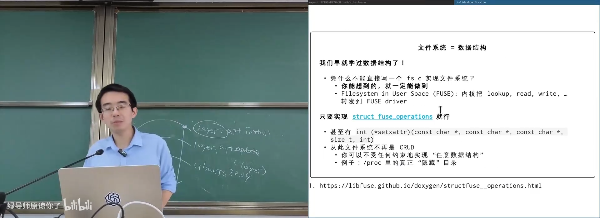

### 10.2 GGFS：Galgame 文件系统

*(参考时间: 01:18)*

课程实现了一个 GGFS：

- 目录和文件由程序即时生成；
- 读取文件触发自定义逻辑；
- 写入任意文件驱动剧情状态；
- 不要求背后有真实的磁盘文件。

```mermaid
flowchart TD
    A["Read GGFS File"] --> B["Generate Synthetic Data"]
    C["Write GGFS File"] --> D["Update Game State"]
    D --> E["Rebuild Virtual Directory"]
    E --> F["Files Change"]
```

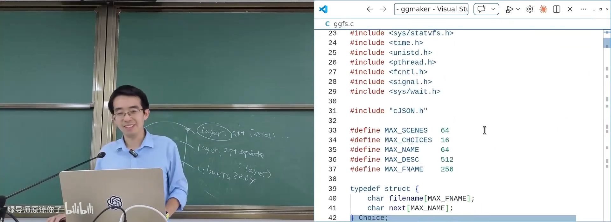

### 10.3 用 FUSE 映射任意后端

*(参考时间: 01:20)*

示例：

- `sshfs`：远程 SSH 目录；
- `aitfs`：远程 Git 仓库；
- `dbfs`：数据库作为文件系统后端；
- `ffs`：JSON 或其他数据源变成文件系统；
- GGFS：游戏状态变成文件系统。

```mermaid
flowchart LR
    A["SSH"] --> F["FUSE"]
    B["Git"] --> F
    C["Database"] --> F
    D["JSON"] --> F
    E["Custom State Machine"] --> F
    F --> G["Ordinary Files and Directories"]
```

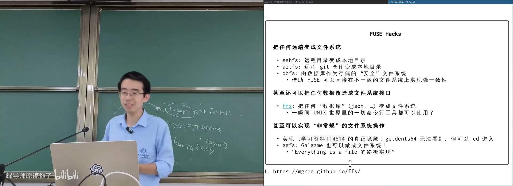

### 10.4 非常规文件系统行为

*(参考时间: 01:21)*

FUSE 可以违背普通文件系统的直觉：

- `getdents64` 看不到某个目录；
- 知道名字的程序仍可 `cd` 进入；
- 读取返回随机或生成数据；
- 写入任何文件都能改变内部状态；
- 文件系统可以是一个状态机。

```mermaid
flowchart TD
    A["Virtual Directory"] --> B{"List Directory?"}
    B -- "是" --> C["Hide Secret Entry"]
    B -- "否" --> D{"Know Exact Name？"}
    D -- "否" --> E["Not Found"]
    D -- "是" --> F["Return Virtual Node"]
```

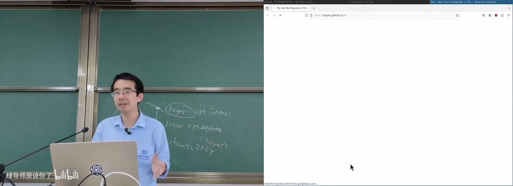

### 10.5 Symlink Game

*(参考时间: 01:21)*

符号链接也可以构造任意有向图：

```text
a → b
b → c
c → a
```

操作系统会按照路径解析规则逐段解析，这再次说明“文件系统机制”可以被当作创作空间。

```mermaid
flowchart LR
    A["Room A"] --> B["Room B"]
    B --> C["Room C"]
    C --> D["Ending"]
    C --> A
```

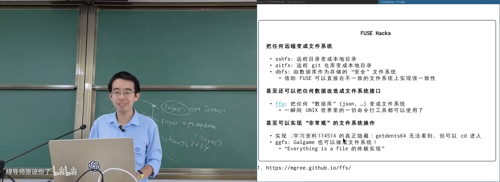

---

## 11. 总结：All You Need Is a Data Structure

如果摆脱“文件系统只能是块设备上的固定结构”这一固有印象，把它看作 ADT，就可以自由设计操作：

- inotify 提供事件监控；
- eBPF 提供可编程内核探针；
- Git 用持久化 object graph 实现历史与分支；
- Btrfs 通过 CoW 提供文件系统快照；
- OverlayFS 把多个目录组合成一个虚拟目录；
- Docker 用多层 Overlay 构建不可变镜像；
- FUSE 允许在用户态实现任意文件系统。

```mermaid
flowchart LR
    A["Filesystem = ADT"] --> B["Monitor"]
    A --> C["Snapshot"]
    A --> D["Overlay"]
    A --> E["FUSE"]
    B --> F["Unbounded OS Mechanisms"]
    C --> F
    D --> F
    E --> F
```

核心结论：

> 文件系统不是一组必须照本宣科实现的系统调用，而是一个可以被重新设计的数据结构。只要机制足够通用，想象力就是接口的边界。

---

## 附：官方参考与延伸阅读

- [watchdog 文件监控实验](https://jyywiki.cn/OS/demos/persistence/watchdog)
- [watchdog 项目](https://github.com/gorakhargosh/watchdog)
- [eBPF Promises 与其验证器问题](https://blog.igns.top/posts/ebpf-promises/)
- [Linux Block I/O eBPF 实验](https://jyywiki.cn/OS/demos/persistence/bio)
- [The time is here for just-in-time systems](https://arxiv.org/abs/2605.24096)
- [OverlayFS 实验](https://jyywiki.cn/OS/demos/persistence/overlay)
- [libfuse `fuse_operations` 文档](https://libfuse.github.io/doxygen/structfuse__operations.html)
- [ffs：把任意数据变成文件系统](https://mgree.github.io/ffs/)
- [Symlink Game](https://jyywiki.cn/OS/demos/persistence/ggmaker)

官方课程资料：

- [课程主页](https://jyywiki.cn/OS/2026/)
- [第 25 讲讲义：文件系统 API (2)](https://jyywiki.cn/OS/2026/lect25.md)
- [视频：25 - 文件系统 API (2)](https://www.bilibili.com/video/BV12gVs6SExQ/)

> **版权与署名**：本讲课程材料由蒋炎岩（jyy）编写。课程讲义与幻灯片采用 [Creative Commons BY-NC 4.0](http://creativecommons.org/licenses/by-nc/4.0/) 许可；本电子书保留课程出处、作者署名与许可说明。
